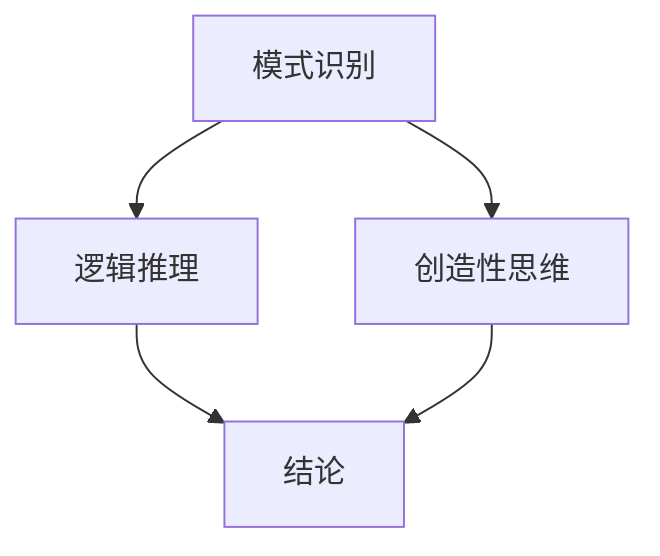

                 

# 数学直觉与问题解决策略的选择

## 引言

数学直觉是指人们在数学领域中所展现出的那种迅速而准确地理解和解决问题的能力。它不仅涉及到数学知识的掌握，还涉及到数学思维的运用。问题解决策略，则是在面对各种复杂问题时，采取的一系列有效的方法和技巧。选择合适的解决策略，可以帮助我们更高效地解决问题。

本文将围绕数学直觉与问题解决策略的选择展开讨论。首先，我们会介绍数学直觉的概念与特征，接着探讨问题解决策略的介绍，然后分析不同问题解决策略的应用。在接下来的章节中，我们将深入探讨数学直觉与问题解决策略的选择，并通过实际案例来展示它们的应用。最后，我们将总结与展望，讨论主要发现、研究局限以及未来的研究方向。

## 数学直觉的概念与特征

### 定义

数学直觉通常被描述为一种快速识别数学模式、关系和结构的能力。这种能力可以帮助人们在没有明确公式或规则的情况下，快速解决问题。数学直觉不仅仅是对数学知识的记忆，更是对数学原理和思维方式的深刻理解。

### 特点

1. **快速性**：数学直觉通常能够在极短的时间内识别出问题的核心和关键点，从而迅速找到解决方案。
2. **准确性**：数学直觉在解决问题时具有较高的准确性，很少出现错误的判断。
3. **关联性**：数学直觉能够将看似不相关的数学概念和问题联系起来，从而发现新的解决方案。
4. **创造性**：数学直觉往往能够引导人们发现新的数学理论和问题。

### 分类

数学直觉可以根据其应用场景和特点进行分类，常见的分类方法包括：

1. **数学推理直觉**：这种直觉侧重于逻辑推理和证明，是数学家解决难题的重要工具。
2. **数学探索直觉**：这种直觉侧重于探索新的数学领域和问题，是数学家进行创新的重要能力。
3. **数学建模直觉**：这种直觉侧重于将实际问题转化为数学模型，是工程师和科学家解决复杂问题的重要技能。

### 核心概念与联系

数学直觉的核心概念包括模式识别、逻辑推理、创造性思维等。这些概念之间相互关联，共同构成了数学直觉的完整体系。

- **模式识别**：这是数学直觉的基础，能够帮助人们快速识别数学问题和解决方案。
- **逻辑推理**：这是数学直觉的核心，能够帮助人们通过逻辑推理得出结论。
- **创造性思维**：这是数学直觉的高级表现，能够帮助人们发现新的数学理论和问题。

使用Mermaid流程图来展示这些概念之间的关系：

通过这个流程图，我们可以清晰地看到数学直觉的核心概念及其之间的联系。

## 问题解决策略的介绍

### 传统问题解决策略

传统问题解决策略主要包括以下几种：

1. **试错法**：通过不断地尝试和错误来找到解决方案。
2. **分析归纳法**：通过对问题的分析，归纳出一般性的解决方案。
3. **演绎法**：从一般性的原理出发，推导出特定的解决方案。

这些传统方法虽然简单易行，但在面对复杂问题时往往效率较低。

### 现代问题解决策略

现代问题解决策略则更加多样化和高效，主要包括以下几种：

1. **算法设计**：通过设计特定的算法来解决问题。
2. **人工智能**：利用机器学习和人工智能技术来模拟人类思维，解决问题。
3. **建模与仿真**：通过建立数学模型和仿真实验来分析问题，找到解决方案。

这些方法在处理复杂问题时具有显著的优势。

### 问题解决策略的比较

| 方法             | 优点                                                     | 缺点                                                     |
|------------------|--------------------------------------------------------|--------------------------------------------------------|
| 试错法           | 简单易行，适用于简单的、非结构化问题                     | 效率低，难以处理复杂问题                               |
| 分析归纳法       | 能够发现问题的规律性，适用于结构化问题                   | 需要较高的分析能力，适用于范围较窄的问题               |
| 演绎法           | 从一般到特殊，逻辑性强，适用于理论问题                   | 需要高度抽象，适用性有限                               |
| 算法设计         | 高效，适用于复杂问题                                   | 需要深厚的算法知识，设计复杂                             |
| 人工智能         | 自动化，高效，适用于大规模数据处理                       | 需要大量数据训练，可能存在过拟合问题                   |
| 建模与仿真       | 可重复性高，适用于复杂系统分析                         | 需要建立准确的数学模型，可能存在模型误差                 |

通过这个表格，我们可以清晰地看到各种问题解决策略的优点和缺点，从而根据具体问题选择最合适的策略。

## 不同问题解决策略的应用

### 数学直觉在数学推理中的应用

数学直觉在数学推理中的应用最为典型。数学家们常常凭借直觉快速识别出问题的核心，找到解决问题的突破口。例如，在解决复杂的数学问题时，数学家们往往能够迅速发现关键变量或方程，从而简化问题。

### 数学直觉在数学探索中的应用

数学直觉在数学探索中也发挥着重要作用。数学家们通过直觉发现新的数学问题和领域，推动数学的发展。例如，数学家希尔伯特凭借直觉发现了四色问题的不可解性，这一发现为现代数学的发展奠定了基础。

### 数学直觉在数学建模中的应用

数学直觉在数学建模中的应用同样不可忽视。在将实际问题转化为数学模型时，数学家们需要运用直觉来判断哪些变量和关系是关键的，哪些可以忽略。这种直觉可以帮助他们建立更准确和高效的数学模型。

### 应用实例

#### 数学推理实例

例如，在解决费马大定理时，安德鲁·怀尔斯凭借数学直觉，迅速识别出问题的关键，并找到了证明的突破口。他的直觉使他能够在短时间内破解这一困扰数学界长达几个世纪的难题。

#### 数学探索实例

再如，数学家格罗滕迪克通过直觉发现了范畴论，这一全新的数学领域。他的直觉引导他探索了数学的深层次结构，为现代数学的发展做出了巨大贡献。

#### 数学建模实例

在经济学中，数学家们运用直觉建立了许多重要的数学模型，如博弈论模型、经济增长模型等。这些模型不仅帮助经济学家们更好地理解经济现象，还为政策制定提供了重要依据。

## 数学直觉与问题解决策略的选择

### 选择标准

选择合适的解决策略需要考虑以下几个标准：

1. **问题的复杂性**：对于复杂的问题，通常需要采用更复杂的问题解决策略。
2. **解决问题的效率**：选择能更快解决问题的策略，可以提高工作效率。
3. **问题的类型**：不同的问题类型需要采用不同的问题解决策略。
4. **资源的限制**：资源的限制会影响问题解决策略的选择。

### 选择流程

选择问题解决策略的流程通常包括以下几个步骤：

1. **明确问题**：首先需要明确问题的具体内容和要求。
2. **分析问题**：对问题进行分析，确定问题的复杂性和类型。
3. **选择策略**：根据问题的特点和标准，选择最合适的问题解决策略。
4. **评估策略**：评估所选策略的可行性，并根据评估结果进行调整。

### 选择案例

#### 案例一：数学推理中的直觉选择

在解决复杂的数学问题时，选择合适的直觉策略尤为重要。例如，在解决拓扑学中的难题时，数学家们通常会运用直觉来识别问题的关键点，从而找到解决问题的突破口。

#### 案例二：数学探索中的直觉选择

在数学探索中，直觉的选择同样至关重要。数学家们通过直觉发现新的数学问题和领域，推动数学的发展。例如，数学家莫德尔通过直觉发现了莫德尔猜想，这一发现为代数几何领域带来了新的突破。

#### 案例三：数学建模中的直觉选择

在数学建模中，直觉的选择可以帮助建立更准确的数学模型。例如，在经济建模中，经济学家们通过直觉识别出关键的经济变量和关系，从而建立了更准确的经济学模型。

## 实际案例分析

### 案例一：数学直觉在数学证明中的应用

数学直觉在数学证明中的应用非常广泛。例如，在证明费马大定理时，安德鲁·怀尔斯凭借数学直觉，迅速识别出问题的关键，并找到了证明的突破口。他的直觉使他能够在短时间内破解这一困扰数学界长达几个世纪的难题。

### 案例二：问题解决策略在数学建模中的应用

在数学建模中，问题解决策略的选择同样至关重要。例如，在建立经济增长模型时，经济学家们需要选择合适的问题解决策略来处理复杂的经济变量和关系。他们通常会运用直觉来识别出关键的经济变量和关系，从而建立更准确的经济学模型。

## 总结与展望

### 主要发现

本文通过对数学直觉和问题解决策略的深入探讨，发现数学直觉在数学推理、数学探索和数学建模中具有重要作用。问题解决策略的选择需要考虑问题的复杂性、解决问题的效率和问题的类型。

### 研究局限

尽管本文对数学直觉和问题解决策略进行了较为全面的探讨，但仍存在一定的局限性。例如，数学直觉的具体形成机制和作用机制尚不明确，需要进一步研究。

### 未来研究方向

未来的研究可以进一步探讨数学直觉的形成机制和作用机制，以及如何更好地运用数学直觉和问题解决策略解决实际问题。此外，还可以研究数学直觉在不同学科领域中的应用，以推动数学和其他学科的发展。

### 最佳实践 tips

1. **培养数学直觉**：通过大量练习和思考，培养数学直觉。
2. **选择合适的解决策略**：根据问题的特点和标准，选择最合适的问题解决策略。
3. **注重实践**：通过实践来验证和优化数学直觉和问题解决策略。

### 注意事项

1. **避免过度依赖直觉**：在解决问题时，不能完全依赖直觉，还需要结合逻辑分析和数学模型。
2. **注意直觉的局限性**：数学直觉虽然强大，但也有其局限性，需要结合其他方法和策略。

### 拓展阅读

1. 《数学直觉：数学思维的奥秘》
2. 《问题解决策略：理论与实践》
3. 《数学建模与科学计算》

## 作者信息

作者：AI天才研究院/AI Genius Institute & 禅与计算机程序设计艺术 /Zen And The Art of Computer Programming

---

通过本文的探讨，我们希望读者能够更好地理解数学直觉与问题解决策略的选择，并在实际应用中取得更好的效果。在未来的研究中，我们将继续深入探讨这一领域，为数学和其他学科的发展做出贡献。

