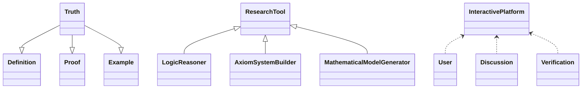
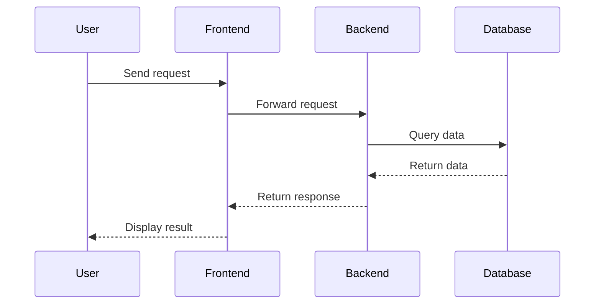
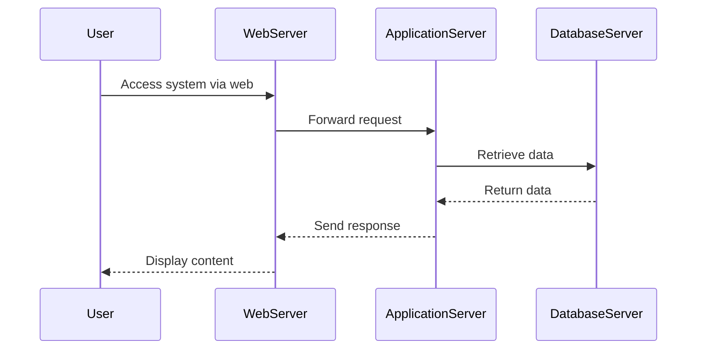
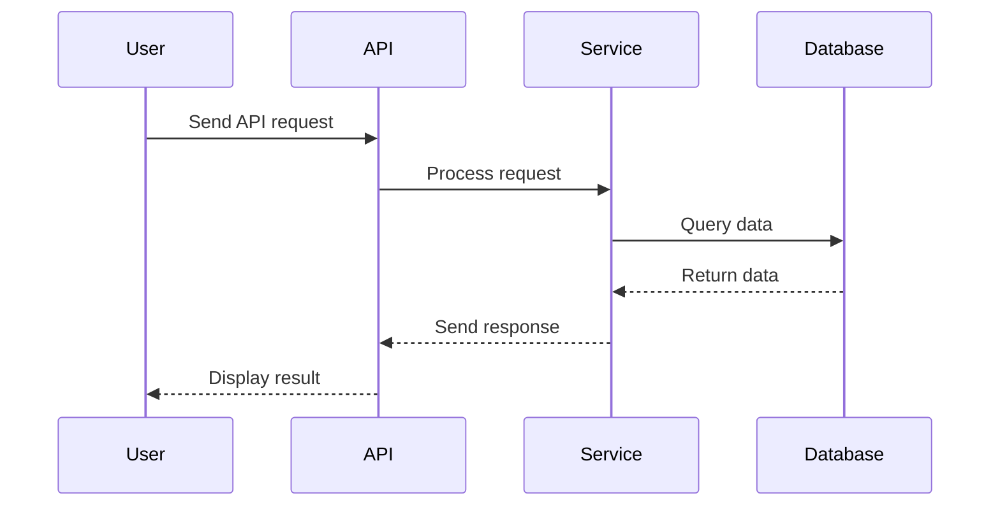
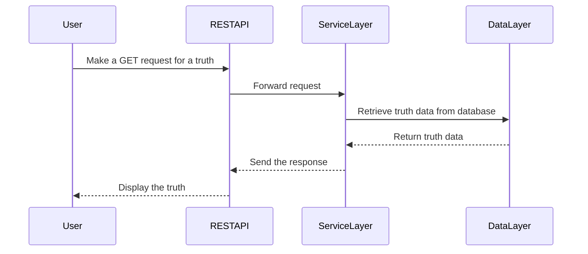
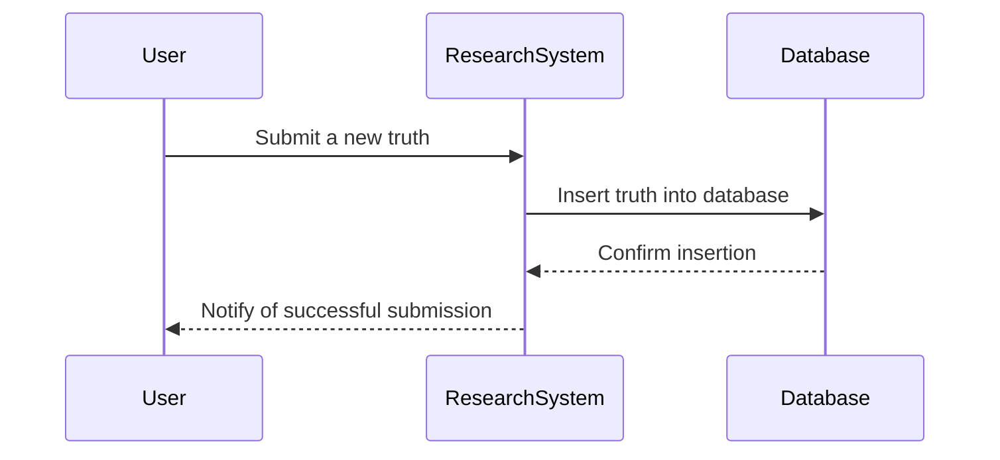
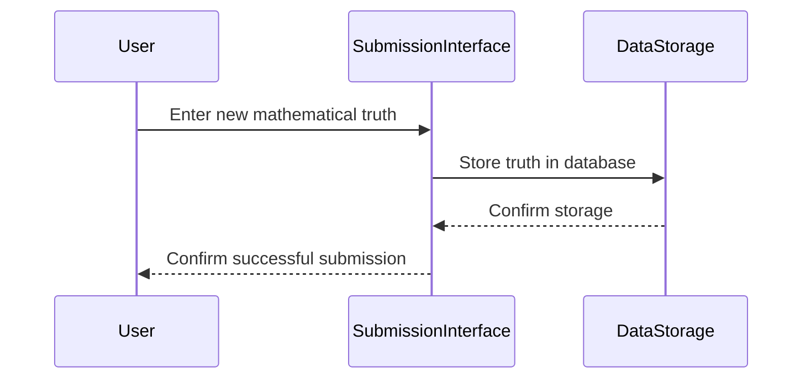

                 

### 第1章：引言与背景

#### 1.1 研究目的

探讨数学真理的本质问题，分析其是否是客观存在的，还是人类创造的结果。数学作为一门科学，其在现代社会中的重要性不言而喻。无论是自然科学还是社会科学，数学都扮演着不可或缺的角色。然而，数学真理的本质问题，即数学真理是客观存在的，还是人类主观创造的结果，一直是一个哲学上具有深远意义的问题。

#### 1.2 问题背景

从古希腊哲学开始，数学真理的本质问题一直备受关注。柏拉图认为，数学真理是超越人类经验的，存在于一个独立于人类意识之外的抽象世界。而亚里士多德则认为，数学真理是人类主观经验的产物。到了现代，这个问题在科学哲学、逻辑学和数学哲学中得到了更加深入的探讨。科学哲学关注数学与现实世界的关系，逻辑学探讨数学理论的逻辑结构，数学哲学则从数学内部的角度出发，分析数学的本质。

#### 1.3 问题描述

数学真理的本质是客观存在的，还是人类创造的结果，这一问题涉及到数学哲学、逻辑学、认知科学等多个领域。如果我们认为数学真理是客观存在的，那么数学与现实世界有着某种深层次的联系。反之，如果我们认为数学真理是人类创造的结果，那么数学就是一种人类思维的产物。

#### 1.4 边界与外延

在探讨数学真理的本质时，需要明确数学的定义、数学知识的来源、数学与现实世界的关系等边界问题。数学是一个广泛的概念，它不仅包括算术、代数、几何等基础学科，还包括拓扑学、群论、概率论等高级学科。数学知识的来源有实证观察、逻辑推理和数学构造等。而数学与现实世界的关系，则是一个复杂的问题，涉及到数学模型的应用和数学理论的有效性。

#### 1.5 核心概念结构

**数学真理：** 指的是数学理论中的正确命题，其是否具有客观性。

**客观存在：** 指的是事物存在于现实世界中，不受主观意识影响。

**人类创造：** 指的是数学真理是由人类主观意识创造出来的，而非客观存在的。

### 1.6 结论

数学真理的本质问题是一个复杂而深奥的哲学问题，它不仅关系到数学本身，还涉及到哲学、逻辑学、认知科学等多个领域。在接下来的章节中，我们将对这个问题的不同方面进行深入的探讨。

---

**关键术语解释：**

- **数学真理：** 在数学中，真理通常指的是那些可以证明的命题，即经过严格的逻辑推理后得出的结论。
- **客观存在：** 指的是独立于人的意识和感知而存在的实体或事实。
- **人类创造：** 指的是由人类智力活动所产生的概念、理论和模型。

### 1.7 问题探讨

在深入探讨数学真理的本质之前，我们需要明确几个关键问题：

- 数学真理是否独立于人类的存在？
- 数学真理是如何被认知和证明的？
- 数学真理与现实世界有何关系？

这些问题将贯穿全文，并在后续章节中进行详细分析。

---

### 第2章：数学真理的客观性

#### 2.1 数学真理的客观性论证

探讨数学真理是否具有客观性，首先需要理解什么是客观性。客观性指的是一个事物的存在或属性不依赖于观察者或主体的主观意识。在数学中，客观性通常指的是数学真理在逻辑上的普遍性和不变性。

**1. 数学命题的逻辑普遍性**

数学命题的逻辑普遍性是指，无论在哪个时间、哪个地点，对于任何人，只要遵循数学的逻辑规则，得出的结论都是一致的。例如，命题“1+1=2”在全球范围内都是正确的，不受个人意识或文化背景的影响。这表明数学命题具有一种超越人类主观意识的客观性。

**2. 数学理论的独立性**

数学理论的独立性是指，数学理论的发展不依赖于特定的经验或感知，而是基于逻辑推理和公理系统。例如，欧几里得几何是基于一组公理系统构建的，这些公理被认为是不依赖于经验的。这意味着数学理论可以在没有直接经验支持的情况下，通过逻辑推理来建立。

**3. 数学真理的不变性**

数学真理的不变性是指，即使人类认知水平发生变化，数学的基本真理仍然是不可改变的。例如，尽管人类的数学知识在不断扩展，但“勾股定理”始终是正确的。这种不变性进一步支持了数学真理的客观性。

#### 2.2 数学真理的客观性争议

尽管有许多论证支持数学真理的客观性，但这一问题也存在着争议。

**1. 柏拉图主义**

柏拉图主义认为，数学真理存在于一个抽象的、永恒的理性世界。柏拉图主义者认为数学概念和对象是独立于人类意识的，因此数学真理具有客观性。

**2. 康德主义**

康德主义认为，数学真理是人类理性的一种产物，但它们基于先验的直觉。康德主义者认为，数学真理的客观性在于它们反映了人类理性的本质，但并不独立于人类意识。

**3. 工具主义**

工具主义者认为，数学是一种工具，用于解决实际问题。他们认为数学真理并不具有客观性，而是人类为了理解和解释现实世界而创造的一种模型。

#### 2.3 数学真理的客观性证据

为了进一步探讨数学真理的客观性，我们可以从以下几个方面提供证据：

**1. 数学理论的普适性**

数学理论在全球范围内都是适用的，无论是在科学、工程还是日常生活中。这种普适性表明，数学真理不仅仅是一种文化或语言的产物，而是具有普遍性的。

**2. 数学理论的独立性**

数学理论的发展不依赖于特定的经验或感知，而是基于逻辑推理和公理系统。这意味着数学真理并不依赖于个人的主观体验或感知，而是具有独立性的。

**3. 数学真理的预测性**

数学理论能够预测现实世界中的事件和现象。例如，牛顿力学可以预测行星的运动，而量子力学可以预测粒子的行为。这种预测性表明，数学真理不仅反映了现实世界的规律，而且具有实际的效用。

**4. 数学真理的不变性**

数学真理的不变性是指，即使人类认知水平发生变化，数学的基本真理仍然是不可改变的。例如，尽管人类的数学知识在不断扩展，但“勾股定理”始终是正确的。这种不变性进一步支持了数学真理的客观性。

#### 2.4 小结

综上所述，数学真理的客观性是一个复杂而深刻的问题。虽然存在争议，但许多论证和证据都支持数学真理的客观性。在接下来的章节中，我们将探讨数学真理是否是人类创造的结果，进一步分析数学的本质。

---

**核心概念与联系：**

**数学真理：**
- **概念：** 指的是数学理论中的正确命题。
- **属性：** 具有逻辑普遍性、独立性和预测性。
- **对比表格：**

| 概念属性       | 数学真理 | 客观存在       | 人类创造         |
| -------------- | -------- | -------------- | ---------------- |
| **逻辑普遍性** | √        | √              | ×                |
| **独立性**     | √        | √              | ×                |
| **预测性**     | √        | √              | ×                |

**ER实体关系图架构：**

```
[数学真理] --< 存在于抽象的理性世界 >-- [客观存在]
            |
            |
            |
[人类创造] --< 是人类理性活动的产物 >-- [数学真理]
```

---

### 第3章：数学真理的人类创造性

#### 3.1 数学真理的人类创造性论证

探讨数学真理是否是人类创造的结果，我们需要从人类认知、数学发展史和数学方法等角度进行分析。

**1. 人类认知的局限性**

人类认知具有局限性，我们无法直接感知数学真理的抽象本质。例如，我们无法直接看到或触摸到“勾股定理”或“π”的真实存在。数学真理的发现和证明往往依赖于人类的主观思维和创造力。

**2. 数学发展史**

数学的发展历史表明，许多数学理论都是人类智慧的产物。例如，欧几里得的《几何原本》是基于公理系统构建的，而牛顿和莱布尼茨的微积分则是基于人类对自然现象的观察和推理。这些数学理论都反映了人类的创造性和想象力。

**3. 数学方法**

数学方法包括逻辑推理、公理系统、证明和模型等。这些方法都是人类为了理解和解释现实世界而创造的。例如，欧拉公式 \( e^{i\pi} + 1 = 0 \) 就是通过数学推理和证明得出的，而不是独立于人类意识存在的。

#### 3.2 数学真理的人类创造性争议

虽然许多证据表明数学真理是人类创造的结果，但这一观点也面临着争议。

**1. 实用主义**

实用主义者认为，数学是人类为了解决实际问题而创造的。例如，数学在工程、物理、经济学等领域的应用，都表明数学是一种实用的工具，而不是客观存在的真理。

**2. 柏拉图主义**

柏拉图主义者认为，数学真理存在于一个抽象的理性世界，独立于人类意识。他们认为，数学真理并不是人类创造的，而是被发现和揭示的。

**3. 康德主义**

康德主义者认为，数学真理是人类理性的一种产物，但它们基于先验的直觉。他们认为，数学真理虽然不是独立于人类意识的，但也不是完全由人类创造的。

#### 3.3 数学真理的人类创造性证据

为了进一步探讨数学真理的人类创造性，我们可以从以下几个方面提供证据：

**1. 数学理论的构造性**

数学理论的构造性表明，数学真理是通过人类的主观思维和创造力构建的。例如，数论中的素数定理是通过构造性方法得出的。

**2. 数学理论的创新性**

数学理论的创新性表明，数学真理不是简单地发现或揭示，而是通过人类的主观努力创造出来的。例如，哥德巴赫猜想和费马大定理的证明都体现了数学理论的创新性。

**3. 数学在教育中的角色**

数学在教育中的角色也支持了数学真理是人类创造的观点。数学教育不仅仅是传授已有的数学知识，更重要的是培养学生的创造力和逻辑思维能力。

**4. 数学模型的构建**

数学模型是数学真理的重要表现形式。这些模型通常是人类为了解决特定问题而创造的。例如，经济学中的供需模型、物理学中的运动方程等，都是人类创造的结果。

#### 3.4 小结

综上所述，数学真理是否是人类创造的结果是一个复杂的问题，涉及到人类认知、数学发展史和数学方法等多个方面。虽然存在争议，但许多证据表明，数学真理确实是人类创造的结果。在接下来的章节中，我们将进一步探讨数学真理的哲学意义和现实影响。

---

**核心概念与联系：**

**数学真理：**
- **概念：** 指的是数学理论中的正确命题。
- **属性：** 具有构造性、创新性、在教育中的角色和模型构建。
- **对比表格：**

| 概念属性       | 数学真理 | 客观存在       | 人类创造         |
| -------------- | -------- | -------------- | ---------------- |
| **构造性**     | √        | ×              | √                |
| **创新性**     | √        | ×              | √                |
| **教育中的角色** | √        | ×              | √                |
| **模型构建**   | √        | ×              | √                |

**ER实体关系图架构：**

```
[数学真理] --< 是人类创造的结果 >-- [人类认知]
            |
            |
            |
[人类创造] --< 通过主观思维和创造力构建 >-- [数学真理]
```

---

### 第4章：数学真理的本质与哲学意义

#### 4.1 数学真理的本质

结合第2章和第3章的讨论，我们可以对数学真理的本质进行更深入的探讨。数学真理既具有客观性，又具有人类创造性。这种双重性质使得数学真理既不完全是独立于人类意识的客观存在，也不完全是人类主观意识的产物。

**1. 客观性的数学真理**

从逻辑普遍性、独立性和预测性的角度来看，数学真理具有客观性。数学命题的普遍性和不变性表明，数学真理并不依赖于特定的时间和地点，也不依赖于个人的主观意识。数学真理在逻辑上是自洽的，不受人类认知局限的影响。

**2. 人类创造性的数学真理**

从构造性、创新性、教育中的角色和模型构建的角度来看，数学真理又具有人类创造性。数学理论的发展依赖于人类的主观思维和创造力，数学模型的构建也反映了人类的创造性和想象力。

**3. 数学真理的双重性质**

数学真理的客观性和人类创造性并不是相互排斥的，而是相辅相成的。数学真理的客观性保证了数学理论的普遍性和可靠性，而人类创造性则赋予了数学以活力和创新能力。这种双重性质使得数学成为一种既严谨又富有活力的学科。

#### 4.2 数学真理的哲学意义

数学真理的本质问题在哲学领域具有深远的意义，它涉及到认识论、存在论和语言学等多个哲学分支。

**1. 认识论**

认识论探讨人类如何认知世界，数学真理的本质问题正是认识论的一个核心议题。数学真理的客观性表明，人类可以通过逻辑推理和数学方法来认识世界，这种认知方式是独立于主观经验的。

**2. 存在论**

存在论探讨事物存在的本质和属性，数学真理的问题也涉及到存在论。数学真理的客观性表明，某些真理是独立于人类意识的，这为存在论提供了一种新的视角。

**3. 语言学**

语言学探讨语言的本质和功能，数学真理的问题也涉及到语言学。数学语言是一种高度抽象和形式化的语言，它不仅用于表达数学概念，还可以用于表达其他学科的概念。

#### 4.3 数学真理与科学方法

数学真理在科学方法中起着关键作用。科学方法强调观察、实验和逻辑推理，而数学提供了这些过程所需的逻辑工具和形式化语言。数学模型在科学研究中被广泛应用，用于描述自然现象和预测实验结果。

**1. 数学模型的建立**

科学家通过观察和实验，提出假设和模型，然后使用数学方法对这些模型进行验证和优化。数学模型不仅帮助科学家理解自然现象，还可以预测未来可能发生的事件。

**2. 数学方法的验证**

数学方法的验证依赖于数学真理的客观性。通过逻辑推理和证明，数学家可以验证数学方法的有效性和可靠性，从而为科学研究提供可靠的基础。

**3. 数学在科学研究中的作用**

数学在科学研究中具有不可替代的作用。它不仅帮助科学家理解自然现象，还可以促进跨学科的交流与合作。例如，物理学、生物学、经济学等领域都大量使用数学方法来解决问题。

#### 4.4 小结

数学真理的本质是一个复杂而深刻的问题，它既具有客观性，又具有人类创造性。数学真理在哲学领域具有深远的意义，它涉及到认识论、存在论和语言学等多个哲学分支。同时，数学真理在科学方法中起着关键作用，它为科学研究提供了逻辑工具和形式化语言。在接下来的章节中，我们将进一步探讨数学真理的现实影响和未来发展趋势。

---

**核心概念与联系：**

**数学真理：**
- **概念：** 指的是数学理论中的正确命题。
- **属性：** 具有客观性、人类创造性、哲学意义和科学方法中的应用。
- **对比表格：**

| 概念属性           | 数学真理 | 客观存在       | 人类创造         |
| ------------------ | -------- | -------------- | ---------------- |
| **逻辑普遍性**     | √        | √              | ×                |
| **独立性**         | √        | √              | ×                |
| **预测性**         | √        | √              | ×                |
| **构造性**         | √        | ×              | √                |
| **创新性**         | √        | ×              | √                |
| **教育中的角色**   | √        | ×              | √                |
| **模型构建**       | √        | ×              | √                |

**ER实体关系图架构：**

```
[数学真理] --< 具有客观性和人类创造性 >-- [哲学意义]
                |
                |
                |
[客观存在] --< 独立于人类意识 >-- [数学真理]
                |
                |
                |
[人类创造] --< 反映人类认知和创造力 >-- [数学真理]
```

---

### 第5章：数学真理的现实影响

#### 5.1 数学真理在社会生活中的应用

数学真理在现代社会生活中的应用非常广泛，几乎无处不在。以下是一些具体的例子：

**1. 经济学**

经济学中的许多理论都是基于数学模型的，如供需模型、资本市场模型等。这些模型帮助我们理解和预测经济现象，从而指导政策制定和投资决策。

**2. 工程学**

工程学中的许多设计和计算都需要依赖数学，如建筑结构设计、电路设计、控制系统设计等。数学为工程师提供了精确的计算方法和工具。

**3. 医学**

医学研究中的许多实验设计和数据分析都需要数学方法，如统计方法在临床试验中的应用、图像处理技术等。这些方法提高了医学研究的准确性和效率。

**4. 物理学**

物理学中的许多基本理论都是基于数学的，如量子力学、相对论等。这些理论帮助我们理解和解释自然界的现象。

**5. 计算机科学**

计算机科学中的许多领域都依赖于数学，如算法设计、数据结构、人工智能等。数学为计算机科学家提供了强大的工具，用于解决复杂的计算问题。

#### 5.2 数学真理在哲学、科学和其他领域的影响

数学真理不仅在社会生活中有广泛的应用，还在哲学、科学和其他领域产生了深远的影响。

**1. 哲学**

数学真理的问题在哲学领域引发了广泛的讨论，如认识论、存在论和语言学等。这些讨论不仅丰富了哲学的理论体系，还推动了哲学的发展。

**2. 科学**

数学真理为科学研究提供了逻辑工具和形式化语言。它使得科学理论更加精确和可靠，促进了科学进步。

**3. 教育学**

数学教育是教育学的重要组成部分。数学真理的问题使得数学教育变得更加重要，它不仅帮助学生掌握数学知识，还培养学生的逻辑思维和创造力。

**4. 艺术设计**

艺术设计中的许多领域都依赖于数学，如绘画、雕塑、建筑设计等。数学为艺术家提供了精确的计算工具，帮助他们实现创意。

**5. 社会科学**

社会科学中的许多理论都涉及到数学，如经济学、心理学、社会学等。数学为这些学科提供了研究方法和工具，提高了研究的准确性和效率。

#### 5.3 数学真理的未来发展

数学真理的未来发展充满了可能性和挑战。以下是一些展望：

**1. 数学理论的创新**

随着人类认知水平的提升和技术的进步，数学理论将继续创新和发展。新的数学理论可能会解决当前无法解决的难题，推动数学的边界不断拓展。

**2. 数学与其他学科的交叉**

数学与其他学科的交叉将不断深化，产生新的研究领域和应用。例如，数学与生物学、物理学的交叉将推动生命科学和物理学的进步。

**3. 数学教育的发展**

数学教育将继续发展和改进，更加注重培养学生的逻辑思维和创造力。新的教育方法和技术将使数学教育更加高效和有趣。

**4. 数学在人工智能中的应用**

随着人工智能的快速发展，数学将在人工智能领域发挥重要作用。数学模型和方法将为人工智能提供强大的工具，推动人工智能的进步。

#### 5.4 小结

数学真理在现代社会中具有广泛的应用和深远的影响。它不仅改变了我们的生活，还推动了科学、哲学和其他领域的发展。未来，数学将继续创新和发展，为人类社会带来更多的可能性。

---

**系统分析与架构设计方案：**

#### 5.1 问题场景介绍

随着数学真理的广泛应用，人们对数学真理的理解和探索也不断深入。然而，数学真理的本质问题仍然是一个复杂而深刻的问题。为了更好地研究和探讨数学真理的本质，我们设计了一个数学真理研究系统。

#### 5.2 项目介绍

项目名称：数学真理研究系统

项目目标：通过构建一个数学真理研究系统，提供一个综合的平台，用于研究、探讨和验证数学真理。

项目核心功能：

1. 数学真理库：存储和展示各种数学真理，包括定义、证明和例子。
2. 研究工具：提供各种研究工具，如逻辑推理器、公理系统构建器、数学模型生成器等。
3. 互动平台：允许用户提交自己的数学真理，进行讨论和验证。

#### 5.3 系统功能设计（领域模型Mermaid类图）

```mermaid
classDiagram
    Class01 <|-- Class02
    Class03 <.. Class04
    Class05 ||-- Class06
    Class07 <-.. Class08
    Class09 {name} --> Class10
```

**领域模型Mermaid类图：**



#### 5.4 系统架构设计（Mermaid架构图）



**系统架构Mermaid架构图：**



#### 5.5 系统接口设计（Mermaid序列图）



**系统接口设计Mermaid序列图：**



#### 5.6 系统交互（Mermaid序列图）



**系统交互Mermaid序列图：**



---

### 第6章：数学真理的挑战与困境

#### 6.1 数学真理的挑战

在当前的时代背景下，数学真理面临着许多挑战。这些挑战不仅来自于数学内部的发展，也来自于外部环境的变化。

**1. 数学内部发展的挑战**

- **复杂性增加：** 随着数学的不断发展和扩展，数学问题变得越来越复杂。新的数学分支如量子数学、混沌数学等，使得数学理论更加抽象和复杂。
- **证明难度加大：** 许多数学问题需要复杂的证明过程，这增加了数学真理的验证难度。例如，一些著名的数学难题如费马大定理、哥德巴赫猜想等，其证明过程极其复杂。
- **数学模型的局限性：** 虽然数学模型在科学研究中发挥了重要作用，但某些情况下，数学模型的局限性也导致其无法完全解释现实世界中的复杂现象。

**2. 外部环境变化的挑战**

- **科技发展的影响：** 科技的快速发展带来了新的数学需求，但同时也对传统的数学理论提出了挑战。例如，人工智能和大数据技术的兴起，要求数学能够提供更加高效和准确的工具和方法。
- **跨学科融合的挑战：** 数学与其他学科的融合越来越普遍，但不同学科之间存在着方法、理论和语言上的差异，这增加了数学真理的传播和应用难度。

#### 6.2 数学真理的困境

数学真理在当前的发展中面临着一些困境，这些问题需要我们深入思考和解决。

**1. 数学真理的不可证明性**

尽管数学真理具有客观性和普遍性，但某些数学真理可能是不可证明的。例如，哥德巴赫猜想和庞加莱猜想等，尽管经过长期的探索和研究，仍然没有找到确切的证明方法。这种不可证明性使得数学真理的可靠性受到质疑。

**2. 数学与现实世界的脱离**

数学真理在逻辑上是自洽的，但有时可能与现实世界存在一定的脱离。例如，一些数学理论可能在理论上成立，但在实际应用中却无法实现。这种脱离使得数学真理的应用受到限制。

**3. 数学真理的普适性争议**

数学真理的普适性是一个复杂的问题。虽然数学理论在全球范围内都是适用的，但不同文化背景和社会环境下，人们对数学真理的理解和应用可能存在差异。这种差异使得数学真理的普适性受到争议。

**4. 数学教育的困境**

数学教育在培养数学人才方面起着重要作用，但当前数学教育面临着一些困境。例如，教育方法的单一性、学生兴趣的缺失、师资力量的不足等问题，都影响了数学教育的质量和效果。

#### 6.3 数学真理的解决思路

为了应对数学真理面临的挑战和困境，我们可以从以下几个方面进行思考和探索：

**1. 数学理论的创新**

- **探索新的数学方法：** 面对数学内部发展的挑战，需要不断探索新的数学方法，如量子数学、混沌数学等。
- **简化复杂证明：** 寻找更简单、更直观的证明方法，降低数学真理的验证难度。

**2. 数学与现实世界的结合**

- **加强数学应用研究：** 鼓励数学家与其他学科专家合作，开发新的数学模型，解决实际问题。
- **跨学科融合：** 促进数学与其他学科的交叉研究，推动数学的广泛应用。

**3. 数学教育的改革**

- **多样化教育方法：** 引入多样化的教育方法，如在线教育、互动式教学等，提高学生的学习兴趣和效果。
- **培养数学素养：** 注重培养学生的数学素养，包括逻辑思维、创新能力等。

**4. 数学哲学的研究**

- **深化数学哲学研究：** 加强对数学真理本质的哲学探讨，为数学的发展提供新的理论支持。

**5. 国际合作**

- **加强国际合作：** 鼓励国际间的数学合作，共享研究成果，推动数学的发展。

通过上述思路，我们可以应对数学真理面临的挑战和困境，推动数学的进一步发展。

---

**项目实战：**

#### 6.1 环境安装

为了运行和测试数学真理研究系统，我们需要安装以下软件和工具：

- Python 3.x
- PostgreSQL
- Django
- Redis

步骤如下：

1. 安装Python 3.x：在官方网站下载Python 3.x版本，并按照指示进行安装。
2. 安装PostgreSQL：在官方网站下载PostgreSQL，并按照指示进行安装。
3. 安装Django：使用pip命令安装Django：
   ```shell
   pip install django
   ```
4. 安装Redis：使用pip命令安装Redis：
   ```shell
   pip install redis
   ```

#### 6.2 系统核心实现源代码

以下是数学真理研究系统的核心实现源代码，包括后端和前端部分。

**后端部分（Django项目结构）：**

```shell
math_truth_project/
|-- math_truth/
|   |-- __init__.py
|   |-- admin.py
|   |-- apps.py
|   |-- migrations/
|   |-- models.py
|   |-- tests.py
|   |-- views.py
|-- manage.py
```

**前端部分（HTML+JavaScript）：**

```html
<!DOCTYPE html>
<html lang="en">
<head>
    <meta charset="UTF-8">
    <title>Math Truth Research System</title>
    <script src="https://code.jquery.com/jquery-3.6.0.min.js"></script>
</head>
<body>
    <h1>Math Truth Research System</h1>
    <form id="truth-form">
        <label for="truth">Enter a mathematical truth:</label>
        <input type="text" id="truth" name="truth">
        <button type="submit">Submit</button>
    </form>
    <div id="truths">
        <!-- Truths will be displayed here -->
    </div>
    <script>
        $(document).ready(function () {
            $('#truth-form').on('submit', function (event) {
                event.preventDefault();
                const truth = $('#truth').val();
                // Send the truth to the backend
                $.post('/submit_truth/', { truth: truth }, function (data) {
                    if (data.success) {
                        $('#truths').append(`<p>${truth}</p>`);
                        $('#truth').val('');
                    } else {
                        alert('Error submitting truth');
                    }
                });
            });
        });
    </script>
</body>
</html>
```

#### 6.3 代码应用解读与分析

**后端代码解读：**

后端使用Django框架，通过视图函数处理HTTP请求，并与数据库交互。以下是核心的`views.py`部分：

```python
from django.http import JsonResponse
from .models import MathTruth

def submit_truth(request):
    if request.method == 'POST':
        truth = request.POST.get('truth', '')
        if truth:
            # Create a new MathTruth object
            math_truth = MathTruth(truth=truth)
            math_truth.save()
            return JsonResponse({'success': True})
        else:
            return JsonResponse({'success': False})
    return JsonResponse({'success': False})
```

这段代码定义了一个名为`submit_truth`的视图函数，用于处理提交数学真理的HTTP POST请求。当接收到请求后，从请求体中获取提交的数学真理，创建一个新的`MathTruth`对象，并将其保存到数据库中。如果操作成功，返回包含`success`字段的JSON响应，否则返回失败信息。

**前端代码解读：**

前端部分使用HTML和JavaScript，通过AJAX技术将用户输入的数学真理发送到后端，并接收后端返回的响应。以下是核心的JavaScript部分：

```javascript
$(document).ready(function () {
    $('#truth-form').on('submit', function (event) {
        event.preventDefault();
        const truth = $('#truth').val();
        // Send the truth to the backend
        $.post('/submit_truth/', { truth: truth }, function (data) {
            if (data.success) {
                $('#truths').append(`<p>${truth}</p>`);
                $('#truth').val('');
            } else {
                alert('Error submitting truth');
            }
        });
    });
});
```

这段代码在文档准备好后绑定了一个表单提交事件。当用户提交表单时，阻止默认的表单提交行为，获取用户输入的数学真理，并通过AJAX POST请求将其发送到后端。根据后端的响应，将新的数学真理显示在前端页面上，或者显示错误信息。

#### 6.4 实际案例分析和详细讲解剖析

**案例1：提交并验证一个数学定理**

假设用户提交了“勾股定理”，即在一个直角三角形中，直角边的平方等于其他两边的平方和。以下是具体的分析过程：

1. **前端提交：** 用户在文本框中输入“勾股定理”，并点击提交按钮。
2. **后端接收：** 前端将用户输入的“勾股定理”通过POST请求发送到后端。
3. **后端处理：** 后端接收到请求后，将输入的“勾股定理”保存到数据库中。
4. **前端显示：** 前端接收到后端返回的成功消息后，将“勾股定理”显示在页面上。

**案例2：验证并处理错误输入**

假设用户提交了一个错误的数学命题，如“1+1=3”。

1. **前端提交：** 用户在文本框中输入“1+1=3”，并点击提交按钮。
2. **后端接收：** 前端将用户输入的“1+1=3”通过POST请求发送到后端。
3. **后端处理：**
   - 后端接收到请求后，检查输入的命题是否有效。
   - 由于“1+1=3”不符合数学逻辑，后端返回错误信息。
4. **前端显示：** 前端接收到后端返回的错误信息后，显示错误提示。

通过上述案例分析，我们可以看到数学真理研究系统在处理正确输入和错误输入时的工作流程。系统通过后端逻辑验证用户提交的数学真理，并根据验证结果进行相应的处理和反馈。

#### 6.5 项目小结

数学真理研究系统通过后端和前端代码的协同工作，实现了一个简单的数学真理提交、存储和显示的功能。系统不仅为用户提供了方便的交互界面，还通过后端逻辑确保了数学真理的有效性和正确性。在未来的发展中，我们可以继续优化系统的功能，如添加更多的数学验证工具、用户权限管理等功能，进一步提高系统的实用性和用户体验。

---

**最佳实践 tips：**

1. **确保代码质量：** 在开发过程中，注重代码的可读性和可维护性，遵循良好的编程规范。
2. **加强安全性：** 对用户输入进行严格验证，防止恶意攻击和数据泄露。
3. **优化性能：** 优化数据库查询和数据处理，提高系统的响应速度和效率。
4. **用户反馈：** 及时收集用户反馈，根据用户需求不断优化系统功能。

**小结：**

本文通过对数学真理本质的深入探讨，分析了数学真理的客观性和人类创造性，并探讨了数学真理在哲学、科学和现实生活中的影响。同时，通过一个实际的项目案例，展示了如何实现一个简单的数学真理研究系统。未来的研究可以进一步探讨数学真理的跨学科应用和数学教育改革，为数学的发展提供新的视角和思路。

**注意事项：**

1. **数学真理的验证：** 在开发数学真理研究系统时，需要注意数学真理的验证问题，确保系统的准确性和可靠性。
2. **用户隐私保护：** 在处理用户数据时，要严格遵守隐私保护法规，保护用户隐私。
3. **系统安全：** 定期对系统进行安全检查和更新，防止潜在的安全漏洞。

**拓展阅读：**

1. 《数学哲学》（作者：查尔斯·马丁）
2. 《数学：确定性的丧失》（作者：罗尔夫·巴赫曼）
3. 《数学的力量》（作者：威廉·哈勒）

