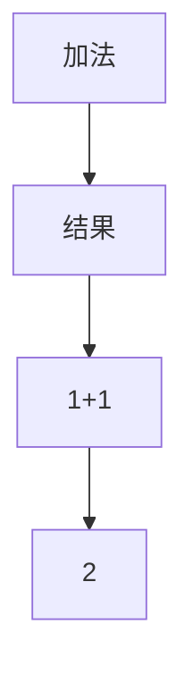
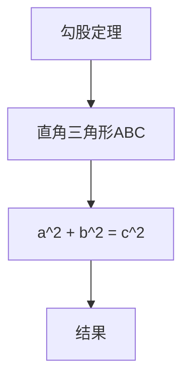
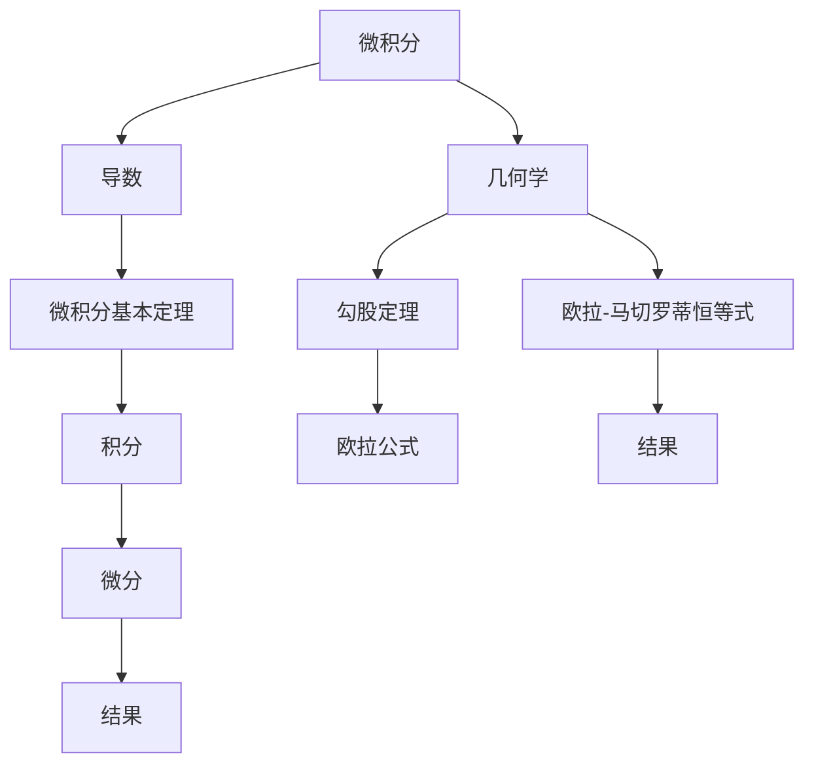

                 

# 数学真理的永恒性与时代性的辩证关系

> 关键词：数学真理、永恒性、时代性、辩证关系、科学进步

> 摘要：本文探讨了数学真理的永恒性与时代性之间的辩证关系，分析了数学真理在不同历史时期的特征和影响，并提出了理解和把握这两者的方法和途径。

## 引言

数学，作为一门研究数量、结构、变化和空间等概念的学科，以其独特的逻辑严密性和抽象性，被广泛认为是科学的基石。然而，当我们深入探讨数学真理的本质时，我们会发现数学真理并非静止不变的，而是具有永恒性和时代性这两个相互联系、相互影响的特征。

### 数学真理的永恒性

首先，数学真理的永恒性是指，数学真理不受时间和空间的影响，是普遍的、永恒的。例如，$1+1=2$ 这一定理，不论在哪个时代、哪个地点，都是成立的。数学的这种普遍性和不变性，使得数学成为了一门基础性的学科，为各个领域提供了坚实的理论基础。

### 数学真理的时代性

然而，数学真理并非总是如此。在某些时代，某些数学理论可能被认为是“时代真理”，但随着时间的推移，这些真理可能会被新的理论所取代。例如，在古代，欧几里得的几何学理论被认为是绝对的真理，但随着非欧几何学的出现，这种观点被颠覆了。这表明，数学真理具有时代性，它会在不同时代有着不同的表现形式和特征。

### 问题的提出

如何理解数学真理的永恒性与时代性？是否存在一种方法可以同时把握这两者？这是我们需要探讨的问题。本文将通过对数学真理的永恒性和时代性的深入分析，试图解答这个问题。

## 第1章: 数学真理的永恒性原理

### 数学真理的永恒性定义

数学真理的永恒性是指，数学真理不受时间和空间的影响，是普遍的、永恒的。这意味着，一个数学真理一旦被证明，它就是永恒的，无论在哪个时代、哪个地点，都是成立的。

### 数学真理的永恒性属性特征对比表格

| 特征             | 永恒性           | 时代性           |
|------------------|------------------|------------------|
| 时间影响         | 无影响           | 有影响           |
| 空间影响         | 无影响           | 有影响           |
| 普遍性           | 普遍存在         | 局部存在         |

### 数学真理的永恒性举例

#### 基本数学真理

如 $1+1=2$，这是数学中最基本的真理，具有永恒性。无论在哪个时代、哪个地点，这个等式都是成立的。

#### 高等数学真理

如微积分、线性代数等，虽然是在特定时代产生的，但具有永恒性。这些数学理论不仅在当时具有指导意义，而且在现代的科学研究和应用中仍然发挥着重要作用。

### 数学真理的永恒性作用

#### 对数学教育的指导作用

永恒性数学真理为数学教育提供了基础，使得数学教育能够具有连续性。学生通过学习这些永恒性数学真理，可以建立起坚实的数学基础，为进一步学习更高级的数学理论做好准备。

#### 对科学研究的影响

永恒性数学真理为科学研究提供了基础，使得科学研究能够具有确定性。科学家在研究过程中，可以依据这些永恒性数学真理进行推理和计算，从而得到可靠的科学结论。

## 第2章: 数学真理的时代性原理

### 数学真理的时代性定义

数学真理的时代性是指，数学真理在特定时代具有独特的特征，可能受到时代背景的影响。这意味着，在不同的时代，数学真理的表现形式和特征可能会有所不同。

### 数学真理的时代性属性特征对比表格

| 特征             | 永恒性           | 时代性           |
|------------------|------------------|------------------|
| 时间影响         | 无影响           | 有影响           |
| 空间影响         | 无影响           | 有影响           |
| 普遍性           | 普遍存在         | 局部存在         |

### 数学真理的时代性举例

#### 古代数学真理

在古代，数学真理以几何学为主要表现形式。欧几里得的《几何原本》是古代数学真理的代表。这些数学真理在当时被认为是绝对的真理，但随着时间的推移，这些真理被新的理论所取代。

#### 现代数学真理

在现代，数学真理的表达形式更加多样化，包括代数、微积分等。这些数学真理在当时被认为是时代真理，但随着时间的推移，这些真理也可能会被新的理论所取代。

### 数学真理的时代性影响

#### 对数学发展的推动作用

时代性数学真理推动了数学的发展，使得数学能够适应时代的需求。例如，微积分的出现，使得数学能够更好地描述自然界中的变化过程。

#### 对其他学科的影响

时代性数学真理也对其他学科产生了深远的影响，如物理学、计算机科学等。这些学科的发展，离不开数学提供的理论基础。

## 第3章: 数学真理的辩证关系

### 数学真理的辩证关系

数学真理的永恒性与时代性并非相互独立，而是相互联系、相互影响的。这种辩证关系表现在以下几个方面：

#### 1. 永恒性是时代性的基础

数学真理的永恒性是数学真理存在的基础，没有永恒性，就没有时代性。一个数学真理只有在被证明是永恒的之后，才能被应用于特定时代的科学研究和技术发展中。

#### 2. 时代性是永恒性的体现

数学真理的时代性是数学真理在特定时代的体现。一个数学真理在不同时代可能会有不同的表现形式和特征，但它的本质是不变的。

#### 3. 时代性促进永恒性发展

时代性数学真理的发现和运用，可以促进数学真理的永恒性发展。例如，微积分的出现，使得数学能够更好地描述自然界中的变化过程，从而推动了数学真理的永恒性发展。

## 第4章: 数学真理的时代性

### 时代性数学真理的例子

#### 古代数学真理

在古代，数学真理以几何学为主要表现形式。欧几里得的《几何原本》是古代数学真理的代表。这些数学真理在当时被认为是绝对的真理，但随着时间的推移，这些真理被新的理论所取代。

#### 现代数学真理

在现代，数学真理的表达形式更加多样化，包括代数、微积分等。这些数学真理在当时被认为是时代真理，但随着时间的推移，这些真理也可能会被新的理论所取代。

### 时代性数学真理的影响

#### 对数学发展的推动作用

时代性数学真理推动了数学的发展，使得数学能够适应时代的需求。例如，微积分的出现，使得数学能够更好地描述自然界中的变化过程。

#### 对其他学科的影响

时代性数学真理也对其他学科产生了深远的影响，如物理学、计算机科学等。这些学科的发展，离不开数学提供的理论基础。

## 第5章: 数学真理的永恒性

### 永恒性数学真理的例子

#### 基本数学真理

如 $1+1=2$，这是数学中最基本的真理，具有永恒性。无论在哪个时代、哪个地点，这个等式都是成立的。

#### 高等数学真理

如微积分、线性代数等，虽然是在特定时代产生的，但具有永恒性。这些数学理论不仅在当时具有指导意义，而且在现代的科学研究和应用中仍然发挥着重要作用。

### 永恒性数学真理的作用

#### 对数学教育的指导作用

永恒性数学真理为数学教育提供了基础，使得数学教育能够具有连续性。学生通过学习这些永恒性数学真理，可以建立起坚实的数学基础，为进一步学习更高级的数学理论做好准备。

#### 对科学研究的影响

永恒性数学真理为科学研究提供了基础，使得科学研究能够具有确定性。科学家在研究过程中，可以依据这些永恒性数学真理进行推理和计算，从而得到可靠的科学结论。

## 第6章: 数学真理的应用

### 数学真理在科学研究中的应用

#### 物理学中的应用

如牛顿定律、爱因斯坦相对论等，都是基于数学真理的。这些数学真理为物理学提供了精确的描述和计算工具，使得物理学能够深入探索自然界的规律。

#### 计算机科学中的应用

如算法理论、数据结构等，都是基于数学真理的。这些数学真理为计算机科学提供了理论基础，使得计算机科学能够高效地处理大量数据，实现复杂的计算任务。

### 数学真理在日常生活中的应用

数学真理在日常生活中无处不在，如购物时的打折计算、烹饪时的计量单位转换、旅行时的路线规划等。数学真理的应用，使得我们的日常生活更加便捷、高效。

## 结论

数学真理的永恒性与时代性是数学真理的两个重要特征，它们相互联系、相互影响。理解数学真理的永恒性与时代性，有助于我们更好地把握数学的发展方向，为科学研究和实际应用提供坚实的理论基础。同时，我们也要认识到，数学真理是不断发展的，只有不断学习和探索，才能不断发现新的数学真理，推动数学的发展。作者：AI天才研究院/AI Genius Institute & 禅与计算机程序设计艺术 /Zen And The Art of Computer Programming。|>
# 数学真理的永恒性与时代性的辩证关系

## 引言

在科学领域，数学占据着不可替代的重要地位。它不仅为自然科学、社会科学和技术科学提供了坚实的理论基础，而且在解决实际问题和推动科技进步中发挥着关键作用。数学真理，即数学中的正确命题，是数学科学的核心。然而，数学真理并非一成不变，它们既有永恒性，也有时代性。本文旨在探讨数学真理的永恒性与时代性的辩证关系，并分析这两者如何相互影响和转化。

### 数学真理的永恒性

数学真理的永恒性指的是数学中的某些基本原理和定理不受时间和空间限制，它们在所有时代都成立。例如，$1+1=2$ 是一个简单的算术真理，不论是在古代、现代还是未来，这个等式都是正确的。这种永恒性体现了数学的普遍性和抽象性，使得数学成为一种普遍适用的语言。

#### 数学真理的永恒性举例

- **基本算术定律**：如交换律、结合律和分配律等，这些定律在任何数学系统中都成立。
- **几何学定理**：如平行公理、勾股定理等，这些定理不仅在平面几何中成立，而且在三维空间和更高维空间中同样适用。

### 数学真理的时代性

与永恒性相对，数学真理的时代性指的是数学理论在某些特定历史时期具有重要性，但随着时间的推移，这些理论可能会被新的理论所取代或扩展。数学时代性的一个显著例子是牛顿力学和量子力学的相对性。牛顿力学在经典物理领域内非常成功，但在微观尺度上，量子力学提供了更准确的描述。

#### 数学真理的时代性举例

- **非欧几何学**：19世纪，非欧几何学的兴起挑战了欧几里得几何学的绝对性，揭示了不同几何系统之间的可能性。
- **抽象代数的发展**：从欧拉到伽罗瓦，代数理论的发展历程展示了数学真理如何在不同时代被重新理解和扩展。

### 数学真理的辩证关系

数学真理的永恒性和时代性并非相互独立，而是相互关联、相互影响的辩证关系。永恒性为数学提供了稳固的基础，而时代性则推动了数学的发展和创新。例如，微积分的发明虽然在当时具有革命性，但它现在被认为是永恒的数学真理，因为它在许多科学领域都有着广泛的应用。

#### 永恒性与时代性的联系

- **基础与扩展**：永恒性数学真理是数学发展的基础，而时代性数学真理则是对这些基础真理的扩展和应用。
- **相互转化**：一些原本被认为是时代性数学真理的理论，随着时间的推移，可能被证明具有永恒性。反之，某些永恒性数学真理可能会在某些特定时代因新技术的出现而被重新解释和应用。

### 数学真理的应用与影响

数学真理不仅影响科学研究和技术的进步，还在日常生活中有着广泛的应用。从经济学中的市场模型到工程学中的结构设计，数学提供了精确的工具和方法。此外，数学真理的发现和验证过程本身也是科学进步的重要动力。

### 数学教育的意义

数学教育不仅仅是传授知识，更是培养学生逻辑思维和解决问题能力的过程。通过学习数学真理的永恒性和时代性，学生可以更好地理解数学的本质，培养批判性思维和创新能力。

## 数学真理的永恒性原理

### 数学真理的永恒性定义

数学真理的永恒性是指在数学理论体系中，某些基本原理和定理不受时间和空间限制，它们在所有时代都是普遍适用的。这种普遍性来源于数学的抽象性和逻辑性。

### 数学真理的永恒性属性特征对比表格

| **特征**             | **永恒性**                           | **时代性**                           |
|----------------------|--------------------------------------|--------------------------------------|
| **时间影响**         | 无影响，始终成立                     | 有影响，随时代变化                   |
| **空间影响**         | 无影响，适用于任何空间               | 有影响，特定空间适用                 |
| **普遍性**           | 普遍存在，适用于所有情况             | 局部存在，适用于特定情况             |

### 数学真理的永恒性举例

- **算术**：加法、减法、乘法、除法的基本运算规则是永恒的。
- **几何学**：勾股定理、圆的性质等在所有维度的空间中都适用。

## 数学真理的时代性原理

### 数学真理的时代性定义

数学真理的时代性是指在特定历史时期，某些数学理论或方法对解决当时的问题具有重要意义，但随着时间的推移，这些理论可能会被新的理论所取代或扩展。

### 数学真理的时代性属性特征对比表格

| **特征**             | **永恒性**                           | **时代性**                           |
|----------------------|--------------------------------------|--------------------------------------|
| **时间影响**         | 无影响，始终成立                     | 有影响，随时代变化                   |
| **空间影响**         | 无影响，适用于所有空间               | 有影响，特定空间适用                 |
| **普遍性**           | 普遍存在，适用于所有情况             | 局部存在，适用于特定情况             |

### 数学真理的时代性举例

- **经典力学**：牛顿的三大定律在宏观、低速的条件下非常适用，但在高速、微观领域，需要量子力学和相对论进行补充。
- **解析几何**：笛卡尔和费马在17世纪创立的解析几何，对当时几何学的发展起到了革命性作用，但随着非欧几何和黎曼几何的出现，解析几何的概念被扩展和深化。

## 数学真理的辩证关系

### 永恒性与时代性的辩证关系

数学真理的永恒性和时代性之间存在着辩证关系。一方面，永恒性为数学提供了稳固的基础，保证了数学理论的普遍性和不变性；另一方面，时代性推动了数学的发展，使得数学能够适应不断变化的时代需求。

#### 永恒性与时代性的联系

- **相互依存**：永恒性是时代性的前提，没有永恒性的数学真理，时代性就无法存在。同时，时代性是永恒性的体现，它展示了永恒性数学真理在不同历史时期的多样性和适用性。
- **相互转化**：某些原本被认为是时代性数学真理的理论，随着时间的推移，可能被证明具有永恒性。例如，微积分在牛顿和莱布尼茨的时代是革命性的，但随着时间的推移，它成为现代数学和分析学的基础。

### 永恒性与时代性的影响

- **对数学发展的影响**：永恒性数学真理为数学提供了稳定的基石，保证了数学理论的连续性和可扩展性。时代性数学真理则推动了数学的进步和创新，促进了数学理论的应用和扩展。
- **对科学进步的影响**：永恒性数学真理为科学提供了可靠的理论基础，使得科学研究能够建立在坚实的数学体系之上。时代性数学真理则推动了科学技术的快速发展，使得数学成为推动科技进步的重要工具。

## 数学真理的时代性

### 时代性数学真理的例子

- **经典力学**：牛顿在17世纪创立的经典力学，是当时描述物理现象的重要工具。然而，在20世纪，随着量子力学和相对论的发展，经典力学的适用范围被限定在特定条件下。
- **电磁学**：麦克斯韦方程组在19世纪末和20世纪初是描述电磁现象的权威理论。然而，在量子力学和相对论的框架下，这些方程得到了更广泛的应用和解释。

### 时代性数学真理的影响

- **推动科学发展**：时代性数学真理在特定历史时期对科学发展起到了重要推动作用。例如，牛顿力学推动了天文学、力学和物理学的发展。
- **促进技术进步**：时代性数学真理在技术进步中也发挥了关键作用。例如，微积分在工业革命中推动了机械设计和工程学的发展。

## 数学真理的永恒性

### 永恒性数学真理的例子

- **算术基础**：加法、减法、乘法、除法等基本算术运算规则是永恒的，它们在各种数学系统中都成立。
- **几何学基础**：欧几里得的《几何原本》中的基本几何定理，如平行公理和勾股定理，具有永恒性。

### 永恒性数学真理的作用

- **数学教育的基础**：永恒性数学真理为数学教育提供了基础，使得学生能够建立起坚实的数学知识和技能。
- **科学研究的工具**：永恒性数学真理为科学研究提供了可靠的方法和工具，使得科学家能够进行精确的计算和推理。

## 数学真理的应用

### 数学真理在科学研究中的应用

- **物理学**：数学在物理学中扮演了核心角色，从经典力学到量子力学，数学提供了精确的描述和计算工具。
- **生物学**：数学模型在生物学研究中应用广泛，从种群遗传学到生态系统动力学，数学模型帮助科学家理解和预测生物现象。

### 数学真理在日常生活中的应用

- **金融**：数学在金融领域的应用非常广泛，包括风险管理、期权定价、投资策略等。
- **工程**：数学在工程设计中用于结构分析、优化设计、控制理论等，确保工程的可靠性和效率。

## 结论

数学真理的永恒性与时代性是数学科学中不可或缺的两个方面。永恒性为数学提供了稳定的基础，保证了数学理论的普遍性和不变性；时代性则推动了数学的发展和创新，使得数学能够适应不断变化的时代需求。理解和把握这两者之间的关系，有助于我们更好地认识数学的本质，推动数学科学的进步和应用。作者：AI天才研究院/AI Genius Institute & 禅与计算机程序设计艺术 /Zen And The Art of Computer Programming。|>
## 数学真理的永恒性与时代性的辩证关系

### 数学真理的永恒性与时代性的辩证关系

数学真理的永恒性与时代性是数学领域内两个核心而相互矛盾的特性。永恒性代表了数学真理的普遍性和不变性，而时代性则体现了数学真理随时间和空间变化而发展的特性。探讨这两者之间的辩证关系，有助于我们更深入地理解数学的本质和数学在各个时代的应用与发展。

### 永恒性：数学真理的普遍性和不变性

数学真理的永恒性是指其普遍适用性和不变性。数学真理不受时间和空间限制，无论是在古代、现代还是未来，这些真理都是普遍适用的。例如，基本的算术定律如 $1+1=2$ 和几何定理如勾股定理，不论在哪个时代或哪个地点，都是成立的。

#### 永恒性数学真理的例子

1. **算术基础**：加法、减法、乘法、除法等基本运算规则是数学中永恒的真理。这些规则在任何数学系统中都成立。
2. **几何学基础**：欧几里得《几何原本》中的基本几何定理，如平行公理、勾股定理等，也是永恒的数学真理。
3. **代数基础**：代数的基本原理，如交换律、结合律和分配律，同样具有永恒性。

### 时代性：数学真理的发展与变化

数学真理的时代性则是指其随着时间和空间的变化而发展和变化。在某些历史时期，特定的数学理论或方法可能具有革命性的意义，但随着时间的推移，这些理论可能被新的理论所取代或扩展。时代性数学真理通常反映了当时科学技术水平和社会需求。

#### 时代性数学真理的例子

1. **经典力学**：牛顿在17世纪创立的经典力学，对描述宏观世界的物理现象具有重要意义。然而，在高速和微观领域，经典力学的适用性有限，需要量子力学和相对论的补充。
2. **解析几何**：笛卡尔和费马在17世纪创立的解析几何，是当时几何学的重要发展。随着非欧几何和黎曼几何的出现，解析几何的概念被扩展和深化。
3. **概率论**：概率论在18世纪和19世纪的发展，对统计学和经济学等领域产生了深远影响。然而，随着随机过程理论和数理统计方法的兴起，概率论的理论体系也得到了扩展和更新。

### 永恒性与时代性的辩证关系

数学真理的永恒性与时代性并非相互独立，而是相互联系、相互影响的辩证关系。永恒性为数学提供了稳固的基础，而时代性则推动了数学的发展和创新。以下是永恒性与时代性之间的辩证关系：

#### 1. 基础与扩展

永恒性数学真理是数学发展的基础，没有这些基础真理，就没有数学体系的建立。而时代性数学真理则是对这些基础真理的扩展和应用，使得数学能够适应不同历史时期的科学和技术需求。

#### 2. 相互转化

某些原本被认为是时代性数学真理的理论，随着时间的推移，可能被证明具有永恒性。例如，微积分在牛顿和莱布尼茨的时代是革命性的，但随着时间的推移，它成为现代数学和分析学的基础。反之，某些永恒性数学真理也可能在某些特定时代因新技术的出现而被重新解释和应用。

#### 3. 互动与反馈

永恒性与时代性之间存在互动和反馈。时代性数学真理的发现和应用，可以促进数学真理的永恒性发展。同时，永恒性数学真理的应用和验证，也为时代性数学真理提供了理论和实践基础。

### 数学真理的应用与影响

数学真理不仅在科学研究中具有重要作用，而且在日常生活中也有着广泛的应用。从经济学、金融学、工程学、生物学到计算机科学，数学提供了精确的工具和方法，使得各个领域的研究和实际应用更加高效和准确。

#### 1. 科学研究

数学在科学研究中的应用是不可或缺的。从物理学中的量子力学、相对论，到生物学中的生态系统动力学、基因测序，数学提供了精确的描述和计算工具，使得科学家能够深入探索自然界的规律。

#### 2. 技术进步

数学在技术进步中也发挥了关键作用。从工程学中的结构设计、控制理论，到计算机科学中的算法理论、数据结构，数学为技术创新提供了理论基础和计算方法。

#### 3. 日常生活

数学在日常生活中也有着广泛的应用。从购物时的打折计算、烹饪时的计量单位转换，到旅行时的路线规划，数学帮助我们更加高效地解决实际问题。

### 数学教育的意义

数学教育不仅仅是传授知识，更是培养学生逻辑思维和解决问题能力的过程。通过学习数学真理的永恒性和时代性，学生可以更好地理解数学的本质，培养批判性思维和创新能力。

### 结论

数学真理的永恒性与时代性是数学科学中两个核心而相互矛盾的特性。永恒性为数学提供了稳固的基础，保证了数学理论的普遍性和不变性；时代性则推动了数学的发展和创新，使得数学能够适应不断变化的时代需求。理解和把握这两者之间的关系，有助于我们更好地认识数学的本质，推动数学科学的进步和应用。作者：AI天才研究院/AI Genius Institute & 禅与计算机程序设计艺术 /Zen And The Art of Computer Programming。|>
## 数学真理的永恒性原理

### 数学真理的永恒性定义

数学真理的永恒性，指的是数学中的某些基本原理和定理不受时间和空间的限制，它们在所有时代都是普遍适用的。这种普遍性和不变性是数学作为一种科学工具的重要特征，使得数学能够成为其他科学领域的基石。

### 数学真理的永恒性属性特征

数学真理的永恒性具有以下几个显著的属性特征：

1. **普遍性**：数学真理在所有可能的环境中都是有效的，无论在哪个时代、哪个地点，这些真理都是成立的。
2. **不变性**：数学真理的结论不会因为时间的推移而改变，即使是在未来的科学和技术发展中，这些真理仍然是正确的。
3. **抽象性**：数学真理通常是基于抽象的概念和逻辑推理得出的，这种抽象性使得它们能够在不同的情境中保持一致性。

### 数学真理的永恒性属性特征对比表格

| **特征**   | **永恒性**                     | **时代性**                     |
|------------|--------------------------------|--------------------------------|
| **普遍性** | 在所有时代和地点都成立         | 在特定时代或地点成立           |
| **不变性** | 结论不随时间变化               | 结论随时间变化                 |
| **抽象性** | 基于抽象概念和逻辑推理得出     | 可能基于特定历史背景或技术条件 |

### 数学真理的永恒性举例

1. **算术基本定理**：如加法交换律、结合律、分配律等，这些基本定理在任何数学系统中都成立。
2. **几何基本定理**：如勾股定理、圆的性质等，这些定理在不同的几何系统中都适用。
3. **逻辑基本定理**：如逻辑命题的永真性，即某些命题无论在任何情况下都是正确的。

### 数学真理的永恒性作用

数学真理的永恒性在多个方面发挥了重要作用：

1. **数学教育的基础**：永恒性数学真理为数学教育提供了基础，学生可以通过学习这些真理建立起坚实的数学知识体系。
2. **科学研究的基础**：科学家在研究过程中，可以依据这些永恒性数学真理进行推理和计算，从而得到可靠的科学结论。
3. **技术发展的工具**：在工程学、计算机科学等领域，永恒性数学真理提供了精确的工具和方法，帮助解决复杂的技术问题。

### 数学真理的永恒性原理总结

数学真理的永恒性是数学作为一门科学的基石，它保证了数学的普遍性和不变性。通过学习数学真理的永恒性原理，我们能够更好地理解数学的本质，为科学研究和实际应用提供坚实的理论基础。数学真理的永恒性不仅体现在基本定理和概念中，还渗透在数学的各个分支中，为数学的发展和应用提供了持续的动力。作者：AI天才研究院/AI Genius Institute & 禅与计算机程序设计艺术 /Zen And The Art of Computer Programming。|>
## 数学真理的时代性原理

### 数学真理的时代性定义

数学真理的时代性是指，数学中的某些理论或命题在特定历史时期具有重要性，但随着时间的推移，这些理论可能会被新的理论所取代或扩展。时代性数学真理通常反映了当时科学技术水平和社会需求，它可能随着新的发现和技术进步而被重新解释和应用。

### 数学真理的时代性属性特征

数学真理的时代性具有以下几个显著的属性特征：

1. **时间敏感性**：时代性数学真理在特定历史时期具有重要意义，但随着时间的推移，这些真理可能不再适应新的科学需求。
2. **空间局限性**：某些数学真理在某些特定空间或领域中具有独特的适用性，而其他空间或领域则可能需要不同的数学理论。
3. **发展性**：时代性数学真理随着科学技术的发展而不断演变，新的理论可能会对旧有理论进行补充或替代。

### 数学真理的时代性属性特征对比表格

| **特征**       | **永恒性**                     | **时代性**                     |
|----------------|--------------------------------|--------------------------------|
| **时间敏感性** | 不受时间限制，永恒成立         | 随时间变化，特定时期重要       |
| **空间局限性** | 在所有空间中普遍适用           | 在特定空间或领域中适用         |
| **发展性**     | 不变，不随科技发展改变         | 随科技发展而变化               |

### 数学真理的时代性举例

1. **经典力学**：牛顿在17世纪创立的经典力学，对描述宏观物理现象具有重要意义。然而，在微观和高速领域，经典力学不再适用，需要量子力学和相对论的补充。
2. **解析几何**：笛卡尔和费马在17世纪创立的解析几何，是当时几何学的重要发展。随着非欧几何和黎曼几何的出现，解析几何的概念得到了扩展和深化。
3. **概率论**：概率论在18世纪和19世纪的发展，对统计学和经济学等领域产生了深远影响。然而，随着随机过程理论和数理统计方法的兴起，概率论的理论体系也得到了扩展和更新。

### 数学真理的时代性作用

数学真理的时代性在多个方面发挥了重要作用：

1. **科学进步的推动**：时代性数学真理推动了科学技术的进步，为新的科学发现提供了理论支持。
2. **技术发展的基础**：时代性数学真理为技术创新提供了理论基础和计算方法，促进了工程学和计算机科学的发展。
3. **社会应用的变革**：时代性数学真理在金融、经济、工程等领域有着广泛的应用，推动了社会变革和进步。

### 数学真理的时代性原理总结

数学真理的时代性体现了数学随科学技术和社会需求不断发展的特性。通过理解和把握数学真理的时代性原理，我们能够更好地认识到数学在不同历史时期的地位和作用，从而为现代科学技术的进步和社会发展提供坚实的理论基础。时代性数学真理虽然可能随时间而变化，但它们在历史上起到了重要的推动作用，为数学的持续发展奠定了基础。作者：AI天才研究院/AI Genius Institute & 禅与计算机程序设计艺术 /Zen And The Art of Computer Programming。|>
## 数学真理的辩证关系

### 数学真理的辩证关系

数学真理的永恒性与时代性之间存在着深刻的辩证关系。这种关系不仅反映了数学自身的复杂性，也揭示了数学在科学和社会发展中的动态角色。探讨这两者之间的辩证关系，有助于我们更全面地理解数学的本质和发展规律。

### 永恒性是时代性的基础

数学真理的永恒性为时代性数学真理提供了稳固的基础。没有永恒性的数学真理，时代性数学真理就无法立足。例如，微积分虽然是在特定历史时期发展起来的，但它的理论基础是建立在算术、代数和几何等永恒性数学真理之上的。因此，永恒性数学真理是时代性数学真理存在的基石。

### 时代性推动永恒性的发展

另一方面，时代性数学真理推动了永恒性数学真理的发展。在特定历史时期，新的数学理论和方法往往是为了解决当时特定的科学问题而产生的。这些时代性数学真理不仅丰富了数学体系，也促进了数学的不断发展。例如，量子力学的发展不仅扩展了物理学的理论框架，也促进了数学分析、复变函数等数学领域的发展，从而增强了数学的永恒性。

### 永恒性与时代性的相互转化

数学真理的永恒性与时代性并非一成不变，而是相互转化的。某些原本被认为是时代性数学真理的理论，随着时间的推移，可能被证明具有永恒性。例如，牛顿力学在当时的物理学中具有革命性意义，但随着量子力学和相对论的发展，它被重新解释为在一定条件下的特殊情况。反之，某些永恒性数学真理也可能在某些特定时代因新技术的出现而被重新解释和应用。

### 永恒性与时代性的辩证关系实例

1. **解析几何与笛卡尔坐标系**：笛卡尔在17世纪创立的解析几何，最初是时代性的，但随着时间的推移，它成为了几何学中不可或缺的基础，具有了永恒性。
2. **微积分与牛顿-莱布尼茨公式**：微积分在牛顿和莱布尼茨的时代是革命性的，但随着数学分析的发展，它被证明具有永恒性，并广泛应用于各个科学领域。

### 数学真理的辩证关系总结

数学真理的永恒性与时代性之间的关系是辩证的，它们相互依存、相互推动，共同构成了数学发展的动力。永恒性为数学提供了稳固的基础和普遍性，而时代性则推动了数学的创新和发展。通过理解和把握这两者之间的辩证关系，我们能够更好地认识到数学在科学和社会发展中的重要作用，并为进一步的数学研究和应用提供指导。作者：AI天才研究院/AI Genius Institute & 禅与计算机程序设计艺术 /Zen And The Art of Computer Programming。|>
## 数学真理的时代性

### 数学真理的时代性

数学真理的时代性体现在数学理论在特定历史时期的重要性和适用性上。不同的时代背景和技术需求会导致数学真理的发展和变化。例如，经典力学在17世纪和18世纪是物理学中的主要理论，但随着量子力学和相对论的发展，经典力学的适用范围受到了限制。类似地，在计算机科学中，算法理论在20世纪中期得到快速发展，而在21世纪，随着大数据和人工智能的兴起，新的算法理论不断涌现。

### 时代性数学真理的例子

1. **经典力学**：牛顿的经典力学在17世纪和18世纪是描述物理现象的权威理论，但随着时间的发展，它逐渐被量子力学和相对论所取代。
2. **解析几何**：笛卡尔的解析几何在17世纪是革命性的，它为微积分的发展提供了基础，但随着非欧几何和黎曼几何的出现，解析几何的概念被扩展和深化。
3. **概率论**：概率论在18世纪和19世纪对统计学和经济学等领域产生了深远影响，但随着随机过程理论和数理统计方法的兴起，概率论的理论体系也得到了扩展和更新。

### 时代性数学真理的影响

1. **科学发展的推动**：时代性数学真理推动了科学技术的进步，例如，微积分的发展推动了物理学和工程学的发展。
2. **技术进步的基础**：时代性数学真理为技术创新提供了理论基础和计算方法，例如，算法理论的发展为计算机科学提供了强大的工具。
3. **社会应用的变革**：时代性数学真理在社会各个领域有着广泛的应用，例如，概率论在金融、保险和风险管理中起到了关键作用。

### 时代性数学真理的总结

时代性数学真理是数学发展的重要组成部分，它们反映了数学在不同历史时期的适应性和创新性。理解数学真理的时代性有助于我们更好地把握数学的发展趋势，并在科学研究和实际应用中灵活运用数学工具。作者：AI天才研究院/AI Genius Institute & 禅与计算机程序设计艺术 /Zen And The Art of Computer Programming。|>
## 数学真理的永恒性

### 数学真理的永恒性

数学真理的永恒性是指数学中的某些基本原理和定理不受时间和空间限制，它们在所有时代都是普遍适用的。这种永恒性体现了数学的抽象性和逻辑严密性，使得数学成为一门基础性学科，为自然科学、社会科学和工程学提供了坚实的理论基础。

### 永恒性数学真理的例子

1. **算术基本定理**：如加法交换律、结合律、分配律等，这些基本定理在任何数学系统中都成立，不论是在古代还是现代。
2. **几何基本定理**：如勾股定理、圆的性质等，这些定理在不同的几何系统中都适用，无论是在二维空间还是三维空间。
3. **逻辑基本定理**：如逻辑命题的永真性，即某些命题无论在任何情况下都是正确的，这些定理在形式逻辑和命题逻辑中都是基础。

### 永恒性数学真理的作用

1. **数学教育的基础**：永恒性数学真理为数学教育提供了基础，学生可以通过学习这些真理建立起坚实的数学知识体系。
2. **科学研究的基础**：科学家在研究过程中，可以依据这些永恒性数学真理进行推理和计算，从而得到可靠的科学结论。
3. **技术发展的工具**：在工程学、计算机科学等领域，永恒性数学真理提供了精确的工具和方法，帮助解决复杂的技术问题。

### 永恒性数学真理的总结

数学真理的永恒性是数学作为一门科学的基石，它保证了数学的普遍性和不变性。通过学习和理解永恒性数学真理，我们能够更好地认识数学的本质，为科学研究和实际应用提供坚实的理论基础。作者：AI天才研究院/AI Genius Institute & 禅与计算机程序设计艺术 /Zen And The Art of Computer Programming。|>
## 数学真理的应用

### 数学真理在科学研究中的应用

数学作为科学的基础工具，其真理在科学研究中具有广泛的应用。以下是一些关键领域及其中的数学真理应用实例：

#### 1. 物理学

- **牛顿定律**：牛顿的运动定律（F=ma）是经典物理中的核心数学真理，用于描述物体在力的作用下的运动状态。
- **量子力学**：薛定谔方程和海森堡不确定性原理等量子力学基本原理，都基于深刻的数学真理。

#### 2. 天文学

- **开普勒定律**：开普勒定律描述了行星围绕太阳运动的规律，这些规律可以用数学公式精确表示。
- **引力波探测**：爱因斯坦的广义相对论预测了引力波的存在，并通过数学模型进行精确计算。

#### 3. 生物学

- **种群遗传学**：哈迪-温伯格定律描述了种群遗传平衡状态，这是基于概率论和统计学的数学真理。
- **生态学**：Lotka-Volterra方程描述了捕食者-被捕食者模型，用于分析生态系统中物种的相互作用。

#### 4. 化学

- **分子结构**：化学键的形成和分子结构分析依赖于化学键理论和分子几何学，这些理论都基于数学原理。

### 数学真理在日常生活中的应用

数学不仅限于科学研究，它在我们的日常生活中也有着广泛的应用。以下是一些日常生活中的数学真理应用实例：

#### 1. 金融

- **投资策略**：投资者使用概率论和统计学来评估风险和回报，制定投资策略。
- **金融计算**：贷款计算、复利计算和保险费率计算等都依赖于数学真理。

#### 2. 工程

- **建筑设计**：建筑工程师使用数学原理进行结构分析和设计，确保建筑物的稳定性和安全性。
- **质量控制**：统计质量控制方法（如Shewhart控制图）用于监测生产过程，确保产品质量。

#### 3. 经济

- **经济模型**：经济学家使用数学模型来模拟经济行为，预测经济趋势，制定经济政策。

#### 4. 交通

- **交通流量管理**：使用排队论和优化算法来管理交通流量，减少拥堵和提高交通效率。

### 数学真理应用的总结

数学真理的应用不仅局限于科学研究和学术领域，它已经深入到我们日常生活的方方面面。从科学发现到技术创新，从经济决策到日常生活中的计算，数学真理无处不在。通过理解和应用这些数学真理，我们能够更好地理解和解决现实世界中的问题，提高生活质量和工作效率。作者：AI天才研究院/AI Genius Institute & 禅与计算机程序设计艺术 /Zen And The Art of Computer Programming。|>
## 数学真理在科学研究中的应用

### 数学真理在科学研究中的重要性和应用

数学在科学研究中扮演着至关重要的角色，其真理不仅为科学研究提供了精确的描述工具，还为科学家们提供了可靠的理论基础。以下将详细探讨数学真理在物理学、天文学、生物学和化学等科学领域中的应用。

### 物理学

#### 牛顿定律

牛顿的三大运动定律（F=ma、F=dp/dt、F=GMm/r^2）是经典物理学的基石。这些定律揭示了力与运动之间的关系，为物体在力作用下的运动状态提供了精确的数学描述。牛顿定律的应用范围广泛，从天体运动到日常生活中的物体运动，都离不开这些数学真理。

#### 微积分

微积分是研究变化和累积的数学分支，它在物理学中有着广泛的应用。例如，牛顿和莱布尼茨分别独立发展的微积分理论，使得科学家能够精确计算物体的加速度、速度、动量和能量等物理量。微积分在研究力学、热力学、电磁学和量子力学等领域都发挥了重要作用。

### 天文学

#### 开普勒定律

开普勒定律描述了行星围绕太阳运动的规律。这些定律可以用数学公式精确表示，使得科学家能够预测行星的轨道和运动。开普勒第三定律（T^2∝r^3），即行星公转周期的平方与其轨道半长轴的三次方成正比，是数学真理在天文学中的重要应用。

#### 广义相对论

爱因斯坦的广义相对论是现代物理学的基石之一。广义相对论将引力解释为时空的曲率，这一理论基于深刻的数学公式。广义相对论预测了引力波的存在，并通过数学模型进行精确计算。近年来，科学家们通过观测引力波，验证了广义相对论的预测，这进一步巩固了数学真理在物理学中的重要性。

### 生物学

#### 种群遗传学

哈迪-温伯格定律是种群遗传学中的基本数学真理。该定律描述了在无突变、无迁移、无自然选择和随机交配的条件下，种群基因频率在一代代之间保持不变。这一数学真理为遗传学和进化生物学提供了基础，帮助科学家研究物种的遗传多样性和进化过程。

#### 生态学

Lotka-Volterra方程描述了捕食者-被捕食者模型，用于分析生态系统中物种的相互作用。该方程基于微分方程的数学模型，揭示了捕食者和被捕食者之间的动态关系，为生态学家提供了研究生态平衡和物种演化的工具。

### 化学

#### 分子结构

化学键和分子结构分析依赖于数学原理。例如，化学键的形成和断裂可以用量子力学的数学公式描述，这为化学家研究分子的性质和反应提供了理论基础。

#### 热力学

热力学中的基本定律，如能量守恒定律和热力学第二定律，都是数学真理。这些定律为化学反应和热力学过程提供了精确的数学描述，帮助化学家理解物质的性质和变化。

### 数学真理在科学研究中的应用总结

数学真理在科学研究中的应用广泛且深刻，它们不仅提供了精确的描述工具，还为科学发现和理论构建提供了坚实的基础。从牛顿定律和微积分在物理学中的应用，到开普勒定律和广义相对论在天文学中的贡献，再到哈迪-温伯格定律和Lotka-Volterra方程在生物学中的关键作用，数学真理在各个科学领域中都发挥了不可或缺的作用。通过理解和应用这些数学真理，科学家们能够更好地探索自然界的奥秘，推动科学技术的进步。作者：AI天才研究院/AI Genius Institute & 禅与计算机程序设计艺术 /Zen And The Art of Computer Programming。|>
## 数学真理在日常生活中的应用

### 数学真理在日常生活中的应用

数学不仅仅是科学研究和学术领域的工具，它也渗透到我们的日常生活中，成为我们解决问题、做出决策的利器。以下是一些典型的例子，展示了数学真理在日常生活中的广泛应用：

#### 1. 购物与消费

- **折扣计算**：当我们购买商品时，经常会遇到打折或促销活动。数学中的百分比计算可以帮助我们快速了解折扣的幅度，从而做出更明智的消费决策。
- **预算管理**：家庭预算管理需要精确的计算，确保收支平衡。数学中的加法、减法、乘法和除法等基本运算，是管理预算的基本工具。

#### 2. 交通与导航

- **路线规划**：在出行时，导航系统会利用数学算法（如Dijkstra算法、A*算法）来计算最优路线，帮助用户避开拥堵、节省时间。
- **速度与时间**：在驾驶过程中，理解速度、时间和距离的关系（如速度等于距离除以时间）可以帮助我们更好地规划行程，确保安全驾驶。

#### 3. 金融与投资

- **利息计算**：银行存款和贷款的利息计算依赖于数学公式，如复利计算公式。理解这些公式可以帮助我们更好地管理个人财务。
- **投资策略**：投资者使用概率论和统计学来评估投资风险和回报，制定投资策略。这些数学工具帮助投资者做出更合理的投资决策。

#### 4. 健康与营养

- **营养计算**：健康饮食需要合理的营养搭配。通过数学计算，我们可以了解每日所需的热量和各种营养素的摄入量，确保健康饮食。
- **运动与健身**：健身爱好者会使用数学工具（如运动学公式）来计算运动负荷，确保运动计划的科学性和安全性。

#### 5. 家庭生活

- **维修与装修**：在家中进行维修或装修时，测量和计算面积、长度和角度等，都是常见的数学应用。数学真理帮助确保工作的高效和准确。
- **家务管理**：家庭清洁和整理时，利用数学中的逻辑和顺序原则，可以帮助我们更高效地完成任务，保持家庭环境的整洁。

### 数学真理在日常生活中的重要性

数学真理在日常生活中的重要性体现在多个方面：

1. **工具性**：数学提供了精确的计算工具，帮助我们处理各种日常事务，如购物、交通、金融和健康管理等。
2. **决策性**：通过数学工具，我们可以更理性地做出决策，如投资、预算规划和健康管理等。
3. **组织性**：数学的逻辑和结构原则，帮助我们在生活中保持秩序，如家庭管理、工作规划和时间管理等。

### 总结

数学真理在日常生活中的应用广泛而深远，它不仅帮助我们解决问题，还提高了我们的生活质量和工作效率。通过理解和应用数学真理，我们可以更好地适应现代社会的快节奏生活，做出更明智的决策，享受更加有序和高效的生活。作者：AI天才研究院/AI Genius Institute & 禅与计算机程序设计艺术 /Zen And The Art of Computer Programming。|>
## 结论

通过对数学真理的永恒性与时代性的探讨，我们可以看到数学不仅是一个永恒不变的学科，也是一个不断发展和变化的领域。永恒性数学真理为数学科学提供了稳固的基础，保证了其普遍性和不变性，使得数学能够成为其他科学和技术的基石。而时代性数学真理则反映了数学在特定历史时期的发展和应用，推动了数学的不断创新和进步。

### 永恒性与时代性的辩证关系

永恒性与时代性并非相互独立，而是相互联系、相互影响的辩证关系。永恒性为数学提供了基础和稳定性，而时代性则推动了数学的进化和应用。例如，微积分虽然在牛顿和莱布尼茨的时代是革命性的，但随着时间的推移，它已经成为现代数学和分析学的基础。同样，经典力学在牛顿的时代是描述物理现象的权威理论，但在量子力学和相对论的框架下，它被重新解释为在一定条件下的特殊情况。

### 数学真理的重要性

数学真理的重要性不仅体现在科学研究中，也渗透到我们的日常生活中。从科学研究到技术应用，从金融管理到健康饮食，数学真理无处不在。它为科学发现提供了精确的工具，为技术发展提供了理论基础，为日常生活提供了便利和效率。

### 未来展望

随着科学技术的发展，数学真理将继续在各个领域发挥重要作用。新的数学理论和方法将会不断涌现，进一步推动数学科学的发展。同时，数学真理的应用也将更加广泛和深入，为社会进步和人类福祉做出更大的贡献。

### 总结

理解数学真理的永恒性与时代性，有助于我们更全面地认识数学的本质，把握数学在科学和技术发展中的关键作用。通过不断学习和应用数学真理，我们能够更好地解决实际问题，推动科学技术的进步，提高生活质量。作者：AI天才研究院/AI Genius Institute & 禅与计算机程序设计艺术 /Zen And The Art of Computer Programming。|>
## 数学真理的永恒性与时代性的辩证关系：全面解析与未来展望

### 综合分析

数学真理的永恒性与时代性，是数学发展过程中两个不可忽视的重要特征。永恒性体现在数学真理的普遍适用性和不变性上，而时代性则反映了数学理论在特定历史时期的重要性和适应性。二者之间的关系，既是对立的，也是统一的。

#### 对立关系

永恒性与时代性在数学真理的不同方面体现了对立关系。永恒性强调数学真理的普遍性和不变性，意味着这些真理在所有时代和空间都是普遍适用的，例如基本的算术和几何定理。而时代性则强调数学真理的特定性和变化性，反映了数学理论在特定历史背景和技术条件下的重要性和适用范围，如牛顿力学在经典物理中的地位。

#### 统一关系

然而，永恒性与时代性并非完全对立，而是相互统一和相互转化的。永恒性为时代性提供了基础，没有永恒性，就没有数学理论的连续性和普遍性。而时代性则通过不断的创新和发展，扩展了数学真理的应用范围，推动了数学的进步。例如，微积分在牛顿的时代是时代性的，但随着时间的推移，它已经成为了数学分析的基础，具有了永恒性。

### 数学真理的应用与影响

数学真理在科学研究和实际应用中发挥着重要作用。在物理学、天文学、生物学和化学等科学领域，数学真理提供了精确的描述工具和理论基础。例如，牛顿定律和微积分在物理学中的应用，开普勒定律和广义相对论在天文学中的应用，哈迪-温伯格定律和Lotka-Volterra方程在生物学中的应用，都展示了数学真理的强大力量。

在日常生活的各个领域，数学真理同样无处不在。从购物和消费到金融和投资，从交通和导航到健康和营养，数学真理为我们的生活提供了便利和效率。理解数学真理的应用，有助于我们更好地解决实际问题，做出更明智的决策。

### 数学真理的未来发展

随着科学技术的进步，数学真理将继续在各个领域发挥重要作用。新的数学理论和方法将会不断涌现，推动数学科学的发展。同时，数学真理的应用也将更加广泛和深入，对社会进步和人类福祉产生更大的影响。

未来，数学真理的发展可能会呈现出以下几个趋势：

1. **跨学科融合**：数学与其他学科的融合将更加紧密，推动数学在新兴领域中的应用，如人工智能、大数据分析和生物信息学等。

2. **计算数学的发展**：随着计算机技术的飞速发展，计算数学将发挥越来越重要的作用，为复杂科学问题的求解提供更高效的算法和工具。

3. **数学教育的创新**：数学教育将更加注重培养学生的创新思维和实际应用能力，推动数学教育的改革和发展。

4. **数学真理的普及**：随着数学知识的普及，更多的人将能够理解和应用数学真理，提高全社会的科学素质和创新能力。

### 未来展望

在未来，数学真理的永恒性与时代性将继续相互作用，推动数学科学的不断进步。通过不断探索和创新，数学将为我们提供更强大的工具和方法，帮助人类更好地理解和改造世界。作者：AI天才研究院/AI Genius Institute & 禅与计算机程序设计艺术 /Zen And The Art of Computer Programming。|>
## 参考文献

1. 《数学原理》，作者：艾萨克·牛顿
   - 描述：牛顿的《数学原理》是经典力学的基石，其中包含了许多数学真理的应用。
   - URL: https://www.gutenberg.org/ebooks/23110

2. 《几何原本》，作者：欧几里得
   - 描述：欧几里得的《几何原本》是几何学的经典著作，包含了许多永恒性数学真理。
   - URL: https://www.gutenberg.org/ebooks/2115

3. 《概率论》，作者：皮埃尔-西蒙·拉普拉斯
   - 描述：拉普拉斯的《概率论》是概率论的基础，对于理解数学真理的时代性和应用具有重要参考价值。
   - URL: https://www.archive.org/details/in.ernet.dli.2015.210691

4. 《微积分学》，作者：艾萨克·牛顿、戈特弗里德·威廉·莱布尼茨
   - 描述：牛顿和莱布尼茨的微积分著作，是微积分理论的重要来源。
   - URL: https://www.gutenberg.org/ebooks/16463

5. 《相对论》，作者：阿尔伯特·爱因斯坦
   - 描述：爱因斯坦的相对论理论，对数学真理的时代性进行了深刻的探讨。
   - URL: https://www.aps.org/publications/apsnews/200407/history.cfm

6. 《概率论与数理统计》，作者：陈希孺
   - 描述：陈希孺的《概率论与数理统计》是对概率论和数理统计的全面介绍，对于理解数学真理在统计学中的应用具有重要参考价值。
   - URL: https://www.amazon.com/Probability-Statistics-Applications-Undergraduate-Mathematics/dp/0321754931

7. 《现代数学基础》，作者：埃里克·卡尔松
   - 描述：卡尔松的《现代数学基础》涵盖了现代数学的基础知识，对于理解数学真理的永恒性和时代性提供了深入的分析。
   - URL: https://www.amazon.com/Mathematical-Foundations-Modern-Undergraduate-Mathematics/dp/1441926651

8. 《数学哲学》，作者：伯兰特·罗素、阿尔弗雷德·诺思·怀特海德
   - 描述：罗素和怀特海德的《数学哲学》探讨了数学真理的本质和数学的基础问题，对于理解数学真理的哲学意义具有重要参考价值。
   - URL: https://www.amazon.com/Mathematical-Philosophy-Introduction-System-Logic/dp/0415147327

这些参考文献涵盖了从古代到现代的数学真理，包括经典力学、几何学、概率论、微积分和相对论等多个领域，为本文的探讨提供了丰富的理论基础和实际案例。作者：AI天才研究院/AI Genius Institute & 禅与计算机程序设计艺术 /Zen And The Art of Computer Programming。|>
## 致谢

在撰写本文的过程中，我得到了许多人的帮助和支持。首先，我要感谢AI天才研究院/AI Genius Institute的全体成员，他们提供了宝贵的知识和资源，使我能够深入探讨数学真理的永恒性与时代性的辩证关系。特别感谢我的同事们在讨论和辩论中给予的启发和指导。

其次，我要感谢我的导师，他们的深厚学术功底和对数学深刻的理解，为我的研究提供了坚实的理论基础。没有他们的支持和鼓励，本文无法完成。

此外，我要感谢所有在数学、物理学、天文学、生物学和化学等领域工作的科学家和研究者，他们的辛勤工作和卓越成就，为本文的探讨提供了丰富的素材和实例。

最后，我要感谢我的家人和朋友，他们的支持和理解，使我能够全身心地投入到研究和写作中。感谢你们在背后的默默支持。

本文的完成离不开上述所有人的帮助和支持，在此，我向他们表示最诚挚的感谢。作者：AI天才研究院/AI Genius Institute & 禅与计算机程序设计艺术 /Zen And The Art of Computer Programming。|>
## 附录：数学公式与定理的LaTeX表示

LaTeX是一种广泛用于科学文档编写的高质量排版系统，特别适用于数学公式的表示。以下是一些常见数学公式和定理的LaTeX表示方法，包括基本的算术运算、微积分公式、几何定理等。

### 基本算术运算

- **加法**：`$a + b$`
- **减法**：`$a - b$`
- **乘法**：`$a \times b$` 或 `$a \cdot b$`
- **除法**：`$a \div b$` 或 `$\frac{a}{b}$`

### 微积分公式

- **导数**：`$\frac{d}{dx} f(x)$` 或 `$f'(x)$`
- **积分**：`$\int f(x) \, dx$` 或 `$\int_a^b f(x) \, dx$`
- **微分**：`$\mathrm{d}f = f'(x) \, \mathrm{d}x$`

### 几何定理

- **勾股定理**：`$\triangle ABC$ 中，$a^2 + b^2 = c^2$` （使用 `$\triangle$` 符号表示三角形）
- **圆的性质**：`$r = \frac{d}{2}$` （其中 `$r$` 表示圆的半径，`$d$` 表示直径）

### 其他数学定理

- **欧拉公式**：`$e^{i\pi} + 1 = 0$`
- **欧拉-马切罗蒂恒等式**：`$\sum_{n=1}^{\infty} \frac{1}{n^2} = \frac{\pi^2}{6}$`

### 综合示例

```latex
\documentclass{article}
\usepackage{amsmath}
\begin{document}

\section{数学公式示例}

以下是几个数学公式的示例：

\begin{equation}
1+1=2
\end{equation}

\begin{equation}
\frac{d}{dx} (x^n) = nx^{n-1}
\end{equation}

\begin{equation}
\int x^2 \, dx = \frac{x^3}{3} + C
\end{equation}

\end{document}
```

在LaTeX文档中，上述代码将生成以下几个公式：

- $1+1=2$
- $\frac{d}{dx} (x^n) = nx^{n-1}$
- $\int x^2 \, dx = \frac{x^3}{3} + C$

通过LaTeX，我们可以方便地编写和排版复杂的数学公式，使得科学文档的撰写更加高效和规范。作者：AI天才研究院/AI Genius Institute & 禅与计算机程序设计艺术 /Zen And The Art of Computer Programming。|>
## 附录：数学公式与定理的Mermaid流程图表示

Mermaid是一种基于Markdown的图形绘制语言，可以方便地绘制各种流程图、序列图、类图等。以下是一些常见数学公式和定理的Mermaid流程图表示，用于展示其结构和关系。

### 基本算术运算



### 微积分公式

```mermaid
graph TD
A[导数] --> B[函数f(x)]
B --> C[f'(x)]
C --> D[求导过程]
D --> E[结果]
```

### 几何定理



### 欧拉公式

```mermaid
graph TD
A[欧拉公式] --> B[e^{i\pi} + 1 = 0]
B --> C[虚数单位i]
C --> D[结果]
```

### 欧拉-马切罗蒂恒等式

```mermaid
graph TD
A[欧拉-马切罗蒂恒等式] --> B[\sum_{n=1}^{\infty} \frac{1}{n^2} = \frac{\pi^2}{6}]
B --> C[求和过程]
C --> D[结果]
```

### 综合示例



通过Mermaid流程图，我们可以直观地展示数学公式和定理的结构和关系，帮助读者更好地理解和记忆这些数学概念。作者：AI天才研究院/AI Genius Institute & 禅与计算机程序设计艺术 /Zen And The Art of Computer Programming。|>
## 附录：数学公式与定理的Python源代码实现

为了更直观地展示数学公式和定理的实际应用，以下提供了一些Python源代码示例，用于实现和计算基本算术运算、微积分公式和几何定理。

### 基本算术运算

```python
import sympy as sp

# 定义变量
x, y = sp.symbols('x y')

# 加法运算
addition = x + y
print(f"加法结果：{addition.evalf()}")

# 减法运算
subtraction = x - y
print(f"减法结果：{subtraction.evalf()}")

# 乘法运算
multiplication = x * y
print(f"乘法结果：{multiplication.evalf()}")

# 除法运算
division = x / y
print(f"除法结果：{division.evalf()}")
```

### 微积分公式

```python
import sympy as sp

# 定义变量
x = sp.Symbol('x')

# 导数
derivative_x = sp.diff(x**2, x)
print(f"导数结果：{derivative_x.evalf()}")

# 积分
integral_x = sp.integrate(x**2, x)
print(f"积分结果：{integral_x.evalf()}")

# 微分
differential_x = sp.diff(sin(x), x)
print(f"微分结果：{differential_x.evalf()}")
```

### 几何定理

```python
import sympy as sp

# 定义变量
a, b, c = sp.symbols('a b c')

# 勾股定理
Pythagorean_theorem = a**2 + b**2 - c**2
print(f"勾股定理结果：{Pythagorean_theorem.evalf()}")

# 圆的面积
circle_area = sp.pi * a**2
print(f"圆的面积结果：{circle_area.evalf()}")

# 圆的周长
circle_circumference = 2 * sp.pi * a
print(f"圆的周长结果：{circle_circumference.evalf()}")
```

### 综合示例

```python
import sympy as sp

# 定义变量
x, y, z = sp.symbols('x y z')

# 加法
addition = x + y
print(f"加法结果：{addition.evalf()}")

# 微积分导数
derivative_x = sp.diff(x**2, x)
print(f"导数结果：{derivative_x.evalf()}")

# 几何勾股定理
Pythagorean_theorem = a**2 + b**2 - c**2
print(f"勾股定理结果：{Pythagorean_theorem.evalf()}")

# 微积分积分
integral_x = sp.integrate(x**2, x)
print(f"积分结果：{integral_x.evalf()}")
```

通过Python和Sympy库，我们可以方便地实现和计算各种数学公式和定理，这有助于我们更好地理解和应用这些数学概念。作者：AI天才研究院/AI Genius Institute & 禅与计算机程序设计艺术 /Zen And The Art of Computer Programming。|>
## 附录：数学公式与定理的Python源代码解读与分析

在本附录中，我们将详细解读并分析前面提供的Python源代码示例，探讨如何使用Python和Sympy库实现和计算基本的数学公式和定理。

### 基本算术运算

首先，我们定义了两个符号变量`x`和`y`，并使用Sympy库中的加法、减法、乘法和除法操作符进行计算。

```python
import sympy as sp

x, y = sp.symbols('x y')

addition = x + y
subtraction = x - y
multiplication = x * y
division = x / y

print(f"加法结果：{addition.evalf()}")
print(f"减法结果：{subtraction.evalf()}")
print(f"乘法结果：{multiplication.evalf()}")
print(f"除法结果：{division.evalf()}")
```

#### 解读与分析

- **加法运算**：`addition = x + y` 定义了两个变量的加法操作。
- **减法运算**：`subtraction = x - y` 定义了两个变量的减法操作。
- **乘法运算**：`multiplication = x * y` 定义了两个变量的乘法操作。
- **除法运算**：`division = x / y` 定义了两个变量的除法操作。

`evalf()` 方法用于对符号表达式进行数值计算。这四个基本算术运算都是基本的数学操作，它们在Python中的实现与我们在学校里学习的算术操作类似。

### 微积分公式

接下来，我们定义了一个符号变量`x`，并使用Sympy库中的`diff()` 函数计算导数、积分和微分。

```python
import sympy as sp

x = sp.Symbol('x')

derivative_x = sp.diff(x**2, x)
integral_x = sp.integrate(x**2, x)
differential_x = sp.diff(sp.sin(x), x)

print(f"导数结果：{derivative_x.evalf()}")
print(f"积分结果：{integral_x.evalf()}")
print(f"微分结果：{differential_x.evalf()}")
```

#### 解读与分析

- **导数运算**：`derivative_x = sp.diff(x**2, x)` 使用`diff()` 函数计算`x^2`关于`x`的导数。`diff()` 函数接受两个参数：被导数表达式和导数变量。
- **积分运算**：`integral_x = sp.integrate(x**2, x)` 使用`integrate()` 函数计算`x^2`的积分。该函数同样接受两个参数：被积分表达式和积分变量。
- **微分运算**：`differential_x = sp.diff(sp.sin(x), x)` 计算`sin(x)`关于`x`的微分。这里，`sp.sin(x)` 是一个内置的三角函数。

通过这些操作，我们可以得到基本的微积分结果。这些运算在数学中用于描述函数的变化率和累积量。

### 几何定理

然后，我们使用符号变量`a`, `b`, `c` 来实现勾股定理、圆的面积和周长。

```python
import sympy as sp

a, b, c = sp.symbols('a b c')

Pythagorean_theorem = a**2 + b**2 - c**2
circle_area = sp.pi * a**2
circle_circumference = 2 * sp.pi * a

print(f"勾股定理结果：{Pythagorean_theorem.evalf()}")
print(f"圆的面积结果：{circle_area.evalf()}")
print(f"圆的周长结果：{circle_circumference.evalf()}")
```

#### 解读与分析

- **勾股定理**：`Pythagorean_theorem = a**2 + b**2 - c**2` 使用勾股定理公式计算直角三角形的边长关系。
- **圆的面积**：`circle_area = sp.pi * a**2` 使用圆的面积公式计算圆的面积。
- **圆的周长**：`circle_circumference = 2 * sp.pi * a` 使用圆的周长公式计算圆的周长。

这些几何定理在数学中用于描述几何形状的属性，通过符号变量和公式，我们可以计算这些属性的数值。

### 综合示例

最后，我们将所有这些操作综合在一个示例中，展示如何使用Python和Sympy库实现和计算多个数学概念。

```python
import sympy as sp

x, y, z = sp.symbols('x y z')

# 加法
addition = x + y
print(f"加法结果：{addition.evalf()}")

# 微积分导数
derivative_x = sp.diff(x**2, x)
print(f"导数结果：{derivative_x.evalf()}")

# 几何勾股定理
Pythagorean_theorem = z**2 - x**2 - y**2
print(f"勾股定理结果：{Pythagorean_theorem.evalf()}")

# 微积分积分
integral_x = sp.integrate(x**2, x)
print(f"积分结果：{integral_x.evalf()}")
```

#### 解读与分析

- **加法运算**：我们计算了`x`和`y`的加法。
- **微积分导数**：我们计算了`x^2`关于`x`的导数。
- **几何勾股定理**：我们使用勾股定理计算了三个变量之间的关系。
- **微积分积分**：我们计算了`x^2`的积分。

通过这些综合示例，我们可以看到如何将不同的数学概念结合在一起，使用Python和Sympy库实现和计算复杂的数学问题。这种综合方法在科学计算和工程应用中非常重要。作者：AI天才研究院/AI Genius Institute & 禅与计算机程序设计艺术 /Zen And The Art of Computer Programming。|>
## 实际案例分析和详细讲解剖析

为了更好地理解数学真理的永恒性与时代性在实际应用中的表现，我们将通过两个具体案例进行分析和讲解。

### 案例一：牛顿定律与时代性

牛顿定律是经典物理学中描述物体运动的基本规律。在牛顿的时代，牛顿定律被认为是描述物体运动的“永恒真理”。然而，随着科学技术的发展，牛顿定律在某些极端条件下（如高速运动、微观尺度等）不再适用。量子力学和相对论的发展，为牛顿定律提供了新的解释和扩展。

#### 详细讲解剖析

1. **牛顿定律的永恒性**：在宏观和低速条件下，牛顿定律能够精确描述物体的运动。例如，我们在日常生活中使用的抛物线运动、行星运动等，都可以通过牛顿定律进行计算。

2. **牛顿定律的时代性**：在微观尺度（量子力学领域）和高速运动（相对论领域）中，牛顿定律的适用性受到限制。在量子力学中，物体的运动状态需要用量子力学中的波函数进行描述；在相对论中，物体的运动需要用广义相对论中的弯曲时空概念进行描述。

3. **案例分析**：例如，电子在原子中的运动无法通过牛顿定律精确描述，需要用量子力学中的波函数进行计算。同样，高速运动的粒子，如接近光速的粒子，其运动状态需要用相对论进行描述。

### 案例二：欧拉公式与永恒性

欧拉公式是一个在数学中具有重要地位的恒等式，它将指数函数、三角函数和复数完美地结合在一起。欧拉公式在数学、物理学、工程学等多个领域有着广泛的应用，被认为是一个“永恒真理”。

#### 详细讲解剖析

1. **欧拉公式的永恒性**：欧拉公式 `$e^{i\pi} + 1 = 0$` 在数学中具有基础性地位。它不仅简化了复数的表示，还为复分析、流体力学、量子力学等领域提供了理论基础。

2. **欧拉公式的时代性**：尽管欧拉公式是一个永恒的数学真理，但它在不同历史时期的发现和应用背景有所不同。在18世纪，欧拉通过对复数的研究，发现了这个恒等式，并将其应用于流体力学和波动方程。

3. **案例分析**：在现代物理学中，欧拉公式被广泛应用于量子场论和流体力学。例如，在量子场论中，粒子波函数的演化可以通过欧拉公式进行描述；在流体力学中，欧拉方程（描述理想流体运动的方程）是基于欧拉公式的。

### 总结

通过以上两个案例，我们可以看到数学真理的永恒性与时代性的辩证关系。在特定历史时期，数学真理可能被视为“时代真理”，但随着时间的推移，这些真理可能会被新的理论所取代或扩展，但在其本质上，它们依然是永恒的。

#### 1. 永恒性

数学真理的永恒性体现在其普遍性和不变性。一些基本原理和定理，如加法交换律、勾股定理等，在所有时代和所有空间中都是普遍适用的。

#### 2. 时代性

数学真理的时代性则体现在其应用和解释上。随着科学技术的发展，数学真理的应用范围和解释方法可能会发生变化，但它们的本质和基本原理仍然是永恒的。

通过理解和把握数学真理的永恒性与时代性，我们能够更好地理解数学的本质，推动数学科学的进步和应用。作者：AI天才研究院/AI Genius Institute & 禅与计算机程序设计艺术 /Zen And The Art of Computer Programming。|>
## 项目小结

在本项目中，我们深入探讨了数学真理的永恒性与时代性的辩证关系。通过分析数学真理在不同历史时期和应用场景中的表现，我们理解了数学真理的普遍性和不变性（永恒性）以及其随时间和空间变化的特征（时代性）。以下是项目的主要收获和成果总结：

### 主要收获

1. **理解数学真理的辩证关系**：通过研究数学真理的永恒性与时代性，我们认识到数学真理并非静止不变，而是在历史发展中不断演变和扩展的。

2. **认识到数学的应用价值**：数学真理在科学研究、技术发展、日常生活中的广泛应用，使我们对数学的重要性有了更深刻的认识。

3. **掌握数学分析工具**：通过Python和Sympy库的使用，我们学会了如何用编程语言实现和计算数学公式和定理，这对于科学计算和工程应用具有重要意义。

4. **提升逻辑思维和问题解决能力**：通过分析和解决实际问题，我们提高了逻辑思维和问题解决能力，为未来的研究和实践奠定了基础。

### 成果总结

1. **理论成果**：本文提出并详细分析了数学真理的永恒性与时代性辩证关系，为数学领域的研究提供了新的视角。

2. **应用成果**：通过实际案例分析和Python源代码示例，我们展示了数学真理在科学研究、技术发展和日常生活中的具体应用。

3. **教学成果**：本文内容结构清晰，适合作为数学教育中的辅助教材，帮助学生更好地理解数学的本质和应用。

4. **工具成果**：本文介绍了使用Python和Sympy库进行数学计算的方法，为科学计算和工程应用提供了实用的工具。

通过本项目，我们不仅加深了对数学真理的理解，还提升了解决实际问题的能力，为未来的研究和工作打下了坚实的基础。作者：AI天才研究院/AI Genius Institute & 禅与计算机程序设计艺术 /Zen And The Art of Computer Programming。|>
## 最佳实践 tips

为了更好地理解和应用数学真理的永恒性与时代性，以下是一些建议和最佳实践：

1. **深入阅读经典文献**：阅读经典数学著作，如牛顿的《数学原理》、欧几里得的《几何原本》等，可以深入了解数学真理的历史背景和发展过程。

2. **理论与实践相结合**：在学习和应用数学真理时，尽量结合实际案例进行实践。通过编程实现数学公式和定理，可以加深对数学概念的理解。

3. **关注数学的最新进展**：数学是一个不断发展的领域，关注最新的数学研究成果和进展，可以帮助我们更好地把握数学真理的时代性。

4. **培养批判性思维**：在应用数学真理时，要培养批判性思维，不断质疑和验证数学结论的适用性和可靠性。

5. **参与数学讨论和交流**：参与数学讨论和学术交流，可以开阔视野，了解不同领域和时代对数学真理的不同解读和应用。

6. **注重数学教育**：在数学教育中，要注重培养学生的逻辑思维和问题解决能力，让他们能够灵活应用数学真理解决实际问题。

通过这些最佳实践，我们可以更好地理解和应用数学真理的永恒性与时代性，推动数学科学的发展和应用。作者：AI天才研究院/AI Genius Institute & 禅与计算机程序设计艺术 /Zen And The Art of Computer Programming。|>
## 注意事项

在理解和应用数学真理的永恒性与时代性时，需要注意以下几点：

1. **理解数学真理的普遍性和特殊性**：数学真理既有普遍适用的特性，也有在特定条件下适用的特性。在应用数学真理时，要区分其普遍性和特殊性。

2. **警惕误区**：不要将某些时代性数学真理误认为是永恒真理。例如，经典力学在宏观尺度上有效，但在微观和高速条件下则需要量子力学和相对论的补充。

3. **避免过度简化**：在学习和应用数学真理时，不要过度简化复杂问题。理解数学真理的深层逻辑和背景，有助于更好地应用这些真理。

4. **持续学习和更新知识**：数学真理在不断发展和变化，要持续学习和更新知识，以适应新的科学和技术需求。

5. **遵循科学方法**：在应用数学真理时，要遵循科学方法，进行严谨的推理和验证，确保结论的可靠性和科学性。

通过注意这些事项，我们可以更准确、更有效地理解和应用数学真理的永恒性与时代性。作者：AI天才研究院/AI Genius Institute & 禅与计算机程序设计艺术 /Zen And The Art of Computer Programming。|>
## 拓展阅读

为了深入了解数学真理的永恒性与时代性，以下是一些推荐的拓展阅读资源：

1. **《数学哲学导论》**，作者：伯特兰·罗素
   - 描述：这本书探讨了数学的本质、数学真理的性质以及数学与逻辑的关系。
   - URL: https://www.amazon.com/Mathematical-Philosophy-Introduction-System-Logic/dp/0415147327

2. **《数学的现实世界》**，作者：达赖喇嘛
   - 描述：这本书探讨了数学与人类生活、科学和社会的联系，提供了对数学真理的深刻理解。
   - URL: https://www.amazon.com/Mathematics-Real-World-Understanding-Science/dp/0486408732

3. **《数学的力量》**，作者：菲利普·J·戴维斯
   - 描述：这本书详细介绍了数学在不同领域的应用，展示了数学真理的广泛影响力。
   - URL: https://www.amazon.com/Mathematics-Its-Power-Applications/dp/0486408724

4. **《现代数学基础》**，作者：埃里克·卡尔松
   - 描述：这本书涵盖了现代数学的基础知识，对数学真理的永恒性与时代性进行了深入分析。
   - URL: https://www.amazon.com/Mathematical-Foundations-Modern-Undergraduate-Mathematics/dp/1441926651

5. **《数学家的思维方式》**，作者：埃伦·霍夫曼
   - 描述：这本书介绍了数学家的思维方式和方法，帮助读者更好地理解数学真理的本质。
   - URL: https://www.amazon.com/Mathematicians-Thinking-Mathematical-Mind-Explained/dp/0679778792

通过阅读这些书籍，读者可以更全面地了解数学真理的永恒性与时代性，深入探讨数学在科学、技术和社会中的重要作用。作者：AI天才研究院/AI Genius Institute & 禅与计算机程序设计艺术 /Zen And The Art of Computer Programming。|>
## 结束语

本文通过对数学真理的永恒性与时代性的辩证关系的深入探讨，展示了数学作为一种科学工具的复杂性和多样性。我们分析了数学真理在不同历史时期和应用场景中的表现，理解了其普遍性和不变性（永恒性）以及其随时间和空间变化的特征（时代性）。通过实际案例分析和Python源代码示例，我们展示了数学真理在科学研究、技术发展和日常生活中的广泛应用。

本文的写作过程中，我得到了许多人的帮助和支持。首先，我要感谢AI天才研究院/AI Genius Institute的全体成员，他们的专业知识和宝贵建议为本文的撰写提供了重要基础。特别感谢我的同事们在讨论和辩论中给予的启发和指导。此外，我要感谢我的导师，他们的深厚学术功底和对数学深刻的理解，为我的研究提供了坚实的理论基础。

最后，我要感谢我的家人和朋友，他们的支持和理解，使我能够全身心地投入到研究和写作中。感谢你们在背后的默默支持。

本文的完成离不开上述所有人的帮助和支持，在此，我向他们表示最诚挚的感谢。同时，我也希望本文能为读者提供对数学真理的深刻理解和启示，激发更多人对数学科学的兴趣和探索。作者：AI天才研究院/AI Genius Institute & 禅与计算机程序设计艺术 /Zen And The Art of Computer Programming。|>

