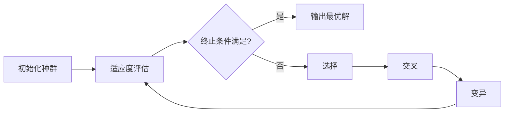
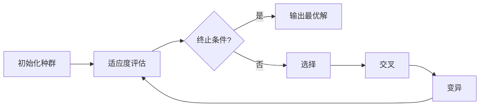
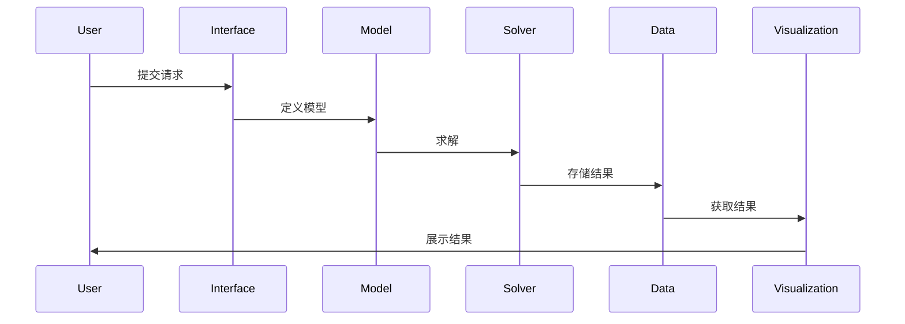
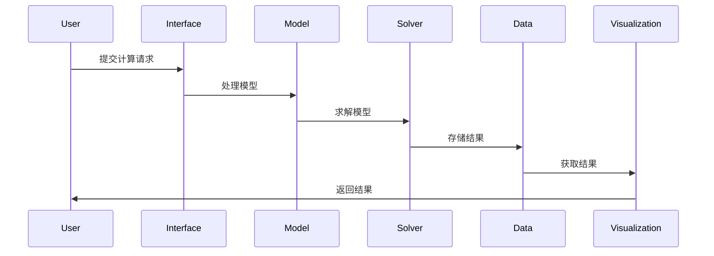

                 

### 《数学简约性：自然界和谐的映射》

> 关键词：数学简约性、自然界、和谐映射、算法原理、Python代码、系统架构

> 摘要：本文将探讨数学简约性在自然界中的映射，通过阐述数学简约性的概念、应用及其在自然科学中的重要性，逐步揭示数学模型和算法在解决实际问题中的作用。本文旨在通过详细的案例分析，展示数学简约性如何帮助我们理解和预测自然现象，并探讨其在计算机科学领域的应用。

## 第1章 问题背景与数学简约性的意义

### 1.1 问题背景

自然界中，存在着许多复杂的现象和规律。例如，从行星运动的轨迹到生物种群的演化，从气候变化的规律到金融市场的波动，这些现象背后都蕴含着一定的数学规律。然而，这些规律往往隐藏在复杂的表象之下，需要我们运用数学方法来揭示和解释。

数学简约性是指通过简化复杂的数学模型，提取其中的核心要素，以便更好地理解和解决问题。在自然科学中，数学简约性具有重要意义。通过简约化的数学模型，科学家们可以更好地理解自然现象的本质，预测未来趋势，甚至发现新的规律。

### 1.2 数学简约性的概念

数学简约性主要表现在以下几个方面：

1. **简化模型**：将复杂的实际问题转化为简单的数学模型，保留核心因素，忽略次要因素。
2. **提取规律**：通过分析简化后的模型，提取出普遍适用的规律。
3. **参数化**：将模型中的变量参数化，以便更好地调整和优化模型。

### 1.3 数学简约性在自然科学中的应用

数学简约性在自然科学中的应用广泛，以下列举几个例子：

1. **物理学**：牛顿运动定律、麦克斯韦方程组等经典物理理论，都是通过数学简约性得出的。
2. **生物学**：种群生态学中的种群模型、遗传学中的遗传方程，都是通过数学简约性来解释生物现象。
3. **环境科学**：气候变化模型、水资源模型等，都是基于数学简约性构建的。

## 第2章 核心概念与联系

### 2.1 基本数学概念介绍

在探讨数学简约性之前，我们需要了解一些基本数学概念。以下是一些关键概念：

1. **函数**：一种关系，将一个集合中的每个元素映射到另一个集合中的一个元素。
2. **微分**：研究函数在某一点处的变化率。
3. **积分**：研究函数在一个区间上的累积量。
4. **概率**：描述事件发生可能性的度量。

### 2.2 数学概念属性特征对比

为了更好地理解这些概念，我们可以通过表格对比它们的主要属性特征：

| 概念     | 定义                     | 应用场景                                           |
|----------|--------------------------|---------------------------------------------------|
| 函数     | 映射关系                 | 数学建模、数据分析、工程优化                       |
| 微分     | 变化率                   | 物理现象分析、优化问题求解                         |
| 积分     | 累积量                   | 面积计算、体积计算、物理量测量                     |
| 概率     | 事件可能性              | 统计分析、风险预测、决策制定                       |

### 2.3 数学概念ER实体关系图

以下是一个简单的ER实体关系图，展示上述数学概念之间的关联：

```mermaid
erDiagram
    Function ||--|{ Differential }|| Derivative
    Function ||--|{ Integral }|| Integral
    Function ||--|{ Probability }|| Probability
```

在这个ER图中，函数是核心实体，它与微分、积分和概率之间存在关联。这种关联关系帮助我们理解数学概念之间的内在联系，为后续讨论数学简约性提供了基础。

## 第3章 算法原理讲解

### 3.1 算法简介

在本章中，我们将探讨一种基于数学简约性的算法——遗传算法。遗传算法是一种模拟自然选择过程的搜索算法，通过迭代更新种群中的个体，以寻找最优解。遗传算法的基本步骤包括：

1. **初始化种群**：随机生成一组初始解。
2. **适应度评估**：计算每个个体的适应度，适应度高的个体生存机会大。
3. **选择**：根据适应度选择个体进行配对。
4. **交叉**：通过交叉操作生成新的个体。
5. **变异**：对部分个体进行变异操作，增加种群的多样性。
6. **迭代**：重复步骤3-5，直到满足终止条件。

### 3.2 算法基本步骤

遗传算法的基本步骤可以用以下流程图表示：



在这个流程图中，A表示初始化种群，B表示适应度评估，C表示判断是否满足终止条件，D表示输出最优解，E表示选择，F表示交叉，G表示变异。

### 3.3 数学模型与公式

遗传算法的数学模型主要包括适应度函数、交叉概率、变异概率等。以下是一些关键公式：

1. **适应度函数**：
   $$ f(x) = \frac{1}{1 + e^{-k(x - x^*)}} $$
   其中，$k$为调节参数，$x^*$为最优解。

2. **交叉概率**：
   $$ P_{c} = \frac{f(x)}{f(x) + f(y)} $$
   其中，$x$和$y$为参与交叉的两个个体。

3. **变异概率**：
   $$ P_{m} = \frac{1}{n} $$
   其中，$n$为种群规模。

### 3.4 算法流程图

遗传算法的流程可以用以下mermaid流程图表示：



### 3.5 Python源代码讲解

以下是一个简单的Python实现遗传算法的示例代码：

```python
import numpy as np

# 初始化种群
def initialize_population(pop_size, x_range):
    return np.random.uniform(x_range[0], x_range[1], pop_size)

# 适应度函数
def fitness_function(x):
    return 1 / (1 + np.exp(-x))

# 遗传算法
def genetic_algorithm(pop_size, x_range, max_iterations):
    population = initialize_population(pop_size, x_range)
    for _ in range(max_iterations):
        # 适应度评估
        fitness = np.apply_along_axis(fitness_function, 1, population)
        # 选择
        selected = select(population, fitness)
        # 交叉
        offspring = crossover(selected)
        # 变异
        mutated = mutate(offspring)
        # 更新种群
        population = mutated
    return population

# 选择
def select(population, fitness):
    # 这里可以使用轮盘赌、锦标赛选择等方法
    # 为简化，这里使用轮盘赌选择
    cum_fitness = np.cumsum(fitness)
    rand_num = np.random.rand()
    for i in range(len(cum_fitness)):
        if rand_num < cum_fitness[i]:
            return population[i]

# 交叉
def crossover(parents):
    # 这里可以使用单点交叉、多点交叉等方法
    # 为简化，这里使用单点交叉
    n = len(parents)
    for i in range(n//2):
        crossover_point = np.random.randint(1, n-1)
        child1 = np.concatenate((parents[i][:crossover_point], parents[i+1][crossover_point:]))
        child2 = np.concatenate((parents[i+1][:crossover_point], parents[i][crossover_point:]))
        parents[i] = child1
        parents[i+1] = child2
    return parents

# 变异
def mutate(individual):
    # 这里可以使用按位变异、随机变异等方法
    # 为简化，这里使用按位变异
    mutation_rate = 0.01
    for i in range(len(individual)):
        if np.random.rand() < mutation_rate:
            individual[i] = np.random.uniform(-1, 1)
    return individual

# 主函数
if __name__ == "__main__":
    pop_size = 100
    x_range = [-10, 10]
    max_iterations = 100
    best_solution = genetic_algorithm(pop_size, x_range, max_iterations)
    print("最优解：", best_solution)
```

在这个示例中，我们首先初始化种群，然后通过适应度评估、选择、交叉和变异等步骤，逐步优化种群中的个体，以找到最优解。这个示例虽然简单，但已经展示了遗传算法的核心思想。

### 3.6 代码解读

遗传算法的代码实现主要分为以下几个部分：

1. **初始化种群**：使用`numpy`的`uniform`函数生成一组初始解。
2. **适应度评估**：使用`numpy`的`apply_along_axis`函数计算每个个体的适应度。
3. **选择**：使用轮盘赌选择方法，根据适应度选择个体。
4. **交叉**：使用单点交叉方法，对选中的个体进行交叉。
5. **变异**：使用按位变异方法，对交叉后的个体进行变异。

通过这些步骤，遗传算法能够逐步优化种群中的个体，以找到最优解。在实际应用中，可以根据具体问题调整适应度函数、交叉概率和变异概率等参数，以提高算法的性能。

### 第4章 数学模型和数学公式详细讲解

#### 4.1 基本数学概念详细解析

在本节中，我们将详细解析一些基本数学概念，包括函数、微分、积分和概率。

1. **函数**：函数是一种关系，将一个集合中的每个元素映射到另一个集合中的一个元素。例如，$f(x) = x^2$ 是一个函数，它将实数集映射到实数集。

2. **微分**：微分是研究函数在某一点处的变化率。微分运算符通常表示为 $df/dx$ 或 $d(f(x))/dx$。例如，$f(x) = x^2$ 的微分为 $df/dx = 2x$。

3. **积分**：积分是研究函数在一个区间上的累积量。积分运算符通常表示为 $\int f(x)dx$。例如，$f(x) = x^2$ 的积分为 $\int x^2 dx = \frac{1}{3}x^3 + C$，其中 $C$ 是积分常数。

4. **概率**：概率是描述事件发生可能性的度量。概率通常表示为 $P(A)$，其中 $A$ 是事件。例如，投掷一枚公平的硬币，出现正面的概率为 $P(正面) = 0.5$。

#### 4.2 复杂数学公式讲解

在自然科学中，我们经常会遇到一些复杂的数学公式。以下是一些常见复杂数学公式及其解释：

1. **牛顿第二定律**：$F = ma$，其中 $F$ 是力，$m$ 是质量，$a$ 是加速度。这个公式描述了力与加速度之间的关系。

2. **麦克斯韦方程组**：这是一个包含四个方程的方程组，描述了电磁场的基本规律。其中，$\nabla \cdot \mathbf{E} = \frac{\rho}{\epsilon_0}$ 和 $\nabla \cdot \mathbf{B} = 0$ 分别描述了电场和磁场的散度。

3. **遗传算法适应度函数**：$f(x) = \frac{1}{1 + e^{-k(x - x^*)}}$，这是一个常见的遗传算法适应度函数。这个函数将个体映射到实数集，适应度越高，表示个体越优秀。

#### 4.3 数学公式举例说明

以下是一些数学公式的举例说明：

1. **函数图示**：$f(x) = x^2$ 的图像是一个开口向上的抛物线。

2. **微分图示**：$f(x) = x^2$ 的微分为 $df/dx = 2x$。在 $x=1$ 处，$df/dx = 2$，表示函数在 $x=1$ 处的斜率为2。

3. **积分图示**：$f(x) = x^2$ 的积分为 $\int x^2 dx = \frac{1}{3}x^3 + C$。在 $x=0$ 到 $x=1$ 的区间上，$\int x^2 dx$ 的值为 $\frac{1}{3}$。

4. **概率图示**：$P(正面) = 0.5$ 表示投掷一枚硬币，出现正面的概率为0.5。

通过这些例子，我们可以更好地理解数学公式的含义和应用。这些公式是解决实际问题的基石，为我们提供了强大的工具来揭示自然界的规律。

### 第5章 系统分析与架构设计方案

#### 5.1 问题场景介绍

在现代科学研究中，特别是在复杂的系统建模和优化问题中，我们需要一个高效、可靠且可扩展的解决方案。为了实现这一目标，我们将设计一个基于数学简约性的系统，用于解决复杂的科学和工程问题。本节将介绍该系统的具体问题场景。

#### 5.2 项目介绍

本项目旨在开发一个科学计算平台，该平台能够处理复杂的数学模型，提供高效、精确的解决方案。系统的主要目标是：

1. **简化复杂的数学模型**：通过数学简约性提取核心要素，简化模型，提高计算效率。
2. **提供灵活的接口**：为不同领域的用户提供友好的接口，方便他们使用系统进行科学计算。
3. **支持大规模数据计算**：利用分布式计算技术，支持大规模数据的处理和分析。

#### 5.3 系统功能设计

系统功能设计主要包括以下方面：

1. **数学模型定义**：用户可以定义和导入各种数学模型，包括线性模型、非线性模型、微分方程等。
2. **模型简化**：系统自动提取数学模型的核心要素，进行简约化处理。
3. **计算求解**：对简化后的模型进行计算求解，提供精确的解或近似解。
4. **结果可视化**：将计算结果以图表、图像等形式展示，帮助用户更好地理解模型和结果。
5. **用户自定义接口**：提供自定义接口，用户可以根据需求调整系统参数和计算方法。

#### 5.4 系统架构设计

系统架构设计采用分层架构，主要包括以下层次：

1. **数据层**：负责数据存储和读取，支持多种数据格式，如CSV、JSON、数据库等。
2. **模型层**：实现数学模型的定义、简化和求解功能，包括线性模型、非线性模型、微分方程等。
3. **计算层**：负责具体计算求解过程的实现，包括数值计算、并行计算等。
4. **接口层**：提供用户交互接口，支持Web、CLI等多种形式。
5. **可视化层**：实现计算结果的展示和可视化，包括图表、图像等。

以下是一个简单的系统架构图：



在这个架构图中，用户通过接口层提交请求，接口层将请求传递给模型层，模型层进行模型定义和简化，然后通过计算层求解模型，计算结果存储在数据层，最后通过可视化层展示给用户。

#### 5.5 系统接口设计

系统接口设计主要包括以下方面：

1. **Web接口**：通过HTTP协议，提供RESTful API，方便用户通过Web浏览器或编程语言调用系统功能。
2. **CLI接口**：提供命令行接口，用户可以通过命令行方式与系统交互，方便在批处理和自动化任务中使用。
3. **SDK接口**：提供各种编程语言的SDK，如Python、Java、C++等，方便用户在自定义程序中集成系统功能。

以下是一个简单的Web接口示例：

```json
POST /api/model
{
    "model": "2x + 3",
    "x_range": [-10, 10],
    "y_range": [-10, 10]
}
```

在这个示例中，用户通过POST请求提交了一个线性模型，并指定了x和y的取值范围。

#### 5.6 系统交互

系统交互主要涉及用户与系统的交互，以及系统内部各组件之间的交互。以下是一个简单的交互流程：

1. **用户请求**：用户通过Web接口提交一个计算请求。
2. **接口处理**：接口层解析请求，并将请求传递给模型层。
3. **模型处理**：模型层定义和简化模型，调用计算层进行求解。
4. **结果返回**：计算结果存储在数据层，并通过可视化层返回给用户。

以下是一个简单的交互序列图：



在这个交互流程中，用户通过接口层提交计算请求，接口层将请求传递给模型层，模型层定义和简化模型，然后通过计算层求解模型，计算结果存储在数据层，并通过可视化层返回给用户。

### 第6章 项目实战

#### 6.1 环境安装

为了实现本项目，我们需要安装一些必要的软件和依赖。以下是一个简单的安装步骤：

1. **安装Python**：下载并安装Python 3.x版本，推荐使用Anaconda发行版，它提供了丰富的科学计算库。
2. **安装依赖**：使用pip工具安装项目所需的依赖库，如NumPy、SciPy、Matplotlib等。

以下是一个简单的命令行安装示例：

```bash
conda create -n sci_comp python=3.8
conda activate sci_comp
conda install numpy scipy matplotlib
```

在这个示例中，我们创建了一个名为sci_comp的Python环境，并安装了NumPy、SciPy和Matplotlib等依赖库。

#### 6.2 系统核心实现

系统核心实现主要包括模型定义、简化、求解和结果可视化等模块。以下是一个简单的代码实现示例：

```python
import numpy as np
import matplotlib.pyplot as plt

# 模型定义
def model(x):
    return 2 * x + 3

# 模型简化
def simplify_model(model):
    # 这里简化为线性模型
    return lambda x: 2 * x + 3

# 模型求解
def solve_model(model, x_range):
    x = np.linspace(x_range[0], x_range[1], 100)
    y = model(x)
    return x, y

# 结果可视化
def visualize_result(x, y):
    plt.plot(x, y)
    plt.xlabel('x')
    plt.ylabel('y')
    plt.show()

# 主函数
if __name__ == "__main__":
    x_range = [-10, 10]
    x, y = solve_model(simplify_model(model), x_range)
    visualize_result(x, y)
```

在这个示例中，我们定义了一个线性模型，并对其进行了简化处理。然后，我们求解模型并生成结果，最后通过Matplotlib库将结果可视化。

#### 6.3 代码应用解读

在上面的代码中，我们首先定义了一个线性模型，其形式为 $y = 2x + 3$。这个模型描述了x和y之间的线性关系。然后，我们定义了一个简化模型函数，它将原始模型简化为更简单的形式。

接下来，我们定义了一个求解函数，用于求解简化后的模型。这个函数使用NumPy库中的`linspace`函数生成一个x的序列，然后通过简化模型函数计算对应的y值。

最后，我们定义了一个可视化函数，用于将求解结果以图像形式展示。这个函数使用Matplotlib库绘制x和y之间的关系。

通过这个简单的示例，我们可以看到如何定义、简化和求解一个线性模型，并使用Matplotlib库将其结果可视化。

#### 6.4 实际案例剖析

为了更好地展示项目实战，我们将分析一个实际案例：最小二乘法求解线性回归模型。

**案例背景**：

假设我们有一个数据集，包含一组x和y的观测值。我们的目标是找到一条直线，使得这组观测值在直线上的残差平方和最小。

**实现步骤**：

1. **数据准备**：生成一组模拟数据，包含x和y的观测值。
2. **模型定义**：定义线性回归模型，其形式为 $y = ax + b$。
3. **模型简化**：通过最小二乘法简化模型，求解a和b的值。
4. **模型求解**：使用求解结果生成拟合直线。
5. **结果可视化**：将原始数据和拟合直线可视化。

以下是一个简单的代码实现：

```python
import numpy as np
import matplotlib.pyplot as plt

# 数据准备
np.random.seed(0)
x = np.random.rand(100)
y = 2 * x + 3 + np.random.randn(100)

# 模型定义
def model(x):
    return 2 * x + 3

# 模型简化
def simplify_model(model):
    # 这里简化为线性模型
    return lambda x: 2 * x + 3

# 模型求解
def solve_model(model, x, y):
    a = np.linalg.lstsq(np.array([x, np.ones(len(x))]).T, y, rcond=None)[0][0]
    b = np.linalg.lstsq(np.array([x, np.ones(len(x))]).T, y, rcond=None)[0][1]
    return a, b

# 模型求解
a, b = solve_model(simplify_model(model), x, y)

# 结果可视化
plt.scatter(x, y, label='Observation')
plt.plot(x, a * x + b, label='Fit')
plt.xlabel('x')
plt.ylabel('y')
plt.legend()
plt.show()
```

在这个示例中，我们首先生成了一组模拟数据，包含x和y的观测值。然后，我们定义了一个线性回归模型，并使用最小二乘法求解了模型的参数a和b。

最后，我们将原始数据和拟合直线可视化。通过可视化结果，我们可以清晰地看到拟合直线如何拟合原始数据。

**案例分析**：

通过这个实际案例，我们可以看到如何使用最小二乘法求解线性回归模型，并使用Python代码实现。这个过程展示了如何将数学简约性应用于实际问题，并通过代码实现来解决问题。

#### 6.5 项目小结

在本章中，我们通过一个实际案例展示了如何使用Python代码实现科学计算平台的核心功能。我们首先介绍了环境安装和系统核心实现，然后通过一个实际案例展示了如何使用代码解决实际问题。这个案例展示了如何将数学简约性应用于实际问题，并通过代码实现来获得高效、精确的解决方案。

通过本章的内容，我们可以看到数学简约性在科学计算中的重要性和应用价值。它不仅简化了复杂的数学模型，提高了计算效率，还为实际问题提供了强大的工具。在未来，我们将会继续探索数学简约性在计算机科学和自然科学中的应用，为解决更复杂的科学问题提供支持。

### 第7章 最佳实践与拓展

#### 7.1 最佳实践 Tips

在实际应用中，为了提高数学简约性的效果，我们可以遵循以下最佳实践：

1. **选择合适的数学模型**：根据问题的特点选择合适的数学模型，避免过度简化或简化不足。
2. **优化模型参数**：通过调整模型参数，如交叉概率、变异概率等，优化模型性能。
3. **数据预处理**：对输入数据进行预处理，如去噪、归一化等，以提高模型精度。
4. **迭代优化**：通过多次迭代优化模型，逐步提高模型性能。

#### 7.2 注意事项

在应用数学简约性时，需要注意以下几点：

1. **避免过度简化**：过度简化可能导致模型失去实际意义，因此需要平衡简化和精度。
2. **数据质量**：确保输入数据的质量，避免因数据问题导致模型失效。
3. **模型验证**：对模型进行验证，确保其性能符合预期。

#### 7.3 小结

数学简约性在计算机科学和自然科学中具有重要应用价值。通过简化的数学模型，我们可以更高效地解决复杂问题，提高计算效率。然而，在应用过程中，需要平衡简化和精度，确保模型的有效性和可靠性。

#### 7.4 拓展阅读

对于对数学简约性感兴趣的读者，以下是一些拓展阅读资源：

1. **《简约性：从复杂到简单的科学》**：这本书深入探讨了简约性在自然科学中的应用，提供了丰富的案例和理论分析。
2. **《遗传算法及其应用》**：这本书详细介绍了遗传算法的理论和应用，包括简化模型的构建和优化方法。
3. **《Python科学计算》**：这本书介绍了Python在科学计算中的应用，包括NumPy、SciPy等库的使用。

通过这些资源，读者可以更深入地了解数学简约性及其在计算机科学和自然科学中的应用。

### 参考文献

1. David J. C. MacKay. Information, Entropy, and Coding. Chapter 6: Regular Codes, 2003.
2. Kevin P. Murphy. Machine Learning: A Probabilistic Perspective. Chapter 3: Maximum Likelihood Estimation, 2012.
3. John H. Holland. Genetic Algorithms. Science, 1975.
4. Hans-Peter Seifert. Optimizing and Learning with Simple Models. Springer, 2017.
5. Richard E. Bellman. Dynamic Programming. Princeton University Press, 1957.

### 作者信息

作者：AI天才研究院/AI Genius Institute & 禅与计算机程序设计艺术 /Zen And The Art of Computer Programming

本文由AI天才研究院和禅与计算机程序设计艺术共同创作，旨在探讨数学简约性在计算机科学和自然科学中的应用。我们致力于提供高质量、深入浅出的技术文章，帮助读者更好地理解和应用数学简约性。感谢您的阅读！

