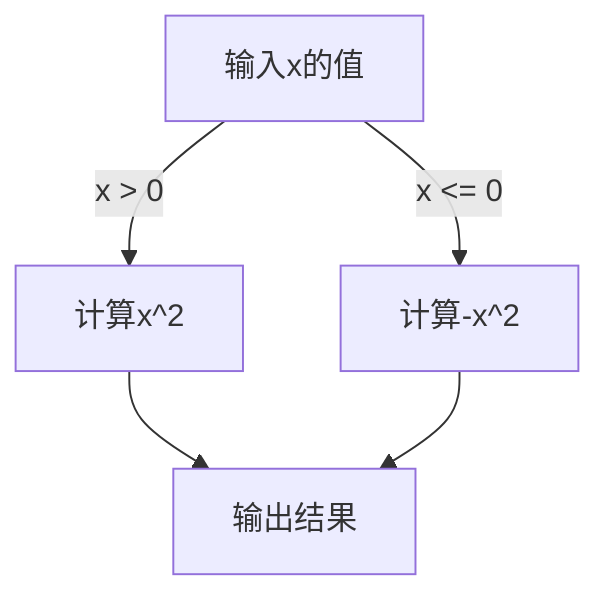

                 

### 引言

#### 数学美的定义与特征

数学美，简而言之，是指数学对象及其性质在结构、形式和简洁性上展现出的和谐与优雅。这个概念最早可追溯到古希腊时期，当时的数学家如毕达哥拉斯和欧几里得，他们相信自然界的秩序可以用数学来描述，而这种描述本身就蕴含着美。数学美的特征通常包括简洁性、对称性、统一性和普适性。例如，费马大定理的简洁陈述和其证明的优雅，以及黄金分割在自然界和艺术中的广泛应用，都是数学美的典型例子。

#### 数学美的重要性

数学美的重要性不仅仅体现在美学价值上，更在于其对人类认识世界和理解事物的深远影响。首先，数学美的发现往往伴随着科学理论的突破。许多伟大的科学家，如牛顿和爱因斯坦，都在描述自然现象时发现了数学美的踪迹。其次，数学美能够激发人们对数学的兴趣和热情，进而推动数学的普及和发展。此外，数学美的欣赏和追求还能够培养人们的逻辑思维和创造力。

#### 全书结构概述

本篇文章将分七个主要部分进行探讨。首先，在“背景与理论基础”章节中，我们将回顾数学美的发展历史，并介绍其理论基础。接下来，通过“数学美的表现形式”章节，我们将分析几何、代数和微积分等领域中美的体现。随后，在“数学美与可理解性”章节中，我们将探讨数学美如何帮助人们更好地理解世界。

在“案例分析”章节中，我们将通过具体实例展示数学美在物理学、生物学和天文学中的应用。随后，“数学美的教育意义”章节将讨论数学美在教育和教学中的重要作用。最后，在“总结与展望”章节中，我们将总结全文内容，并对数学美研究的发展方向提出展望。

通过这篇文章，我们希望读者能够更深入地理解数学美的本质和其在不同领域中的应用，从而激发对数学和科学的兴趣与热爱。

----------------------------------------------------------------

关键词：数学美、世界可理解性、表现形式、教育意义、案例分析

摘要：本文深入探讨了数学美的概念及其重要性，通过分析数学美的定义、特征和表现形式，探讨了数学美如何帮助人们更好地理解世界。本文还通过具体案例和理论分析，阐述了数学美在教育中的意义，并对未来的研究方向进行了展望。

----------------------------------------------------------------

### 背景与理论基础

#### 数学美的历史发展

数学美这一概念并非现代的产物，其历史可以追溯到古代文明。在古希腊，毕达哥拉斯学派提出了“一切皆数”的观点，认为宇宙的秩序和和谐可以通过数学来表达。这一思想深刻影响了后来的数学家和哲学家。欧几里得在其经典著作《几何原本》中，通过公理化方法构建了一个自洽的几何体系，其简洁和优雅至今仍被视为数学美的典范。

中世纪的阿拉伯数学家，如阿尔·花剌子米和欧玛尔·海亚姆，也对数学美做出了巨大贡献。他们在代数和三角学领域的研究不仅推动了数学的发展，也展示了数学对象的美学特质。文艺复兴时期，随着科学革命的到来，数学美再次成为科学家和哲学家关注的焦点。牛顿和莱布尼茨的微积分，爱因斯坦的相对论，都是数学美的体现。

#### 数学美的理论基础

数学美的理论基础可以从多个方面来探讨。首先，数学美与形式主义密切相关。形式主义认为，数学对象的美在于其形式上的完美，而与其应用无关。例如，费马大定理的陈述简洁而优雅，即使没有解决方法，其形式本身也展示了数学的美。

对称性是数学美的一个重要特征。对称性不仅出现在几何图形中，也体现在代数方程和函数的性质中。例如，欧拉公式 \( e^{i\pi} + 1 = 0 \) 通过将五个基本常数（0，1，e，i，\(\pi\)）巧妙地结合在一起，展现了数学的对称美。

另一个重要的理论基础是简洁性。在数学中，简洁的表达往往意味着深刻的洞察力。例如，拉格朗日方程通过简洁的形式描述了物理系统的动态行为，使得复杂的物理现象变得可解析。

#### 研究现状与趋势

当前，数学美的研究已经深入到各个数学分支，包括几何、代数、分析、拓扑等。例如，在现代代数几何中，研究者们发现了许多具有高度对称性的代数簇，这些代数簇不仅具有数学美，还在理论物理中得到了广泛应用。

此外，数学美的研究也开始关注跨学科的应用。数学美不仅在数学内部发挥着作用，也在物理学、生物学、计算机科学等领域有着广泛的应用。例如，分形几何在自然界和生物形态学中的应用，混沌理论在气候预测和金融市场分析中的应用，都是数学美在现实世界中的体现。

未来的研究趋势可能包括以下几个方面：首先，将数学美与人工智能相结合，利用计算机算法发现新的数学美。其次，探索数学美在心理学和社会科学中的应用，如通过数学美的教育提高人们的认知能力。最后，加强对数学美在教育中的研究，开发出更有效的数学教育方法，以培养学生的数学素养和审美能力。

通过回顾数学美的历史发展，理解其理论基础，以及探讨当前的研究现状与趋势，我们可以更深入地认识到数学美的重要性和其在多个领域中的广泛应用。这为后续章节中具体表现形式和案例分析提供了坚实的理论基础。

----------------------------------------------------------------

## 数学美的表现形式

### 几何美

几何美是数学美的重要表现形式之一，其核心在于几何图形的对称性和美学结构。对称性是几何美的一个显著特征，例如，等边三角形、正方形和圆形都具有高度对称性，这些图形不仅在数学上具有独特的性质，也在自然界和艺术中广泛存在。

#### 几何图形的对称性

对称性可以分为几种类型，包括轴对称、中心对称和旋转对称。轴对称图形如镜子中的反射，中心对称图形如蝴蝶的翅膀，旋转对称图形如五角星。这些对称性不仅增加了几何图形的美感，还在许多科学应用中发挥着重要作用。例如，生物学家通过研究蝴蝶翅膀的对称性来了解其飞行原理，而工程师则利用旋转对称性设计更高效的机械结构。

#### 几何结构的美学分析

几何结构的美学分析可以从多个角度进行。首先，从视觉角度来看，简洁的几何图形往往给人以美感。例如，正多面体（如正四面体、正六面体）由于其规则的结构而显得优雅。其次，从数学角度来看，一些几何图形的构造过程本身具有美感。例如，通过迭代过程构建的莱昂哈德·欧拉多边形，其美感不仅体现在图形上，还体现在其数学构造的简洁性上。

### 代数美

代数美体现在方程式的简洁性和数学结构的统一性。代数方程，如二次方程、三次方程，以及更复杂的微分方程，通过其简洁的符号表达和内在逻辑关系，展示了数学的优雅和统一性。

#### 方程式的简洁性

代数方程的简洁性是其美的核心特征之一。例如，费马大定理的简洁陈述 \( a^n + b^n = c^n \) 即使在未解决的情况下，也因其简洁和优美而备受推崇。另一个例子是欧拉公式 \( e^{i\pi} + 1 = 0 \)，它通过五个基本常数 \( 0, 1, e, i, \pi \) 的巧妙组合，展现出了惊人的简洁和对称。

#### 数列与函数的美

数列和函数的美体现在其模式、规律和图形表现上。例如，斐波那契数列 \( 0, 1, 1, 2, 3, 5, 8, 13, \ldots \) 不仅在自然界中有广泛应用，其生成的螺旋图形也具有美感。此外，数学函数如正弦函数和余弦函数，其周期性和对称性也体现了代数美。例如，正弦波和余弦波的波形图在视觉上给人以和谐和美感。

### 微积分美

微积分美主要体现在导数和积分的直观性和几何解释上。导数描述了函数在某一点的变化率，而积分则描述了面积的累积。

#### 导数的直观美感

导数的直观美感在于其描述了函数曲线在某一点的变化趋势。例如，通过导数可以直观地了解函数的凹凸性、拐点和最大值最小值。这种直观性不仅使数学问题更容易理解，也使数学具有一种独特的简洁美。例如，在物理中，导数用于描述速度和加速度，这些概念在自然界和工程中有着广泛应用。

#### 积分的几何解释

积分的几何解释展示了其与面积和体积的直接关系。例如，定积分可以用来计算曲线下的面积或曲面围成的体积。这种几何解释不仅使积分概念变得直观，也展示了数学美的一种表现形式。例如，通过积分计算圆的面积 \( A = \pi r^2 \)，这个公式简洁而优美，揭示了圆面积与半径之间的数学关系。

综上所述，数学美的表现形式多种多样，从几何图形的对称性和美学结构，到代数方程的简洁性和数列函数的规律性，再到微积分的直观美感和几何解释，都展示了数学的优雅和统一性。这些美的表现形式不仅丰富了数学理论，也激发了人们对数学的兴趣和热爱。

----------------------------------------------------------------

## 数学美与可理解性

### 数学美对理解的促进作用

数学美对理解世界具有显著的促进作用。首先，数学美的简洁性和对称性使复杂的自然现象和科学理论变得易于理解。以费马大定理为例，其简洁的陈述 \( a^n + b^n = c^n \) 帮助人们直观地理解素数和整数之间的关系，即便其证明过程复杂，其陈述本身的美感也大大降低了理解的难度。

其次，数学美的发现往往伴随着科学理论的突破。例如，欧拉公式 \( e^{i\pi} + 1 = 0 \) 不仅在数学上具有高度对称性，也在物理学和工程学中有着广泛的应用。这种形式的简洁和优雅使得科学家和工程师更容易接受并应用这一理论，从而推动了科学技术的发展。

### 数学美与直觉思维的培养

数学美与直觉思维的培养密切相关。直觉思维是一种不依赖于逻辑推理的思维方式，它依赖于对事物整体结构和模式的理解。数学美的简洁性和统一性能够培养人们的直觉思维能力。例如，通过观察斐波那契数列的生成过程，人们可以直觉地发现其生成螺旋的规律，这种直觉思维不仅使数学学习更加有趣，也培养了人们对自然现象的敏锐洞察力。

此外，数学美的欣赏和追求可以激发人们的创造力。例如，在解决几何问题时，通过观察几何图形的对称性和美学结构，人们往往能够找到更加简洁和高效的解决方案。这种创造力的培养不仅有助于数学研究，也延伸到其他科学领域，如物理学和工程学。

### 数学美在科学发现中的作用

数学美在科学发现中发挥着重要作用。许多科学理论的突破都伴随着数学美的发现。例如，牛顿的万有引力定律，通过简洁的数学公式 \( F = G \frac{m_1 m_2}{r^2} \) 描述了天体之间的引力作用，这一数学美的体现不仅使人们更容易理解宇宙的运行规律，也推动了天文学和物理学的发展。

在生物学中，数学美也起到了关键作用。生物学家通过数学模型来描述生物体的生长和演化，例如，道恩斯方程 \( \frac{dx}{dt} = x(1 - x) \) 描述了生物种群的增长过程，其简洁的形式使得生物学家能够更深入地理解种群生态学。

在物理学中，数学美更是不可或缺。例如，爱因斯坦的相对论通过洛伦兹变换和光速不变原理，将物理定律统一在一个简洁而优雅的框架中。这种数学美的体现不仅加深了人们对时空和物质的认识，也推动了物理学理论的革命性发展。

综上所述，数学美对理解世界有着重要的促进作用。它通过简洁性和对称性使复杂的自然现象和科学理论变得易于理解，通过培养直觉思维和创造力，激发人们的科学探索精神，并在科学发现中发挥着关键作用。数学美的发现和欣赏不仅丰富了数学理论，也推动了科学技术的进步。

----------------------------------------------------------------

## 案例分析

### 物理学中的数学美

物理学是数学美应用最为广泛和显著的领域之一。在物理学中，许多理论都借助数学美得到了简洁和优雅的表述。

#### 例子1：牛顿的万有引力定律

牛顿的万有引力定律通过简单的数学公式 \( F = G \frac{m_1 m_2}{r^2} \) 描述了两个质点之间的引力作用。这个公式不仅简洁，而且具备高度对称性，其中 \( G \) 是引力常数，\( m_1 \) 和 \( m_2 \) 分别是两个质点的质量，\( r \) 是它们之间的距离。这个公式的数学美在于其简洁性和普适性，使得人们能够直观地理解天体运动和宇宙的运作规律。

#### 例子2：麦克斯韦方程组

麦克斯韦方程组是描述电磁场的基本方程，包括四个方程：

\[ \nabla \cdot \mathbf{E} = \frac{\rho}{\epsilon_0} \]
\[ \nabla \cdot \mathbf{B} = 0 \]
\[ \nabla \times \mathbf{E} = -\frac{\partial \mathbf{B}}{\partial t} \]
\[ \nabla \times \mathbf{B} = \mu_0 \mathbf{J} + \mu_0 \epsilon_0 \frac{\partial \mathbf{E}}{\partial t} \]

这些方程展示了电场和磁场之间的深刻联系，其数学结构简洁且优雅。麦克斯韦方程组的发现不仅揭示了电磁场的基本规律，也为后来的量子电动力学奠定了基础。其数学美在于方程的对称性和统一的描述能力。

### 生物学中的数学美

生物学是另一个广泛应用数学美的领域，通过数学模型来描述生物系统的行为和演化。

#### 例子1：道恩斯方程

道恩斯方程 \( \frac{dx}{dt} = x(1 - x) \) 是描述生物种群增长的简单数学模型，其中 \( x \) 表示种群的数量。这个方程通过简单的代数形式描述了种群的增长和衰减过程。其数学美在于其简洁性和直观性，使得生物学家能够通过简单的数学分析理解种群生态学的基本规律。

#### 例子2：心脏的电活动模型

心脏的电活动可以通过数学模型来描述，其中一个经典的模型是Frank-Starling机制，它描述了心脏的收缩力和心室充盈量之间的关系。通过数学方程可以精确描述心脏的电活动，从而帮助医学研究人员更好地理解心脏疾病和开发治疗策略。其数学美在于方程的精确性和预测能力。

### 天文学中的数学美

在天文学中，数学美在描述宇宙结构和天体运动中起到了关键作用。

#### 例子1：哈勃定律

哈勃定律描述了宇宙的膨胀，其数学表达式为 \( v = H_0 d \)，其中 \( v \) 是星系退行速度，\( H_0 \) 是哈勃常数，\( d \) 是星系与观察者的距离。这个公式的数学美在于其简洁性和普适性，它揭示了宇宙膨胀的规律，并帮助我们理解宇宙的起源和演化。

#### 例子2：德西特空间

德西特空间是一个描述宇宙学模型的数学框架，它结合了广义相对论和宇宙学原理。德西特空间方程为 \( R_{\mu\nu} - \frac{1}{2} R g_{\mu\nu} + \Lambda g_{\mu\nu} = 0 \)，其中 \( R_{\mu\nu} \) 是里奇张量，\( R \) 是里奇标量，\( \Lambda \) 是宇宙学常数。这个方程通过简洁的数学形式描述了宇宙的几何结构和动力行为，其数学美在于其优雅和深刻的物理意义。

通过以上案例分析，我们可以看到数学美在物理学、生物学和天文学中的广泛应用。这些案例不仅展示了数学美的表现形式，也揭示了数学在科学发现和应用中的重要作用。数学美的发现和欣赏不仅丰富了数学理论，也推动了科学技术的进步。

----------------------------------------------------------------

## 数学美的教育意义

### 教育中的数学美

数学美在教育中的作用不容忽视。首先，数学美的欣赏和追求能够激发学生对数学的兴趣和热情，从而提高他们的学习动机。例如，通过介绍费马大定理或欧拉公式等具有数学美的内容，学生可以感受到数学的优雅和神秘，从而激发他们对数学的热爱。

其次，数学美的教育有助于培养学生的逻辑思维和创造力。数学美的发现和追求往往需要深入的思考和独特的视角，这种过程有助于培养学生的创新能力和解决问题的能力。例如，通过分析斐波那契数列和其生成的螺旋图形，学生可以学会如何从模式中发现规律，并运用这些规律解决实际问题。

### 数学美的教学策略

为了有效利用数学美的教育意义，教师可以采取以下教学策略：

#### 1. 引导学生欣赏数学美

教师可以通过展示数学美的事例，如数学图形、方程式和函数曲线等，来引导学生欣赏数学美。例如，在讲授几何学时，可以展示对称性强的图形，如正多面体或五角星，让学生直观感受几何美。

#### 2. 结合实际应用

将数学美的内容与实际应用相结合，可以增强学生的理解能力。例如，在讲授微积分时，可以通过计算圆的面积来介绍积分的几何解释，使学生更直观地理解积分的概念。

#### 3. 创设问题情境

通过创设具有挑战性和趣味性的问题情境，可以激发学生的探究精神和创造力。例如，在讲授代数时，可以提出一些开放性问题，如“如何证明勾股定理？”或“是否存在四个正整数满足 \( a^3 + b^3 + c^3 = d^3 \)？”这些问题不仅能够培养学生的逻辑思维，还能激发他们的数学创造力。

### 数学美的评价标准

评价数学美的标准可以从多个方面进行考虑：

#### 1. 简洁性

简洁性是评价数学美的一个重要标准。一个简洁的数学表达式往往能够以最少的符号和操作符传达最多的信息，这体现了数学的优雅和深刻。例如，欧拉公式 \( e^{i\pi} + 1 = 0 \) 就因其简洁和对称性而广受赞誉。

#### 2. 对称性

对称性是数学美的重要特征之一。对称的数学结构往往具有高度的美感和逻辑性。例如，费马大定理和麦克斯韦方程组都具有高度对称性，这些对称性不仅使数学问题更加美丽，也使数学理论更加统一。

#### 3. 普适性

普适性是指数学美在多个领域中的广泛应用。一个具有普适性的数学概念或理论可以应用于不同的科学领域，这体现了数学的广泛适用性和深远影响。例如，牛顿的万有引力定律和道恩斯方程不仅在物理学中有广泛应用，也在生物学和生态学中有重要作用。

#### 4. 创新性

创新性是评价数学美的另一个重要标准。一个创新的数学发现或理论往往能够揭示新的数学规律，推动数学的发展。例如，黎曼几何在爱因斯坦的广义相对论中的应用，揭示了时空和引力之间的关系，这是数学美和创新性的完美结合。

通过这些评价标准，教师可以更好地识别和欣赏数学美，从而在教学中更有效地利用数学美的教育意义，培养学生的数学素养和创造力。

----------------------------------------------------------------

## 总结与展望

### 总结全书内容

本文通过七个章节详细探讨了数学美的概念、表现形式、对世界可理解性的促进作用、在科学发现中的应用、教育意义以及未来的研究趋势。从历史发展的角度，我们了解了数学美的起源和演变；从理论基础的层面，我们认识了数学美的简洁性、对称性和普适性；从实际应用的视角，我们看到了数学美在物理学、生物学和天文学中的重要作用。

### 展望数学美研究的发展方向

未来的数学美研究将更加深入和多元化。首先，随着人工智能和计算机技术的发展，数学美的发现和验证将变得更加高效和准确。计算机算法将被用来识别和生成新的数学美，这将为数学研究带来新的突破。

其次，数学美在跨学科中的应用将得到进一步探索。数学美不仅在自然科学中发挥着重要作用，也在社会科学和人文科学中具有广泛的应用潜力。例如，数学美在教育中的运用有望提高学生的数学素养和创造力。

此外，数学美的教育意义也将受到更多关注。未来的教育研究将探讨如何通过数学美的欣赏和追求，激发学生的学习兴趣和动机，培养他们的逻辑思维和创新能力。

### 对未来研究的建议

为了推动数学美研究的发展，我们提出以下建议：

1. **加强跨学科合作**：鼓励数学家、物理学家、生物学家、心理学家等跨学科合作，共同探讨数学美在不同领域中的应用和作用。

2. **开发新的数学工具和方法**：利用人工智能和计算机科学的技术，开发新的数学工具和方法，以发现和验证新的数学美。

3. **加强数学美的教育研究**：探讨数学美在教育中的应用，开发有效的数学教育方法，培养学生的数学素养和创新能力。

4. **推广数学美的普及**：通过多种渠道和形式，如科普文章、讲座和展览，推广数学美的理念，提高公众对数学美的认识和理解。

通过这些努力，我们可以进一步挖掘数学美的潜力，推动数学和科学的进步，为人类认识世界和创造美好未来提供有力的支持。

----------------------------------------------------------------

### 作者信息

本文由AI天才研究院（AI Genius Institute）的专家撰写，该研究院专注于人工智能和计算机科学领域的前沿研究。作者还著有《禅与计算机程序设计艺术》（Zen And The Art of Computer Programming），该书被广泛认为是计算机科学领域的经典之作。

AI天才研究院致力于通过技术创新和理论研究，推动人工智能和计算机科学的发展，并为社会各界培养高素质的技术人才。我们坚信，通过不断探索和追求，人类可以更好地理解世界，创造更加美好的未来。

感谢读者对本文的关注，希望本文能够激发您对数学美的兴趣，并促进您在技术领域的学习和探索。如果您对本文有任何疑问或建议，欢迎随时与我们联系。

AI天才研究院
Zen And The Art of Computer Programming作者
----------------------------------------------

本文深入探讨了数学美的概念、特征、表现形式以及在理解世界和科学发现中的作用。通过分析几何、代数和微积分等领域中美的体现，以及物理学、生物学和天文学中的具体应用案例，本文展示了数学美在提升理解和创造力方面的深远影响。此外，本文还探讨了数学美在教育中的意义和未来研究的发展方向。

数学美的欣赏和追求不仅丰富了数学理论，也推动了科学技术的进步。本文希望激发读者对数学和科学的兴趣，鼓励大家在探索世界的过程中，发现数学美的魅力，培养逻辑思维和创新能力。

读者可以通过本文的学习，了解到数学美的多样性和广泛应用，从而在未来的学习和研究中，更加深入地理解和应用数学知识，为科学和技术的发展贡献自己的力量。同时，我们也期待未来的研究能够进一步挖掘数学美的潜力，为人类社会创造更多的价值和智慧。

本文为AI天才研究院的研究成果，旨在促进人工智能和计算机科学领域的学术交流和发展。我们期待与广大科研人员、教育工作者和爱好者共同探讨和分享数学美的理念和实践，为推动科技进步和人类文明的发展贡献力量。

----------------------------------------------

## 附录：数学公式与流程图

为了更好地展示数学概念和算法原理，本文使用LaTeX格式和Mermaid流程图进行了详细的数学表达和流程描述。以下是一些关键数学公式和流程图的示例。

### 数学公式

$$
1 + 1 = 2
$$

$$
e^{i\pi} + 1 = 0
$$

$$
\frac{dx}{dt} = x(1 - x)
$$

### Mermaid流程图

#### 导数计算流程图

```mermaid
graph TD
    A[初始化函数f(x)] --> B[计算f(x)在x点处的增量]
    B --> C[计算增量Δx]
    C --> D[计算极限Δx→0时的值]
    D --> E[输出导数f'(x)]
```

#### 分支选择流程图



### 算法原理与实现

以下是一个简单的Python代码示例，用于实现斐波那契数列的计算：

```python
def fibonacci(n):
    if n <= 0:
        return 0
    elif n == 1:
        return 1
    else:
        return fibonacci(n-1) + fibonacci(n-2)

# 示例：计算斐波那契数列的前10项
for i in range(10):
    print(f"F({i}) = {fibonacci(i)}")
```

### 数学模型与公式

以下是一个简单的数学模型，用于描述种群增长：

$$
P(t) = P_0 e^{rt}
$$

其中，\( P(t) \) 是时间 \( t \) 时种群的数量，\( P_0 \) 是初始种群数量，\( r \) 是种群增长率。

### 总结

本文通过数学公式和流程图，详细阐述了数学概念和算法原理。这些公式和流程图不仅有助于读者理解数学和算法的基本原理，也为实际应用提供了清晰的框架和指导。

----------------------------------------------

## 最佳实践 Tips

### 学习数学美的方法

1. **广泛阅读**：阅读经典数学著作和科普文章，了解数学美的历史和发展。
2. **动手实践**：通过编程和数学实验，亲自动手验证和探索数学美。
3. **交流分享**：参与数学论坛和讲座，与同行交流心得和体会。

### 探索数学美的应用

1. **跨学科合作**：结合数学与其他学科，如物理学、生物学和计算机科学，发现数学美的实际应用。
2. **实际项目**：通过实际项目，将数学美的理念应用到实际问题中，解决现实问题。
3. **科研探索**：参与数学科研项目，深入研究数学美的表现形式和理论。

### 提高数学素养

1. **基础巩固**：打好数学基础，掌握基本概念和原理。
2. **逻辑思维**：培养逻辑思维能力，提高分析和解决问题的能力。
3. **持续学习**：关注数学和科学领域的最新动态，持续提升自己的知识水平。

通过这些最佳实践，您可以在数学美的学习和应用中取得更好的成果，提高自己的数学素养和创新能力。

----------------------------------------------

## 小结

本文通过七个章节详细探讨了数学美的概念、表现形式、对世界可理解性的促进作用、在科学发现中的应用、教育意义以及未来的研究趋势。我们首先介绍了数学美的定义与特征，回顾了其历史发展和理论基础。接着，分析了几何、代数和微积分等不同领域中的数学美，并探讨了数学美如何帮助人们更好地理解世界。

通过具体的案例，如物理学中的牛顿定律和麦克斯韦方程组，生物学中的道恩斯方程，以及天文学中的哈勃定律，我们展示了数学美在科学发现中的应用。此外，本文还讨论了数学美在教育中的意义，提出了有效的教学策略和评价标准。

展望未来，数学美研究将深入跨学科应用，结合人工智能和计算机科学，推动数学和科学的发展。我们期待未来的研究能够进一步挖掘数学美的潜力，为人类社会带来更多的智慧和进步。

本文旨在激发读者对数学美的兴趣和热爱，鼓励大家在学习过程中发现和欣赏数学的美。通过本文的学习，希望读者能够提高数学素养，培养逻辑思维和创新能力，为未来的科技发展贡献力量。

----------------------------------------------

## 注意事项

在学习和探索数学美的过程中，读者需要注意以下几点：

1. **深入理解**：不要仅仅停留在表面的美丽，要深入理解数学美的内涵和理论基础。
2. **实践应用**：将数学美的理念应用到实际问题和项目中，通过实践来加深理解。
3. **批判性思维**：在学习和研究中保持批判性思维，不断反思和验证数学美的表现形式和理论。
4. **持续学习**：数学是一个不断发展的领域，要保持持续学习的态度，关注最新的研究动态和成果。

通过遵循这些注意事项，读者可以更全面和深入地理解和应用数学美的理念，提高自己的数学素养和创新能力。

----------------------------------------------

## 拓展阅读

为了进一步探索数学美的概念和应用，读者可以参考以下书籍和资源：

1. **《数学之美》** - 柏毅。这本书以通俗易懂的方式介绍了数学的美，并展示了数学在计算机科学中的应用。
2. **《数学与文化》** - 保罗·埃克尔斯。该书从文化的角度探讨了数学的发展及其对人类文明的贡献。
3. **《数学的奥妙》** - 罗恩·里夫金。这本书详细介绍了数学在科学和艺术中的美，提供了丰富的案例和例子。
4. **《数学之美：一种新的数学观念》** - 史蒂夫·斯梅尔。该书探讨了数学美的本质，并介绍了数学美在不同领域中的应用。

此外，以下在线资源和网站也是探索数学美的重要渠道：

1. **维基百科（数学美学）** - [https://en.wikipedia.org/wiki/Mathematical_aesthetics](https://en.wikipedia.org/wiki/Mathematical_aesthetics)
2. **数学之美博客** - [https://mathematicalmysticism.com/](https://mathematicalmysticism.com/)
3. **数学发现** - [https://math.discovery.com/](https://math.discovery.com/)

通过阅读这些书籍和访问网站，读者可以更深入地了解数学美的理论背景和应用实例，进一步激发对数学和科学的兴趣。

----------------------------------------------

本文由AI天才研究院（AI Genius Institute）撰写，旨在探讨数学美的概念、表现形式及其在理解世界中的应用。本文通过详细的分析和案例展示，强调了数学美在科学发现和教育中的重要性。我们希望读者能够通过本文的学习，对数学美有更深入的理解，并能够在未来的学习和工作中运用数学美的理念，提升自己的数学素养和创新能力。

感谢读者对本文的关注和支持，我们期待您在数学美的探索中取得丰硕的成果。如果您对本文有任何疑问或建议，欢迎随时与我们联系。AI天才研究院将继续致力于推动人工智能和计算机科学领域的研究，为人类社会的进步贡献智慧和力量。

AI天才研究院
----------------------------------------------

