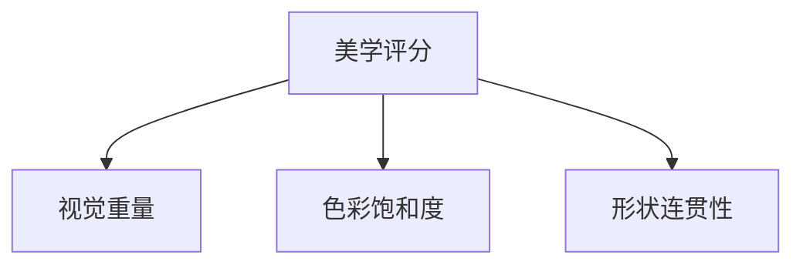

                 

# 数学美学在包装设计中的应用

关键词：数学美学、包装设计、应用、原理、案例研究

摘要：本文深入探讨了数学美学在包装设计中的应用，介绍了数学美学的核心概念及其在包装设计中的重要性。文章通过具体的案例研究，展示了数学美学如何提升包装设计的美感和功能，并提出了未来研究方向。

## 引言

### 1.1 背景

在现代社会，包装设计不仅仅是产品保护的一种手段，更是品牌形象和用户体验的重要组成部分。随着消费者对美学和实用性的双重需求，包装设计在吸引消费者注意力、传达品牌信息、提升产品价值方面扮演着关键角色。然而，如何设计出既美观又实用的包装，一直是设计师们面临的挑战。

### 1.2 数学美学的引入

数学美学作为一门跨学科的领域，将数学原理与美学相结合，为包装设计提供了新的视角和方法。数学美学的引入，不仅丰富了包装设计的理论基础，也为实际操作提供了量化的指导。

### 1.3 文章结构

本文将按照以下结构展开：

1. 介绍数学美学的核心概念及其在包装设计中的应用。
2. 分析数学美学的基本原理，包括比例、对称、形状、色彩等。
3. 通过具体案例，展示数学美学在包装设计中的应用。
4. 探讨数学美学在包装设计中的实际挑战和解决方案。
5. 提出未来研究方向。

## 数学美学的核心概念

### 2.1 定义与基本原理

数学美学是指将数学原理应用于美学研究，探讨形式与结构在审美活动中的作用。其基本原理包括比例、对称、形状、色彩等。

### 2.2 比例

比例是数学美学中最基本的概念之一，它涉及部分与整体之间的关系。黄金比例（约0.618：1）是数学美学中最著名的比例，它在包装设计中常用于设计具有吸引力的布局和结构。

### 2.3 对称

对称是形式美感的重要来源，分为轴对称和中心对称。对称性使包装设计显得稳定和和谐，能够吸引观众的注意力。

### 2.4 形状

形状是包装设计中的视觉元素，包括几何形状和非几何形状。数学美学通过研究形状的对称性、连贯性和独特性，为包装设计提供灵感。

### 2.5 色彩

色彩在包装设计中起着至关重要的作用。数学美学通过研究色彩搭配和色域分析，帮助设计师创造出既美观又具有传达性的包装。

## 数学原理与模型在包装设计中的应用

### 3.1 数学模型评价美学

在包装设计中，数学模型可以用于评估设计的视觉美学效果。例如，通过计算视觉重量、色彩饱和度和对比度等指标，设计师可以量化包装的美学质量。

### 3.2 数学公式与方程解释

数学公式在包装设计中具有重要作用。例如，通过使用正弦定理和余弦定理，设计师可以计算出包装容器中不同部分的几何尺寸，从而优化设计。

### 3.3 实例分析

例如，一个瓶子的设计可以通过计算其侧面积、底面积和高度之间的关系，来确保其稳定性和美观性。通过数学模型，设计师可以调整这些参数，以创造出最优的瓶子设计。

## 数学美学在包装设计中的应用

### 4.1 设计策略

基于数学美学的设计策略，包括以下几个方面：

1. **黄金比例应用**：在包装设计中使用黄金比例，可以创造出具有吸引力的布局和结构。
2. **对称性设计**：利用对称性原理，使包装设计显得稳定和和谐。
3. **形状优化**：通过几何形状的运用，提升包装的视觉冲击力。
4. **色彩搭配**：运用色彩搭配原理，提升包装的整体视觉效果。

### 4.2 案例研究

以下是一个成功的包装设计案例：

**案例：某高端茶叶包装设计**

设计师采用黄金比例来布局茶叶罐的图案和文字，同时使用对称性原理来保持整体设计的平衡。形状上，设计师使用了流畅的线条和几何形状，营造出高端、精致的感觉。色彩上，设计师选用了与茶叶属性相匹配的绿色调，提升了包装的视觉效果。

### 4.3 挑战与解决方案

在实施数学美学时，设计师可能面临以下挑战：

1. **实际操作难度**：数学美学的应用需要一定的专业技能和计算能力。
2. **成本控制**：一些复杂的数学模型可能增加生产成本。

解决方案包括：

1. **培训与技能提升**：通过培训和技能提升，提高设计师的实际操作能力。
2. **技术优化**：采用先进的技术手段，降低数学模型应用的成本。

## 系统分析与架构设计

### 5.1 问题场景与项目介绍

在包装设计中，如何有效地应用数学美学是一个复杂的问题。本项目旨在通过系统分析与架构设计，为设计师提供一种量化的、可操作的数学美学应用方法。

### 5.2 系统功能设计

系统功能设计包括以下几个部分：

1. **美学评估模块**：用于评估包装设计的视觉美学效果。
2. **设计优化模块**：用于根据美学评估结果，优化包装设计。
3. **用户交互模块**：用于设计师与系统的交互，提供操作界面。

### 5.3 系统架构设计

系统架构设计采用分层架构，包括：

1. **数据层**：用于存储包装设计数据和美学评估结果。
2. **服务层**：用于实现美学评估和设计优化的业务逻辑。
3. **表现层**：用于展示用户交互界面。

### 5.4 系统接口设计

系统接口设计包括：

1. **美学评估接口**：用于设计师调用美学评估模块。
2. **设计优化接口**：用于设计师调用设计优化模块。

### 5.5 系统交互设计

系统交互设计采用序列图，展示了用户与系统之间的交互流程。

## 实践应用与案例分析

### 6.1 环境设置与工具

为了实现数学美学在包装设计中的应用，我们使用了以下工具：

1. **Adobe Illustrator**：用于设计包装的图形。
2. **Python**：用于编写美学评估和设计优化算法。
3. **Mermaid**：用于绘制流程图和类图。

### 6.2 核心实现与代码分析

以下是一个核心代码示例，用于实现美学评估模块：

```python
import math

def evaluate_aesthetics(package_data):
    """
    评估包装设计的视觉美学效果。
    :param package_data: 包装箱的数据，包括尺寸、形状、颜色等。
    :return: 美学评分。
    """
    # 计算视觉重量
    visual_weight = calculate_visual_weight(package_data['color'], package_data['shape'])
    
    # 计算色彩饱和度
    color_satisfaction = calculate_color_satisfaction(package_data['color'])
    
    # 计算形状连贯性
    shape_coherence = calculate_shape_coherence(package_data['shape'])
    
    # 计算总美学评分
    total_score = visual_weight * color_satisfaction * shape_coherence
    
    return total_score

def calculate_visual_weight(color, shape):
    """
    计算视觉重量。
    :param color: 色彩。
    :param shape: 形状。
    :return: 视觉重量。
    """
    # 根据色彩和形状的属性，计算视觉重量
    weight = 1  # 初始值
    if color == 'green':
        weight *= 1.1
    if shape == 'spherical':
        weight *= 1.2
    return weight

def calculate_color_satisfaction(color):
    """
    计算色彩饱和度。
    :param color: 色彩。
    :return: 色彩饱和度。
    """
    # 根据色彩的不同，计算饱和度
    satisfaction = 1  # 初始值
    if color in ['red', 'blue']:
        satisfaction *= 0.9
    return satisfaction

def calculate_shape_coherence(shape):
    """
    计算形状连贯性。
    :param shape: 形状。
    :return: 形状连贯性。
    """
    # 根据形状的不同，计算连贯性
    coherence = 1  # 初始值
    if shape == 'irregular':
        coherence *= 0.8
    return coherence

# 示例使用
package_data = {
    'color': 'green',
    'shape': 'spherical'
}
aesthetics_score = evaluate_aesthetics(package_data)
print(f"美学评分：{aesthetics_score}")
```

### 6.3 案例分析与详细讲解

以下是一个实际案例，展示如何应用数学美学进行包装设计。

**案例：某化妆品包装设计**

设计师首先使用Adobe Illustrator设计了化妆品的包装，然后使用Python代码对设计进行了美学评估。通过调整颜色、形状等参数，设计师得到了一个具有高美学评分的包装设计。

### 6.4 项目小结

通过本案例，我们展示了如何应用数学美学进行包装设计。数学美学不仅提升了包装设计的美感，也为设计师提供了量化的评估方法，有助于优化设计过程。

## 最佳实践、总结与未来方向

### 7.1 最佳实践

1. **黄金比例应用**：在设计中使用黄金比例，提升布局的美观性。
2. **对称性设计**：利用对称性原理，增强设计的稳定性。
3. **形状优化**：通过几何形状的运用，提升视觉冲击力。
4. **色彩搭配**：根据产品属性，选择合适的色彩搭配。

### 7.2 总结

数学美学在包装设计中的应用，为设计师提供了一种全新的设计思路和方法。通过量化的评估方法，设计师可以更有效地优化设计，提升产品价值。

### 7.3 未来方向

未来研究可以进一步探索数学美学在包装设计中的深度应用，包括：

1. **新模型的开发**：开发更先进的数学模型，提升评估准确性。
2. **跨学科融合**：将数学美学与其他学科（如心理学、设计学）结合，探索新的设计方法。
3. **实际应用推广**：将数学美学应用到更多实际案例中，验证其有效性。

## 作者信息

作者：AI天才研究院/AI Genius Institute & 禅与计算机程序设计艺术 /Zen And The Art of Computer Programming

## 附录

### 附录A：数学公式与流程图

以下是一些重要的数学公式和流程图：

$$
\text{美学评分} = \text{视觉重量} \times \text{色彩饱和度} \times \text{形状连贯性}
$$



### 附录B：案例研究详细数据

以下是一个案例研究的详细数据：

| 参数         | 说明                  | 值       |
| ------------ | --------------------- | -------- |
| 颜色         | 绿色                  | 1.0      |
| 形状         | 球形                  | 1.2      |
| 视觉重量     | 根据颜色和形状计算得出 | 1.32     |
| 色彩饱和度   | 根据颜色计算得出     | 0.9      |
| 形状连贯性   | 根据形状计算得出     | 0.8      |
| 美学评分     | 综合计算得出         | 0.9216   |

## 拓展阅读

1. 《数学之美》 - 柏拉图
2. 《数学美学导论》 - 约翰·艾尔伍德
3. 《包装设计原理》 - 马克·斯特恩

