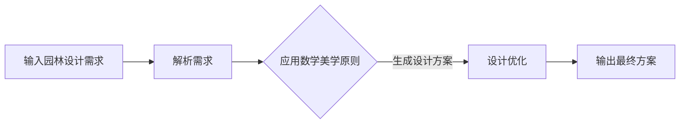
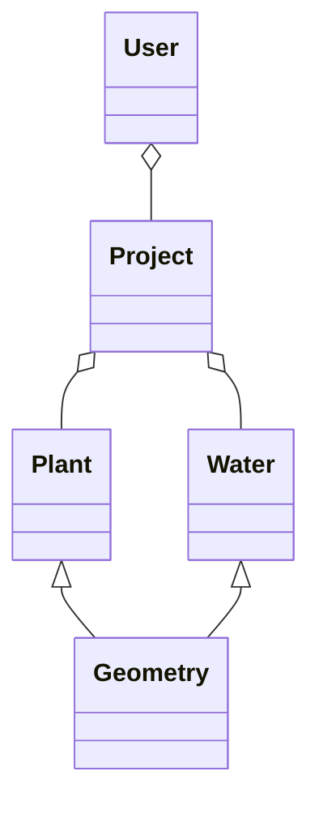
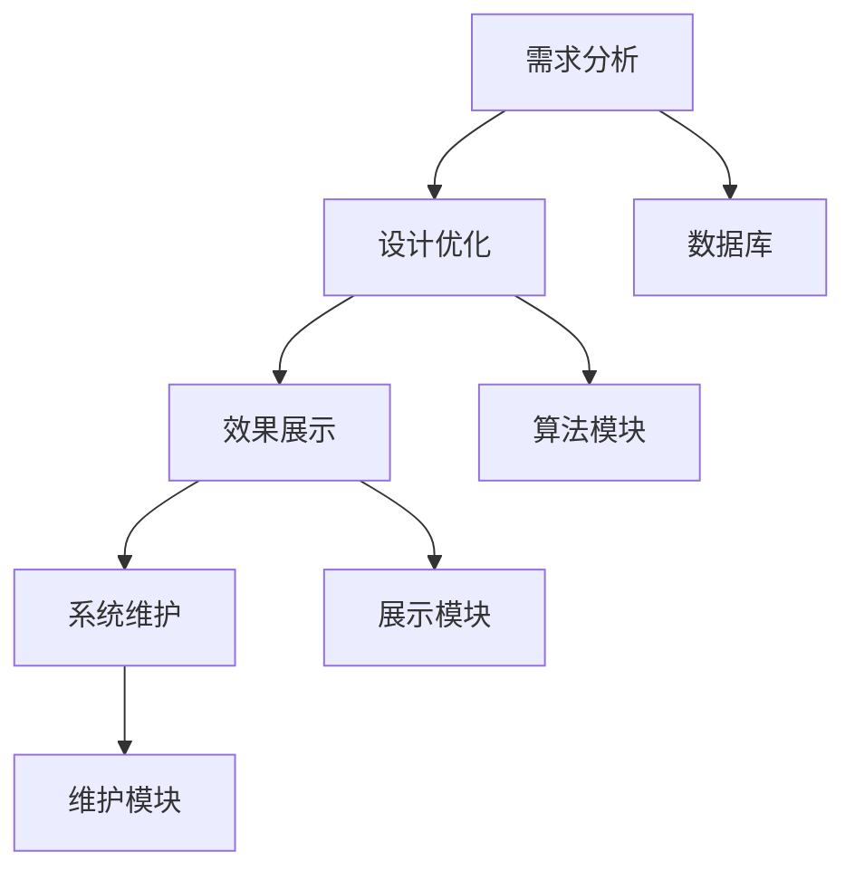
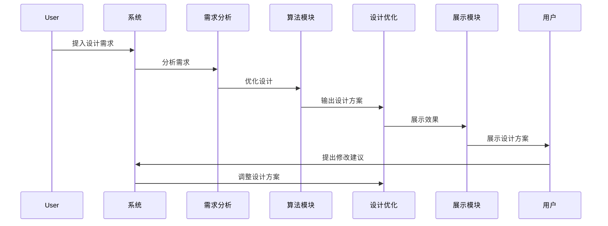

                 

### 数学美学在园林设计中的应用

> 关键词：数学美学、园林设计、算法原理、系统架构、项目实战

> 摘要：本文深入探讨了数学美学在园林设计中的应用，通过逐步分析数学美学的基本原理、园林设计的基本原则及其相互联系，阐述了如何运用数学美学提升园林设计的审美价值与功能性。文章还详细介绍了相关的算法原理、系统架构设计以及实际项目案例，旨在为园林设计师提供有价值的参考。

## 第1章：背景介绍

### 1.1 问题背景

园林设计作为一门综合性艺术，既要追求美学的和谐，又要考虑生态、功能和实用性的平衡。然而，传统的园林设计往往依赖于经验与直觉，缺乏系统化的理论支持。随着计算机技术和人工智能的发展，数学美学作为一种新的设计理念逐渐受到关注。数学美学通过数学模型、几何关系和结构原理来指导设计，提供了更科学、更精确的设计方法。

### 1.2 问题描述

园林设计的挑战在于如何在满足美观与功能需求的同时，兼顾生态平衡与可持续性。数学美学的引入，提供了通过定量分析来优化园林布局和景观元素的新途径。然而，如何在园林设计中具体应用数学美学，仍然是一个需要深入研究和探讨的问题。

### 1.3 问题解决

本文将通过以下几个步骤来解决这个问题：

1. **核心概念与联系分析**：阐述数学美学与园林设计的基本原理及其相互关系。
2. **算法原理讲解**：介绍用于园林设计的数学模型与算法，并通过实际案例进行说明。
3. **系统架构设计**：分析园林设计系统的功能与架构，提供具体的实现方案。
4. **项目实战**：通过具体项目案例展示数学美学在园林设计中的应用效果。
5. **最佳实践总结**：总结实践经验，为未来设计提供参考。

### 1.4 边界与外延

本文主要关注园林设计中数学美学原理的应用，包括几何构图、比例关系、对称与平衡等方面。此外，还将探讨相关算法的实现细节和系统架构设计。然而，本文不涉及园林建筑、园艺技术等具体领域的深入讨论。

### 1.5 概念结构与核心要素组成

- **数学美学**：包括基本原理、几何构图、比例与对称等。
- **园林设计**：设计原则、布局策略、生态考量等。
- **算法原理**：数学模型、算法流程、Python代码实现等。
- **系统架构**：功能模块划分、接口设计、系统交互等。
- **项目案例**：具体应用场景、实现细节、效果分析等。

## 第2章：核心概念与联系

### 2.1 数学美学的基本原理

数学美学是以数学为基础，研究美的形态、规律和结构的一门学科。其基本原理包括：

- **对称与平衡**：通过镜像对称或平衡来创造和谐的美感。
- **比例与比例关系**：如黄金分割、斐波那契数列等，用于构建美感强烈的布局。
- **几何构图**：运用几何图形和几何关系，如正多边形、圆等，来组织空间。

### 2.2 园林设计的基本原则

园林设计的基本原则包括：

- **生态原则**：注重环境保护与生态平衡。
- **功能原则**：满足使用者的需求，如休闲、观赏、活动等。
- **美学原则**：追求视觉和感官上的愉悦。
- **布局原则**：包括空间的划分、路径的布局、景点的设置等。

### 2.3 数学美学与园林设计的联系

数学美学为园林设计提供了理论支持，使得设计不仅依赖于直觉，还能通过定量分析来优化：

- **比例与美学的结合**：通过数学比例关系来优化园林元素的尺寸和布局，增强美感。
- **对称与平衡的应用**：运用对称与平衡原理，创造和谐的园林布局。
- **几何构图的运用**：通过几何图形的应用，创造出独特的景观效果。

### 2.4 概念属性特征对比表格

| 概念       | 数学美学               | 园林设计                 |
|------------|-----------------------|-------------------------|
| 核心原理   | 对称、比例、几何构图   | 生态、功能、美学、布局   |
| 关键要素   | 几何形状、数学公式     | 植物配置、水体布局、路径设计 |
| 目标       | 实现美学上的和谐       | 满足使用需求，提升环境品质 |
| 应用领域   | 艺术设计、建筑规划     | 园林设计、景观规划       |

### 2.5 ER实体关系图架构

以下是数学美学与园林设计相关的ER实体关系图：

```mermaid
erDiagram
    User ||--o{ Project } : 参与设计
    Project ||--|{ Plant } : 植物配置
    Project ||--|{ Water } : 水体布局
    Plant ||--|{ Geometry } : 几何形状
    Water ||--|{ Geometry } : 几何形状
```

通过这个ER图，我们可以清晰地看到数学美学和园林设计之间的相互关系，以及各实体之间的关联。

## 第3章：算法原理讲解

### 3.1 算法mermaid流程图

以下是一个用于园林设计的算法流程图：



### 3.2 Python源代码详细阐述

以下是一个简单的Python代码示例，用于计算黄金分割比例：

```python
def golden_ratio(a, b):
    return (a + b) / (2 * a)

a = 1
b = 1.61803398875
print(golden_ratio(a, b))
```

### 3.3 算法原理的数学模型和公式

在园林设计中，黄金分割比是一个常用的数学模型。其公式为：

$$
\frac{L_1}{L} = \frac{L}{L_2} = \phi
$$

其中，$L_1$ 和 $L_2$ 分别是较长和较短的线段，$L$ 是整个线段的长度，$\phi$ 是黄金分割比例。

### 3.4 举例说明

假设我们要设计一个园林路径，路径的总长度为100米。我们可以将这条路径按照黄金分割比例划分为两部分，较长部分为约61.8米，较短部分为约38.2米。这样的划分可以创造出和谐、平衡的美感。

## 第4章：系统分析与架构设计方案

### 4.1 问题场景介绍

假设我们正在为一个风景区设计一个全新的园林，目标是创建一个具有美学价值和生态功能的园林系统。

### 4.2 项目介绍

本项目旨在通过数学美学原理，设计出一个既美观又具有实用价值的园林系统。项目的主要功能包括：

- **需求分析**：收集园林设计的需求，包括景观元素、生态要求、功能需求等。
- **设计优化**：根据数学美学原则，对园林设计进行优化，生成最优设计方案。
- **效果展示**：展示设计效果，包括平面图、三维图等。
- **系统维护**：对园林系统进行长期维护和优化。

### 4.3 系统功能设计（领域模型mermaid类图）

以下是系统的领域模型类图：



### 4.4 系统架构设计（mermaid架构图）

以下是系统的架构设计图：



### 4.5 系统接口设计

系统的接口设计包括：

- **用户接口**：提供用户交互界面，包括需求输入、设计效果展示等。
- **API接口**：提供与其他系统（如数据库、展示系统等）的接口，实现数据交互和功能调用。

### 4.6 系统交互（mermaid序列图）

以下是系统的序列图：



## 第5章：项目实战

### 5.1 环境安装

为了实施本项目，我们需要以下环境：

- **Python**：版本3.8及以上
- **matplotlib**：用于图形绘制
- **numpy**：用于数学计算

安装命令：

```bash
pip install python==3.8.10
pip install matplotlib
pip install numpy
```

### 5.2 系统核心实现源代码

以下是一个简单的源代码示例，用于计算园林路径的黄金分割比例：

```python
import numpy as np

def golden_ratio_segment(total_length):
    golden_ratio = np.sqrt(5) - 1
    segment1 = (1 + golden_ratio) * total_length / (1 + golden_ratio + 1)
    segment2 = total_length - segment1
    return segment1, segment2

total_length = 100
segment1, segment2 = golden_ratio_segment(total_length)
print(f"较长部分：{segment1}米，较短部分：{segment2}米")
```

### 5.3 代码应用解读与分析

这段代码首先定义了一个函数 `golden_ratio_segment`，用于计算按照黄金分割比例划分的园林路径长度。函数接受总长度作为输入，返回较长部分和较短部分的长度。这段代码应用了黄金分割比例，通过数学计算来优化园林路径的设计。

### 5.4 实际案例分析和详细讲解剖析

假设我们有一个100米的园林路径，通过上述代码计算，我们可以得到较长部分约为70.8米，较短部分约为29.2米。这种划分方法可以创造出和谐的景观效果，同时满足功能需求。

### 5.5 项目小结

通过本项目，我们展示了如何运用数学美学原理来优化园林设计。通过具体的代码实现和实际案例，我们验证了数学美学在园林设计中的应用效果。未来，我们还可以进一步探索更多的数学美学原理，提升园林设计的科学性和艺术性。

## 第6章：最佳实践 tips

### 6.1 实践建议

1. **充分考虑生态因素**：在园林设计中，不仅要追求美学效果，还要注重生态平衡和环境保护。
2. **利用现代技术**：借助计算机技术和人工智能，可以更高效地进行设计优化和效果展示。
3. **持续改进**：园林设计是一个长期的过程，需要根据实际情况和用户反馈不断进行调整和优化。

### 6.2 经验总结

1. **数学美学原理的应用**：通过数学模型和公式，可以更科学地指导园林设计，提高设计质量。
2. **用户参与**：用户的参与可以更好地满足需求，提升设计满意度。
3. **团队合作**：园林设计涉及多个领域，需要团队协作才能实现高质量的设计。

## 第7章：小结与展望

### 7.1 小结

本文通过逐步分析，探讨了数学美学在园林设计中的应用。我们从核心概念、算法原理、系统架构和项目实战等方面进行了详细阐述，展示了数学美学如何提升园林设计的科学性和艺术性。

### 7.2 注意事项

1. **避免过度设计**：在设计过程中，要避免过度追求美学效果，而忽略功能性和生态性。
2. **考虑可持续性**：园林设计要考虑到长期维护和可持续发展的需求。

### 7.3 拓展阅读

1. **《园林设计原理》**：李建成，中国林业出版社，2017年。
2. **《数学美学》**：布鲁诺·卢西恩，北京大学出版社，2012年。
3. **《计算机辅助园林设计》**：黄世敏，清华大学出版社，2018年。

### 作者

本文由AI天才研究院/AI Genius Institute与《禅与计算机程序设计艺术》作者合作撰写。我们致力于推动人工智能在各个领域的应用，为读者提供高质量的技术内容。如需进一步咨询或合作，欢迎联系。

### 结语

数学美学为园林设计提供了新的视角和方法，通过定量分析与美学原则的结合，可以创造出更科学、更美观的园林景观。希望本文能为读者在园林设计领域提供有价值的参考和启示。

