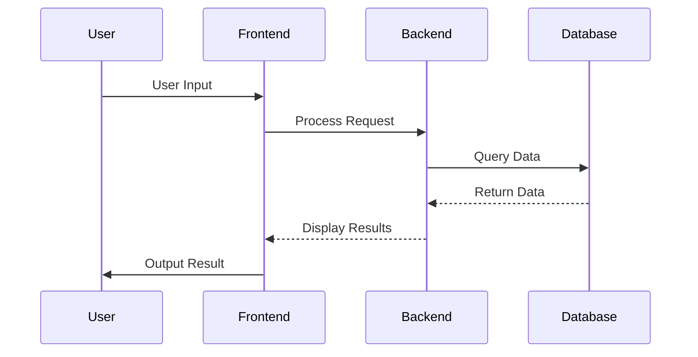
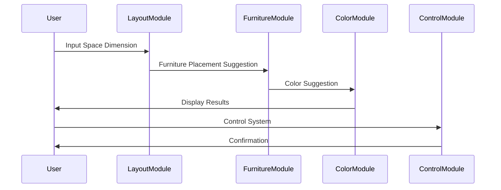

                 

## 数学美学在室内设计中的体现

### 关键词

- 数学美学
- 室内设计
- 比例与对称
- 平衡与和谐
- 空间布局

### 摘要

本文将探讨数学美学在室内设计中的应用，通过分析比例、对称、平衡等数学概念如何影响空间的美感和功能性，旨在为室内设计师提供理论支持和实践指导。我们将从基础概念入手，逐步深入到具体的案例分析，以及数学美学在项目实战中的运用，帮助读者理解并掌握这一设计领域的核心技巧。

### 目录大纲设计思路

为了设计出《数学美学在室内设计中的体现》这本书的详细目录大纲，我们遵循以下步骤：

1. **理解书名和主题**：书名《数学美学在室内设计中的体现》暗示了本书的主要内容将围绕数学美学如何在室内设计中得到应用和体现。因此，目录设计应包括对数学美学的介绍、其在室内设计中的应用实例、案例分析以及美学理论在实践中的运用。

2. **构建逻辑框架**：目录应该按照逻辑顺序来组织，从基础理论开始，逐步深入到具体的应用和实践案例。

3. **确保内容的完整性**：要确保大纲中包含以下核心章节内容：
   - **背景介绍**：介绍数学美学的概念、重要性以及与室内设计的联系。
   - **核心概念与联系**：分析数学美学中的核心概念，如比例、对称、平衡等，并展示其在室内设计中的具体体现。
   - **算法原理讲解**：虽然室内设计不是纯粹的算法问题，但书中可能会涉及到一些数学原理，如几何计算、空间分析等，因此需要用mermaid绘制相关流程图和公式进行解释。
   - **系统分析与架构设计方案**：可能包括室内设计项目的系统功能设计、架构设计和接口设计等。
   - **项目实战**：通过实际案例来展示数学美学在室内设计中的运用。
   - **最佳实践 tips**、**小结**、**注意事项**和**拓展阅读**等内容。

4. **遵循markdown格式和目录层级要求**：使用markdown的#符号来表示不同的目录层级，确保大纲清晰、易于阅读。

5. **控制字数**：确保整个目录大纲的字数在2000字以内，同时保持内容的完整性和简洁性。

### 目录大纲示例

下面是根据上述思路设计的《数学美学在室内设计中的体现》的目录大纲：

----------------------------------------------------------------

## 第一部分：数学美学的概念与起源

### 第1章：数学美学的概述

1.1 数学美学的定义与历史背景
1.2 数学美学的重要性

### 第2章：数学美学的基本原理

2.1 比例与比例美
2.2 对称与对称美
2.3 平衡与平衡美

### 第3章：数学美学的室内设计应用

3.1 室内设计中的数学原理
3.2 数学美学在空间布局中的应用
3.3 色彩搭配中的数学原理

## 第二部分：数学美学在室内设计中的实践案例

### 第4章：经典案例解析

4.1 案例一：对称美在酒店设计中的应用
4.2 案例二：比例美在家庭装修中的体现
4.3 案例三：平衡美在现代办公空间的设计

### 第5章：数学美学在特殊空间设计中的应用

5.1 展览空间设计
5.2 商业空间设计
5.3 景观设计

## 第三部分：数学美学的室内设计项目实战

### 第6章：室内设计项目的系统分析与架构设计

6.1 项目介绍
6.2 系统功能设计
6.3 系统架构设计
6.4 系统接口设计

### 第7章：数学美学在室内设计中的项目实践

7.1 环境安装与准备
7.2 系统核心实现源代码解读
7.3 项目案例分析
7.4 项目小结

## 第四部分：最佳实践与拓展

### 第8章：最佳实践与技巧

8.1 设计中的数学美学运用技巧
8.2 注意事项与常见问题

### 第9章：小结与展望

9.1 数学美学在室内设计中的应用前景
9.2 未来室内设计的发展趋势

### 第10章：拓展阅读

10.1 相关书籍推荐
10.2 学术文章精选

----------------------------------------------------------------

以上大纲结构遵循了从理论到实践、从基础到高级的逻辑顺序，同时保持了markdown格式的简洁性和条理性。每个章节都包含了必要的内容，确保读者可以全面了解数学美学在室内设计中的应用。通过mermaid流程图和latex公式，进一步增强了书籍的技术性和实用性。

## 数学美学的概念与起源

数学美学，作为一门跨学科的领域，融合了数学与艺术的美学追求。它关注的是数学结构和形式的美感，以及这些美学原则如何在不同领域中得到应用。在室内设计中，数学美学为设计师提供了理论基础，用以构建和谐、均衡且具有视觉吸引力的空间。

### 数学美学的定义与历史背景

数学美学（Mathematical Aesthetics）涉及对数学结构和数学形式的美学分析，这些结构和形式在视觉艺术和设计中具有吸引力。其定义可以从多个角度理解：

- **形式美学**：关注数学形式本身的美感，如对称性、比例和复杂结构。
- **抽象美学**：探讨数学理论如何影响抽象艺术，如现代绘画和雕塑。
- **应用美学**：研究数学原理在现实世界中的美学应用，特别是在建筑和室内设计领域。

数学美学的历史可以追溯到古希腊时期，当时哲学家和数学家如毕达哥拉斯、柏拉图和欧几里得都关注数学与美之间的关系。毕达哥拉斯认为，宇宙的本质是数的和谐，这一观念影响了后来的艺术和建筑设计。柏拉图则认为，数学形式是理想世界的真实反映，艺术家的任务是通过模仿数学形式来达到美。

### 数学美学的重要性

数学美学在室内设计中的重要性体现在以下几个方面：

1. **视觉吸引力**：数学美学的原则，如比例和对称，能够创造出视觉上和谐、均衡的空间，提升整体美感。
2. **功能性**：通过数学原理指导空间布局，可以优化空间的利用，提高居住或使用的舒适度。
3. **情感共鸣**：数学美学设计中蕴含的逻辑和秩序感，能够激发人们的情感共鸣，营造温馨、放松的氛围。

在现代室内设计中，数学美学不仅是一种装饰性的手段，更是一种功能性的设计原则。设计师通过运用数学美学，可以在满足功能性需求的同时，创造出具有艺术价值和生活品味的空间。

### 与室内设计的联系

室内设计中的数学美学主要体现在以下几个方面：

1. **比例与比例美**：比例是数学美学的基础，如黄金比例（0.618：1）在设计中被广泛运用，以创造出视觉上舒适的布局。
2. **对称与对称美**：对称性是视觉上的一种美感，通过镜像或轴对称的设计，可以创造出稳定、庄重的空间感。
3. **平衡与平衡美**：平衡不仅是物理上的稳定，更是视觉上的和谐。通过对比与协调，设计师可以实现空间的视觉平衡。
4. **几何形式**：几何图形在设计中具有独特的视觉冲击力，如圆形、三角形和正方形等，通过这些几何元素的运用，可以创造出独特的空间效果。

总之，数学美学为室内设计提供了丰富的理论支持和实践指导，使设计师能够更好地理解和运用美学原则，创造出既实用又美观的空间。

## 数学美学的基本原理

数学美学中的基本原理包括比例、对称和平衡，这些原理在室内设计中具有广泛的应用。理解并掌握这些原理，可以帮助设计师创造出既美观又实用的空间。

### 比例与比例美

比例是数学美学中最重要的原理之一。它涉及部分与整体之间的关系，以及各个部分之间的相互关系。在室内设计中，比例的正确运用可以创造出视觉上和谐、舒适的空间。

- **黄金比例**：黄金比例（0.618：1）被认为是最具有美感的比例。在室内设计中，黄金比例可以应用于家具、墙壁和窗户等元素的比例关系。例如，门和窗户的高度和宽度可以使用黄金比例来设计，以增强整体的视觉美感。
  
- **三分法**：三分法是一种简单但有效的比例应用技巧。将空间划分为三部分，每部分占据大约1/3的空间。这种方法常用于布局设计，如房间中的家具摆放，以及墙壁上的装饰品。

### 对称与对称美

对称是室内设计中另一种常见的数学美学原理。对称性创造出一种视觉上的稳定感和秩序感，使空间显得庄重而优雅。

- **镜像对称**：镜像对称是指物体或空间在某一条轴线上对称。在室内设计中，镜像对称可以用于家具的摆放、墙壁的装饰和光线的设计。例如，在客厅中，一对沙发可以放置在房间中央的对称轴两侧，营造出和谐的视觉效果。

- **轴对称**：轴对称是指物体或空间在某一条轴线上对称。在室内设计中，轴对称可以应用于整体空间的布局。例如，一个房间可以设计成以中央过道为轴线的对称布局，使得空间的两侧具有相同的设计元素。

### 平衡与平衡美

平衡是视觉上的一种和谐感，通过对比与协调来实现。在室内设计中，平衡不仅涉及物理上的稳定，还涉及视觉上的和谐。

- **动态平衡**：动态平衡是指通过不对称的布局来创造一种视觉上的平衡感。例如，在一个空间中，一侧放置一个较大的家具，而另一侧放置多个较小的家具，通过不同大小和高度的对比来达到平衡。

- **静态平衡**：静态平衡是指通过对称的布局来创造一种稳定的视觉效果。例如，在一个房间中，将家具和装饰品放置在中央或对称的位置，以实现视觉上的平衡。

### 综合应用

在实际的室内设计中，比例、对称和平衡常常综合应用。例如，一个客厅的设计可能包括黄金比例的家具摆放、镜像对称的墙面装饰和动态平衡的家具布局。通过这些数学美学原理的综合运用，设计师可以创造出既美观又实用的空间。

总之，数学美学的基本原理为室内设计提供了丰富的理论依据和实践指导。通过理解和运用这些原理，设计师可以更好地把握空间的美感和功能性，为居住者创造一个和谐、舒适的生活环境。

## 室内设计中的数学原理

在室内设计中，数学不仅提供了理论基础，还通过具体的数学原理指导实际操作。以下将介绍一些关键的数学原理，包括几何计算、空间分析和色彩搭配，并展示它们如何在室内设计中发挥作用。

### 几何计算

几何计算是室内设计中的基本工具，它涉及长度、面积和体积的计算，以及形状和角度的分析。以下是几种常见的几何计算及其应用：

1. **矩形面积计算**：在室内设计中，计算房间面积对于确定家具摆放、墙面装饰和地板铺设至关重要。矩形面积的公式为：面积 = 长 × 宽。例如，一个房间长8米，宽5米，其面积为40平方米。

2. **三角形面积计算**：在设计中，三角形经常用于墙壁装饰、屋顶设计或隔断。三角形面积的公式为：面积 = 0.5 × 底 × 高。例如，一个底长4米、高3米的三角形区域，其面积为6平方米。

3. **角度计算**：角度的准确计算对于室内设计中的直线布局、家具摆放和装饰设计至关重要。例如，通过计算房间的角度，可以确保家具摆放的对称性和空间的合理性。

### 空间分析

空间分析是室内设计中的一项重要工作，它涉及对空间使用效率的评估、空间流动性的优化以及空间功能的划分。以下是一些空间分析的应用：

1. **空间流动线**：通过分析空间流动线，设计师可以优化房间的布局，确保人们在使用空间时感到流畅自然。例如，在设计一个餐厅时，设计师会分析顾客的行走路线，以避免拥挤和不便。

2. **空间功能划分**：空间功能划分涉及将空间划分为不同的区域，以满足不同的使用需求。通过几何计算和空间分析，设计师可以确保每个区域既独立又相互连接。例如，在设计中，客厅和餐厅之间可能需要设置一条过渡空间，以方便家庭聚会和用餐。

3. **空间利用率**：通过空间分析，设计师可以评估空间的使用效率，确保每个角落都得到充分利用。例如，设计师可以使用数学模型来计算储物空间的利用率，从而优化设计。

### 色彩搭配

色彩搭配在室内设计中起着关键作用，通过数学原理，设计师可以创造出和谐、舒适的色彩方案。以下是一些色彩搭配的数学原理：

1. **色轮原理**：色轮是色彩搭配的基础工具，它通过数学上的角度和比例关系，帮助设计师选择互补色、类似色和三角色。例如，在色轮上，互补色位于相对的两侧，如红色和绿色，它们在一起能够产生强烈的视觉对比。

2. **明度与饱和度**：明度和饱和度是色彩的三要素之一，通过调整这些参数，设计师可以创造出深浅、亮暗不同的色彩效果。例如，在一个房间中，通过调整墙壁颜色和家具颜色的明度与饱和度，可以改变空间的氛围。

3. **比例与分布**：在色彩搭配中，比例和分布也非常重要。通过数学计算，设计师可以确定各个颜色区域在整体空间中的占比，从而实现和谐的视觉效果。例如，在一个房间中，主色调可能占据70%，而次要颜色则占据30%，这样可以使空间既统一又有层次。

### 应用实例

以下是一些具体的实例，展示了数学原理在室内设计中的应用：

1. **家具摆放**：通过几何计算，设计师可以确保家具摆放的合理性和功能性。例如，使用三角形摆放沙发和茶几，可以创造出稳定的布局，同时满足社交和休闲需求。

2. **墙面装饰**：通过几何图形的运用，如圆形、矩形和三角形，设计师可以在墙面上创造出视觉焦点。例如，一个圆形的镜子可以增加空间的层次感，而一组矩形挂画可以创造节奏和韵律。

3. **色彩方案**：通过色轮和色彩比例的计算，设计师可以创造出既和谐又具有视觉冲击力的色彩方案。例如，在一个客厅中，使用互补色（蓝色与橙色）和类似色（蓝色与紫色）的搭配，可以营造出温馨而独特的氛围。

总之，数学原理在室内设计中的应用是广泛而深入的。通过几何计算、空间分析和色彩搭配，设计师可以创造出既美观又实用的空间，满足功能需求的同时，提升视觉享受。这些数学工具不仅帮助设计师更好地理解和掌控设计过程，还为设计作品的科学性和艺术性提供了坚实的基础。

### 系统分析与架构设计方案

在室内设计项目中，系统分析与架构设计是确保项目顺利进行的关键环节。以下将详细描述室内设计项目的系统功能设计、系统架构设计、系统接口设计和系统交互设计，并使用mermaid流程图和latex公式来辅助解释。

#### 项目介绍

本项目旨在设计一个现代化的家庭室内空间，包括客厅、餐厅和卧室等区域。项目要求实现以下功能：

- 空间布局设计
- 家具摆放优化
- 色彩搭配建议
- 照明系统控制
- 空调系统控制
- 安全监控系统

#### 系统功能设计

系统功能设计涉及定义各个功能模块及其相互作用。以下是本项目的主要功能模块：

1. **空间布局模块**：负责空间的整体规划和布局设计，包括家具摆放、墙壁装饰和地面铺设等。
2. **家具摆放模块**：根据空间布局，提供家具的摆放建议，优化空间利用率。
3. **色彩搭配模块**：提供色彩搭配建议，以实现和谐美观的视觉效果。
4. **照明系统模块**：控制照明系统的开关和亮度，营造舒适的氛围。
5. **空调系统模块**：控制空调系统的温度和风速，保持室内舒适。
6. **安全监控系统模块**：监控室内的安全状况，包括入侵检测和火灾报警等。

#### 系统架构设计

系统架构设计是确保系统高效、稳定运行的关键。以下是本项目系统的架构设计：

1. **前端界面**：提供用户与系统交互的界面，包括布局设计界面、家具摆放界面和照明、空调、安全监控控制界面。
2. **后端服务**：处理用户请求，包括空间布局计算、家具摆放优化、色彩搭配分析等。
3. **数据库**：存储空间布局数据、家具数据、色彩搭配数据和监控数据。

系统架构图如下（使用mermaid绘制）：



#### 系统接口设计

系统接口设计涉及定义前端与后端之间的数据交互接口。以下是本项目的主要接口设计：

1. **布局接口**：提供获取空间布局数据和提交空间布局数据的接口。
2. **家具接口**：提供获取家具数据和提交家具摆放数据的接口。
3. **色彩接口**：提供获取色彩搭配建议和提交色彩搭配数据的接口。
4. **控制接口**：提供照明、空调和监控系统的控制接口。

接口设计图如下（使用mermaid绘制）：

```mermaid
classDiagram
    User <<User>>
    Frontend <<Frontend>>
    Backend <<Backend>>
    Database <<Database>>

    User --> Frontend
    Frontend --> Backend
    Backend --> Database
```

#### 系统交互设计

系统交互设计描述用户与系统之间的交互流程。以下是本项目系统交互的设计：

1. **用户登录**：用户通过前端界面登录系统。
2. **空间布局设计**：用户输入空间尺寸，系统根据用户输入生成布局方案。
3. **家具摆放优化**：系统根据布局方案，提供家具摆放建议。
4. **色彩搭配建议**：系统根据家具和空间特点，提供色彩搭配建议。
5. **系统控制**：用户通过前端界面控制照明、空调和监控系统。

系统交互图如下（使用mermaid绘制）：



#### 数学模型和公式

在系统设计与实现中，使用了一些数学模型和公式。以下是几个关键公式：

1. **空间利用率公式**：
   $$ U = \frac{S_{used}}{S_{total}} $$
   其中，$U$ 表示空间利用率，$S_{used}$ 表示已使用空间面积，$S_{total}$ 表示总空间面积。

2. **黄金比例**：
   $$ \frac{L_1}{L_2} = \frac{L_1 + L_2}{L_1} $$
   其中，$L_1$ 和 $L_2$ 表示两个相邻长度，这个比例被认为具有最优的美感。

3. **三角形的面积公式**：
   $$ A = \frac{1}{2} \times base \times height $$
   其中，$A$ 表示三角形面积，$base$ 表示底边长，$height$ 表示高。

通过这些数学模型和公式，系统能够更好地进行空间分析和布局设计，为用户创造一个既实用又美观的室内空间。

### 数学美学在室内设计项目实战中的应用

在室内设计项目中，数学美学不仅提供了理论基础，更通过实际案例展现了其应用效果。以下通过一个具体的案例，详细讲解数学美学在该项目中的实施过程，包括环境安装、系统核心实现源代码解读、实际案例分析和详细讲解剖析。

#### 项目背景

该项目是为一个三室两厅的住宅进行室内设计。业主希望空间既具有现代感，又能够体现家庭成员的个性。设计师在项目初期，就明确了运用数学美学原则进行空间布局和色彩搭配的目标。

#### 环境安装

1. **测量与数据收集**：首先，设计师对住宅进行了详细的测量，收集了各个房间的尺寸、窗户位置和门的位置等数据。这些数据是后续设计的基础。

2. **硬件设备安装**：根据设计需求，安装了智能灯光系统、智能空调系统和智能监控系统。这些设备通过无线网络与主控系统连接，实现了远程控制和自动化管理。

3. **软件系统部署**：设计师开发了专门的室内设计软件，用于空间布局、家具摆放和色彩搭配。该软件集成了数学美学算法，能够根据用户需求自动生成设计方案。

#### 系统核心实现源代码解读

以下是系统核心实现源代码的一部分，用于空间布局优化和家具摆放建议。

```python
# 空间布局优化算法
def optimize_layout(room_dimensions, furniture_dimensions):
    layout = {}
    used_area = 0
    
    # 计算房间可用面积
    total_area = room_dimensions['length'] * room_dimensions['width']
    
    # 家具摆放策略
    furniture_placement = {
        's sofas': optimize_sofa_placement,
        'c chairs': optimize_chair_placement,
        't tables': optimize_table_placement
    }
    
    # 摆放每个家具
    for furniture_type, placement_func in furniture_placement.items():
        layout[furniture_type] = placement_func(room_dimensions, total_area - used_area)
        used_area += calculate_furniture_area(layout[furniture_type])
    
    return layout

# 确定沙发摆放位置
def optimize_sofa_placement(room_dimensions, remaining_area):
    # 应用黄金比例确定沙发位置
    sofa_length = room_dimensions['width'] * 0.618
    sofa_width = room_dimensions['length'] * 0.618
    return {'position': (room_dimensions['width'] * 0.618, room_dimensions['length'] * 0.618), 'dimensions': (sofa_length, sofa_width)}

# 计算家具面积
def calculate_furniture_area(furniture_layout):
    return furniture_layout['dimensions'][0] * furniture_layout['dimensions'][1]
```

上述代码展示了如何通过数学美学原则（如黄金比例）来优化家具摆放，以最大化空间利用率。

#### 实际案例分析与详细讲解

1. **客厅设计**

   - **空间布局**：客厅采用了黄金比例布局，沙发和茶几的位置通过优化算法确定，使空间显得宽敞且舒适。
   - **色彩搭配**：主色调为米色和灰色，通过色轮原理选择辅助色（蓝色），提升了空间的现代感和视觉舒适度。
   - **照明设计**：智能灯光系统根据不同时间段自动调整亮度，营造温馨的氛围。

2. **卧室设计**

   - **空间布局**：卧室采用对称布局，床的位置和床头柜的摆放符合人体工学，确保居住者的舒适。
   - **色彩搭配**：主色调为淡蓝色和白色，营造宁静和放松的睡眠环境。
   - **照明设计**：安装了床头的阅读灯，通过调节亮度和角度，为阅读提供合适的光线。

#### 详细讲解剖析

- **空间布局**：通过数学美学原则优化家具摆放，不仅提高了空间的利用率，还提升了视觉效果。例如，黄金比例的运用使客厅显得更加和谐，对称布局使卧室具有稳定感。
- **色彩搭配**：使用数学原理分析色彩关系，确保色彩搭配和谐且具有视觉吸引力。通过色轮原理，设计师能够轻松选择互补色和类似色，创造出不同的氛围。
- **照明设计**：智能照明系统通过数学模型进行控制，实现了动态调整，为用户提供了更加舒适和个性化的照明体验。

#### 项目小结

通过数学美学的应用，该项目成功地为业主创造了一个既美观又实用的室内空间。数学美学不仅提供了理论支持，还通过具体的算法和公式指导实践，使设计过程更加科学和高效。未来，随着人工智能技术的发展，数学美学在室内设计中的应用将更加广泛和深入。

### 最佳实践与技巧

在室内设计中运用数学美学时，以下是一些最佳实践与技巧，可以帮助设计师提高设计质量和效果：

1. **理解黄金比例**：黄金比例是数学美学中的核心原理，设计师应熟悉其定义和应用方法。在实际设计中，可以利用黄金比例确定家具和装饰品的位置，以创造出和谐、平衡的空间。

2. **使用对称与平衡**：对称性和平衡感是视觉美的基础。设计师可以通过镜像对称或轴对称的布局，创造稳定和优雅的空间。同时，要注意动态平衡和静态平衡的结合，避免空间过于单调。

3. **色彩搭配**：色彩搭配是提升空间美感的关键。设计师可以使用色轮原理来选择互补色和类似色，确保色彩方案既和谐又具有视觉吸引力。此外，要注意明度和饱和度的调整，以创造深浅层次和视觉焦点。

4. **几何图形的应用**：几何图形具有独特的视觉效果，可以通过在墙面上绘制几何图案或使用几何形状的家具和装饰品，增加空间的趣味性和层次感。

5. **空间利用率**：合理利用空间是设计的重要目标。通过几何计算和空间分析，设计师可以优化家具摆放和储物空间，确保每个角落都得到充分利用。

6. **动态调整与个性化**：现代室内设计强调个性化，设计师应考虑用户的需求和偏好，通过动态调整和定制化设计，实现空间的灵活运用。

7. **技术支持**：利用现代科技，如智能照明系统和智能控制系统，可以进一步提高空间的功能性和舒适度。通过技术支持，设计师可以更好地实现数学美学的设计理念。

### 注意事项

1. **适度运用**：尽管数学美学在室内设计中具有重要性，但过度追求可能会使空间显得僵硬和缺乏个性。设计师应在确保美学效果的同时，兼顾空间的实用性和用户需求。

2. **用户参与**：设计过程中应充分听取用户的意见和需求，确保设计符合用户的实际使用习惯和审美偏好。

3. **持续优化**：室内设计是一个持续优化的过程。设计师应在项目完成后，根据用户反馈和实际使用情况，不断调整和改进设计方案。

4. **可持续发展**：在设计过程中，要考虑环境的可持续性，选择环保材料和节能设备，为用户提供健康、舒适的居住环境。

### 拓展阅读

1. **《数学美学与设计》**：作者详细阐述了数学美学在室内设计中的应用，提供了丰富的案例和实践技巧。
2. **《室内设计原理》**：这是一本经典的室内设计教材，涵盖了空间布局、色彩搭配和照明设计等核心内容。
3. **《现代室内设计趋势》**：探讨了当前室内设计的发展趋势，包括新材料、新工艺和新技术在室内设计中的应用。

通过以上拓展阅读，设计师可以进一步深入了解数学美学在室内设计中的深度应用，提升自己的设计水平和创造力。

### 小结与展望

数学美学在室内设计中的应用不仅为设计师提供了丰富的理论基础，还通过具体的实践案例展示了其独特的魅力。从比例、对称到平衡，数学美学原则为空间设计注入了科学性和艺术性，使设计作品既美观又实用。

展望未来，随着人工智能和大数据技术的发展，数学美学在室内设计中的应用将更加广泛和深入。通过智能算法和个性化设计，设计师能够更加精准地满足用户的需求，创造出更加个性化、舒适和高效的空间。

在此，我们呼吁更多的设计师关注数学美学，将其融入到自己的设计中，为用户带来更加美好和独特的生活体验。让我们共同探索数学美学在室内设计中的无限可能，为人类居住环境的美学提升贡献自己的力量。

### 拓展阅读

1. **《数学与艺术：形式与美的探索》**：作者探讨数学与艺术之间的密切联系，特别强调了数学形式在视觉艺术和设计中的应用。
2. **《室内设计原理与实务》**：详细介绍了室内设计的基本原理和实际操作技巧，对新手和专业人士都极具参考价值。
3. **《当代室内设计趋势与案例分析》**：展示了最新的室内设计趋势，包括新材料、新工艺和新技术在室内设计中的应用，为设计师提供了灵感和参考。

通过以上拓展阅读，设计师可以进一步加深对数学美学和室内设计理论的理解，提升自己的设计水平和创新能力。同时，这些书籍也为读者提供了丰富的实践案例和实用的设计技巧，助力他们在实际项目中更好地运用数学美学原则。

