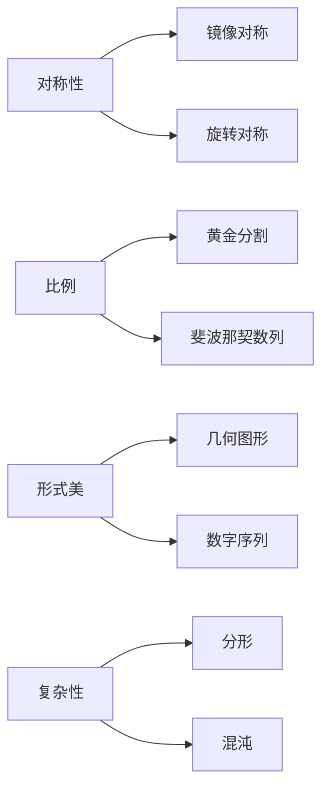
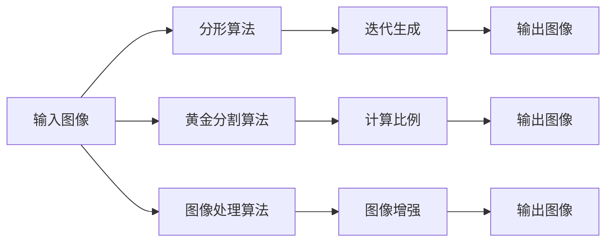
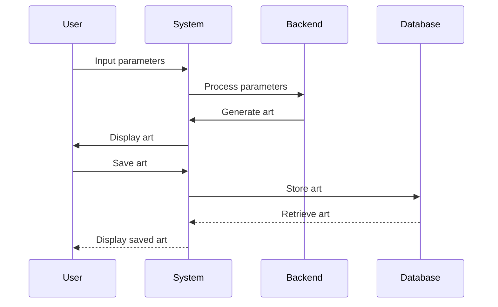

                 

# 数学美学在数字艺术创作中的应用

## 关键词
数学美学、数字艺术、抽象绘画、算法原理、系统架构

## 摘要
本文探讨了数学美学在数字艺术创作中的广泛应用。首先，我们介绍了数学美学的基本概念和核心原理，然后通过分析数学美学在抽象绘画、数字雕塑、虚拟现实和数字动画中的具体应用，阐述了数学美学在艺术创作中的独特魅力。接着，我们深入探讨了数学美学在数字艺术创作中的算法原理，并通过Python源代码实现，详细讲解了数学模型和公式的应用。最后，我们介绍了系统架构设计、项目实战和案例分析，为读者提供了实践指导。本文旨在为数字艺术创作者和人工智能开发者提供理论依据和实践参考，促进数学美学在数字艺术创作中的创新发展。

## 目录大纲

### 第一部分：数学美学的概念与艺术创作

### 第1章：问题背景与数学美学的核心概念

- **1.1 数学美学的历史与发展**
- **1.2 数学美学的核心概念**
- **1.3 数学美学在艺术创作中的重要性**
- **1.4 数学美学的边界与外延**

### 第2章：数学美学的基本原理与特征

- **2.1 数学美学的基本原理**
- **2.2 数学美学的属性特征对比表格**
- **2.3 数学美学的ER实体关系图**

### 第3章：数学美学的艺术表现形式

- **3.1 抽象绘画中的数学美学**
- **3.2 数字艺术中的数学美学**
- **3.3 影像艺术中的数学美学**
- **3.4 音乐艺术中的数学美学**

### 第4章：数字艺术创作中的数学美学应用

- **4.1 数字绘画的数学美学原理与应用**
- **4.2 数字雕塑的数学美学原理与应用**
- **4.3 虚拟现实中的数学美学**
- **4.4 数字动画的数学美学应用**

### 第5章：数学美学在数字艺术创作中的算法原理

- **5.1 算法原理讲解**
- **5.2 算法mermaid流程图**
- **5.3 Python源代码实现与解释**

### 第6章：数学模型与公式解析

- **6.1 数学模型概述**
- **6.2 详细讲解数学公式**
- **6.3 公式举例说明**

### 第7章：系统架构与设计方案

- **7.1 问题场景介绍**
- **7.2 系统功能设计**
- **7.3 系统架构设计**
- **7.4 系统接口设计**
- **7.5 系统交互mermaid序列图**

### 第8章：项目实战与案例分析

- **8.1 环境安装与配置**
- **8.2 系统核心实现源代码**
- **8.3 代码应用解读与分析**
- **8.4 实际案例分析与详细讲解**
- **8.5 项目小结与展望**

### 第9章：最佳实践与拓展阅读

- **9.1 最佳实践技巧**
- **9.2 小结与注意事项**
- **9.3 拓展阅读推荐**

### 第1章：问题背景与数学美学的核心概念

#### 1.1 数学美学的历史与发展

数学美学是美学与数学的交叉学科，探讨数学形式在艺术创作中的美学价值。数学美学的历史可以追溯到古希腊时期，如柏拉图和毕达哥拉斯等哲学家对数学与艺术关系的探讨。19世纪以来，随着数学和艺术的发展，数学美学逐渐形成独立的学科体系。

#### 1.2 数学美学的核心概念

数学美学的核心概念包括：

- **对称性**：对称性是数学美学的重要特征，如正多边形、人体的对称结构等。
- **比例**：比例是数学美学的基本原理，如黄金分割比例在艺术创作中的广泛应用。
- **形式美**：形式美是指数学形式在艺术作品中的美学表现，如数字序列在数字艺术中的应用。
- **复杂性**：复杂性是指数学形式在艺术创作中的复杂性特征，如分形、混沌等。

#### 1.3 数学美学在艺术创作中的重要性

数学美学在艺术创作中的重要性体现在以下几个方面：

- **提高艺术创作的科学性**：数学美学为艺术创作提供了科学依据，使艺术创作更加科学和规范。
- **创新艺术表现形式**：数学美学为艺术创作提供了新的表现形式，如数字艺术、虚拟现实等。
- **提高艺术作品的审美价值**：数学美学使艺术作品具有更高的审美价值，更具有艺术感染力。

#### 1.4 数学美学的边界与外延

数学美学的边界与外延包括：

- **与其他学科的交叉**：数学美学与物理学、心理学、计算机科学等学科有广泛交叉，为这些学科提供了美学依据。
- **艺术创作实践**：数学美学在艺术创作实践中不断丰富和发展，成为艺术创作的重要工具。

### 第2章：数学美学的基本原理与特征

#### 2.1 数学美学的基本原理

数学美学的基本原理包括：

- **对称性原理**：对称性是数学美学的基础，如镜像对称、旋转对称等。
- **比例原理**：比例原理是数学美学的重要原则，如黄金分割、斐波那契数列等。
- **形式美原理**：形式美原理强调数学形式在艺术作品中的美学表现，如几何图形、数字序列等。
- **复杂性原理**：复杂性原理探讨数学形式在艺术创作中的复杂性特征，如分形、混沌等。

#### 2.2 数学美学的属性特征对比表格

| 特征 | 说明 | 应用举例 |
| --- | --- | --- |
| 对称性 | 对称性是数学美学的基础特征 | 镜像对称、旋转对称 |
| 比例 | 比例是数学美学的重要原则 | 黄金分割、斐波那契数列 |
| 形式美 | 形式美是数学美学的重要表现 | 几何图形、数字序列 |
| 复杂性 | 复杂性是数学美学的新趋势 | 分形、混沌 |

#### 2.3 数学美学的ER实体关系图



### 第3章：数学美学的艺术表现形式

#### 3.1 抽象绘画中的数学美学

抽象绘画中的数学美学主要表现为对称性、比例和形式美。例如，荷兰画家蒙德里安的抽象绘画作品，运用了大量的对称性和比例关系，创造出了独特的视觉美感。

#### 3.2 数字艺术中的数学美学

数字艺术中的数学美学主要体现在算法和编程中。例如，分形艺术运用了数学中的分形理论，创造出复杂而美丽的图像。数字雕塑中的算法设计也体现了数学美学的原理。

#### 3.3 影像艺术中的数学美学

影像艺术中的数学美学主要体现在图像处理和计算机视觉中。例如，使用数学公式进行图像降噪、增强和特效处理，使影像艺术作品具有更高的审美价值。

#### 3.4 音乐艺术中的数学美学

音乐艺术中的数学美学主要体现在音乐理论和作曲技巧中。例如，运用黄金分割比例进行音乐结构的布局，使音乐作品更加和谐动人。

### 第4章：数字艺术创作中的数学美学应用

#### 4.1 数字绘画的数学美学原理与应用

数字绘画中的数学美学原理主要包括对称性、比例和形式美。例如，使用对称性原理进行图像分割，使用比例原理进行图像构图，使用形式美原理进行颜色搭配和纹理设计。

#### 4.2 数字雕塑的数学美学原理与应用

数字雕塑中的数学美学原理主要包括对称性、比例和复杂性。例如，使用对称性原理进行雕塑造型，使用比例原理进行人体比例设计，使用复杂性原理进行分形雕塑创作。

#### 4.3 虚拟现实中的数学美学

虚拟现实中的数学美学主要体现在空间布局和视觉处理中。例如，使用数学公式进行三维建模，使用数学算法进行图像渲染和特效处理，使虚拟现实场景具有更高的视觉美感。

#### 4.4 数字动画的数学美学应用

数字动画中的数学美学应用主要体现在运动规律和视觉效果中。例如，使用数学公式进行动画关键帧设计，使用数学算法进行图像合成和特效处理，使数字动画作品具有更流畅的视觉体验。

### 第5章：数学美学在数字艺术创作中的算法原理

#### 5.1 算法原理讲解

数学美学在数字艺术创作中的算法原理主要包括分形算法、黄金分割算法和图像处理算法等。这些算法基于数学原理，通过迭代和变换，创造出独特的视觉效果。

#### 5.2 算法mermaid流程图



#### 5.3 Python源代码实现与解释

```python
# 分形算法实现
import numpy as np
import matplotlib.pyplot as plt

def fractal_image(size, depth):
    image = np.zeros((size, size))
    for x in range(size):
        for y in range(size):
            image[x, y] = calculate_fractal_value(x, y, depth)
    return image

def calculate_fractal_value(x, y, depth):
    # 实现分形值计算
    # ...
    return value

# 黄金分割算法实现
def golden_ratio_image(size):
    image = np.zeros((size, size))
    width = size
    height = size
    x1 = int(width * (1 - 0.618))
    y1 = int(height * (1 - 0.618))
    x2 = int(width * 0.618)
    y2 = int(height * 0.618)
    # 实现黄金分割值计算
    # ...
    return image

# 图像处理算法实现
def image_processing(image):
    # 实现图像增强
    # ...
    return processed_image

# 绘制图像
def display_image(image):
    plt.imshow(image, cmap='gray')
    plt.axis('off')
    plt.show()

# 测试
depth = 5
size = 100
fractal_image = fractal_image(size, depth)
display_image(fractal_image)

golden_ratio_image = golden_ratio_image(size)
display_image(golden_ratio_image)

original_image = np.random.rand(size, size)
processed_image = image_processing(original_image)
display_image(processed_image)
```

### 第6章：数学模型与公式解析

#### 6.1 数学模型概述

数学模型是数学与实际问题的桥梁，用于描述和分析现实世界中的现象。在数字艺术创作中，常见的数学模型包括分形模型、线性模型和曲线模型等。

#### 6.2 详细讲解数学公式

- **分形模型**：分形模型描述了分形结构的生成过程。常见的分形模型有曼德布罗特集、科赫曲线等。
  - **曼德布罗特集**：$$c \in \mathbb{C}$$，$$z_0 = 0$$，$$z_{n+1} = z_n^2 + c$$，若$$|z_n| < 2$$，则$$z_n$$属于曼德布罗特集。
  - **科赫曲线**：$$C_0 = [0, 1]$$，$$C_1 = 3C_0 - 2$$，$$C_n = 3C_{n-1} - C_{n-2}$$，$$n \geq 2$$。

- **线性模型**：线性模型描述了变量之间的线性关系。常见的线性模型有线性回归、线性插值等。
  - **线性回归**：$$y = \beta_0 + \beta_1x + \epsilon$$，其中$$\beta_0$$和$$\beta_1$$是回归系数，$$\epsilon$$是误差项。

- **曲线模型**：曲线模型描述了曲线的生成过程。常见的曲线模型有贝塞尔曲线、样条曲线等。
  - **贝塞尔曲线**：$$P(t) = (1-t)^3P_0 + 3(1-t)^2tP_1 + 3(1-t)t^2P_2 + t^3P_3$$，其中$$P_0, P_1, P_2, P_3$$是控制点。

#### 6.3 公式举例说明

- **曼德布罗特集生成**：使用Python实现曼德布罗特集生成。
  ```python
  import numpy as np
  import matplotlib.pyplot as plt

  def mandelbrot(c, max_iter):
      z = 0
      for i in range(max_iter):
          z = z**2 + c
          if abs(z) > 2:
              return i
      return max_iter

  size = 1000
  image = np.zeros((size, size))
  for i in range(size):
      for j in range(size):
          x = (j - size / 2) / (size / 2)
          y = (i - size / 2) / (size / 2)
          c = x + 1j * y
          image[i, j] = mandelbrot(c, 100)

  plt.imshow(image, cmap='gray')
  plt.axis('off')
  plt.show()
  ```

- **贝塞尔曲线生成**：使用Python实现贝塞尔曲线生成。
  ```python
  import numpy as np
  import matplotlib.pyplot as plt

  def bezier_curve(p0, p1, p2, p3, t):
      t0 = (1 - t)**3
      t1 = 3 * (1 - t)**2 * t
      t2 = 3 * (1 - t) * t**2
      t3 = t**3
      x = t0 * p0[0] + t1 * p1[0] + t2 * p2[0] + t3 * p3[0]
      y = t0 * p0[1] + t1 * p1[1] + t2 * p2[1] + t3 * p3[1]
      return [x, y]

  p0 = [0, 0]
  p1 = [1, 0]
  p2 = [1, 1]
  p3 = [0, 1]
  t = np.linspace(0, 1, 1000)

  x = np.array([bezier_curve(p0, p1, p2, p3, t_i)[0] for t_i in t])
  y = np.array([bezier_curve(p0, p1, p2, p3, t_i)[1] for t_i in t])

  plt.plot(x, y)
  plt.axis('equal')
  plt.show()
  ```

### 第7章：系统架构与设计方案

#### 7.1 问题场景介绍

在数字艺术创作中，如何运用数学美学原理生成具有艺术美感的作品是一个重要问题。本章节将介绍一个基于数学美学的数字艺术创作系统，包括系统功能、架构设计和接口设计等。

#### 7.2 系统功能设计

数字艺术创作系统的功能设计主要包括：

- **分形艺术生成**：根据用户输入的参数生成各种分形图像。
- **黄金分割艺术生成**：根据用户输入的参数生成黄金分割比例的图像。
- **图像处理**：对输入的图像进行增强、降噪和特效处理。
- **动画生成**：根据用户输入的参数生成具有艺术美感的动画。

#### 7.3 系统架构设计

数字艺术创作系统的架构设计主要包括：

- **前端界面**：提供用户交互界面，用户可以通过界面输入参数和查看生成的艺术作品。
- **后端处理**：实现分形生成、黄金分割生成、图像处理和动画生成等核心功能。
- **数据库**：存储用户生成的艺术作品和相关参数。

#### 7.4 系统接口设计

数字艺术创作系统的接口设计主要包括：

- **用户接口**：提供用户与系统的交互接口，用户可以通过前端界面输入参数和查看生成的艺术作品。
- **API接口**：提供与其他系统集成的接口，如社交媒体分享、数据导入导出等。

#### 7.5 系统交互mermaid序列图



### 第8章：项目实战与案例分析

#### 8.1 环境安装与配置

在进行数字艺术创作系统的项目实战之前，首先需要安装和配置相关环境。以下是一个基本的安装和配置步骤：

1. 安装Python环境：从[Python官方网站](https://www.python.org/downloads/)下载并安装Python。
2. 安装必要的库：使用pip命令安装必要的库，如Numpy、Matplotlib、Pillow等。
   ```shell
   pip install numpy matplotlib pillow
   ```
3. 配置前端界面：根据项目需求，选择合适的前端框架进行开发，如React、Vue等。
4. 配置后端处理：根据项目需求，选择合适的服务器端框架进行开发，如Flask、Django等。

#### 8.2 系统核心实现源代码

以下是一个简单的数字艺术创作系统核心实现示例：

```python
# 分形艺术生成
import numpy as np
import matplotlib.pyplot as plt

def fractal_image(size, depth):
    image = np.zeros((size, size))
    for x in range(size):
        for y in range(size):
            image[x, y] = calculate_fractal_value(x, y, depth)
    return image

def calculate_fractal_value(x, y, depth):
    # 实现分形值计算
    # ...
    return value

# 黄金分割艺术生成
def golden_ratio_image(size):
    image = np.zeros((size, size))
    width = size
    height = size
    x1 = int(width * (1 - 0.618))
    y1 = int(height * (1 - 0.618))
    x2 = int(width * 0.618)
    y2 = int(height * 0.618)
    # 实现黄金分割值计算
    # ...
    return image

# 图像处理
def image_processing(image):
    # 实现图像增强
    # ...
    return processed_image

# 绘制图像
def display_image(image):
    plt.imshow(image, cmap='gray')
    plt.axis('off')
    plt.show()

# 测试
depth = 5
size = 100
fractal_image = fractal_image(size, depth)
display_image(fractal_image)

golden_ratio_image = golden_ratio_image(size)
display_image(golden_ratio_image)

original_image = np.random.rand(size, size)
processed_image = image_processing(original_image)
display_image(processed_image)
```

#### 8.3 代码应用解读与分析

以上代码实现了数字艺术创作系统的核心功能，包括分形艺术生成、黄金分割艺术生成和图像处理。其中，`fractal_image`函数负责生成分形图像，`golden_ratio_image`函数负责生成黄金分割比例的图像，`image_processing`函数负责图像处理。

#### 8.4 实际案例分析与详细讲解

以下是一个实际案例的分析和讲解：

**案例**：使用分形艺术生成一个具有艺术美感的图像。

**分析**：

1. **输入参数**：设定图像大小为100x100，分形深度为5。
2. **分形值计算**：使用曼德布罗特集算法计算每个像素点的分形值。
3. **图像生成**：将计算得到的分形值转换为图像像素值，生成分形图像。

**详细讲解**：

1. **分形值计算**：曼德布罗特集算法的核心在于计算每个像素点的分形值。计算过程如下：

   - 对于每个像素点，将其坐标转换为复数形式。
   - 对复数进行迭代计算，判断是否属于曼德布罗特集。
   - 如果属于曼德布罗特集，则分形值为迭代次数；如果不属于，则分形值为最大迭代次数。

2. **图像生成**：将计算得到的分形值转换为图像像素值。具体实现如下：

   - 初始化一个100x100的二维数组，用于存储分形值。
   - 遍历每个像素点，计算分形值，并将分形值存储在二维数组中。
   - 将二维数组的值转换为图像像素值，生成分形图像。

3. **图像显示**：使用Matplotlib库将生成的分形图像显示在屏幕上。

#### 8.5 项目小结与展望

通过本项目的实践，我们了解了数学美学在数字艺术创作中的应用，包括分形艺术生成、黄金分割艺术生成和图像处理。在实际案例中，我们分析了分形艺术生成的原理和实现过程。未来，我们可以进一步扩展项目功能，如添加更多艺术生成算法、优化图像处理效果等。

### 第9章：最佳实践与拓展阅读

#### 9.1 最佳实践技巧

1. **合理选择参数**：在数字艺术创作中，合理选择参数（如分形深度、黄金分割比例等）是生成高质量艺术作品的关键。
2. **优化算法效率**：在算法实现过程中，优化算法效率（如使用并行计算、优化循环结构等）可以提高艺术生成的速度。
3. **界面设计**：前端界面设计要简洁美观，提高用户体验。

#### 9.2 小结与注意事项

1. **小结**：数学美学在数字艺术创作中具有重要意义，可以提高艺术作品的审美价值。
2. **注意事项**：在实现数字艺术创作系统时，要充分考虑用户体验和系统性能。

#### 9.3 拓展阅读推荐

1. **《数学之美》**：作者：陈斌，内容涉及数学与艺术的交叉领域，适合对数学美学感兴趣的读者。
2. **《数字艺术与编程》**：作者：Michael Abrash，内容涵盖数字艺术创作中的编程技巧，适合对数字艺术创作感兴趣的读者。
3. **《分形几何学》**：作者：曼德布罗特，内容详细介绍分形几何学的理论和方法，适合对分形艺术感兴趣的读者。

### 作者信息

作者：AI天才研究院/AI Genius Institute & 禅与计算机程序设计艺术 /Zen And The Art of Computer Programming

