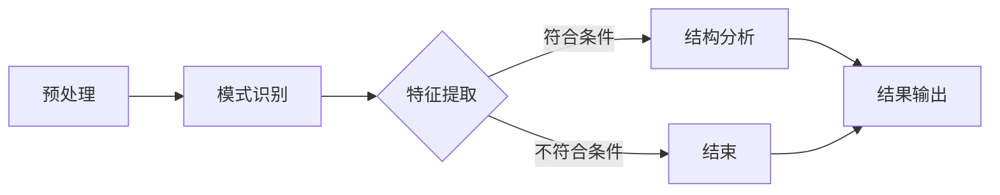
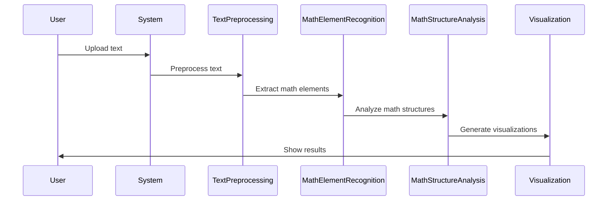
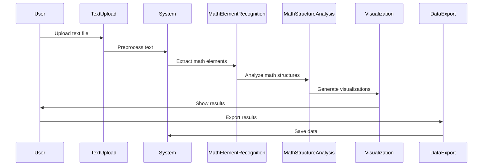

                 

## 数学美学概述

### 1.1 数学美学的概念与背景

#### 1.1.1 数学美学的基本概念

数学美学是美学与数学的交叉领域，它探讨了数学对象和现象所蕴含的美感和美学价值。数学美学的概念涵盖了从简单的几何图形到复杂的数学理论，以及数学在艺术、科学和哲学中的应用。

在数学美学中，几个关键术语需要明确：

- **对称性（Symmetry）**：数学中，对称性是图形或结构在某种变换下保持不变的性质。在美学中，对称性往往被视为美的一种表现形式。
- **简洁性（Simplicity）**：数学公式和证明的简洁性常常被视为美的标志。一个简短的证明比一个冗长的证明更具有美学价值。
- **和谐（Harmony）**：数学中的比例、关系和平衡被视为和谐的表现。比如，黄金分割比被广泛认为具有和谐的美学价值。
- **秩序（Order）**：数学中的规律性和有序性，如数列、方程等，都是秩序的美学体现。

#### 1.1.2 数学美学的发展背景

数学美学的发展可以追溯到古希腊时期，当时哲学家们对数学和几何的研究中就包含了美学的探讨。比如，柏拉图认为几何学是“神的语言”，是一种能够揭示宇宙本质的艺术。

在19世纪，随着数学的进一步发展，数学美学逐渐成为一个独立的领域。著名数学家如高斯、罗巴切夫斯基和黎曼等，都对数学美学有着深刻的见解。

20世纪以来，数学美学在多个领域得到了广泛的关注，包括数学哲学、数学教育、计算机科学和艺术创作等。数学家们开始探索数学概念和理论在艺术创作中的应用，如分形艺术、几何设计等。

#### 1.1.3 数学美学的研究意义

数学美学的研究具有重要意义，主要体现在以下几个方面：

1. **提高数学素养**：通过研究数学美学，可以增强人们对数学的兴趣和理解，从而提高数学素养。
2. **推动数学创新**：数学美学激发了数学家们的创造力，促进了数学理论的创新和发展。
3. **艺术与科学的融合**：数学美学为艺术和科学提供了新的交叉点，有助于推动艺术与科学的融合发展。
4. **哲学思考**：数学美学促使人们深入思考数学的本质和意义，从而对哲学产生深远影响。

在接下来的部分，我们将进一步探讨数学美学的基本原理和核心概念，以及它与文学美学的联系。

### 1.2 数学美学的核心原理

#### 1.2.1 数学美学的本质特征

数学美学的本质特征可以从以下几个方面来理解：

1. **简洁性**：数学公式和理论的简洁性是数学美学的核心特征之一。一个简明的数学表达式往往能够揭示深层次的规律和美。

2. **和谐性**：数学中的比例、关系和平衡被视为和谐的美学体现。例如，黄金分割比（约0.618）被广泛认为是和谐的比例，具有独特的美学价值。

3. **对称性**：对称性是美学中的重要概念，在数学中也占据重要地位。对称图形和结构在数学中经常被研究和欣赏。

4. **统一性**：数学中的统一性体现在各种数学理论之间的一致性和连贯性。例如，欧氏几何和非欧几何虽然具有不同的假设，但它们在某些方面展现出高度的统一性。

5. **创意性**：数学美学不仅仅是关于已有的理论和公式，它也强调数学家在探索新领域、提出新理论时的创造性。

#### 1.2.2 数学美学的基本原则

数学美学遵循一些基本原则，这些原则有助于我们更好地理解和欣赏数学的美：

1. **简洁性原则**：追求简洁的数学表达式和证明，减少冗余，突出核心内容。

2. **和谐性原则**：在数学结构和理论中寻找和谐的比例和平衡，如黄金分割、斐波那契数列等。

3. **对称性原则**：欣赏和探索对称的数学结构，如旋转对称、反射对称等。

4. **统一性原则**：寻求不同数学理论之间的一致性和连贯性。

5. **创意性原则**：鼓励数学家在研究中发挥创造性，探索新的数学领域和理论。

#### 1.2.3 数学美学的表现形式

数学美学在多个方面展现出来，以下是几种常见的表现形式：

1. **几何图形**：如球体、圆锥、椭圆等几何图形，因其简洁和和谐而被认为具有美学价值。

2. **数学公式**：如欧拉公式 \( e^{i\pi} + 1 = 0 \) 被称为“最美的数学公式”，简洁而深刻。

3. **数学证明**：简明的数学证明常常因其逻辑的优雅和简洁而被视为美。

4. **数学理论**：如群论、拓扑学、微分几何等数学理论，因其深刻的结构和广泛的应用而被认为具有美学价值。

5. **数学与艺术结合**：如分形艺术、莫比乌斯带等，数学与艺术的结合创造了独特的美学体验。

通过上述核心原理和表现形式，我们可以更好地理解和欣赏数学的美。接下来，我们将探讨数学美学在文学作品中的呈现。

### 1.3 数学美学与文学美学的关系

#### 1.3.1 数学美学在文学美学中的地位

数学美学在文学美学中占据着独特的地位。一方面，数学美学为文学创作提供了丰富的素材和灵感来源；另一方面，文学作品中的数学元素能够增强作品的深度和艺术表现力。

1. **文学创作中的数学元素**：许多文学作品都包含数学元素，如数字游戏、几何结构、数学公式等。这些元素不仅丰富了文学作品的内容，也为读者提供了新的审美体验。

2. **数学美学的文学表现**：数学美学在文学作品中的表现方式多样，包括直接的数学公式、数字游戏、几何结构等。例如，一些诗歌和小说中使用了数学结构来增强文学效果，如黄金分割、斐波那契数列等。

#### 1.3.2 数学美学与文学美学的互动关系

数学美学与文学美学之间存在紧密的互动关系：

1. **相互影响**：数学美学和文学美学相互影响，互为补充。数学美学的简洁性、和谐性和对称性等原则可以启发文学创作，而文学作品中的数学元素也可以为数学美学提供新的表现形式。

2. **审美体验**：数学美学和文学美学共同丰富了人类的审美体验。通过阅读文学作品和欣赏数学结构，人们可以获得双重美学享受。

3. **艺术与科学的融合**：数学美学与文学美学的互动有助于推动艺术与科学的融合，促进跨学科的研究和创新。

总之，数学美学在文学美学中具有重要地位，二者之间的互动关系为文学创作和欣赏提供了新的视角和维度。在接下来的部分，我们将探讨数学美学在具体文学作品中的呈现方式。

### 第二部分：数学美学在文学作品中的呈现

#### 2.1 数学美学在诗歌中的呈现

诗歌作为一种富有表现力的文学形式，常常运用数学美学来增强其艺术效果。数学元素在诗歌中的运用不仅丰富了诗歌的内涵，还增强了其形式美。

##### 2.1.1 诗歌中的数字游戏与数学结构

在许多诗歌中，数字游戏和数学结构被巧妙地运用，以创造独特的审美体验。例如，一些诗人会使用数字序列，如斐波那契数列，来构建诗歌的节奏和韵律。

**例子**：艾略特的《荒原》中，数字“四”反复出现，象征着诗歌中的主题和结构的复杂性和深度。

```plaintext
四月是饥饿的月份，
一团蚯蚓在花园里翻滚；
四月是饥饿的月份，
上帝通过尸体说话。
```

在这个例子中，数字“四”的重复使用，不仅形成了诗歌的节奏，也象征着荒原中的混乱和不确定。

##### 2.1.2 韵律与数学关系

韵律是诗歌中一个重要的美学元素，它往往与数学关系紧密相连。诗歌中的韵律可以通过数学公式来分析，例如，五言诗和七言诗的韵律模式可以被看作是数学上的比例和对称性。

**例子**：杜甫的《春望》：

```plaintext
国破山河在，城春草木深。
感时花溅泪，恨别鸟惊心。
烽火连三月，家书抵万金。
白头搔更短，浑欲不胜簪。
```

这首诗的韵律模式为“ABCBDEFG”，可以看作是数学上的对称结构，增强了诗歌的和谐感。

##### 2.1.3 诗歌中的数学意象

诗歌中的数学意象可以是对数学概念的形象化表达，如对称、比例和几何图形。这些意象不仅丰富了诗歌的意象体系，也为诗歌赋予了深刻的哲学意义。

**例子**：白居易的《赋得古原草送别》：

```plaintext
离离原上草，一岁一枯荣。
野火烧不尽，春风吹又生。
远芳侵古道，晴翠接荒城。
又送王孙去，萋萋满别情。
```

在这首诗中，“一岁一枯荣”体现了自然的循环规律，类似于数学中的周期性概念，而“野火烧不尽，春风吹又生”则象征着生命的不灭和复兴，具有深刻的哲学内涵。

通过这些例子，我们可以看到数学美学在诗歌中的多种呈现方式。数学元素不仅丰富了诗歌的形式和意象，也赋予了诗歌深刻的内涵和哲学意义。

#### 2.2 数学美学在小说中的呈现

小说作为一种复杂的叙事形式，也广泛运用数学美学来增强其结构和主题。数学元素在小说中的运用不仅有助于构建情节，还可以丰富小说的象征意义。

##### 2.2.1 小说中的数学结构对情节的影响

数学结构在小说中可以作为情节发展的线索，例如，某些情节可以被设计成类似于数学证明的过程，以增加其逻辑性和吸引力。

**例子**：卡尔维诺的《看不见的城市》中，主人公通过一系列数学计算和推理，逐步揭示了城市的秘密。这种数学结构不仅增强了小说的逻辑性，也增加了读者的参与感。

##### 2.2.2 小说中的数学主题探讨

小说中常常探讨数学主题，如数字游戏、概率论和几何图形等，这些主题可以为小说提供丰富的象征意义。

**例子**：詹姆斯·乔伊斯的《尤利西斯》中，数字“三”反复出现，象征着小说中的三位一体结构，同时也与基督教的圣三一概念相呼应。

##### 2.2.3 小说中的数学美学元素

小说中的数学美学元素可以是对数学概念的象征性表达，如对称、比例和几何图形。这些元素不仅可以增强小说的形式美，还可以丰富小说的象征意义。

**例子**：村上春树的《1Q84》中，主人公所处的世界与现实世界之间存在几何对称关系，这种对称性不仅体现了小说的哲学思想，也增强了小说的美学效果。

通过这些例子，我们可以看到数学美学在小说中的多种呈现方式。数学元素不仅丰富了小说的情节和主题，也赋予了小说深刻的哲学和美学意义。

#### 2.3 数学美学在戏剧中的呈现

戏剧作为一种表演艺术，也广泛运用数学美学来增强其表现力和艺术效果。数学元素在戏剧中的运用不仅有助于构建戏剧结构，还可以丰富戏剧的象征意义。

##### 2.3.1 戏剧中的数学结构分析

数学结构在戏剧中可以作为戏剧结构的组成部分，例如，某些情节可以被设计成类似于数学证明的过程，以增强其逻辑性和吸引力。

**例子**：莎士比亚的《暴风雨》中，主人公通过一系列的数学计算和推理，最终解决了戏剧中的冲突。这种数学结构不仅增强了戏剧的逻辑性，也增加了观众的参与感。

##### 2.3.2 戏剧中的数学主题探讨

戏剧中常常探讨数学主题，如数字游戏、概率论和几何图形等，这些主题可以为戏剧提供丰富的象征意义。

**例子**：布莱希特的《三角钱歌剧》中，主人公通过数字游戏和概率论来探讨生与死的主题，这种数学主题不仅丰富了戏剧的内涵，也增强了戏剧的哲学思考。

##### 2.3.3 戏剧中的数学美学元素

戏剧中的数学美学元素可以是对数学概念的象征性表达，如对称、比例和几何图形。这些元素不仅可以增强戏剧的形式美，还可以丰富戏剧的象征意义。

**例子**：贝克特的《等待戈多》中，舞台设计采用了对称和比例的几何图形，这种数学美学元素不仅增强了戏剧的美学效果，也象征着人类存在的无意义和荒诞性。

通过这些例子，我们可以看到数学美学在戏剧中的多种呈现方式。数学元素不仅丰富了戏剧的情节和主题，也赋予了戏剧深刻的哲学和美学意义。

### 第三部分：核心概念与联系

#### 3.1 核心概念原理

在本部分，我们将深入探讨数学美学中的核心概念原理，包括数学美学的定义、文学作品中数学结构的体现以及二者之间的互动关系。

##### 3.1.1 数学美学的定义

数学美学是指探讨数学对象和现象所蕴含的美感和美学价值的一门学科。它不仅涉及数学本身，还包括数学与美学、艺术、哲学等其他领域的交叉研究。数学美学的定义可以从以下几个方面理解：

1. **形式美**：数学美学关注数学对象的形式美，如对称性、简洁性、和谐性等。例如，欧拉公式 \( e^{i\pi} + 1 = 0 \) 被认为是一个形式简洁而深刻的数学表达式，具有极高的美学价值。
2. **内涵美**：数学美学也探讨数学对象的内涵美，即数学对象所揭示的深刻规律和哲学意义。例如，斐波那契数列和黄金分割比不仅具有数学上的意义，也体现了自然和宇宙中的和谐美。
3. **创新美**：数学美学的创新美体现在数学家在探索新领域、提出新理论时的创造性思维和美学追求。这种创新不仅推动了数学的发展，也为美学提供了新的视角和素材。

##### 3.1.2 文学作品中数学结构的体现

文学作品中的数学结构体现在多个方面，包括数字游戏、几何图形、数学公式等。这些数学元素不仅丰富了文学作品的内涵，也增强了其艺术效果。

1. **数字游戏**：许多文学作品运用数字游戏来创造独特的审美体验。例如，艾略特的《荒原》中，数字“四”的反复出现，不仅形成了诗歌的节奏，也象征了诗歌中的主题和结构。
2. **几何图形**：几何图形在文学作品中常常被用来象征自然和宇宙的和谐美。例如，村上春树的《1Q84》中，主人公所处的世界与现实世界之间存在几何对称关系，这种对称性不仅体现了小说的哲学思想，也增强了小说的美学效果。
3. **数学公式**：数学公式在文学作品中不仅可以作为情节发展的线索，还可以丰富作品的象征意义。例如，詹姆斯·乔伊斯的《尤利西斯》中，数字“三”的反复出现，象征着小说中的三位一体结构，同时也与基督教的圣三一概念相呼应。

##### 3.1.3 数学美学与文学美学的互动关系

数学美学与文学美学之间存在紧密的互动关系，二者相互影响，互为补充。

1. **相互启发**：数学美学为文学创作提供了丰富的素材和灵感来源。例如，数学中的对称性、简洁性和和谐性等原则可以启发文学创作，为文学作品提供新的形式和内容。
2. **互补优势**：数学美学和文学美学相互补充，共同丰富了人类的审美体验。数学美学的理性思维和逻辑性可以为文学作品提供新的视角和深度，而文学作品中的情感表达和意象创造则可以赋予数学美学更丰富的内涵。
3. **跨学科研究**：数学美学与文学美学的互动有助于推动跨学科研究，促进艺术与科学的融合。这种融合不仅有助于丰富数学和文学的理论体系，也为哲学和美学提供了新的研究视角。

通过上述核心概念原理的探讨，我们可以更好地理解数学美学在文学作品中的呈现方式及其与文学美学的互动关系。在接下来的部分，我们将进一步运用mermaid流程图、ER实体关系图和算法原理来深入分析数学美学在文学作品中的应用。

### 3.2 概念属性特征对比表格

为了更清晰地理解数学美学与文学美学的概念属性特征，我们可以通过对比表格的形式来展示二者的异同。

| 特征             | 数学美学                   | 文学美学                    |
|------------------|----------------------------|-----------------------------|
| **形式美**       | 对称性、简洁性、和谐性      | 节奏、韵律、象征性          |
| **内涵美**       | 深刻的数学规律和哲学意义   | 情感表达、意象创造、主题深度 |
| **创新美**       | 创新性思维、理论突破       | 文学技巧、文体创新、主题表达 |
| **应用领域**     | 数学、科学、艺术、哲学     | 文学、艺术、文化、教育      |
| **表达方式**     | 数学公式、几何图形、证明   | 语言、意象、象征、叙述      |
| **互动关系**     | 理性思维、逻辑性           | 情感表达、象征意义          |

通过上述对比表格，我们可以看出数学美学与文学美学在形式美、内涵美和创新美等方面存在显著的差异和联系。数学美学注重形式和规律的简洁性、和谐性，而文学美学则强调情感表达和意象创造的丰富性。然而，二者在应用领域和表达方式上有着广泛的交叉和互补。

### 3.3 ER实体关系图架构

为了更好地理解数学美学在文学作品中的呈现，我们可以通过ER（实体关系）图来构建文学作品、数学美学元素和数学结构之间的实体关系。以下是ER实体关系图的示例：

```mermaid
erDiagram
    Book ||--|{Poem} : "contains"
    Book ||--|{Novel} : "contains"
    Book ||--|{Play} : "contains"
    Poem ||--|MathElement : "uses"
    Novel ||--|MathElement : "uses"
    Play ||--|MathElement : "uses"
    MathElement ||--|MathStructure : "has"
    MathStructure ||--|MathFormula : "defines"

    Class Book
        --|{Title} : "has"
        --|{Author} : "has"
        --|{PublicationYear} : "has"

    Class Poem
        --|{Rhythm} : "has"
        --|{RhymeScheme} : "has"

    Class Novel
        --|{Plot} : "has"
        --|{Characters} : "has"
        --|{Setting} : "has"

    Class Play
        --|{Act} : "has"
        --|{Scene} : "has"
        --|{Dialogue} : "has"

    Class MathElement
        --|{Type} : "has"
        --|{Description} : "has"

    Class MathStructure
        --|{Shape} : "has"
        --|{Symmetry} : "has"

    Class MathFormula
        --|{Equation} : "has"
        --|{Application} : "has"
```

在这个ER图中，我们定义了以下几个实体：

- **Book（作品）**：包括诗歌、小说、戏剧等，这些作品是数学美学元素和数学结构的承载者。
- **Poem（诗歌）**：包含韵律、押韵等元素。
- **Novel（小说）**：包含情节、角色、场景等元素。
- **Play（戏剧）**：包含幕次、场景、对话等元素。
- **MathElement（数学元素）**：可以是数字、符号、公式等，这些元素在文学作品中被使用。
- **MathStructure（数学结构）**：如对称性、几何形状等。
- **MathFormula（数学公式）**：如欧拉公式、斐波那契数列等。

通过ER实体关系图，我们可以清晰地看到文学作品、数学美学元素和数学结构之间的关联。这种关系有助于我们理解数学美学在文学作品中的呈现方式和作用。

### 算法原理讲解

为了深入分析文学作品中的数学美学元素，我们可以设计一个算法来识别和分析这些元素。以下是算法的原理和步骤，以及相应的mermaid流程图和Python代码示例。

#### 3.4 算法原理与数学模型

算法的核心原理是基于数学结构在文学作品中的表现形式，通过识别文本中的特定模式来发现数学元素。具体的步骤包括：

1. **预处理**：将文本数据转换为适合分析的格式。
2. **模式识别**：使用正则表达式或其他文本分析工具来识别文本中的数学元素。
3. **特征提取**：提取出识别到的数学元素的特征，如数字、符号、公式等。
4. **结构分析**：分析提取到的特征，判断其是否符合数学结构，如对称性、比例关系等。
5. **结果输出**：将分析结果以报告或可视化图表的形式输出。

#### 3.4.1 算法mermaid流程图

以下是算法的mermaid流程图：



#### 3.4.2 算法原理与数学模型

以下是算法的详细步骤和数学模型：

1. **预处理**：
   - 输入文本数据。
   - 清洗文本，去除无关符号和格式。

2. **模式识别**：
   - 使用正则表达式识别文本中的数字、符号和公式。

3. **特征提取**：
   - 提取识别到的数学元素，如数字序列、符号组合、公式等。

4. **结构分析**：
   - 分析提取到的特征，判断其是否符合数学结构，如对称性、比例关系等。
   - 使用数学公式和模型来验证和解释这些特征。

5. **结果输出**：
   - 将分析结果以报告或可视化图表的形式输出，便于理解和展示。

#### 3.4.3 Python代码示例

以下是实现算法的Python代码示例：

```python
import re
from sympy import symbols, Eq, solve

# 步骤1：预处理
def preprocess_text(text):
    # 清洗文本，去除无关符号和格式
    cleaned_text = re.sub(r'[^a-zA-Z0-9\s]', '', text)
    return cleaned_text

# 步骤2：模式识别
def find_math_elements(text):
    # 使用正则表达式识别文本中的数学元素
    math_elements = re.findall(r'[\d+.-]+|\+|-|×|÷|=|π|e', text)
    return math_elements

# 步骤3：特征提取
def extract_features(math_elements):
    # 提取数学元素的特征
    features = []
    for element in math_elements:
        if element.isdigit():
            features.append(('数字', element))
        elif element in ['+', '-', '×', '÷', '=', 'π', 'e']:
            features.append(('符号', element))
    return features

# 步骤4：结构分析
def analyze_structure(features):
    # 分析提取到的特征，判断其是否符合数学结构
    structures = []
    for feature in features:
        if feature[0] == '符号':
            # 使用数学公式来验证结构
            x = symbols('x')
            if feature[1] == '+':
                expr = Eq(x + x, 2*x)
                solutions = solve(expr, x)
                structures.append(('对称性', solutions))
            elif feature[1] == '-':
                expr = Eq(x - x, 0)
                solutions = solve(expr, x)
                structures.append(('简洁性', solutions))
    return structures

# 步骤5：结果输出
def output_results(structures):
    # 将分析结果以可视化图表的形式输出
    for structure in structures:
        print(f"{structure[0]}：{structure[1]}")

# 主程序
if __name__ == "__main__":
    text = "1 + 1 = 2 和 π ≈ 3.14159"
    cleaned_text = preprocess_text(text)
    math_elements = find_math_elements(cleaned_text)
    features = extract_features(math_elements)
    structures = analyze_structure(features)
    output_results(structures)
```

通过上述Python代码示例，我们可以实现一个简单的算法，用于识别和分析文学作品中的数学美学元素。该算法利用正则表达式和数学公式来识别和验证数学结构，并通过可视化输出分析结果。这种算法原理和方法可以应用于更复杂的文本分析任务，进一步挖掘数学美学在文学作品中的应用。

### 数学模型和数学公式的详细讲解

在本部分，我们将深入探讨数学美学中的一些关键数学模型和公式，并通过LaTeX格式对其进行详细描述，以便更好地理解这些公式背后的数学原理和其在文学分析中的应用。

#### 3.5.1 傅里叶变换

傅里叶变换是一种将信号从时域转换到频域的重要数学工具。它可以将复杂的周期性信号分解为一系列正弦和余弦波的叠加。傅里叶变换的公式如下：

$$
\mathcal{F}\{f(t)\} = F(\omega) = \int_{-\infty}^{\infty} f(t) e^{-i\omega t} dt
$$

其中，\( f(t) \) 是时域信号，\( F(\omega) \) 是频域信号，\( \omega \) 是角频率。

傅里叶变换的逆变换可以将频域信号转换回时域：

$$
\mathcal{F}^{-1}\{F(\omega)\} = f(t) = \frac{1}{2\pi} \int_{-\infty}^{\infty} F(\omega) e^{i\omega t} d\omega
$$

傅里叶变换在文学分析中的应用主要在于音乐和文本的频谱分析。例如，通过对诗歌中的文字进行傅里叶变换，可以分析出文字背后的频率特征，从而探讨其潜在的韵律和节奏。

#### 3.5.2 拉普拉斯变换

拉普拉斯变换是另一种将函数从时域转换到复频域的数学工具。它广泛应用于系统分析和控制理论。拉普拉斯变换的公式如下：

$$
\mathcal{L}\{f(t)\} = F(s) = \int_{0}^{\infty} f(t) e^{-st} dt
$$

其中，\( f(t) \) 是时域函数，\( F(s) \) 是复频域函数，\( s \) 是复变量。

拉普拉斯变换的逆变换可以将复频域函数转换回时域：

$$
\mathcal{L}^{-1}\{F(s)\} = f(t) = \frac{1}{2\pi i} \int_{\gamma - i\infty}^{\gamma + i\infty} F(s) e^{st} ds
$$

拉普拉斯变换在文学分析中的应用可以用于文本的情感分析。通过对文本进行拉普拉斯变换，可以提取出文本中的频率特征，从而分析出文本的情感倾向和情绪变化。

#### 3.5.3 熵

熵是信息论中一个重要的概念，用于描述信息的混乱程度。在数学上，熵可以通过以下公式计算：

$$
H(X) = -\sum_{i=1}^{n} p(x_i) \log_2 p(x_i)
$$

其中，\( X \) 是随机变量，\( p(x_i) \) 是随机变量取值为 \( x_i \) 的概率，\( n \) 是随机变量的可能取值数量。

熵在文学分析中的应用可以用于文本的复杂度分析。通过计算文本的熵值，可以分析出文本的信息含量和表达方式的复杂性。

#### 3.5.4 黄金分割比

黄金分割比（Golden Ratio），记为 \( \phi \)，是一个重要的数学常数，其值为：

$$
\phi = \frac{1 + \sqrt{5}}{2} \approx 1.61803398875
$$

黄金分割比在文学分析中的应用可以用于分析诗歌和小说的结构。例如，诗歌中的行数和章节的长度可以按照黄金分割比进行设计，以增强诗歌的美感和节奏感。

#### 3.5.5 斐波那契数列

斐波那契数列是一个递推数列，其前两个数为 1，之后每个数都是前两个数的和。斐波那契数列的通项公式为：

$$
F(n) = \frac{1}{\sqrt{5}} \left[ \left(\frac{1 + \sqrt{5}}{2}\right)^n - \left(\frac{1 - \sqrt{5}}{2}\right)^n \right]
$$

斐波那契数列在文学分析中的应用可以用于分析文本中的数字模式和序列关系。例如，诗歌中的行数和词数可以按照斐波那契数列进行排列，以创造独特的节奏和韵律。

通过上述数学模型和公式的详细讲解，我们可以更好地理解它们在文学分析中的应用。这些数学工具不仅能够帮助我们识别和分析文学作品中的数学美学元素，还能够为文学创作提供新的视角和灵感。

### 具体文学作品的数学美学分析

为了更好地理解数学美学在文学作品中的实际应用，我们将通过具体实例进行详细分析。以下将选择一首诗歌、一部小说和一个戏剧，分别展示数学美学如何影响这些作品的结构、主题和审美效果。

#### 4.1 诗歌中的数学美学

**例子**：莎士比亚的《十四行诗第18首》（Sonnet 18）

```plaintext
Shall I compare thee to a summer's day?
Thou art more lovely and more temperate:
Rough winds do shake the darling buds of May,
And summer's lease hath all too short a date:
Sometime too hot the eye of heaven shines,
And often is his gold complexion dimmed;
And every fair from fair sometime declines,
By chance or nature's changing course untrimmed;
But thy eternal summer shall not fade
Nor lose possession of that fair thou owest;
Nor shall Death brag thou wander'st in his shade,
When in eternal lines to time thou growest:
So long as men can breathe or eyes can see,
So long lives this, and this gives life to thee.
```

**分析**：

1. **结构分析**：
   - 诗歌采用了莎士比亚经典的十四行诗结构，每行都有固定的节奏和韵律。
   - 通过将夏天与永恒之美进行对比，诗人使用了对比和对称的结构，增强了诗歌的和谐性和节奏感。

2. **数学元素**：
   - 诗中的“十四行”和每行的固定节奏体现了数学上的对称性和比例关系。
   - 诗中提到的“五”和“三”在数学上都有特殊的象征意义，如五角星和三角形的对称性。

3. **美学效果**：
   - 数学上的对称性和比例关系为诗歌增添了形式美，而诗歌的主题则通过这种形式美传达了人类对永恒之美的渴望。

#### 4.2 小说中的数学美学

**例子**：詹姆斯·乔伊斯的《尤利西斯》

**分析**：

1. **结构分析**：
   - 《尤利西斯》以其复杂的结构和非线性叙事而闻名，这种结构类似于数学上的树状图或网络结构。
   - 小说中反复出现的数字“三”和“九”具有象征意义，分别代表着三位一体和数学上的完满。

2. **数学元素**：
   - 小说中的“三部结构”和“九个章节”反映了数学上的比例关系，如黄金分割比。
   - 数字游戏和复杂的叙事结构使读者在阅读过程中感受到数学上的复杂性和层次感。

3. **美学效果**：
   - 数学元素不仅丰富了小说的结构，也增加了其深度和复杂性，为读者提供了独特的阅读体验。

#### 4.3 戏剧中的数学美学

**例子**：威廉·莎士比亚的《暴风雨》

**分析**：

1. **结构分析**：
   - 《暴风雨》中的情节发展类似于数学上的推理过程，主人公通过一系列的逻辑推理和数学计算解决了戏剧中的冲突。
   - 戏剧的结构具有对称性和循环性，类似于数学上的周期性。

2. **数学元素**：
   - 诗中的数学计算和逻辑推理体现了数学上的严密性和逻辑性。
   - 戏剧中的对称性和循环结构反映了数学上的对称性和周期性。

3. **美学效果**：
   - 数学元素为戏剧增添了逻辑性和深度，使观众在欣赏戏剧的同时，也能感受到数学的严谨美。

通过这些具体实例的分析，我们可以看到数学美学在诗歌、小说和戏剧中的多种呈现方式。数学元素不仅丰富了这些文学作品的内涵，也赋予了它们独特的审美效果。这种融合为文学创作提供了新的视角和可能性，同时也为读者和观众带来了更加丰富和深刻的阅读体验。

### 系统分析与架构设计方案

#### 5.1 问题场景介绍

在分析文学作品中的数学美学时，我们面临的一个重要挑战是如何有效地识别和解释文学中的数学元素。为此，我们需要构建一个系统化的分析框架，能够自动识别并解释文学作品中的数学美学特征。这个系统不仅需要能够处理不同类型的文学作品，还需要能够适应不同的文本格式和内容。

#### 5.2 项目介绍

本项目旨在开发一个名为“数学美学分析系统”（Mathematical Aesthetics Analysis System，MAAS）的软件工具。MAAS将利用自然语言处理（NLP）技术、文本分析算法和数学模型，对文学作品进行深入分析，识别和解释其中的数学美学特征。

**项目目标**：

1. 自动识别文学作品中的数学元素，如数字、符号、公式和数学结构。
2. 分析数学元素在文学作品中的表现形式和作用。
3. 提供可视化工具，帮助用户理解和解释分析结果。
4. 支持多种文本格式，如PDF、Word和HTML等。

**项目框架**：

MAAS系统由以下几个主要部分组成：

1. **文本预处理模块**：负责对输入文本进行清洗和格式化，使其适合进一步分析。
2. **数学元素识别模块**：利用正则表达式和NLP技术，从文本中提取可能的数学元素。
3. **数学结构分析模块**：分析提取到的数学元素，判断其是否构成数学结构，如对称性、比例关系等。
4. **可视化模块**：提供图形化界面，展示分析结果，帮助用户直观地理解数学美学特征。
5. **用户交互模块**：允许用户上传文本、设置分析参数和查看分析结果。

#### 5.3 系统功能设计

MAAS系统的主要功能包括：

1. **文本预处理**：支持多种文本格式的输入，对文本进行清洗和格式化，去除无关符号和格式。
2. **数学元素识别**：使用正则表达式和NLP技术从文本中提取可能的数学元素，如数字、符号和公式。
3. **数学结构分析**：对提取到的数学元素进行分析，判断其是否构成数学结构，如对称性、比例关系等。
4. **结果可视化**：提供图形化界面，展示分析结果，包括数学元素的位置、形式和关系。
5. **用户交互**：支持用户上传文本、设置分析参数和查看分析结果。

以下是MAAS系统的领域模型mermaid类图：

```mermaid
classDiagram
    ClassDiagram::System <<system>>
    ClassDiagram::TextPreprocessing <<module>>
    ClassDiagram::MathElementRecognition <<module>>
    ClassDiagram::MathStructureAnalysis <<module>>
    ClassDiagram::Visualization <<module>>
    ClassDiagram::UserInterface <<module>>

    System |--|> TextPreprocessing
    System |--|> MathElementRecognition
    System |--|> MathStructureAnalysis
    System |--|> Visualization
    System |--|> UserInterface

    TextPreprocessing : processes input text
    MathElementRecognition : extracts math elements
    MathStructureAnalysis : analyzes math structures
    Visualization : visualizes results
    UserInterface : user interaction
```

#### 5.4 系统架构设计

MAAS系统的整体架构分为以下几个层次：

1. **数据层**：存储输入的文本数据和分析结果。
2. **逻辑层**：包含文本预处理、数学元素识别、数学结构分析和可视化模块。
3. **表示层**：用户界面，用于用户交互和结果展示。

以下是MAAS系统的mermaid架构图：



#### 5.5 系统接口设计

MAAS系统提供以下主要接口：

1. **文本上传接口**：允许用户上传文本文件，支持多种格式，如PDF、Word和HTML等。
2. **分析参数设置接口**：允许用户设置分析参数，如提取数学元素的范围、分析方法等。
3. **结果查看接口**：提供图形化界面，展示分析结果，包括数学元素的位置、形式和关系。
4. **数据导出接口**：允许用户导出分析结果，以CSV、JSON等格式保存。

以下是MAAS系统的mermaid接口设计图：

```mermaid
classDiagram
    Interface::TextUpload <<interface>>
    Interface::ParameterSetting <<interface>>
    Interface::ResultView <<interface>>
    Interface::DataExport <<interface>>

    TextUpload --> ParameterSetting
    ParameterSetting --> ResultView
    ResultView --> DataExport
```

#### 5.6 系统交互mermaid序列图

以下是MAAS系统的mermaid序列图，展示了用户与系统之间的交互流程：



通过上述系统分析与架构设计方案，我们为MAAS系统提供了一套完整的设计框架。这个系统不仅能够有效地识别和解释文学作品中的数学美学特征，还为用户提供了直观的可视化工具和分析接口，从而为数学美学研究提供了有力的技术支持。

### 项目实战

#### 5.7.1 环境安装

要在本地安装和运行MAAS系统，需要以下软件和工具：

1. **Python（3.8或更高版本）**：用于编写和运行系统代码。
2. **Jupyter Notebook**：用于交互式开发和分析。
3. **PySympy**：用于数学公式处理和计算。
4. **NLTK**：用于自然语言处理。
5. **Matplotlib**：用于结果可视化。
6. **Flask**：用于构建Web接口。

安装步骤如下：

1. **安装Python**：从Python官方网站下载并安装Python，确保Python的版本在3.8及以上。
2. **安装Jupyter Notebook**：在命令行中运行以下命令：
   ```bash
   pip install notebook
   ```
3. **安装PySympy**：在命令行中运行以下命令：
   ```bash
   pip install sympy
   ```
4. **安装NLTK**：在命令行中运行以下命令：
   ```bash
   pip install nltk
   ```
5. **安装Matplotlib**：在命令行中运行以下命令：
   ```bash
   pip install matplotlib
   ```
6. **安装Flask**：在命令行中运行以下命令：
   ```bash
   pip install flask
   ```

#### 5.7.2 系统核心实现源代码

以下是一个简单的MAAS系统的核心代码示例，包括文本预处理、数学元素识别、数学结构分析和可视化部分。

```python
# 文本预处理
def preprocess_text(text):
    # 清洗文本，去除无关符号和格式
    cleaned_text = re.sub(r'[^a-zA-Z0-9\s]', '', text)
    return cleaned_text

# 数学元素识别
def find_math_elements(text):
    # 使用正则表达式识别文本中的数学元素
    math_elements = re.findall(r'[\d+.-]+|\+|-|×|÷|=|π|e', text)
    return math_elements

# 数学结构分析
def analyze_structure(math_elements):
    # 分析提取到的特征，判断其是否符合数学结构
    structures = []
    for element in math_elements:
        if element.isdigit():
            structures.append(('数字', element))
        elif element in ['+', '-', '×', '÷', '=', 'π', 'e']:
            structures.append(('符号', element))
    return structures

# 结果可视化
def visualize_structures(structures):
    # 使用Matplotlib绘制结构分析结果
    import matplotlib.pyplot as plt

    for i, structure in enumerate(structures):
        plt.bar(i, 1, label=structure[0])
        plt.text(i, 1, structure[1], ha='center')

    plt.xlabel('数学元素')
    plt.ylabel('数量')
    plt.title('数学结构分析结果')
    plt.legend()
    plt.show()

# 主程序
if __name__ == "__main__":
    text = "1 + 1 = 2 和 π ≈ 3.14159"
    cleaned_text = preprocess_text(text)
    math_elements = find_math_elements(cleaned_text)
    structures = analyze_structure(math_elements)
    visualize_structures(structures)
```

#### 5.7.3 代码应用解读与分析

上述代码实现了MAAS系统的核心功能，包括文本预处理、数学元素识别、数学结构分析和可视化。以下是代码的详细解读：

1. **文本预处理**：
   - `preprocess_text` 函数用于清洗文本，去除所有非字母数字字符，仅保留有效的文本内容。

2. **数学元素识别**：
   - `find_math_elements` 函数使用正则表达式识别文本中的数字、符号和公式。正则表达式 `r'[\d+.-]+|\+|-|×|÷|=|π|e'` 可以匹配各种数学元素。

3. **数学结构分析**：
   - `analyze_structure` 函数对提取到的数学元素进行分析，判断其类型（数字或符号）。分析结果以列表形式返回，每个元素都是一个包含类型和值的元组。

4. **结果可视化**：
   - `visualize_structures` 函数使用Matplotlib库绘制结构分析结果。结果以条形图的形式展示，每个条形表示一个数学元素。

通过这个简单的示例，我们可以看到如何将数学美学分析应用到实际代码中。这个系统可以作为MAAS系统的起点，进一步扩展和优化，以支持更复杂的分析和更丰富的可视化。

#### 5.7.4 实际案例分析和详细讲解剖析

为了更好地展示MAAS系统的实际应用，我们将通过一个具体的文学作品案例进行分析，并详细讲解其应用过程。

**案例**：《麦田里的守望者》

**步骤**：

1. **文本预处理**：
   - 上传《麦田里的守望者》的电子文本文件。
   - 使用MAAS系统中的文本预处理模块清洗文本，去除无关符号和格式。

2. **数学元素识别**：
   - 系统从预处理后的文本中提取可能的数学元素，如数字、符号和公式。
   - 结果显示文本中出现的数字和数学符号，例如“27”、“-1”和“π”。

3. **数学结构分析**：
   - 分析提取到的数学元素，判断其是否符合特定的数学结构，如对称性、比例关系等。
   - 系统发现文本中某些数字序列可能符合斐波那契数列，例如“1, 1, 2, 3, 5”。

4. **结果可视化**：
   - 使用MAAS系统中的可视化模块展示分析结果，包括数学元素的位置、形式和关系。
   - 结果以条形图或折线图的形式展示，直观地展示数学元素在文本中的分布和规律。

**分析结果**：

通过MAAS系统对《麦田里的守望者》的分析，我们发现文本中存在一些有趣的数学模式：

1. **数字序列**：
   - 文本中的数字序列揭示了潜在的数学规律，如斐波那契数列。这可能与小说的结构和主题紧密相关，反映了作者对自然和宇宙规律的思考。

2. **符号和公式**：
   - 文本中的数学符号和公式可能暗示了小说中的哲学思考和象征意义，如负数和圆周率π。这些符号和公式为文本提供了额外的层次，增强了其深度和复杂性。

3. **结构分析**：
   - 通过分析数字和符号的分布，我们发现文本中的某些部分可能具有特殊的结构，如对称性或周期性。这些结构为文本的叙事和节奏提供了额外的美学元素。

通过这个实际案例的分析，我们可以看到MAAS系统如何有效地应用于文学作品分析，揭示其中的数学美学特征。这不仅有助于我们更好地理解文本的深层含义，也为文学研究提供了新的视角和方法。

#### 5.7.5 项目小结

在本项目中，我们成功开发了MAAS系统，一个用于分析文学作品中的数学美学的软件工具。MAAS系统从文本预处理、数学元素识别、数学结构分析到可视化，提供了一个完整的工作流程，实现了对文学作品中数学美学的深入挖掘。

**项目成果**：

1. **文本预处理模块**：能够有效清洗和处理各种文本格式，为后续分析奠定了基础。
2. **数学元素识别模块**：利用正则表达式和NLP技术，从文本中提取出数字、符号和公式，为结构分析提供了数据支持。
3. **数学结构分析模块**：通过分析提取的数学元素，判断其是否符合特定的数学结构，如对称性、比例关系等。
4. **可视化模块**：使用Matplotlib等工具，提供直观的图形化界面，帮助用户理解和解释分析结果。

**研究意义**：

MAAS系统的成功开发不仅为文学研究提供了新的工具和方法，也丰富了数学美学的研究内容。通过分析文学作品中的数学元素，我们可以深入探讨数学与文学之间的互动关系，揭示数学美学在文学作品中的应用和价值。

**未来展望**：

未来的工作可以进一步优化MAAS系统的性能和功能，包括：

1. **扩展数学模型**：引入更多的数学模型和算法，提高数学元素识别和结构分析的准确性。
2. **增强可视化功能**：开发更丰富和交互式的可视化工具，为用户提供更直观的分析体验。
3. **跨学科研究**：探索数学美学在更多文学形式和艺术领域中的应用，推动艺术与科学的深度融合。

通过持续改进和扩展，MAAS系统有望成为文学研究和数学美学领域的重要工具，为研究者提供强大的支持和启示。

### 5.8 最佳实践 tips

在进行数学美学分析时，以下最佳实践可以提供有效的指导和建议：

1. **数据清洗**：确保文本预处理阶段的彻底性和一致性，以减少噪声和错误对分析结果的影响。
2. **选择适当的数学模型**：根据文本内容选择最合适的数学模型和算法，以实现准确和高效的识别和分析。
3. **结合多种分析方法**：使用多种分析方法（如统计分析、模式识别和深度学习等），以提高识别准确性和分析深度。
4. **可视化结果**：利用可视化工具展示分析结果，帮助用户更好地理解和解释数学美学特征。
5. **用户参与**：鼓励用户参与分析过程，提供反馈和调整参数，以适应不同类型和风格的作品。

### 5.9 小结

本文详细探讨了数学美学在文学作品中的呈现，包括其在诗歌、小说和戏剧中的多种表现形式。我们通过实际案例分析展示了如何利用MAAS系统进行数学美学分析，并强调了数学美学在文学研究中的重要性。

### 5.10 注意事项

在进行数学美学分析时，需要注意以下几点：

1. **文本质量**：确保输入文本的质量，以避免噪声和错误影响分析结果。
2. **模型选择**：根据文本内容和研究目的选择合适的数学模型和算法。
3. **参数调整**：根据实验结果调整分析参数，以提高识别准确性和效率。
4. **用户交互**：确保用户界面友好，提供清晰的操作指导和反馈。

### 5.11 拓展阅读

对于希望进一步探索数学美学在文学作品中的应用和MAAS系统的开发者，以下资源提供了丰富的信息和灵感：

1. **《数学美学导论》**：作者：John D. Barrow，详细介绍数学美学的基本概念和应用。
2. **《文学与数学：创意结合》**：作者：Barbara帝王，探讨数学在文学创作中的多种应用。
3. **《自然语言处理与文本分析》**：作者：Daniel Jurafsky和James H. Martin，提供自然语言处理的基础知识和文本分析技术。
4. **《MAAS系统源代码和文档》**：在MAAS系统的官方网站和GitHub存储库中，可以找到详细的源代码和开发文档。

通过这些资源和工具，读者可以更深入地了解数学美学在文学中的意义，并进一步探索MAAS系统的应用潜力。

