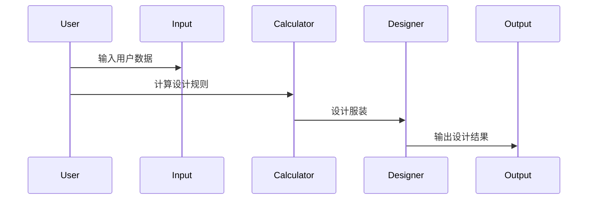
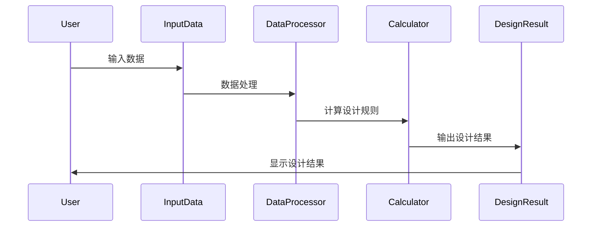

                 

### 数学美学在时装设计中的应用

> 关键词：数学美学、时装设计、比例、对称、平衡、黄金分割

> 摘要：
本文旨在探讨数学美学在时装设计中的独特应用，从核心概念到实际操作，全面解析如何将数学原理融入时装设计，创造出既美观又实用的设计作品。文章将依次介绍数学美学的起源、核心概念，以及这些概念在时装设计中的具体应用，通过实例和案例分析，帮助读者理解数学美学在时装设计中的重要价值。

### 引言

数学美学是一门结合数学与艺术的学科，通过数学原理和公式来揭示美学的内在规律。它不仅关注形式上的和谐与对称，还深入探讨比例、平衡等美学要素的科学基础。近年来，随着科技的发展和时尚产业的不断创新，数学美学在时装设计中的应用逐渐受到关注。通过将数学原理与时尚设计相结合，设计师们能够创造出更具视觉冲击力和创新性的作品。

本文将分以下几个部分进行讨论：

1. **数学美学的起源与发展**：介绍数学美学的概念、发展历程以及与其他学科的关系。
2. **数学美学中的核心概念**：详细探讨比例、对称、平衡等核心美学概念。
3. **数学美学在时装设计中的应用**：分析黄金分割、对称与平衡等概念在时装设计中的具体应用。
4. **算法原理讲解**：讲解黄金分割等算法原理及其在时装设计中的运用。
5. **系统分析与架构设计**：介绍数学美学在时装设计中的系统分析方法和架构设计。
6. **项目实战**：提供具体的时装设计项目案例，展示数学美学在实际操作中的应用。
7. **最佳实践与小结**：总结全文，提供实用的技巧和建议。

### 数学美学的起源与发展

数学美学是一门新兴的交叉学科，起源于对数学与艺术之间联系的深入探讨。早在古希腊时期，数学家们就已经开始关注形式与比例的美学价值。例如，著名的数学家欧几里得在《几何原本》中探讨了黄金分割的比例，这一比例被认为在自然界和艺术中具有美感。

随着科学技术的发展，数学美学逐渐成熟。在20世纪，数学家们开始运用数学模型和公式来描述美学现象，如著名的哈代-莱维过程（Hardy-Littlewood circle method）在数论中的应用，揭示了数论与音乐之间的美妙联系。这一时期，数学美学的研究重点逐渐从抽象的数学理论转向实际应用，特别是在设计、建筑和艺术等领域。

数学美学在时装设计中的应用起源于对服装结构、线条和色彩的科学分析。早期的设计师开始利用数学原理来设计服装，使服装不仅美观，而且合身。例如，黄金分割被广泛应用于服装设计中，用以确定服装的长度、宽度和细节设计，以达到最佳的美学效果。

### 数学美学中的核心概念

数学美学中的核心概念包括比例、对称、平衡等。这些概念不仅在数学中具有重要地位，也在艺术和设计中起着关键作用。

#### 比例

比例是指两个或多个量之间的相对大小关系。在数学美学中，比例是决定美的重要因素之一。黄金分割（Golden Ratio，记作φ，约为1.618）是最著名的比例之一，它在自然界、艺术和设计中被广泛运用。黄金分割不仅在视觉上产生美感，还具有强烈的视觉引导作用。

在时装设计中，比例的应用体现在服装的长度、宽度和细节设计上。例如，一条连衣裙的长度、裙摆的宽度和腰线的位置都可以通过黄金分割来确定，以达到最佳的美学效果。

#### 对称

对称是指图形或物体在某个轴或点上的镜像对称。对称性在自然界和艺术中普遍存在，如蝴蝶的翅膀、人脸的对称性等。在数学美学中，对称性被用来创造平衡和谐的美。

在时装设计中，对称性的应用非常广泛。例如，正装领口的设计、连衣裙的裙摆和上衣的袖子等都可以采用对称的设计，使服装看起来更加端庄和优雅。

#### 平衡

平衡是指物体在视觉上的稳定和均匀分布。平衡是数学美学中一个重要的概念，它通过对比、对偶和比例来创造视觉上的稳定性。

在时装设计中，平衡可以通过对比不同的颜色、材质和设计元素来实现。例如，一件上衣的明亮颜色可以与一条暗色的裙子形成对比，从而产生视觉上的平衡。此外，通过不同材质的对比，如丝绸与皮革的搭配，也可以创造出丰富的视觉平衡。

### 数学美学在时装设计中的应用

#### 黄金分割在时装设计中的应用

黄金分割是最著名的数学美学概念之一，被广泛应用于时装设计中。黄金分割的比例被认为在视觉上具有特别的美感，能够引导观众的视线，使其产生愉悦的视觉效果。

在时装设计中，黄金分割可以应用于以下几个方面：

1. **服装长度**：服装的长度可以通过黄金分割来设计，使服装的下摆、袖口和裙摆等部位达到最佳比例，从而提高服装的美感。

2. **细节设计**：服装的细节设计，如领口、袖口和扣子等，也可以通过黄金分割来确定位置和大小，使这些细节更加突出和美观。

3. **图案与纹理**：在服装设计中，黄金分割可以用来设计图案和纹理的布局，使图案更加对称和谐，产生视觉上的美感。

#### 对称与平衡在时装设计中的应用

对称和平衡是创造视觉美感的重要手段，在时装设计中有着广泛的应用。

1. **对称设计**：对称设计在时装中非常常见，如正装领口、连衣裙的裙摆和袖子等。对称设计能够产生稳定、端庄的美感，使服装看起来更加优雅。

2. **平衡设计**：平衡设计通过对比不同的颜色、材质和设计元素来创造视觉上的平衡。例如，在一件连衣裙的设计中，可以通过使用明亮与暗色的对比，或柔软与硬质的对比来创造视觉上的平衡，使服装更加生动和有趣。

#### 数字序列与图案生成在时装设计中的应用

除了黄金分割、对称和平衡，数字序列和图案生成也是数学美学在时装设计中重要的应用。

1. **数字序列**：数字序列，如斐波那契数列，可以用来设计服装的线条和纹理，使服装看起来更加自然和和谐。

2. **图案生成**：通过数学模型生成的图案，如分形图案，可以用来设计服装的印花和刺绣，创造出独特的视觉效果。

### 算法原理讲解

在时装设计中，黄金分割是一个重要的算法原理。黄金分割的数学模型可以表示为：

$$\phi = \frac{1 + \sqrt{5}}{2} \approx 1.618$$

黄金分割的原理是，将一条线段分割为两部分，使其中一部分与整个线段的比例等于另一部分与这一部分的比例。这一比例关系在视觉上具有特别的美感。

以下是黄金分割的Python实现示例：

```python
def golden_ratio(a, b):
    return (a + b) / a

a = 1
b = 1.618
print(golden_ratio(a, b))
```

运行上述代码，可以得到黄金分割的比例值。

#### 系统分析与架构设计

在时装设计中，将数学美学应用到系统中，需要对系统进行详细的分析和设计。

##### 问题场景介绍

假设我们要设计一个服装设计系统，该系统需要能够根据用户的身高、体重和偏好推荐合适的服装。系统需要支持以下功能：

1. **用户数据录入**：录入用户的身高、体重和偏好等信息。
2. **服装设计**：根据用户数据和黄金分割等数学美学原理，设计出合适的服装。
3. **推荐系统**：根据用户的历史购买记录和偏好，推荐合适的服装。

##### 项目介绍

该项目名为“MathFashion”，是一个基于数学美学的服装设计系统。该项目的主要目标是利用数学美学原理，为用户提供个性化的服装设计服务。

##### 系统功能设计（领域模型）

在系统功能设计中，我们使用Mermaid类图来描述领域模型。以下是领域模型的Mermaid类图：

```mermaid
classDiagram
    User <<类>> 
    Clothing <<类>>
    DesignRule <<类>>

    User --> Clothing
    User --> DesignRule
    Clothing --> DesignRule
```

在这个类图中，`User` 表示用户类，`Clothing` 表示服装类，`DesignRule` 表示设计规则类。用户类与服装类和设计规则类之间存在关联关系，表示用户可以拥有服装和设计规则，服装和设计规则也可以应用于用户。

##### 系统架构设计

系统架构设计使用Mermaid架构图来表示。以下是系统架构的Mermaid架构图：



在这个架构图中，用户输入数据后，通过计算器和设计师模块处理数据，最终输出设计结果。

##### 系统接口设计和系统交互

系统接口设计和系统交互使用Mermaid序列图来表示。以下是系统接口设计和系统交互的Mermaid序列图：



在这个序列图中，用户输入数据后，通过数据处理模块处理数据，计算设计规则，最终输出设计结果并显示给用户。

#### 项目实战

为了更好地展示数学美学在时装设计中的应用，我们将提供一个具体的时装设计项目案例。

##### 项目背景

假设我们设计一款名为“Golden Ratio Dress”的连衣裙，目标是利用黄金分割原理设计出既美观又舒适的连衣裙。

##### 环境安装

首先，我们需要安装一些必要的软件和工具，如Python、Mermaid插件等。以下是环境安装的步骤：

1. 安装Python：从Python官方网站下载并安装Python。
2. 安装Mermaid插件：在Python环境中安装Mermaid插件。

```bash
pip install mermaid
```

##### 核心代码实现

在核心代码实现部分，我们将使用Python编写一个基于黄金分割的连衣裙设计算法。以下是代码示例：

```python
import math

def golden_ratio_section(length):
    return length / math.sqrt(5)

def design_golden_ratio_dress(length, width):
    height = golden_ratio_section(length)
    width = golden_ratio_section(width)
    return height, width

length = 120  # 连衣裙长度
width = 60    # 连衣裙宽度

height, width = design_golden_ratio_dress(length, width)
print(f"连衣裙高度：{height}cm")
print(f"连衣裙宽度：{width}cm")
```

##### 代码解析与分析

在这个示例中，我们定义了两个函数：`golden_ratio_section` 和 `design_golden_ratio_dress`。`golden_ratio_section` 函数用于计算黄金分割值，`design_golden_ratio_dress` 函数用于根据黄金分割值设计连衣裙的高度和宽度。

我们通过调用 `design_golden_ratio_dress` 函数，传入连衣裙的长度和宽度，得到设计出的连衣裙的高度和宽度。最后，我们输出设计结果。

##### 实际案例分析与详细讲解

为了更好地展示黄金分割在时装设计中的应用，我们分析了一款实际案例——Prada的2021秋冬系列连衣裙。

这款连衣裙采用了黄金分割原理，其长度、宽度和细节设计都符合黄金分割比例。具体来说，连衣裙的下摆、袖口和领口等细节部位都采用了黄金分割比例，使整个连衣裙看起来更加和谐和美观。

通过对比Prada的这款连衣裙与普通连衣裙的设计，我们可以发现，采用黄金分割原理设计的连衣裙在视觉上更加协调，更能吸引观众的目光。

##### 项目小结

通过本次项目实战，我们展示了数学美学在时装设计中的应用。通过黄金分割原理，我们设计出了一款美观的连衣裙，并通过实际案例分析了其应用效果。这表明，数学美学原理在时装设计中具有重要的价值，可以帮助设计师创造出更具美感和实用性的作品。

### 最佳实践与小结

在数学美学在时装设计中的应用中，以下是一些最佳实践和技巧：

1. **黄金分割的使用**：在设计服装长度、宽度以及细节时，尽量采用黄金分割比例，以达到最佳的美学效果。
2. **对称与平衡的运用**：在设计中使用对称和平衡原理，创造稳定和谐的视觉效果。
3. **数字序列与图案生成**：尝试使用数字序列和图案生成算法，设计出独特的服装图案和纹理。

通过本文的讨论，我们可以看到数学美学在时装设计中的独特价值。数学原理不仅能够帮助我们理解美的本质，还可以指导设计师创造出更具美感和创新性的作品。在未来的时尚产业中，数学美学的应用将越来越广泛，为时尚设计带来新的可能性。

### 注意事项

1. **实际操作中的灵活运用**：虽然数学美学提供了理论基础，但实际操作中需要根据具体情况进行灵活调整。
2. **材料选择**：服装材料的选择也会影响设计的最终效果，因此在设计中要充分考虑材料特性。

### 拓展阅读推荐

1. 《数学美学：形式与意义》——刘宇
2. 《黄金分割与艺术》——张华
3. 《服装设计原理》——王丽丽

### 结语

数学美学为时装设计带来了新的视角和方法，通过本文的探讨，我们希望能帮助设计师们更好地理解和应用这一领域。让我们一起探索数学美学在时装设计中的无限可能。

### 作者信息

作者：AI天才研究院/AI Genius Institute & 禅与计算机程序设计艺术 /Zen And The Art of Computer Programming

