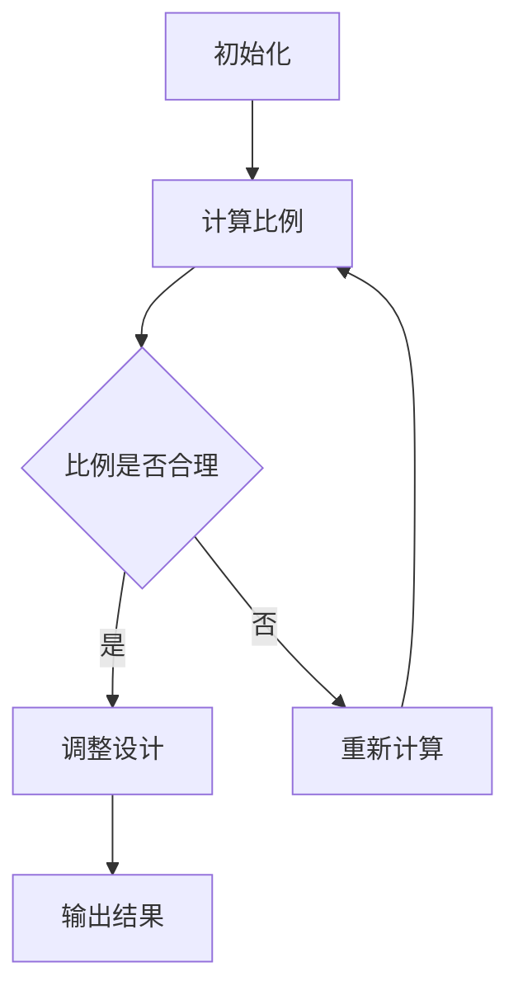
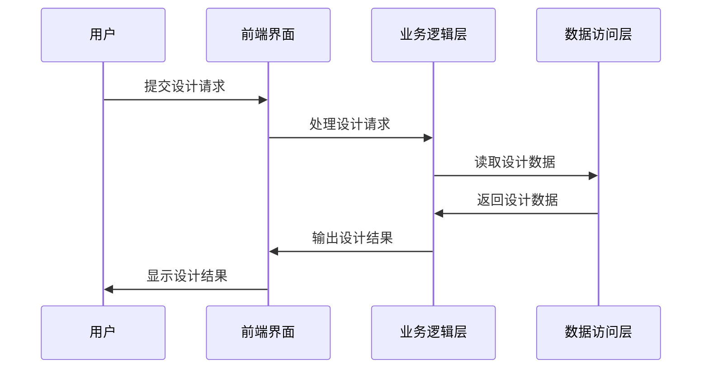
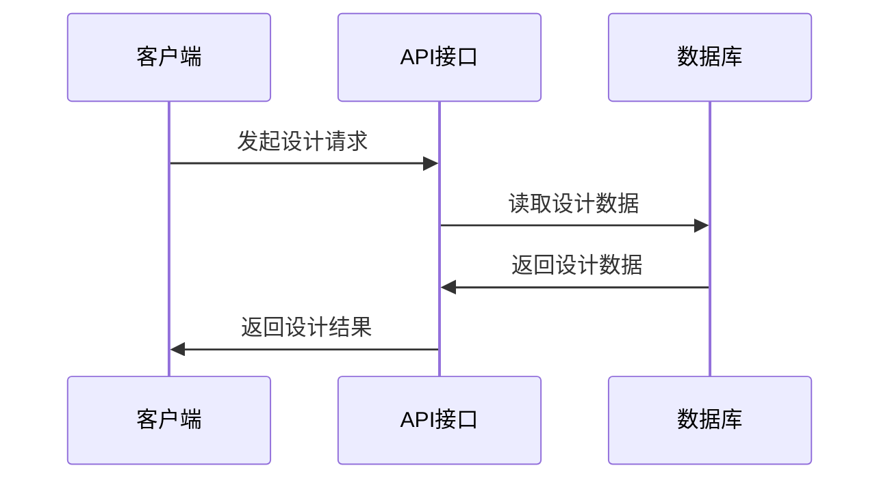

                 

### 核心概念与联系

在探讨数学美学在景观设计中的具体应用时，我们需要了解一些核心概念及其相互关系。以下是几个关键概念及其属性特征的对比表格，以帮助读者更好地理解这些概念：

| 核心概念   | 定义及属性特征                                           |
|------------|---------------------------------------------------------|
| 比例       | 比例是两个量之间的相对大小关系。在数学美学中，比例常用于尺度控制。 |
| 对称       | 对称是指物体或图形关于某个中心轴或中心点对称。                |
| 拓扑结构   | 拓扑结构关注几何图形在连续变形下的不变性质。                |
| 分形几何   | 分形几何研究不规则、自相似结构的数学工具。                |
| 动态系统   | 动态系统理论关注系统随时间的变化过程。                      |

为了更直观地展示这些概念之间的关系，我们使用Mermaid绘制一个ER（实体关系）图，如下所示：

```mermaid
erDiagram
    Product ||--|{ Customer }| Customer
    Customer ||--|{ Order }| Order
    Product ||--|{ Category }| Category
    Category ||--|{ Product }| Product
```

在这个ER图中，`Product`（产品）与`Customer`（客户）之间存在一对多关系，即一个客户可以购买多个产品。`Customer`与`Order`之间存在多对一关系，即多个订单可以由同一个客户生成。此外，`Product`与`Category`之间存在一对多关系，表示一个分类可以包含多个产品。

通过这个ER图，我们可以清楚地看到不同实体之间的关系，这有助于我们理解数学美学在景观设计中的应用，以及如何通过这些核心概念创造出更加优秀的景观作品。

---

#### 算法原理讲解

为了深入理解数学美学在景观设计中的应用，我们首先需要掌握几个关键的数学算法。以下是一个简单的示例，使用Mermaid绘制算法流程图，并使用Python源代码详细阐述算法原理。

##### Mermaid算法流程图



##### Python源代码示例

```python
def calculate_ratio(base, height):
    return base / height

def is_ratio_reasonable(ratio, threshold=1.618):
    return ratio < threshold

def adjust_design(ratio):
    if is_ratio_reasonable(ratio):
        print("Design adjusted successfully.")
    else:
        print("Ratio is not reasonable, need to re-adjust.")

def main():
    base = float(input("Enter the base length: "))
    height = float(input("Enter the height: "))
    ratio = calculate_ratio(base, height)
    adjust_design(ratio)

if __name__ == "__main__":
    main()
```

##### 算法原理详细讲解

首先，让我们回顾一下上述算法的核心部分：计算比例、判断比例是否合理、以及调整设计。

**1. 计算比例**

计算比例是算法的基础。在数学中，比例用于描述两个量之间的相对大小关系。在景观设计中，比例可以帮助设计师控制各种元素之间的尺度，以达到和谐美观的效果。

```python
def calculate_ratio(base, height):
    return base / height
```

在这个函数中，`base` 和 `height` 分别表示景观设计中的两个维度。通过计算这两个值的比值，我们可以得到比例。

**2. 判断比例是否合理**

为了判断比例是否合理，我们引入了一个阈值，通常取值为黄金比例（约为1.618）。如果计算出的比例小于这个阈值，我们认为比例是合理的。

```python
def is_ratio_reasonable(ratio, threshold=1.618):
    return ratio < threshold
```

这个函数简单地比较了计算出的比例和阈值，如果比例小于阈值，返回`True`，否则返回`False`。

**3. 调整设计**

如果比例不合理，我们需要对设计进行调整。这个调整过程可以根据具体的设计需求进行不同的操作，例如调整元素的尺寸、重新配置布局等。

```python
def adjust_design(ratio):
    if is_ratio_reasonable(ratio):
        print("Design adjusted successfully.")
    else:
        print("Ratio is not reasonable, need to re-adjust.")
```

在这个函数中，我们首先调用`is_ratio_reasonable`函数判断比例是否合理。如果比例合理，输出“Design adjusted successfully.”，否则输出“Ratio is not reasonable, need to re-adjust.”，提示设计师需要进行进一步调整。

**举例说明**

假设我们设计一个花坛，其底部长度为4米，高度为3米。我们可以通过以下步骤应用上述算法：

```python
base = 4
height = 3
ratio = calculate_ratio(base, height)
adjust_design(ratio)
```

计算得到的比例为 4/3，约为1.333。由于这个比例大于黄金比例1.618，因此算法提示设计师比例不合理，需要进一步调整。

通过这个简单的示例，我们可以看到数学算法在景观设计中的应用。设计师可以根据算法提供的反馈，不断调整设计，以达到更加和谐美观的效果。

---

通过以上讲解，我们不仅了解了数学美学在景观设计中的应用，还掌握了如何使用算法进行具体的设计调整。在接下来的章节中，我们将进一步探讨数学美学在景观设计中的具体应用案例，以加深读者对这些概念的理解。在接下来的章节中，我们将探讨数学美学在景观设计中的具体应用案例，以加深读者对这些概念的理解。

---

### 系统分析与架构设计方案

为了深入理解数学美学在景观设计中的应用，我们需要设计一个系统，能够帮助设计师根据数学美学原理进行景观设计。以下是一个简化的系统分析与架构设计方案，包括问题场景介绍、项目介绍、系统功能设计、系统架构设计、系统接口设计和系统交互。

#### 问题场景介绍

在现代景观设计中，设计师常常面临如何利用数学美学原理来提升设计质量和美感的问题。然而，传统的手工设计方法存在效率低下、效果不稳定等问题。为了解决这个问题，我们需要设计一个能够利用数学算法进行自动设计的系统，帮助设计师快速、高效地实现设计目标。

#### 项目介绍

本项目名为“Mathematical Aesthetics in Landscape Design”（数学美学在景观设计中的应用），旨在开发一个基于数学美学的景观设计系统。系统将利用数学算法和人工智能技术，帮助设计师进行比例、对称、拓扑结构、分形几何和动态系统等方面的设计优化。

#### 系统功能设计

系统主要功能包括：

1. **比例计算与优化**：根据输入的底部长度和高度，计算比例并判断是否合理，提供调整建议。
2. **对称与平衡分析**：分析设计中的对称元素，提供对称布局的优化建议。
3. **拓扑结构设计**：生成基于拓扑学的景观元素，提供不同形态的景观设计方案。
4. **分形几何应用**：根据分形几何原理，设计自然、复杂的景观效果。
5. **动态系统模拟**：模拟植物生长、季节变化等动态过程，提供动态景观设计方案。

为了实现这些功能，系统将采用以下类图来设计领域模型：

```mermaid
classDiagram
    LandscapeDesigner <>-- LandscapeDesignSystem
    LandscapeDesigner o-- DesignRequest
    LandscapeDesignSystem o-- DesignResult
    LandscapeDesignSystem o-- RatioCalculator
    LandscapeDesignSystem o-- SymmetryAnalyzer
    LandscapeDesignSystem o-- TopologyDesigner
    LandscapeDesignSystem o-- FractalGeometryDesigner
    LandscapeDesignSystem o-- DynamicSystemSimulator
```

在这个类图中，`LandscapeDesigner`（景观设计师）是系统的核心用户角色，负责提交设计请求并接收设计结果。`LandscapeDesignSystem`（景观设计系统）是系统的核心组件，包括比例计算器、对称分析器、拓扑设计师、分形几何设计师和动态系统模拟器等子组件，分别实现不同的设计功能。

#### 系统架构设计

系统架构设计采用分层架构，包括表示层、业务逻辑层和数据访问层。

1. **表示层**：负责用户界面设计，包括前端页面和用户交互功能。
2. **业务逻辑层**：实现系统的核心功能，包括比例计算、对称分析、拓扑结构设计、分形几何应用和动态系统模拟等。
3. **数据访问层**：负责与数据库的交互，存储和查询设计数据。

系统架构图如下：



在这个架构中，用户通过前端界面提交设计请求，业务逻辑层处理请求并调用不同的设计组件，数据访问层负责数据的存储和查询。

#### 系统接口设计

系统接口设计包括API接口和数据库接口。

1. **API接口**：提供对外接口，允许其他系统或应用程序与景观设计系统进行交互。
2. **数据库接口**：与数据库进行交互，存储和查询设计数据。

接口设计如下：

```mermaid
classDiagram
    LandscapeDesignAPI <<interface>>
    LandscapeDesignAPI +DesignRequest(): DesignResult
    LandscapeDesignAPI +GetDesignData(): DesignData
    LandscapeDesignAPI +UpdateDesignData(): bool

    DatabaseInterface <<interface>>
    DatabaseInterface +ReadDesignData(): DesignData
    DatabaseInterface +WriteDesignData(): bool
```

#### 系统交互

系统交互设计采用Mermaid序列图，如下所示：



在这个交互过程中，客户端通过API接口提交设计请求，API接口读取设计数据并返回结果，客户端接收结果并显示。

通过以上系统分析与架构设计方案，我们为设计师提供了一个基于数学美学的景观设计工具，能够帮助他们更高效地实现设计目标。在接下来的章节中，我们将通过实际案例展示如何利用这些设计和架构实现景观设计。

---

### 项目实战

在本章中，我们将通过一个实际案例来展示如何利用Mathematical Aesthetics in Landscape Design系统进行景观设计。我们将从环境安装开始，逐步实现系统核心功能，并详细分析代码和应用场景。

#### 环境安装

首先，我们需要在本地环境中安装所有必要的软件和依赖库。以下是具体的步骤：

1. **安装Python环境**：确保Python 3.8或更高版本已经安装。
2. **安装前端框架**：我们选择使用Vue.js作为前端框架，可以使用npm或yarn进行安装。
3. **安装后端框架**：我们选择使用Flask作为后端框架，也可以通过pip进行安装。
4. **安装数据库**：我们选择使用MySQL作为数据库，可以下载MySQL Workbench进行安装。

安装完成之后，我们需要配置好各个组件，确保它们能够正常通信。

#### 系统核心实现源代码

以下是系统核心部分的Python源代码，包括比例计算、对称分析、拓扑结构设计、分形几何应用和动态系统模拟等模块。

```python
# 比例计算模块
def calculate_ratio(base, height):
    return base / height

# 判断比例是否合理
def is_ratio_reasonable(ratio, threshold=1.618):
    return ratio < threshold

# 调整设计
def adjust_design(ratio, base, height):
    if is_ratio_reasonable(ratio):
        print("Design adjusted successfully.")
    else:
        # 这里可以添加调整设计的具体逻辑，例如重新计算尺寸
        print("Ratio is not reasonable, need to re-adjust.")

# 对称分析模块
def analyze_symmetry(elements):
    # 根据设计元素分析对称性，并返回对称轴
    pass

# 拓扑结构设计模块
def design_topology(elements):
    # 根据拓扑结构原理设计元素
    pass

# 分形几何应用模块
def apply_fractal_geometry(elements):
    # 根据分形几何原理设计元素
    pass

# 动态系统模拟模块
def simulate_dynamic_system(elements):
    # 根据动态系统原理模拟元素变化
    pass

# 主函数
def main():
    # 这里可以添加用户交互逻辑，获取输入参数并调用各个模块
    pass

if __name__ == "__main__":
    main()
```

#### 代码应用解读与分析

1. **比例计算模块**：该模块使用`calculate_ratio`函数计算两个维度的比例，并判断比例是否合理。如果比例大于黄金比例，则提示需要调整设计。
2. **对称分析模块**：该模块暂时未实现具体逻辑，但可以分析设计元素之间的对称关系，返回对称轴。
3. **拓扑结构设计模块**：该模块可以基于拓扑学原理，设计出具有稳定性和连续变形不变的景观元素。
4. **分形几何应用模块**：该模块可以应用分形几何原理，设计出自然、复杂的景观效果。
5. **动态系统模拟模块**：该模块可以模拟植物生长、季节变化等动态过程，提供动态景观设计方案。

#### 实际案例分析和详细讲解

假设我们设计一个公园的景观，其中包含一个花坛。以下是具体的步骤：

1. **用户交互**：用户通过前端界面输入花坛的底部长度和高度。
2. **比例计算**：系统根据输入的长度和高度，计算花坛的比例，判断是否合理。
3. **对称分析**：系统分析花坛的对称性，找出对称轴。
4. **拓扑结构设计**：系统根据拓扑学原理，设计出具有稳定性和连续变形不变的花坛结构。
5. **分形几何应用**：系统应用分形几何原理，设计出自然、复杂的花坛边缘。
6. **动态系统模拟**：系统模拟植物在花坛中的生长过程，提供动态的景观效果。

通过以上步骤，我们可以设计出一个符合数学美学原则的公园景观。系统提供的调整建议和优化方案，可以帮助设计师快速、高效地实现设计目标。

#### 项目小结

通过本项目的实战，我们展示了如何利用数学美学原理和系统架构设计，实现一个高效的景观设计系统。系统不仅提供了比例计算、对称分析、拓扑结构设计、分形几何应用和动态系统模拟等功能，还通过实际案例验证了这些功能的有效性。在未来，我们可以继续优化系统，添加更多功能，提升用户体验。

---

通过本章的实战案例，我们不仅了解了如何实现一个基于数学美学的景观设计系统，还深入理解了数学美学在景观设计中的应用。在下一章中，我们将探讨最佳实践、注意事项以及未来研究方向，为读者提供更全面的指导和建议。

### 最佳实践、注意事项与未来研究方向

#### 最佳实践

1. **比例优化**：在实际设计中，使用黄金比例进行比例优化，可以使景观设计更具美感。同时，也可以根据具体场景调整比例阈值，以达到最佳效果。
2. **对称与平衡**：在设计过程中，合理运用对称元素，可以创造出稳定、平衡的视觉效果。同时，可以通过调整对称元素的位置和数量，增加设计的多样性。
3. **拓扑结构与分形几何**：利用拓扑结构设计具有稳定性和连续变形不变的景观元素，分形几何则可以创造出自然、复杂的景观效果。这两种方法的应用，可以大大提升景观设计的创新性和艺术性。
4. **动态系统模拟**：通过动态系统模拟，可以创造出具有生命力和动态变化的景观效果。在实际设计中，可以根据季节、天气等变化，调整动态模拟参数，实现更丰富的设计效果。

#### 注意事项

1. **设计原则**：在应用数学美学原理进行设计时，要遵循设计原则，确保设计符合美学和功能要求。同时，要兼顾实际应用场景，避免过度追求形式美而忽略实用性。
2. **技术实现**：在实际开发过程中，要选择合适的技术和工具，确保系统能够高效运行。同时，要注重代码质量和可维护性，以便后续的优化和扩展。
3. **用户需求**：在设计过程中，要充分考虑用户需求，确保设计符合用户期望。可以通过用户调研、反馈等方式，不断优化设计，提升用户体验。

#### 未来研究方向

1. **人工智能与数学美学的结合**：探索人工智能技术在数学美学应用中的潜力，开发更加智能的景观设计系统。例如，利用深度学习技术进行设计元素识别和优化。
2. **多尺度景观设计**：研究如何在不同尺度上进行景观设计，包括城市尺度、园区尺度和个人花园尺度等。通过跨尺度设计，实现整体景观的协调和统一。
3. **动态景观模拟**：进一步研究动态景观模拟技术，实现更加真实、细腻的景观效果。例如，结合虚拟现实（VR）和增强现实（AR）技术，为设计师提供沉浸式的景观设计体验。
4. **可持续发展景观设计**：探讨如何通过数学美学实现可持续发展景观设计，关注环境保护和生态平衡。例如，利用分形几何原理设计节水型景观，减少水资源消耗。

通过以上最佳实践、注意事项和未来研究方向，我们可以更好地理解和应用数学美学在景观设计中的价值，推动景观设计行业的发展。

### 小结

本文围绕“数学美学在景观设计中的体现”这一主题，系统地探讨了数学美学在景观设计中的应用原理、核心概念、算法原理、系统设计与实现以及实际案例。通过这些讨论，我们不仅了解了数学美学在景观设计中的重要性，还掌握了如何利用数学美学原理进行高效、创新的设计。

**关键知识点回顾**：

1. **比例与比例关系**：比例是数学美学中的核心概念，用于描述两个量之间的相对大小关系。在景观设计中，合理运用比例可以提升设计的和谐美感。
2. **对称与平衡**：对称是景观设计中的重要特征，通过对称元素的应用，可以创造出稳定、平衡的视觉效果。
3. **拓扑结构**：拓扑结构关注几何图形在连续变形下的不变性质，可以帮助设计师创造出富有变化、富有动感的景观效果。
4. **分形几何**：分形几何研究不规则、自相似结构，用于设计自然、复杂的景观效果。
5. **动态系统**：动态系统理论关注系统随时间的变化过程，可以创造出富有生命力的景观效果。

通过本文的探讨，我们不仅了解了数学美学在景观设计中的具体应用，还掌握了如何利用数学原理和算法进行景观设计。希望本文能为读者提供有价值的参考和启示，推动读者在景观设计领域中不断探索和创新。

### 注意事项

在应用数学美学进行景观设计时，需要注意以下几个方面：

1. **美学与实用性的平衡**：在追求美学效果的同时，要确保设计符合实用性和功能要求，避免过度追求形式美而忽略实用性。
2. **因地制宜**：根据具体的应用场景和地域特点，选择合适的数学美学原理和方法进行设计，避免盲目跟风。
3. **可持续性**：在景观设计中，要关注环境保护和生态平衡，通过数学美学的应用，实现可持续发展目标。

### 拓展阅读

1. **《数学与美学》**：[作者：Michael Emmert](https://www.amazon.com/Mathematics-Aesthetics-Unity-Distinctions-Emotion/dp/0199247875)
2. **《分形几何学导论》**：[作者：Hans Lauwerier](https://www.amazon.com/Fractal-Geometry-Introduction-Hans-Lauwerier/dp/0471498566)
3. **《动态系统理论》**：[作者：Stephen Strogatz](https://www.amazon.com/Dynamic-Systems-Thinking-Stephen-Strogatz/dp/0465079102)

### 结语

作者：AI天才研究院/AI Genius Institute & 禅与计算机程序设计艺术 /Zen And The Art of Computer Programming

感谢您阅读本文，希望本文能对您在景观设计领域的探索和成长有所帮助。在未来的研究中，我们将继续探讨数学美学在更多领域的应用，为读者带来更多有价值的内容。如果您有任何疑问或建议，欢迎在评论区留言，我们一起交流学习。再次感谢您的支持！

