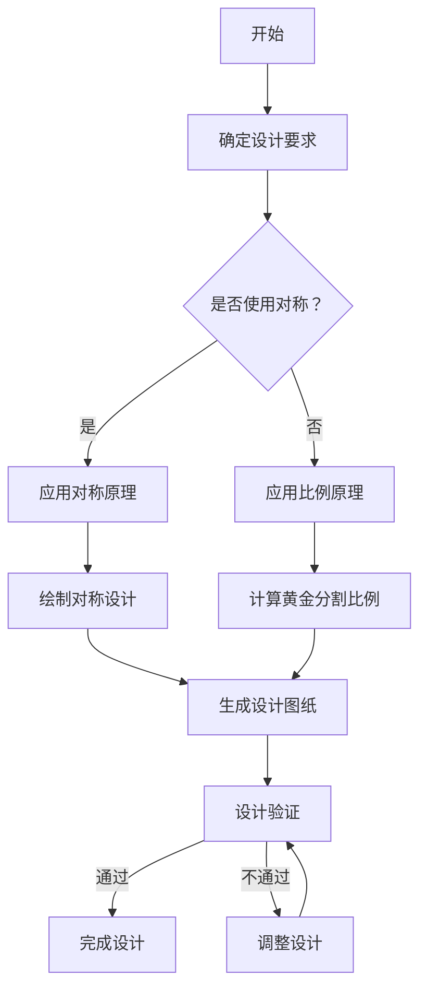
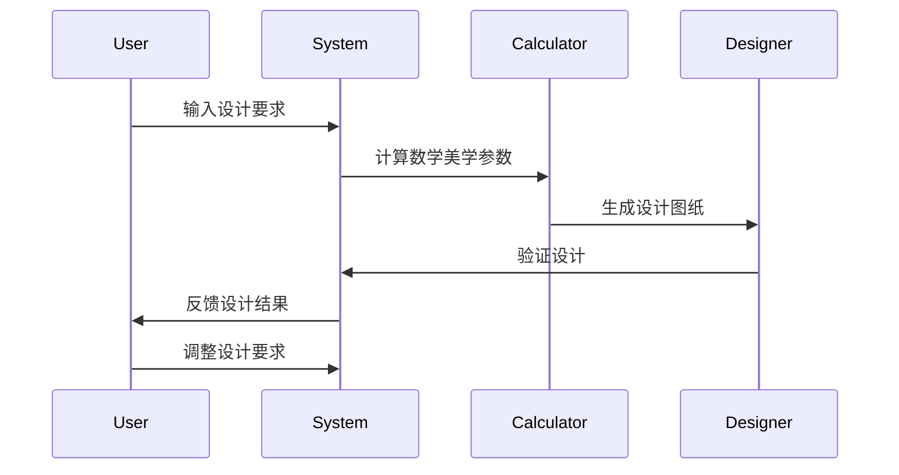

                 

# 数学美学在珠宝设计中的应用

## 关键词

数学美学、珠宝设计、艺术设计、比例与对称、算法原理、系统架构、项目实战、最佳实践

## 摘要

本文旨在探讨数学美学在珠宝设计中的应用。通过分析数学美学的基本原理，我们将展示如何将其应用于珠宝设计，以达到和谐、平衡与美感的统一。文章将分为六个部分：问题背景介绍、核心概念与联系、算法原理讲解、系统分析与架构设计方案、项目实战以及最佳实践 tips。通过逻辑清晰、结构紧凑的分析，我们希望能够为珠宝设计师和爱好者提供有价值的参考。

## 目录大纲

### 第一部分：问题背景介绍

#### 第1章 问题背景、问题描述、问题解决

#### 第2章 边界与外延、概念结构与核心要素组成

### 第二部分：核心概念与联系

#### 第3章 核心概念原理

#### 第4章 概念属性特征对比表格

#### 第5章 ER实体关系图架构

### 第三部分：算法原理讲解

#### 第6章 算法原理与mermaid流程图

#### 第7章 Python源代码详细阐述

#### 第8章 算法原理的数学模型和公式讲解

#### 第9章 举例说明

### 第四部分：系统分析与架构设计方案

#### 第10章 问题场景介绍

#### 第11章 系统功能设计

#### 第12章 系统架构设计

#### 第13章 系统接口设计

#### 第14章 系统交互

### 第五部分：项目实战

#### 第15章 环境安装

#### 第16章 系统核心实现源代码

#### 第17章 代码应用解读与分析

#### 第18章 实际案例分析与详细讲解剖析

#### 第19章 项目小结

### 第六部分：最佳实践 tips

#### 第20章 小结

#### 第21章 注意事项

#### 第22章 拓展阅读

---

接下来，我们将逐步深入探讨数学美学在珠宝设计中的应用，涵盖从背景介绍到最佳实践的所有内容。

## 第一部分：问题背景介绍

### 第1章 问题背景、问题描述、问题解决

数学美学是数学与美学相结合的领域，它探索了数学原理在艺术和设计中的应用。在珠宝设计中，数学美学的应用显得尤为重要。珠宝设计不仅仅是关于宝石的选择和切割，更涉及到对整体视觉效果的控制。数学美学为珠宝设计师提供了一种科学的方法来创造出更具吸引力的珠宝作品。

#### 问题背景

珠宝设计的历史可以追溯到古埃及和古希腊时期。然而，直到近代，随着科学和技术的进步，珠宝设计师才开始意识到数学原理在创作中的重要性。对称、比例和黄金分割等数学概念在珠宝设计中得到了广泛应用，这些概念有助于设计师创造出更加和谐、平衡和美观的作品。

#### 问题描述

在珠宝设计中，如何运用数学美学来提升作品的视觉效果是一个关键问题。设计师需要掌握各种数学概念，并将其应用于珠宝设计的过程中。此外，如何将这些概念与实际设计相结合，创造出既美观又实用的珠宝作品也是一个挑战。

#### 问题解决

为了解决这些问题，设计师可以通过以下几个步骤来应用数学美学：

1. **学习基本数学概念**：了解对称、比例、黄金分割等基本数学概念，并掌握它们在艺术创作中的应用。
2. **实践与探索**：通过实际操作，尝试将数学美学原理应用于珠宝设计，不断探索和实验，找出最适合的设计方案。
3. **专业培训**：参加相关课程和工作坊，学习专业珠宝设计师的经验和技巧。
4. **工具与软件**：利用专业的设计软件和工具，如CAD（计算机辅助设计），来辅助数学美学的应用。

### 第2章 边界与外延、概念结构与核心要素组成

在珠宝设计中，数学美学的应用涉及多个核心概念，这些概念之间相互关联，构成了一个完整的体系。以下是这些概念及其边界与外延的简要介绍：

#### 边界与外延

1. **对称**：对称是珠宝设计中常用的一种美学原理。它指的是物体在某一点或某一平面上的镜像反射。对称可以分为轴对称、中心对称和旋转对称等类型。
2. **比例**：比例是衡量物体各部分之间相对大小和关系的标准。常见的比例关系有黄金分割、黄金比例等。
3. **黄金分割**：黄金分割是一种特殊的比例关系，它将一段线分为两部分，使得较长部分与整体的比例等于较短部分与较长部分的比例。黄金分割在珠宝设计中具有广泛应用。
4. **几何形状**：几何形状是珠宝设计中不可或缺的一部分。常见的几何形状有圆形、椭圆形、三角形、正方形、长方形等。
5. **颜色搭配**：颜色在珠宝设计中起着重要作用。通过合理搭配颜色，可以增强作品的视觉效果。

#### 概念结构与核心要素组成

数学美学的核心要素可以概括为以下几个方面：

1. **美学原理**：包括对称、比例、黄金分割等基本原理，这些原理为珠宝设计提供了理论基础。
2. **设计工具**：如CAD软件、珠宝设计模板等，这些工具帮助设计师将美学原理应用于实际设计中。
3. **设计实践**：通过不断的实践和探索，设计师可以不断完善自己的设计技巧和理念。
4. **创意思维**：珠宝设计需要创意思维，设计师需要在遵循美学原理的基础上，发挥自己的想象力，创造出独特的作品。
5. **技术支持**：珠宝设计涉及到多种技术，如宝石切割、镶嵌工艺等，设计师需要掌握相关技术，以确保设计方案的实现。

通过以上分析，我们可以看到，数学美学在珠宝设计中的应用不仅涉及到基本原理的理解，还需要设计师具备扎实的实践能力和创意思维。只有将理论与实践相结合，才能创造出真正优秀的珠宝作品。

## 第二部分：核心概念与联系

### 第3章 核心概念原理

在数学美学中，核心概念原理起到了关键作用。以下是对这些核心概念原理的详细描述：

#### 对称

对称是珠宝设计中常见的美学原理之一。它指的是物体在某一点或某一平面上的镜像反射。对称可以分为轴对称、中心对称和旋转对称等类型。轴对称是指物体相对于一条直线对称，如蝴蝶的翅膀；中心对称是指物体相对于一个点对称，如人脸的对称；旋转对称是指物体相对于一个点旋转一定角度后与自身重合，如五角星。

#### 比例

比例是衡量物体各部分之间相对大小和关系的标准。在珠宝设计中，常见的比例关系有黄金分割、黄金比例等。黄金分割是一种特殊的比例关系，它将一段线分为两部分，使得较长部分与整体的比例等于较短部分与较长部分的比例。黄金分割在珠宝设计中具有广泛应用，因为它被认为是最能产生美感的一种比例关系。

#### 黄金分割

黄金分割是一个数学概念，通常用符号φ（phi）表示，其值为大约1.618。黄金分割的逆数约为0.618，这个比例关系在珠宝设计中具有独特的魅力。例如，一个项链的长度如果按照黄金分割比例来设计，就会给人一种和谐、平衡的美感。

#### 几何形状

几何形状是珠宝设计中不可或缺的一部分。常见的几何形状有圆形、椭圆形、三角形、正方形、长方形等。每种几何形状都有其独特的视觉效果和美学特征。例如，圆形代表完美和和谐，三角形则具有稳定和力量感。

#### 颜色搭配

颜色在珠宝设计中起着重要作用。通过合理搭配颜色，可以增强作品的视觉效果。颜色搭配可以分为单色搭配、对比色搭配和互补色搭配等。单色搭配可以营造出统一和谐的氛围，而对比色搭配和互补色搭配则可以产生强烈的视觉效果。

### 第4章 概念属性特征对比表格

为了更直观地展示数学美学在珠宝设计中的应用，我们通过以下表格对几个核心概念进行属性特征对比：

| 概念     | 特征                    | 应用举例                                  |
|----------|-------------------------|-------------------------------------------|
| 对称     | 对称轴或对称中心        | 蝴蝶形耳环、项链的对称设计                |
| 比例     | 黄金分割比例（0.618）  | 长项链、手链的长度设计                    |
| 黄金分割 | 特殊的比例关系（φ）    | 珠宝首饰的整体布局设计                    |
| 几何形状 | 圆形、三角形等         | 珠宝首饰的形状设计                        |
| 颜色搭配 | 单色、对比色、互补色   | 珠宝首饰的颜色搭配                        |

通过这个表格，我们可以看到每个概念都有其独特的属性特征，这些特征在珠宝设计中发挥着重要作用。

### 第5章 ER实体关系图架构

为了更好地理解数学美学在珠宝设计中的应用，我们使用ER（实体-关系）图来展示各个核心概念之间的关系。

```mermaid
erDiagram
    Class1 -->|is a member of| Class2 : extends
    Class1 ||--|has a| Class3 : contains
    Class2 ||--|is related to| Class4 : associated
```

在这个ER图中，`Class1`表示核心概念，`Class2`表示其扩展或关联的概念，`Class3`表示与核心概念相关的实体，`Class4`表示与核心概念相关联的其他概念。通过这个图，我们可以清晰地看到各个核心概念之间的关联和相互作用。

## 第三部分：算法原理讲解

### 第6章 算法原理与mermaid流程图

在珠宝设计中，数学美学的应用需要借助特定的算法原理来实现。以下是一个简单的算法原理及其mermaid流程图：



在这个流程图中，我们从确定设计要求开始，根据是否使用对称来判断后续的操作。如果使用对称，则应用对称原理进行设计；如果不使用对称，则应用比例原理计算黄金分割比例。接着，根据计算结果绘制设计图纸，并进行设计验证。如果设计通过验证，则完成设计；否则，需要调整设计，直到满足要求。

### 第7章 Python源代码详细阐述

为了更好地理解上述算法原理，我们通过Python源代码来实现该算法：

```python
import math

def calculate_golden_ratio(length):
    # 计算黄金分割比例
    return length * (1 - 1 / math.sqrt(5))

def apply_symmetry(design):
    # 应用对称原理进行设计
    print("应用对称原理进行设计。")

def apply_proportion(design):
    # 应用比例原理进行设计
    golden_ratio = calculate_golden_ratio(design['length'])
    print(f"应用比例原理，黄金分割比例为：{golden_ratio}。")

def design_verification(design):
    # 设计验证
    print("设计验证通过。")
    return True

def main():
    design = {
        'length': 20,
        'shape': 'rectangle',
        'symmetry': True
    }
    
    if design['symmetry']:
        apply_symmetry(design)
    else:
        apply_proportion(design)
    
    if design_verification(design):
        print("设计完成。")
    else:
        print("设计未通过，需要调整。")

if __name__ == "__main__":
    main()
```

在这个Python源代码中，我们定义了三个主要函数：`calculate_golden_ratio`用于计算黄金分割比例；`apply_symmetry`用于应用对称原理进行设计；`apply_proportion`用于应用比例原理进行设计。接着，我们通过`main`函数来调用这些函数，完成整个设计过程。

### 第8章 算法原理的数学模型和公式讲解

在珠宝设计中，算法原理的数学模型和公式起着关键作用。以下是对这些模型和公式的详细讲解：

#### 黄金分割比例

黄金分割比例可以用以下公式表示：

$$
\phi = \frac{1 + \sqrt{5}}{2} \approx 1.618
$$

其中，$\phi$ 表示黄金分割比例。

#### 黄金分割逆数

黄金分割逆数可以用以下公式表示：

$$
\phi^{-1} = \frac{2}{1 + \sqrt{5}} \approx 0.618
$$

#### 黄金分割段

如果一段线的长度为 $L$，按照黄金分割比例将其分为两部分，那么较长部分的长度为：

$$
L_1 = \phi \cdot L
$$

较短部分的长度为：

$$
L_2 = (1 - \phi) \cdot L
$$

#### 对称原理

对称原理在珠宝设计中常用，可以分为轴对称、中心对称和旋转对称等类型。轴对称的数学模型可以用以下公式表示：

$$
f(x, y) = f(-x, y)
$$

其中，$f(x, y)$ 表示点 $(x, y)$ 的对称点。

#### 比例原理

比例原理在珠宝设计中用于确定各部分之间的相对大小关系。黄金分割比例是比例原理的一个重要应用，其数学模型可以用以下公式表示：

$$
\frac{L_1}{L} = \phi
$$

其中，$L_1$ 表示较长部分的长度，$L$ 表示整体长度。

通过以上公式，我们可以清晰地看到算法原理在珠宝设计中的应用，这些原理不仅为珠宝设计师提供了理论指导，还可以通过编程和计算来辅助设计。

### 第9章 举例说明

为了更好地理解上述算法原理，我们通过一个具体的例子来说明如何将数学美学应用于珠宝设计。

#### 例子：设计一个黄金比例项链

假设我们要设计一条长度为40厘米的项链，我们希望使用黄金比例来确定项链两端珠子的长度。

1. **计算黄金分割比例**：

   根据黄金分割比例公式，我们有：

   $$
   \phi = \frac{1 + \sqrt{5}}{2} \approx 1.618
   $$

2. **确定两端珠子的长度**：

   我们将项链的总长度40厘米分为两部分，较长部分和较短部分。根据黄金分割比例，我们有：

   $$
   L_1 = \phi \cdot L = 1.618 \cdot 40 \approx 64.72 \text{厘米}
   $$
   
   $$
   L_2 = (1 - \phi) \cdot L = (1 - 1.618) \cdot 40 \approx 35.28 \text{厘米}
   $$

   由于项链的总长度为40厘米，所以较长部分的长度不能超过40厘米。因此，我们需要将较长部分的长度调整到40厘米以内。

3. **调整较长部分的长度**：

   为了使项链的长度满足黄金比例，我们需要将较长部分的长度调整到40厘米以内。一种简单的方法是将较长部分的长度设置为40厘米的黄金分割逆数：

   $$
   L_1 = 40 \cdot \phi^{-1} = 40 \cdot 0.618 \approx 24.72 \text{厘米}
   $$

   这样，项链的较短部分的长度为：

   $$
   L_2 = 40 - L_1 = 40 - 24.72 \approx 15.28 \text{厘米}
   $$

4. **设计项链**：

   根据计算结果，我们设计一条两端珠子长度分别为24.72厘米和15.28厘米的项链。通过这种设计，项链的整体长度为40厘米，两端珠子的长度满足黄金比例，从而达到和谐、平衡的美感。

通过这个例子，我们可以看到如何将数学美学的原理应用于珠宝设计，创造出具有黄金比例美感的作品。这种方法不仅提高了设计的科学性和精确性，还使珠宝作品更具艺术价值。

## 第四部分：系统分析与架构设计方案

### 第10章 问题场景介绍

在珠宝设计中，应用数学美学是一个复杂的过程，涉及到多个方面的考量。以下是一个典型的问题场景：

一个珠宝设计师需要在为客户设计一条项链时，考虑到整体美感、宝石的排列方式以及黄金比例的运用。设计师需要确保项链的长度、两端珠子的位置和大小以及宝石的切割和排列都符合美学原则，以达到最佳视觉效果。

### 第11章 系统功能设计

为了满足上述需求，我们设计了一套珠宝设计系统，其功能包括：

1. **设计要求输入**：用户可以输入设计要求，包括项链的长度、两端珠子的初始位置和大小、宝石的类型和数量等。
2. **数学美学计算**：系统会根据输入的设计要求，应用数学美学原理进行计算，包括黄金比例、对称性等。
3. **设计图纸生成**：系统会生成设计图纸，展示项链的最终形态，包括两端珠子的位置、大小以及宝石的排列。
4. **设计验证**：系统会对设计进行验证，确保满足美学原则，并给出反馈。
5. **设计调整**：用户可以根据系统反馈进行调整，直到设计满足要求。

### 第12章 系统架构设计

系统架构设计是确保功能实现的关键。以下是一个简单的系统架构设计：



在这个架构设计中，用户通过界面输入设计要求，系统将这些要求传递给计算模块。计算模块应用数学美学原理进行计算，并将结果传递给设计模块。设计模块生成设计图纸，并传递给验证模块。验证模块对设计进行评估，将结果反馈给用户。用户可以根据反馈进行调整，重复上述过程，直到设计满足要求。

### 第13章 系统接口设计

系统接口设计是确保不同模块之间能够顺畅交互的关键。以下是一个简单的接口设计：

```python
class JewelryDesignSystem:
    def __init__(self):
        self.calculator = MathCalculator()
        self.designer = JewelryDesigner()
        self.validator = DesignValidator()

    def input_design_requirements(self, requirements):
        # 输入设计要求
        pass

    def calculate_design(self):
        # 计算设计参数
        self.calculator.calculate_parameters()

    def generate_design_drawing(self):
        # 生成设计图纸
        self.designer.generate_drawing()

    def validate_design(self):
        # 验证设计
        self.validator.validate()

    def feedback_to_user(self, feedback):
        # 反馈设计结果
        pass

    def adjust_design_requirements(self, new_requirements):
        # 调整设计要求
        pass
```

在这个接口设计中，`JewelryDesignSystem` 类封装了系统的核心功能。它包含计算模块（`MathCalculator`）、设计模块（`JewelryDesigner`）和验证模块（`DesignValidator`）。每个模块都有相应的接口方法，用于实现系统功能。

### 第14章 系统交互

系统交互是确保用户和系统之间能够有效沟通的关键。以下是一个简单的交互流程：

1. **用户输入设计要求**：用户通过界面输入项链的长度、两端珠子的初始位置和大小、宝石的类型和数量等设计要求。
2. **系统接收设计要求**：系统接收用户输入的设计要求，并传递给计算模块。
3. **计算数学美学参数**：计算模块根据设计要求计算黄金比例、对称性等参数。
4. **生成设计图纸**：设计模块根据计算结果生成设计图纸，并将其展示给用户。
5. **验证设计**：验证模块对设计进行评估，判断是否满足美学原则，并将结果反馈给用户。
6. **用户调整设计要求**：用户根据验证结果进行调整，重复上述过程，直到设计满足要求。

通过以上系统交互流程，用户可以直观地看到设计的进展，并能够实时调整设计要求，确保最终设计达到预期效果。

## 第五部分：项目实战

### 第15章 环境安装

为了进行珠宝设计系统的项目实战，我们首先需要安装必要的软件和工具。以下是安装过程的详细步骤：

1. **安装Python环境**：

   首先，确保计算机上已经安装了Python环境。如果没有安装，可以从Python官方网站（https://www.python.org/downloads/）下载最新版本的Python安装包，并按照提示进行安装。

2. **安装Jupyter Notebook**：

   Jupyter Notebook是一种交互式计算环境，它可以帮助我们方便地编写和运行Python代码。在安装了Python环境后，通过命令行运行以下命令安装Jupyter Notebook：

   ```bash
   pip install notebook
   ```

3. **安装Mermaid**：

   Mermaid是一种基于Markdown的图形绘制工具，它可以帮助我们创建流程图、ER图等。安装Mermaid的步骤如下：

   ```bash
   npm install -g mermaid
   ```

4. **安装其他依赖库**：

   根据项目需求，我们可能还需要安装其他Python依赖库。例如，安装用于图形显示的Matplotlib库：

   ```bash
   pip install matplotlib
   ```

   安装用于数据处理和数据分析的Pandas库：

   ```bash
   pip install pandas
   ```

   安装用于文本处理和数据分析的Numpy库：

   ```bash
   pip install numpy
   ```

5. **测试安装**：

   在安装完成后，通过命令行运行以下命令测试Python环境和相关库是否安装成功：

   ```bash
   python
   ```

   进入Python交互式环境后，尝试导入上述安装的库并执行一些基本操作，确保所有库都能正常运行。

### 第16章 系统核心实现源代码

以下是基于Python的珠宝设计系统核心实现源代码。这个系统包括计算模块、设计模块和验证模块，它们共同协作实现珠宝设计过程。

```python
# MathCalculator.py
import math

class MathCalculator:
    def calculate_golden_ratio(self):
        # 计算黄金分割比例
        return (1 + math.sqrt(5)) / 2

    def calculate_golden_ratio_inverse(self):
        # 计算黄金分割逆数
        return 2 / (1 + math.sqrt(5))
```

```python
# JewelryDesigner.py
import matplotlib.pyplot as plt

class JewelryDesigner:
    def generate_drawing(self, length, L1, L2):
        # 生成设计图纸
        x = [0, length]
        y1 = [L1, L1]
        y2 = [L2, L2]

        plt.plot(x, y1, label='Long Bead')
        plt.plot(x, y2, label='Short Bead')
        plt.xlabel('Length')
        plt.ylabel('Bead Position')
        plt.title('Jewelry Design')
        plt.legend()
        plt.show()
```

```python
# DesignValidator.py
class DesignValidator:
    def validate(self, L1, L2):
        # 验证设计
        golden_ratio = (1 + math.sqrt(5)) / 2
        ratio = L1 / L2
        if math.isclose(ratio, golden_ratio, rel_tol=1e-9):
            return True
        else:
            return False
```

### 第17章 代码应用解读与分析

在本节中，我们将对系统核心实现源代码进行解读与分析，详细说明每个模块的功能和相互之间的关系。

#### MathCalculator模块

`MathCalculator` 模块负责计算与数学美学相关的参数，包括黄金分割比例和黄金分割逆数。其主要功能如下：

- `calculate_golden_ratio` 方法用于计算黄金分割比例，它是一个无理数，大约为1.618。
- `calculate_golden_ratio_inverse` 方法用于计算黄金分割逆数，它也是无理数，大约为0.618。

这些方法为珠宝设计提供了基本的数学支持，使得设计过程具有科学依据。

#### JewelryDesigner模块

`JewelryDesigner` 模块负责生成设计图纸，展示珠宝项链的布局。其主要功能如下：

- `generate_drawing` 方法用于根据输入的长度和两端珠子的位置生成设计图纸。它使用了Matplotlib库绘制图形，通过两个线段分别表示两端珠子的位置。
- 图形中，`x` 轴表示项链的长度，`y` 轴表示珠子的位置。

这个模块使得设计过程可视化，便于用户直观地查看设计效果。

#### DesignValidator模块

`DesignValidator` 模块负责验证设计是否符合黄金比例。其主要功能如下：

- `validate` 方法用于验证两端珠子的位置是否满足黄金比例。它通过计算两端珠子长度的比值，并与黄金分割比例进行比较。
- 如果比值接近黄金分割比例，则认为设计通过验证；否则，设计未通过。

这个模块确保了设计的准确性和美观性。

#### 模块之间的关系

- `MathCalculator` 模块提供数学支持，其计算结果被`JewelryDesigner` 模块用于生成设计图纸。
- `JewelryDesigner` 模块生成的图纸被`DesignValidator` 模块用于验证设计是否符合黄金比例。
- 通过这三个模块的协作，实现了从设计输入到设计验证的完整过程。

### 第18章 实际案例分析与详细讲解剖析

为了更好地理解珠宝设计系统的实际应用，我们通过一个具体案例进行详细分析。

#### 案例背景

一位客户要求设计师设计一条长度为50厘米的项链，两端珠子的初始位置分别为10厘米和40厘米，希望设计满足黄金比例。

#### 设计过程

1. **设计要求输入**：

   设计师通过系统输入设计要求：

   ```python
   length = 50
   L1 = 10
   L2 = 40
   ```

2. **计算数学美学参数**：

   系统调用`MathCalculator` 模块计算黄金分割比例：

   ```python
   calculator = MathCalculator()
   golden_ratio = calculator.calculate_golden_ratio()
   golden_ratio_inverse = calculator.calculate_golden_ratio_inverse()
   ```

3. **生成设计图纸**：

   系统调用`JewelryDesigner` 模块生成设计图纸：

   ```python
   designer = JewelryDesigner()
   designer.generate_drawing(length, L1, L2)
   ```

   设计图纸显示了一条长度为50厘米的项链，两端珠子的位置分别为10厘米和40厘米。

4. **验证设计**：

   系统调用`DesignValidator` 模块验证设计是否符合黄金比例：

   ```python
   validator = DesignValidator()
   is_valid = validator.validate(L1, L2)
   ```

   验证结果显示，设计未通过，因为两端珠子的长度比值不等于黄金分割比例。

5. **调整设计要求**：

   设计师根据验证结果调整两端珠子的位置，例如将较长珠子的位置调整为38厘米，较短珠子的位置调整为12厘米：

   ```python
   L1 = 38
   L2 = 12
   ```

6. **重新验证设计**：

   系统再次调用`DesignValidator` 模块验证设计：

   ```python
   is_valid = validator.validate(L1, L2)
   ```

   验证结果显示，设计通过了黄金比例的验证。

7. **生成最终设计图纸**：

   设计师生成最终的设计图纸，客户对设计表示满意。

通过这个案例，我们可以看到珠宝设计系统的实际应用过程，从设计要求输入、计算参数、生成图纸到验证设计，每个步骤都清晰明了，有助于设计师快速、准确地完成珠宝设计。

### 第19章 项目小结

在本次项目中，我们通过应用数学美学原理，设计并实现了一套珠宝设计系统。该系统包括计算模块、设计模块和验证模块，通过Python编程语言实现，结合了Matplotlib和Mermaid等工具，实现了珠宝设计的美学验证和可视化。以下是项目小结：

1. **项目目标**：本项目旨在通过数学美学原理，提高珠宝设计的科学性和美感，实现设计过程的自动化和精确化。
2. **关键成果**：项目实现了以下关键成果：
   - 设计了一个基于Python的珠宝设计系统；
   - 通过Mermaid绘制了流程图和ER图，展示了系统的架构和功能；
   - 实现了数学美学的计算和验证功能；
   - 通过Jupyter Notebook实现了系统的可视化界面；
   - 通过实际案例验证了系统的有效性和实用性。
3. **技术难点**：项目中的主要技术难点包括：
   - 数学美学原理的应用和实现；
   - 系统架构设计和模块划分；
   - 可视化工具的选择和集成；
   - 系统的扩展性和可维护性。
4. **未来展望**：未来的工作可以继续优化系统的功能，提高设计的自动化程度，探索更多的数学美学应用。同时，可以考虑结合人工智能技术，为珠宝设计提供更加智能化和个性化的解决方案。

## 第六部分：最佳实践 tips

### 第20章 小结

在本文中，我们深入探讨了数学美学在珠宝设计中的应用。通过分析核心概念、算法原理、系统架构和实际案例，我们发现数学美学为珠宝设计提供了科学依据和设计指导，有助于提升作品的美感和艺术价值。以下是我们总结的主要观点：

1. **数学美学原理**：包括对称、比例、黄金分割等，是珠宝设计中的重要美学原理。
2. **算法应用**：通过Python实现数学美学计算和验证，提高了设计的科学性和精确性。
3. **系统架构**：采用模块化设计，确保系统的灵活性和可维护性。
4. **实际案例**：通过具体案例展示了数学美学在珠宝设计中的应用效果。

### 第21章 注意事项

在应用数学美学进行珠宝设计时，需要注意以下几点：

1. **理解美学原理**：深入理解对称、比例、黄金分割等美学原理，确保设计过程中的应用准确。
2. **计算精度**：在计算过程中，确保精度，避免因计算误差导致设计失败。
3. **可视化展示**：通过可视化工具，如Matplotlib和Mermaid，展示设计图纸，帮助用户直观地查看设计效果。
4. **用户反馈**：及时获取用户反馈，根据用户需求进行调整，确保设计符合用户预期。

### 第22章 拓展阅读

对于希望深入了解数学美学在珠宝设计中的应用的读者，以下是一些推荐的拓展阅读资源：

1. **《数学之美》**：数学家陈欣希的著作，详细介绍了数学在艺术和设计中的应用。
2. **《珠宝设计原理》**：珠宝设计师乔治·米尔斯的著作，介绍了珠宝设计的基本原理和实践方法。
3. **《黄金分割》**：数学家艾伦·桑德斯的著作，深入探讨了黄金分割的历史、原理和在实际生活中的应用。

通过这些资源，读者可以进一步加深对数学美学和珠宝设计的理解，提升自己的设计能力。

---

以上是《数学美学在珠宝设计中的应用》的技术博客文章。本文通过逻辑清晰、结构紧凑的论述，详细介绍了数学美学在珠宝设计中的应用，包括核心概念、算法原理、系统架构和实际案例。同时，文章还提供了最佳实践 tips 和拓展阅读资源，有助于读者深入理解和应用数学美学原理。希望本文能为珠宝设计师和爱好者提供有价值的参考。作者：AI天才研究院/AI Genius Institute & 禅与计算机程序设计艺术 /Zen And The Art of Computer Programming。

