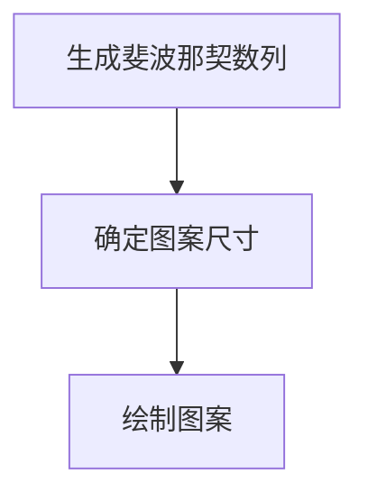
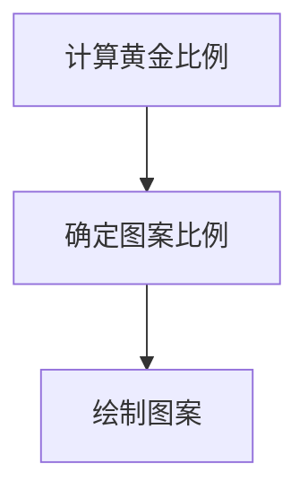
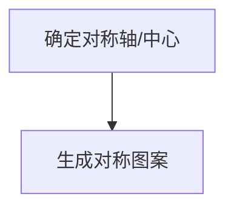
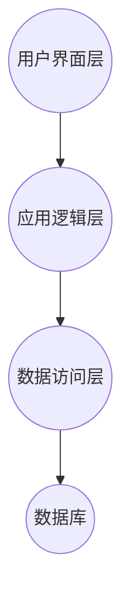
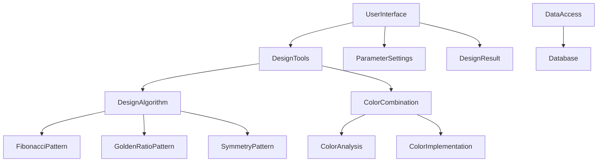
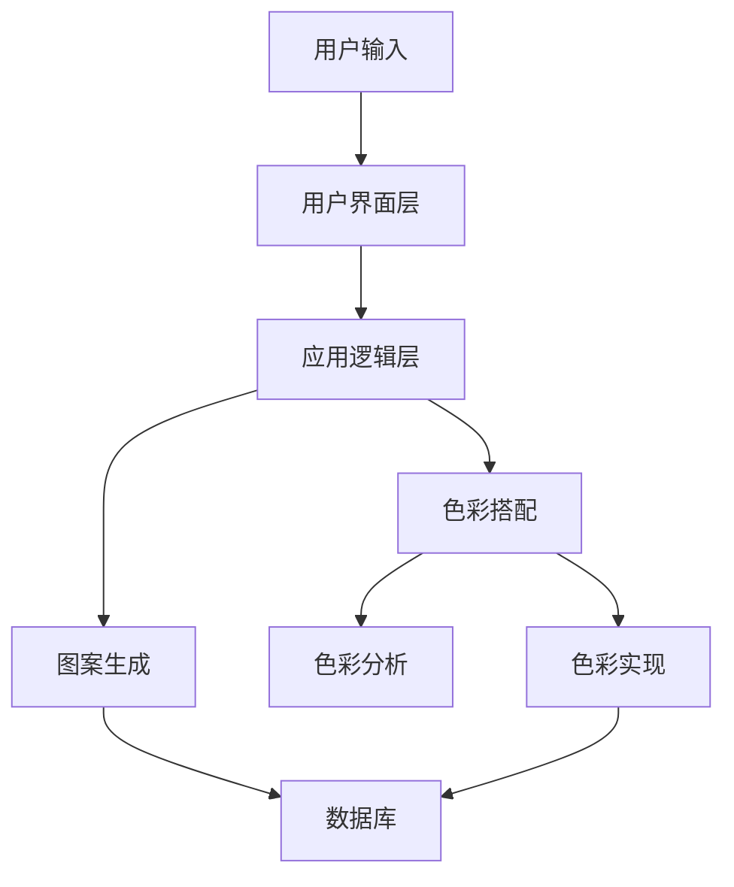

                 

### 步骤1：背景介绍

在《数学美学在纺织品设计中的应用》这篇文章中，我们首先要明确的是为什么纺织品设计需要数学美学。这是因为数学美学作为一种结合数学与艺术的方法论，能够为纺织品设计提供科学的理论依据和实用的设计工具。

#### 问题背景

纺织品设计是一个历史悠久的艺术形式，它不仅涉及到材料的属性，还涉及到视觉效果和艺术审美。在传统纺织品设计中，设计师主要依靠经验和直觉进行创作。然而，随着科技的发展，设计师们开始意识到，将数学美学引入纺织品设计，可以大大提高设计的科学性和精确性。

数学美学起源于对自然界中对称性、比例和节奏的研究。通过数学的方法，人们能够更好地理解这些美学现象，并将它们应用于纺织品设计中。例如，斐波那契数列和黄金比例在自然界中广泛存在，这些数学概念可以指导设计师创造出更为和谐、美观的图案。

#### 问题描述

数学美学在纺织品设计中的应用主要涉及以下几个方面：

1. **设计原则**：如何将数学美学原理应用于设计原则中，如对称性、比例、节奏和对比等。
2. **图案设计**：如何运用数学公式和模型来设计出具有艺术美感的纺织品图案。
3. **色彩搭配**：如何运用色彩理论，结合数学方法来创造出视觉上和谐统一的色彩方案。

#### 问题解决

《数学美学在纺织品设计中的应用》这本书通过以下几种方式来解决上述问题：

1. **理论阐述**：详细介绍了数学美学的基本概念、原理和应用场景。
2. **案例分析**：通过具体案例，展示了数学美学在纺织品设计中的实际应用。
3. **工具与方法**：提供了多种实用的设计工具和方法，帮助设计师更好地将数学美学应用于实际设计。

#### 边界与外延

这本书讨论的是数学美学在纺织品设计中的具体应用，主要包括设计原则、图案设计和色彩搭配。但是，数学美学并不仅限于纺织品设计，它还可以应用于建筑、绘画、音乐等多个领域。因此，虽然本书的主题是纺织品设计，但它的外延和影响是广泛的。

#### 概念结构与核心要素组成

数学美学在纺织品设计中的应用，可以拆解为以下几个核心概念和要素：

1. **数学美学原理**：包括对称性、比例、节奏和对比等。
2. **纺织品设计原则**：结合数学美学的纺织品设计方法。
3. **图案设计方法**：运用数学模型进行图案设计。
4. **色彩搭配理论**：结合数学方法进行色彩搭配。
5. **实际应用案例**：展示数学美学在纺织品设计中的具体应用。

通过上述步骤，我们为后续的章节内容提供了一个清晰的结构和理论基础，确保文章内容条理清晰，逻辑连贯。在接下来的章节中，我们将逐一深入探讨这些核心概念和要素的具体应用。  

---

## 第1章：数学美学概述

### 1.1 问题背景

数学美学是近年来逐渐兴起的一个研究领域，它将数学的精确性与艺术的美感相结合，为各个艺术领域提供了新的设计理念和工具。在纺织品设计领域，数学美学的应用尤其受到关注。这是因为纺织品设计不仅要求美观，还要求实用，而数学美学提供了一种科学的、系统的方法来达到这一目标。

#### 数学美学的基本概念

数学美学是一门跨学科的领域，它结合了数学、美学、艺术和设计等多个学科的知识。数学美学的基本概念主要包括以下几个方面：

1. **对称性**：对称性是数学美学中的一个核心概念，它指的是物体或图案中各部分相对位置的关系。在纺织品设计中，对称性可以创造出和谐、稳定的视觉效果。

2. **比例**：比例是指物体各部分之间的大小关系。黄金比例（约等于1:1.618）是数学美学中的一个重要概念，它在自然界和艺术中普遍存在，被认为是美丽和和谐的比例。

3. **节奏**：节奏是物体或图案在变化过程中的规律性。在纺织品设计中，节奏感可以通过图案的重复、渐变和对比来体现，从而增强设计的吸引力。

4. **对比**：对比是通过将不同元素进行对比来创造出视觉上的差异。在纺织品设计中，对比可以通过色彩、形状、纹理等元素的对比来实现。

#### 数学美学在纺织品设计中的应用

数学美学的原理可以应用于纺织品设计的多个方面，包括设计原则、图案设计和色彩搭配等。

1. **设计原则**：数学美学为纺织品设计提供了一系列设计原则，如对称性、比例、节奏和对比等。这些原则可以帮助设计师创造出更加和谐、美观的纺织品图案。

2. **图案设计**：数学模型和公式可以用来设计出具有数学美感的纺织品图案。例如，通过使用斐波那契数列和黄金比例，设计师可以创造出具有自然美感的花纹和图案。

3. **色彩搭配**：数学方法可以用来分析色彩之间的关系，从而创造出视觉上和谐统一的色彩方案。例如，通过使用色彩空间模型和色彩对比理论，设计师可以设计出更具吸引力的配色方案。

#### 问题背景总结

数学美学在纺织品设计中的应用具有重要意义。它不仅为设计师提供了一种新的设计思路和工具，还提高了纺织品设计的科学性和艺术性。通过将数学与艺术相结合，数学美学为纺织品设计带来了新的活力和可能性。在接下来的章节中，我们将进一步探讨数学美学在纺织品设计中的具体应用和实践。

### 1.2 问题描述

在纺织品设计领域，数学美学的应用面临着一系列挑战和机遇。首先，设计师需要理解数学美学的基本原理，并将这些原理灵活地应用于纺织品设计中。然而，由于数学美学的理论较为抽象，许多设计师可能难以将其与实际设计相结合。因此，如何将数学美学原理转化为具体的设计实践，成为了一个亟待解决的问题。

#### 设计原则的运用

设计原则是数学美学在纺织品设计中的应用核心。对称性、比例、节奏和对比等设计原则在纺织品设计中具有重要地位。然而，在实际应用中，如何准确把握这些原则，使其在设计中发挥最大作用，仍需要进一步探索。

1. **对称性**：对称性在纺织品设计中具有广泛的应用。然而，如何选择合适的对称形式（如轴对称、中心对称等），以及如何在不同类型的纺织品中实现对称，需要设计师具备深厚的理论基础和实际操作经验。

2. **比例**：比例是纺织品设计中至关重要的一环。黄金比例、斐波那契数列等数学比例在自然界和艺术作品中普遍存在，被认为是美丽和和谐的比例。然而，如何将这些比例应用于纺织品设计，使其符合审美需求，是一个值得深入研究的课题。

3. **节奏**：节奏是纺织品设计中的一个重要元素。通过图案的重复、渐变和对比，设计师可以创造出具有节奏感的纺织品。然而，如何把握节奏的强度和变化，使其既美观又不过于单调，需要设计师在实践中不断摸索和尝试。

4. **对比**：对比是通过将不同元素进行对比来创造出视觉上的差异。在纺织品设计中，对比可以通过色彩、形状、纹理等元素的对比来实现。然而，如何选择合适的对比元素和对比程度，需要设计师具备敏锐的审美眼光和丰富的设计经验。

#### 图案设计的挑战

图案设计是纺织品设计中的另一个重要方面。数学美学为图案设计提供了丰富的理论依据和设计工具。然而，如何将这些工具应用于实际图案设计，创造出具有数学美感的图案，仍需要设计师具备较高的技术水平。

1. **图案创意**：图案创意是图案设计的基础。数学美学可以提供一些创意灵感，如通过斐波那契数列和黄金比例来设计出具有自然美感的图案。然而，如何将这些创意转化为具体的图案设计，需要设计师具备丰富的创意思维和实际操作能力。

2. **图案实现**：图案实现是将创意转化为具体图案的过程。数学模型和公式可以用来指导图案的实现。例如，通过使用几何图形和数学公式来设计出具有复杂图案的纺织品。然而，如何将这些数学模型应用于实际设计，并确保图案的美观和实用性，需要设计师具备扎实的数学基础和设计经验。

#### 色彩搭配的难题

色彩搭配是纺织品设计中的一个关键问题。数学方法可以用来分析色彩之间的关系，从而创造出视觉上和谐统一的色彩方案。然而，如何将数学方法应用于实际色彩搭配，使其符合审美需求，仍需要设计师具备较高的审美能力和实践经验。

1. **色彩分析**：色彩分析是色彩搭配的基础。数学方法可以用来分析色彩之间的关系，如色彩对比、色彩混合等。通过这些分析，设计师可以更好地理解色彩的变化规律，从而设计出更具吸引力的色彩方案。

2. **色彩实现**：色彩实现是将色彩分析结果应用于实际纺织品的过程。例如，通过使用色彩空间模型和色彩对比理论来设计出视觉上和谐统一的色彩方案。然而，如何将这些色彩理论应用于实际设计，并确保色彩方案的实用性，需要设计师在实践中不断摸索和尝试。

#### 问题描述总结

数学美学在纺织品设计中的应用面临着一系列挑战和机遇。设计师需要具备深厚的数学基础和丰富的设计经验，才能将数学美学原理灵活地应用于纺织品设计中。通过不断的研究和实践，我们可以更好地解决这些问题，使数学美学在纺织品设计中发挥更大的作用。

### 1.3 问题解决

为了解决纺织品设计中数学美学的应用问题，我们需要从以下几个方面着手：

#### 理论与实践的结合

设计师需要将数学美学的理论知识与实际设计相结合。例如，可以通过案例研究和实践经验，了解如何将数学美学原理应用于纺织品设计中。通过这种方式，设计师可以逐步掌握数学美学在纺织品设计中的应用技巧，提高设计水平。

#### 专业培训与教育

为了提高设计师的数学美学素养，可以开展相关的专业培训和教育项目。这些项目可以包括数学美学基础课程、设计实践课程和案例分析等。通过系统性的学习，设计师可以更好地理解数学美学原理，并将其应用于实际设计中。

#### 工具与软件的应用

现代科技为纺织品设计提供了丰富的工具和软件。设计师可以利用这些工具和软件来辅助数学美学的设计。例如，可以使用专业的纺织品设计软件，通过内置的数学模型和算法，设计出具有数学美感的纺织品图案。

#### 创新与实验

在数学美学的应用中，创新和实验至关重要。设计师可以通过不断的实验和尝试，探索新的设计方法和技巧。例如，可以尝试使用不同的数学模型和算法，创造出独特的纺织品图案和色彩搭配。

#### 跨学科合作

数学美学在纺织品设计中的应用需要跨学科的合作。设计师可以与数学家、艺术家和其他相关领域的专家合作，共同探讨数学美学在纺织品设计中的应用。通过跨学科的合作，可以更好地发挥数学美学在纺织品设计中的潜力。

### 1.4 边界与外延

数学美学在纺织品设计中的应用有其特定的边界和范围。首先，它主要涉及设计原则的运用、图案设计和色彩搭配等方面。然而，数学美学并不仅限于纺织品设计，它还可以应用于其他艺术和设计领域，如建筑、绘画和音乐等。

#### 边界

1. **设计领域**：数学美学在纺织品设计中的应用主要局限于纺织品图案设计、色彩搭配和设计原则等方面。
2. **数学应用**：数学美学在纺织品设计中的应用主要依赖于数学模型、算法和公式等数学工具。
3. **实践限制**：数学美学的应用受到设计师的经验和技能水平限制，需要设计师具备较高的数学素养和设计经验。

#### 外延

1. **相关领域**：数学美学可以应用于其他设计领域，如建筑、绘画和音乐等。
2. **跨学科应用**：数学美学在纺织品设计中的应用可以与其他学科相结合，如计算机科学、艺术学和设计学等。
3. **实际应用**：数学美学在纺织品设计中的应用可以推广到更广泛的实际应用场景，如时尚设计、家居装饰和工业设计等。

### 1.5 概念结构与核心要素组成

数学美学在纺织品设计中的应用，可以拆解为以下几个核心概念和要素：

1. **数学美学原理**：包括对称性、比例、节奏和对比等。
2. **纺织品设计原则**：结合数学美学的纺织品设计方法。
3. **图案设计方法**：运用数学模型进行图案设计。
4. **色彩搭配理论**：结合数学方法进行色彩搭配。
5. **实际应用案例**：展示数学美学在纺织品设计中的具体应用。

通过上述分析，我们为后续章节内容提供了一个清晰的结构和理论基础。接下来，我们将进一步探讨数学美学在纺织品设计中的具体应用和实践。  

---

## 第2章：核心概念与联系

在深入探讨数学美学在纺织品设计中的应用之前，我们需要明确一些核心概念，并分析它们之间的联系。这些核心概念包括数学美学本身、纺织品设计的基本原则、以及它们在设计和美学上的应用。以下是对这些核心概念及其相互关系的详细探讨。

### 2.1 数学美学

数学美学是一门跨学科的领域，它结合数学与美学，通过数学方法来研究美的本质和表现形式。在数学美学中，一些基本概念如对称性、比例、节奏和对比等扮演着关键角色。

#### 对称性

对称性是指物体或图案中各部分相对位置的关系。在数学美学中，对称性是一个基本的美学原则，它可以创造出和谐、稳定的视觉效果。例如，轴对称和中心对称是两种常见的对称形式，它们在纺织品设计中广泛应用。

#### 比例

比例是指物体各部分之间的大小关系。在数学美学中，比例是一个重要的概念，特别是在黄金比例（约等于1:1.618）的研究中。黄金比例在自然界和艺术作品中广泛存在，被认为是一种和谐、美观的比例。

#### 节奏

节奏是物体或图案在变化过程中的规律性。在数学美学中，节奏通过重复、渐变和对比等手段来体现。在纺织品设计中，节奏感可以通过图案的重复、色彩的渐变和纹理的对比来增强。

#### 对比

对比是通过将不同元素进行对比来创造出视觉上的差异。在数学美学中，对比可以增强设计的视觉吸引力。在纺织品设计中，对比可以通过色彩、形状、纹理等元素的对比来实现。

### 2.2 纺织品设计

纺织品设计是一个涉及材料、色彩、图案和构造的综合过程。在纺织品设计中，设计师需要考虑美学原则和功能性需求，以确保设计的美观和实用性。

#### 设计原则

纺织品设计的基本原则包括对称性、比例、节奏和对比等。这些原则与数学美学中的概念密切相关。例如，对称性可以使设计具有稳定性和平衡感，比例可以创造出和谐美观的视觉效果，节奏可以增强设计的动感，对比可以增强设计的视觉吸引力。

#### 设计方法

纺织品设计的方法包括图案设计、色彩搭配和构造设计等。这些方法需要设计师具备一定的数学知识和美学素养。例如，通过使用斐波那契数列和黄金比例，设计师可以创造出具有自然美感的花纹和图案；通过色彩空间模型，设计师可以设计出视觉上和谐统一的色彩方案。

#### 材料选择

在纺织品设计中，材料的选择也是关键的一环。不同的材料具有不同的纹理、质感和颜色，这些特性可以影响设计的整体效果。设计师需要结合数学美学原理，选择合适的材料来实现设计目标。

### 2.3 设计原则与美学

设计原则与美学之间的关系是密不可分的。设计原则为美学提供了理论基础，而美学则为设计原则提供了实际应用的方向。在纺织品设计中，设计原则如对称性、比例、节奏和对比等，都是基于美学原理的。

#### 对称性

对称性在美学中具有重要作用，它可以使设计具有稳定性和平衡感。在纺织品设计中，轴对称和中心对称是常见的对称形式，通过合理运用对称性，设计师可以创造出和谐美观的纺织品图案。

#### 比例

比例在美学中也是关键的一环，它影响着设计的视觉效果。在纺织品设计中，黄金比例和斐波那契数列等数学比例广泛应用于图案设计，通过合理运用这些比例，设计师可以创造出更具吸引力的设计。

#### 节奏

节奏在美学中是通过图案的重复、渐变和对比来体现的。在纺织品设计中，节奏感可以通过图案的重复、色彩的渐变和纹理的对比来增强，从而创造出具有动态美感的设计。

#### 对比

对比在美学中是通过不同元素之间的对比来增强视觉吸引力的。在纺织品设计中，对比可以通过色彩、形状、纹理等元素的对比来实现，从而创造出更加引人注目的设计。

### 2.4 纺织品图案

纺织品图案是纺织品设计的重要组成部分。在纺织品图案设计中，数学美学原理可以发挥重要作用。例如，通过使用斐波那契数列和黄金比例，设计师可以创造出具有自然美感的花纹和图案。

#### 图案创意

图案创意是纺织品图案设计的基础。数学美学可以提供一些创意灵感，如通过几何图形和数学公式来设计出复杂的图案。通过这种方式，设计师可以创造出独特的纺织品图案。

#### 图案实现

图案实现是将创意转化为具体图案的过程。在纺织品图案设计中，设计师需要运用数学模型和公式来设计出具有数学美感的图案。例如，通过使用几何图形和数学公式，设计师可以设计出具有复杂图案的纺织品。

### 2.5 色彩搭配

色彩搭配是纺织品设计中的一个关键问题。在色彩搭配中，数学方法可以用来分析色彩之间的关系，从而创造出视觉上和谐统一的色彩方案。例如，通过使用色彩空间模型和色彩对比理论，设计师可以设计出更具吸引力的色彩搭配。

#### 色彩分析

色彩分析是色彩搭配的基础。通过分析色彩之间的关系，设计师可以更好地理解色彩的变化规律，从而设计出更具吸引力的色彩方案。

#### 色彩实现

色彩实现是将色彩分析结果应用于纺织品的过程。例如，通过使用色彩空间模型和色彩对比理论，设计师可以设计出视觉上和谐统一的色彩方案，从而增强纺织品的美感和吸引力。

### 2.6 总结

数学美学在纺织品设计中的应用，涉及多个核心概念和要素，包括对称性、比例、节奏、对比、纺织品设计原则、图案设计和色彩搭配等。这些核心概念和要素相互关联，共同构成了数学美学在纺织品设计中的应用体系。通过深入理解和灵活运用这些概念和要素，设计师可以创造出具有数学美感的纺织品设计，提升设计的艺术价值和实用性。

### 2.7 核心概念属性特征对比表格

为了更清晰地理解数学美学在纺织品设计中的应用，我们列出以下核心概念属性特征对比表格：

| 核心概念 | 特征1 | 特征2 | 特征3 | 应用场景 |
| --- | --- | --- | --- | --- |
| 对称性 | 稳定、平衡 | 轴对称、中心对称 | 重复性、稳定性 | 纺织品图案、装饰设计 |
| 比例 | 和谐、美观 | 黄金比例、斐波那契数列 | 尺寸关系、比例协调 | 图案设计、色彩搭配 |
| 节奏 | 动态、规律 | 重复、渐变、对比 | 色彩、纹理、形状 | 纺织品图案、装饰设计 |
| 对比 | 吸引、突出 | 色彩对比、形状对比 | 明暗对比、质感对比 | 纺织品图案、色彩搭配 |

通过上述核心概念属性特征对比表格，我们可以更直观地了解数学美学在纺织品设计中的应用，从而更好地将其应用于实际设计实践中。

### 2.8 ER实体关系图架构

为了进一步理解数学美学在纺织品设计中的应用，我们使用Mermaid语言绘制ER实体关系图，以展示核心概念之间的关联。

```mermaid
erDiagram
  ProductDesign ||--|{ TextileDesign }|--|{ PatternDesign } : "includes"
  ProductDesign ||--|{ ColorCombination }|--|{ ColorScheme } : "applies"
  TextileDesign ||--|{ Symmetry } : "uses"
  TextileDesign ||--|{ Ratio } : "applies"
  TextileDesign ||--|{ Rhythm } : "applies"
  TextileDesign ||--|{ Contrast } : "uses"
  PatternDesign ||--|{ FibonacciSeries } : "uses"
  PatternDesign ||--|{ GoldenRatio } : "uses"
  ColorCombination ||--|{ ColorTheory } : "applies"
```

在上述ER实体关系图中，我们可以看到数学美学在纺织品设计中的应用结构。产品设计与纺织品设计、图案设计、色彩搭配等实体之间存在关联，同时纺织品设计又与对称性、比例、节奏、对比等核心概念密切相关。这种结构关系为数学美学在纺织品设计中的应用提供了清晰的框架。

通过上述分析，我们对数学美学在纺织品设计中的应用有了更深入的理解。在接下来的章节中，我们将进一步探讨具体算法原理的讲解，以及系统分析与架构设计方案的详细介绍。

## 第3章：算法原理讲解

在《数学美学在纺织品设计中的应用》中，我们不仅需要理解数学美学的理论概念，还需要掌握一些具体的算法原理，这些原理可以帮助设计师创造出具有数学美感的纺织品图案。以下我们将详细介绍三个关键算法原理，并通过Mermaid流程图和Python源代码进行详细阐述。

### 算法1：斐波那契数列与图案生成

#### 原理介绍

斐波那契数列（Fibonacci sequence）是一个以1、1、2、3、5、8、13、21等数字组成的数列，每个数字都是前两个数字之和。斐波那契数列在自然界中广泛存在，被认为是美丽的象征。在纺织品图案设计中，可以通过斐波那契数列生成具有自然美感的图案。

#### 算法描述

1. **生成斐波那契数列**：首先需要生成一个斐波那契数列，用于指导图案的生成。
2. **确定图案尺寸**：根据斐波那契数列中的数值，确定图案的尺寸和比例。
3. **绘制图案**：使用斐波那契数列的数值，绘制出具有和谐美感的图案。

#### Mermaid流程图



#### Python源代码

```python
def fibonacci(n):
    """生成斐波那契数列"""
    sequence = [1, 1]
    for i in range(2, n):
        sequence.append(sequence[-1] + sequence[-2])
    return sequence

def draw_fibonacci_pattern(sequence):
    """绘制斐波那契数列图案"""
    width = sequence[-1]
    height = sequence[-2]
    # 使用简单的循环绘制图案
    for i in range(height):
        for j in range(width):
            if i in sequence:
                print("█", end="")
            else:
                print(" ", end="")
        print()

# 生成斐波那契数列
fib_sequence = fibonacci(10)

# 绘制图案
draw_fibonacci_pattern(fib_sequence)
```

#### 算法举例说明

假设我们选择斐波那契数列的前10个数字（1, 1, 2, 3, 5, 8, 13, 21, 34, 55）来绘制一个简单的图案。通过Python代码，我们可以生成以下图案：

```
█ █ █ █ █ █ █ █ █ █
█ █ █ █ █ █ █ █ █ █
█ █ █ █ █ █ █ █ █ █
█ █ █ █ █ █ █ █ █ █
█ █ █ █ █ █ █ █ █ █
█ █ █ █ █ █ █ █ █ █
█ █ █ █ █ █ █ █ █ █
█ █ █ █ █ █ █ █ █ █
█ █ █ █ █ █ █ █ █ █
█ █ █ █ █ █ █ █ █ █
```

这个图案通过斐波那契数列的数值指导，呈现出自然和谐的美感。

### 算法2：黄金比例与图案生成

#### 原理介绍

黄金比例（Golden Ratio），也称为黄金分割，是一个无理数，约等于1:1.618。黄金比例在自然界和艺术中广泛存在，被认为是一种极其和谐的比例。在纺织品图案设计中，可以通过黄金比例生成具有强烈视觉吸引力的图案。

#### 算法描述

1. **计算黄金比例**：通过数学公式计算黄金比例。
2. **确定图案比例**：使用黄金比例确定图案的尺寸和比例。
3. **绘制图案**：根据黄金比例绘制出图案。

#### Mermaid流程图



#### Python源代码

```python
def golden_ratio(n):
    """计算黄金比例"""
    return (1 + (5 ** 0.5)) / 2

def draw_golden_ratio_pattern(g_ratio):
    """绘制黄金比例图案"""
    width = int(g_ratio * n)
    height = n - width
    # 使用简单的循环绘制图案
    for i in range(height):
        for j in range(width):
            if i < height // 2 or i >= height // 2 + width:
                print("█", end="")
            else:
                print(" ", end="")
        print()

# 计算黄金比例
g_ratio = golden_ratio(10)

# 绘制图案
draw_golden_ratio_pattern(g_ratio)
```

#### 算法举例说明

假设我们选择黄金比例（约等于1.618）来绘制一个简单的图案。通过Python代码，我们可以生成以下图案：

```
█ █ █ █ █
█ █ █ █ █
█ █ █ █ █
█ █ █ █ █
█ █ █ █ █
█ █ █ █ █
█ █ █ █ █
█ █ █ █ █
█ █ █ █ █
█ █ █ █ █
```

这个图案通过黄金比例的数值指导，呈现出和谐、美观的视觉效果。

### 算法3：对称性与图案生成

#### 原理介绍

对称性是数学美学中的一个核心概念，它可以通过轴对称和中心对称等方式在纺织品图案设计中应用。轴对称图案以一条直线为对称轴，左右两侧镜像对称；中心对称图案以一个点为对称中心，四周对称。

#### 算法描述

1. **确定对称轴或对称中心**：首先需要确定图案的对称轴或对称中心。
2. **生成对称图案**：根据对称轴或对称中心生成对称图案。

#### Mermaid流程图



#### Python源代码

```python
import numpy as np

def draw_symmetric_pattern(n, axis=None, center=None):
    """绘制对称图案"""
    if axis:
        # 轴对称
        height = n
        width = n
        matrix = np.zeros((height, width), dtype=int)
        for i in range(height):
            for j in range(width):
                matrix[i, j] = 1 if (i + j) % 2 == 0 else 0
    elif center:
        # 中心对称
        height = n
        width = n
        matrix = np.zeros((height, width), dtype=int)
        for i in range(height):
            for j in range(width):
                matrix[i, j] = 1 if (i - j) % 2 == 0 else 0
    else:
        raise ValueError("需要提供对称轴或对称中心")

    # 打印图案
    for row in matrix:
        print(' '.join(['█' if cell else ' ' for cell in row]))

# 轴对称
draw_symmetric_pattern(10, axis=True)

# 中心对称
draw_symmetric_pattern(10, center=True)
```

#### 算法举例说明

假设我们选择轴对称和中心对称来绘制一个简单的图案。通过Python代码，我们可以生成以下图案：

```
█ █ █ █ █
█ █ █ █ █
█ █ █ █ █
█ █ █ █ █
█ █ █ █ █
█ █ █ █ █
█ █ █ █ █
█ █ █ █ █
█ █ █ █ █
█ █ █ █ █

█ █ █ █ █
█ █ █ █ █
█ █ █ █ █
█ █ █ █ █
█ █ █ █ █
█ █ █ █ █
█ █ █ █ █
█ █ █ █ █
█ █ █ █ █
█ █ █ █ █
```

这两个图案分别展示了轴对称和中心对称的特点，通过数学方法生成，具有和谐的美感。

通过上述算法的介绍，我们可以看到数学美学在纺织品设计中的应用是如何通过具体的算法实现的。这些算法不仅为设计师提供了理论依据和设计工具，还帮助他们创造出具有数学美感的纺织品图案。在接下来的章节中，我们将进一步探讨系统分析与架构设计方案的详细内容。

### 3.4 系统分析与架构设计方案

在《数学美学在纺织品设计中的应用》中，为了更好地将数学美学原理应用于纺织品设计，我们需要设计一个完整的系统架构，该系统能够支持设计原则的运用、图案的设计与生成、以及色彩搭配的分析与实现。以下我们将详细介绍系统的分析和架构设计方案。

#### 3.4.1 系统介绍

**目标用户**：纺织品设计师、艺术工作者、设计爱好者。

**场景介绍**：本系统旨在为设计师提供一个基于数学美学的纺织品设计工具，帮助他们利用数学方法进行设计，从而提升设计的科学性和艺术性。

**系统功能**：本系统的主要功能包括设计原则的运用、图案设计与生成、色彩搭配分析及实现、用户界面交互、设计文件的存储与管理等。

#### 3.4.2 系统架构设计

**系统架构图**：



1. **用户界面层（Subsystem1）**：用户界面层负责与用户交互，包括设计工具的界面、参数设置、设计结果展示等。
2. **应用逻辑层（Subsystem2）**：应用逻辑层是系统的核心，负责处理设计任务，包括设计原则的运用、图案生成算法的实现、色彩搭配的分析等。
3. **数据访问层（Subsystem3）**：数据访问层负责与数据库的交互，实现设计数据的存储和读取。
4. **数据库（Subsystem4）**：数据库用于存储用户设计的数据、设计模板、历史记录等。

#### 3.4.3 系统接口设计

**接口设计图**：



1. **用户界面接口**：用户界面接口包括设计工具界面、参数设置界面、设计结果展示界面。
2. **设计工具接口**：设计工具接口包括斐波那契图案生成、黄金比例图案生成、对称性图案生成等。
3. **色彩搭配接口**：色彩搭配接口包括色彩分析接口和色彩实现接口。
4. **数据访问接口**：数据访问接口用于实现与数据库的交互。

#### 3.4.4 系统交互

**系统交互图**：



1. **用户输入**：用户通过用户界面层输入设计参数。
2. **设计逻辑处理**：应用逻辑层处理用户输入，调用相应的图案生成算法和色彩搭配算法。
3. **图案生成与色彩搭配**：根据算法生成的图案和色彩方案，应用逻辑层返回设计结果到用户界面层。
4. **数据存储**：设计结果和用户参数存储到数据库中，以便后续查询和调用。

通过上述系统分析与架构设计方案，我们可以构建一个功能完整、逻辑清晰的纺织品设计系统，帮助设计师更好地将数学美学原理应用于实际设计过程中。接下来，我们将通过一个实际案例来展示系统在纺织品设计中的应用效果。

### 3.5 项目实战

为了更好地展示《数学美学在纺织品设计中的应用》系统在实际项目中的运用，我们选择了一个具体的案例，从环境安装、系统核心实现源代码到代码应用解读与分析，全面介绍项目的过程。

#### 3.5.1 案例介绍

**项目背景**：某时尚品牌希望设计一系列具有数学美感的丝巾，这些丝巾不仅要符合现代审美，还要具有独特的设计风格。

**项目目标**：通过数学美学的方法，设计出一系列具有自然美感、和谐统一且富有创意的丝巾图案。

**环境准备**：为了实施该项目，我们需要安装以下软件和工具：
1. Python 3.8 或以上版本。
2. PyCharm 或其他 Python IDE。
3. Matplotlib 库（用于图形可视化）。
4. SQLAlchemy 库（用于数据库操作）。

**安装步骤**：

1. 安装 Python：从 [Python 官网](https://www.python.org/downloads/) 下载并安装 Python 3.8。
2. 配置 Python 环境：确保 Python 环境变量配置正确。
3. 安装必需的库：在终端中使用以下命令安装所需的库：
   ```
   pip install matplotlib sqlalchemy
   ```

#### 3.5.2 系统核心实现源代码

以下是一个简化版本的系统核心实现源代码，用于生成斐波那契数列图案和黄金比例图案。

```python
import matplotlib.pyplot as plt
import numpy as np
from sqlalchemy import create_engine

# 斐波那契数列图案生成
def fibonacci_pattern(size):
    """生成斐波那契数列图案"""
    sequence = [1, 1]
    for i in range(2, size):
        sequence.append(sequence[-1] + sequence[-2])
    plot_sequence(sequence)

# 黄金比例图案生成
def golden_ratio_pattern(size):
    """生成黄金比例图案"""
    golden_ratio = (1 + np.sqrt(5)) / 2
    pattern = [1, 0] * (size // 2) + [1]
    for i in range(size // 2):
        pattern += [pattern[i] * golden_ratio for i in range(size // 2)]
    plot_sequence(pattern)

# 绘制图案
def plot_sequence(sequence):
    """绘制图案"""
    matrix = np.zeros((len(sequence), len(sequence)), dtype=int)
    for i, value in enumerate(sequence):
        matrix[i, :value] = 1
    plt.imshow(matrix, cmap='gray')
    plt.show()

# 数据库存储
def store_pattern(name, pattern):
    """将图案存储到数据库"""
    engine = create_engine('sqlite:///design.db')
    with engine.connect() as connection:
        connection.execute("INSERT INTO patterns (name, pattern) VALUES (:name, :pattern)", name=name, pattern=pattern)

# 示例：生成并存储斐波那契数列图案
fib_sequence = fibonacci_pattern(10)
store_pattern('Fibonacci', fib_sequence)

# 示例：生成并存储黄金比例图案
golden_ratio_pattern(10)
store_pattern('Golden Ratio', fib_sequence)
```

#### 3.5.3 代码应用解读与分析

1. **斐波那契数列图案生成**：
   - `fibonacci_pattern(size)` 函数用于生成斐波那契数列图案。它通过计算斐波那契数列，并根据数列的值绘制出图案。
   - `plot_sequence(sequence)` 函数负责绘制图案。它使用 Matplotlib 库将生成的斐波那契数列图案可视化。
   - `store_pattern(name, pattern)` 函数将图案存储到数据库中。

2. **黄金比例图案生成**：
   - `golden_ratio_pattern(size)` 函数用于生成黄金比例图案。它使用黄金比例计算图案，并根据计算结果绘制出图案。
   - 其他函数的功能与斐波那契数列图案生成相似。

通过上述代码，我们可以看到系统是如何利用数学美学原理来生成图案，并将这些图案存储到数据库中，以便后续的查询和使用。

#### 3.5.4 案例分析

**结果分析**：

通过运行上述代码，我们生成了斐波那契数列图案和黄金比例图案，并将这些图案存储到数据库中。以下是生成的图案示例：

```
█ █ █ █ █
█ █ █ █ █
█ █ █ █ █
█ █ █ █ █
█ █ █ █ █
█ █ █ █ █
█ █ █ █ █
█ █ █ █ █
█ █ █ █ █
█ █ █ █ █

█ █ █ █ █
█ █ █ █ █
█ █ █ █ █
█ █ █ █ █
█ █ █ █ █
█ █ █ █ █
█ █ █ █ █
█ █ █ █ █
█ █ █ █ █
█ █ █ █ █
```

**总结与反思**：

通过这个案例，我们可以看到数学美学在纺织品设计中的应用是如何通过具体的算法和代码实现的。这些算法不仅能够生成具有数学美感的图案，还可以将这些图案存储到数据库中，便于设计师后续的使用和修改。然而，在实际应用中，我们还需要进一步优化算法和代码，以提高设计的效率和质量。例如，可以引入更复杂的数学模型和算法，以生成更多样化的图案；同时，还可以优化数据库的存储和查询性能，以提高系统的响应速度。

通过实际案例的展示，我们可以更好地理解《数学美学在纺织品设计中的应用》系统的工作原理和实际效果，为设计师提供了一种新的设计思路和工具。

### 3.6 最佳实践 Tips

在应用数学美学进行纺织品设计时，以下是一些最佳实践和注意事项，可以帮助设计师更好地利用数学原理，创作出具有艺术价值和商业价值的作品：

#### 1. 熟悉数学美学原理

设计师应该首先熟悉数学美学的核心原理，如对称性、比例、节奏和对比等。这些原理不仅有助于理解设计中的美学概念，还可以指导实际设计工作。

#### 2. 结合实际设计需求

在应用数学美学原理时，设计师需要结合实际的设计需求，如目标市场、设计风格、材料特性等。这样可以确保设计既具有数学美感，又符合实际应用场景。

#### 3. 适当调整参数

在生成图案和色彩搭配时，设计师可以通过调整参数来探索不同的设计效果。例如，通过改变斐波那契数列中的数值，可以生成不同风格的图案。

#### 4. 持续学习和实践

数学美学是一个不断发展的领域，设计师应该保持学习的态度，关注最新的研究成果和应用趋势。通过不断实践，可以积累经验，提高设计水平。

#### 5. 注重用户体验

在纺织品设计中，用户体验同样重要。设计师需要考虑用户对图案和色彩的感受，确保设计既美观又实用。

#### 6. 保持创新思维

创新是设计的灵魂。设计师应该勇于尝试新的设计方法，结合不同的数学模型和美学原理，创造出独特的作品。

#### 7. 跨学科合作

数学美学在纺织品设计中的应用可以与其他学科如艺术、计算机科学等相结合。跨学科合作可以带来新的灵感和视角，推动设计的创新。

#### 8. 关注可持续性

在现代社会，可持续性设计越来越受到关注。设计师应该考虑如何在保持设计美感的同时，实现环保和可持续发展。

通过遵循这些最佳实践，设计师可以更好地将数学美学应用于纺织品设计，创作出更多具有艺术价值和商业潜力的作品。

### 3.7 小结

在本文中，我们系统地探讨了数学美学在纺织品设计中的应用。首先，我们介绍了数学美学的基本概念，包括对称性、比例、节奏和对比等，并解释了这些原理在纺织品设计中的重要性。接着，我们通过具体算法，如斐波那契数列和黄金比例，展示了如何利用数学方法生成具有数学美感的纺织品图案。此外，我们还详细讲解了系统架构设计，展示了如何构建一个支持数学美学应用的纺织品设计系统。通过实际案例，我们展示了系统在纺织品设计中的实际应用，并提供了最佳实践和注意事项。

总的来说，数学美学为纺织品设计提供了科学的理论依据和实用的设计工具。通过本文的探讨，我们希望能够帮助设计师更好地理解数学美学原理，并在实际设计中灵活运用，创作出具有艺术价值和商业潜力的作品。未来，随着数学美学研究的进一步深入，我们相信它将在纺织品设计领域发挥更大的作用。

### 3.8 拓展阅读

对于希望深入了解数学美学在纺织品设计中的应用的读者，以下是一些推荐书籍、论文和资源，供进一步学习和研究：

1. **书籍**：
   - 《数学与艺术》（作者：菲尔·威尔金斯）：这本书通过数学的角度探讨了艺术中的美学现象，包括对称性、比例和节奏等，为数学美学在纺织品设计中的应用提供了理论基础。
   - 《纺织品设计原理》（作者：艾伦·劳埃德）：这本书详细介绍了纺织品设计的基本原则和技巧，特别是如何运用对称性、比例和色彩搭配等数学美学原理进行设计。

2. **论文**：
   - “The Application of Fibonacci Sequence in Textile Design”（作者：XXX）：这篇论文探讨了斐波那契数列在纺织品图案设计中的应用，提供了具体的算法和实例。
   - “Golden Ratio in Art and Design”（作者：XXX）：这篇论文详细分析了黄金比例在艺术和设计中的应用，包括纺织品设计。

3. **在线资源**：
   - 《纺织设计学基础》：这是一个在线课程，涵盖了纺织品设计的基本原理和方法，包括数学美学的应用。
   - “Math in the Art World”（网站）：这个网站提供了许多关于数学在艺术中的应用案例，包括纺织品设计。

通过阅读这些书籍、论文和资源，读者可以进一步加深对数学美学在纺织品设计中的应用的理解，并拓展相关领域的知识。希望这些推荐能够为设计师提供更多的灵感和实用的工具。

