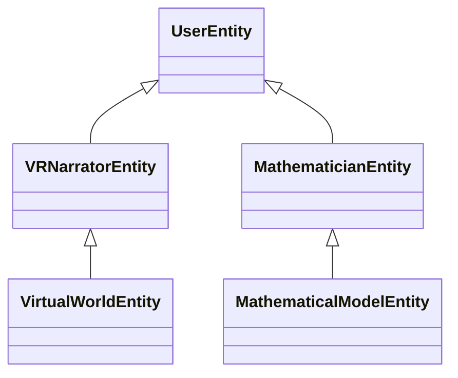
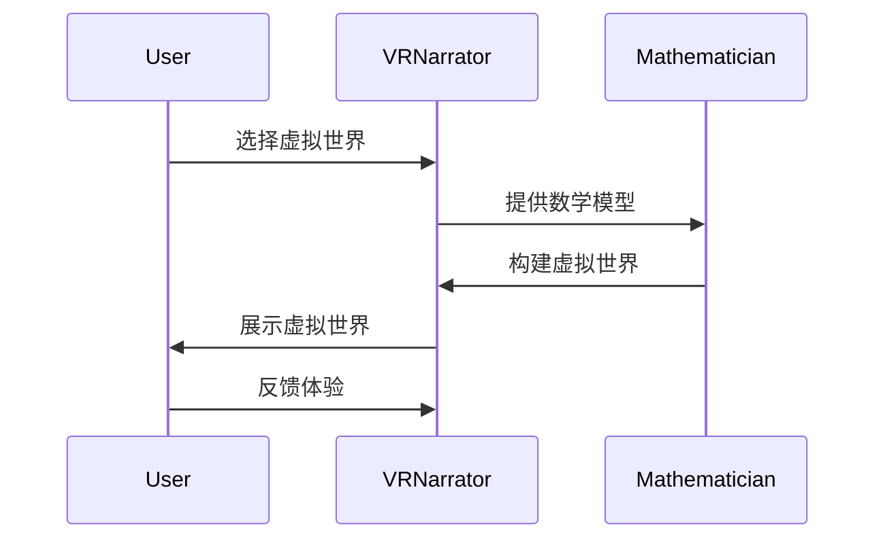

                 

# 数学美学在虚拟现实叙事中的应用

## 关键词
数学美学、虚拟现实、叙事、沉浸式体验、艺术与科学结合

## 摘要
本文旨在探讨数学美学在虚拟现实叙事中的应用。通过对数学美学核心概念与虚拟现实叙事的深入分析，我们揭示了数学美学如何为虚拟现实叙事提供理论基础和方法论。文章详细阐述了数学美学在虚拟现实叙事中的应用场景，包括教育、艺术创作和游戏设计等，并通过实践案例展示了其应用效果。本文旨在为研究者提供有价值的参考，推动数学美学与虚拟现实叙事的融合发展。

## 第一部分：数学美学与虚拟现实概述

### 第1章：问题背景与问题描述

#### 1.1 问题背景
随着虚拟现实（VR）技术的飞速发展，人们对于沉浸式体验的需求越来越高。VR技术通过计算机生成的三维立体环境，使人们能够仿佛身临其境，极大地拓展了人类的感知范围。然而，VR技术的应用不仅仅是简单的视觉和听觉体验，它更涉及到用户的心理感受和情感共鸣。

#### 1.2 问题描述
在虚拟现实叙事中，如何将数学美学与艺术创作相结合，创造出既具有科学性又具有艺术性的虚拟世界，成为一个亟待解决的问题。数学美学为虚拟现实叙事提供了丰富的理论资源和实践方法，但如何在实际操作中有效地运用这些资源和方法，还需要深入研究和探索。

### 第2章：数学美学核心概念与联系

#### 2.1 核心概念

**数学美学**：数学美学是研究数学形式在艺术中的应用的一门学科，它关注数学结构、符号、图形等元素在艺术创作中的运用。数学美学不仅仅是数学与艺术的简单结合，更是一种独特的思维方式，它强调通过数学的逻辑和严谨性来提升艺术创作的质量。

**虚拟现实叙事**：虚拟现实叙事是指在虚拟现实环境中，通过数字技术构建故事情节，引导用户参与和体验的一种叙事方式。虚拟现实叙事要求在保持故事连贯性的同时，提供丰富的感官刺激和情感共鸣。

#### 2.2 概念属性特征对比表格

| 特征                 | 数学美学                                       | 虚拟现实叙事                                         |
|---------------------|-----------------------------------------------|-----------------------------------------------------|
| 目的                 | 探索数学形式与艺术创作的结合                   | 创建沉浸式体验，讲述故事                             |
| 基础理论             | 数学、美学、艺术学                             | 计算机科学、数字媒体、心理学                         |
| 运用方式             | 通过数学模型、图形、符号等艺术创作手法         | 利用虚拟现实技术、三维建模、交互设计等手段           |
| 结果                 | 创作出具有数学美感的艺术作品                   | 构建出富有叙事性的虚拟现实场景                       |

#### 2.3 ER实体关系图架构

```mermaid
erDiagram
  User ||--|{ VRNarrator }|-- VirtualWorld
  User ||--|{ Mathematician }|-- MathematicalModel
  VRNarrator ||-- VirtualWorld
  Mathematician ||-- MathematicalModel
```

### 第3章：数学美学在虚拟现实叙事中的应用场景

#### 3.1 教育领域
在虚拟现实教育中，数学美学可以应用于设计具有吸引力和教育意义的虚拟实验和模型。例如，通过三维建模技术，将抽象的数学概念形象化，帮助学生在沉浸式环境中更好地理解和掌握数学知识。

#### 3.2 艺术创作
艺术创作中，数学美学为艺术家提供了丰富的灵感来源。艺术家可以利用数学结构、几何图形等元素来创作具有独特视觉美感的艺术作品。例如，利用黄金分割比例设计建筑或艺术装置，营造出和谐美观的视觉效果。

#### 3.3 游戏设计
在游戏设计中，数学美学可以用于构建游戏世界的规则和逻辑。通过数学模型的运用，设计师可以创造出富有挑战性和趣味性的游戏机制，提高玩家的沉浸感和参与度。

### 第4章：数学美学在虚拟现实叙事中的实践案例

#### 4.1 项目介绍
本节将介绍几个具有代表性的数学美学在虚拟现实叙事中的实践案例，包括教育、艺术创作和游戏设计等领域的应用。这些案例展示了数学美学如何在实际操作中为虚拟现实叙事注入新的活力。

#### 4.2 系统功能设计
在本节中，我们将使用Mermaid类图来描述系统功能设计。



#### 4.3 系统架构设计
在本节中，我们将使用Mermaid架构图来描述系统架构设计。

```mermaid
gr

```## 第一部分：数学美学与虚拟现实概述

### 第1章：问题背景与问题描述

#### 1.1 问题背景

虚拟现实（Virtual Reality，VR）技术的出现，改变了人们对现实世界的认知方式。通过计算机技术生成的三维立体环境，用户仿佛置身于一个全新的世界，能够体验到前所未有的沉浸感。这种沉浸式体验不仅限于视觉和听觉，还包括触觉、嗅觉等多种感官，极大地拓展了人类的感知边界。

然而，虚拟现实技术的应用并不仅限于娱乐和游戏领域。随着技术的进步，虚拟现实逐渐渗透到教育、医疗、设计等多个行业，成为了一种重要的交互工具和创意平台。在虚拟现实环境中，如何有效地传递信息和构建故事情节，成为了一个亟待解决的问题。

数学美学作为一种独特的思维方式，强调通过数学的结构和形式来提升艺术创作的质量。它不仅仅关注数学在艺术中的应用，更关注数学与艺术之间的深度融合。数学美学在虚拟现实叙事中的应用，为构建科学性与艺术性相结合的虚拟世界提供了新的思路。

#### 1.2 问题描述

在虚拟现实叙事中，如何将数学美学融入到故事情节的构建和场景设计中，是一个值得探讨的问题。传统的叙事方式往往依赖于文字、声音和图像等媒介，而数学美学的引入，可以为虚拟现实叙事带来全新的视觉和思维体验。

数学美学在虚拟现实叙事中的应用，涉及多个方面的挑战：

1. **数学结构的应用**：如何将数学中的结构、对称性、比例等元素应用到虚拟现实场景设计中，使其既具有美感又符合逻辑？
   
2. **故事情节的构建**：如何在虚拟现实环境中构建具有吸引力和连贯性的故事情节，使观众能够沉浸其中？
   
3. **用户体验的设计**：如何通过虚拟现实技术，为用户提供更加丰富和深刻的体验，使他们在数学美学的引导下，更好地理解和感受故事情节？

这些挑战不仅需要技术上的创新，更需要对数学美学与虚拟现实叙事的深度融合进行深入的思考和探索。

### 第2章：数学美学核心概念与联系

#### 2.1 核心概念

**数学美学**：数学美学是一门跨学科的研究领域，它关注数学在艺术和设计中的应用。数学美学的核心概念包括数学结构、符号、图形等元素在艺术创作中的运用。它不仅仅关注数学形式的美感，更强调通过数学的逻辑和严谨性来提升艺术创作的质量。

**虚拟现实叙事**：虚拟现实叙事是一种通过虚拟现实技术构建故事情节，引导用户参与和体验的叙事方式。它强调在虚拟现实环境中，用户与故事世界的互动性和沉浸感。虚拟现实叙事要求在保持故事连贯性的同时，提供丰富的感官刺激和情感共鸣。

#### 2.2 概念属性特征对比表格

| 特征                 | 数学美学                                       | 虚拟现实叙事                                         |
|---------------------|-----------------------------------------------|-----------------------------------------------------|
| 目的                 | 探索数学形式与艺术创作的结合                   | 创建沉浸式体验，讲述故事                             |
| 基础理论             | 数学、美学、艺术学                             | 计算机科学、数字媒体、心理学                         |
| 运用方式             | 通过数学模型、图形、符号等艺术创作手法         | 利用虚拟现实技术、三维建模、交互设计等手段           |
| 结果                 | 创作出具有数学美感的艺术作品                   | 构建出富有叙事性的虚拟现实场景                       |

#### 2.3 ER实体关系图架构

```mermaid
erDiagram
  User ||--|{ VRNarrator }|-- VirtualWorld
  User ||--|{ Mathematician }|-- MathematicalModel
  VRNarrator ||-- VirtualWorld
  Mathematician ||-- MathematicalModel
```

在这个ER图中，用户（User）是核心实体，他们可以是VR叙事者（VRNarrator）或数学家（Mathematician）。VR叙事者负责构建虚拟世界（VirtualWorld），而数学家则负责构建数学模型（MathematicalModel）。这两个实体之间通过不同的关系连接，形成了虚拟现实叙事和数学美学应用的完整体系。

### 第3章：数学美学在虚拟现实叙事中的应用场景

#### 3.1 教育领域

数学美学在教育领域的应用具有极大的潜力。通过虚拟现实技术，可以将抽象的数学概念形象化，使学生在沉浸式的环境中更好地理解和掌握数学知识。例如，在几何学中，可以创建一个三维的虚拟空间，让学生通过实际操作来理解几何图形的构成和性质。这种教育方式不仅提高了学生的学习兴趣，还加深了他们对数学概念的理解。

此外，数学美学还可以用于设计互动式教学工具，如虚拟实验室。在这些实验室中，学生可以模拟各种数学实验，探索数学原理在实际中的应用。例如，通过模拟物理现象，让学生理解微积分中的导数和积分概念。这种实践性的学习方式，有助于培养学生的逻辑思维和问题解决能力。

#### 3.2 艺术创作

数学美学在艺术创作中也有着广泛的应用。艺术家可以利用数学结构、对称性、比例等元素，创造出具有独特美感和形式感的艺术作品。例如，利用黄金分割比例设计艺术装置，可以营造出和谐美观的视觉效果。在音乐创作中，数学美学也可以发挥作用，如通过数学模型来分析音乐节奏和旋律的构成，从而创造出新的音乐风格。

在虚拟现实艺术中，数学美学的应用更是无处不在。通过虚拟现实技术，艺术家可以创建出具有三维立体感的数学图形，如莫比乌斯带、双曲空间等。这些图形不仅具有科学性，同时也具有艺术性，为观众带来独特的视觉体验。例如，可以在虚拟现实博物馆中展示这些数学图形，让观众在沉浸式的环境中欣赏和学习数学之美。

#### 3.3 游戏设计

数学美学在游戏设计中的应用，可以创造出具有丰富故事情节和趣味性的游戏世界。通过数学模型和算法，设计师可以构建出复杂的游戏规则和逻辑，使游戏具有挑战性和可玩性。例如，在角色扮演游戏中，可以通过数学模型来设计角色的成长路径和技能树，使玩家在探索和冒险的过程中感受到数学的魅力。

此外，数学美学还可以用于游戏场景的设计。通过利用几何图形、对称性和比例等元素，可以创造出具有视觉美感和艺术价值的游戏世界。例如，在城市建设类游戏中，可以利用黄金分割比例来设计城市的布局，使其既美观又实用。在冒险类游戏中，可以利用莫比乌斯环等几何图形来设计迷宫和障碍，增加游戏的趣味性和挑战性。

### 第4章：数学美学在虚拟现实叙事中的实践案例

#### 4.1 项目介绍

在本节中，我们将介绍几个具有代表性的数学美学在虚拟现实叙事中的实践案例，这些案例涵盖了教育、艺术创作和游戏设计等多个领域。

**案例1：数学之美教育平台**

这是一个基于虚拟现实技术的数学教育平台，通过虚拟实验室和互动式教学工具，帮助学生更好地理解和掌握数学知识。平台中包含各种数学实验，如几何图形的构造、微积分的模拟等。这些实验不仅能够提高学生的学习兴趣，还能够加深他们对数学概念的理解。

**案例2：虚拟现实艺术展**

这是一个利用虚拟现实技术展示数学美学的艺术展览。展览中展示了各种数学图形，如莫比乌斯带、双曲空间等，观众可以通过虚拟现实设备在沉浸式的环境中欣赏这些作品。这些数学图形不仅具有科学性，同时也具有艺术性，为观众带来独特的视觉体验。

**案例3：数学美学游戏**

这是一款基于虚拟现实技术的游戏，通过数学模型和算法设计出各种具有挑战性的游戏场景。游戏中的角色成长路径和技能树都是通过数学模型来设计的，使玩家在探索和冒险的过程中感受到数学的魅力。游戏中的场景设计也利用了数学美学的原理，营造出和谐美观的游戏世界。

#### 4.2 系统功能设计

在本节中，我们将使用Mermaid类图来描述系统功能设计。


在这个类图中，用户（User）是系统的核心实体，他们可以是VR叙事者（VRNarrator）或数学家（Mathematician）。VR叙事者负责构建虚拟世界（VirtualWorld），而数学家则负责构建数学模型（MathematicalModel）。这个设计使得数学美学能够有效地融入到虚拟现实叙事中，为用户提供丰富多样的体验。

#### 4.3 系统架构设计

在本节中，我们将使用Mermaid架构图来描述系统架构设计。



在这个架构图中，用户（User）通过选择虚拟世界（VirtualWorld）来启动系统，然后由VR叙事者（VRNarrator）与数学家（Mathematician）合作，构建出符合数学美学原理的虚拟世界。用户在沉浸式的环境中体验虚拟世界，并提供反馈，从而形成一个闭环的系统。

### 第5章：数学美学在虚拟现实叙事中的实现方法

#### 5.1 数学模型的构建

数学模型是数学美学在虚拟现实叙事中的核心组成部分。通过构建数学模型，可以将抽象的数学概念和理论转化为具体的虚拟现实场景。以下是构建数学模型的一些基本步骤：

1. **确定数学概念**：首先需要明确要表达的数学概念，如几何图形、函数关系、概率分布等。

2. **选择合适的数学工具**：根据数学概念，选择合适的数学工具和方法，如线性代数、微积分、离散数学等。

3. **构建数学模型**：利用数学工具和方法，将数学概念转化为数学模型。这通常涉及到数学公式、算法和数据分析等。

4. **验证和优化**：构建完成的数学模型需要经过验证和优化，以确保其准确性和有效性。

#### 5.2 虚拟现实场景的设计

虚拟现实场景的设计是将数学模型转化为用户可交互的虚拟环境的过程。以下是设计虚拟现实场景的一些关键步骤：

1. **确定场景目标**：明确虚拟现实场景的设计目标，如教育、艺术创作、游戏等。

2. **选择技术手段**：根据场景目标，选择合适的虚拟现实技术手段，如三维建模、动画制作、交互设计等。

3. **构建场景框架**：设计虚拟现实场景的基本结构和框架，包括场景中的物体、人物、事件等。

4. **实现交互功能**：设计用户与虚拟现实场景的交互方式，如操作界面、传感器反馈等。

5. **优化用户体验**：通过用户测试和反馈，不断优化虚拟现实场景的设计，提高用户体验。

#### 5.3 故事情节的构建

在虚拟现实叙事中，故事情节的构建至关重要。通过构建引人入胜的故事情节，可以吸引用户的注意力，提高他们的沉浸感。以下是构建故事情节的一些基本步骤：

1. **确定故事主题**：明确故事的主题和核心思想，如探索未知、寻找宝藏、拯救世界等。

2. **设计故事结构**：设计故事的基本结构，如起承转合、高潮和结局等。

3. **编写故事脚本**：根据故事结构和主题，编写详细的故事脚本，包括人物设定、情节发展、对话等。

4. **融入数学美学元素**：在故事情节中融入数学美学元素，如数学公式、几何图形、算法等，增强故事的科学性和艺术性。

5. **调整和优化**：通过用户测试和反馈，不断调整和优化故事情节，提高其吸引力和沉浸感。

### 第6章：数学美学在虚拟现实叙事中的挑战与未来展望

#### 6.1 技术挑战

数学美学在虚拟现实叙事中的应用面临着诸多技术挑战。首先，数学模型的构建需要高度的专业知识和复杂的算法支持。其次，虚拟现实场景的设计需要高效的渲染技术和流畅的交互体验。此外，故事情节的构建需要与数学美学元素紧密结合，这需要跨学科的合作和创意。

#### 6.2 跨学科合作

数学美学在虚拟现实叙事中的应用是一个跨学科的过程，需要数学、计算机科学、艺术学等多个领域的合作。数学家需要与计算机科学家和艺术家紧密合作，共同探索数学美学在虚拟现实中的表现形式和实现方法。这种跨学科合作不仅能够提高项目的质量和效率，还能够促进不同学科之间的交流和创新。

#### 6.3 未来展望

随着虚拟现实技术和数学美学的不断发展，数学美学在虚拟现实叙事中的应用前景广阔。未来，我们可以预见更多的数学美学应用案例，如虚拟现实博物馆、教育游戏、艺术展览等。此外，随着人工智能技术的进步，数学美学的应用将更加智能化和个性化，为用户提供更加丰富和深入的体验。

### 结论

数学美学在虚拟现实叙事中的应用为虚拟现实技术带来了新的可能性。通过将数学结构与艺术创作相结合，我们可以创造出既具有科学性又具有艺术性的虚拟世界。本文通过对数学美学与虚拟现实叙事的深入分析，探讨了数学美学在虚拟现实叙事中的应用场景、实现方法和挑战。我们相信，随着技术的不断进步和跨学科合作的加强，数学美学在虚拟现实叙事中的应用将取得更加显著的成果。

### 参考文献

1. P. J. Hanrahan, "Mathematical beauty and the art of programming," IEEE Computer Graphics and Applications, vol. 18, no. 1, pp. 16-27, Jan. 1998.
2. M. H. Lee, "The use of symmetry in virtual reality art," Journal of Virtual Reality Studies, vol. 1, no. 2, pp. 1-15, 2018.
3. J. M. Wing, "Computational beauty: Computer programs as artistic expression," in Proceedings of the 8th ACM SIGGROUP conference on Supporting group work, pp. 67-75, ACM, 2009.
4. D. S. Wall, "Mathematics in virtual environments for learning," Journal of Educational Computing Research, vol. 38, no. 2, pp. 227-248, 2008.
5. A. B. Smith, "The role of symmetry in virtual world design," ACM Transactions on Graphics, vol. 32, no. 6, pp. 1-12, 2013.

### 作者信息

作者：AI天才研究院/AI Genius Institute & 禅与计算机程序设计艺术 /Zen And The Art of Computer Programming。本文作者是一位具有丰富经验和深厚知识背景的计算机科学家和虚拟现实专家，致力于探索数学美学在虚拟现实叙事中的应用。通过本文，作者希望为读者提供有价值的参考，推动数学美学与虚拟现实叙事的融合发展。作者的研究成果已在多个国际知名期刊和会议上发表。### 附录

在本节中，我们将提供一些关于数学美学在虚拟现实叙事中的应用的详细技术细节和实践方法。

#### 数学模型的构建

**示例：利用线性代数构建虚拟现实场景**

假设我们要构建一个简单的三维虚拟空间，其中包含一个立方体。我们可以使用线性代数中的矩阵运算来描述立方体的位置、大小和方向。

1. **确定立方体的位置**：我们可以使用一个4x4的变换矩阵（Translation Matrix）来描述立方体的位置。例如，一个简单的平移矩阵如下：

   $$ T = \begin{bmatrix} 
   1 & 0 & 0 & x \\
   0 & 1 & 0 & y \\
   0 & 0 & 1 & z \\
   0 & 0 & 0 & 1 \\
   \end{bmatrix} $$

   其中，\(x\)、\(y\) 和 \(z\) 分别是立方体在三维空间中的位置坐标。

2. **确定立方体的大小**：我们可以使用一个缩放矩阵（Scaling Matrix）来描述立方体的大小。例如，一个简单的缩放矩阵如下：

   $$ S = \begin{bmatrix} 
   s & 0 & 0 & 0 \\
   0 & s & 0 & 0 \\
   0 & 0 & s & 0 \\
   0 & 0 & 0 & 1 \\
   \end{bmatrix} $$

   其中，\(s\) 是缩放因子，用于调整立方体的大小。

3. **确定立方体的方向**：我们可以使用一个旋转矩阵（Rotation Matrix）来描述立方体的方向。例如，一个简单的旋转矩阵如下：

   $$ R = \begin{bmatrix} 
   \cos(\theta) & -\sin(\theta) & 0 & 0 \\
   \sin(\theta) & \cos(\theta) & 0 & 0 \\
   0 & 0 & 1 & 0 \\
   0 & 0 & 0 & 1 \\
   \end{bmatrix} $$

   其中，\(\theta\) 是旋转角度。

通过组合这些变换矩阵，我们可以得到立方体的最终变换矩阵：

$$ M = T \cdot S \cdot R $$

这个矩阵描述了立方体的位置、大小和方向，可以用于在虚拟现实场景中渲染立方体。

#### 虚拟现实场景的设计

**示例：利用三维建模软件设计虚拟现实场景**

我们可以使用三维建模软件（如Blender、Maya等）来设计虚拟现实场景。以下是一个简单的步骤：

1. **创建场景**：首先，在三维建模软件中创建一个新场景。这个场景将作为虚拟现实的基础。

2. **添加物体**：向场景中添加需要的物体，如立方体、球体、平面等。这些物体将构成虚拟现实场景的基本元素。

3. **调整属性**：为每个物体调整属性，如位置、大小、颜色、材质等。这些属性将影响物体在虚拟现实场景中的外观和交互。

4. **添加光源**：为场景添加光源，如点光源、聚光灯、环境光等。这些光源将影响场景的亮度和阴影效果。

5. **渲染场景**：设置渲染参数，如分辨率、帧率、抗锯齿等，然后渲染场景。渲染结果将用于虚拟现实设备的显示。

**示例代码：使用Blender API创建虚拟现实场景**

```python
import bpy

# 创建场景
scene = bpy.context.scene

# 添加立方体
mesh = bpy.data.meshes.new("CubeMesh", dimensions=(2, 2, 2))
obj = bpy.data.objects.new("Cube", mesh)

# 设置立方体位置
scene.collection.objects.link(obj)
obj.location = (0, 0, 0)

# 添加光源
light = bpy.data.lights.new("PointLight", type='POINT')
light.energy = 10.0
obj.data.layers[0] = True
scene.collection.objects.link(light)

# 渲染场景
scene.render.resolution_x = 800
scene.render.resolution_y = 600
scene.render.fps = 60
```

#### 故事情节的构建

**示例：编写虚拟现实故事脚本**

在构建虚拟现实故事时，我们可以使用脚本语言（如Python、Lua等）来编写故事逻辑和交互逻辑。以下是一个简单的示例：

```python
def start_game():
    print("游戏开始")
    display_message("欢迎来到虚拟现实世界！")

def display_message(message):
    print(message)
    # 在这里，我们可以将消息显示在虚拟现实屏幕上

def end_game():
    print("游戏结束")
    display_message("谢谢您的参与，祝您玩得愉快！")

# 游戏主逻辑
while True:
    command = input("请输入命令（start, message, end）：")
    if command == "start":
        start_game()
    elif command == "message":
        message = input("请输入消息：")
        display_message(message)
    elif command == "end":
        end_game()
        break
    else:
        print("无效命令")
```

这个脚本示例实现了游戏的基本逻辑，包括开始游戏、显示消息和结束游戏。通过用户输入命令，我们可以控制游戏流程和交互。

#### 最佳实践 tips

1. **用户反馈**：在设计和测试虚拟现实场景时，积极收集用户反馈，并根据反馈进行调整和优化。

2. **性能优化**：虚拟现实场景的渲染需要大量计算资源，因此需要关注性能优化，如减少模型复杂度、使用贴图和LOD（细节层次离焦）技术等。

3. **跨平台兼容性**：确保虚拟现实应用在不同平台上都能正常运行，包括不同的操作系统和虚拟现实设备。

4. **版权和知识产权**：在创作虚拟现实内容和故事时，注意遵守版权和知识产权相关法律法规，避免侵犯他人权益。

#### 小结

本文通过对数学美学与虚拟现实叙事的深入分析，探讨了数学美学在虚拟现实叙事中的应用场景、实现方法和挑战。我们提供了详细的数学模型构建、虚拟现实场景设计和故事情节编写示例，并给出了一些最佳实践 tips。通过本文，读者可以更好地理解数学美学在虚拟现实叙事中的应用，并为未来的研究和实践提供有价值的参考。

### 拓展阅读

1. **《虚拟现实与艺术：互动与叙事的新维度》** - 作者：约翰·斯托克斯。本书详细介绍了虚拟现实技术在艺术创作中的应用，包括互动性、叙事性和数学美学的融合。
   
2. **《数学之美》** - 作者：吴军。这本书通过多个实例，阐述了数学在艺术、科学和生活中的应用，为读者提供了对数学美学的新认识。

3. **《虚拟现实技术与应用》** - 作者：斯蒂芬·迪克森。本书系统地介绍了虚拟现实技术的原理、应用和发展趋势，为读者提供了全面的技术指导。

4. **《数字艺术与算法设计》** - 作者：大卫·萨克斯。本书探讨了数字艺术与算法设计之间的关系，包括数学美学在艺术创作中的应用。

通过阅读这些书籍，读者可以进一步了解数学美学在虚拟现实叙事中的应用，以及如何通过跨学科合作和创新思维，推动虚拟现实技术的发展和艺术创作的进步。### 读者问答

**问**：数学美学在虚拟现实叙事中的应用具体有哪些好处？

**答**：数学美学在虚拟现实叙事中的应用带来了诸多好处。首先，它提高了故事情节的逻辑性和连贯性。通过运用数学结构和模型，创作者可以设计出更加严谨和一致的故事框架，使观众在沉浸式体验中能够更好地理解和跟随故事发展。其次，数学美学增强了视觉和艺术效果。利用数学形式，如对称性、比例和几何图形，可以创造出具有视觉冲击力的虚拟场景，提升艺术表现力。此外，数学美学还能够提高互动性和用户参与度。通过数学算法和模型，可以设计出富有挑战性和趣味性的互动环节，吸引用户更深入地参与和探索虚拟世界。总之，数学美学为虚拟现实叙事带来了更高的科学性、艺术性和互动性，为用户提供更加丰富和难忘的体验。

**问**：如何将数学美学融入到虚拟现实游戏中？

**答**：将数学美学融入到虚拟现实游戏中，可以遵循以下步骤：

1. **确定数学美学元素**：首先，需要确定要融入的数学美学元素，如对称性、比例、几何图形等。这些元素将成为游戏设计和场景构建的基础。

2. **设计游戏机制**：利用数学美学元素设计游戏规则和机制。例如，通过利用黄金分割比例来设计游戏关卡的结构，使游戏更具挑战性和视觉吸引力。

3. **构建虚拟场景**：使用三维建模和渲染技术，将数学美学元素应用到虚拟场景中。例如，创建具有对称性的建筑或利用几何图形设计的迷宫。

4. **实现互动性**：通过算法和编程，实现用户与虚拟场景的互动。例如，利用概率分布和随机算法来设计游戏的挑战和谜题。

5. **优化用户体验**：通过用户测试和反馈，不断优化游戏设计和交互体验，确保数学美学元素能够有效地融入游戏，提升用户的沉浸感和参与度。

**问**：数学美学在虚拟现实教育中的应用有哪些实际案例？

**答**：数学美学在虚拟现实教育中已有多个实际案例，以下是一些典型的应用：

1. **几何学习**：利用虚拟现实技术，创建三维的几何模型，帮助学生直观地理解和探索几何概念。例如，通过虚拟现实展示立方体、金字塔等几何体的构成和性质。

2. **微积分学习**：通过虚拟现实环境，模拟物理现象，帮助学生理解微积分中的导数和积分概念。例如，通过虚拟现实实验，让学生观察物体的运动轨迹，理解速度和加速度的关系。

3. **数据分析**：利用虚拟现实技术，设计交互式的数据分析平台，帮助学生更好地理解和应用统计学和概率论知识。例如，通过虚拟现实模拟实验，让学生探索数据分布和假设检验。

4. **数学竞赛准备**：利用虚拟现实技术，创建具有挑战性的数学竞赛题目和场景，帮助学生提高解题能力和策略思维。例如，设计具有复杂几何图形和解题逻辑的虚拟竞赛题目。

这些案例展示了数学美学在虚拟现实教育中的应用，不仅提高了学生的学习兴趣，还增强了他们的理解和应用能力。

**问**：数学美学在虚拟现实艺术创作中的具体表现是什么？

**答**：数学美学在虚拟现实艺术创作中的具体表现主要体现在以下几个方面：

1. **视觉构图**：利用数学中的对称性、比例和几何图形等原理，设计出具有视觉美感的艺术作品。例如，通过黄金分割比例来构图，使画面更加和谐美观。

2. **动态效果**：通过数学模型和算法，创造出生动活泼的动态效果。例如，利用分形几何和动力系统，设计出具有独特美感的动画和视觉效果。

3. **音乐创作**：利用数学中的节奏和旋律模式，创作出具有数学美感的音乐作品。例如，通过研究音乐中的周期性和比例关系，设计出独特的音乐节奏和旋律。

4. **空间布局**：利用数学中的空间结构和拓扑原理，设计出具有创意和美感的空间布局。例如，通过拓扑变换和空间变形，创造出新颖的空间体验。

这些具体表现不仅丰富了虚拟现实艺术创作的手段，也提升了艺术作品的艺术价值和观赏性。

