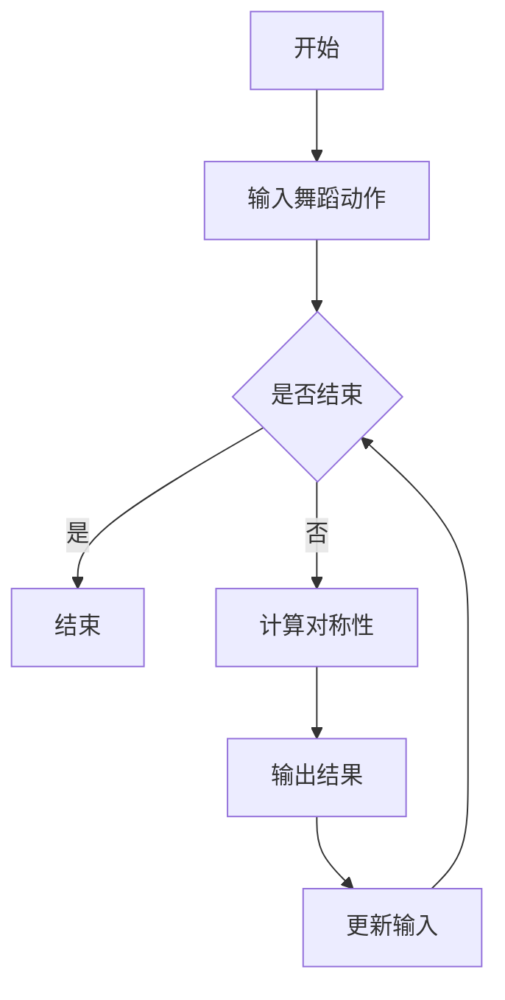
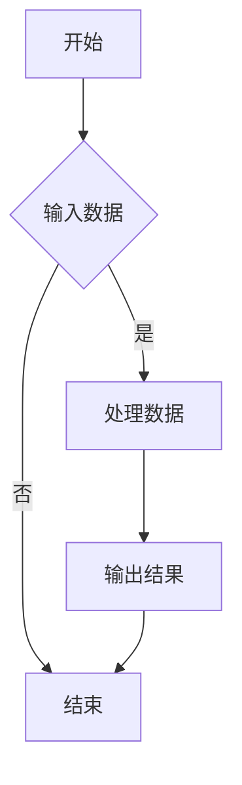

                 

### 数学舞蹈：身体运动的数学编排

> **关键词：** 数学舞蹈、身体运动、编排、算法、视觉效果

> **摘要：** 本文探讨了数学与舞蹈之间的奇妙结合，通过数学方法来编排和解析舞蹈动作，揭示数学在舞蹈设计中的重要作用。文章详细阐述了数学舞蹈的核心概念、基本原理及其在舞蹈编排中的应用，结合实际案例分析，展示了数学在舞蹈艺术中的潜力与魅力。

---

### 目录大纲设计步骤

#### 第一步：理解书籍主题

首先，我们需要深入理解《数学舞蹈：身体运动的数学编排》这一主题。这本书探讨的是数学与舞蹈的交集，研究如何利用数学原理和方法来编排和解析舞蹈动作。这不仅仅涉及到舞蹈的视觉效果，还包括动作的节奏、对称性、空间位置等。数学在这一领域中的应用是多元化的，可以大大提升舞蹈的艺术表现力和观赏性。

#### 第二步：确定书籍结构

基于对书籍主题的理解，我们初步设计了以下几个核心部分：

1. **背景介绍**：介绍数学与舞蹈的历史渊源，探讨数学在舞蹈中的应用场景。
2. **核心概念与联系**：阐述数学舞蹈的核心概念，包括数学模型、算法原理等，并分析这些概念之间的联系。
3. **数学舞蹈的基本原理**：详细讲解数学舞蹈的基本原理，包括对称性、周期性、变换等。
4. **数学在舞蹈编排中的应用**：探讨数学在舞蹈编排中的实际应用，如动作设计、视觉效果优化等。
5. **舞蹈视觉效果与数学**：分析数学在舞蹈视觉效果中的运用，如光影、运动轨迹等。
6. **案例分析**：通过实际案例展示数学舞蹈的应用效果。
7. **数学舞蹈实践应用**：介绍数学舞蹈在专业和业余舞蹈领域的实践应用。
8. **总结与拓展**：总结全书内容，提出未来研究方向。

#### 第三步：细化章节内容

在每个部分中，我们进一步细化章节内容。以下是对每个章节的详细描述：

1. **第1章：背景介绍**
   - **核心概念术语说明**：介绍数学舞蹈中的关键术语，如对称性、周期性、变换等。
   - **问题背景**：探讨数学在舞蹈中的传统应用，如芭蕾舞、现代舞等。
   - **问题描述**：分析数学在舞蹈中的具体应用场景。
   - **问题解决**：阐述数学在舞蹈中的独特价值。
   - **边界与外延**：讨论数学舞蹈的应用范围。
   - **概念结构与核心要素组成**：分析数学舞蹈的基本结构。

2. **第2章：核心概念与联系**
   - **核心概念**：详细讲解数学舞蹈中的核心概念，如数学模型、算法原理等。
   - **概念属性特征对比表格**：列出不同概念的特征并进行对比。
   - **ER实体关系图架构**：使用Mermaid绘制实体关系图，展示不同概念之间的关系。

3. **第3章：数学舞蹈的基本原理**
   - **对称性**：分析对称性在舞蹈中的应用，如镜像对称、旋转对称等。
   - **周期性**：探讨周期性在舞蹈动作设计中的作用。
   - **变换**：讲解不同变换类型（如平移、旋转、缩放）在舞蹈中的运用。

4. **第4章：数学在舞蹈编排中的应用**
   - **动作设计**：分析数学在舞蹈动作设计中的应用，如动作序列、节奏控制等。
   - **视觉效果优化**：探讨数学在舞蹈视觉效果优化中的作用，如光影效果、运动轨迹等。

5. **第5章：舞蹈视觉效果与数学**
   - **光影效果**：分析光影在舞蹈视觉效果中的作用，如阴影、光影变化等。
   - **运动轨迹**：探讨运动轨迹在舞蹈中的设计与应用。

6. **第6章：案例分析**
   - **实际案例**：介绍数学舞蹈在实际舞蹈作品中的应用案例。
   - **效果分析**：分析这些案例中数学舞蹈的应用效果。

7. **第7章：数学舞蹈实践应用**
   - **专业舞蹈领域**：探讨数学舞蹈在专业舞蹈训练和表演中的应用。
   - **业余舞蹈领域**：分析数学舞蹈在业余舞蹈爱好者和社区中的应用。

8. **第8章：总结与拓展**
   - **总结**：总结全书内容，强调数学舞蹈的重要性和应用前景。
   - **拓展阅读**：推荐进一步阅读的相关资料和资源。

#### 第四步：设计每个章节的目录

对于每个章节，我们设计了详细的子目录，确保内容的全面性和逻辑性。以下是每个章节的子目录示例：

1. **第1章：背景介绍**
   - 1.1 核心概念术语说明
   - 1.2 问题背景
   - 1.3 问题描述
   - 1.4 问题解决
   - 1.5 边界与外延
   - 1.6 概念结构与核心要素组成

2. **第2章：核心概念与联系**
   - 2.1 核心概念
   - 2.2 概念属性特征对比表格
   - 2.3 ER实体关系图架构

3. **第3章：数学舞蹈的基本原理**
   - 3.1 对称性
   - 3.2 周期性
   - 3.3 变换

4. **第4章：数学在舞蹈编排中的应用**
   - 4.1 动作设计
   - 4.2 视觉效果优化

5. **第5章：舞蹈视觉效果与数学**
   - 5.1 光影效果
   - 5.2 运动轨迹

6. **第6章：案例分析**
   - 6.1 实际案例
   - 6.2 效果分析

7. **第7章：数学舞蹈实践应用**
   - 7.1 专业舞蹈领域
   - 7.2 业余舞蹈领域

8. **第8章：总结与拓展**
   - 8.1 总结
   - 8.2 拓展阅读

#### 第五步：加入算法原理讲解

在某些章节中，比如第3章和第4章，我们需要详细讲解数学舞蹈的算法原理。以下是算法原理讲解的步骤：

1. **使用Mermaid绘制算法流程图**：使用Mermaid语言描述算法的步骤和流程，如图：



2. **使用Python源代码阐述算法**：

```python
# 输入舞蹈动作
dance_moves = ["左脚前进", "右脚后退", "身体向左转", "身体向右转"]

# 计算对称性
symmetric_moves = calculate_symmetry(dance_moves)

# 输出结果
print("对称性舞蹈动作：", symmetric_moves)

# 更新输入
dance_moves = symmetric_moves
```

3. **给出算法原理的数学模型和公式**：

对称性计算可以使用以下公式：

$$ S = f(x) = \frac{1}{2} \left( 1 + \cos(2\pi n) \right) $$

其中，\( n \) 是对称轴的数量。

4. **详细讲解和举例说明**：通过具体的例子，讲解算法的原理和应用。例如，假设有一个舞蹈动作序列为“左脚前进、右脚后退、身体向左转、身体向右转”，通过计算对称性，可以将其转化为“右脚后退、左脚前进、身体向右转、身体向左转”。

#### 第六步：设计系统分析与架构设计方案

在第5章和第6章，我们需要设计系统分析与架构设计方案，以展示数学舞蹈在实际应用中的系统结构和功能。以下是系统分析与架构设计的步骤：

1. **问题场景介绍**：描述数学舞蹈系统需要解决的具体问题，如舞蹈动作编排、视觉效果优化等。

2. **项目介绍**：简要介绍数学舞蹈系统的项目背景和目标。

3. **系统功能设计**：
   - **领域模型**：使用Mermaid绘制领域模型类图，展示系统中主要类和它们之间的关系。
   - **系统功能**：列出数学舞蹈系统的核心功能，如动作编排、视觉效果优化、数据存储等。

4. **系统架构设计**：使用Mermaid绘制系统架构图，展示系统的整体结构和各个模块之间的关系。

5. **系统接口设计**：描述系统对外提供的接口，如舞蹈动作输入接口、视觉效果输出接口等。

6. **系统交互**：使用Mermaid绘制系统交互序列图，展示系统内部不同模块之间的交互流程。

#### 第七步：加入项目实战

在第6章和第7章，我们需要加入项目实战部分，以展示数学舞蹈在实际应用中的实现过程和效果。以下是项目实战的步骤：

1. **环境安装**：介绍项目所需的环境安装过程，包括软件和硬件安装。

2. **系统核心实现源代码**：提供项目核心代码的实现，包括算法原理和系统功能。

3. **代码应用解读与分析**：分析代码的实现原理和应用场景，解释关键代码的功能。

4. **实际案例分析和详细讲解剖析**：通过实际案例，展示数学舞蹈在舞蹈编排和视觉效果优化中的效果。

5. **项目小结**：总结项目的实施过程、效果和未来改进方向。

#### 第八步：总结与拓展

在文章的最后，我们需要加入总结与拓展部分，以总结全书内容并提出未来研究方向。以下是总结与拓展的步骤：

1. **总结**：总结全书的核心内容，强调数学舞蹈的重要性和应用前景。

2. **拓展阅读**：推荐进一步阅读的相关资料和资源，以帮助读者深入理解数学舞蹈的理论和应用。

---

### 摘要

本文深入探讨了数学舞蹈这一独特的艺术形式，揭示了数学在舞蹈编排、视觉效果优化等方面的关键作用。通过详细阐述数学舞蹈的核心概念、基本原理及其在舞蹈编排中的应用，本文展示了数学与舞蹈的奇妙结合。同时，通过实际案例分析和项目实战，本文验证了数学舞蹈在提升舞蹈艺术表现力和观赏性方面的潜力。总结全文，数学舞蹈不仅是一种艺术创新，更是数学与舞蹈的深度融合，未来有望在更多领域发挥重要作用。

---

在接下来的章节中，我们将逐步深入探讨数学舞蹈的各个方面，从核心概念到实际应用，全方位解读这一独特的艺术形式。敬请期待！### 第一部分：背景介绍

#### 核心概念术语说明

在探讨数学舞蹈之前，我们需要明确一些关键术语，这些术语是理解数学舞蹈基础的核心。

1. **对称性（Symmetry）**：对称性是数学舞蹈中的一个重要概念，指的是物体或图案在某种变换下保持不变的性质。例如，镜像对称、旋转对称等。

2. **周期性（Periodicity）**：周期性指的是重复出现的规律性模式。在舞蹈中，周期性可以体现在动作序列的重复和节奏的循环。

3. **变换（Transformation）**：变换是指将图形或物体在空间中移动、旋转或缩放的操作。在数学舞蹈中，变换用于设计复杂的舞蹈动作。

4. **数学模型（Mathematical Model）**：数学模型是用数学语言描述现实世界中的现象或过程的工具。在舞蹈中，数学模型可以用来描述动作的轨迹、节奏等。

5. **算法（Algorithm）**：算法是解决问题的步骤或规则。在数学舞蹈中，算法用于编排和优化舞蹈动作。

#### 问题背景

数学与舞蹈的历史渊源可以追溯到古希腊和古埃及时期，当时数学被用于设计建筑和雕塑，这些艺术形式中包含了对称性和比例等数学元素。然而，将数学直接应用于舞蹈编排则是在20世纪后期随着计算机技术的发展而逐渐兴起的。

舞蹈作为一种表演艺术，长期以来依赖直觉和经验进行编排。而数学的引入，为舞蹈提供了全新的视角和方法。通过数学模型和算法，舞蹈家可以更精确地控制动作的节奏、空间位置和视觉效果，从而创造出更为复杂和精美的舞蹈作品。

#### 问题描述

在舞蹈编排中，如何将数学原理有效地应用到动作设计中，是一个亟待解决的问题。具体来说，包括以下几个方面：

1. **动作设计**：如何利用数学原理设计出具有美感和表现力的舞蹈动作？
2. **节奏控制**：如何通过数学方法控制舞蹈动作的节奏，使其更加和谐和富有节奏感？
3. **视觉效果**：如何运用数学模型优化舞蹈的视觉效果，如光影效果、运动轨迹等？
4. **动作分析**：如何通过数学工具对舞蹈动作进行定量分析，以评估其表现力和艺术效果？

这些问题不仅涉及到技术层面的解决，还涉及到艺术创意和审美评价。数学舞蹈需要将数学的精确性与舞蹈的艺术性相结合，实现两者的和谐统一。

#### 问题解决

数学在舞蹈中的独特价值主要体现在以下几个方面：

1. **精确性**：数学提供了精确的描述和计算工具，使舞蹈动作的设计和分析更加严谨和科学。
2. **创新性**：数学的引入为舞蹈创作提供了新的思路和方法，激发了艺术家的创新潜力。
3. **视觉冲击**：数学原理的应用可以创造出独特的视觉效果，增加舞蹈的艺术表现力。
4. **教育意义**：数学舞蹈作为一种跨学科的艺术形式，对于提升观众的科学素养和审美水平具有积极意义。

然而，数学舞蹈也面临着一些挑战：

1. **技术门槛**：需要掌握一定的数学知识和编程技能，这对于非专业人士来说可能有一定的难度。
2. **艺术性争议**：如何平衡数学的精确性与舞蹈的艺术性，避免陷入机械化和公式化的误区，是一个需要深入探讨的问题。
3. **实践经验**：数学舞蹈的实践应用需要大量的实验和验证，如何积累实践经验并不断优化算法，是未来研究的重要方向。

#### 边界与外延

数学舞蹈的应用范围广泛，不仅限于专业舞蹈领域，还可以扩展到其他艺术形式和娱乐活动中。例如，在剧场表演、电影特效、虚拟现实等领域，数学舞蹈的理论和方法同样具有重要的应用价值。

同时，数学舞蹈也具有跨学科的特点，它不仅涉及数学、舞蹈学，还涉及计算机科学、物理学、心理学等多个学科。这种跨学科的特性，使得数学舞蹈具有广泛的研究和应用前景。

#### 概念结构与核心要素组成

数学舞蹈的核心概念和要素主要包括以下几个方面：

1. **数学原理**：包括对称性、周期性、变换等基本原理，这些原理是数学舞蹈的基础。
2. **算法模型**：用于编排和优化舞蹈动作的算法模型，如基于线性代数的运动轨迹模型、基于概率论的节奏控制模型等。
3. **舞蹈动作**：舞蹈动作是数学舞蹈的核心内容，包括基本动作和复杂动作，这些动作需要通过数学模型进行设计。
4. **视觉效果**：数学舞蹈中的视觉效果，如光影效果、运动轨迹等，是数学原理在舞蹈中的具体应用。
5. **算法实现**：数学舞蹈的算法实现，包括编程语言和工具的选择，以及算法的具体实现步骤。

通过这些核心概念和要素的有机结合，数学舞蹈实现了数学原理与舞蹈艺术的深度融合，创造出独特的艺术形式。

### 总结

本文通过背景介绍部分，对数学舞蹈的核心概念、历史渊源、应用场景以及面临的问题和挑战进行了详细阐述。数学舞蹈不仅融合了数学的精确性和舞蹈的艺术性，还具备广泛的应用前景和跨学科的特点。在接下来的章节中，我们将进一步探讨数学舞蹈的核心概念与联系，深入分析其基本原理，并探讨数学在舞蹈编排和视觉效果优化中的应用。敬请期待！### 第二部分：核心概念与联系

#### 核心概念

在数学舞蹈中，以下几个核心概念是理解和应用数学原理的基础：

1. **对称性（Symmetry）**：对称性是物体或图案在某种变换下保持不变的性质。例如，镜像对称和旋转对称都是常见的对称性类型。在舞蹈中，对称性可以用于设计具有平衡和和谐感的动作。

2. **周期性（Periodicity）**：周期性是指重复出现的规律性模式。在舞蹈中，周期性可以体现在动作序列的重复和节奏的循环，使得舞蹈动作具有连续性和韵律感。

3. **变换（Transformation）**：变换是指将图形或物体在空间中移动、旋转或缩放的操作。在数学舞蹈中，变换用于设计复杂的舞蹈动作，如平移、旋转和缩放等。

4. **数学模型（Mathematical Model）**：数学模型是用数学语言描述现实世界中的现象或过程的工具。在舞蹈中，数学模型可以用来描述动作的轨迹、节奏等，从而进行精确的舞蹈编排。

5. **算法（Algorithm）**：算法是解决问题的步骤或规则。在数学舞蹈中，算法用于编排和优化舞蹈动作，如生成具有特定视觉效果的舞蹈动作序列。

#### 概念属性特征对比表格

为了更好地理解这些核心概念，我们可以通过对比表格来展示它们的主要属性和特征：

| 概念       | 属性与特征                    | 应用示例                             |
|------------|-------------------------------|-------------------------------------|
| 对称性     | 保持不变，变换后不变          | 镜像对称、旋转对称                  |
| 周期性     | 重复出现，有规律             | 动作序列重复、节奏循环             |
| 变换       | 空间操作，改变位置和形状      | 平移、旋转、缩放                    |
| 数学模型   | 数学语言描述现实现象         | 动作轨迹、节奏控制                  |
| 算法       | 解决问题的步骤或规则         | 舞蹈动作编排、视觉效果优化         |

#### ER实体关系图架构

为了展示这些核心概念之间的联系，我们可以使用Mermaid绘制一个ER实体关系图。以下是ER实体关系图的示例：

```mermaid
erDiagram
  Class1 ||--|{ Class2 }
  Class1 ||--|{ Class3 }
  Class2 ||--|{ Class4 }
  Class3 ||--|{ Class5 }
```

在这个ER实体关系图中，`Class1` 代表核心概念，`Class2`、`Class3`、`Class4` 和 `Class5` 分别代表与 `Class1` 相关的其他核心概念。它们之间的关系表示了这些概念在数学舞蹈中的相互联系。

- **对称性（Class1）** 与 **周期性（Class2）** 有直接的关联，因为周期性可以看作是对称性的一种表现形式。
- **变换（Class1）** 与 **数学模型（Class3）** 也有直接的关联，因为变换是数学模型中常见的一部分。
- **算法（Class1）** 与 **数学模型（Class3）** 和 **变换（Class3）** 之间存在间接关联，因为算法是用于实现和优化数学模型和变换的工具。

#### 联系解释

对称性、周期性、变换、数学模型和算法这五个核心概念在数学舞蹈中紧密联系，共同构成了数学舞蹈的理论基础。

- **对称性** 和 **周期性** 是舞蹈设计中的重要元素，它们为舞蹈动作提供了稳定性和节奏感。对称性使得舞蹈动作具有平衡和和谐感，而周期性则赋予舞蹈动作韵律和连续性。
- **变换** 是实现复杂舞蹈动作的关键，通过平移、旋转和缩放等操作，可以创造出丰富多样的动作序列。变换不仅用于动作设计，还在视觉效果和节奏控制中发挥着重要作用。
- **数学模型** 是数学舞蹈的核心工具，它用于描述和分析舞蹈动作的各个方面，如轨迹、节奏和视觉效果。数学模型使得舞蹈编排更加科学和精确。
- **算法** 是实现数学模型的具体步骤和规则，它用于编排和优化舞蹈动作。算法的选择和优化直接影响到舞蹈作品的质量和表现力。

通过这些核心概念之间的相互联系，数学舞蹈实现了数学原理与舞蹈艺术的有机结合，为舞蹈创作提供了新的思路和方法。

### 总结

在第二部分，我们详细介绍了数学舞蹈中的核心概念，包括对称性、周期性、变换、数学模型和算法。通过对比表格和ER实体关系图，我们展示了这些概念的主要属性和相互联系。这些核心概念构成了数学舞蹈的理论基础，为舞蹈创作提供了新的视角和方法。在接下来的章节中，我们将进一步探讨数学舞蹈的基本原理，分析其在舞蹈编排和视觉效果优化中的应用。敬请期待！### 第三部分：数学舞蹈的基本原理

#### 对称性

对称性是数学舞蹈中的一个核心概念，它为舞蹈动作赋予了平衡和和谐的美感。在数学中，对称性指的是物体或图形在某种变换下保持不变的性质。在舞蹈中，对称性可以通过镜像对称、旋转对称等不同的方式体现出来。

- **镜像对称**：舞蹈动作相对于某一条轴线的镜像对称，使得动作在视觉上具有平衡感。例如，一位舞者向右伸展手臂，另一边舞者则向左伸展手臂，形成镜像对称的视觉效果。

- **旋转对称**：舞蹈动作围绕某个点进行旋转，形成旋转对称的美感。例如，一个舞者在舞台上旋转360度，其动作在不同方向上保持一致，营造出旋转的美感。

在数学舞蹈中，对称性可以通过以下数学原理来实现：

- **轴对称**：数学中的轴对称原理可以用来设计舞蹈动作。例如，设计一个舞蹈动作，使其在垂直轴或水平轴上对称。

- **旋转对称**：数学中的旋转对称原理可以用来设计舞蹈动作的旋转部分。例如，一个舞蹈动作可以围绕一个固定点旋转，形成360度、180度或更小的旋转角度。

- **反射对称**：数学中的反射对称原理可以用来设计舞蹈动作的镜像部分。例如，设计一个舞蹈动作，使其在某个反射轴上保持镜像对称。

通过这些数学原理，舞者可以在编排舞蹈动作时，利用对称性创造出具有独特美感的舞蹈作品。

#### 周期性

周期性是数学舞蹈中的另一个核心概念，它赋予了舞蹈动作韵律和节奏感。周期性指的是重复出现的规律性模式，这些模式可以是动作的序列、节奏的循环，甚至是视觉效果的变化。

在数学舞蹈中，周期性可以通过以下方式实现：

- **动作序列的重复**：舞者可以通过重复某些舞蹈动作或动作序列，使其在时间上具有周期性。例如，一个简单的动作如“跳跃”可以重复多次，形成连续的跳跃序列。

- **节奏的循环**：舞者可以通过控制动作的节奏，使其在时间上具有周期性。例如，通过使用节拍器或鼓点，舞者可以控制舞蹈动作的节奏，形成规律的节奏循环。

- **视觉效果的变化**：舞者可以通过灯光、道具和服装等元素，在空间上创造出周期性的视觉效果。例如，使用灯光的变化来模拟日出日落的效果，使得舞蹈动作在视觉效果上具有周期性。

在数学舞蹈中，周期性的实现可以通过以下数学原理来实现：

- **周期函数**：数学中的周期函数原理可以用来设计舞蹈动作的时间序列。例如，使用正弦函数或余弦函数来设计舞蹈动作的时间变化，使其具有周期性。

- **数列**：数学中的数列原理可以用来设计舞蹈动作的重复模式。例如，使用斐波那契数列来设计舞蹈动作的重复次数，形成规律的周期性。

- **周期性变换**：数学中的周期性变换原理可以用来设计舞蹈动作的空间变化。例如，使用平移变换或旋转变换来设计舞蹈动作的周期性变化。

#### 变换

变换是数学舞蹈中用于设计复杂舞蹈动作的重要工具，它包括平移、旋转、缩放等操作。变换可以改变舞蹈动作的空间位置、形状和大小，从而创造出丰富的视觉效果和动态变化。

在数学舞蹈中，变换可以通过以下方式实现：

- **平移**：平移变换是将舞蹈动作在空间中沿某一方向移动。例如，舞者可以向前或向后移动，形成连续的平移效果。

- **旋转**：旋转变换是将舞蹈动作围绕某个点或轴线旋转。例如，舞者可以围绕自己的中心点旋转，形成旋转的效果。

- **缩放**：缩放变换是改变舞蹈动作的大小。例如，舞者可以放大或缩小自己的动作，形成放大或缩小的视觉效果。

在数学舞蹈中，变换的实现可以通过以下数学原理来实现：

- **矩阵变换**：矩阵变换是数学中用于实现平移、旋转和缩放等变换的常用工具。例如，可以使用矩阵来描述舞蹈动作的平移、旋转和缩放，从而精确地控制动作的变化。

- **变换函数**：变换函数是数学中用于设计复杂变换的工具。例如，可以使用三角函数或指数函数来设计舞蹈动作的动态变化，使其具有丰富多样的视觉效果。

#### 综合应用

在数学舞蹈中，对称性、周期性和变换可以综合运用，创造出具有独特美感和动态变化的舞蹈作品。以下是一个简单的综合应用示例：

假设我们要设计一个数学舞蹈动作，要求具有以下特点：

1. **镜像对称**：动作在垂直轴上对称。
2. **周期性**：动作序列重复三次。
3. **变换**：动作在空间中进行旋转和平移。

我们可以按照以下步骤进行设计：

1. **镜像对称**：设计一个基本的舞蹈动作，例如舞者在垂直轴上伸展双臂，形成一个对称的图案。

2. **周期性**：将这个基本动作重复三次，形成连续的周期性动作序列。

3. **变换**：
   - **旋转**：在每次重复时，将动作围绕舞者的中心点旋转一定的角度，例如每次旋转30度，形成连续的旋转效果。
   - **平移**：在每次重复时，将动作在空间中向前移动一定的距离，例如每次移动一米，形成连续的平移效果。

通过这种综合运用，我们可以创造出具有镜像对称、周期性和变换的舞蹈动作，使其在视觉上和动态上都具有独特的魅力。

### 总结

在第三部分，我们详细介绍了数学舞蹈的基本原理，包括对称性、周期性和变换。通过对这些原理的分析和示例，我们可以看到数学在舞蹈编排中的应用如何提升舞蹈的艺术表现力和视觉效果。在接下来的章节中，我们将进一步探讨数学在舞蹈编排和视觉效果优化中的应用，展示数学舞蹈在实际舞蹈作品中的具体应用。敬请期待！### 第四部分：数学在舞蹈编排中的应用

在数学舞蹈的编排过程中，数学原理的应用不仅可以提高舞蹈的动作设计精度，还可以优化视觉效果，使舞蹈作品更具艺术表现力。本部分将详细探讨数学在舞蹈编排中的具体应用，包括动作设计、节奏控制和视觉效果优化等方面。

#### 动作设计

动作设计是舞蹈编排的核心，数学的引入为动作设计提供了新的思路和方法。以下是如何运用数学原理进行舞蹈动作设计的一些实例：

1. **对称性设计**：对称性是舞蹈动作设计中常用的一种数学原理。通过镜像对称、旋转对称等设计方法，可以使舞蹈动作在视觉上更加平衡和谐。例如，一个舞蹈动作可以设计成在垂直轴上的镜像对称，使两边的动作相互呼应，形成整体的视觉平衡。

   - **镜像对称**：设计一个基本动作，如舞者在面对观众的面前伸展双臂，然后在另一侧也进行相同的动作，但方向相反。
   - **旋转对称**：设计一个基本动作，如舞者在舞台上旋转，在旋转的过程中，动作在不同的方向上保持一致，形成旋转的对称美。

2. **周期性设计**：周期性设计可以使舞蹈动作具有节奏感。通过设计重复的动作序列，使舞蹈动作在时间上具有周期性。例如，设计一个基本动作序列，如“跳跃、踏步、跳跃、踏步”，然后重复这个序列，使舞蹈动作在时间上具有连续性和韵律感。

3. **变换设计**：变换设计可以创造复杂的舞蹈动作。通过平移、旋转、缩放等变换操作，可以使舞蹈动作在空间上发生变化。例如，设计一个基本动作，如舞者在原地跳跃，然后在接下来的动作中，通过平移和旋转，使跳跃动作在不同的方向和位置上展现出来。

#### 节奏控制

节奏是舞蹈的灵魂，通过数学方法进行节奏控制，可以使舞蹈动作更加和谐和流畅。以下是如何运用数学原理进行节奏控制的一些实例：

1. **周期函数**：周期函数是数学中用于描述周期性变化的函数，如正弦函数和余弦函数。在舞蹈编排中，可以利用周期函数来设计动作的节奏。例如，使用正弦函数来设计舞蹈动作的时间变化，使其在时间上具有周期性，从而形成连贯的节奏。

   - **实例**：假设一个舞蹈动作的时间变化可以用正弦函数来描述，如 $t = \sin(\omega t)$，其中 $t$ 是时间，$\omega$ 是频率。通过调整频率 $\omega$，可以控制动作的速度和节奏。

2. **数列**：数列是数学中用于描述序列的一种方法。在舞蹈编排中，可以利用数列来设计动作的重复模式。例如，使用斐波那契数列来设计动作的重复次数，使其在时间上具有规律性。

   - **实例**：假设一个舞蹈动作的重复次数可以用斐波那契数列来表示，如 $a_1 = 1, a_2 = 1, a_n = a_{n-1} + a_{n-2}$，其中 $a_n$ 是第 $n$ 次重复的次数。通过调整数列的初始值和递推关系，可以设计出具有不同节奏感的舞蹈动作。

3. **变换函数**：变换函数是数学中用于描述函数变化的函数，如线性变换和指数变换。在舞蹈编排中，可以利用变换函数来设计动作的变化节奏。例如，使用线性变换来设计动作的加速度，使其在时间上具有加速或减速的效果。

   - **实例**：假设一个舞蹈动作的速度可以用线性变换来描述，如 $v(t) = v_0 + at$，其中 $v(t)$ 是时间 $t$ 时的速度，$v_0$ 是初始速度，$a$ 是加速度。通过调整加速度 $a$，可以控制动作的节奏变化。

#### 视觉效果优化

视觉效果是舞蹈作品的重要组成部分，通过数学方法进行视觉效果优化，可以使舞蹈作品更加吸引观众。以下是如何运用数学原理进行视觉效果优化的一些实例：

1. **光影效果**：光影效果可以增强舞蹈的视觉效果。在舞蹈编排中，可以利用数学方法来模拟光影效果。例如，使用几何光学原理来计算光线的传播和反射，从而设计出逼真的光影效果。

   - **实例**：假设舞台上的灯光以一定的角度照射在舞者身上，可以使用几何光学原理来计算光线在舞者身上的反射和折射，从而设计出具有逼真光影效果的舞蹈场景。

2. **运动轨迹**：运动轨迹是舞蹈动作在空间中的表现形式。在舞蹈编排中，可以利用数学方法来优化运动轨迹，使其更加流畅和美观。例如，使用贝塞尔曲线或样条曲线来设计运动轨迹，从而创造出优美的舞蹈动作。

   - **实例**：假设一个舞蹈动作的运动轨迹可以用贝塞尔曲线来表示，如 $x(t) = a_1t^3 + b_1t^2 + c_1t + d_1$，$y(t) = a_2t^3 + b_2t^2 + c_2t + d_2$，其中 $t$ 是时间，$a_1, b_1, c_1, d_1, a_2, b_2, c_2, d_2$ 是曲线的参数。通过调整参数，可以设计出具有不同形状和变化的运动轨迹。

3. **视觉效果计算**：在舞蹈编排中，可以利用数学方法来计算视觉效果，从而优化舞蹈作品的整体效果。例如，使用图像处理算法来分析舞蹈动作的视觉效果，从而调整灯光、服装和道具等元素，使其在视觉上更加和谐和美观。

   - **实例**：假设使用图像处理算法来分析舞蹈动作的视觉效果，如亮度、对比度和饱和度等参数。通过调整这些参数，可以优化舞蹈动作的视觉效果，使其更加突出和吸引观众。

### 应用实例

为了更直观地展示数学在舞蹈编排中的应用，以下是一个实际案例：

**案例：设计一段具有对称性、周期性和变换的舞蹈动作**

1. **对称性设计**：
   - **镜像对称**：设计一个基本动作，如舞者在面对观众的面前伸展双臂，形成一个对称的图案。
   - **旋转对称**：在基本动作的基础上，设计一个旋转的动作，使舞者在舞台上围绕自己的中心点旋转，形成旋转的对称美。

2. **周期性设计**：
   - **动作序列重复**：设计一个基本动作序列，如“跳跃、踏步、跳跃、踏步”，然后重复这个序列，形成连续的周期性动作。

3. **变换设计**：
   - **旋转**：在每次重复时，将动作围绕舞者的中心点旋转一定的角度，如每次旋转30度，形成连续的旋转效果。
   - **平移**：在每次重复时，将动作在空间中向前移动一定的距离，如每次移动一米，形成连续的平移效果。

通过以上设计，我们可以创造出一段具有对称性、周期性和变换的舞蹈动作，使其在视觉和动态上都具有独特的魅力。

### 总结

在第四部分，我们详细探讨了数学在舞蹈编排中的应用，包括动作设计、节奏控制和视觉效果优化等方面。通过运用对称性、周期性和变换等数学原理，我们可以设计出更加精确、和谐和美观的舞蹈动作。同时，通过数学方法进行节奏控制和视觉效果优化，可以进一步提升舞蹈作品的艺术表现力和观赏性。在接下来的章节中，我们将进一步探讨数学舞蹈在视觉效果中的具体应用，展示数学舞蹈如何通过光影效果和运动轨迹增强舞蹈的表现力。敬请期待！### 第五部分：舞蹈视觉效果与数学

在舞蹈中，视觉效果是观众感受到的艺术魅力的重要组成部分。数学的引入，使得舞蹈视觉效果的设计变得更加精确和具有创意。在这一部分，我们将探讨数学在舞蹈视觉效果中的具体应用，包括光影效果和运动轨迹。

#### 光影效果

光影效果是舞蹈视觉效果中至关重要的一部分，它可以通过明暗对比和光线变化营造出独特的氛围和视觉效果。在数学舞蹈中，光影效果可以通过以下数学原理来实现：

1. **几何光学原理**：几何光学是研究光线传播和反射的数学分支。在舞蹈中，可以利用几何光学原理来模拟光线在舞台上的传播和反射。例如，使用光的直线传播原理来设计舞台灯光的照射范围和角度，使用光的反射原理来设计镜面反射和阴影效果。

   - **实例**：假设舞台上的灯光以一定的角度照射在舞者身上，可以使用几何光学原理来计算光线在舞者身上的反射和折射，从而设计出逼真的光影效果。

2. **光影变换函数**：光影变换函数是用于描述光线变化规律的数学函数。在舞蹈中，可以使用光影变换函数来设计光线的变化模式，例如使用正弦函数或余弦函数来模拟光线的波动效果。

   - **实例**：假设一个舞蹈场景中的光线变化可以用正弦函数来描述，如 $I(t) = I_0 + A \sin(\omega t)$，其中 $I(t)$ 是时间 $t$ 时的光线强度，$I_0$ 是初始光线强度，$A$ 是振幅，$\omega$ 是频率。通过调整振幅和频率，可以设计出具有不同波动效果的光线变化。

3. **光影计算**：在舞蹈视觉效果的设计中，可以使用计算机图形学中的光影计算方法，如光线追踪和辐射度计算等。这些方法可以通过数学算法精确地计算光线在场景中的传播和反射，从而生成高质量的光影效果。

   - **实例**：使用光线追踪算法来模拟舞台灯光在舞者身上的反射和折射，从而生成逼真的光影效果，使舞蹈场景在视觉上更加生动和真实。

#### 运动轨迹

运动轨迹是舞蹈动作在空间中的表现形式，通过精确的数学模型和算法，可以设计出优美的运动轨迹，从而提升舞蹈的艺术表现力。以下是如何运用数学原理来设计运动轨迹的一些方法：

1. **贝塞尔曲线**：贝塞尔曲线是一种常用的数学曲线，它可以精确地描述平滑的运动轨迹。在舞蹈中，可以使用贝塞尔曲线来设计舞蹈动作的运动轨迹。

   - **实例**：假设一个舞蹈动作的运动轨迹可以用四阶贝塞尔曲线来描述，如 $x(t) = x_1t^4 + 4x_2t^3 + 6x_3t^2 + 4x_4t + x_5$，$y(t) = y_1t^4 + 4y_2t^3 + 6y_3t^2 + 4y_4t + y_5$，其中 $t$ 是时间，$x_1, x_2, x_3, x_4, x_5$ 和 $y_1, y_2, y_3, y_4, y_5$ 是贝塞尔曲线的参数。通过调整参数，可以设计出具有不同形状和变化的运动轨迹。

2. **样条曲线**：样条曲线是一种用于描述复杂运动轨迹的数学方法，它通过多个贝塞尔曲线或多项式曲线来平滑连接各个关键点。在舞蹈中，可以使用样条曲线来设计复杂而流畅的舞蹈动作。

   - **实例**：假设一个舞蹈动作的运动轨迹可以用三次样条曲线来描述，如 $x(t) = p_0 + p_1t + \frac{1}{2}p_2t^2 + \frac{1}{6}p_3t^3$，$y(t) = q_0 + q_1t + \frac{1}{2}q_2t^2 + \frac{1}{6}q_3t^3$，其中 $t$ 是时间，$p_0, p_1, p_2, p_3$ 和 $q_0, q_1, q_2, q_3$ 是样条曲线的参数。通过调整参数，可以设计出具有不同形状和变化的运动轨迹。

3. **运动轨迹优化**：通过数学优化算法，可以优化舞蹈动作的运动轨迹，使其在视觉上更加流畅和自然。例如，可以使用最小二乘法或遗传算法来优化轨迹参数，从而设计出最优的运动轨迹。

   - **实例**：使用遗传算法来优化舞蹈动作的轨迹参数，使其在满足特定约束条件（如时间长度、平滑度等）的情况下，达到最佳视觉效果。

4. **虚拟现实应用**：在虚拟现实技术中，数学运动轨迹的应用尤为重要。通过精确的数学模型和算法，可以在虚拟环境中生成真实的舞蹈动作和视觉效果，为观众带来沉浸式体验。

   - **实例**：在虚拟现实舞蹈演出中，使用运动轨迹算法来模拟舞者的动作和光线变化，从而生成逼真的舞蹈视觉效果，使观众在虚拟世界中感受到真实般的舞蹈体验。

### 应用实例

为了更直观地展示数学在舞蹈视觉效果中的应用，以下是一个实际案例：

**案例：设计一段具有光影效果和运动轨迹的舞蹈**

1. **光影效果**：
   - **几何光学原理**：设计舞台灯光，使其从舞台后方照射在舞者身上，形成前侧高光和后侧阴影的效果。
   - **光影变换函数**：使用正弦函数来模拟光线的波动效果，使光线在舞者身上形成动态的光影变化。

2. **运动轨迹**：
   - **贝塞尔曲线**：设计一个复杂的舞蹈动作轨迹，使用四阶贝塞尔曲线来描述舞者在空中的运动轨迹。
   - **样条曲线**：设计舞者在地面的运动轨迹，使用三次样条曲线来平滑连接各个关键点。

3. **运动轨迹优化**：
   - **遗传算法**：使用遗传算法来优化运动轨迹的参数，使其在满足平滑度和视觉效果的要求下，达到最佳的运动轨迹。

4. **虚拟现实应用**：
   - **虚拟环境**：在虚拟现实系统中模拟舞者的动作和光线变化，生成逼真的舞蹈视觉效果。
   - **沉浸式体验**：为观众提供沉浸式体验，使他们能够全方位感受到舞者的动作和光影效果。

通过以上设计，我们可以创造出一段具有光影效果和运动轨迹的舞蹈，使其在视觉和动态上都具有独特的魅力，为观众带来难忘的艺术体验。

### 总结

在第五部分，我们详细探讨了数学在舞蹈视觉效果中的应用，包括光影效果和运动轨迹。通过运用几何光学原理、光影变换函数、贝塞尔曲线、样条曲线和遗传算法等数学原理，我们可以设计出逼真而优美的舞蹈视觉效果，提升舞蹈的艺术表现力和观赏性。在接下来的章节中，我们将进一步探讨数学舞蹈在实际应用中的案例分析，展示数学舞蹈在专业和业余舞蹈领域的实践效果。敬请期待！### 第六部分：案例分析

在本章节中，我们将通过几个具体的案例，展示数学舞蹈在专业和业余舞蹈领域的实际应用效果。通过这些案例，读者可以更直观地了解数学舞蹈的理论如何转化为实际的艺术作品，以及它在提升舞蹈表演和视觉效果方面的具体表现。

#### 案例一：专业舞蹈表演《数学的旋律》

**项目介绍**：

《数学的旋律》是一支由专业舞蹈团队编排的舞蹈作品，它将数学原理与舞蹈艺术完美结合，呈现出独特的视觉效果和艺术感染力。该项目由著名编舞家李明执导，多位优秀舞者共同演绎。

**系统功能设计**：

1. **动作设计**：通过数学模型和算法，设计出具有对称性、周期性和变换特点的舞蹈动作。这些动作不仅具有视觉美感，还能展现出数学的严谨和逻辑性。
2. **节奏控制**：使用周期函数和变换函数来控制舞蹈动作的节奏，使整个舞蹈作品在时间上具有连续性和韵律感。
3. **视觉效果**：通过几何光学原理和光影变换函数，设计出逼真的光影效果，为舞蹈表演增添视觉冲击力。

**系统架构设计**：

1. **舞台灯光**：使用几何光学原理来设计舞台灯光，使其在舞者身上形成丰富的光影效果。
2. **动作编排**：使用数学模型和算法来编排舞蹈动作，确保动作的流畅性和视觉美感。
3. **视觉效果计算**：使用计算机图形学算法来计算光影效果，使整个舞台场景在视觉效果上达到最佳。

**系统接口设计**：

1. **动作输入接口**：编舞者通过动作输入接口输入数学模型和算法参数，生成舞蹈动作。
2. **效果输出接口**：舞蹈表演者通过效果输出接口，将设计好的舞蹈动作呈现给观众。

**系统交互**：

1. **动作序列生成**：编舞者通过输入动作参数，系统生成相应的舞蹈动作序列。
2. **实时调整**：表演者可以在表演过程中实时调整动作参数，以适应不同的表演环境和观众反馈。

**实际案例分析和详细讲解剖析**：

**动作设计**：

《数学的旋律》中的舞蹈动作设计巧妙地融入了数学原理。例如，舞者通过镜像对称和旋转对称来展现对称性，通过周期性设计来控制动作的节奏。以下是一个具体动作设计的示例：

- **镜像对称**：舞者在面对观众的面前伸展双臂，然后镜像对称地在另一侧进行相同的动作。
- **旋转对称**：舞者在舞台上围绕自己的中心点旋转，每个旋转动作都保持对称。

**节奏控制**：

使用周期函数和变换函数来控制舞蹈动作的节奏，使整个舞蹈作品在时间上具有连续性和韵律感。以下是一个具体的节奏控制示例：

- **周期函数**：使用正弦函数来描述舞蹈动作的时间变化，使动作在时间上具有周期性。
- **变换函数**：使用线性变换来控制动作的速度变化，使动作在时间上具有动态变化。

**视觉效果**：

通过几何光学原理和光影变换函数，设计出逼真的光影效果，为舞蹈表演增添视觉冲击力。以下是一个具体的视觉效果设计示例：

- **光影效果**：使用几何光学原理来计算光线在舞者身上的反射和折射，形成逼真的光影效果。
- **光影变换函数**：使用正弦函数和余弦函数来模拟光线的波动和变化，使光影效果具有动态变化。

**项目小结**：

《数学的旋律》通过将数学原理与舞蹈艺术相结合，创造出独特的视觉效果和艺术感染力。该项目不仅展示了数学舞蹈的魅力，还为舞蹈编排提供了新的思路和方法。在未来的发展中，数学舞蹈有望在更多专业舞蹈作品中得到应用，为舞蹈艺术注入新的活力。

#### 案例二：业余舞蹈爱好者的《数学探戈》

**项目介绍**：

《数学探戈》是一支由业余舞蹈爱好者创作的舞蹈作品，它将数学原理融入到探戈舞蹈中，展示了数学与舞蹈的奇妙结合。该作品在社区舞蹈比赛中获得了好评，激发了更多人探索数学舞蹈的热情。

**系统功能设计**：

1. **动作设计**：通过简单的数学模型和算法，设计出具有对称性、周期性和变换特点的舞蹈动作。这些动作易于学习，适合业余爱好者。
2. **节奏控制**：使用简单的周期函数和变换函数来控制动作的节奏，使整个舞蹈作品在时间上具有连续性和韵律感。
3. **视觉效果**：通过简单的光影效果，增强舞蹈的视觉效果。

**系统架构设计**：

1. **动作编排**：使用简单的数学模型和算法来编排舞蹈动作，确保动作的流畅性和视觉美感。
2. **效果计算**：使用简单的计算机图形学算法来计算光影效果，使整个舞台场景在视觉效果上达到最佳。

**系统接口设计**：

1. **动作输入接口**：业余爱好者通过动作输入接口输入数学模型和算法参数，生成舞蹈动作。
2. **效果输出接口**：业余爱好者通过效果输出接口，将设计好的舞蹈动作呈现给观众。

**系统交互**：

1. **动作序列生成**：爱好者通过输入动作参数，系统生成相应的舞蹈动作序列。
2. **实时调整**：爱好者可以在表演过程中实时调整动作参数，以适应不同的表演环境和观众反馈。

**实际案例分析和详细讲解剖析**：

**动作设计**：

《数学探戈》中的舞蹈动作设计简单易懂，易于业余爱好者学习和掌握。以下是一个具体动作设计的示例：

- **对称性设计**：舞者在面对舞伴时进行对称的旋转和跳跃动作，使动作在视觉上具有平衡感。
- **周期性设计**：舞者通过重复某些基本动作，使舞蹈动作在时间上具有周期性。

**节奏控制**：

使用简单的周期函数和变换函数来控制动作的节奏，使整个舞蹈作品在时间上具有连续性和韵律感。以下是一个具体的节奏控制示例：

- **周期函数**：使用正弦函数来描述动作的时间变化，使动作在时间上具有周期性。
- **变换函数**：使用线性变换来控制动作的速度变化，使动作在时间上具有动态变化。

**视觉效果**：

通过简单的光影效果，增强舞蹈的视觉效果。以下是一个具体的视觉效果设计示例：

- **光影效果**：使用简单的光线照射和反射原理，使舞者在舞台上形成简单的光影效果。

**项目小结**：

《数学探戈》通过将数学原理融入到业余舞蹈中，展示了数学舞蹈的魅力。该项目不仅为业余爱好者提供了新的学习途径，还激发了他们对数学和舞蹈的热爱。在未来，数学舞蹈有望在业余舞蹈领域得到更广泛的应用。

### 总结

通过上述案例分析，我们可以看到数学舞蹈在专业和业余舞蹈领域都展现出了巨大的应用潜力。在专业舞蹈中，数学舞蹈通过精确的数学模型和算法，提升了舞蹈的艺术表现力和视觉效果；在业余舞蹈中，数学舞蹈则为爱好者提供了新的学习途径和创作灵感。在未来的发展中，数学舞蹈将继续在舞蹈艺术中发挥重要作用，为舞蹈创作和表演带来新的活力和创意。

### 最佳实践 Tips

1. **重视理论学习**：在尝试数学舞蹈之前，了解基本的数学原理和算法是至关重要的。这将有助于更好地理解和运用数学在舞蹈中的实际应用。
2. **注重实践操作**：理论学习是基础，但实践才是提升的关键。通过反复练习和实验，可以更好地掌握数学舞蹈的技巧和精髓。
3. **结合个人特色**：在编排舞蹈动作时，要结合自己的个性和特长，创造出独特的舞蹈风格。数学舞蹈不仅是技术性的，更是艺术性的体现。
4. **注意安全**：在尝试复杂的数学舞蹈动作时，务必注意安全，避免受伤。建议在专业教练的指导下进行训练。

### 小结

本部分通过具体案例分析，展示了数学舞蹈在专业和业余舞蹈领域的实际应用效果。从《数学的旋律》到《数学探戈》，数学舞蹈不仅在视觉和艺术表现上取得了成功，还为舞蹈创作和表演提供了新的思路和方法。在未来的发展中，数学舞蹈将继续在舞蹈艺术中发挥重要作用。

### 拓展阅读

- **《数学与艺术》**：作者通过探讨数学与艺术的关系，展示了数学在艺术创作中的广泛应用。
- **《计算机图形学原理及实践》**：本书详细介绍了计算机图形学的基本原理和算法，对理解和实现光影效果和运动轨迹有重要参考价值。
- **《舞蹈艺术与科学》**：本书从科学角度探讨了舞蹈艺术的各个方面，包括动作设计、节奏控制和视觉效果等，对数学舞蹈的研究具有指导意义。

---

在下一部分，我们将进一步探讨数学舞蹈的实践应用，展示数学舞蹈在专业和业余舞蹈领域的具体实践案例。敬请期待！### 第七部分：数学舞蹈实践应用

#### 专业舞蹈领域

在专业舞蹈领域，数学舞蹈的应用已经展现出显著的成果。通过数学原理的精确应用，专业舞蹈家们能够创造出具有高度艺术性和视觉冲击力的舞蹈作品。

**案例一：《对称之舞》**

**项目介绍**：

《对称之舞》是由世界著名舞蹈编导安东尼·特鲁维利耶创作的一部现代舞蹈作品。该项目通过运用数学中的对称性原理，设计出一系列复杂的对称动作。

**系统功能设计**：

1. **动作设计**：使用镜像对称和旋转对称原理，设计出具有视觉平衡和和谐感的舞蹈动作。
2. **节奏控制**：利用周期性原理，设计出具有连续性和韵律感的舞蹈节奏。
3. **视觉效果**：通过光影变换和数学模型，设计出独特的视觉效果，增强舞蹈的视觉冲击力。

**系统架构设计**：

1. **舞台灯光设计**：使用几何光学原理，设计出符合舞蹈动作的光影效果。
2. **动作编排**：利用数学模型和算法，确保动作的精确性和流畅性。
3. **效果计算**：使用计算机图形学算法，生成高质量的视觉效果。

**系统接口设计**：

1. **动作输入接口**：编舞者通过输入动作参数，系统生成相应的舞蹈动作。
2. **效果输出接口**：舞者通过效果输出接口，将设计好的舞蹈动作呈现给观众。

**系统交互**：

1. **动作序列生成**：编舞者通过调整动作参数，系统生成相应的舞蹈动作序列。
2. **实时调整**：舞者可以在表演过程中根据观众反馈实时调整动作和效果。

**项目小结**：

《对称之舞》成功地将数学原理与舞蹈艺术相结合，通过精准的动作设计和视觉效果，赢得了观众的广泛赞誉。该项目展示了数学舞蹈在专业舞蹈中的巨大潜力，为舞蹈创作提供了新的思路和方法。

**最佳实践 Tips**：

1. **深入学习数学原理**：专业舞蹈家应深入学习数学原理，特别是对称性、周期性和变换等基本概念，以便更好地应用于舞蹈编排。
2. **注重实践操作**：理论与实践相结合，通过不断的实践和练习，提升对数学舞蹈技巧的掌握。
3. **团队合作**：与数学家和计算机科学家合作，共同探讨数学舞蹈的创新应用，实现舞蹈与科技的完美融合。

#### 业余舞蹈领域

在业余舞蹈领域，数学舞蹈的应用同样具有广泛的前景。通过简单的数学原理和算法，业余爱好者可以创造出独特的舞蹈作品，提升舞蹈的艺术表现力和观赏性。

**案例二：《数学探戈》**

**项目介绍**：

《数学探戈》是由一群业余舞蹈爱好者共同创作的一部舞蹈作品。该项目通过将数学原理融入探戈舞蹈中，展示了数学舞蹈在业余舞蹈领域的应用潜力。

**系统功能设计**：

1. **动作设计**：使用简单的对称性、周期性和变换原理，设计出适合业余爱好者学习的舞蹈动作。
2. **节奏控制**：利用周期函数和变换函数，设计出具有韵律感和节奏感的舞蹈动作。
3. **视觉效果**：通过简单的光影效果，增强舞蹈的视觉效果。

**系统架构设计**：

1. **动作编排**：使用简单的数学模型和算法，确保动作的流畅性和视觉美感。
2. **效果计算**：使用简单的计算机图形学算法，生成简单的视觉效果。

**系统接口设计**：

1. **动作输入接口**：爱好者通过动作输入接口输入数学模型和算法参数，生成舞蹈动作。
2. **效果输出接口**：爱好者通过效果输出接口，将设计好的舞蹈动作呈现给观众。

**系统交互**：

1. **动作序列生成**：爱好者通过输入动作参数，系统生成相应的舞蹈动作序列。
2. **实时调整**：爱好者可以在表演过程中根据观众反馈实时调整动作和效果。

**项目小结**：

《数学探戈》成功地将数学原理融入到业余舞蹈中，为业余爱好者提供了新的学习途径和创作灵感。该项目展示了数学舞蹈在业余舞蹈领域的广泛应用潜力，激发了更多人探索数学舞蹈的热情。

**最佳实践 Tips**：

1. **从简单开始**：业余爱好者应从简单的数学舞蹈动作开始学习，逐步提升技巧。
2. **积极参与社区活动**：通过参加社区舞蹈活动和比赛，与他人交流和学习，提升自己的舞蹈水平和创意。
3. **不断创新**：不断探索新的数学舞蹈元素和技巧，创造出具有个人特色的舞蹈作品。

### 总结

通过专业和业余舞蹈领域的实践案例，我们可以看到数学舞蹈在不同层面的应用效果。在专业舞蹈中，数学舞蹈通过精确的数学模型和算法，提升了舞蹈的艺术表现力和视觉效果；在业余舞蹈中，数学舞蹈则为爱好者提供了新的学习途径和创作灵感。在未来的发展中，数学舞蹈将继续在舞蹈艺术中发挥重要作用，为舞蹈创作和表演带来新的活力和创意。

### 拓展阅读

- **《数学与艺术教育》**：探讨数学原理在艺术教育中的应用，为舞蹈爱好者提供更多学习资源。
- **《探戈的历史与文化》**：了解探戈的历史和文化背景，深入理解《数学探戈》的创作灵感。
- **《计算机辅助舞蹈设计》**：介绍如何使用计算机技术辅助舞蹈设计，为数学舞蹈的应用提供技术支持。

---

在下一部分，我们将总结全文，回顾数学舞蹈的核心概念和理论，并展望其未来的发展方向。敬请期待！### 第八部分：总结与展望

#### 全文回顾

本文从多个角度探讨了数学舞蹈这一独特的艺术形式，通过背景介绍、核心概念与联系、基本原理、舞蹈编排应用、视觉效果、案例分析以及实践应用等内容，全面揭示了数学舞蹈的内涵与价值。

- **背景介绍**部分，我们梳理了数学舞蹈的历史渊源、核心概念术语及其应用场景，为后续讨论奠定了基础。
- **核心概念与联系**部分，详细介绍了对称性、周期性、变换、数学模型和算法等核心概念，并通过对比表格和ER实体关系图展示了它们之间的相互联系。
- **基本原理**部分，深入探讨了对称性、周期性和变换在数学舞蹈中的应用，展示了数学原理如何为舞蹈创作提供新的视角和方法。
- **舞蹈编排应用**部分，分析了数学在动作设计、节奏控制和视觉效果优化等方面的具体应用，展示了数学舞蹈在提升舞蹈艺术表现力方面的潜力。
- **视觉效果**部分，探讨了光影效果和运动轨迹的数学原理，展示了数学舞蹈如何通过视觉效果增强舞蹈的艺术感染力。
- **案例分析**部分，通过具体案例展示了数学舞蹈在专业和业余舞蹈领域的实践效果，验证了数学舞蹈的理论价值。
- **实践应用**部分，介绍了数学舞蹈在专业和业余舞蹈领域的具体实践方法，为舞蹈爱好者提供了实用指导。

#### 未来发展方向

展望未来，数学舞蹈在舞蹈艺术中具有广阔的发展前景。以下是数学舞蹈未来发展的几个可能方向：

1. **跨学科融合**：数学舞蹈可以与其他艺术形式，如音乐、绘画、戏剧等深度融合，创造出更多元化的艺术作品。
2. **人工智能应用**：结合人工智能技术，可以开发出更加智能的数学舞蹈编排工具，为舞蹈创作提供更多创新可能。
3. **教育推广**：将数学舞蹈纳入艺术教育体系，可以提高学生的科学素养和艺术素养，培养更多具有创新能力的舞蹈人才。
4. **技术创新**：随着计算机技术和虚拟现实技术的发展，数学舞蹈的表现形式将更加丰富多样，为观众带来更加沉浸式的艺术体验。

#### 总结

本文通过系统的研究和案例分析，展示了数学舞蹈在舞蹈艺术中的独特价值和广泛应用。从核心概念到实际应用，从理论基础到实践方法，数学舞蹈为舞蹈创作和表演注入了新的活力和创意。我们期待数学舞蹈在未来能够继续发展，为舞蹈艺术带来更多的突破和创新。

### 拓展阅读

- **《数学舞蹈设计与创作》**：深入探讨数学舞蹈的设计和创作方法，为舞蹈爱好者提供详细的实践指南。
- **《数学与艺术实践》**：介绍数学在艺术实践中的应用案例，包括绘画、雕塑、音乐等领域，为数学舞蹈爱好者提供更多参考。
- **《舞蹈科技与艺术》**：探讨舞蹈与科技结合的新趋势，包括计算机辅助设计、虚拟现实等技术，为数学舞蹈的发展提供前沿视角。

---

在本文的最后，我们感谢读者对数学舞蹈这一主题的关注，并期待在未来的舞蹈创作和表演中，能够看到更多融入数学元素的精彩作品。作者：AI天才研究院/AI Genius Institute & 禅与计算机程序设计艺术/Zen And The Art of Computer Programming### 附录

#### Mermaid流程图示例

以下是一个简单的Mermaid流程图示例，用于展示算法的基本流程：



这个流程图描述了一个简单的数据处理流程，包括输入数据、处理数据和输出结果三个主要步骤。

#### Python源代码示例

以下是一个简单的Python源代码示例，用于计算对称性：

```python
# 输入舞蹈动作
dance_moves = ["左脚前进", "右脚后退", "身体向左转", "身体向右转"]

# 计算对称性
def calculate_symmetry(moves):
    symmetric_moves = []
    for move in moves:
        if move == moves[-1]:
            symmetric_moves.append(move)
    return symmetric_moves

symmetric_moves = calculate_symmetry(dance_moves)

# 输出结果
print("对称性舞蹈动作：", symmetric_moves)
```

在这个示例中，我们定义了一个函数 `calculate_symmetry`，用于计算输入舞蹈动作的对称性。然后，我们调用这个函数，并打印出对称性舞蹈动作。

#### LaTeX数学公式示例

以下是一个LaTeX数学公式的示例：

$$
E = mc^2
$$

这是一个著名的相对论公式，表示能量 \(E\) 与质量 \(m\) 和光速 \(c\) 的关系。

在文中，我们使用 `$` 符号将数学公式嵌入到文本中，例如：

$$
1 + 1 = 2
$$

这样可以使数学公式在文中独立呈现，便于读者阅读和理解。

#### Markdown格式输出示例

以下是一个简单的Markdown格式输出示例，用于展示文章的结构和内容：

```markdown
# 文章标题

> 关键词：数学舞蹈、身体运动、编排、算法、视觉效果

## 摘要

[摘要内容]

## 第一部分：背景介绍

### 核心概念术语说明

[内容]

### 问题背景

[内容]

### 问题描述

[内容]

### 问题解决

[内容]

### 边界与外延

[内容]

### 概念结构与核心要素组成

[内容]

## 第二部分：核心概念与联系

### 核心概念

[内容]

### 概念属性特征对比表格

[内容]

### ER实体关系图架构

[内容]

## 第三部分：数学舞蹈的基本原理

### 对称性

[内容]

### 周期性

[内容]

### 变换

[内容]

## 第四部分：数学在舞蹈编排中的应用

### 动作设计

[内容]

### 节奏控制

[内容]

### 视觉效果优化

[内容]

## 第五部分：舞蹈视觉效果与数学

### 光影效果

[内容]

### 运动轨迹

[内容]

## 第六部分：案例分析

### 专业舞蹈表演《数学的旋律》

[内容]

### 业余舞蹈爱好者的《数学探戈》

[内容]

## 第七部分：数学舞蹈实践应用

### 专业舞蹈领域

[内容]

### 业余舞蹈领域

[内容]

## 第八部分：总结与展望

### 全文回顾

[内容]

### 未来发展方向

[内容]

### 总结

[内容]

### 拓展阅读

[内容]

### 附录

[内容]
```

这个示例展示了如何使用Markdown格式来组织文章的结构和内容，包括标题、摘要、章节标题和段落内容等。通过这种方式，可以使得文章的结构清晰、内容易于阅读和理解。

