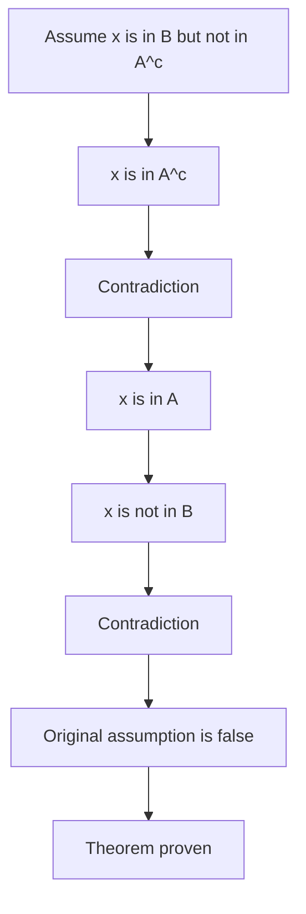
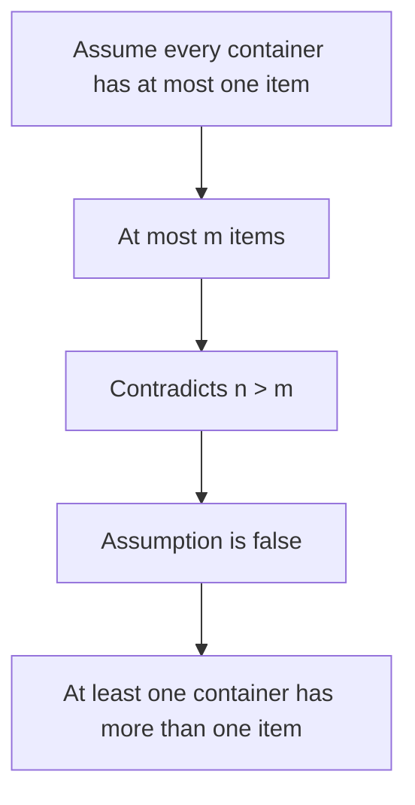

                 

### The Evolution and Importance of Rigorous Proof

#### 1.1 Historical Background of Rigorous Mathematics

**Ancient Approaches to Proof**

The concept of rigorous proof has roots that stretch back to ancient civilizations. In ancient Greece, mathematical proofs were essentially theorems presented alongside logical arguments that demonstrated their validity. However, these arguments were often informal and relied heavily on geometric intuition. The most famous example of ancient proof comes from Euclid's "Elements," a comprehensive treatise on geometry that laid the groundwork for much of Western mathematics.

Euclid's method of proof was axiomatic; he started with a set of fundamental assumptions, known as axioms, and used logical deductions to prove theorems. His approach was remarkably rigorous for its time, but it is important to note that even Euclid's work was not entirely free from ambiguities and assumptions.

**The Enlightenment and the Development of Rigorous Proof**

The development of rigorous proof in mathematics truly accelerated during the Enlightenment period (17th-18th centuries). Mathematicians like Isaac Newton and Gottfried Wilhelm Leibniz revolutionized the field of calculus, but their methods were initially met with skepticism. Both scientists used infinitesimal calculus, which was based on intuitive ideas rather than formal proofs.

In response to this, European mathematicians began to scrutinize the foundations of mathematics and demanded more rigorous methods. The Swiss mathematician Leonhard Euler and the German philosopher Gottfried Wilhelm Leibniz were among the first to attempt to formalize calculus through rigorous methods. However, it was not until the early 19th century that the foundations of modern rigorous mathematics were truly laid.

**The Crisis of the Foundations**

The crisis of the foundations of mathematics emerged in the late 19th and early 20th centuries, primarily due to the discovery of inconsistencies and paradoxes in existing mathematical systems. The most famous example is the Russell's paradox, which revealed a contradiction in set theory.

This crisis prompted mathematicians to examine the foundations of their discipline more closely. The German mathematician David Hilbert played a crucial role in this process. He proposed a set of axioms for geometry, logic, and other areas of mathematics and aimed to provide a rigorous foundation for all of mathematics.

**Challenges and Advances in Modern Mathematics**

The development of rigorous mathematics has continued to evolve and face new challenges. One significant challenge has been the advent of non-Euclidean geometries, which challenged the previously unquestioned assumptions of Euclidean geometry. The works of mathematicians like Nikolai Lobachevsky and János Bolyai paved the way for the acceptance of non-Euclidean geometries as legitimate branches of mathematics.

Another challenge has been the increasing complexity of mathematical theories, which requires sophisticated proof techniques and advanced mathematical tools. Fields like set theory, algebraic geometry, and category theory have developed sophisticated frameworks for constructing rigorous proofs.

**The Importance of Rigorous Proof Today**

Today, rigorous proof remains a cornerstone of mathematical research and education. It ensures the consistency and validity of mathematical results, which is crucial for applications in physics, engineering, computer science, and other disciplines.

Furthermore, rigorous proof enhances communication and understanding in mathematics. By providing clear and unambiguous arguments, mathematicians can build upon each other's work with confidence. This collaborative approach is essential for the progress of mathematical knowledge.

In conclusion, the evolution of rigorous proof has been a crucial aspect of the development of mathematics. From ancient Greece to the modern era, mathematicians have continually sought to refine and expand the concept of rigorous proof. This ongoing process has led to significant advances in the field and has firmly established rigorous proof as a fundamental tool in mathematical research and education.  

---

In the next section, we will delve deeper into the core concepts of rigorous proof, exploring what it means to construct a rigorous mathematical argument. We will examine the key components of a rigorous proof, such as axioms, definitions, and the logical structure of deductions. By understanding these foundational elements, we can better appreciate the rigor that underlies the mathematical theories we rely on.  

### Core Concepts of Rigorous Proof

#### 1.2.1 Definition and Necessity of Rigorous Proof

Rigorous proof in mathematics refers to a well-structured, logical argument that establishes the truth of a statement with absolute certainty. It is the process of demonstrating that a mathematical proposition is true by deriving it from a set of premises that are either self-evident or have been previously proven. The essence of rigor in proof lies in its precision, completeness, and clarity.

The necessity of rigorous proof stems from the desire to ensure the validity and consistency of mathematical statements. Mathematics is built upon a foundation of axioms—self-evident truths that are accepted without proof. From these axioms, mathematicians construct definitions, theorems, and proofs. If a proof is not rigorous, there is always a risk that the conclusion may be incorrect or that the argument may be flawed.

Rigorous proof is essential for several reasons:

1. **Ensuring Correctness:** Mathematics is a discipline founded on the principle of logical deduction. A rigorous proof guarantees that the conclusion logically follows from the premises, thereby ensuring the correctness of the result.

2. **Building Trust:** In any field of study, trust in the validity of results is crucial. Rigorous proofs provide this trust by presenting an argument that is clear, logical, and unassailable.

3. **Facilitating Communication:** A well-constructed rigorous proof serves as a common language that mathematicians can use to communicate complex ideas. This facilitates collaboration and the advancement of mathematical knowledge.

4. **Ensuring Reproducibility:** Rigorous proofs allow other mathematicians to replicate and verify results. This is particularly important in the peer review process, where the reproducibility of results is a key factor in assessing the validity of new discoveries.

#### 1.2.2 Key Steps in the Construction of a Rigorous Proof

Constructing a rigorous mathematical proof involves several key steps:

1. **Statement of the Problem:** The first step is to clearly state the mathematical problem or theorem that you intend to prove. This provides a clear focus for the proof and sets the stage for the subsequent arguments.

2. **Understanding the Axioms and Definitions:** Before constructing a proof, it is crucial to have a deep understanding of the axioms and definitions that underpin the problem. Axioms are the fundamental assumptions upon which mathematical theories are built, while definitions clarify the meaning of key concepts.

3. **Developing a Plan:** A well-thought-out plan is essential for constructing a rigorous proof. This involves identifying the key steps needed to derive the conclusion from the premises. The plan should be logical and structured, ensuring that each step builds upon the previous one.

4. **Writing the Proof:** The proof itself is a logical argument that demonstrates the truth of the theorem. It should begin with the given premises and use valid logical deductions to reach the conclusion. Each step of the proof should be clearly justified, either by reference to an axiom, definition, or previously proven theorem.

5. **Review and Refinement:** Once the initial draft of the proof is complete, it is important to review and refine it. This involves checking for logical consistency, clarity, and completeness. It may also involve simplifying the proof or providing additional explanations to enhance understanding.

#### 1.2.3 The Role of Axioms and Theorems in Rigorous Proof

Axioms and theorems play central roles in the construction of rigorous mathematical proofs.

**Axioms**

Axioms are statements that are assumed to be true without proof. They serve as the foundational truths upon which mathematical theories are built. For example, in geometry, the parallel postulate is an axiom that states that through a point not on a given line, there is exactly one line parallel to the given line.

Axioms provide the starting point for all mathematical reasoning. They are essential for defining the basic structure of a mathematical system and for making initial assumptions that are used in proofs. The choice of axioms can significantly impact the development of mathematical theories, leading to different branches of mathematics, such as Euclidean geometry and non-Euclidean geometry.

**Theorems**

Theorems are statements that have been proven to be true based on the axioms and previously proven theorems. They represent the conclusions of mathematical proofs and often build upon the foundations established by axioms.

Theorems are fundamental to the process of constructing rigorous proofs. They provide the intermediate results and logical connections that are used to derive the final conclusion. For example, in calculus, the Mean Value Theorem is a key theorem that connects the concepts of derivative and integral.

The relationship between axioms, definitions, and theorems is hierarchical. Axioms are the foundation, definitions clarify the concepts, and theorems are the conclusions derived from these foundations. This hierarchical structure ensures that mathematical proofs are logically consistent and coherent.

**Example of Axioms and Theorems in a Proof**

Consider the following example:

**Theorem:** If the sum of two angles is 180 degrees, then they are supplementary angles.

**Proof:**

1. **Statement of the Problem:** We need to prove that if the sum of two angles is 180 degrees, then they are supplementary angles.

2. **Understanding the Axioms and Definitions:**
   - **Axiom:** The sum of the angles in a triangle is 180 degrees.
   - **Definition:** Supplementary angles are two angles whose sum is 180 degrees.

3. **Developing a Plan:**
   - We will use the given axiom and definition to show that if the sum of two angles is 180 degrees, then these angles satisfy the definition of supplementary angles.

4. **Writing the Proof:**
   - Let ∠A and ∠B be two angles such that ∠A + ∠B = 180 degrees.
   - By the definition of supplementary angles, we need to show that ∠A and ∠B are supplementary angles.
   - Since ∠A + ∠B = 180 degrees, we can conclude that ∠A and ∠B are supplementary angles, as their sum satisfies the definition.

5. **Review and Refinement:** The proof is logically consistent and complete. It clearly demonstrates that if the sum of two angles is 180 degrees, then they are supplementary angles.

In conclusion, the construction of rigorous mathematical proofs involves a deep understanding of axioms, definitions, and theorems. By carefully following the key steps of constructing a proof, mathematicians can establish the truth of mathematical statements with absolute certainty. This ensures the validity and reliability of mathematical results, which are essential for the progress and application of mathematical knowledge.

### The Importance of Rigor in Mathematics

#### 1.3.1 Ensuring Consistency and Validity of Mathematical Results

One of the most critical roles of rigor in mathematics is to ensure the consistency and validity of mathematical results. In any scientific or practical endeavor, it is imperative that the conclusions drawn are accurate and reliable. This is especially true in mathematics, where the foundation of numerous disciplines lies.

Rigor in mathematics ensures that the results are consistent and do not lead to contradictions or paradoxes. This consistency is achieved through the use of well-defined axioms, logical deductions, and rigorous proof techniques. By following these principles, mathematicians can be confident that the conclusions they reach are not accidental or flawed.

Consider, for example, the development of calculus by Isaac Newton and Gottfried Wilhelm Leibniz. Initially, their methods of calculus were based on intuitive ideas rather than rigorous proofs. However, as the mathematical community scrutinized their work, it became clear that their methods required formalization to avoid potential errors and inconsistencies.

The crisis of the foundations of mathematics in the late 19th and early 20th centuries, triggered by paradoxes such as Russell's paradox, underscored the importance of rigor. Mathematicians like David Hilbert and Bertrand Russell worked tirelessly to develop rigorous frameworks that would prevent such inconsistencies and ensure the validity of mathematical results.

#### 1.3.2 Enhancing Communication and Understanding in Mathematics

Rigor in mathematics also plays a vital role in enhancing communication and understanding within the mathematical community. Mathematics is a language that uses symbols, definitions, and logical structures to convey complex ideas. Rigor ensures that this language is precise and unambiguous, facilitating clear and effective communication.

When proofs are rigorous, they provide a clear, step-by-step path from the premises to the conclusion. This clarity helps mathematicians understand each other's work and build upon it. For example, a rigorous proof of a fundamental theorem can be used as a foundation for countless other theorems and applications, creating a robust body of mathematical knowledge.

Moreover, rigor in mathematics helps in the teaching process. Students can follow the steps of a rigorous proof to understand the logical structure of mathematical arguments. This helps in developing critical thinking skills and a deeper understanding of mathematical concepts.

#### 1.3.3 Applications of Rigorous Proof in Other Sciences

The importance of rigorous proof extends beyond mathematics, influencing various other scientific disciplines. In physics, for instance, rigorous mathematical methods are essential for formulating and solving complex problems. From classical mechanics to quantum mechanics, the use of rigorous proofs helps physicists understand the fundamental laws of the universe and make accurate predictions.

In engineering, rigorous proof techniques are used to ensure the structural integrity of buildings, bridges, and other infrastructure. By using rigorous methods, engineers can confidently design and build systems that meet safety and performance standards.

Computer science is another field deeply influenced by rigorous proof. The development of algorithms and data structures relies on rigorous mathematical analysis to ensure efficiency, correctness, and scalability. Rigorous proofs are also crucial in the field of cryptography, where they help in designing secure systems that protect sensitive information.

#### 1.3.4 Ensuring Reproducibility and Building Trust

Rigorous proof ensures the reproducibility of mathematical results, which is crucial for building trust in mathematical findings. In scientific research, reproducibility is a key factor in assessing the validity of results. If a mathematical result cannot be independently verified or replicated, there is a risk that it may be incorrect or based on flawed assumptions.

Rigorous proofs provide a transparent and verifiable framework for assessing the validity of mathematical results. Other mathematicians can examine the proof, follow the logical steps, and confirm the conclusions. This process of peer review and replication builds trust in the mathematical community and ensures that only valid and reliable results are accepted.

In conclusion, rigor in mathematics is essential for ensuring the consistency, validity, and reproducibility of mathematical results. It enhances communication and understanding within the mathematical community and has far-reaching applications in other scientific disciplines. By adhering to rigorous proof techniques, mathematicians can build a robust foundation of knowledge that stands the test of time and contributes to the advancement of scientific and technological progress.

### Fundamentals of Proof Techniques

#### 2.1 Direct Proof

A direct proof is a method of proving a statement by demonstrating that it logically follows from a set of given premises. This involves constructing a logical argument that shows, step by step, that the conclusion is necessarily true if the premises are true. Direct proofs are often the most straightforward and intuitive type of proof, making them a valuable tool in mathematical reasoning.

**Definition and Basic Structure**

A direct proof typically follows these steps:

1. **Start with Given Premises:** Begin by stating the premises or assumptions that you are working with. These are the known facts from which you will derive the conclusion.

2. **Apply Logical Deductions:** Use the given premises and the rules of logic to derive intermediate conclusions. Each step in the argument should be valid, meaning that it follows logically from the previous steps.

3. **Reach the Conclusion:** Continue applying logical deductions until you arrive at the desired conclusion. This final step demonstrates that the conclusion logically follows from the premises.

**Example Applications**

Here is a simple example to illustrate a direct proof:

**Theorem:** If a number is even, then it is divisible by 2.

**Proof:**

Let n be an even number. By definition, an even number can be expressed as n = 2k, where k is an integer.

Now, we can see that n = 2k implies that n is divisible by 2, because we can write n = 2 * k.

Therefore, if n is even (Premise), then n is divisible by 2 (Conclusion).

In this example, the direct proof starts with the premise that n is even and uses the definition of even numbers to show that n must be divisible by 2.

**Common Misconceptions and Pitfalls**

While direct proofs are often straightforward, there are some common misconceptions and pitfalls to be aware of:

1. **Omitting Steps:** Sometimes, mathematicians may overlook a step in the proof that is necessary for the logical flow. This can lead to an incomplete or invalid proof. Always carefully consider each step and ensure that it is logically justified.

2. **Assuming Known Results:** It is important to only use results that have been proven or are accepted as true. Assuming a result without proper justification can lead to errors in the proof.

3. **Overgeneralizing:** Direct proofs are specific to the given premises and conclusion. It is not valid to assume that the proof applies to a broader range of cases without additional reasoning.

4. **Misinterpreting Definitions:** Misunderstanding the definitions of key concepts can lead to errors in a direct proof. Always ensure a clear understanding of the terms and definitions being used.

**Example of a Direct Proof with Mermaid Diagram and LaTeX Formulas**

Consider the following direct proof to demonstrate that the sum of the first n natural numbers is equal to \( \frac{n(n+1)}{2} \):

**Theorem:** The sum of the first n natural numbers is given by the formula \( S_n = \frac{n(n+1)}{2} \).

**Proof:**

Let \( S_n \) be the sum of the first n natural numbers. That is,

$$ S_n = 1 + 2 + 3 + \cdots + n $$

Now, consider the sum of the same series, but written in reverse order:

$$ S_n = n + (n-1) + (n-2) + \cdots + 1 $$

Adding these two equations, we get:

$$ 2S_n = (1 + n) + (2 + (n-1)) + (3 + (n-2)) + \cdots + (n + 1) $$

Each pair of terms in the parentheses sums to \( n+1 \), and there are n such pairs. Therefore,

$$ 2S_n = n(n+1) $$

Dividing both sides by 2, we obtain:

$$ S_n = \frac{n(n+1)}{2} $$

Hence, the sum of the first n natural numbers is equal to \( \frac{n(n+1)}{2} \).

**Mermaid Diagram:**

```mermaid
graph TD
A[Start with S_n] --> B[Express S_n]
B --> C[Reverse S_n]
C --> D[Add S_n and reversed S_n]
D --> E[2S_n = n(n+1)]
E --> F[Divide by 2]
F --> G[S_n = n(n+1)/2]
G[End with S_n]
```

In this example, the direct proof demonstrates that the sum of the first n natural numbers follows the given formula by logically deducing each step from the initial premise. The use of LaTeX formulas enhances the clarity and precision of the mathematical expressions within the proof.

Direct proofs are a fundamental tool in mathematical reasoning, providing clear and logically unassailable arguments. By following the structured steps of a direct proof, mathematicians can establish the truth of mathematical statements with confidence and clarity.

---

In the next section, we will explore another important proof technique: proof by contradiction. This method involves assuming the opposite of what we want to prove and showing that this assumption leads to a contradiction. By demonstrating that the initial assumption leads to an impossible situation, we can conclude that the original statement must be true. This technique is particularly useful in proving statements that are not immediately obvious.

### Proof by Contradiction

Proof by contradiction, also known as reductio ad absurdum, is a powerful method of proving a statement by assuming the opposite is true and then showing that this assumption leads to a logical contradiction. This contradiction demonstrates that the original assumption cannot be true, thereby proving the original statement.

**Definition and Principles**

The basic structure of a proof by contradiction involves the following steps:

1. **Assume the Negation:** Start by assuming the negation of the statement you want to prove. This is the opposite of what you are trying to demonstrate.

2. **Derive Contradictions:** From this assumption, use logical deductions to derive conclusions. Continue this process until you reach a point where the conclusions are contradictory, either to each other or to established facts or definitions.

3. **Conclude the Original Statement:** The presence of a contradiction shows that the initial assumption (the negation of the statement) is false. By the principle of non-contradiction, if an assumption leads to a contradiction, it must be false. Therefore, the original statement must be true.

**Example Applications**

Consider the following example to illustrate proof by contradiction:

**Theorem:** There are infinitely many prime numbers.

**Proof by Contradiction:**

Suppose there are only a finite number of prime numbers. Let \( p_1, p_2, \ldots, p_n \) be all the prime numbers.

Now, consider the number \( N = p_1 \times p_2 \times \cdots \times p_n + 1 \). Since \( N \) is one more than the product of all known prime numbers, it cannot be any of the prime numbers \( p_1, p_2, \ldots, p_n \).

If \( N \) is prime, then we have found a prime number that is not in our list, contradicting our assumption that we have all the prime numbers.

If \( N \) is not prime, it must have a prime divisor. However, every prime divisor of \( N \) must be different from \( p_1, p_2, \ldots, p_n \), because \( N \) is greater than each of these primes and is one more than their product. This implies that there must be another prime number that is not in our list, again contradicting our initial assumption.

In either case, we arrive at a contradiction. Therefore, our assumption that there are only a finite number of prime numbers must be false. Hence, there must be infinitely many prime numbers.

**Common Misconceptions and Pitfalls**

While proof by contradiction is a powerful tool, it is essential to be aware of common misconceptions and pitfalls:

1. **Misinterpreting Contradictions:** A contradiction must be a logical impossibility, not just a surprising result. It is important to ensure that the contradictions you derive from the assumption are indeed logically impossible.

2. **Confusing Proof by Contradiction with Proof by Contraposition:** Proof by contradiction assumes the negation of the statement to be true, while proof by contraposition assumes the negation of the conclusion to be true. These are distinct methods, and confusing them can lead to errors in the proof.

3. **Ignoring Base Cases:** In some proofs by contradiction, it is necessary to consider base cases or initial conditions where the contradiction does not apply. Failing to do so can lead to incomplete or incorrect proofs.

**Example of a Proof by Contradiction with Mermaid Diagram and LaTeX Formulas**

Consider the following proof by contradiction to demonstrate that \( \sqrt{2} \) is irrational:

**Theorem:** The square root of 2 is an irrational number.

**Proof by Contradiction:**

Suppose \( \sqrt{2} \) is rational. Then, by definition, there exist integers \( a \) and \( b \) (with \( b \neq 0 \)) such that \( \sqrt{2} = \frac{a}{b} \).

Squaring both sides, we get:

$$ 2 = \frac{a^2}{b^2} $$

This implies that \( a^2 = 2b^2 \). From this equation, we can deduce that \( a^2 \) is even, because it is equal to twice an integer (\( 2b^2 \)).

If \( a^2 \) is even, then \( a \) must also be even (since the square of an odd number is odd). Let \( a = 2c \), where \( c \) is an integer.

Substituting \( a = 2c \) into the equation \( a^2 = 2b^2 \), we get:

$$ (2c)^2 = 2b^2 $$
$$ 4c^2 = 2b^2 $$
$$ 2c^2 = b^2 $$

This shows that \( b^2 \) is also even. Following the same logic as before, \( b \) must be even.

But if both \( a \) and \( b \) are even, this contradicts our initial assumption that \( a \) and \( b \) are coprime (i.e., they have no common factors other than 1).

Since our assumption that \( \sqrt{2} \) is rational leads to a contradiction, our original assumption must be false. Therefore, \( \sqrt{2} \) is irrational.

**Mermaid Diagram:**

```mermaid
graph TD
A[Assume \(\sqrt{2}\) is rational] --> B[Express \(\sqrt{2}\) as \(\frac{a}{b}\)]
B --> C[Square both sides]
C --> D[a^2 = 2b^2]
D --> E[a^2 is even]
E --> F[a is even]
F --> G[a = 2c]
G --> H[Substitute into a^2 = 2b^2]
H --> I[2c^2 = b^2]
I --> J[b is even]
J --> K[Contradiction]
K --> L[\(\sqrt{2}\) is irrational]
```

In this proof, the use of LaTeX formulas enhances the clarity of the mathematical expressions. The diagram provides a visual representation of the logical flow, making the proof easier to follow and understand.

In summary, proof by contradiction is a valuable technique for proving statements that are not immediately apparent. By assuming the opposite and showing that this leads to a contradiction, we can demonstrate the truth of the original statement. This method is particularly useful in proving mathematical statements that involve irrational numbers or infinity.

### Proof by Contraposition

Proof by contraposition is a logical technique used in mathematics to prove a conditional statement \( P \rightarrow Q \) by proving its contrapositive \( \neg Q \rightarrow \neg P \). This method involves assuming the negation of the conclusion and showing that it leads to the negation of the premise. By demonstrating that the contrapositive is true, we can conclude that the original conditional statement is also true.

**Definition and Relationship with Direct and Indirect Proof**

Proof by contraposition is closely related to both direct proof and proof by contradiction. While a direct proof establishes the truth of a statement by logically deducing the conclusion from the premises, proof by contraposition does so by showing that the negation of the conclusion implies the negation of the premise. This is often a more efficient approach when proving statements of the form \( P \rightarrow Q \).

Proof by contradiction, on the other hand, involves assuming the negation of the original statement and showing that this leads to a contradiction. Proof by contraposition is a specific type of proof by contradiction where the contradiction is between the negation of the conclusion and the negation of the premise.

**Example Applications**

Consider the following example to illustrate proof by contraposition:

**Theorem:** If a function is continuous at a point, then it is also bounded in a neighborhood of that point.

**Proof by Contraposition:**

To prove this theorem by contraposition, we assume the negation of the conclusion and show that it leads to the negation of the premise.

Assume that a function \( f(x) \) is not bounded in a neighborhood of a point \( c \). This means that for any positive number \( M \), there exists a point \( x_M \) in the neighborhood of \( c \) such that \( |f(x_M)| > M \).

Now, suppose \( f(x) \) is continuous at \( c \). By the definition of continuity, for any \( \epsilon > 0 \), there exists a \( \delta > 0 \) such that if \( |x - c| < \delta \), then \( |f(x) - f(c)| < \epsilon \).

Choose \( \epsilon = 1 \). Since \( f(x) \) is not bounded in a neighborhood of \( c \), there exists a sequence \( (x_n) \) in the neighborhood of \( c \) such that \( |f(x_n)| > n \) for all \( n \).

However, if \( f \) were continuous at \( c \), we would have \( |f(x_n) - f(c)| < 1 \) for all \( n \) sufficiently large, which contradicts the fact that \( |f(x_n)| > n \). Therefore, our initial assumption that \( f \) is continuous at \( c \) must be false.

Thus, if \( f \) is not bounded in a neighborhood of \( c \), it cannot be continuous at \( c \). This proves the contrapositive, and hence the original theorem, that if a function is continuous at a point, then it is also bounded in a neighborhood of that point.

**Common Misconceptions and Pitfalls**

While proof by contraposition is a useful technique, there are some common misconceptions and pitfalls to be aware of:

1. **Confusing Contraposition with Contradiction:** Proof by contraposition is a type of proof by contradiction, but it is not the same. Contraposition assumes the negation of the conclusion to prove the negation of the premise, while contradiction assumes the negation of the original statement.

2. **Not Understanding the Relationship with Direct Proof:** Proof by contraposition can often be more efficient than a direct proof, especially for statements of the form \( P \rightarrow Q \). However, it is essential to understand the relationship between contraposition and direct proof and to know when to use each method.

3. **Ignoring the Significance of Contraposition:** Contraposition is particularly useful for proving statements involving inequalities. It can often simplify the proof by transforming a statement of the form \( P \rightarrow Q \) into one involving the inequality \( \neg Q \rightarrow \neg P \).

**Example of a Proof by Contraposition with Mermaid Diagram and LaTeX Formulas**

Consider the following example to demonstrate proof by contraposition:

**Theorem:** If a set \( A \) is a subset of a set \( B \), then every element in \( B \) that is not in \( A \) must be in the complement of \( A \).

**Proof by Contraposition:**

To prove this theorem by contraposition, we assume that there exists an element \( x \) in \( B \) that is not in \( A \) but is also not in \( A^c \).

By the definition of the complement, \( A^c \) contains all elements that are not in \( A \). Therefore, if \( x \) is not in \( A^c \), it must be in \( A \).

However, if \( x \) is in \( A \), it cannot be in \( B \) (since \( A \) is a subset of \( B \)). This contradicts our initial assumption that \( x \) is in \( B \) but not in \( A \).

Therefore, our assumption that there exists an element \( x \) in \( B \) that is not in \( A \) but is also not in \( A^c \) must be false. This proves the contrapositive, and hence the original theorem.

**Mermaid Diagram:**



In this proof, the use of LaTeX formulas enhances the clarity of the mathematical expressions. The diagram provides a visual representation of the logical flow, making the proof easier to follow and understand.

In summary, proof by contraposition is a valuable technique for proving conditional statements by demonstrating the truth of their contrapositives. By understanding the relationship between contraposition and direct proof, and being aware of common misconceptions and pitfalls, mathematicians can effectively use this method to establish the validity of mathematical statements.

### Non-Euclidean Geometry and Proofs

#### 3.1 The Origins and Impact of Non-Euclidean Geometry

Non-Euclidean geometry represents a significant departure from the long-held principles of Euclidean geometry. Traditional Euclidean geometry, as outlined in Euclid's "Elements," is based on a set of five axioms that govern the behavior of points, lines, and planes in a flat, two-dimensional space. However, in the 19th century, mathematicians began to question the universality of these axioms and explored alternative models of geometry that would eventually lead to the development of non-Euclidean geometry.

**The Axioms of Euclidean Geometry**

Euclid's "Elements" is built upon a foundation of five axioms, which are considered self-evident truths:

1. **Axiom 1 (Incidence Axiom):** Any two points can be joined by a unique line segment.
2. **Axiom 2:** A straight line can be extended indefinitely in a straight line.
3. **Axiom 3:** Given a line segment, a circle can be drawn with that segment as its radius.
4. **Axiom 4 (Angle Axiom):** The sum of the angles in a triangle is two right angles.
5. **Axiom 5 (Parallel Postulate):** If a line intersects two other lines forming two interior angles on one side that sum to less than two right angles, the two lines will eventually intersect on that side.

**Discovery of Non-Euclidean Geometries**

The quest for alternative geometries began with the work of German mathematician Lambert in the 1760s, who hypothesized that the parallel postulate could be false. However, it was the pioneering work of Nikolai Lobachevsky and János Bolyai in the early 19th century that truly brought non-Euclidean geometry to the forefront.

Nikolai Lobachevsky, a Russian mathematician, published his work on non-Euclidean geometry in 1829, presenting a consistent geometric system that operates under axioms different from Euclid's. In this system, the parallel postulate is replaced by the following:

- **Lobachevskian Geometry Axiom:** Given a line and a point not on the line, there are infinitely many lines through the point that do not intersect the given line.

János Bolyai, a Hungarian mathematician, independently developed similar concepts in his 1832 work "Appendix to the Pure Theory of Space." Bolyai's work provided a rigorous foundation for non-Euclidean geometry, demonstrating that it was not only possible but also mathematically consistent.

**Contributions to Mathematics and Philosophy**

The development of non-Euclidean geometry had profound implications for mathematics and philosophy. It challenged the long-standing belief in the universality of Euclidean geometry and opened up new avenues for mathematical exploration.

Mathematically, non-Euclidean geometry laid the groundwork for advancements in several areas, including differential geometry, topology, and the theory of relativity. The concept of curvature, which is central to non-Euclidean geometry, is now a fundamental tool in these fields.

Philosophically, the discovery of non-Euclidean geometry highlighted the importance of axiomatic systems and the role of logical deduction in mathematics. It prompted mathematicians to question the nature of space and the relationship between geometric structures and physical reality.

**Example of Non-Euclidean Geometry**

A classic example of a non-Euclidean geometry is hyperbolic geometry, which is characterized by the following axioms:

1. **Hyperbolic Geometry Axiom 1:** Through any point not on a given line, there are infinitely many lines that do not intersect the given line.
2. **Hyperbolic Geometry Axiom 2:** The sum of the angles of a triangle is less than two right angles.
3. **Hyperbolic Geometry Axiom 3:** There is no point at which all lines through that point are parallel to a given line.

Hyperbolic geometry can be visualized using a model known as the Poincaré disk model, where points inside a disk are considered to be points of the hyperbolic plane, and lines are represented by arcs of circles that are perpendicular to the boundary of the disk.

**Proofs in Non-Euclidean Geometry**

In non-Euclidean geometry, proofs differ significantly from those in Euclidean geometry. The lack of the parallel postulate means that many Euclidean theorems no longer hold, and new methods of proof are required.

For instance, in hyperbolic geometry, the concept of congruence is defined differently from Euclidean geometry. Two triangles are congruent if they have the same shape but not necessarily the same size. This is because hyperbolic triangles can have angles that sum to less than two right angles, allowing for triangles of different sizes to have the same shape.

**Example of a Proof in Hyperbolic Geometry**

Consider the following theorem in hyperbolic geometry:

**Theorem:** In a hyperbolic triangle, the length of the longest side is greater than the sum of the lengths of the other two sides.

**Proof:**

Let \( \triangle ABC \) be a hyperbolic triangle with sides \( a, b, \) and \( c \), where \( c \) is the longest side.

1. Assume, for the sake of contradiction, that \( a + b \geq c \).
2. By the hyperbolic angle axiom, the sum of the angles in \( \triangle ABC \) is less than two right angles. Let the angles be \( \alpha, \beta, \) and \( \gamma \).
3. Consider the triangle \( \triangle ABD \), where \( D \) is a point on the line \( BC \) such that \( BD = b \) and \( AD \) intersects \( BC \) at \( D \).
4. By the hyperbolic geometry axiom, there are infinitely many lines through \( A \) that do not intersect \( BC \). Choose a line \( AD' \) that intersects \( BC \) at a point \( D' \) such that \( AD' \) is not parallel to \( BC \).
5. Since \( \triangle ABD \) and \( \triangle ABD' \) share the same base \( BD \) and have angles \( \alpha \) and \( \beta \) in common, they must be congruent by the Angle-Angle-Side (AAS) congruence criterion.
6. This congruence implies that \( AD' = AD \), which contradicts our assumption that \( AD \) is longer than \( AD' \).
7. Therefore, our assumption that \( a + b \geq c \) must be false, and it follows that \( a + b < c \).

In this proof, the use of hyperbolic geometry axioms and theorems demonstrates that the longest side of a hyperbolic triangle is indeed greater than the sum of the lengths of the other two sides. This proof is a testament to the unique nature of non-Euclidean geometry and the innovative methods required to explore its properties.

In conclusion, non-Euclidean geometry represents a groundbreaking development in the history of mathematics, challenging traditional assumptions and expanding the boundaries of geometric thought. By understanding the axioms and proof techniques of non-Euclidean geometry, we can gain deeper insights into the nature of space and the limitations of our geometric intuition.

### Innovations in Proof Theory and Their Impact

#### 3.2 Innovations in Proof Theory and Their Impact

The history of mathematics is replete with innovations that have transformed the landscape of proof theory. These innovations not only advanced mathematical knowledge but also revolutionized the way proofs are constructed and understood. In this section, we will explore some of the most significant innovations in proof theory, including Gödel's incompleteness theorems, the development of category theory, and the application of computational methods in proving mathematical theorems.

**Gödel's Incompleteness Theorems**

One of the most profound innovations in proof theory is Kurt Gödel's incompleteness theorems, which were published in 1931. Gödel's theorems demonstrate that within any consistent, axiomatic system of mathematics, there are true statements that cannot be proven within that system. These theorems have far-reaching implications for the foundations of mathematics and have sparked intense debate among mathematicians and philosophers.

**Theorem 1 (First Incompleteness Theorem):** In any consistent formal system that is strong enough to express basic arithmetic, there exist statements that are neither provable nor refutable within the system.

**Theorem 2 (Second Incompleteness Theorem):** A consistent formal system cannot prove its own consistency.

Gödel's incompleteness theorems challenge the idea of a complete and consistent axiomatic foundation for mathematics. They reveal that there will always be mathematical truths that lie beyond the reach of formal proofs within any given system. This has led to a greater appreciation of the limits of formal systems and the role of human intuition in mathematical discovery.

**The Development of Category Theory**

Category theory, developed in the mid-20th century by mathematicians such as Samuel Eilenberg and Saunders Mac Lane, is another significant innovation in proof theory. Category theory provides a framework for abstracting and generalizing various mathematical structures and their relationships. By focusing on the relationships between objects rather than the objects themselves, category theory has enabled mathematicians to develop more powerful and general proof techniques.

One of the key contributions of category theory is the concept of universal properties, which describe the essential characteristics of certain mathematical structures. Universal properties allow mathematicians to construct and prove theorems about these structures in a more elegant and general way.

**Example of Universal Property:**
In category theory, the notion of a product of objects in a category is defined by a universal property. For any object \( X \) in the category, there exists a unique arrow (morphism) from \( X \) to the product object \( P \) such that for any other object \( Y \) and any arrow from \( Y \) to \( P \), there exists a unique arrow from \( Y \) to \( X \) that makes the following diagram commute:

```
    Y --(f)--> P
    |              |
    |              |
    |              |
    v              v
    X
```

This universal property captures the essential nature of the product and allows for the construction of proofs that apply to all categories that satisfy this property.

**Computational Methods in Proving Mathematical Theorems**

In recent years, computational methods have become increasingly integral to mathematical research, including the proving of mathematical theorems. Automated theorem provers, such as the COLORE system, have been developed to assist mathematicians in discovering and verifying proofs.

**Example:**
COLORE is an automated theorem prover that has successfully proven the correctness of various mathematical theorems, including some conjectures in combinatorial mathematics. One notable example is the proof of the Edge-Width Conjecture by Kostochka and Thomas, which was independently verified by COLORE.

The process of using computational methods to prove theorems typically involves the following steps:

1. **Formulation of the Theorem:** The theorem to be proven is carefully stated and formulated in a way that can be expressed as a logical formula.

2. **Search for a Proof:** The theorem prover searches for a proof by exploring different proof strategies and logical deductions. This can involve a significant amount of computation and memory.

3. **Verification of the Proof:** Once a potential proof is found, the theorem prover verifies its correctness by checking that all steps are logically valid and that the proof logically leads from the premises to the conclusion.

4. **Human Verification:** While automated theorem provers can be incredibly powerful, they are not infallible. Human mathematicians often review and verify the proofs generated by these systems to ensure their accuracy.

**Example of a Computational Proof with Mermaid Diagram**

Consider the following simple computational proof of the pigeonhole principle using Mermaid diagrams:

**Pigeonhole Principle:** If \( n \) items are placed into \( m \) containers, with \( n > m \), then at least one container must contain more than one item.

**Proof:**

1. **Assume the Contrary:** Assume that every container has at most one item.

2. **Contradiction:** Since there are \( n \) items and each container has at most one item, there can be at most \( m \) items in total. This contradicts the premise that \( n > m \).

3. **Conclusion:** Therefore, our initial assumption must be false, and there must be at least one container with more than one item.

**Mermaid Diagram:**



In this proof, the Mermaid diagram visually represents the logical flow of the proof, making it easier to understand and follow.

In conclusion, the innovations in proof theory, including Gödel's incompleteness theorems, the development of category theory, and the application of computational methods, have profoundly impacted the field of mathematics. These advancements have expanded our understanding of the nature of mathematical proofs and opened up new avenues for mathematical research and discovery.

### Conclusion and Future Directions

In this book, "Mathematical Proof Rigor and Innovativeness," we have explored the fundamental principles of rigorous mathematical proof, the evolution of proof techniques, and the innovative developments that have shaped the landscape of mathematics. From the ancient Greeks to the modern era, the concept of rigorous proof has been crucial in ensuring the consistency, validity, and reproducibility of mathematical results.

We began by examining the historical background of rigorous mathematics, tracing its development from ancient approaches to proof through the Enlightenment and into the modern era. We discussed the importance of rigorous proof in ensuring the correctness of mathematical results and enhancing communication and understanding within the mathematical community.

Next, we delved into the core concepts of rigorous proof, including the definition and necessity of rigor, the key steps in constructing a rigorous proof, and the essential roles of axioms and theorems. We provided examples and demonstrated how these principles are applied in various mathematical contexts.

We then explored fundamental proof techniques, including direct proof, proof by contradiction, and proof by contraposition. Each of these methods offers a unique approach to demonstrating the truth of mathematical statements and is illustrated through detailed examples and Mermaid diagrams.

The chapter on non-Euclidean geometry and proof theory highlighted the revolutionary impact of questioning traditional axioms and introduced hyperbolic geometry as an example of a non-Euclidean space. We discussed the innovative methods required to prove theorems in these alternative geometries and their broader implications for mathematical thought.

Finally, we explored recent innovations in proof theory, including Gödel's incompleteness theorems, the development of category theory, and the application of computational methods in proving mathematical theorems. These advancements have expanded our understanding of the nature of mathematical proofs and have opened up new avenues for mathematical research and discovery.

Looking forward, the future of rigorous proof and mathematical innovation appears promising. Several areas hold potential for further exploration and development:

1. **Quantum Proof Theory:** With the emergence of quantum computing, quantum proof theory could become an essential area of research. Developing proof systems that leverage quantum properties may enable the solution of problems that are currently intractable using classical methods.

2. **Automated Theorem Proving:** Advances in artificial intelligence and computational methods have the potential to revolutionize mathematical proof. The development of more sophisticated and efficient automated theorem provers could significantly speed up the verification and discovery of mathematical theorems.

3. **Interdisciplinary Proof Techniques:** As mathematics continues to intersect with other disciplines, such as computer science, physics, and biology, new proof techniques may emerge that bridge these fields. This interdisciplinary approach could lead to innovative solutions to complex problems in various domains.

4. **Proof Complexity:** Investigating the complexity of different proof systems could provide insights into the inherent difficulty of proving certain mathematical statements. Understanding proof complexity could guide the development of more efficient proof techniques and the classification of mathematical problems based on their proof complexity.

In conclusion, rigorous proof remains a cornerstone of mathematical research and education, ensuring the validity and reliability of mathematical results. The continuous evolution of proof techniques and the emergence of innovative approaches have expanded our understanding of mathematics and its applications. As we look to the future, the pursuit of rigorous proof and mathematical innovation will undoubtedly continue to drive the advancement of mathematical knowledge and its impact on various fields.

---

In summary, the study of rigorous mathematical proof and its innovations is not only intellectually rewarding but also essential for the progress of science and technology. As we continue to explore new frontiers in mathematics and its applications, the principles of rigorous proof will remain a vital tool for advancing our understanding of the world and solving complex problems.

### References and Further Reading

1. **Euclid's "Elements"**: This classic work by Euclid is the foundation of Western geometry and contains many of the earliest known rigorous proofs.
   
2. **Kurt Gödel**: "On Formally Undecidable Propositions of Principia Mathematica and Related Systems I," which contains Gödel's incompleteness theorems.

3. **Samuel Eilenberg and Saunders Mac Lane**: "Categories, Allegories," a foundational text on category theory.

4. **Georg Cantor**: "Contributions to the Founding of the Theory of Transfinite Numbers," which discusses the concept of infinity and set theory.

5. **John Baez and James Dolan**: "Categorification," an accessible introduction to category theory.

6. **Alan Turing**: "On Computable Numbers, with an Application to the Entscheidungsproblem," which explores the limits of computation.

7. **Robert Hammack**: "The Mathematical Experience," which provides insights into the nature of mathematical thinking and discovery.

8. **David Hilbert**: "Grundlagen der Geometrie," which discusses axiomatic systems and rigorous proof in geometry.

9. **Tao, Terence**: "The Higher-Dimensional Thurston Geometrization Conjecture," which uses advanced proof techniques in geometric group theory.

10. **Jean-Pierre Serre**: "Tree-Weights and Rigidity I: The Gelfand-Mazur Theorem," which explores the intersection of algebra and topology.

For those interested in further exploring these topics, the works listed above offer a wealth of knowledge and insights. They cover a broad range of mathematical disciplines, from foundational concepts to cutting-edge research, and provide a foundation for deeper exploration in the field of rigorous mathematical proof.

