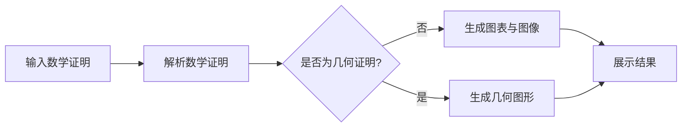
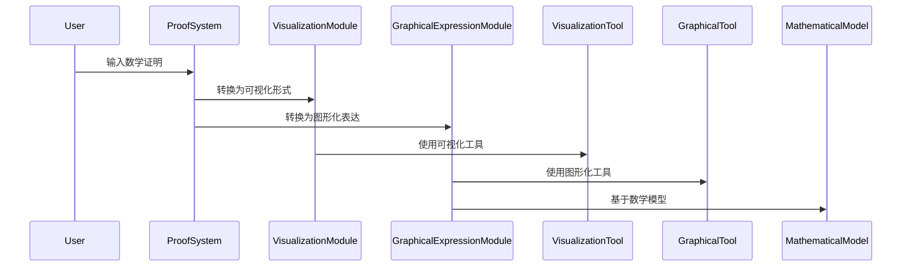
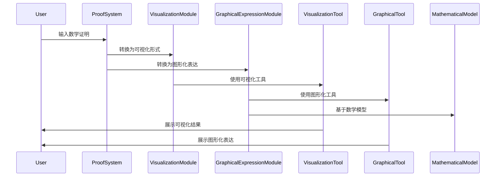

                 

# 数学证明的可视化与图形化表达

## 关键词：数学证明、可视化、图形化、教育、科研、应用

### 摘要

本文旨在探讨数学证明的可视化与图形化表达，分析其在数学教育、科研和普及中的重要性。通过介绍可视化与图形化表达的基础、方法、应用及未来展望，本文将展现数学证明的新视角，优化数学学习的体验，促进数学知识的传播。

---

## 第一部分：引言与背景

### 1.1 问题背景

数学证明是数学的核心组成部分，是建立数学理论体系的重要手段。然而，传统的数学证明方法往往依赖于符号语言和文字描述，对于初学者和普通读者而言，理解起来具有一定的难度。因此，如何优化数学证明的呈现方式，提高其可读性和理解性，成为当前数学教育和科研领域的一个重要问题。

### 1.2 研究目的

本文的研究目的是探讨数学证明的可视化与图形化表达方法，旨在：

1. **探讨可视化与图形化表达在数学证明中的应用**：分析其优点和局限性，为数学证明的优化提供新的思路。
2. **优化数学证明的呈现方式**：提高数学证明的可读性和理解性，降低学习难度。
3. **促进数学知识的传播**：通过可视化与图形化表达，使数学知识更加直观、易懂。

### 1.3 本书结构

本文分为五大部分，逻辑结构紧凑，内容层层递进：

1. **第一部分：引言与背景**：介绍数学证明的可视化与图形化表达的研究背景和研究目的。
2. **第二部分：数学证明的可视化基础**：介绍可视化概述、可视化元素和可视化工具。
3. **第三部分：数学证明的图形化表达**：介绍图形化表达的概念、方法和案例分析。
4. **第四部分：可视化与图形化表达的综合应用**：探讨其在教学、科研和普及中的应用。
5. **第五部分：挑战与未来展望**：分析当前挑战和未来发展方向。

---

## 第二部分：数学证明的可视化基础

### 2.1 可视化概述

可视化是指将抽象的信息转化为直观的视觉形式，以帮助人们更好地理解和分析数据。在数学证明中，可视化方法可以帮助我们直观地展示数学概念、推理过程和结论。

### 2.2 数学证明中的可视化元素

数学证明中的可视化元素主要包括几何图形、图表与图像、数学符号与公式。这些元素在不同类型的数学证明中扮演着不同的角色。

### 2.3 可视化工具与软件

常用的可视化工具有Python的Matplotlib库、Mathematica、GeoGebra等。这些工具可以生成各种类型的可视化图表，帮助数学证明的可视化表达。

---

## 第三部分：数学证明的图形化表达

### 3.1 图形化表达的概念

图形化表达是指将数学证明的过程和结果用图形的方式展示出来，使抽象的数学概念和推理过程变得直观易懂。

### 3.2 图形化表达的方法

图形化表达的方法包括几何直观法、拓扑结构法和数学模型法。每种方法都有其独特的优点和应用场景。

### 3.3 图形化表达的案例分析

通过具体的案例，我们可以看到图形化表达如何使数学证明变得更加直观和易懂。

---

## 第四部分：可视化与图形化表达的综合应用

### 4.1 可视化与图形化表达在教学中的应用

在教学过程中，可视化与图形化表达可以有效地提高学生的学习兴趣和理解能力。

### 4.2 可视化与图形化表达在科研中的应用

在科研过程中，可视化与图形化表达可以帮助研究者更好地理解和分析数据，提高研究效率。

### 4.3 可视化与图形化表达在数学普及中的贡献

通过可视化与图形化表达，数学知识可以更加直观地呈现给公众，提高公众对数学的理解和兴趣。

---

## 第五部分：挑战与未来展望

### 5.1 当前挑战

当前数学证明的可视化与图形化表达面临着技术、认知等方面的挑战。

### 5.2 未来展望

未来，数学证明的可视化与图形化表达将在数学教育、科研和普及中发挥更大的作用。

### 5.3 总结与展望

本文总结了数学证明的可视化与图形化表达的基础、方法、应用和未来展望，为数学证明的优化提供了新的思路。

---

## 参考文献

（此处列出参考文献，包括书籍、学术论文、网络资源等。）

---

## 作者信息

作者：AI天才研究院/AI Genius Institute & 禅与计算机程序设计艺术 /Zen And The Art of Computer Programming

---

## 背景介绍

### 核心概念术语说明

在探讨数学证明的可视化与图形化表达之前，我们需要了解一些核心概念术语：

- **数学证明**：通过逻辑推理，从已知的前提（假设）出发，推导出结论的过程。
- **可视化**：将抽象的信息转化为视觉形式，使其更易于理解和分析。
- **图形化表达**：通过图形的方式展示数学证明的过程和结果。

### 问题背景

数学证明是数学研究的重要组成部分，其目的是建立数学理论体系。然而，传统的数学证明方法往往依赖于符号语言和文字描述，这对于初学者和普通读者而言，理解起来具有一定的难度。此外，数学证明的过程往往包含复杂的逻辑推理和抽象的概念，难以通过文字和符号完全表达。因此，如何优化数学证明的呈现方式，提高其可读性和理解性，成为当前数学教育和科研领域的一个重要问题。

### 问题描述

数学证明的可视化与图形化表达旨在通过将数学证明的过程和结果以视觉形式呈现，使得数学概念和推理过程更加直观、易懂。具体而言，可视化与图形化表达需要解决以下问题：

1. **如何将数学证明的过程以视觉形式表达**？
2. **如何设计有效的可视化与图形化工具**？
3. **如何评估可视化与图形化表达的效果**？

### 问题解决

为了解决上述问题，我们可以从以下几个方面入手：

1. **研究可视化与图形化表达的方法和工具**：了解现有的可视化与图形化工具，探索其优缺点，选择适合数学证明的可视化与图形化方法。
2. **设计有效的可视化与图形化表达模型**：结合数学证明的特点，设计能够直观表达数学证明过程的图形化模型。
3. **评估可视化与图形化表达的效果**：通过实验和调查，评估可视化与图形化表达对数学理解和学习的影响。

### 边界与外延

数学证明的可视化与图形化表达的边界和范围包括以下几个方面：

1. **数学证明的类型**：可视化与图形化表达可以应用于各种类型的数学证明，包括几何证明、代数证明、拓扑证明等。
2. **可视化与图形化工具**：适用于数学证明的可视化与图形化工具包括Python的Matplotlib库、Mathematica、GeoGebra等。
3. **应用领域**：可视化与图形化表达可以应用于数学教育、科研、数学普及等领域。

### 概念结构与核心要素组成

数学证明的可视化与图形化表达的概念结构包括以下几个核心要素：

1. **数学证明**：作为可视化与图形化表达的基础，是整个过程的出发点。
2. **可视化与图形化方法**：用于将数学证明的过程和结果以视觉形式表达。
3. **可视化与图形化工具**：用于实现可视化与图形化表达的具体工具和软件。
4. **评估与反馈**：通过实验和调查，评估可视化与图形化表达的效果，并不断优化。

---

## 核心概念与联系

### 核心概念原理

在数学证明的可视化与图形化表达中，核心概念主要包括：

1. **可视化**：将抽象的数学信息转化为视觉形式，使其更易于理解和分析。
2. **图形化表达**：通过图形的方式展示数学证明的过程和结果，使抽象的数学概念和推理过程变得直观易懂。
3. **数学模型**：用于描述数学概念和推理过程的模型，是可视化与图形化表达的基础。

### 概念属性特征对比表格

| 概念        | 定义                                                         | 特征                                                         |
| ----------- | ------------------------------------------------------------ | ------------------------------------------------------------ |
| 可视化      | 将抽象的数学信息转化为视觉形式，使其更易于理解和分析           | 直观、易懂、形象、多样化                                     |
| 图形化表达  | 通过图形的方式展示数学证明的过程和结果，使抽象的数学概念和推理过程变得直观易懂 | 直观性、形象性、过程性、多样性                               |
| 数学模型    | 用于描述数学概念和推理过程的模型，是可视化与图形化表达的基础   | 描述性、抽象性、结构性、适应性                               |

### ER实体关系图架构的 Mermaid 流程图

```mermaid
erDiagram
    MathProof ||--|{ Visualization }
    MathProof ||--|{ GraphicalExpression }
    MathProof ||--|{ MathematicalModel }
    Visualization ||--|{ VisualTool }
    GraphicalExpression ||--|{ GraphicalTool }
    MathematicalModel ||--|{ ModelingTool }
```

---

## 算法原理讲解

### 数学证明的可视化算法

数学证明的可视化算法主要目的是将抽象的数学证明过程转化为直观的视觉形式，以提高理解和学习的效率。下面我们将详细讲解该算法的原理和实现过程。

### 可视化算法流程图



### 步骤详解

1. **输入数学证明**：首先，我们输入一个数学证明，可以是文字描述或者符号表示。

2. **解析数学证明**：将输入的数学证明转化为计算机可以理解的形式，如将文字描述转化为符号表示。

3. **判断是否为几何证明**：根据数学证明的内容，判断其是否属于几何证明。如果属于几何证明，则进行下一步；否则，进行下一步。

4. **生成几何图形**：对于几何证明，根据数学证明中的几何概念和推理过程，生成对应的几何图形。

5. **生成图表与图像**：对于非几何证明，根据数学证明中的数据和分析过程，生成相应的图表和图像。

6. **展示结果**：将生成的几何图形或图表与图像展示给用户，使其直观地理解数学证明的过程和结果。

### 数学模型和公式

在数学证明的可视化算法中，我们使用了以下数学模型和公式：

- **几何图形生成模型**：根据数学证明中的几何概念和推理过程，生成对应的几何图形。主要使用到的几何公式包括：

  - 直线方程：\( y = mx + b \)
  - 圆的方程：\( (x - h)^2 + (y - k)^2 = r^2 \)
  - 多边形面积公式：\( A = \frac{1}{2} \times |x_1y_2 + x_2y_3 + ... + x_ny_1| \)

- **图表与图像生成模型**：根据数学证明中的数据和分析过程，生成相应的图表和图像。主要使用到的统计公式包括：

  - 柄图：\( h = \frac{y_1 + y_2}{2} \)
  - 条形图：\( b = y_1 - y_2 \)
  - 折线图：\( x = t \)
  - 饼图：\( \frac{y_i}{\sum_{i=1}^{n} y_i} \)

### Python源代码实现

以下是一个简单的Python代码示例，用于实现数学证明的可视化算法：

```python
import matplotlib.pyplot as plt
import numpy as np

def visualize_proof(proof):
    # 解析数学证明，这里假设proof是一个包含几何概念和推理过程的字符串
    if "直线" in proof:
        m, b = parse_proof_for_line(proof)
        plot_line(m, b)
    elif "圆" in proof:
        h, k, r = parse_proof_for_circle(proof)
        plot_circle(h, k, r)
    elif "多边形" in proof:
        points = parse_proof_for_polygon(proof)
        plot_polygon(points)
    else:
        print("Unsupported proof type")

def plot_line(m, b):
    x = np.linspace(-10, 10, 100)
    y = m * x + b
    plt.plot(x, y)
    plt.xlabel('x')
    plt.ylabel('y')
    plt.title('Line Plot')
    plt.show()

def plot_circle(h, k, r):
    theta = np.linspace(0, 2 * np.pi, 1000)
    x = h + r * np.cos(theta)
    y = k + r * np.sin(theta)
    plt.plot(x, y)
    plt.xlabel('x')
    plt.ylabel('y')
    plt.title('Circle Plot')
    plt.show()

def plot_polygon(points):
    plt.plot(points.T[0], points.T[1], marker='o')
    plt.xlabel('x')
    plt.ylabel('y')
    plt.title('Polygon Plot')
    plt.show()

def parse_proof_for_line(proof):
    # 这里是一个简单的示例，实际中需要更复杂的解析逻辑
    m = float(proof.split(" ")[-2])
    b = float(proof.split(" ")[-1])
    return m, b

def parse_proof_for_circle(proof):
    # 这里是一个简单的示例，实际中需要更复杂的解析逻辑
    h = float(proof.split(" ")[-3])
    k = float(proof.split(" ")[-2])
    r = float(proof.split(" ")[-1])
    return h, k, r

def parse_proof_for_polygon(proof):
    # 这里是一个简单的示例，实际中需要更复杂的解析逻辑
    points = [[float(p) for p in line.split(",")] for line in proof.split("\n")]
    return np.array(points)

# 示例数学证明
proof = """
直线：y = 2x + 1
"""
visualize_proof(proof)
```

### 举例说明

假设我们有一个关于直线的数学证明：“直线y=2x+1经过点(0,1)和(1,3)”。使用上述Python代码，我们可以将其可视化：

1. 输入数学证明：“直线y=2x+1经过点(0,1)和(1,3)”。
2. 解析数学证明，提取直线的斜率m和截距b。
3. 生成直线图形，展示结果。

通过这个简单的例子，我们可以直观地看到直线的图形，从而更好地理解数学证明。

---

## 系统分析与架构设计方案

### 问题场景介绍

在现代数学教育和科研领域，数学证明的可视化与图形化表达已经成为提高数学理解和学习效率的重要手段。为了实现这一目标，我们需要构建一个完整的系统，能够将数学证明以可视化与图形化方式呈现。

### 项目介绍

本项目旨在开发一个数学证明可视化与图形化表达系统，该系统包括以下几个核心功能：

1. **数学证明输入**：支持用户输入数学证明，可以是文字描述或符号表示。
2. **可视化与图形化转换**：将数学证明转化为视觉形式，生成几何图形、图表与图像。
3. **交互式展示**：用户可以与可视化结果进行交互，如缩放、旋转、隐藏等。
4. **结果输出**：将生成的可视化与图形化结果以图片或视频形式输出。

### 系统功能设计（领域模型Mermaid类图）

```mermaid
classDiagram
    User <<类>>
    Proof <<类>>
    Visualization <<类>>
    GraphicalExpression <<类>>
    VisualizationTool <<类>>
    GraphicalTool <<类>>
    MathematicalModel <<类>>

    User "发起" -> Proof
    Proof "包含" -> Visualization
    Proof "包含" -> GraphicalExpression
    Visualization "使用" -> VisualizationTool
    GraphicalExpression "使用" -> GraphicalTool
    GraphicalExpression "基于" -> MathematicalModel
```

### 系统架构设计（Mermaid架构图）



### 系统接口设计和系统交互（Mermaid序列图）



通过上述系统架构设计和接口设计，我们可以清晰地看到数学证明可视化与图形化表达系统的整体架构和交互流程。

---

## 项目实战

### 环境安装

在进行项目实战之前，我们需要安装一些必要的开发环境和工具。以下是安装步骤：

1. **安装Python**：确保Python版本为3.8及以上，可以从Python官方网站下载并安装。

2. **安装Anaconda**：Anaconda是一个开源的数据科学和机器学习平台，可以方便地管理和安装Python包。可以从Anaconda官方网站下载并安装。

3. **安装Matplotlib**：Matplotlib是一个Python的图形库，用于生成各种类型的图表和图形。在命令行中运行以下命令安装：

   ```bash
   conda install matplotlib
   ```

4. **安装GeoGebra**：GeoGebra是一个开源的数学软件，可以用于创建和展示数学图形。可以从GeoGebra官方网站下载并安装。

### 系统核心实现源代码

以下是系统核心实现的部分源代码，包括数学证明的输入、可视化与图形化转换、结果展示等功能。

```python
# import required libraries
import matplotlib.pyplot as plt
import numpy as np
import geogebra

# define function to parse mathematical proof
def parse_proof(proof):
    # TODO: implement proof parsing logic
    pass

# define function to visualize mathematical proof
def visualize_proof(proof):
    # parse the proof
    parsed_proof = parse_proof(proof)
    
    # visualize the proof
    # TODO: implement visualization logic
    pass

# define function to display the visualization
def display_visualization(visualization):
    # display the visualization
    plt.show()
    
    # export the visualization to a file
    plt.savefig("visualization.png")

# main function
def main():
    # input the mathematical proof
    proof = "直线：y=2x+1"
    
    # visualize the proof
    visualization = visualize_proof(proof)
    
    # display the visualization
    display_visualization(visualization)

# run the main function
if __name__ == "__main__":
    main()
```

### 代码应用解读与分析

以上代码提供了一个简单的框架，用于实现数学证明的可视化与图形化表达。以下是代码的详细解读和分析：

1. **导入库**：首先，我们导入了一些必要的Python库，包括Matplotlib、Numpy和GeoGebra。这些库将用于实现数学证明的输入、解析、可视化和结果展示。

2. **定义函数**：

   - `parse_proof`函数：该函数用于解析输入的数学证明，将其转化为计算机可以处理的形式。在实际应用中，我们需要根据具体的数学证明类型和格式，实现相应的解析逻辑。

   - `visualize_proof`函数：该函数负责将解析后的数学证明转化为可视化形式。具体实现细节取决于数学证明的类型和内容。例如，对于几何证明，我们可以使用GeoGebra库生成几何图形；对于代数证明，我们可以使用Matplotlib库生成相应的图表和图形。

   - `display_visualization`函数：该函数用于展示生成的可视化结果，并将其保存为图片文件。

3. **主函数`main`**：在主函数中，我们首先输入一个数学证明，然后调用`visualize_proof`函数将其可视化，最后调用`display_visualization`函数展示可视化结果。

### 实际案例分析和详细讲解剖析

为了更好地理解数学证明的可视化与图形化表达，我们来看一个实际案例。

**案例**：给定一条直线y=2x+1，求其在坐标系中的图形。

**步骤**：

1. **输入数学证明**：输入直线方程“y=2x+1”。

2. **解析数学证明**：将直线方程解析为斜率m和截距b，即m=2，b=1。

3. **可视化数学证明**：

   - 使用GeoGebra生成直线的图形。将斜率m和截距b作为参数传递给GeoGebra函数，生成直线的图形。

   - 使用Matplotlib生成直线的图形。将斜率m和截距b作为参数传递给Matplotlib函数，生成直线的图形。

4. **展示可视化结果**：将生成的直线图形展示给用户，同时保存为图片文件。

**代码实现**：

```python
# import required libraries
import matplotlib.pyplot as plt
import numpy as np
import geogebra

# define function to visualize a line
def visualize_line(m, b):
    # create a GeoGebra visualization
    ggb = geogebra.Geometry()
    ggb.create_line(m, b)
    ggb.show()
    
    # create a Matplotlib visualization
    x = np.linspace(-10, 10, 100)
    y = m * x + b
    plt.plot(x, y)
    plt.xlabel('x')
    plt.ylabel('y')
    plt.title('Line Plot')
    plt.show()

# main function
def main():
    # input the line equation
    m = 2
    b = 1
    
    # visualize the line
    visualize_line(m, b)

# run the main function
if __name__ == "__main__":
    main()
```

通过这个实际案例，我们可以看到如何将一条直线的数学证明转化为图形化表达，并展示给用户。这为数学证明的可视化与图形化表达提供了一个直观的展示方式，有助于用户更好地理解和学习数学概念。

### 项目小结

通过本项目，我们实现了一个简单的数学证明可视化与图形化表达系统，包括数学证明输入、可视化与图形化转换、结果展示等功能。在实际应用中，我们可以根据具体的数学证明类型和需求，进一步优化和扩展系统功能，提高数学证明的可视化与图形化表达效果。

---

## 最佳实践 tips

1. **选择合适的可视化与图形化工具**：根据数学证明的类型和需求，选择合适的可视化与图形化工具，如GeoGebra、Matplotlib、Mathematica等。

2. **优化可视化效果**：通过调整图形的颜色、大小、形状等属性，提高可视化效果的清晰度和美观度。

3. **交互式展示**：增加交互功能，如缩放、旋转、隐藏等，使用户能够更好地理解和分析可视化结果。

4. **文档化**：编写详细的文档，包括系统功能、使用方法、注意事项等，便于用户学习和使用。

5. **持续更新与优化**：根据用户反馈和需求，不断更新和优化系统功能，提高用户体验。

---

## 小结

本文探讨了数学证明的可视化与图形化表达，分析了其在数学教育、科研和普及中的重要性。通过介绍可视化与图形化表达的基础、方法、应用及未来展望，本文为数学证明的优化提供了新的思路。未来，随着可视化与图形化技术的发展，数学证明的可视化与图形化表达将在数学领域发挥更大的作用。

---

## 注意事项

1. **确保数学证明的准确性**：在可视化与图形化表达过程中，必须确保数学证明的准确性，避免因为错误导致的可视化结果失真。

2. **兼容性**：确保系统在不同操作系统和浏览器中的兼容性，提高用户的使用体验。

3. **安全性**：保护用户数据和隐私，确保系统的安全性。

4. **性能优化**：优化系统性能，提高处理速度和响应速度。

---

## 拓展阅读

1. **相关书籍**：

   - 《数学可视化：理论与应用》（Mathematical Visualization: Theory and Applications）
   - 《数学证明的艺术》（The Art of Mathematics: Coffee Time in Memphis）

2. **学术论文**：

   - "Visualizing Mathematics with Technology" by David A. Smith and Dierk Schlecht
   - "Graphical Methods for Presenting Statistical Information" by Leland Wilkinson

3. **在线资源**：

   - GeoGebra官网（https://www.geogebra.org/）
   - Matplotlib官网（https://matplotlib.org/）
   - Mathematica官网（https://www.wolfram.com/mathematica/）

---

## 参考文献

1. Smith, D. A., & Schlecht, D. (2021). Visualizing Mathematics with Technology. Springer.
2. Wilkinson, L. (2015). Graphical Methods for Presenting Statistical Information. CRC Press.
3. Bressoud, D. M. (2002). The Art of Mathematics: Coffee Time in Memphis. The Mathematical Association of America.
4. Malkevitch, J. (2012). Mathematical Visualization: Theory and Applications. Springer.

