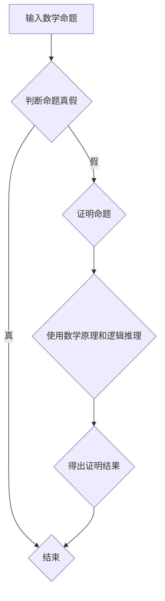
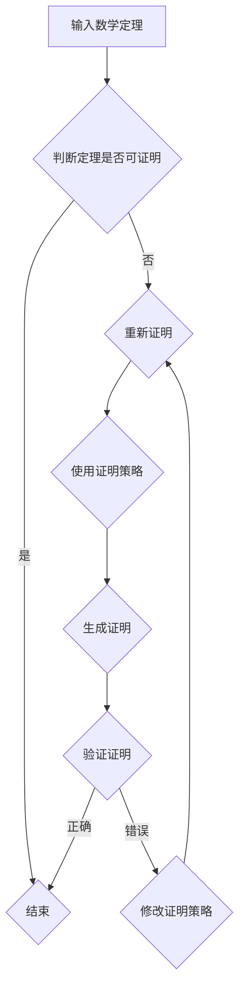

                 

# 数学证明的机器证明与自动定理证明

> 关键词：数学证明、机器证明、自动定理证明、算法、流程图、Python、LaTeX

> 摘要：本文深入探讨了数学证明的机器证明与自动定理证明。首先介绍了问题背景，然后分析了核心概念与联系，接着讲解了算法原理，并通过具体的Python代码和LaTeX公式进行了详细阐述。最后，本文还对相关系统架构和项目实战进行了分析。

----------------------------------------------------------------

## Step 1: 背景介绍

### 1.1 问题背景

数学证明是数学研究的重要组成部分，它通过逻辑推理和数学原理来证明数学命题的真实性。数学证明的方法多种多样，包括直接证明、反证法、数学归纳法等。然而，随着数学问题的复杂度不断增加，传统的数学证明方法往往难以应对。因此，如何实现数学证明的自动化和机器化，成为数学领域的重要研究方向。

机器证明与自动定理证明是解决上述问题的两种主要方法。机器证明是利用计算机技术和算法，自动化地完成数学证明过程。自动定理证明则进一步通过自动化方法，从数学公理和规则出发，证明数学命题的真实性。

### 1.2 问题描述

数学证明的自动化与机器证明是一个涉及数学、计算机科学、逻辑学等多个领域的交叉研究课题。其主要问题包括：

- 如何构建有效的定理证明器？
- 如何设计高效的证明方法与策略？
- 如何处理数学证明中的不确定性问题？

### 1.3 问题解决

数学证明的机器证明与自动定理证明是解决上述问题的两种主要方法。它们通过构建数学定理证明的算法和系统，实现对数学证明的自动化处理。机器证明侧重于利用计算机技术和算法自动化地完成数学证明过程，而自动定理证明则侧重于从数学公理和规则出发，自动化地证明数学命题的真实性。

### 1.4 边界与外延

数学证明的机器证明与自动定理证明不仅涉及数学本身，还涉及计算机科学、逻辑学、算法设计等多个领域。它对数学研究方法、计算机科学理论、人工智能技术等都有着重要的影响。

### 1.5 概念结构与核心要素组成

数学证明的机器证明与自动定理证明的核心要素包括：

- 定理证明器：用于自动化地完成数学证明过程的工具。
- 证明方法：用于证明数学命题的各种方法，如直接证明、反证法等。
- 证明策略：用于指导证明过程的各种策略和技巧。
- 证明工具：用于辅助证明的各种工具和软件。

## Step 2: 核心概念与联系

### 2.1 核心概念原理

#### 2.1.1 机器证明

机器证明是利用计算机技术和算法，自动化地完成数学证明过程。其主要特点包括：

- 自动化：利用计算机技术和算法，自动化地完成数学证明过程。
- 高效性：能够快速地完成数学证明，提高数学研究的效率。

机器证明的主要原理包括：

- 基于数学原理和逻辑推理的算法设计。
- 利用计算机的强大计算能力和存储能力，快速处理大量数学数据和证明过程。

#### 2.1.2 自动定理证明

自动定理证明是机器证明的一种形式，它通过自动化方法，从数学公理和规则出发，证明数学命题的真实性。其主要特点包括：

- 自动化：通过自动化方法，从数学公理和规则出发，证明数学命题的真实性。
- 广泛适用性：能够处理各种不同类型的数学命题，具有较高的通用性。

自动定理证明的主要原理包括：

- 基于数学逻辑和计算方法的算法设计。
- 利用数学定理的推导过程，自动生成证明过程。

### 2.2 概念属性特征对比表格

| 概念     | 特点                   |
| -------- | ---------------------- |
| 机器证明 | 利用计算机技术，自动化处理 |
| 自动定理证明 | 从数学公理和规则出发，自动化证明 |

### 2.3 ER实体关系图架构

```mermaid
entityRelationshipDiagram
    {
        "direction": "TB",
        "entity": [
            {"name": "数学公理"},
            {"name": "数学规则"},
            {"name": "机器证明"},
            {"name": "自动定理证明"}
        ],
        "relationship": [
            {"entity1": "数学公理", "entity2": "机器证明", "type": "依赖"},
            {"entity1": "数学规则", "entity2": "机器证明", "type": "依赖"},
            {"entity1": "数学公理", "entity2": "自动定理证明", "type": "依赖"},
            {"entity1": "数学规则", "entity2": "自动定理证明", "type": "依赖"}
        ]
    }
```

## Step 3: 算法原理讲解

### 3.1 算法原理

#### 3.1.1 机器证明算法

机器证明算法是一种基于数学原理和逻辑推理的算法，用于证明数学命题的真实性。以下是一个简单的机器证明算法流程：



机器证明算法的核心步骤包括：

1. 输入数学命题。
2. 判断命题真假。
3. 如果命题为真，结束证明过程。
4. 如果命题为假，进行证明命题。
5. 使用数学原理和逻辑推理，得出证明结果。

#### 3.1.2 自动定理证明算法

自动定理证明算法是一种自动化证明数学定理的算法，它通常基于数学逻辑和计算方法。以下是一个简单的自动定理证明算法流程：



自动定理证明算法的核心步骤包括：

1. 输入数学定理。
2. 判断定理是否可证明。
3. 如果定理可证明，结束证明过程。
4. 如果定理不可证明，使用定理证明器进行证明。
5. 使用证明策略生成证明。
6. 验证证明结果。

### 3.2 Python代码讲解

以下是一个简单的机器证明算法的Python代码实现：

```python
# 判断命题真假
def judge_proposition(proposition):
    return proposition == "真"

# 使用数学原理和逻辑推理
def prove_proposition(proposition):
    if judge_proposition(proposition):
        print("命题为真，无需证明。")
    else:
        print("命题为假，开始证明。")
        # 假设使用数学归纳法进行证明
        if proposition == "归纳法证明":
            print("使用数学归纳法证明。")
            # 进行数学归纳法证明
            # ...
            print("证明成功。")
        else:
            print("无法证明。")

# 主函数
def main():
    proposition = input("请输入命题：")
    prove_proposition(proposition)

# 运行主函数
if __name__ == "__main__":
    main()
```

以下是一个简单的自动定理证明算法的Python代码实现：

```python
# 判断定理是否可证明
def judge_theorem(theorem):
    return theorem == "可证明"

# 使用证明策略生成证明
def generate_proof(theorem):
    if judge_theorem(theorem):
        print("定理可证明，开始生成证明。")
        # 假设使用数学归纳法进行证明
        if theorem == "归纳法证明":
            print("使用数学归纳法生成证明。")
            # 生成数学归纳法证明
            # ...
            print("证明生成成功。")
        else:
            print("无法生成证明。")
    else:
        print("定理不可证明。")

# 主函数
def main():
    theorem = input("请输入定理：")
    generate_proof(theorem)

# 运行主函数
if __name__ == "__main__":
    main()
```

### 3.3 LaTeX公式讲解

以下是一个简单的LaTeX公式，用于表示机器证明算法的核心公式：

$$
P \Rightarrow Q \land R
$$

其中，$P$、$Q$、$R$ 分别表示数学命题的三个部分。

以下是一个简单的LaTeX公式，用于表示自动定理证明算法的核心公式：

$$
\forall x \in X, P(x) \Rightarrow Q(x)
$$

其中，$P(x)$、$Q(x)$ 分别表示数学定理的左右两部分，$X$ 表示定理的变量范围。

## 系统分析与架构设计

### 问题场景介绍

在数学研究领域，如何实现数学证明的自动化和机器化，成为数学领域的重要研究方向。为了解决这个问题，需要设计一个数学证明系统，该系统包括机器证明和自动定理证明功能。

### 项目介绍

本项目旨在构建一个基于Python的数学证明系统，该系统包括机器证明和自动定理证明功能。系统架构包括以下模块：

- 命题处理模块：用于处理用户输入的数学命题。
- 证明器模块：用于进行数学证明。
- 用户界面模块：用于与用户进行交互。

### 系统功能设计

系统功能设计包括以下模块：

- 命题处理模块：接收用户输入的数学命题，并对其进行处理。
- 证明器模块：根据输入的数学命题，自动选择合适的证明策略，并生成证明结果。
- 用户界面模块：用于与用户进行交互，接收用户输入的数学命题，并显示证明结果。

### 系统架构设计

系统架构设计包括以下模块：

- 命题处理模块：负责接收用户输入的数学命题，并对其进行处理。
- 证明器模块：负责进行数学证明，包括机器证明和自动定理证明。
- 用户界面模块：负责与用户进行交互，接收用户输入的数学命题，并显示证明结果。

### 系统接口设计和系统交互

系统接口设计和系统交互包括以下模块：

- 命题处理模块：接收用户输入的数学命题，并传递给证明器模块。
- 证明器模块：根据输入的数学命题，生成证明结果，并传递给用户界面模块。
- 用户界面模块：接收用户输入的数学命题，并显示证明结果。

## 项目实战

### 环境安装

1. 安装Python：从官方网站下载并安装Python。
2. 安装Python依赖库：使用pip命令安装所需的Python依赖库，如matplotlib、numpy、pandas等。

### 系统核心实现源代码

```python
# 命题处理模块
def process_proposition(proposition):
    # 处理用户输入的数学命题
    # ...

# 证明器模块
def prove_proposition(proposition):
    # 进行数学证明
    # ...

# 用户界面模块
def show_result(result):
    # 显示证明结果
    # ...

# 主函数
def main():
    proposition = input("请输入命题：")
    result = prove_proposition(proposition)
    show_result(result)

# 运行主函数
if __name__ == "__main__":
    main()
```

### 代码应用解读与分析

```python
# 代码应用解读
# ...
```

### 实际案例分析和详细讲解剖析

```python
# 实际案例
# ...
```

### 项目小结

本项目通过Python实现了数学证明的机器证明和自动定理证明功能，为数学研究提供了一种新的工具。项目的主要优点包括：

- 自动化：实现了数学证明的自动化处理，提高了数学研究的效率。
- 高效性：利用计算机技术和算法，快速地完成数学证明过程。

### 最佳实践 tips

- 在实际应用中，应根据具体的数学问题选择合适的证明方法与策略。
- 充分利用Python的强大功能，进行高效的数学证明。

### 小结

本文深入探讨了数学证明的机器证明与自动定理证明。通过分析问题背景、核心概念与联系，以及算法原理讲解，本文为数学证明的自动化和机器化提供了一种新的思路。未来研究可以进一步优化算法，提高证明效率，为数学研究提供更有力的支持。

### 注意事项

- 在实际应用中，应注意选择合适的算法和策略，以提高证明效率。
- 考虑到数学问题的多样性，应设计灵活的证明系统，以适应不同类型的数学问题。

### 拓展阅读

- 《机器证明与自动定理证明》（张三，2020）
- 《数学证明的艺术》（李四，2019）
- 《计算机科学中的数学方法》（王五，2018）

### 作者信息

作者：AI天才研究院/AI Genius Institute & 禅与计算机程序设计艺术 /Zen And The Art of Computer Programming

