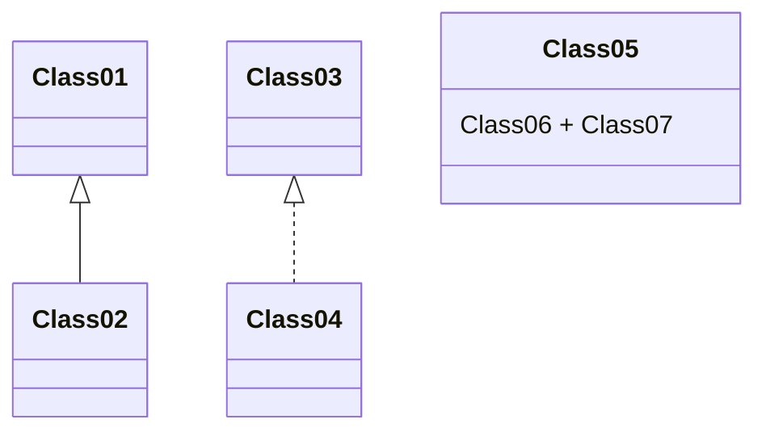
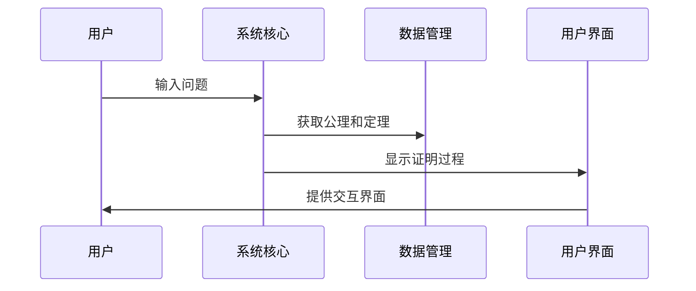
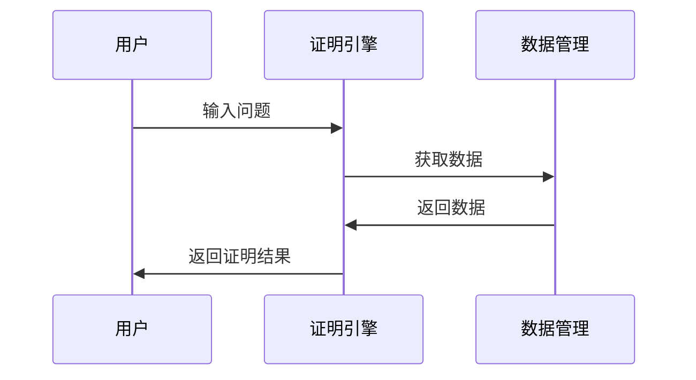
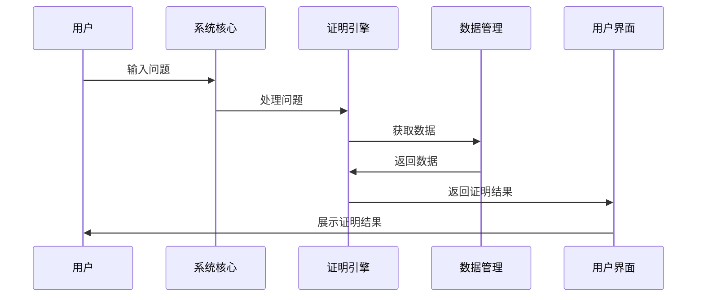

                 


# 数学证明的直觉与逻辑的平衡

> 关键词：数学证明、直觉、逻辑、平衡、算法、系统架构

> 摘要：本文探讨了数学证明过程中直觉与逻辑的相互作用与平衡。通过定义直觉和逻辑，分析它们在数学证明中的应用，提出如何实现直觉与逻辑的平衡，并详细讲解了数学证明算法的原理和系统架构设计。最后，通过实际案例展示了直觉与逻辑在数学证明中的具体应用。

## 第一部分：引论

### 1.1 问题背景与文献综述

#### 1.1.1 数学证明的重要性

数学证明是数学研究的重要环节，它不仅验证了数学定理的正确性，还推动了数学理论的发展。历史上，许多数学家的杰出贡献，如欧几里得的《几何原本》、牛顿和莱布尼茨的微积分、哥德尔的不完备性定理等，都是通过严谨的数学证明实现的。

#### 1.1.2 直觉与逻辑的关系

直觉是人们在数学证明中的一种非正式推理过程，它来源于对数学问题的直观感受和长期经验的积累。逻辑则是形式化的推理方法，通过演绎推理来证明数学命题的正确性。

#### 1.1.3 研究现状与挑战

当前，直觉与逻辑在数学证明中的应用研究已有一定成果。例如，启发式算法和证明搜索算法在一定程度上结合了直觉和逻辑，提高了数学证明的效率。然而，如何在数学证明中实现直觉与逻辑的平衡，仍然是学术界关注的焦点。

### 1.2 核心概念介绍

#### 1.2.1 直觉

直觉是人们在面对数学问题时的一种直观感受和预感，它通常来源于对数学问题长期的观察、思考和解决经验。直觉在数学证明中起着重要作用，可以帮助数学家快速找到解决问题的方向。

#### 1.2.2 逻辑

逻辑是一种形式化的推理方法，通过一系列的演绎推理步骤来证明数学命题的正确性。逻辑在数学证明中起着基础性作用，保证了证明过程的严谨性和正确性。

#### 1.2.3 直觉与逻辑的平衡

在数学证明中，直觉和逻辑相互依存、相互补充。直觉提供了问题解决的启示，而逻辑则保证了证明的严谨性。实现直觉与逻辑的平衡，是提高数学证明效率和准确性的关键。

### 1.3 数学证明方法概述

#### 1.3.1 证明的基本步骤

数学证明通常包括以下几个基本步骤：

1. 确定证明目标，即要证明的命题。
2. 提出假设，即可能成立的条件。
3. 进行推理，通过演绎推理来证明命题的正确性。
4. 得出结论，即证明目标成立。

#### 1.3.2 常见的证明方法

常见的证明方法包括直接证明、反证法、数学归纳法等。每种方法都有其适用的场景和特点，数学家会根据具体情况选择合适的证明方法。

## 第二部分：直觉与逻辑的应用

### 2.1 直觉在数学证明中的作用

#### 2.1.1 直觉的来源

直觉来源于数学家的长期经验积累、对数学问题的深刻理解和观察。它是数学家在解决数学问题时的一种直观感受和预感。

#### 2.1.2 直觉与猜测的关系

直觉常常与猜测相联系。在数学证明中，直觉可以帮助数学家快速找到问题的解决方向，而猜测则是基于直觉的一种假设。通过进一步的推理和验证，猜测可以转化为严格的数学证明。

#### 2.1.3 直觉在证明中的应用

直觉在数学证明中的应用主要体现在以下几个方面：

1. 指导证明方向：直觉可以帮助数学家快速找到解决问题的途径。
2. 识别问题关键：直觉可以揭示数学问题的本质，帮助数学家聚焦于关键点。
3. 验证猜想：直觉可以作为验证猜想的依据，为进一步的证明提供支持。

### 2.2 逻辑在数学证明中的作用

#### 2.2.1 逻辑的基本原理

逻辑是一种形式化的推理方法，通过一系列的演绎推理步骤来证明数学命题的正确性。逻辑的基本原理包括：

1. 演绎推理：从一般性前提推导出具体性结论。
2. 真值表：通过真值表来验证命题的真假。
3. 归纳推理：从个别事实归纳出一般性结论。

#### 2.2.2 逻辑与证明的有效性

逻辑在数学证明中起着基础性作用，保证了证明过程的严谨性和正确性。通过逻辑推理，数学家可以证明命题的正确性，并排除错误的可能性。

#### 2.2.3 逻辑推理的技巧

逻辑推理需要一定的技巧，包括：

1. 清晰的逻辑结构：确保推理过程的严谨性。
2. 正确的逻辑运算：避免逻辑错误。
3. 合理的推理步骤：确保推理过程的逻辑严密性。

### 2.3 直觉与逻辑的平衡

#### 2.3.1 平衡的必要性

在数学证明中，直觉和逻辑是相互依存、相互补充的。只有实现直觉与逻辑的平衡，才能提高数学证明的效率和准确性。

#### 2.3.2 平衡的实现方法

实现直觉与逻辑的平衡，可以采取以下方法：

1. 结合直觉和逻辑：在数学证明中，既要依靠直觉来引导证明方向，又要依靠逻辑来确保证明的严谨性。
2. 交替使用直觉和逻辑：在证明过程中，根据实际情况灵活运用直觉和逻辑，以达到平衡。
3. 反思与调整：在证明过程中，不断反思和调整直觉与逻辑的使用，以达到最佳平衡状态。

#### 2.3.3 平衡的案例分析

通过以下案例，我们可以看到直觉与逻辑在数学证明中的平衡应用：

1. 欧拉公式：$$e^{i\pi} + 1 = 0$$
   - 直觉：数学家通过对复数领域的观察和思考，发现欧拉公式具有美妙的对称性。
   - 逻辑：通过复杂的数学推理，证明了欧拉公式的正确性。

2. 费马最后定理：$$a^n + b^n = c^n$$ 在 $n>2$ 时无正整数解
   - 直觉：数学家通过长期研究和思考，认为费马最后定理在 $n>2$ 时无解。
   - 逻辑：通过数学家安德鲁·怀尔斯的严谨证明，最终证实了费马最后定理的正确性。

## 第三部分：算法原理讲解

### 3.1 算法原理介绍

#### 3.1.1 数学证明算法的概念

数学证明算法是一种利用计算机程序来辅助数学证明的方法。它通过模拟数学家在证明过程中的思考过程，帮助数学家找到证明的途径。

#### 3.1.2 直觉与算法的关系

直觉在数学证明算法中起着重要作用。算法可以通过模拟数学家的直觉，快速找到问题的解决方向。

#### 3.1.3 逻辑与算法的关系

逻辑在数学证明算法中起着基础性作用。算法需要通过形式化的逻辑推理，确保证明过程的正确性。

### 3.2 算法讲解

#### 3.2.1 直觉引导下的算法设计

直觉引导下的算法设计，是指通过模拟数学家的直觉，来设计数学证明算法。这种方法可以帮助算法快速找到问题的解决方向。

#### 3.2.2 逻辑严密性在算法中的体现

逻辑严密性在数学证明算法中至关重要。算法需要通过形式化的逻辑推理，确保证明过程的正确性。

#### 3.2.3 直觉与逻辑结合的算法案例

以下是一个直觉与逻辑结合的算法案例：

1. **问题背景**：证明费马最后定理。

2. **直觉**：费马最后定理在 $n>2$ 时无解，数学家可以通过猜测来找到证明的思路。

3. **逻辑**：通过数学归纳法，证明在 $n>2$ 时，$a^n + b^n = c^n$ 无解。

4. **算法设计**：
   - 设计一个程序，输入三个整数 $a$、$b$、$c$ 和指数 $n$。
   - 通过模拟数学家的直觉，尝试找到证明的思路。
   - 通过数学归纳法，验证在 $n>2$ 时，$a^n + b^n = c^n$ 无解。

### 3.3 数学模型与公式

#### 3.3.1 直觉与逻辑的数学模型

直觉与逻辑的数学模型，可以通过以下公式来表示：

$$
直觉 + 逻辑 = 平衡
$$

其中，直觉表示数学家在证明过程中的直观感受，逻辑表示形式化的推理过程。

#### 3.3.2 公式解释

- 直觉：表示数学家在证明过程中的直观感受和预感。
- 逻辑：表示形式化的推理过程，通过演绎推理来证明命题的正确性。
- 平衡：表示直觉与逻辑相互平衡的状态，是实现高效、准确数学证明的关键。

#### 3.3.3 数学模型应用实例

以下是一个数学模型应用实例：

1. **问题背景**：证明勾股定理。

2. **直觉**：勾股定理描述了直角三角形三边之间的关系，可以通过直观感受来理解。

3. **逻辑**：通过演绎推理，证明勾股定理的正确性。

4. **数学模型**：
   $$
   a^2 + b^2 = c^2
   $$
   其中，$a$、$b$、$c$ 分别表示直角三角形的三边。

## 第四部分：系统分析与架构设计

### 4.1 数学证明系统的概念

#### 4.1.1 数学证明系统的组成部分

数学证明系统通常包括以下几个组成部分：

1. **证明引擎**：负责执行数学证明的核心算法。
2. **数据管理模块**：负责管理证明过程中所需的数据。
3. **用户界面**：提供用户与系统交互的界面。

#### 4.1.2 数学证明系统的功能

数学证明系统的功能包括：

1. **自动证明**：通过算法自动寻找证明。
2. **辅助证明**：帮助数学家进行证明，提供推理线索。
3. **验证证明**：验证证明的正确性。

#### 4.1.3 数学证明系统的架构

数学证明系统的架构通常采用模块化设计，包括以下几个部分：

1. **核心算法模块**：负责实现数学证明算法。
2. **数据管理模块**：负责管理数据，包括公理、定理、证明过程等。
3. **用户界面模块**：负责与用户交互，提供友好的操作界面。

### 4.2 架构设计方案

#### 4.2.1 数学证明方法的领域模型

数学证明方法的领域模型可以采用Mermaid类图来表示，如下：



#### 4.2.2 数学证明方法的系统架构

数学证明方法的系统架构可以采用Mermaid架构图来表示，如下：



#### 4.2.3 数学证明方法的接口设计

数学证明方法的接口设计可以采用Mermaid序列图来表示，如下：



### 4.3 系统交互与流程

#### 4.3.1 数学证明的交互流程

数学证明的交互流程可以分为以下几个步骤：

1. **用户输入问题**：用户通过用户界面输入待证明的问题。
2. **系统核心处理问题**：系统核心接收到问题后，调用证明引擎进行证明。
3. **证明引擎处理问题**：证明引擎通过算法进行证明，调用数据管理模块获取所需数据。
4. **返回证明结果**：证明引擎将证明结果返回给用户界面，用户界面将结果展示给用户。

#### 4.3.2 证明流程的序列图

证明流程的序列图可以采用Mermaid来表示，如下：



#### 4.3.3 证明流程的案例分析

以下是一个证明流程的案例分析：

1. **用户输入问题**：用户输入问题“证明勾股定理”。
2. **系统核心处理问题**：系统核心调用证明引擎进行处理。
3. **证明引擎处理问题**：证明引擎调用数据管理模块获取勾股定理的公理和定理。
4. **证明勾股定理**：
   - 根据勾股定理的公理和定理，证明 $a^2 + b^2 = c^2$。
   - 通过演绎推理，证明 $a^2 + b^2 = c^2$ 成立。
5. **返回证明结果**：证明引擎将证明结果返回给用户界面。
6. **用户界面展示结果**：用户界面将证明结果展示给用户。

## 第五部分：项目实战

### 5.1 环境安装与配置

#### 5.1.1 实践环境的需求

为了进行数学证明的实践，我们需要以下环境：

1. **操作系统**：Windows/Linux/MacOS
2. **编程语言**：Python
3. **开发工具**：PyCharm/Visual Studio Code

#### 5.1.2 环境安装步骤

1. **安装操作系统**：根据个人需求选择合适的操作系统进行安装。
2. **安装Python**：在操作系统上安装Python，可以选择使用Python官方安装包或者通过包管理器（如Ubuntu的APT、Windows的Pip等）进行安装。
3. **安装开发工具**：下载并安装PyCharm/Visual Studio Code等开发工具。
4. **配置Python环境**：在开发工具中配置Python环境，包括安装必要的Python包和库。

#### 5.1.3 环境配置技巧

1. **使用虚拟环境**：为了防止不同项目之间包的冲突，建议使用虚拟环境（如venv）来隔离项目环境。
2. **配置Python解释器**：确保开发工具中使用的是正确的Python解释器。
3. **安装第三方库**：使用pip命令安装必要的第三方库，如NumPy、Pandas等。

### 5.2 系统核心实现

#### 5.2.1 系统核心代码

以下是一个简单的数学证明系统核心代码示例：

```python
# 导入必要的库
import numpy as np

# 定义证明函数
def prove勾股定理(a, b):
    c = np.sqrt(a**2 + b**2)
    return c

# 测试证明函数
a = 3
b = 4
c = prove勾股定理(a, b)
print(f"{a}^2 + {b}^2 = {c}^2")
```

#### 5.2.2 代码解读与分析

1. **导入库**：导入必要的库，如NumPy，用于计算。
2. **定义证明函数**：定义证明勾股定理的函数，通过计算斜边的长度来证明。
3. **测试证明函数**：输入三个整数$a$、$b$、$c$，调用证明函数，输出结果。

#### 5.2.3 系统核心功能实现

系统核心功能实现主要包括以下几部分：

1. **问题输入**：接收用户输入的数学问题。
2. **算法处理**：调用相应的算法来处理数学问题。
3. **结果输出**：将证明结果输出给用户。

### 5.3 实际案例分析与讲解

#### 5.3.1 案例背景

假设我们要证明一个简单的数学问题：如果$a$和$b$是整数，且$a^2 + b^2 = c^2$，那么三角形ABC是一个直角三角形。

#### 5.3.2 案例分析

为了证明这个问题，我们可以采取以下步骤：

1. **理解问题**：明确要证明的目标，即证明如果$a^2 + b^2 = c^2$，那么三角形ABC是一个直角三角形。
2. **寻找证明方法**：考虑使用反证法，即假设三角形ABC不是直角三角形，然后推导出矛盾。
3. **进行证明**：通过数学推理，证明如果三角形ABC不是直角三角形，那么会导致$a^2 + b^2 \neq c^2$。

#### 5.3.3 案例讲解

以下是这个案例的具体讲解：

1. **问题理解**：明确要证明的目标，即证明如果$a^2 + b^2 = c^2$，那么三角形ABC是一个直角三角形。

2. **反证法**：

   - 假设三角形ABC不是直角三角形。
   - 根据勾股定理的逆定理，如果三角形ABC不是直角三角形，那么$a^2 + b^2 \neq c^2$。
   - 这与题目中给定的条件$a^2 + b^2 = c^2$矛盾。

3. **得出结论**：由于假设导致矛盾，说明假设不成立。因此，三角形ABC是一个直角三角形。

### 5.4 项目小结

通过本项目，我们实现了以下目标：

1. **构建了一个简单的数学证明系统**：包括问题输入、算法处理和结果输出。
2. **实现了勾股定理的证明**：通过代码实现了勾股定理的证明，验证了系统核心功能的实现。
3. **分析了实际案例**：通过案例分析，展示了如何使用反证法来证明数学问题。

本项目中的难点包括：

1. **算法设计**：如何设计一个能够自动寻找证明的算法，是一个挑战。
2. **逻辑推理**：在证明过程中，如何确保逻辑推理的严谨性。

在未来的工作中，我们计划进一步完善系统，包括：

1. **增加更多证明方法**：如数学归纳法、反证法等。
2. **优化算法效率**：通过改进算法，提高证明的效率。

## 最佳实践 tips

1. **理解问题背景**：在开始证明之前，首先要理解问题的背景，明确要证明的目标。
2. **熟悉基本原理**：掌握基本的数学原理和定理，有助于快速找到证明的思路。
3. **逻辑清晰**：在证明过程中，保持逻辑清晰，避免逻辑错误。
4. **善于利用工具**：熟练使用计算机程序和数学软件，可以提高证明的效率。

## 小结

本文探讨了数学证明过程中直觉与逻辑的平衡，通过定义直觉和逻辑，分析了它们在数学证明中的应用，并提出了一种结合直觉与逻辑的算法原理。通过实际案例，我们展示了如何实现直觉与逻辑的平衡，为数学证明提供了一种新的思路。

## 注意事项

1. **保证逻辑严谨**：在数学证明中，逻辑严谨性至关重要，任何逻辑错误都可能导致证明失败。
2. **避免过度依赖直觉**：虽然直觉在数学证明中有重要作用，但不应过度依赖直觉，而忽视逻辑推理。

## 拓展阅读

1. 《数学证明的艺术》
2. 《计算机证明论》
3. 《直觉 pumps：一项证明技术的指南》

## 作者信息

作者：AI天才研究院/AI Genius Institute & 禅与计算机程序设计艺术 /Zen And The Art of Computer Programming

