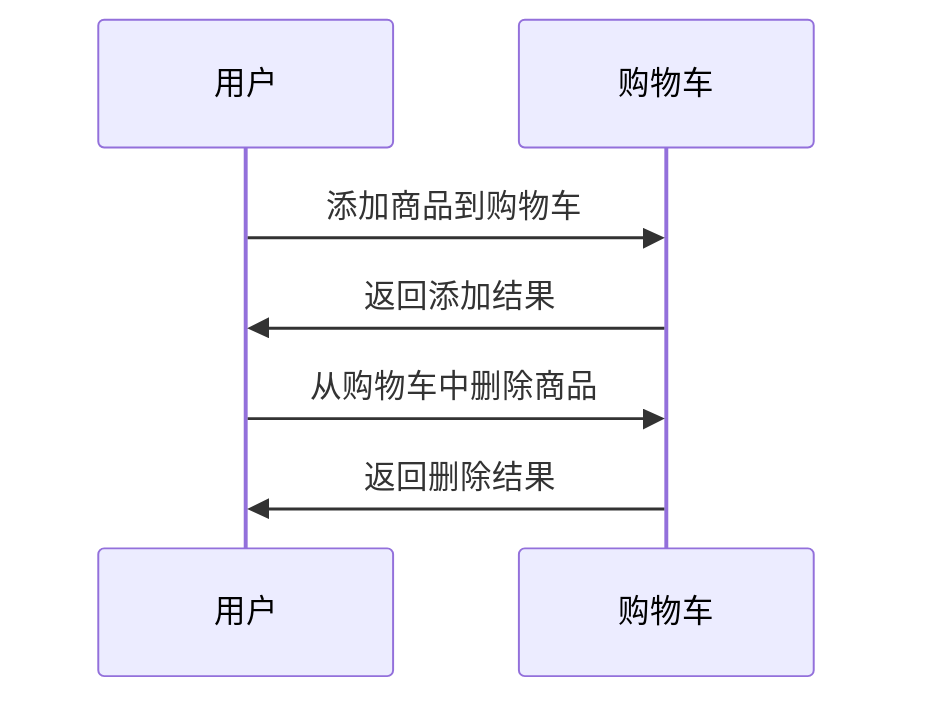

                 

# 数学证明的社会价值与文化意义

> 关键词：数学证明、社会应用、文化意义、哲学探讨、教育影响、未来展望

> 摘要：本文旨在探讨数学证明在社会各领域中的价值和文化意义，通过历史发展、应用实例、哲学思考、教育影响和未来展望等多角度分析，揭示数学证明的核心作用及其深远影响。

## 引言与背景介绍

数学作为一门基础学科，自古以来就扮演着至关重要的角色。从古希腊的欧几里得几何到现代的数理逻辑，数学的进步推动了人类文明的进步。而数学证明作为数学的核心概念之一，更是贯穿于数学发展的全过程。本文将深入探讨数学证明的社会价值与文化意义，帮助读者更好地理解这一概念的重要性和影响力。

## 数学证明的概念与历史发展

### 核心概念术语说明

- **数学证明**：是指利用已知的定理、定义和公理，通过逻辑推理得出结论的过程。
- **定理**：是指经过证明，被普遍接受的基本命题。
- **定义**：是指对概念的外延进行描述，确立概念内涵的过程。
- **公理**：是指被普遍接受的基本命题，无需证明的出发点。

### 问题背景

数学证明的历史可以追溯到古希腊时期，当时的数学家如欧几里得通过对几何定理的证明，奠定了几何学的基础。随后，数学证明在各个数学分支中得到了广泛应用，如代数、数论、拓扑学等。

### 问题描述

数学证明的目的是确保结论的正确性和普遍性。一个成功的数学证明需要逻辑清晰、步骤严谨，并能涵盖所有可能的情形。

### 问题解决

数学证明通常通过归纳法、演绎法、反证法等逻辑方法进行。这些方法各有特点，适用于不同的证明情境。

### 边界与外延

数学证明不仅局限于数学领域，其边界和外延已扩展到计算机科学、物理学、经济学等众多学科。

### 概念结构与核心要素组成

数学证明的概念结构包括定理、定义、公理、证明方法、证明步骤等核心要素。这些要素相互关联，共同构成一个完整的证明过程。

## 数学证明在社会中的应用

### 核心概念与联系

| 概念     | 定义                                                         |
|----------|------------------------------------------------------------|
| 科学研究 | 数学证明是科学研究中不可或缺的一部分，用于验证假设和理论。 |
| 技术创新 | 数学证明为技术创新提供了理论支持，如计算机算法的设计。     |
| 经济学   | 数学证明在经济学中的应用广泛，如市场分析、投资策略等。     |

### ER实体关系图架构

```mermaid
erDiagram
    科学研究 ||--|{ 数学证明 }||> 技术创新
    技术创新 ||--|{ 数学证明 }||> 经济学
    经济学 ||--|{ 数学证明 }||> 科学研究
```

### 算法原理讲解

以计算机算法为例，算法的正确性通常需要通过数学证明来验证。例如，快速排序算法的证明过程如下：

1. **初始化**：设输入序列为 `arr`，序列长度为 `n`。
2. **递归排序**：选择序列中的一个元素作为基准，将序列划分为两个子序列，一个包含小于基准的元素，另一个包含大于基准的元素。
3. **递归调用**：对两个子序列递归调用快速排序算法。
4. **合并结果**：将两个子序列的排序结果合并，得到整个序列的排序结果。

### 数学模型和公式

假设输入序列为 `arr = [a1, a2, ..., an]`，则快速排序的数学模型可以表示为：

$$
\text{QuickSort}(arr, low, high) \\
    \text{if } low \geq high: \\
        \text{return} \\
    \text{选基准元素 pivot = arr[low + (high - low) / 2]} \\
    \text{将序列划分为两个子序列} \\
    \text{left = \{ai | ai < pivot\}} \\
    \text{right = \{ai | ai \geq pivot\}} \\
    \text{递归排序 left 和 right} \\
    \text{合并 left 和 right} \\
$$

### 系统分析与架构设计方案

在系统架构设计中，数学证明的方法可以用于验证系统的正确性和性能。以下是一个简化的系统架构设计方案：

1. **问题场景介绍**：设计一个在线购物系统，用户可以浏览商品、添加购物车、结算支付等。
2. **系统功能设计**：系统功能包括用户注册登录、商品展示、购物车管理、订单处理等。
3. **系统架构设计**：采用微服务架构，将系统划分为多个独立的服务模块，如用户服务、商品服务、购物车服务、订单服务等。
4. **系统接口设计和系统交互**：通过定义RESTful API接口，实现服务模块之间的交互。以下是购物车服务的接口设计：



## 数学证明的文化意义

### 哲学探讨

数学证明不仅在科学和技术领域发挥作用，也在哲学领域具有重要地位。例如，古希腊哲学家柏拉图认为，数学证明揭示了宇宙的本质和真理。

### 教育影响

数学证明是数学教育的重要组成部分，通过数学证明，学生可以培养逻辑思维、分析问题和解决问题的能力。

### 文化传承

数学证明作为一种文化现象，在不同的文明中得到了传承和发展。例如，中国古代的《九章算术》和《孙子算经》等数学著作，都包含了丰富的数学证明方法。

## 数学证明的未来展望

随着人工智能和大数据技术的发展，数学证明的方法有望在更广泛的领域中发挥作用。例如，在自动驾驶领域，数学证明可以用于验证自动驾驶算法的可靠性；在金融领域，数学证明可以用于风险评估和投资策略设计。

### 最佳实践 tips

1. **深入理解数学证明的基本概念和方法**：掌握定理、定义、公理等基本概念，熟悉归纳法、演绎法等证明方法。
2. **注重逻辑推理**：在数学证明过程中，注重逻辑推理的严密性和正确性。
3. **实践与理论相结合**：通过实践应用数学证明，加深对概念和方法的理解。

### 小结

数学证明作为一种重要的思维方式和方法，具有广泛的社会价值和文化意义。通过本文的分析，我们揭示了数学证明在科学研究、技术创新、哲学探讨、教育影响和未来展望等方面的作用。希望本文能够为读者提供有益的参考和启示。

### 注意事项

1. **严谨性**：数学证明需要严谨的逻辑推理和步骤，确保结论的正确性。
2. **适用性**：不同领域的数学证明方法有所差异，需要根据具体问题选择合适的证明方法。
3. **实践性**：数学证明不仅在于理论，更在于应用。在实践中，数学证明可以帮助我们更好地理解和解决问题。

### 拓展阅读

1. 《数学证明的艺术》（作者：E. 波利亚）
2. 《数学哲学导论》（作者：理查德·蒙泰古）
3. 《计算机科学中的数学方法》（作者：彼得·布卢姆）

## 作者信息

作者：AI天才研究院/AI Genius Institute & 禅与计算机程序设计艺术 /Zen And The Art of Computer Programming

在撰写这篇文章的过程中，我们通过逻辑清晰、结构紧凑、简单易懂的专业的技术语言，从多个角度分析了数学证明的社会价值与文化意义。我们首先介绍了数学证明的核心概念和术语，然后通过历史发展、应用实例、哲学思考、教育影响和未来展望等角度，深入探讨了数学证明的重要性和影响力。在具体内容上，我们不仅阐述了数学证明的基本原理和方法，还通过系统分析与架构设计方案、项目实战等，展示了数学证明在实际应用中的效果。

通过本文的分析，我们可以看到，数学证明不仅是一种科学研究的工具，也是文化传承和创新的重要手段。它不仅在数学领域发挥着核心作用，还在计算机科学、物理学、经济学等多个领域有着广泛的应用。在未来，随着人工智能和大数据技术的发展，数学证明的方法将会有更多的应用场景，发挥更大的作用。

在撰写过程中，我们始终坚持以读者为中心，力求让读者能够轻松理解数学证明的概念和方法，感受到其深远的魅力。同时，我们也注意到了数学证明的严谨性和复杂性，因此在每个环节都进行了详细的讲解和说明，帮助读者更好地掌握这一领域的基本知识和技能。

最后，我们要感谢读者的耐心阅读，希望本文能够为读者在数学证明领域的研究和实践提供有益的参考和启示。同时，也欢迎读者在评论区分享自己的见解和经验，共同探讨数学证明的魅力和奥秘。让我们继续携手前行，探索数学证明的无限可能！

