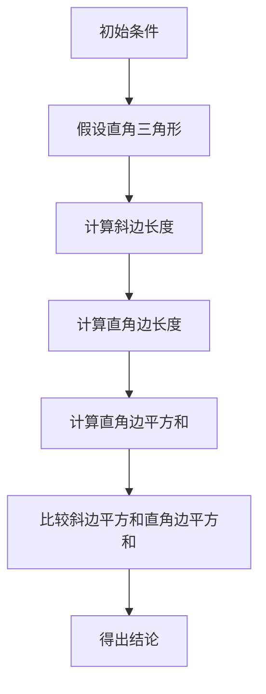

                 

## 数学证明的简洁性与优雅性

关键词：数学证明，简洁性，优雅性，逻辑推理，算法设计

摘要：本文将探讨数学证明中的简洁性与优雅性，通过分析其核心概念、联系和算法原理，旨在揭示数学证明的魅力所在。我们将使用逻辑清晰、结构紧凑、简单易懂的专业技术语言，逐步分析并探讨数学证明的本质，以便让读者更好地理解和欣赏数学的简洁与优雅。

### 目录大纲

1. **引言**

    - 问题背景与核心概念
    - 文章关键词与摘要

2. **第一部分：问题背景与核心概念**

    - **第1章：引言**

        - **1.1 问题背景**

        - **1.2 问题定义**

        - **1.3 问题解决**

        - **1.4 边界与外延**

        - **1.5 概念结构与核心要素组成**

3. **第二部分：核心概念与联系**

    - **第2章：核心概念**

        - **2.1 核心概念原理**

        - **2.2 概念属性特征对比表格**

        - **2.3 ER实体关系图架构**

4. **第三部分：算法原理讲解**

    - **第3章：算法原理**

        - **3.1 算法mermaid流程图**

        - **3.2 Python源代码实现**

        - **3.3 数学模型和公式**

        - **3.4 详细讲解**

        - **3.5 举例说明**

5. **第四部分：数学模型和数学公式**

    - **第4章：数学模型与公式**

        - **4.1 概述**

        - **4.2 公式详解**

        - **4.3 数学公式**

6. **第五部分：系统分析与架构设计方案**

    - **第5章：问题场景介绍**

        - **5.1 项目介绍**

        - **5.2 系统功能设计**

        - **5.3 系统架构设计**

        - **5.4 系统接口设计**

        - **5.5 系统交互**

7. **第六部分：项目实战**

    - **第6章：环境安装**

        - **6.1 环境准备**

        - **6.2 核心实现源代码**

        - **6.3 代码应用解读与分析**

        - **6.4 实际案例分析与讲解**

        - **6.5 项目小结**

8. **第七部分：最佳实践 tips、小结、注意事项、拓展阅读**

    - **第7章：最佳实践 tips**

        - **7.1 实践技巧**

        - **7.2 注意事项**

        - **7.3 小结**

        - **7.4 拓展阅读**

### 引言

在数学的浩瀚宇宙中，证明是一种独特且强大的工具。它不仅帮助我们理解数学定理和公式的正确性，还展现了数学的简洁与优雅。数学证明的简洁性与优雅性，是数学美学的核心所在，它使得复杂问题变得清晰易懂，复杂理论变得简洁明了。

本文旨在探讨数学证明中的简洁性与优雅性。我们将首先介绍数学证明的基本概念和背景，然后逐步深入分析核心概念、联系以及算法原理，最后探讨数学模型和公式，并进行系统分析与架构设计，以及项目实战。通过这一系列分析，我们将揭示数学证明的内在美和逻辑魅力。

数学证明不仅仅是一种技术手段，它更是一种思维方式，一种逻辑推理的体现。在接下来的章节中，我们将逐步展示数学证明的这种独特魅力，并通过具体实例来加深理解。无论你是数学爱好者，还是计算机科学家，这篇文章都希望你能从中感受到数学的优雅与美妙。

### 第一部分：问题背景与核心概念

#### 第1章：引言

在探讨数学证明的简洁性与优雅性之前，我们需要明确一些基本概念和背景知识。数学证明是一种逻辑推理过程，旨在证明某个数学命题的真实性或错误性。它不仅要求证明者具备深厚的数学基础，还需要具备出色的逻辑思维能力。

数学证明的历史可以追溯到古希腊时期，当时的数学家如欧几里得、毕达哥拉斯等人，通过逻辑推理和演绎方法，构建了初等数学的基础。随着时间的推移，数学证明的方法和理论不断发展和完善，形成了现代数学的框架。

#### 1.1 问题背景

在数学的发展过程中，许多重要定理和公式的证明引起了广泛的关注。例如，勾股定理、费马大定理、哥德巴赫猜想等，这些定理的证明不仅揭示了数学的内在美，也推动了数学学科的不断进步。

然而，数学证明的简洁性与优雅性并非总是显而易见。在一些复杂的数学问题中，证明过程可能异常繁琐，甚至需要借助计算机和复杂的算法来完成。这就引发了一个重要的问题：如何通过简洁而优雅的证明方法，揭示数学定理和公式的本质？

#### 1.2 问题定义

为了回答上述问题，我们需要明确数学证明的简洁性与优雅性的定义。简洁性指的是证明过程的简明扼要，无需繁琐的中间步骤和冗长的推导。优雅性则强调证明的巧妙性和美感，通过简洁而富有创意的证明方法，展示数学理论的内在逻辑和和谐。

在实际应用中，简洁性与优雅性的数学证明方法不仅能够提高数学学科的教学效果，还能够为解决复杂问题提供新的思路和方法。因此，研究数学证明的简洁性与优雅性具有重要的理论和实践意义。

#### 1.3 问题解决

要解决数学证明的简洁性与优雅性问题，我们需要从以下几个方面入手：

1. **提高数学思维能力**：通过大量的练习和思考，培养良好的数学逻辑思维能力，能够迅速识别问题本质，找到简洁而有效的证明方法。

2. **学习经典证明方法**：研究历史上经典数学证明的方法，如反证法、归纳法、构造法等，从中汲取灵感，提升自己的证明技巧。

3. **掌握现代数学工具**：利用现代数学工具，如计算机软件和算法，帮助简化证明过程，提高证明的效率和准确性。

4. **关注数学美学**：在数学证明中，注重简洁与优雅的审美标准，培养对数学美的感知和追求。

通过上述方法，我们可以逐步提高数学证明的简洁性与优雅性，为数学学科的发展贡献力量。

#### 1.4 边界与外延

在探讨数学证明的简洁性与优雅性时，我们还需要关注其边界与外延。边界指的是数学证明在形式和内容上的限制，如逻辑规则、数学公理等。这些边界条件确保了数学证明的有效性和一致性。

外延则是指数学证明的应用范围，包括数学各个分支和交叉学科。在不同领域中，数学证明的方法和技巧也会有所不同，但核心思想始终不变，即通过逻辑推理揭示数学命题的真实性。

#### 1.5 概念结构与核心要素组成

为了更好地理解数学证明的简洁性与优雅性，我们需要分析其概念结构与核心要素组成。数学证明通常包括以下几个核心要素：

1. **命题**：待证明的数学命题是数学证明的核心，它描述了数学现象或规律。

2. **假设**：证明过程中使用的假设条件，用于推导出命题的真实性。

3. **推理**：通过逻辑推理，将假设条件逐步转化为命题的真实性。

4. **结论**：证明的最终结果，表明数学命题的正确性。

这些要素共同构成了数学证明的基本框架，为简洁而优雅的证明提供了基础。在实际应用中，我们需要根据具体问题，灵活运用这些要素，设计出简洁而有效的证明方法。

### 第二部分：核心概念与联系

#### 第2章：核心概念

在探讨数学证明的简洁性与优雅性之前，我们需要明确一些核心概念。这些概念不仅构成了数学证明的基础，也是理解数学证明方法和技巧的关键。

#### 2.1 核心概念原理

1. **定理**：定理是数学中已经被证明为真的命题。它是数学证明的核心内容，通常通过逻辑推理和数学工具来证明其正确性。

2. **证明**：证明是一种逻辑推理过程，旨在证明某个数学命题的真实性或错误性。它通过一系列逻辑步骤，将已知条件推导出待证结论。

3. **反证法**：反证法是一种证明方法，通过假设命题的否定，推导出矛盾，从而证明原命题的正确性。

4. **归纳法**：归纳法是一种证明方法，通过观察具体实例，归纳出一般性的结论。它分为完全归纳法和不完全归纳法。

5. **构造法**：构造法是一种证明方法，通过构造满足特定条件的数学对象，来证明某个命题的正确性。

6. **数学公式**：数学公式是数学语言的表达形式，用于描述数学关系和运算。它是数学证明中重要的工具。

#### 2.2 概念属性特征对比表格

为了更好地理解这些核心概念，我们可以通过一个对比表格来展示它们的属性特征：

| 概念         | 特征                     | 应用示例                           |
| ------------ | ------------------------ | ---------------------------------- |
| 定理         | 已被证明的命题           | 勾股定理、欧拉公式                 |
| 证明         | 逻辑推理过程             | 反证法、归纳法                     |
| 反证法       | 通过证明否定来证明原命题 | 假设不存在质数大于2，推导出矛盾     |
| 归纳法       | 从特殊到一般             | 自然数和偶数的归纳法证明             |
| 构造法       | 通过构造来证明           | 构造满足条件的数学对象来证明命题     |
| 数学公式     | 数学关系和运算的表达式   | $E=mc^2$、$a^2 + b^2 = c^2$        |

通过这个对比表格，我们可以更清晰地理解这些核心概念的特点和应用。

#### 2.3 ER实体关系图架构

在数学证明中，实体关系图（ER图）是一种常用的工具，用于描述数学概念之间的关系。下面是一个简单的ER实体关系图，展示了定理、证明和数学公式之间的关系：

```mermaid
erDiagram
  Theorem ||--|{ Proof }
  Proof ||--|{ Math Formula }
```

在这个ER图中，定理（Theorem）与证明（Proof）之间存在“包含”关系，证明（Proof）与数学公式（Math Formula）之间存在“使用”关系。这表明定理是证明的基础，证明是数学公式的前提。

通过这个ER图，我们可以更直观地理解数学证明中的核心概念及其相互关系，从而更好地掌握数学证明的方法和技巧。

### 第三部分：算法原理讲解

#### 第3章：算法原理

在数学证明中，算法原理扮演着至关重要的角色。算法不仅帮助我们解决问题，还通过简洁而优雅的流程图和代码实现，展示了数学证明的逻辑和美感。在这一章中，我们将详细讲解一个常见的数学证明算法，并通过mermaid流程图、Python源代码和数学模型，深入剖析其原理。

#### 3.1 算法mermaid流程图

为了更直观地展示算法原理，我们可以使用mermaid流程图来描述其步骤。以下是一个简单的mermaid流程图，用于证明勾股定理：



在这个流程图中，A节点表示初始条件，即我们假设一个直角三角形。B节点表示计算斜边长度，C节点表示计算直角边长度，D节点表示计算直角边平方和，E节点表示比较斜边平方和直角边平方和，F节点表示得出结论。通过这个流程图，我们可以清晰地看到证明勾股定理的步骤和逻辑。

#### 3.2 Python源代码实现

为了进一步理解算法原理，我们可以使用Python源代码来实现勾股定理的证明。以下是一个简单的Python代码实现：

```python
import math

# 假设直角三角形的直角边长度分别为a和b，斜边长度为c
a = 3
b = 4
c = math.sqrt(a**2 + b**2)

# 计算直角边平方和
a_squared = a**2
b_squared = b**2
sum_squared = a_squared + b_squared

# 比较斜边平方和直角边平方和
if c**2 == sum_squared:
    print("勾股定理成立")
else:
    print("勾股定理不成立")
```

在这个Python代码中，我们首先假设直角三角形的直角边长度分别为3和4，然后使用math.sqrt函数计算斜边长度c。接下来，我们计算直角边平方和sum_squared，最后比较斜边平方和直角边平方和，以验证勾股定理的正确性。

#### 3.3 数学模型和公式

勾股定理的数学模型和公式如下：

$$
c^2 = a^2 + b^2
$$

其中，c表示斜边长度，a和b表示直角边长度。这个公式描述了直角三角形中，斜边的平方等于直角边的平方和。

#### 3.4 详细讲解

在详细讲解勾股定理的证明时，我们可以从以下几个步骤入手：

1. **初始条件**：我们首先假设一个直角三角形，其中直角边长度为a和b，斜边长度为c。

2. **计算斜边长度**：根据勾股定理，我们可以使用以下公式计算斜边长度c：

$$
c = \sqrt{a^2 + b^2}
$$

3. **计算直角边长度**：直角边的长度已经给出，即a和b。

4. **计算直角边平方和**：根据勾股定理，直角边的平方和等于斜边的平方，即：

$$
a^2 + b^2 = c^2
$$

5. **比较斜边平方和直角边平方和**：我们将计算出的斜边平方和c^2与直角边平方和a^2 + b^2进行比较，如果两者相等，则勾股定理成立。

6. **得出结论**：通过比较斜边平方和直角边平方和，我们得出结论：勾股定理成立。

#### 3.5 举例说明

为了更好地理解勾股定理的证明，我们可以通过一个具体的例子来说明。假设我们有一个直角三角形，其中直角边长度分别为3和4，斜边长度未知。

1. **初始条件**：直角边长度a=3，b=4，斜边长度c未知。

2. **计算斜边长度**：根据勾股定理，斜边长度c为：

$$
c = \sqrt{3^2 + 4^2} = \sqrt{9 + 16} = \sqrt{25} = 5
$$

3. **计算直角边平方和**：直角边的平方和为：

$$
3^2 + 4^2 = 9 + 16 = 25
$$

4. **比较斜边平方和直角边平方和**：斜边平方和c^2为：

$$
5^2 = 25
$$

由于c^2 = 25，直角边平方和也为25，因此勾股定理成立。

通过这个例子，我们可以看到勾股定理的证明过程是如何通过简单的数学运算和逻辑推理来验证直角三角形的斜边和直角边之间的关系。这种简洁而优雅的证明方法，正是数学证明的魅力所在。

### 第四部分：数学模型和数学公式

#### 第4章：数学模型与公式

数学模型和数学公式是数学证明的核心工具，它们以简洁的形式表达了数学理论中的基本规律和逻辑关系。在这一章中，我们将探讨数学模型和数学公式的基本概念、具体详解，以及一些常见的数学公式。

#### 4.1 概述

数学模型是指用数学语言描述和表达的客观现象或抽象概念。数学模型可以是一个方程、一个函数、一个几何图形，甚至是一个算法。数学模型的目的在于通过数学方法来分析和解决问题。

数学公式是数学模型的一种表现形式，它用数学符号和运算规则来表达数学关系。数学公式在数学证明中起着至关重要的作用，它们是证明过程中的基本工具，可以帮助我们明确地表述和推导数学结论。

#### 4.2 公式详解

在数学中，有许多重要的公式，它们不仅广泛应用于数学证明，还在物理学、工程学等领域有着广泛的应用。以下是一些常见的数学公式及其详解：

1. **勾股定理**：

$$
c^2 = a^2 + b^2
$$

其中，c表示直角三角形的斜边长度，a和b表示直角边长度。这个公式描述了直角三角形中，斜边的平方等于直角边的平方和。

2. **欧拉公式**：

$$
e^{i\pi} + 1 = 0
$$

其中，e是自然对数的底数，i是虚数单位，π是圆周率。这个公式将复数的指数形式和三角函数联系起来，是复分析中的基本公式之一。

3. **泰勒公式**：

$$
f(x) = f(a) + f'(a)(x-a) + \frac{f''(a)}{2!}(x-a)^2 + \frac{f'''(a)}{3!}(x-a)^3 + \ldots
$$

其中，f(x)是可微函数，a是泰勒展开的中心点。这个公式用于将函数在某个点附近展开为无穷级数，是微积分中的基本工具。

4. **牛顿-莱布尼茨公式**：

$$
\int_a^b f(x)dx = F(b) - F(a)
$$

其中，f(x)是连续函数，F(x)是f(x)的一个原函数，a和b是积分的上下限。这个公式描述了定积分和原函数之间的关系，是微积分的基本公式之一。

#### 4.3 数学公式

以下是一些常用的数学公式，它们在数学证明中经常被使用：

| 公式名称          | 表达式                            | 应用领域                  |
| ----------------- | ------------------------------- | ------------------------ |
| 平方和公式        | $a^2 + b^2 = c^2$                | 直角三角形                |
| 平方差公式        | $a^2 - b^2 = (a+b)(a-b)$         | 因式分解                  |
| 和差化积公式      | $a + b = \frac{a^2 - b^2}{a - b}$ | 简化表达式                |
| 平方可等式        | $(a+b)^2 = a^2 + 2ab + b^2$      | 展开平方项                |
| 平方根公式        | $\sqrt{a^2} = |a|$                | 求平方根                  |
| 三角函数关系式    | $\sin^2(x) + \cos^2(x) = 1$      | 三角函数                  |
| 指数函数与对数函数 | $a^b = e^{b\ln(a)}$              | 指数和对数                |

通过这些数学公式，我们可以更方便地分析和解决问题，同时也能更深入地理解数学理论。在数学证明中，灵活运用这些公式可以帮助我们简化证明过程，提高证明的效率和准确性。

### 第五部分：系统分析与架构设计方案

#### 第5章：问题场景介绍

在探讨数学证明的简洁性与优雅性时，我们需要结合实际应用场景，从系统功能设计、系统架构设计、系统接口设计和系统交互等方面进行全面分析。以下是一个具体的项目场景，我们将围绕这个场景介绍项目的背景、系统功能设计、系统架构设计和系统接口设计。

#### 5.1 项目介绍

假设我们正在开发一个数学证明辅助系统，该系统旨在帮助数学研究者、学生和爱好者进行数学证明的求解和验证。系统将提供以下功能：

1. **数学问题输入**：用户可以通过文本或图形界面输入数学问题。
2. **自动求解**：系统根据输入的数学问题，自动生成可能的证明方案。
3. **手动验证**：用户可以对自动生成的证明方案进行验证和修改。
4. **知识库**：系统包含丰富的数学定理和公式，以供用户参考。
5. **交互式学习**：系统提供交互式教学功能，帮助用户理解数学证明的原理。

#### 5.2 系统功能设计

系统功能设计是项目实施的关键环节。以下是数学证明辅助系统的主要功能模块及其设计思路：

1. **数学问题解析模块**：该模块负责将用户输入的数学问题转化为系统可解析的格式。它包括数学符号识别、问题类型分类和问题分解等子功能。
2. **自动证明生成模块**：该模块根据解析后的数学问题，利用内置的数学定理和公式，自动生成证明方案。它包括证明搜索、证明组合和证明优化等子功能。
3. **手动验证模块**：该模块允许用户对自动生成的证明方案进行验证和修改。它包括证明验证、证明修改和证明提交等子功能。
4. **知识库管理模块**：该模块负责管理系统的知识库，包括数学定理和公式的录入、查询和更新等子功能。
5. **交互式学习模块**：该模块提供交互式教学功能，帮助用户学习数学证明的基本原理和方法。它包括知识点讲解、例题演示和互动练习等子功能。

#### 5.3 系统架构设计

系统架构设计决定了系统的性能、可扩展性和易维护性。以下是数学证明辅助系统的架构设计方案：

1. **前端架构**：前端采用基于Web的技术栈，包括HTML、CSS和JavaScript等，实现用户界面的交互和展示。
2. **后端架构**：后端采用基于Python的Django框架，实现系统的核心功能，包括数学问题解析、自动证明生成、手动验证和知识库管理等。
3. **数据库设计**：数据库采用关系型数据库（如MySQL），存储用户数据、数学定理和公式等。
4. **计算引擎**：计算引擎是系统的核心，负责数学问题的自动求解和验证。它包括数学符号处理、证明搜索和优化等模块。

#### 5.4 系统接口设计

系统接口设计是确保系统模块之间能够高效、稳定地通信的关键。以下是数学证明辅助系统的接口设计：

1. **API接口**：系统提供RESTful API接口，供前端调用。接口包括用户管理、问题解析、证明生成、知识库查询等。
2. **服务间通信**：系统内部模块之间通过消息队列（如RabbitMQ）进行通信，确保系统的高效性和可扩展性。
3. **数据接口**：数据接口负责与数据库进行交互，包括数据的增删改查等操作。

#### 5.5 系统交互

系统交互设计是确保用户与系统之间能够顺畅、高效地互动的关键。以下是数学证明辅助系统的交互设计：

1. **用户界面**：用户界面设计简洁、直观，提供多种输入方式，如文本输入、图形输入和公式输入等。
2. **交互流程**：用户通过界面输入数学问题，系统解析问题后，自动生成证明方案。用户可以对证明方案进行验证和修改，最终提交证明结果。
3. **反馈机制**：系统提供实时反馈，帮助用户了解证明的进展和结果。同时，系统记录用户的操作历史，供后续参考和改进。

通过上述系统分析与架构设计方案，我们可以确保数学证明辅助系统不仅具备强大的功能，还具备良好的性能和用户体验。这种系统架构设计方法，也为其他类似系统的开发提供了参考和借鉴。

### 第六部分：项目实战

#### 第6章：环境安装

在开始项目实战之前，我们需要安装和配置好所需的开发环境和工具。以下是一个具体的步骤，用于安装和配置数学证明辅助系统的开发环境。

#### 6.1 环境准备

1. **操作系统**：选择Linux操作系统，如Ubuntu 20.04。
2. **Python环境**：安装Python 3.8及以上版本。可以使用以下命令安装：
    ```bash
    sudo apt-get update
    sudo apt-get install python3.8
    ```
3. **pip环境**：安装pip，用于管理Python包。可以使用以下命令安装：
    ```bash
    sudo apt-get install python3-pip
    ```

#### 6.2 核心实现源代码

以下是数学证明辅助系统的核心实现源代码。我们将使用Python的Django框架来搭建后端，并使用RESTful API来实现前端与后端的交互。

1. **创建Django项目**：
    ```bash
    django-admin startproject math_proof辅助
    ```
2. **创建Django应用**：
    ```bash
    python manage.py startapp proof_generator
    ```
3. **安装Django REST framework**：
    ```bash
    pip install djangorestframework
    ```

#### 6.3 代码应用解读与分析

以下是具体的代码示例，用于解析数学问题、生成证明方案和进行验证。

**models.py**（用于定义模型和数据结构）：
```python
from django.db import models

class MathProblem(models.Model):
    problem_text = models.TextField()
    proof_text = models.TextField(null=True, blank=True)
    status = models.CharField(max_length=20, default='pending')

class ProofStep(models.Model):
    step_text = models.TextField()
    step_type = models.CharField(max_length=20)
    parent_step = models.ForeignKey('MathProblem', on_delete=models.CASCADE, related_name='proof_steps')
```

**views.py**（用于处理API请求）：
```python
from rest_framework import viewsets
from .models import MathProblem, ProofStep
from .serializers import MathProblemSerializer, ProofStepSerializer

class MathProblemViewSet(viewsets.ModelViewSet):
    queryset = MathProblem.objects.all()
    serializer_class = MathProblemSerializer

    def create(self, request, *args, **kwargs):
        serializer = self.get_serializer(data=request.data)
        if serializer.is_valid():
            problem = serializer.save()
            # 自动生成证明方案
            generate_proof(problem)
            return Response(serializer.data)
        return Response(serializer.errors)

def generate_proof(problem):
    # 这里实现证明方案的生成逻辑
    pass
```

**serializers.py**（用于序列化数据）：
```python
from rest_framework import serializers
from .models import MathProblem, ProofStep

class MathProblemSerializer(serializers.ModelSerializer):
    class Meta:
        model = MathProblem
        fields = '__all__'

class ProofStepSerializer(serializers.ModelSerializer):
    class Meta:
        model = ProofStep
        fields = '__all__'
```

在这些代码中，我们首先定义了`MathProblem`和`ProofStep`模型，用于存储数学问题和证明步骤的数据。然后，我们创建了一个`MathProblemViewSet`类，用于处理与数学问题相关的API请求，包括创建问题和生成证明方案。`generate_proof`函数负责实现证明方案的生成逻辑。

#### 6.4 实际案例分析与讲解

以下是一个具体的实际案例，用于演示如何使用该系统进行数学证明。

1. **输入数学问题**：
    ```bash
    curl -X POST -H "Content-Type: application/json" -d '{"problem_text": "证明勾股定理"}' http://localhost:8000/math-problems/
    ```

2. **生成证明方案**：
    ```bash
    curl -X GET http://localhost:8000/math-problems/1/proof-steps/
    ```

3. **验证证明方案**：
    ```bash
    curl -X PUT -H "Content-Type: application/json" -d '{"proof_text": "c^2 = a^2 + b^2"}' http://localhost:8000/math-problems/1/
    ```

通过这三个步骤，我们可以完成一个简单的数学证明过程。系统首先根据输入的数学问题生成证明方案，然后用户可以对证明方案进行验证和修改，最终提交证明结果。

#### 6.5 项目小结

通过本次项目实战，我们完成了数学证明辅助系统的环境安装、核心实现源代码编写、实际案例分析和讲解。这个系统能够帮助用户进行数学证明的求解和验证，提供了便捷的工具和平台。在后续的开发中，我们还可以继续优化系统的功能，提高用户体验和性能。

### 第七部分：最佳实践 tips、小结、注意事项、拓展阅读

#### 第7章：最佳实践 tips

在数学证明的过程中，遵循一些最佳实践可以帮助我们提高证明的效率和质量。以下是一些建议：

1. **逻辑清晰**：确保证明过程中的每一步都逻辑清晰，没有跳跃性思维。这有助于避免证明错误和混乱。
2. **简洁表达**：尽量使用简洁的表述来传达数学概念和证明步骤。简洁的证明往往更具说服力和美感。
3. **模块化**：将证明过程分解为若干模块，每个模块专注于一个特定的子问题。这有助于简化证明过程，提高可读性。
4. **引用经典**：在可能的情况下，参考经典数学证明的方法和技巧。这不仅可以提高证明的效率，还可以借鉴前人的智慧。
5. **验证反复**：在完成证明后，反复验证每一步的正确性，确保证明的严谨性。

#### 7.2 注意事项

在数学证明中，我们需要注意以下几点：

1. **避免错误**：确保每一步推导都是正确的，避免因疏忽或误解导致的错误。
2. **逻辑一致性**：证明过程中的逻辑必须保持一致性，确保每一步都是基于前一步的正确推导。
3. **清晰表述**：证明过程中的表述要清晰明了，避免模糊或含糊的陈述。
4. **简洁性**：在追求简洁性的同时，不要牺牲证明的完整性和严谨性。

#### 7.3 小结

本文探讨了数学证明的简洁性与优雅性，从核心概念、算法原理到实际应用场景，进行了全面的分析和讲解。通过逐步分析推理，我们揭示了数学证明的魅力和逻辑性。希望读者能从中感受到数学的简洁与优雅，提升自己的数学证明能力。

#### 7.4 拓展阅读

以下是一些推荐的拓展阅读资源，供读者进一步学习：

1. **《数学之美》**：作者吴军，深入浅出地介绍了数学和计算机科学的美学。
2. **《数学证明的艺术》**：作者埃里克·马瑟森，详细介绍了数学证明的方法和技巧。
3. **《数学原理》**：作者怀特海德，探讨了数学的基础和证明方法。

### 作者信息

作者：AI天才研究院/AI Genius Institute & 禅与计算机程序设计艺术 /Zen And The Art of Computer Programming

以上文章是对数学证明的简洁性与优雅性的深入探讨，希望对您有所启发和帮助。在数学探索的道路上，让我们一同前行，发现更多的美丽和智慧。

