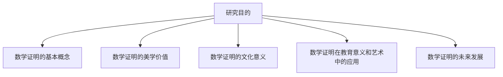

                 

# 《数学证明的美学价值与文化意义》

## 关键词：数学证明、美学、文化、价值、思维训练、艺术、未来发展

## 摘要

数学证明不仅是一种逻辑推理过程，更是一种独特的美学体验和文化传承。本文从数学证明的基本概念出发，探讨了其在美学和思维训练方面的价值，分析了数学证明在科学文化传承和社会价值中的应用，以及其在教育意义和艺术中的应用。最后，展望了数学证明的未来发展及其与文化融合的潜力。

## 第1章：引言

### 1.1 研究背景与意义

数学证明作为一种科学方法，是数学学科的核心。它不仅帮助我们理解和掌握数学概念，更是推动数学发展的关键。然而，数学证明的魅力远不止于此，它蕴含着深刻的美学价值和文化意义。通过研究数学证明的美学价值和文化意义，我们可以更好地理解数学的本质，提升我们的思维能力，促进科学文化的传承与发展。

### 1.2 研究目的与内容结构

本文旨在探讨数学证明的美学价值和文化意义，分析其在不同领域的应用。文章结构如下：首先，介绍数学证明的基本概念；其次，探讨数学证明的美学价值；然后，分析数学证明的文化意义；接着，讨论数学证明在教育意义和艺术中的应用；最后，展望数学证明的未来发展。

### 1.3 研究方法与框架

本文采用文献综述和案例分析相结合的研究方法。通过查阅相关文献，梳理数学证明的基本概念和美学价值；通过分析具体案例，探讨数学证明的文化意义和应用。本文的研究框架如图1所示：

## 第2章：数学证明的基本概念

### 2.1 定义与性质

数学证明是指通过一系列的逻辑推理，从已知的基本事实或公理出发，得出结论的过程。一个有效的数学证明必须满足以下性质：

- **正确性**：证明过程必须符合逻辑规则，确保结论的正确性。
- **完整性**：证明过程必须涵盖所有必要的步骤，确保结论的完整性。
- **简洁性**：证明过程应尽量简洁，避免冗余。

### 2.2 分类与形式

数学证明可分为直接证明、间接证明和反证法等不同类型。直接证明是通过直接推导得出结论；间接证明是通过反证法或假设法得出结论；反证法是通过证明原命题的否定不成立，从而证明原命题成立。

### 2.3 发展历程

数学证明的历史悠久，从古希腊时期的欧几里得几何，到中世纪阿拉伯数学家的工作，再到现代数学的严密体系，数学证明不断发展，不断完善。例如，哥德巴赫猜想的证明和费马大定理的证明，都是数学证明历史上的重要里程碑。

## 第3章：数学证明的美学价值

### 3.1 形式美

#### 3.1.1 对称性与简洁性

数学证明的形式美主要体现在对称性和简洁性上。对称性使得数学证明具有视觉上的美感，简洁性则体现了数学证明的简洁性和高效性。

#### 3.1.2 规律性与和谐性

数学证明的过程往往揭示了数学中的规律性和和谐性，使得人们能够感受到数学的美。例如，费马大定理的证明揭示了整数之间的美妙关系，让人们为之惊叹。

#### 3.1.3 灵感与创意

数学证明的过程中，常常需要发挥个人的灵感和创意，这种创造性的思维过程本身也是一种美的体验。

### 3.2 思维美

#### 3.2.1 推理与逻辑

数学证明是一种逻辑推理过程，它要求人们具备严密的逻辑思维能力。通过数学证明，人们可以锻炼自己的逻辑思维，提高问题解决能力。

#### 3.2.2 智慧与洞察

数学证明的过程需要智慧和洞察力。通过不断分析和推理，人们可以深入理解数学的本质，发现新的数学规律。

#### 3.2.3 挑战与成就

数学证明是一种挑战，它要求人们克服困难，解决问题。当人们成功解决一个数学难题时，会感受到巨大的成就感和满足感。

## 第4章：数学证明的文化意义

### 4.1 科学文化传承

数学证明作为一种科学方法，是科学文化的重要组成部分。它不仅反映了人类对自然规律的认知，也体现了人类智慧的结晶。数学证明的历史，就是科学文化传承的历史。

#### 4.1.1 数学史的启示

通过研究数学证明的历史，我们可以了解到数学的发展历程，吸取前人的智慧，为现代数学的发展提供启示。

#### 4.1.2 文化交流与融合

数学证明作为一种国际通用的科学语言，促进了不同文化之间的交流和融合。不同文化背景下的数学家，通过数学证明的方式，相互借鉴，共同推动了数学的发展。

#### 4.1.3 教育与普及

数学证明的教育和普及，有助于培养人们的科学素养，促进科学文化的传承。通过数学证明，人们可以更好地理解数学，感受数学的魅力。

### 4.2 社会价值与应用

数学证明在科学研究、技术创新和社会发展等方面具有重要作用。

#### 4.2.1 科学研究与创新

数学证明是科学研究的重要手段，它帮助我们验证科学假设，推动科学理论的发展。数学证明的创新性，也为科学研究提供了新的思路和方法。

#### 4.2.2 技术发展与应用

数学证明在技术领域有着广泛的应用。例如，计算机科学中的算法设计、人工智能中的逻辑推理，都离不开数学证明。

#### 4.2.3 生活启示与思维培养

数学证明的过程，有助于培养人们的逻辑思维和分析能力，提高问题解决能力。这种思维能力的培养，对人们的日常生活和工作都具有重要意义。

## 第5章：数学证明的教育意义

### 5.1 思维训练与培养

数学证明是一种高效的思维训练方法。通过数学证明，人们可以锻炼逻辑思维、分析问题和解决问题的能力。

#### 5.1.1 分析与批判性思维

数学证明要求人们具备分析和批判性思维能力。通过分析和批判，人们可以深入理解数学概念，发现数学规律。

#### 5.1.2 创新与解决问题

数学证明的过程，鼓励人们发挥创新精神，解决问题。这种创新意识和解决问题的能力，对个人的成长和社会的发展都具有重要意义。

#### 5.1.3 知识结构与应用

数学证明有助于构建知识结构，提高知识的应用能力。通过数学证明，人们可以更好地理解数学知识，将其应用于实际问题中。

### 5.2 教学方法与策略

数学证明的教学，需要采用有效的教学方法和策略。

#### 5.2.1 案例教学与探究学习

通过案例教学和探究学习，让学生亲身体验数学证明的过程，培养他们的数学思维。

#### 5.2.2 推理训练与逻辑推理

通过推理训练和逻辑推理，提高学生的逻辑思维能力，培养他们的批判性思维。

#### 5.2.3 综合性评价与反馈

通过综合性评价和反馈，了解学生的学习情况，指导他们的学习方向，提高学习效果。

## 第6章：数学证明在艺术中的应用

### 6.1 艺术与数学的交融

数学与艺术有着深厚的渊源。数学证明在艺术中的应用，使得艺术作品更具有逻辑性和科学性。

#### 6.1.1 抽象艺术中的数学元素

在抽象艺术中，数学元素如对称性、比例和节奏等，被广泛应用，创造出独特的艺术效果。

#### 6.1.2 构成主义与几何抽象

构成主义艺术强调形式与结构的统一，几何抽象则通过数学证明的方法，构建出简洁而有力的艺术作品。

#### 6.1.3 数学的灵感与启发

数学证明的方法和理念，为艺术家提供了灵感和启发，使得艺术作品更具有思想性和创造力。

### 6.2 数学在建筑设计中的应用

数学在建筑设计中扮演着重要角色。通过数学证明，建筑师可以确保建筑结构的稳定性和美观性。

#### 6.2.1 形式美学与功能设计

数学证明有助于设计师在形式美学和功能设计之间找到平衡，创造出既美观又实用的建筑作品。

#### 6.2.2 结构优化与稳定性

通过数学证明，建筑师可以优化建筑结构，提高其稳定性和安全性。

#### 6.2.3 环境与生态的融合

数学证明可以帮助设计师在建筑设计中考虑环境因素，实现建筑与环境的和谐共生。

## 第7章：数学证明的未来发展

### 7.1 数学证明的新方法

随着计算机科学的发展，数学证明的方法也在不断创新。计算机证明和自动化证明是数学证明发展的新趋势。

#### 7.1.1 计算机证明与自动化证明

计算机证明是指利用计算机软件进行数学证明，自动化证明则是通过计算机程序自动生成数学证明。

#### 7.1.2 数学证明的理论发展

数学证明的理论研究，如证明复杂性理论、证明搜索算法等，为数学证明的实践提供了理论支持。

#### 7.1.3 数学证明的新应用领域

数学证明在人工智能、数据分析、金融工程等领域的应用日益广泛，推动了数学证明的发展。

### 7.2 数学证明与文化

数学证明不仅是科学方法，也是一种文化现象。它蕴含着深刻的人文关怀和跨学科研究的潜力。

#### 7.2.1 数学的文化多样性

不同文化背景下的数学证明，反映了数学的文化多样性。通过研究数学证明的文化多样性，可以增进不同文化之间的理解与尊重。

#### 7.2.2 数学证明与人文关怀

数学证明的过程，体现了人文关怀和价值观。通过数学证明，人们可以思考生命的意义，探索宇宙的奥秘。

#### 7.2.3 数学证明与跨学科研究

数学证明与其他学科的交叉融合，推动了科学技术的进步。跨学科研究，为数学证明提供了新的视角和方法。

## 第8章：结论与展望

### 8.1 主要结论

本文通过对数学证明的美学价值和文化意义的探讨，得出以下结论：

- 数学证明不仅具有逻辑推理的功能，更蕴含着深刻的美学价值和文化意义。
- 数学证明在教育、艺术、科学研究和跨学科研究等方面具有重要应用价值。
- 随着计算机科学的发展，数学证明的方法和领域也在不断创新。

### 8.2 研究局限与展望

本文的研究存在一定的局限性，如对数学证明的美学价值和文化意义的探讨还不够深入，对数学证明的新方法和跨学科研究的探讨也较为有限。未来研究可以进一步探讨数学证明的美学价值和文化意义，研究数学证明的新方法和技术，以及探讨数学证明在更多领域的应用。

### 8.3 未来研究方向

未来研究方向包括：

- 深入探讨数学证明的美学价值和文化意义。
- 研究数学证明的新方法和自动化证明技术。
- 探讨数学证明在人工智能、数据分析、金融工程等领域的应用。
- 开展跨学科研究，推动数学证明与其他学科的融合。

## 作者信息

作者：AI天才研究院/AI Genius Institute & 禅与计算机程序设计艺术 /Zen And The Art of Computer Programming

