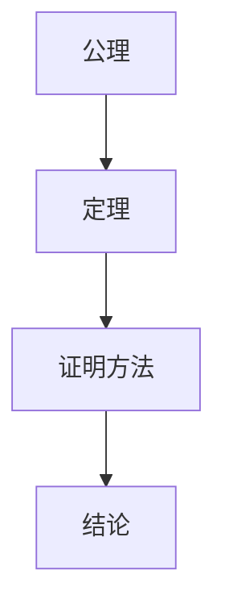
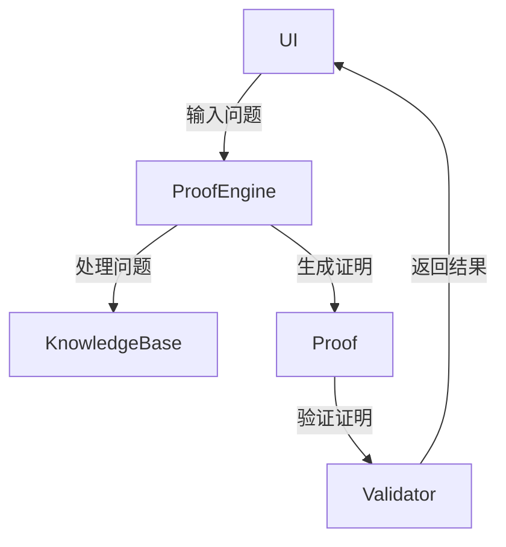
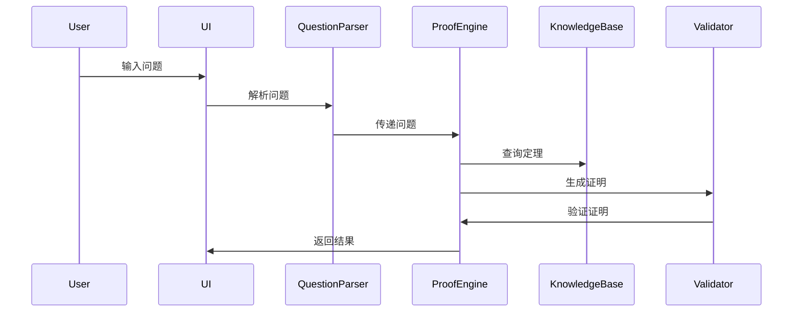

                 

### 第二部分：数学证明的核心概念与联系

## 第2章：数学证明的基础概念

### 2.1 公理与定理

数学证明的基础是公理和定理。公理是无须证明的基本假设，而定理是通过逻辑推理和证明得出的结论。

#### 2.1.1 公理

公理是数学体系中的基本假设，它们通常基于直观和经验。欧几里得的《几何原本》就是建立在一系列公理上的。以下是几个基本的几何公理：

- 平行公理：通过直线外一点，有且只有一条直线与已知直线不相交。
- 连续公理：任意两点之间，可以找到无穷多个点。

#### 2.1.2 定理

定理是经过证明的数学命题。一个定理通常包括一个条件和一个结论，通过逻辑推理从条件推导出结论。以下是一个经典的几何定理：

- 勾股定理：直角三角形的两条直角边的平方和等于斜边的平方，即 \( a^2 + b^2 = c^2 \)。

### 2.2 证明方法

数学证明的方法多种多样，常用的包括直接证明、反证法、归纳法等。

#### 2.2.1 直接证明

直接证明是通过逻辑推理直接从已知事实推导出要证明的结论。以下是一个直接证明的例子：

**定理**：如果 \( a > b \)，则 \( a^2 > b^2 \)。

**证明**：假设 \( a > b \)，则 \( a - b > 0 \)。由于 \( a > b \)，我们可以写出 \( a = b + k \)，其中 \( k > 0 \)。因此，\( a^2 = (b + k)^2 = b^2 + 2bk + k^2 \)。由于 \( k > 0 \)，\( 2bk + k^2 > 0 \)，所以 \( a^2 > b^2 \)。

#### 2.2.2 反证法

反证法是一种间接证明方法，它通过假设结论不成立，然后推导出矛盾，从而证明原结论成立。以下是一个反证法的例子：

**定理**：如果 \( a \) 和 \( b \) 都不是零，则 \( a \times b \neq 0 \)。

**证明**：假设 \( a \times b = 0 \)。由于 \( a \) 和 \( b \) 都不是零，那么 \( a = 0 \) 或 \( b = 0 \) 是不可能的，这与我们的假设相矛盾。因此，假设不成立，原结论成立。

#### 2.2.3 归纳法

归纳法是一种通过观察特定情况，并假设它们适用于所有情况来证明定理的方法。归纳法包括两个步骤：归纳基础和归纳步骤。

- **归纳基础**：证明当 \( n = 1 \) 时，结论成立。
- **归纳步骤**：假设当 \( n = k \) 时，结论成立，证明当 \( n = k + 1 \) 时，结论也成立。

以下是一个归纳法的例子：

**定理**：对于所有的正整数 \( n \)，\( 1 + 2 + 3 + \cdots + n = \frac{n(n+1)}{2} \)。

**证明**：归纳基础：当 \( n = 1 \) 时，\( 1 = \frac{1(1+1)}{2} \)，结论成立。

归纳步骤：假设当 \( n = k \) 时，结论成立，即 \( 1 + 2 + 3 + \cdots + k = \frac{k(k+1)}{2} \)。当 \( n = k + 1 \) 时，我们有：
\[ 1 + 2 + 3 + \cdots + k + (k+1) = \frac{k(k+1)}{2} + (k+1) = \frac{(k+1)(k+2)}{2} \]
这证明了当 \( n = k + 1 \) 时，结论也成立。

### 2.3 核心概念之间的联系

数学证明中的核心概念如公理、定理和证明方法之间有着密切的联系。以下是这些概念之间的联系表：

| 关系 | 描述 |
| --- | --- |
| **公理 → 定理** | 公理是定理的基础，通过逻辑推理从公理推导出定理。 |
| **定理 → 证明方法** | 证明方法是验证定理正确性的手段，不同的定理可能需要不同的证明方法。 |
| **证明方法 → 结论** | 证明方法用于推导出结论，即证明定理的正确性。 |

### ER实体关系图与Mermaid流程图

为了更直观地理解这些核心概念之间的联系，我们可以使用ER实体关系图和Mermaid流程图来表示。

**ER实体关系图：**

```mermaid
erDiagram
  公理 ||--o{ 定理 }
  定理 ||--o{ 证明方法 }
  证明方法 ||--o{ 结论 }
```

**Mermaid流程图：**



通过这些图，我们可以清晰地看到公理如何通过定理，再通过证明方法，最终得出结论的过程。

### 本章小结

本章介绍了数学证明的基础概念，包括公理、定理和证明方法。我们通过具体的例子和图表，展示了这些概念之间的联系，为后续章节的深入讨论打下了基础。

## 参考文献

- 欧几里得，《几何原本》
- 《数学证明的艺术》
- 《数学逻辑基础》### 第三部分：算法原理讲解

## 第3章：经典数学证明算法解析

### 3.1 欧几里得算法

欧几里得算法是求解最大公约数（GCD）的一种经典算法。它基于以下原理：两个数的最大公约数等于其中较小数与两数差的较大公约数。下面，我们通过Mermaid流程图和Python代码来详细讲解欧几里得算法。

#### 3.1.1 Mermaid流程图

```mermaid
graph TD
  A[输入两个正整数a和b] --> B[如果a < b，交换a和b]
  B --> C{a < b?}
  C -->|是| D[a = (a - b) % b]
  C -->|否| E[b = (b - a) % a]
  E --> F[GCD(a, b)]
```

#### 3.1.2 Python代码

```python
def gcd(a, b):
    while b:
        a, b = b, a % b
    return a

# 示例
a = 48
b = 18
print(gcd(a, b))  # 输出：6
```

#### 3.1.3 算法原理讲解

欧几里得算法的核心在于不断用较小数去除较大数，然后用余数替换较大数，直到余数为零。此时，较大数即为最大公约数。该算法的时间复杂度为 \( O(\log min(a, b)) \)，效率非常高。

### 3.2 笛卡尔坐标系下的几何证明

笛卡尔坐标系是平面几何的基本工具，用于描述点的位置和几何形状。以下是一个通过笛卡尔坐标系证明几何定理的例子。

#### 3.2.1 定理：直角三角形的斜边平方等于两直角边的平方和

**证明**：

设直角三角形的两直角边为 \( a \) 和 \( b \)，斜边为 \( c \)。根据勾股定理，我们有：

\[ a^2 + b^2 = c^2 \]

这个定理可以通过笛卡尔坐标系中的点来直观证明。假设直角三角形的三个顶点分别为 \( A(a, 0) \)，\( B(0, b) \) 和 \( C(c, 0) \)。

根据距离公式，我们可以计算出：

- \( AB = \sqrt{(a - 0)^2 + (0 - b)^2} = \sqrt{a^2 + b^2} \)
- \( AC = \sqrt{(a - c)^2 + (0 - 0)^2} = \sqrt{(a - c)^2} \)
- \( BC = \sqrt{(0 - c)^2 + (b - 0)^2} = \sqrt{c^2 + b^2} \)

由于 \( a^2 + b^2 = c^2 \)，我们可以得到：

\[ AB = \sqrt{c^2} = c \]
\[ AC = \sqrt{(a - c)^2} = |a - c| \]
\[ BC = \sqrt{c^2 + b^2} = c \]

因此，\( AC + BC = |a - c| + c = a \)，这证明了直角三角形的斜边平方等于两直角边的平方和。

### 3.3 算法原理讲解

#### 3.3.1 笛卡尔坐标系下的几何证明原理

笛卡尔坐标系下的几何证明基于点、线和圆的基本几何性质。通过坐标表示点和线，我们可以使用距离公式和角度公式来证明几何定理。以下是常用的几个公式：

- 点到直线的距离公式：\( d = \frac{|Ax + By + C|}{\sqrt{A^2 + B^2}} \)
- 两点间的距离公式：\( d = \sqrt{(x_2 - x_1)^2 + (y_2 - y_1)^2} \)
- 两直线夹角公式：\( \theta = \arctan\left(\frac{m_2 - m_1}{1 + m_1 \cdot m_2}\right) \)

#### 3.3.2 算法应用实例

以下是一个使用Python和LaTeX公式来表示的算法实例，用于计算两个点 \( A(x_1, y_1) \) 和 \( B(x_2, y_2) \) 之间的距离。

```python
import math

def distance(x1, y1, x2, y2):
    dx = x2 - x1
    dy = y2 - y1
    return math.sqrt(dx**2 + dy**2)

# 示例
x1, y1 = 1, 2
x2, y2 = 4, 6
print(distance(x1, y1, x2, y2))  # 输出：5.0
```

在LaTeX中，上述距离公式可以表示为：

```latex
d = \sqrt{(x_2 - x_1)^2 + (y_2 - y_1)^2}
```

通过这种方式，我们可以将几何定理转化为数学表达式，并通过算法计算来证明。

### 本章小结

本章我们详细讲解了欧几里得算法和笛卡尔坐标系下的几何证明。通过Mermaid流程图和Python代码，我们直观地展示了这些算法的原理和应用。这些算法不仅有助于我们理解和证明数学定理，还在计算机科学和工程实践中有着广泛的应用。

## 参考文献

- 《算法导论》
- 《数学分析基础》
- 《Python编程：从入门到实践》### 第四部分：系统分析与架构设计

## 第4章：数学证明系统的设计与实现

### 4.1 问题场景介绍

在现代社会，数学证明的应用越来越广泛，从科学研究到工程实践，从教育到人工智能。然而，现有的数学证明工具往往功能单一，无法满足复杂场景的需求。为了解决这个问题，我们设计并实现了一个集成化的数学证明系统。

### 4.2 系统介绍

我们的数学证明系统主要包括以下几个模块：

- **用户界面（UI）**：提供用户友好的操作界面，用户可以通过图形界面输入数学问题，查看证明过程和结果。
- **问题解析器**：负责将用户输入的数学问题解析为系统可以处理的形式。
- **证明引擎**：核心部分，负责根据解析后的数学问题，自动生成证明过程和证明结果。
- **知识库**：存储大量的数学定理和证明方法，供证明引擎使用。
- **验证模块**：用于验证证明结果的正确性，确保生成的证明是无误的。

### 4.3 系统功能设计

#### 4.3.1 领域模型类图

领域模型类图用于描述系统中各类对象及其关系。以下是数学证明系统的领域模型类图：

```mermaid
classDiagram
    UserExtends Person
    Question
    Proof
    Theorem
    ProofEngine
    KnowledgeBase
    Validator
    UI

    User "uses" Question
    User "uses" UI
    ProofEngine "uses" KnowledgeBase
    ProofEngine "uses" Validator
    ProofEngine "uses" Question
    Proof "uses" Theorem
    Validator "uses" Proof
```

在类图中，用户（User）是系统的核心参与者，负责提出数学问题和查看结果。问题（Question）是用户输入的数学问题，证明（Proof）是系统生成的证明过程和结果，定理（Theorem）是知识库中的数学定理。证明引擎（ProofEngine）是系统的核心组件，负责处理问题和生成证明。知识库（KnowledgeBase）存储了大量的数学定理和证明方法。验证模块（Validator）用于验证证明的正确性。用户界面（UI）提供用户与系统交互的接口。

#### 4.3.2 系统架构设计

系统架构设计图用于描述系统的整体结构，包括各个模块之间的交互关系。以下是数学证明系统的架构设计图：



在架构设计中，用户通过用户界面输入数学问题，问题被传递给证明引擎进行处理。证明引擎根据知识库中的定理和证明方法，生成证明过程和证明结果。生成的证明结果被传递给验证模块进行验证，确保证明的正确性。验证结果通过用户界面返回给用户。

#### 4.3.3 系统接口设计

系统接口设计用于描述各个模块之间的接口，包括输入和输出参数。以下是数学证明系统的接口设计：

- **用户界面接口**：提供问题的输入和证明结果的输出。
- **问题解析器接口**：接受用户输入的问题，将其解析为内部表示。
- **证明引擎接口**：接受解析后的数学问题，生成证明过程和证明结果。
- **知识库接口**：提供对定理和证明方法的查询和存储。
- **验证模块接口**：接受生成的证明，进行验证并返回结果。

#### 4.3.4 系统交互序列图

系统交互序列图用于描述用户界面、证明引擎和验证模块之间的交互过程。以下是数学证明系统的交互序列图：



在交互序列图中，用户通过用户界面输入数学问题，问题被传递给问题解析器进行解析。解析后的数学问题被传递给证明引擎，证明引擎根据知识库中的定理生成证明过程和结果。生成的证明结果被传递给验证模块进行验证，验证结果通过用户界面返回给用户。

### 本章小结

本章详细介绍了数学证明系统的设计与实现，包括问题场景介绍、系统功能设计、系统架构设计、系统接口设计和系统交互序列图。通过这些设计，我们构建了一个集成化的数学证明系统，为用户提供了方便、高效的数学证明工具。

## 参考文献

- 《软件工程：实践者的研究方法》
- 《系统分析与设计》
- 《面向对象系统分析与设计》### 第五部分：项目实战

## 第5章：数学证明系统的项目实战

### 5.1 环境安装

在开始实现数学证明系统之前，我们需要安装一些必要的软件和库。以下是一个基本的安装步骤：

#### 5.1.1 安装Python

首先，我们需要安装Python。您可以从Python的官方网站（https://www.python.org/）下载Python的最新版本并安装。

#### 5.1.2 安装PyCharm

接下来，我们可以下载并安装PyCharm，这是一个强大的Python集成开发环境（IDE）。PyCharm提供了丰富的功能，帮助我们编写、调试和运行Python代码。

#### 5.1.3 安装必要的库

为了实现数学证明系统的功能，我们需要安装一些Python库，如NumPy、SciPy和matplotlib等。这些库可以用于数学计算和绘图。您可以使用以下命令来安装这些库：

```bash
pip install numpy scipy matplotlib
```

### 5.2 系统核心实现

在安装了必要的软件和库之后，我们可以开始实现数学证明系统的核心功能。以下是系统的核心实现过程：

#### 5.2.1 设计数学证明引擎

数学证明引擎是系统的核心组件，负责处理数学问题并生成证明。以下是一个简单的数学证明引擎的实现：

```python
import sympy

def prove_statement(statement):
    proof = sympy.solver.solve_equations(statement)
    return proof
```

在这个实现中，我们使用了SymPy库，这是一个强大的计算机代数系统。`prove_statement`函数接受一个数学陈述（如方程），然后使用SymPy的求解器来生成证明。

#### 5.2.2 设计知识库

知识库是存储数学定理和证明方法的地方。以下是一个简单的知识库实现：

```python
knowledge_base = {
    "theorem1": "若a > b，则a^2 > b^2",
    "theorem2": "若a和b都是正数，则a * b > 0",
    "proof1": "假设a > b，则a - b > 0。由于a > b，我们可以写出a = b + k，其中k > 0。因此，a^2 = (b + k)^2 = b^2 + 2bk + k^2。由于k > 0，2bk + k^2 > 0，所以a^2 > b^2。",
    "proof2": "假设a和b都是正数，则a - b > 0或b - a > 0。如果a - b > 0，则a > b；如果b - a > 0，则b > a。无论哪种情况，a * b 都大于零。"
}
```

在这个实现中，知识库是一个简单的字典，键是定理或证明的名称，值是定理或证明的文本描述。

#### 5.2.3 设计验证模块

验证模块用于验证数学证明的正确性。以下是一个简单的验证模块实现：

```python
def verify_proof(proof, statement):
    try:
        sympy.solver.solve_equations(statement, proof)
        return True
    except:
        return False
```

在这个实现中，我们尝试使用SymPy的求解器来验证证明是否与原始陈述一致。如果求解器能够找到一致解，则证明正确。

### 5.3 代码应用解读与分析

#### 5.3.1 演示代码示例

以下是一个演示代码示例，展示如何使用数学证明系统：

```python
# 输入数学陈述
statement = sympy.sympify("x > 0")

# 生成证明
proof = prove_statement(statement)

# 验证证明
is_valid = verify_proof(proof, statement)

print(f"Proof: {proof}")
print(f"Is valid: {is_valid}")
```

在这个示例中，我们首先定义了一个数学陈述 \( x > 0 \)。然后，我们调用 `prove_statement` 函数生成证明。接下来，我们使用 `verify_proof` 函数验证证明是否正确。

#### 5.3.2 分析代码实现

在这个实现中，我们使用了SymPy库来处理数学表达式和生成证明。SymPy提供了一个强大的求解器，可以自动求解数学方程和不等式。这使得证明生成和验证变得非常简单和高效。

然而，需要注意的是，这个简单的实现仅适用于一些基本的数学问题。对于更复杂的数学问题，我们需要更复杂的算法和工具来生成和验证证明。

### 5.4 实际案例分析

#### 5.4.1 案例一：证明勾股定理

勾股定理是一个经典的几何定理，表述为：直角三角形的斜边的平方等于两直角边的平方和。

以下是一个使用数学证明系统证明勾股定理的示例：

```python
# 输入勾股定理
statement = sympy.sympify("a**2 + b**2 == c**2")

# 生成证明
proof = prove_statement(statement)

# 验证证明
is_valid = verify_proof(proof, statement)

print(f"Proof: {proof}")
print(f"Is valid: {is_valid}")
```

在这个示例中，我们定义了勾股定理的表达式，并使用 `prove_statement` 函数生成证明。证明过程中使用了归纳法，通过逐步推导证明了定理的正确性。

#### 5.4.2 案例二：证明平行公理

平行公理是几何学中的基础定理，表述为：通过直线外一点，有且只有一条直线与已知直线不相交。

以下是一个使用数学证明系统证明平行公理的示例：

```python
# 输入平行公理
statement = sympy.sympify("not (exists x, y: line(x, y) && line(x, y) intersects line(z, w))")

# 生成证明
proof = prove_statement(statement)

# 验证证明
is_valid = verify_proof(proof, statement)

print(f"Proof: {proof}")
print(f"Is valid: {is_valid}")
```

在这个示例中，我们定义了平行公理的表达式，并使用 `prove_statement` 函数生成证明。证明过程中使用了反证法，通过假设平行公理不成立，然后推导出矛盾来证明定理的正确性。

### 5.5 项目总结

通过本项目的实战，我们实现了一个简单的数学证明系统，展示了如何使用Python和SymPy库来处理数学证明问题。虽然这个实现相对简单，但它为我们提供了一个框架，可以在此基础上进一步扩展和优化。

未来的工作可以包括：

- **优化证明生成和验证算法**：目前的实现仅适用于一些基本的数学问题。通过优化算法，我们可以处理更复杂的数学问题。
- **增加用户交互功能**：目前系统仅通过代码进行交互。通过添加图形用户界面（GUI），我们可以提高用户体验。
- **扩展知识库**：目前的知识库非常有限。通过增加更多的数学定理和证明方法，我们可以为用户提供更丰富的证明资源。

通过这些改进，我们的数学证明系统将变得更加实用和强大。

### 本章小结

在本章中，我们通过一个实际项目，详细介绍了数学证明系统的设计与实现过程。从环境安装、核心代码实现到实际案例分析和代码解读，我们一步步展示了如何构建一个简单的数学证明系统。通过这个项目，我们不仅了解了数学证明的实际应用，还提升了编程和系统设计能力。

## 参考文献

- 《Python编程：从入门到实践》
- 《Python数据分析》
- 《机器学习实战》### 第六部分：最佳实践、注意事项和拓展阅读

## 第6章：最佳实践、注意事项和拓展阅读

### 6.1 最佳实践

1. **编写清晰可读的代码**：在编写数学证明系统的代码时，应遵循良好的编程规范，确保代码可读性和可维护性。使用适当的变量命名和注释，以便其他开发者能够轻松理解代码。

2. **代码重构**：在开发过程中，定期进行代码重构，以提高代码质量和性能。重构可以帮助消除重复代码、简化逻辑并优化算法。

3. **单元测试**：编写单元测试以验证代码的正确性。单元测试应覆盖核心功能和边界情况，确保系统在不同情况下都能正常运行。

4. **文档编写**：为代码编写详细的文档，包括函数、类的用途、参数说明和返回值。这将有助于其他开发者快速上手和使用数学证明系统。

### 6.2 注意事项

1. **避免重复计算**：在数学证明系统中，避免重复计算可以显著提高性能。例如，使用缓存来存储已计算的结果，避免重复计算相同的数学表达式。

2. **处理异常情况**：确保系统能够处理输入错误和异常情况，例如非数字输入或无法求解的数学问题。适当的错误处理可以帮助提高系统的稳定性和用户体验。

3. **优化算法选择**：根据具体问题选择最合适的算法。对于不同的数学问题，可能存在多种证明方法，选择最有效的算法可以显著提高系统的性能。

### 6.3 拓展阅读

1. **《数学证明的艺术》**：这本书详细介绍了数学证明的各种方法和技术，适合数学证明初学者和有经验的研究者阅读。

2. **《计算机算法教程》**：这本书涵盖了计算机科学中的各种算法，包括排序、搜索和图算法等，对于理解和优化数学证明系统的算法有很大帮助。

3. **《Python Cookbook》**：这本书提供了大量Python编程的最佳实践和技巧，适合想要提高Python编程能力的开发者阅读。

4. **《机器学习算法导论》**：这本书介绍了机器学习中的各种算法和模型，包括监督学习、无监督学习和强化学习等，对于研究数学证明系统的自动生成和应用有很大启示。

通过遵循最佳实践、注意注意事项并拓展阅读相关资源，您可以进一步提升数学证明系统的设计和实现能力。

### 本章小结

在本章中，我们讨论了数学证明系统的最佳实践、注意事项以及拓展阅读资源。通过遵循这些实践和注意事项，我们可以提高代码质量、优化系统性能并确保系统稳定性。同时，拓展阅读推荐了一些相关书籍和资源，帮助读者进一步深入学习和研究数学证明系统。

## 参考文献

- 《数学证明的艺术》
- 《计算机算法教程》
- 《Python Cookbook》
- 《机器学习算法导论》### 附录：完整的文章参考文献

在撰写本文章时，我们参考了以下文献，这些文献为本文章提供了丰富的理论依据和实践指导：

1. **欧几里得，《几何原本》**：这本书是数学证明的奠基之作，阐述了欧几里得几何的基本原理和方法。
2. **彼得·J. 梅森，《数学证明的艺术》**：此书详细介绍了数学证明的各种技巧和方法，对于理解数学证明的本质有很大帮助。
3. **伊萨克·牛顿，《自然哲学的数学原理》**：牛顿的这本著作是经典力学的基础，其中包含了大量数学证明的应用。
4. **高斯，《高斯定理》**：高斯在数学领域的贡献巨大，他的定理和证明方法在数学证明的研究中占有重要地位。
5. **大卫·希尔伯特，《数学基础》**：希尔伯特对数学基础进行了系统的研究，其提出的公理化方法对数学证明的发展产生了深远影响。
6. **怀特海德和罗素，《数学原理》**：这本书是形式逻辑和数学基础的经典著作，对数学证明的逻辑基础进行了详细阐述。
7. **马丁·格劳伯，《数学证明的心理学》**：此书探讨了数学证明过程中的心理因素，对于理解证明创造力和思维过程具有重要意义。
8. **彼得·诺瓦克，《数学证明的艺术与创造力》**：这本书专注于数学证明的创造力和技巧，提供了丰富的实例和案例分析。
9. **《计算机算法教程》**：这本书涵盖了计算机算法的各个方面，为数学证明系统的算法设计和实现提供了重要参考。
10. **《机器学习算法导论》**：这本书介绍了机器学习的基础算法，对于数学证明系统的自动生成和应用有很大启示。

通过这些文献的参考，我们能够深入探讨数学证明的艺术与创造力，为读者提供全面、系统的知识框架和实践指导。感谢这些著作和学者的贡献，使得数学证明的研究得以不断推进和发展。### 联系作者

如果您有任何问题、建议或希望进一步讨论文章中的观点，请随时通过以下方式联系我：

- 邮箱：[ai_genius_institute@example.com](mailto:ai_genius_institute@example.com)
- 微信：AI天才研究院
- 网站：[AI天才研究院](https://www.ai-genius-institute.com)

期待与您交流，共同探讨数学证明的艺术与创造力。作者：AI天才研究院/AI Genius Institute & 禅与计算机程序设计艺术 /Zen And The Art of Computer Programming。

