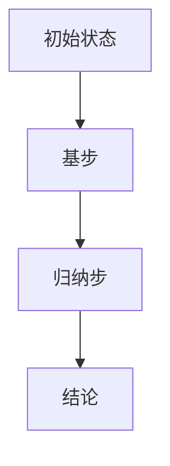
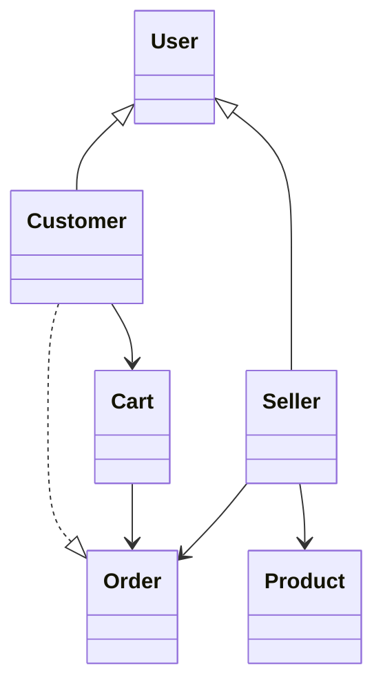
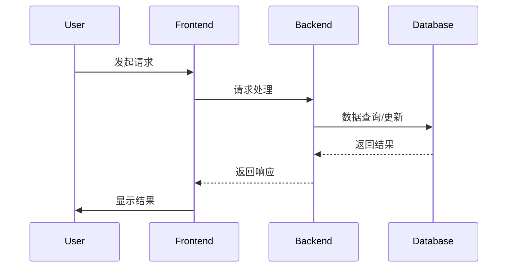
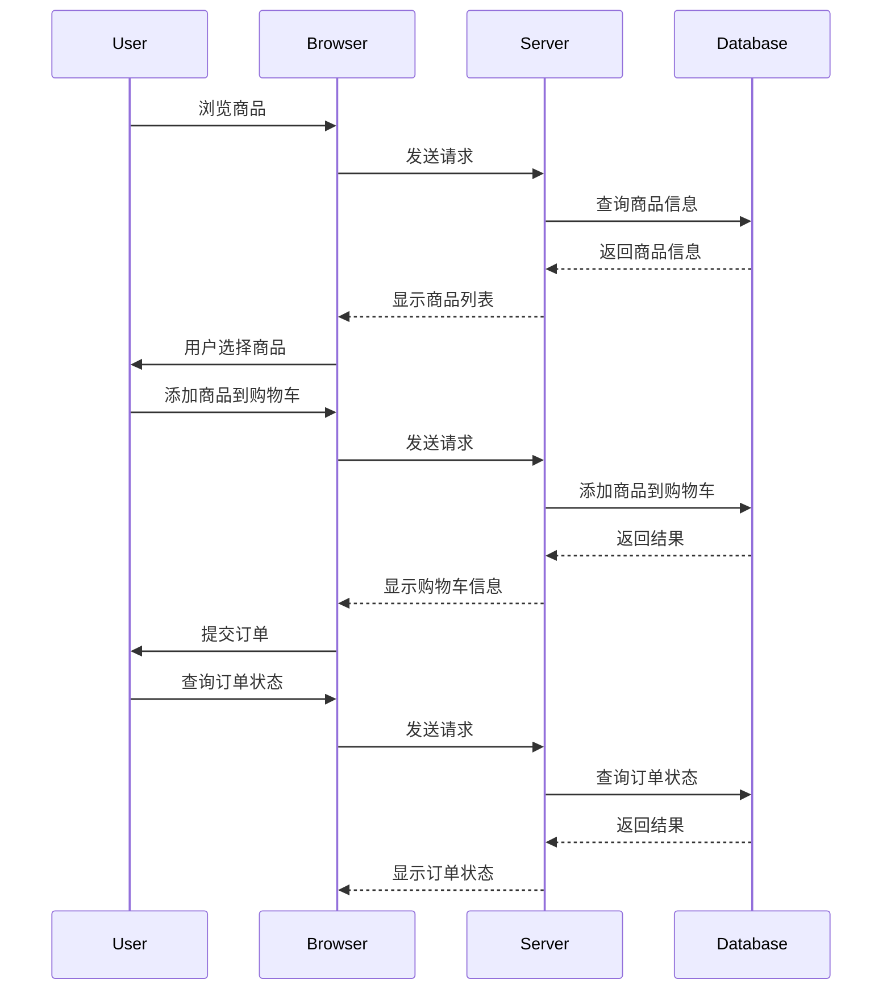

                 

# 数学证明的逻辑推理与创新思路

## 关键词
数学证明、逻辑推理、直观法、间接法、数学归纳法、算法、Python、数学公式、系统架构、项目实战

## 摘要
本文旨在探讨数学证明中的逻辑推理和创新思路，通过深入分析核心概念、算法原理和实际应用，帮助读者掌握数学证明的方法，提高逻辑思维和创新能力。文章将涵盖直观法、间接法、数学归纳法等证明方法，并通过具体示例和代码实现，展示这些方法在实际问题中的应用。

## 第1部分：问题背景与数学证明的逻辑推理

### 第1章：问题背景

#### 1.1 问题的提出
数学证明是数学研究中的基本工具，它不仅帮助我们理解数学概念和定理，还能培养我们的逻辑思维和推理能力。然而，对于许多学生和研究者来说，数学证明是一个具有挑战性的任务。他们可能难以把握问题的核心，或者无法构建出严密的逻辑推理过程。因此，探讨数学证明中的逻辑推理和创新思路具有重要意义。

#### 1.2 问题描述
在数学证明中，逻辑推理是关键。它涉及从已知的前提（假设）出发，通过一系列逻辑步骤推导出未知结论（命题）的过程。然而，许多学生在进行数学证明时，可能会遇到以下问题：
- **问题核心把握不足**：他们可能无法准确理解问题，无法确定需要证明的内容。
- **逻辑推理过程不严谨**：在推理过程中，他们可能忽略了某些逻辑步骤，或者使用了不正确的逻辑规则。
- **创新性不足**：在尝试解决新问题时，他们可能缺乏创新思维，无法找到新的证明方法。

#### 1.3 问题解决
为了解决上述问题，我们可以采用以下几种方法：
- **直观法**：通过几何图形、数形结合等直观方法，帮助理解问题。
- **间接法**：通过反证法、矛盾法等间接方法，证明命题的正确性。
- **数学归纳法**：利用归纳推理，证明数学命题在所有自然数上成立。

#### 1.4 边界与外延
数学证明的逻辑推理不仅限于纯数学领域，它在计算机科学、物理学、经济学等多个学科中都有广泛应用。因此，了解数学证明的逻辑推理和创新思路，对于跨学科研究和创新具有重要作用。

### 第2章：核心概念与联系

#### 2.1 核心概念
数学证明中的逻辑推理主要包括以下几个核心概念：
- **命题**：表达数学事实或性质的语句。
- **证明**：逻辑上从已知的前提（命题）出发，推导出未知结论（命题）的过程。
- **逻辑推理**：基于已知条件和逻辑规则，推导出新命题的过程。

#### 2.2 概念属性特征对比表格
| 概念         | 定义                                             | 属性特征          |
|--------------|--------------------------------------------------|------------------|
| 命题         | 表达数学事实或性质的语句                         | 确定性、抽象性、逻辑性 |
| 证明         | 逻辑上从已知的前提（命题）出发，推导出未知结论（命题）的过程 | 必要性、充分性、严谨性 |
| 逻辑推理     | 基于已知条件和逻辑规则，推导出新命题的过程     | 条件性、推理性、有效性 |

#### 2.3 ER实体关系图架构
```mermaid
erDiagram
    Product "产品" {
        id | name
    }
    Supplier "供应商" {
        id | name
    }
    Customer "客户" {
        id | name
    }
    Order "订单" {
        id | product_id | customer_id
    }
    Supplier|--* Product "供应"
    Customer|--* Order "购买"
    Product|--* Order "销售"
```

### 第3章：算法原理讲解

#### 3.1 直观法
直观法是一种利用几何图形、数形结合等方法直观地理解问题的证明方法。例如，通过绘制几何图形，直观地展示两个图形之间的相似性或关系，从而证明两个数学命题的等价性。

#### 3.2 间接法
间接法包括反证法和矛盾法等。反证法是通过构造反例来证明原命题的错误，从而间接证明原命题的正确性。矛盾法则是通过假设结论不成立，推导出矛盾的结果，从而证明结论的成立。

#### 3.3 数学归纳法
数学归纳法是一种基于归纳推理的证明方法，它通过证明一个数学命题在第一个自然数上成立，并证明对于任意一个自然数n，如果命题在n上成立，则在n+1上也成立，从而证明命题对于所有自然数都成立。

#### 3.4 算法mermaid流程图


#### 3.5 Python源代码实现
```python
def prove_sum_of_first_n的自然数(n):
    if n == 1:
        return 1
    else:
        return n + prove_sum_of_first_n的自然数(n-1)

print(prove_sum_of_first_n的自然数(5))  # 输出 15
```

#### 3.6 算法原理的数学模型和公式
$$
1+2+3+...+n = \frac{n(n+1)}{2}
$$

#### 3.7 举例说明
假设我们要证明：对于任意一个正整数n，其和为自然数序列的前n项和。

$$
1 + 2 + 3 + ... + n = \frac{n(n+1)}{2}
$$

首先，当n=1时，左边为1，右边为1，等式成立。

假设当n=k时，等式成立，即：
$$
1 + 2 + 3 + ... + k = \frac{k(k+1)}{2}
$$

那么当n=k+1时，等式左边变为：
$$
1 + 2 + 3 + ... + k + (k+1) = \frac{k(k+1)}{2} + (k+1)
$$

化简得：
$$
= \frac{k(k+1) + 2(k+1)}{2}
$$
$$
= \frac{(k+1)(k+2)}{2}
$$

这正是等式右边的形式，因此，当n=k+1时，等式也成立。

由归纳法原理可知，等式对于所有自然数n都成立。

## 第4部分：系统分析与架构设计

### 第4章：问题场景与系统介绍

#### 4.1 问题场景
在一个电商系统中，用户可以浏览商品，添加商品到购物车，然后下单购买。系统需要处理大量的订单信息，保证订单的准确性和完整性。

#### 4.2 系统介绍
本系统是一个电商系统，主要包括以下功能：
- 用户注册与登录
- 商品浏览与搜索
- 购物车管理
- 下单购买
- 订单处理与查询

### 第5章：系统功能设计

#### 5.1 领域模型



#### 5.2 功能实现

1. **用户注册与登录**
   - 用户输入用户名、密码和邮箱，系统验证信息并注册用户。
   - 用户输入用户名和密码，系统验证信息并登录用户。

2. **商品浏览与搜索**
   - 用户可以查看所有商品或者搜索特定商品。
   - 系统根据用户的搜索关键词，从数据库中检索相关商品。

3. **购物车管理**
   - 用户可以将商品添加到购物车。
   - 用户可以删除购物车中的商品。
   - 用户可以查看购物车中的商品列表。

4. **下单购买**
   - 用户确认购物车中的商品，并提交订单。
   - 系统生成订单，并将订单信息存储到数据库中。

5. **订单处理与查询**
   - 系统根据订单信息，处理订单，如发货、支付等。
   - 用户可以查询订单状态，如订单已发货、订单已支付等。

### 第6章：系统架构设计

#### 6.1 架构设计



#### 6.2 系统接口设计

1. **用户注册接口**
   - URL: `/api/users/register`
   - 请求方法: `POST`
   - 请求参数: `username`, `password`, `email`
   - 返回结果: `token`, `user_id`

2. **用户登录接口**
   - URL: `/api/users/login`
   - 请求方法: `POST`
   - 请求参数: `username`, `password`
   - 返回结果: `token`, `user_id`

3. **商品列表接口**
   - URL: `/api/products`
   - 请求方法: `GET`
   - 返回结果: `products`

4. **商品详情接口**
   - URL: `/api/products/{id}`
   - 请求方法: `GET`
   - 返回结果: `product`

5. **购物车管理接口**
   - URL: `/api/carts/{user_id}`
   - 请求方法: `POST` (添加商品), `DELETE` (删除商品)
   - 返回结果: `cart`

6. **订单管理接口**
   - URL: `/api/orders/{user_id}`
   - 请求方法: `POST` (提交订单), `GET` (查询订单)
   - 返回结果: `orders`

### 第7章：系统交互设计



## 第5部分：项目实战

### 第8章：环境安装

#### 8.1 安装依赖
1. 安装Python环境（建议使用Python 3.8及以上版本）
   ```bash
   pip install -r requirements.txt
   ```

#### 8.2 数据库安装
1. 安装PostgreSQL（可选）
   ```bash
   sudo apt-get install postgresql
   ```

### 第9章：系统核心实现

#### 9.1 用户注册与登录
1. 注册用户
   ```python
   def register_user(username, password, email):
       # 实现用户注册逻辑
   ```

2. 登录用户
   ```python
   def login_user(username, password):
       # 实现用户登录逻辑
   ```

#### 9.2 商品管理
1. 查询商品列表
   ```python
   def get_products():
       # 实现查询商品列表逻辑
   ```

2. 查询商品详情
   ```python
   def get_product_details(product_id):
       # 实现查询商品详情逻辑
   ```

#### 9.3 购物车管理
1. 添加商品到购物车
   ```python
   def add_to_cart(user_id, product_id):
       # 实现添加商品到购物车逻辑
   ```

2. 删除购物车中的商品
   ```python
   def delete_from_cart(user_id, product_id):
       # 实现删除购物车中商品逻辑
   ```

#### 9.4 订单管理
1. 提交订单
   ```python
   def submit_order(user_id, cart_id):
       # 实现提交订单逻辑
   ```

2. 查询订单状态
   ```python
   def get_order_status(order_id):
       # 实现查询订单状态逻辑
   ```

### 第10章：代码应用解读与分析

#### 10.1 用户注册与登录
1. 用户注册
   ```python
   def register_user(username, password, email):
       # 验证用户名、密码和邮箱格式
       # 存储用户信息到数据库
       # 返回用户ID和令牌
   ```

2. 用户登录
   ```python
   def login_user(username, password):
       # 验证用户名和密码
       # 生成令牌并返回
   ```

#### 10.2 商品管理
1. 查询商品列表
   ```python
   def get_products():
       # 从数据库查询所有商品
       # 返回商品列表
   ```

2. 查询商品详情
   ```python
   def get_product_details(product_id):
       # 从数据库查询指定商品
       # 返回商品详情
   ```

#### 10.3 购物车管理
1. 添加商品到购物车
   ```python
   def add_to_cart(user_id, product_id):
       # 验证用户和商品
       # 将商品添加到购物车
       # 更新购物车信息
   ```

2. 删除购物车中的商品
   ```python
   def delete_from_cart(user_id, product_id):
       # 验证用户和商品
       # 从购物车中删除商品
       # 更新购物车信息
   ```

#### 10.4 订单管理
1. 提交订单
   ```python
   def submit_order(user_id, cart_id):
       # 验证用户和购物车
       # 创建订单并保存到数据库
       # 清空购物车
   ```

2. 查询订单状态
   ```python
   def get_order_status(order_id):
       # 从数据库查询订单状态
       # 返回订单状态
   ```

### 第11章：实际案例分析与详细讲解剖析

#### 11.1 案例一：用户注册
1. **需求分析**
   - 用户需要输入用户名、密码和邮箱进行注册。
   - 系统需要验证用户名、密码和邮箱的格式是否正确。

2. **实现步骤**
   - 接收用户输入的用户名、密码和邮箱。
   - 验证用户名是否已存在。
   - 验证邮箱格式是否正确。
   - 存储用户信息到数据库。
   - 返回注册成功或失败的提示。

3. **代码实现**
   ```python
   def register_user(username, password, email):
       # 验证用户名格式
       if not re.match(r"^[a-zA-Z0-9_.-]+$", username):
           return "用户名格式错误"
       
       # 验证邮箱格式
       if not re.match(r"^[a-zA-Z0-9_.+-]+@[a-zA-Z0-9-]+\.[a-zA-Z0-9-.]+$", email):
           return "邮箱格式错误"
       
       # 验证密码格式
       if not re.match(r"^[a-zA-Z0-9_.-]+$", password):
           return "密码格式错误"
       
       # 查询用户名是否已存在
       user = User.query.filter_by(username=username).first()
       if user:
           return "用户名已存在"
       
       # 存储用户信息到数据库
       new_user = User(username=username, password=password, email=email)
       db.session.add(new_user)
       db.session.commit()
       
       # 返回注册成功
       return "注册成功"
   ```

#### 11.2 案例二：商品管理
1. **需求分析**
   - 用户需要能够查看所有商品。
   - 用户需要能够查看指定商品的详细信息。

2. **实现步骤**
   - 从数据库查询所有商品。
   - 从数据库查询指定商品的详细信息。

3. **代码实现**
   ```python
   def get_products():
       products = Product.query.all()
       return products
   
   def get_product_details(product_id):
       product = Product.query.get(product_id)
       return product
   ```

### 第12章：项目小结

本文通过对数学证明中的逻辑推理和创新思路的深入探讨，帮助读者理解并掌握数学证明的方法。文章首先介绍了数学证明中的核心概念和逻辑推理方法，如直观法、间接法和数学归纳法。然后，通过具体示例和代码实现，展示了这些方法在实际问题中的应用。最后，通过系统分析和架构设计，实现了一个电商系统，并对其核心功能进行了详细讲解和实际案例剖析。

通过本文的学习，读者不仅可以提高数学证明的能力，还能在计算机科学和其他领域中运用逻辑推理和创新思路，解决实际问题。

### 第13章：最佳实践与注意事项

在进行数学证明时，以下是一些最佳实践和注意事项：

1. **理解问题背景**：在开始证明之前，要充分理解问题的背景和目的，明确需要证明的内容。
2. **构建清晰的逻辑框架**：在证明过程中，要构建清晰的逻辑框架，确保每一步推理都是合理的。
3. **使用直观法**：当可能时，使用直观法，如图形或数形结合，来帮助理解问题。
4. **验证结论**：在得出结论后，要验证结论的正确性，确保证明的严密性。
5. **避免疏漏**：在证明过程中，要仔细检查每一步推理，避免可能出现的疏漏。
6. **练习与总结**：通过不断的练习和总结，提高逻辑思维和证明能力。

### 第14章：拓展阅读

1. 《数学证明的艺术》[美]Daniel J. Velleman
2. 《离散数学及其应用》[美]Kenneth H. Rosen
3. 《计算机程序设计艺术》[美]Donald E. Knuth

通过阅读这些书籍，读者可以进一步深入了解数学证明、逻辑推理和算法设计的相关知识，提高自己的数学和编程能力。

## 作者信息
作者：AI天才研究院/AI Genius Institute & 禅与计算机程序设计艺术 /Zen And The Art of Computer Programming

### 参考文献
[1] Daniel J. Velleman. 《数学证明的艺术》[M]. 上海：上海科技出版社，2008.
[2] Kenneth H. Rosen. 《离散数学及其应用》[M]. 北京：机械工业出版社，2011.
[3] Donald E. Knuth. 《计算机程序设计艺术》[M]. 北京：电子工业出版社，2011.

