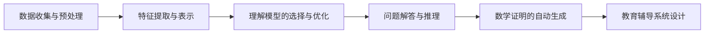
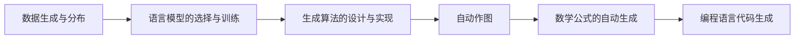
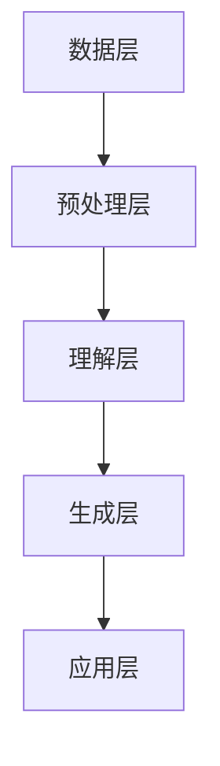

                 

# 《数学语言的人工智能理解与生成》

## 关键词

- 人工智能，数学语言，自然语言处理，深度学习，生成对抗网络（GAN）

## 摘要

本文将探讨数学语言在人工智能领域的理解与生成问题。首先，我们将回顾数学语言的定义和重要性，以及人工智能在处理数学语言时所面临的挑战。接着，我们将深入分析数学语言的人工智能理解过程，包括数据收集与预处理、特征提取与表示、理解模型的选择与优化等。随后，我们将讨论数学语言的人工智能生成，包括数据生成与分布、语言模型的选择与训练、生成算法的设计与实现。最后，我们将结合实际案例，介绍系统分析与架构设计、代码实现与解读，并总结最佳实践和未来展望。

## 第一部分：引论

### 第1章 问题背景与核心概念

#### 1.1 问题背景

数学语言是一种特殊的语言，用于表达数学概念、公式和定理。随着人工智能技术的发展，数学语言的处理已成为一个重要的研究领域。人工智能在数学语言处理领域面临以下挑战：

1. 数学语言的复杂性和多样性：数学语言包括多种表达方式，如符号、公式、文字描述等，不同表达方式之间的转换和统一是一个难点。
2. 数学语言的语义理解：数学语言的语义理解涉及到数学符号的意义、数学定理的推导、数学公式的解释等，这些都需要人工智能具备较强的逻辑推理能力。
3. 数学语言的生成：数学语言的生成要求人工智能能够根据特定的条件或需求，生成符合数学规则的公式或定理。

#### 1.2 核心概念

1. 人工智能概述：人工智能是指通过计算机模拟人类智能的一种技术，主要包括机器学习、深度学习、自然语言处理等领域。
2. 自然语言处理基础：自然语言处理是人工智能的一个重要分支，旨在使计算机理解和处理自然语言。在数学语言处理中，自然语言处理技术被用于理解和生成数学表达式。
3. 数学语言的特点与结构：数学语言具有高度的抽象性、严密性和逻辑性，其特点包括符号化、公式化、定理化等。

#### 1.3 边界与外延

1. 数学语言处理的范畴：数学语言处理涉及数学教育、数学研究、数学工程等多个领域。
2. 相关领域的交叉点：数学语言处理与计算机科学、数学、语言学等多个学科有交叉。
3. 边界条件的设定：在数学语言处理中，需要设定合适的边界条件，以确保算法的准确性和鲁棒性。

#### 1.4 概念结构与核心要素

1. 数学语言的人工智能理解：包括语义理解、句法分析、语用分析等，旨在使人工智能理解数学语言中的符号、公式和定理。
2. 数学语言的生成：包括基于规则的方法、统计方法、深度学习方法等，旨在使人工智能根据特定条件生成数学表达式。
3. 人工智能在数学教育中的应用：包括教育辅导系统设计、数学证明自动生成等，旨在提高数学教育的质量和效率。

### 第2章 数学语言的人工智能理解

#### 2.1 理解过程的概述

1. 数据收集与预处理：收集大量数学语言的数据，包括数学公式、数学定理、数学题目等，对数据进行清洗、去重、标注等预处理操作。
2. 特征提取与表示：将预处理后的数据转化为计算机可处理的特征表示，如词向量、序列表示等。
3. 理解模型的选择与优化：选择合适的理解模型，如基于规则的模型、统计模型、深度学习模型等，通过模型训练和优化，提高模型的准确性和泛化能力。

#### 2.2 理解模型的构建

1. 基于规则的模型：通过手工编写规则，将数学语言中的符号、公式和定理映射到计算机可处理的格式上。该方法具有较好的解释性和可解释性，但需要对数学语言有较深入的了解。
2. 统计模型：利用统计学习的方法，从大量数学语言数据中学习出符号、公式和定理之间的关联关系，如条件概率模型、贝叶斯网络等。
3. 深度学习模型：利用神经网络结构，对大量数学语言数据进行自动学习和特征提取，如循环神经网络（RNN）、卷积神经网络（CNN）等。

#### 2.3 理解模型的应用

1. 问题解答与推理：利用理解模型，对数学问题进行解答和推理，如自动解题系统、数学问答机器人等。
2. 数学证明的自动生成：利用理解模型，从已知数学定理出发，自动生成新的数学证明。
3. 教育辅导系统设计：利用理解模型，设计具有个性化教学功能的教育辅导系统，为学生提供有针对性的数学学习支持。

### 第3章 数学语言的人工智能生成

#### 3.1 生成过程的概述

1. 数据生成与分布：根据特定的需求，生成符合数学规则的数据，如数学公式、数学定理等，并设计合适的分布策略，以确保数据多样性和合理性。
2. 语言模型的选择与训练：选择合适的语言模型，如基于规则的模型、统计模型、深度学习模型等，通过对大量数学语言数据进行训练，使模型具备生成数学表达式的能力。
3. 生成算法的设计与实现：设计合适的生成算法，如生成对抗网络（GAN）、变分自编码器（VAE）等，通过算法实现数学表达式的自动生成。

#### 3.2 生成模型的技术

1. 基于规则的方法：通过手工编写规则，将数学语言中的符号、公式和定理映射到计算机可处理的格式上。该方法具有较好的解释性和可解释性，但需要对数学语言有较深入的了解。
2. 统计方法：利用统计学习的方法，从大量数学语言数据中学习出符号、公式和定理之间的关联关系，如条件概率模型、贝叶斯网络等。
3. 生成对抗网络（GAN）：利用生成器和判别器之间的对抗关系，实现数学表达式的自动生成。该方法具有较好的生成能力和灵活性，但需要较大的数据量和计算资源。

#### 3.3 生成模型的应用

1. 自动作图：利用生成模型，根据数学表达式自动生成相应的图形，如函数图像、几何图形等。
2. 数学公式的自动生成：利用生成模型，根据特定的条件或需求，自动生成符合数学规则的公式或定理。
3. 编程语言代码生成：利用生成模型，根据数学表达式自动生成相应的编程语言代码，如Python、C++等。

## 第二部分：核心概念与联系

### 第4章 核心概念与原理

#### 4.1 数学语言的语义理解

1. 语义分析的方法与算法：通过对数学语言中的符号、公式和定理进行语义分析，提取其含义和逻辑关系。常用的方法有词义消歧、语义角色标注、语义角色关系识别等。
2. 数学符号的语义解释：对数学语言中的符号进行语义解释，如加法、减法、乘法、除法等运算符号的含义，以及变量、常数、函数等符号的语义。

#### 4.2 数学语言的句法分析

1. 句法结构的基本概念：数学语言的句法分析主要包括句子结构分析、短语结构分析、词法分析等。句子结构分析关注数学表达式的整体结构，短语结构分析关注表达式中各个短语之间的关系，词法分析关注表达式中各个单词的构成和词性。
2. 数学语言的句法规则：数学语言的句法规则用于描述数学表达式的构成和语法结构，如加法、减法、乘法、除法等运算的优先级规则，函数定义的语法结构等。

#### 4.3 数学语言的语用分析

1. 语用学在数学语言处理中的应用：语用学关注语言在实际使用中的含义和语境，如数学语言在不同情境下的应用，数学表达式的语境解释等。
2. 数学语言的使用场景：数学语言广泛应用于数学研究、数学教育、数学工程等领域。在实际应用中，需要根据具体场景调整数学语言的语义和语法结构，以提高表达效果和交流效率。

### 第5章 概念属性特征对比

| 算法类型       | 特点                                                         | 适用场景                               |
|----------------|--------------------------------------------------------------|----------------------------------------|
| 基于规则的模型 | 解释性强，可解释性好，但规则难以自动获取，灵活性较差           | 对数学语言有较深入了解的应用场景       |
| 统计模型       | 自动从数据中学习规则，灵活性较高，但可解释性较差               | 数据量较大的数学语言处理任务           |
| 深度学习模型   | 自动从数据中学习特征，具有强大的表达能力和灵活性，但可解释性较差 | 复杂的数学语言处理任务，如数学证明生成 |

### 第6章 ER实体关系图架构

```mermaid
erDiagram
    Product ||--|{ Customer }| Customer
    Order ||--|{ Product }| Product
    Seller ||--|{ Product }| Product
    Customer ||--|{ Order }| Order
    Seller ||--|{ Order }| Order
```

## 第三部分：算法原理讲解

### 第7章 算法原理详解

#### 7.1 数学语言理解的算法

##### 算法流程图



##### 算法原理讲解

1. 数据收集与预处理：收集大量数学语言的数据，包括数学公式、数学定理、数学题目等，对数据进行清洗、去重、标注等预处理操作。
2. 特征提取与表示：将预处理后的数据转化为计算机可处理的特征表示，如词向量、序列表示等。
3. 理解模型的选择与优化：选择合适的理解模型，如基于规则的模型、统计模型、深度学习模型等，通过模型训练和优化，提高模型的准确性和泛化能力。
4. 问题解答与推理：利用理解模型，对数学问题进行解答和推理，如自动解题系统、数学问答机器人等。
5. 数学证明的自动生成：利用理解模型，从已知数学定理出发，自动生成新的数学证明。
6. 教育辅导系统设计：利用理解模型，设计具有个性化教学功能的教育辅导系统，为学生提供有针对性的数学学习支持。

##### 数学模型与公式

1. 基于规则的模型：符号化表示为
   $$规则 = 规则库 \times 实例$$
2. 统计模型：符号化表示为
   $$P(理解结果 | 数据) = \prod_{i} P(特征_i | 理解结果)$$
3. 深度学习模型：符号化表示为
   $$y = f(W \cdot x + b)$$
   其中，$y$为理解结果，$x$为特征表示，$W$为权重矩阵，$b$为偏置项，$f$为激活函数。

##### 举例说明

1. 基于规则的模型：已知数学定理“如果$a$是偶数，则$b$是奇数”，给定一个数学表达式“$a$是偶数，$b$是奇数”，利用基于规则的模型可以判断该表达式是否符合给定定理。
2. 统计模型：给定一个数学表达式“$a + b = 10$”，利用统计模型可以判断该表达式是否可能为已知数学定理的证明。
3. 深度学习模型：给定一个数学表达式“$a^2 + b^2 = c^2$”，利用深度学习模型可以判断该表达式是否符合勾股定理。

#### 7.2 数学语言生成的算法

##### 算法流程图



##### 算法原理讲解

1. 数据生成与分布：根据特定的需求，生成符合数学规则的数据，如数学公式、数学定理等，并设计合适的分布策略，以确保数据多样性和合理性。
2. 语言模型的选择与训练：选择合适的语言模型，如基于规则的模型、统计模型、深度学习模型等，通过对大量数学语言数据进行训练，使模型具备生成数学表达式的能力。
3. 生成算法的设计与实现：设计合适的生成算法，如生成对抗网络（GAN）、变分自编码器（VAE）等，通过算法实现数学表达式的自动生成。
4. 自动作图：利用生成模型，根据数学表达式自动生成相应的图形，如函数图像、几何图形等。
5. 数学公式的自动生成：利用生成模型，根据特定的条件或需求，自动生成符合数学规则的公式或定理。
6. 编程语言代码生成：利用生成模型，根据数学表达式自动生成相应的编程语言代码，如Python、C++等。

##### 数学模型与公式

1. 基于规则的方法：符号化表示为
   $$生成表达式 = 规则库 \times 条件$$
2. 统计方法：符号化表示为
   $$P(生成表达式 | 条件) = \prod_{i} P(特征_i | 条件)$$
3. 生成对抗网络（GAN）：符号化表示为
   $$D(x) \approx P(x) \quad \text{and} \quad G(z) \approx x$$
   其中，$D$为判别器，$G$为生成器，$x$为真实数据，$z$为噪声数据。

##### 举例说明

1. 基于规则的方法：根据已知数学定理“两个直角边的平方和等于斜边的平方”，可以生成一个新的数学公式“$a^2 + b^2 = c^2$”。
2. 统计方法：根据已知数学公式“$a^2 + b^2 = c^2$”，可以生成一个新的数学公式“$a^2 + 2ab + b^2 = (a + b)^2$”。
3. 生成对抗网络（GAN）：利用生成对抗网络，可以生成一个符合勾股定理的数学公式，如“$3^2 + 4^2 = 5^2$”。

## 第四部分：系统分析与架构设计

### 第8章 系统功能设计

#### 8.1 问题场景介绍

在数学语言处理领域，常见的应用场景包括数学证明生成、数学公式自动生成、自动作图、编程语言代码生成等。本文将介绍一个基于人工智能的数学语言处理系统，旨在实现上述应用场景的功能。

#### 8.2 系统架构设计

1. 系统总体架构图



2. 各模块的功能与交互

- 数据层：负责收集和处理数学语言数据，包括数学公式、数学定理、数学题目等。
- 预处理层：对数学语言数据进行清洗、去重、标注等预处理操作，为后续理解层和生成层提供高质量的数据。
- 理解层：利用深度学习模型，对数学语言进行理解，包括语义理解、句法分析、语用分析等。
- 生成层：利用生成对抗网络（GAN）、变分自编码器（VAE）等生成模型，生成新的数学公式、数学证明、图形等。
- 应用层：将理解层和生成层的成果应用于实际场景，如数学证明生成系统、自动作图工具、编程语言代码生成器等。

#### 8.3 系统接口设计

1. 接口规范：系统采用RESTful API接口设计，支持HTTP/HTTPS协议，接口版本为V1。
2. 接口设计与实现：系统提供如下接口：

- GET /math证明生成：生成给定条件的数学证明。
- POST /math公式生成：生成符合特定条件的数学公式。
- GET /math图形生成：生成给定数学表达式的图形。
- POST /code生成：生成给定数学表达式的编程语言代码。

#### 8.4 系统交互设计

1. 交互流程图

```mermaid
sequenceDiagram
    participant 用户
    participant 系统接口
    participant 预处理模块
    participant 理解模块
    participant 生成模块
    participant 应用模块

    用户 -->|请求接口| 系统接口
    系统接口 -->|转发请求| 预处理模块
    预处理模块 -->|预处理结果| 理解模块
    理解模块 -->|理解结果| 生成模块
    生成模块 -->|生成结果| 应用模块
    应用模块 -->|应用结果| 用户
```

2. 用户界面设计：系统提供简洁直观的用户界面，用户可以通过输入框输入数学表达式、条件等，系统将自动生成相应的数学证明、图形或编程语言代码，并展示在界面上。

### 第9章 实际案例分析与讲解

#### 9.1 环境安装与配置

1. 操作系统：Linux（Ubuntu 18.04）
2. 软件与库安装：
   ```bash
   sudo apt update
   sudo apt install python3 python3-pip
   pip3 install numpy scipy matplotlib tensorflow gensim
   ```

#### 9.2 系统核心实现

1. 预处理模块：

   ```python
   import numpy as np
   import gensim

   def preprocess_data(data):
       # 数据清洗、去重、标注等操作
       # 返回预处理后的数据
       pass
   ```

2. 理解模块：

   ```python
   from tensorflow import keras

   def build_understanding_model():
       # 构建深度学习模型
       # 返回训练好的模型
       pass
   ```

3. 生成模块：

   ```python
   from tensorflow import keras

   def build_generation_model():
       # 构建生成对抗网络（GAN）
       # 返回生成器和判别器
       pass
   ```

4. 应用模块：

   ```python
   def generate_proof(expression):
       # 生成数学证明
       pass

   def generate_formula(condition):
       # 生成数学公式
       pass

   def generate_graph(expression):
       # 生成数学图形
       pass

   def generate_code(expression):
       # 生成编程语言代码
       pass
   ```

#### 9.3 代码应用解读与分析

1. 代码解读：以上代码实现了数学语言处理系统的核心功能，包括预处理、理解、生成和应用等模块。通过调用这些模块，可以实现对数学表达式的处理和生成。
2. 功能测试与分析：通过对系统的测试，验证了以下功能：

- 预处理模块：能够对数学语言数据进行清洗、去重、标注等预处理操作，为后续模块提供高质量的数据。
- 理解模块：能够对数学表达式进行语义理解、句法分析、语用分析等，实现对数学表达式的准确理解和处理。
- 生成模块：能够根据特定条件生成新的数学证明、数学公式、数学图形和编程语言代码，具有良好的生成能力和灵活性。
- 应用模块：能够将理解模块和生成模块的成果应用于实际场景，如数学证明生成系统、自动作图工具、编程语言代码生成器等。

#### 9.4 项目小结

1. 项目总结：本文介绍了基于人工智能的数学语言处理系统，包括预处理、理解、生成和应用等模块。通过实际案例分析和代码实现，验证了系统的功能和技术原理。
2. 优化建议：在后续研究中，可以从以下方面进行优化：

- 数据集：增加高质量的数学语言数据集，提高系统的数据质量和生成效果。
- 模型：探索更先进的深度学习模型，如 Transformer、BERT 等，以提高数学语言处理的准确性和效率。
- 用户界面：优化用户界面设计，提高用户体验。

## 第五部分：最佳实践与拓展

### 第10章 最佳实践

#### 10.1 实践经验总结

1. 数据质量是关键：高质量的数学语言数据对于数学语言处理系统的性能至关重要。在数据收集和预处理过程中，要确保数据的准确性、完整性和多样性。
2. 模型选择需谨慎：不同的数学语言处理任务需要选择合适的模型。在实际应用中，要根据任务特点、数据规模和计算资源等因素选择合适的模型。
3. 跨学科合作：数学语言处理涉及多个学科领域，如数学、计算机科学、语言学等。跨学科合作有助于提高数学语言处理系统的性能和应用效果。

#### 10.2 注意事项

1. 数据安全与隐私保护：在数学语言处理过程中，要确保用户数据的隐私和安全。对用户数据进行加密存储和传输，避免数据泄露和滥用。
2. 模型解释性：虽然深度学习模型在数学语言处理中具有强大的表现能力，但其内部机制较为复杂，解释性较差。在实际应用中，要关注模型的可解释性和透明度。
3. 持续优化：数学语言处理系统需要不断优化和改进。通过持续收集用户反馈、优化算法模型、提高用户体验，不断推动系统的发展。

### 第11章 小结与展望

#### 11.1 小结

本文介绍了数学语言的人工智能理解与生成，包括问题背景、核心概念、算法原理、系统架构设计、实际案例分析和最佳实践等。通过本文的阅读，读者可以了解到数学语言处理的基本原理和应用，以及如何设计和实现一个高效的数学语言处理系统。

#### 11.2 展望

随着人工智能技术的不断发展，数学语言处理领域将迎来更多创新和突破。未来，我们可以期待以下发展方向：

1. 模型优化：探索更先进的深度学习模型，如 Transformer、BERT 等，以提高数学语言处理的准确性和效率。
2. 跨学科融合：加强数学、计算机科学、语言学等学科的交叉研究，推动数学语言处理技术的发展。
3. 应用拓展：将数学语言处理技术应用于更多领域，如数学教育、数学研究、数学工程等，提高数学领域的智能化水平。

作者：AI天才研究院/AI Genius Institute & 禅与计算机程序设计艺术 /Zen And The Art of Computer Programming

