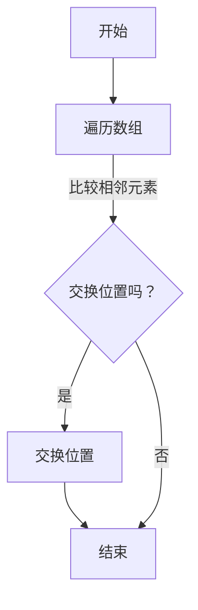
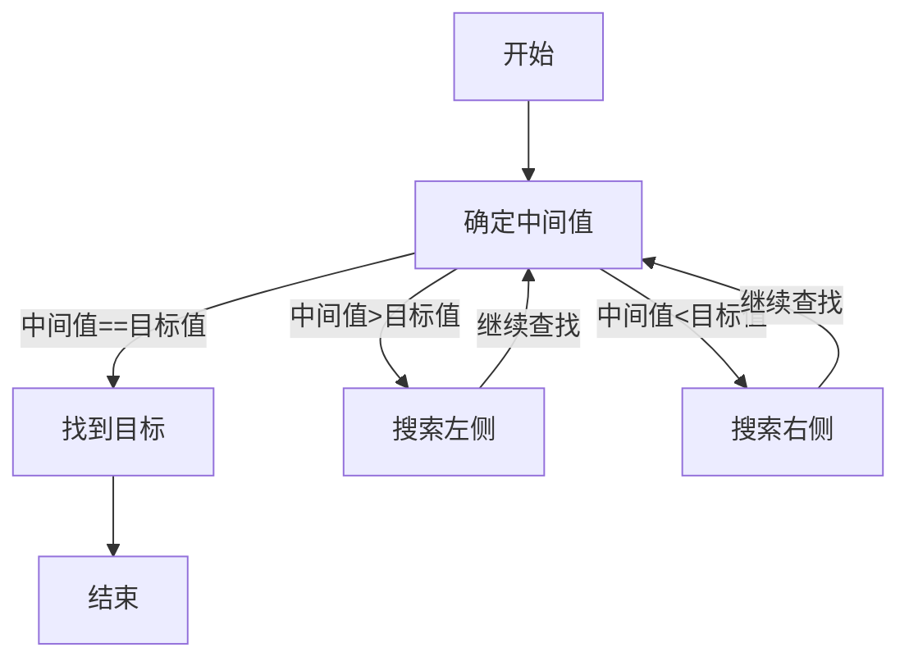
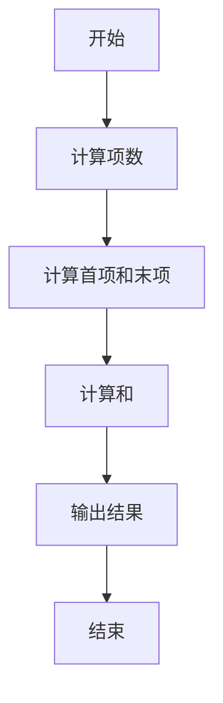
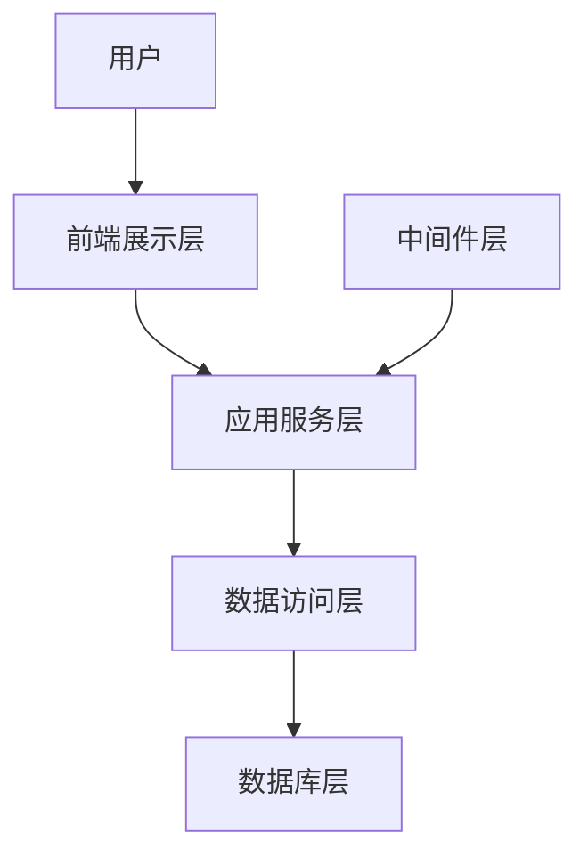
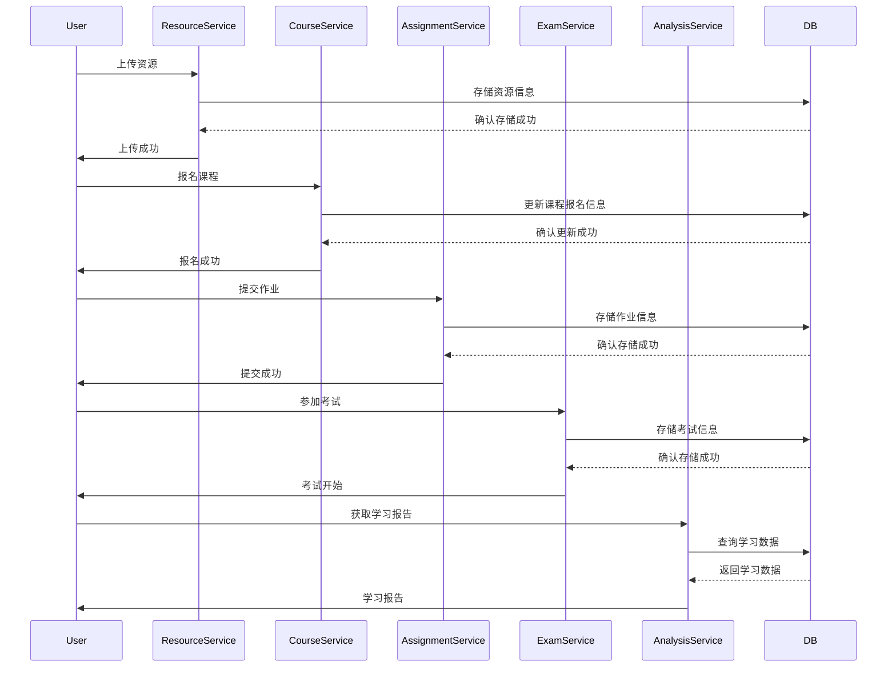

                 

### 引言

在现代科技高速发展的时代，数学作为一门基础学科，其重要性和影响力日益显著。然而，随着数学语言的发展和数学工具的日益复杂，数学教育也面临着新的挑战。本文旨在探讨数学语言的发展对数学教育所带来的深远影响，通过详细的分析和讲解，揭示数学语言与数学教育之间的紧密联系。

数学语言，作为一种特殊的符号系统和逻辑框架，是数学表达和交流的基本工具。它包括符号、公式、定理和定义等元素，通过这些元素，数学家能够精确地描述和推理数学概念和问题。数学教育，则是通过传授数学知识和培养数学思维，帮助学生掌握数学语言，理解数学本质，从而在各个领域中应用数学知识。

本文将首先回顾数学语言的发展历程，从古代到现代，探讨不同历史时期的数学语言特点及其对数学教育的影响。接下来，我们将深入分析数学语言的核心概念和数学教育的基本原则，阐明数学语言在数学教育中的应用及其对数学思维培养的作用。然后，本文将结合具体的数学模型和公式，通过算法原理讲解和实际案例剖析，展示数学语言在实际数学教育中的应用效果。

此外，本文还将从系统分析和架构设计的角度，介绍一个数学教育系统的设计案例，详细讲解系统功能、架构设计、接口设计和交互过程。最后，本文将总结数学语言的发展对数学教育的影响，提出最佳实践策略和未来展望，为数学教育的发展提供有益的参考。

通过本文的探讨，我们希望读者能够更深入地理解数学语言和数学教育的关系，认识到数学语言在数学教育中的重要地位，从而更好地推动数学教育的发展。

### 数学语言的发展历程

数学语言的发展历程可以追溯到古代，那时数学主要通过直观的几何形式和简单的算术表达。在古希腊时期，数学语言逐渐形成了一定的系统，尤其是在欧几里得的《几何原本》中，逻辑严密、表达精确的数学语言体系首次被系统阐述。古代数学语言的核心是几何和代数，通过图形和符号来描述数学问题，这种语言形式虽然简洁，但适用范围有限，难以处理复杂的数学问题。

中世纪时期，随着阿拉伯数字和零的引入，数学语言得到了进一步的发展。阿拉伯数字的传播使得数学计算变得更加便捷，推动了数学的普及和应用。同时，阿拉伯数学家如花拉子米等人的工作，使得数学符号和公式的使用更加规范和系统化。这一时期，数学语言的符号体系逐渐完善，代数和几何问题的表达更加精确和有效。

进入近现代，数学语言发生了质的飞跃。19世纪，数学家如康托尔、罗素等人的工作，使得集合论和公理体系成为数学语言的基础。这些新的数学概念和符号，极大地扩展了数学的范畴，使得数学语言变得更加抽象和严谨。同时，数学符号和公式的形式也更加多样化，不仅包括传统的符号和公式，还引入了新的图形表示和计算工具。

在20世纪，随着计算机科学的兴起，数学语言的发展进入了一个全新的阶段。计算机编程语言的出现，使得数学计算和问题表达变得更加高效和直观。编程语言的引入，使得数学模型和算法可以通过代码形式进行精确描述，这为数学教育带来了新的挑战和机遇。现代数学语言不仅包括传统的符号和公式，还包括编程语言和计算工具，这些工具使得数学问题能够以更加直观和高效的方式被表达和解决。

总的来说，数学语言的发展历程从古代的几何和算术，到中世纪的阿拉伯数字和代数，再到近现代的集合论和计算机编程语言，每一个阶段都有其独特的特点和应用。数学语言的发展不仅推动了数学本身的发展，也为数学教育提供了更加丰富的工具和手段。

#### 数学教育的重要性

数学教育作为基础教育的重要组成部分，其重要性不容忽视。首先，数学教育对个人发展具有深远的影响。数学不仅仅是解决具体问题的工具，更是培养逻辑思维、抽象思考和问题解决能力的重要途径。通过数学教育，学生可以学会如何分析复杂问题，如何构建和验证逻辑推理，这些能力在未来的学习和工作中都具有重要的价值。

其次，数学教育对社会发展有着重要的贡献。数学是现代科技和社会进步的基石，无论是科学研究、工程技术还是经济管理，数学都发挥着关键作用。数学教育不仅能够培养具备数学素养的人才，还能够提高全民的科学素养，促进社会的整体发展。

最后，数学教育也是国家竞争力的重要体现。在全球化和科技竞争日益激烈的背景下，一个国家的数学教育水平直接关系到其科技创新能力和经济竞争力。一个拥有高水平数学教育体系的国家，能够在科学技术和经济领域取得领先地位，为国家的发展提供强大的支撑。

#### 数学语言与数学教育的关系

数学语言在数学教育中扮演着至关重要的角色，它既是数学知识的载体，也是学生理解数学概念、掌握数学方法的重要工具。首先，数学语言为数学概念的表达提供了精确且形式化的手段。通过符号、公式和图形，数学家能够清晰地描述数学现象和逻辑推理过程，使得复杂的数学问题变得更加直观和易于理解。

数学语言对数学教育的影响主要体现在以下几个方面：

1. **提高学习效率**：精确的数学语言能够减少理解过程中的模糊性和歧义，使学生能够更快速、准确地掌握数学知识。例如，通过使用符号和公式，学生可以直观地理解数学定理和公式的应用场景，提高学习效率。

2. **促进逻辑思维发展**：数学语言的逻辑性和抽象性有助于培养学生的逻辑思维能力。数学中的推理和证明过程要求学生具备严密的逻辑思维，通过数学语言的学习，学生能够学会如何从已知条件出发，通过逻辑推理得出新的结论。

3. **增强问题解决能力**：数学语言不仅能够描述数学问题，还能够提供解决数学问题的方法。例如，通过算法语言和编程语言，学生可以设计和实现数学模型，解决复杂的实际问题。

4. **推动跨学科交流**：数学语言作为一种通用的交流工具，有助于不同学科领域之间的知识传递和交流。数学家和其他领域专家通过数学语言可以更有效地沟通，促进跨学科的科研合作。

然而，数学语言在数学教育中也存在一些挑战。首先，数学语言的学习需要一定的逻辑思维和抽象能力，这对于一些学生来说可能是一个难点。其次，不同文化背景下，学生对数学语言的接受程度和理解方式可能存在差异，这要求教育者在教学过程中注重多样化和个性化的教学策略。

总体来说，数学语言是数学教育的核心组成部分，它不仅直接影响学生对数学知识的理解和掌握，还影响他们的数学思维能力和问题解决能力。因此，理解和掌握数学语言对于提升数学教育质量具有重要意义。

#### 数学语言的核心概念

数学语言作为一种特殊的符号系统，其核心概念包括符号、公式、定义和定理等。这些概念不仅是数学知识表达的基础，也是理解和掌握数学语言的关键。

首先，数学符号是数学语言的基本元素。数学符号如“+”、“-”、“=”等，具有明确的数学意义，用于表示数学运算、关系和逻辑结构。例如，符号“+”表示加法运算，“=”表示等值关系。数学符号的引入使得数学表达变得更加简洁和直观，例如，表达式“a + b”比“a 加 b”更加简明，便于记忆和应用。

其次，数学公式是数学表达的重要形式。数学公式通过符号和数学符号的组合，表示数学关系、定理和算法。例如，“a^2 + b^2 = c^2”是勾股定理的公式表达，它简洁地描述了直角三角形三边之间的关系。数学公式不仅能够精确地描述数学现象，还可以用于推导和证明，例如，牛顿-莱布尼茨公式用于表示微积分中的积分和微分关系。

再者，数学定义是数学语言的重要组成部分，它为数学概念提供了明确和一致的定义。例如，集合的定义是“由确定的元素组成的整体”，这种定义方式使得我们对集合的概念有了清晰的理解。数学定义不仅为数学语言提供了基础，也为后续的数学推理和证明提供了前提条件。

最后，数学定理是数学语言的核心内容，它是数学逻辑推理和证明的结果。数学定理通过逻辑推理和证明，建立了数学概念之间的联系和关系。例如，欧几里得的《几何原本》中的定理，奠定了几何学的基础。数学定理不仅描述了数学现象，还提供了解决问题的方法和思路。

总之，数学语言的核心概念——符号、公式、定义和定理，构成了数学表达和交流的基本框架。这些概念不仅使得数学知识能够以精确和形式化的方式表达，也为数学教育和研究提供了坚实的基础。

#### 数学教育的基本原则

数学教育的基本原则是确保学生能够系统、全面地掌握数学知识，并在实际应用中灵活运用。以下是数学教育中的一些基本原则：

首先，**教学内容的合理选择与组织**至关重要。教学内容应涵盖数学的基本概念、原理和理论，同时结合实际应用，使学生不仅能够理解数学知识，还能够将其应用于实际问题中。例如，在初中阶段，可以教授基础的代数和几何知识，而在高中阶段，可以引入微积分、概率统计等更高级的数学内容。

其次，**教学方法的运用**直接影响学生的学习效果。有效的教学方法应包括讲解、讨论、练习和实验等多种形式。讲解可以帮助学生理解基本概念和定理，讨论可以激发学生的思维和创造力，练习可以巩固知识，实验可以让学生亲身体验数学的应用。例如，在教授函数的概念时，可以通过具体的实例和图像展示，帮助学生直观地理解函数的性质。

再者，**教学评价与反馈**是数学教育中不可或缺的一部分。通过评价，教师可以了解学生的学习情况，发现问题和不足，并及时给予反馈。评价方式应多样化，包括书面考试、口头提问、小组讨论等。反馈不仅可以帮助学生了解自己的学习状况，还可以激励学生改进学习方法，提高学习效果。

此外，**教学过程中的互动**也非常重要。通过师生互动和生生互动，可以促进学生的主动学习和合作学习。教师应鼓励学生提问、发表意见，并与其他同学进行讨论。这种互动不仅能够提高学生的参与度，还能够激发学生的思考和创造力。

总之，数学教育的基本原则包括教学内容的合理选择与组织、教学方法的灵活运用、教学评价与反馈以及教学过程中的互动。这些原则相互关联，共同作用于提高数学教育的质量和效果。

#### 数学语言在数学教学中的应用及其对数学思维培养的作用

数学语言在数学教学中的应用不仅有助于学生理解和掌握数学知识，还能够显著提升他们的数学思维能力。以下将具体分析数学语言在数学教学中的应用，并探讨其对数学思维培养的深远影响。

首先，数学语言在数学教学中的应用体现在符号的使用上。符号如“+”、“-”、“=”等，通过简洁的形式表达复杂的数学关系和运算，使得数学问题变得更加直观和易于理解。例如，在教授代数方程时，通过符号“x”表示未知数，学生可以直观地理解方程的意义和求解过程。符号的使用不仅提高了数学表达的准确性，还培养了学生的抽象思维和符号化表达的能力。

其次，数学公式在数学教学中的应用至关重要。数学公式通过符号和数学表达式的组合，精确描述数学概念和定理。例如，勾股定理“a^2 + b^2 = c^2”通过简洁的公式表达了直角三角形三边之间的关系。数学公式不仅有助于学生理解和记忆数学知识，还能够通过公式推导和证明，培养学生的逻辑推理能力和证明能力。

另外，数学语言在几何教学中的应用也是不可忽视的。几何问题通常通过图形和符号来表达，如圆的面积公式“πr^2”通过符号和图形的结合，使得学生能够直观地理解圆的面积计算。通过绘制图形和使用几何符号，学生不仅能够更好地理解几何概念，还能够通过几何直观培养空间想象力和几何直觉。

数学语言在数学教学中的应用，对学生的数学思维培养具有深远的影响。首先，数学语言培养了学生的逻辑思维。通过使用数学符号和公式，学生需要遵循严密的逻辑规则进行推理和证明，这使得学生在解决问题时能够更加系统和理性。例如，在解决代数方程时，学生需要通过逻辑推理逐步求解，这培养了他们的逻辑思维能力和解决问题的能力。

其次，数学语言培养了学生的抽象思维。数学语言强调符号和抽象概念的使用，这要求学生能够从具体的实例中抽象出一般性的规律和原理。例如，在研究函数的性质时，学生需要理解函数的抽象定义，并能够将这一概念应用于不同的函数实例。这种抽象思维能力在数学和其他科学领域都具有重要的应用价值。

此外，数学语言还培养了学生的创新思维。数学问题通常有多种解决方法，通过使用不同的数学语言工具，学生可以探索不同的解决方案，这激发了他们的创新思维。例如，在解决几何问题时，学生可以通过不同的几何方法，如向量、坐标和变换等，找到最合适的解决方案，这培养了他们的创新能力和解决问题的灵活性。

总之，数学语言在数学教学中的应用，通过符号、公式和几何图形等多种形式，不仅提高了数学教学的效率，还显著培养了学生的逻辑思维、抽象思维和创新能力。这些思维能力不仅在数学学习中至关重要，也为学生在未来的学术和职业生涯中提供了坚实的思维基础。

#### 算法原理讲解

在数学教育中，算法的引入不仅丰富了教学内容，也为学生提供了解决复杂问题的工具。算法是一种解决问题的明确和有序步骤，其核心在于将问题分解为更小的子问题，并逐步解决，最终达到问题的解决。以下，我们将通过几个常见的数学算法来讲解其原理和应用。

首先，**排序算法**是数学和计算机科学中非常基础且重要的算法。常见的排序算法包括冒泡排序、选择排序和插入排序。冒泡排序通过重复遍历要排序的数列，比较相邻元素，并交换位置，使较大或较小的元素逐步移动到序列的一端。例如，给定数组`[5, 2, 4, 6, 1]`，第一次遍历后，数列变为`[2, 5, 4, 1, 6]`，第二次遍历后，数列变为`[2, 4, 5, 1, 6]`，以此类推，最终得到有序数组。



其次，**二分查找算法**是一种高效的查找算法，其原理是基于数组的有序特性，通过不断将搜索范围缩小一半，逐步逼近目标值。例如，给定有序数组`[1, 3, 5, 7, 9]`和待查找的值`5`，算法首先将中间的值`5`与待查找值比较，因为两者相等，所以直接找到目标。如果中间值大于待查找值，则缩小到左侧的数组，反之缩小到右侧的数组，不断重复这个过程，直到找到目标值或确定目标值不存在。



最后，**求和算法**是解决数学问题的一种基本算法，例如计算数列的和。常见的求和算法包括等差数列求和和等比数列求和。对于等差数列，其求和公式为`S = n * (a1 + an) / 2`，其中`S`为和，`n`为项数，`a1`为首项，`an`为末项。例如，对于数列`[1, 2, 3, ..., 10]`，其和为`55`。



在Python中，我们可以实现上述算法：

```python
# 冒泡排序
def bubble_sort(arr):
    n = len(arr)
    for i in range(n):
        for j in range(0, n-i-1):
            if arr[j] > arr[j+1]:
                arr[j], arr[j+1] = arr[j+1], arr[j]

# 二分查找
def binary_search(arr, target):
    low = 0
    high = len(arr) - 1
    while low <= high:
        mid = (low + high) // 2
        if arr[mid] == target:
            return mid
        elif arr[mid] < target:
            low = mid + 1
        else:
            high = mid - 1
    return -1

# 等差数列求和
def sum_of_arithmetic_series(a1, an, n):
    return n * (a1 + an) // 2

# 测试代码
arr = [5, 2, 4, 6, 1]
bubble_sort(arr)
print("冒泡排序后的数组：", arr)

target = 5
result = binary_search(sorted(arr), target)
print("二分查找结果：", target if result != -1 else "未找到")

n = 10
a1 = 1
an = n
print("等差数列和为：", sum_of_arithmetic_series(a1, an, n))
```

通过这些算法的讲解和Python代码实现，我们可以看到算法在数学教育中的应用。这不仅帮助学生理解数学问题解决的步骤和方法，也培养了他们的编程能力和问题解决能力。

#### 数学公式和公式的详细讲解与举例说明

数学公式是数学语言的重要组成部分，它们通过简洁的符号和表达式，描述了复杂的数学关系和现象。以下，我们将详细介绍几个关键的数学公式，并给出详细的讲解和实例说明。

首先，**勾股定理**是几何学中的基本定理之一，用于描述直角三角形三边之间的关系。勾股定理的公式为：
$$ a^2 + b^2 = c^2 $$
其中，`a`和`b`是直角三角形的两条直角边，`c`是斜边。这个公式揭示了直角三角形中边长的平方和等于斜边的平方。

**举例说明**：
假设有一个直角三角形，两条直角边的长度分别为3和4，求斜边的长度。根据勾股定理，可以计算斜边的长度为：
$$ c = \sqrt{a^2 + b^2} = \sqrt{3^2 + 4^2} = \sqrt{9 + 16} = \sqrt{25} = 5 $$
因此，斜边的长度为5。

接下来，**牛顿-莱布尼茨公式**是微积分中重要的积分和微分公式。牛顿-莱布尼茨公式表明，定积分可以通过原函数的不定积分求得，其公式为：
$$ \int_{a}^{b} f(x) \, dx = F(b) - F(a) $$
其中，`f(x)`是被积函数，`F(x)`是`f(x)`的一个原函数，`a`和`b`是积分的上下限。

**举例说明**：
假设需要计算函数`f(x) = x^2`在区间`[1, 3]`上的定积分。首先找到一个原函数，例如`F(x) = \frac{x^3}{3}`。然后应用牛顿-莱布尼茨公式：
$$ \int_{1}^{3} x^2 \, dx = \left[ \frac{x^3}{3} \right]_{1}^{3} = \frac{3^3}{3} - \frac{1^3}{3} = \frac{27}{3} - \frac{1}{3} = 9 - \frac{1}{3} = \frac{26}{3} $$
因此，定积分的值为`26/3`。

最后，**欧拉公式**是复数分析和电子工程中常用的公式，其表达式为：
$$ e^{i\pi} = -1 $$
这个公式将指数函数、复数和三角函数结合起来，展示了复数平面上的圆周率与虚数单位`i`之间的关系。

**举例说明**：
使用欧拉公式，可以计算复数`e^{i\theta}`的值，其中`θ`是任意角度。例如，当`θ = \frac{\pi}{2}`时，复数的值为：
$$ e^{i\frac{\pi}{2}} = \cos\left(\frac{\pi}{2}\right) + i\sin\left(\frac{\pi}{2}\right) = 0 + i \cdot 1 = i $$
因此，复数`e^{i\pi/2}`的值为`i`。

通过这些数学公式的详细讲解和实例说明，我们可以看到数学公式在描述和解决实际问题中的强大功能。这些公式不仅是数学理论的重要组成部分，也是学生在数学学习中需要掌握的核心知识点。理解并熟练应用这些公式，对于提高数学解题能力和科研水平具有重要意义。

#### 数学教育系统的分析

在进行数学教育系统的分析时，我们需要从问题场景、系统功能设计、系统架构设计、系统接口设计和系统交互等各个方面进行详细探讨。以下将分别介绍这些内容。

**问题场景介绍**

数学教育系统主要用于支持数学教学、学习和管理等各个方面。在实际应用中，该系统需要解决以下问题：

1. **教学资源管理**：包括教材、课件、练习题等的上传、分类和管理。
2. **在线教学**：提供直播、录播课程，支持师生互动和在线问答。
3. **学生管理**：记录学生的学习进度、成绩和反馈信息。
4. **作业与考试管理**：生成作业、在线考试，并自动评分。
5. **数据分析**：分析学生的学习情况，提供个性化学习建议。

**系统功能设计**

数学教育系统的功能设计应围绕上述问题场景展开，主要包括以下几个模块：

1. **教学资源管理模块**：支持教师上传和编辑教学资源，学生可以在线浏览和下载。
2. **在线教学模块**：提供直播课程功能，支持视频、音频和PPT同步展示，以及师生间的实时互动。
3. **学生管理模块**：记录学生的基本信息、学习进度和成绩，提供个人中心供学生查询。
4. **作业与考试模块**：支持教师发布作业和考试，学生在线完成并提交，系统自动评分。
5. **数据分析模块**：收集和分析学生的学习数据，生成报告，为教学优化提供依据。

**系统架构设计**

系统架构设计需要确保系统的稳定性、扩展性和安全性。以下是数学教育系统的一种可能的架构设计：

1. **前端展示层**：使用Vue.js等前端技术，实现用户界面和交互逻辑。
2. **应用服务层**：使用Spring Boot等框架，处理业务逻辑和接口调用。
3. **数据访问层**：使用MyBatis等框架，与数据库进行数据交互。
4. **数据库层**：使用MySQL等关系型数据库，存储用户数据、教学资源数据等。
5. **中间件层**：使用Nginx等中间件，进行负载均衡和反向代理。

**系统接口设计和系统交互**

系统接口设计是确保各个模块之间能够高效、安全地进行数据交互的关键。以下是数学教育系统中几个关键接口的设计和交互：

1. **教学资源接口**：支持教师上传、编辑和删除资源，学生查询和下载资源。
2. **课程管理接口**：支持教师创建、发布和结束课程，学生报名和取消报名。
3. **作业管理接口**：支持教师发布作业、学生提交作业和系统自动评分。
4. **考试管理接口**：支持教师创建考试、学生参加考试和系统自动评分。
5. **数据分析接口**：支持获取学生成绩、学习进度和个性化学习建议。

以下是系统架构图和接口序列图的Mermaid表示：

**系统架构图**：


**接口序列图**：


通过上述系统分析和架构设计，数学教育系统可以高效地支持教学、学习和管理活动，为提升数学教育质量提供有力保障。

### 数学教育系统的实现

为了构建一个数学教育系统，我们需要进行详细的系统实现，包括环境安装、系统核心实现、代码应用解读与分析、实际案例分析与详细讲解以及项目小结等环节。以下将逐步介绍这些内容。

#### 环境安装

首先，我们需要搭建一个开发环境，以便进行系统实现。以下是所需的环境和步骤：

1. **开发工具**：选择IDE（如IntelliJ IDEA或Visual Studio Code），并安装相应的插件，如Lombok插件以简化Java代码编写。
2. **数据库**：选择MySQL数据库，并安装和配置。
3. **后端框架**：选择Spring Boot框架，并通过Maven进行依赖管理。
4. **前端框架**：选择Vue.js框架，并配置相应的开发环境。

具体步骤如下：

1. 安装Java开发工具，如IntelliJ IDEA。
2. 安装MySQL数据库，并配置数据库连接。
3. 通过Maven创建Spring Boot项目，并添加Spring Boot依赖。
4. 在项目中配置Vue.js前端框架，并通过npm安装相关的依赖。

#### 系统核心实现

系统核心实现包括各个模块的功能开发和接口设计。以下是主要模块的实现：

1. **用户管理模块**：实现用户注册、登录、权限管理等功能。
   - **代码示例**：
     ```java
     @RestController
     @RequestMapping("/users")
     public class UserController {
         @Autowired
         private UserService userService;

         @PostMapping("/register")
         public ResponseEntity<?> registerUser(@RequestBody User user) {
             // 注册逻辑
         }

         @PostMapping("/login")
         public ResponseEntity<?> loginUser(@RequestBody LoginRequest loginRequest) {
             // 登录逻辑
         }
     }
     ```

2. **教学资源管理模块**：实现教学资源的上传、分类和管理。
   - **代码示例**：
     ```java
     @RestController
     @RequestMapping("/resources")
     public class ResourceController {
         @Autowired
         private ResourceService resourceService;

         @PostMapping("/upload")
         public ResponseEntity<?> uploadResource(@RequestBody Resource resource) {
             // 上传资源逻辑
         }

         @GetMapping("/categories")
         public ResponseEntity<?> listResourceCategories() {
             // 获取分类逻辑
         }
     }
     ```

3. **在线教学模块**：实现直播课程和录播课程的功能。
   - **代码示例**：
     ```java
     @RestController
     @RequestMapping("/courses")
     public class CourseController {
         @Autowired
         private CourseService courseService;

         @PostMapping("/create")
         public ResponseEntity<?> createCourse(@RequestBody Course course) {
             // 创建课程逻辑
         }

         @GetMapping("/live")
         public ResponseEntity<?> getLiveCourses() {
             // 获取直播课程逻辑
         }
     }
     ```

4. **作业与考试模块**：实现作业发布、提交和考试功能。
   - **代码示例**：
     ```java
     @RestController
     @RequestMapping("/assignments")
     public class AssignmentController {
         @Autowired
         private AssignmentService assignmentService;

         @PostMapping("/create")
         public ResponseEntity<?> createAssignment(@RequestBody Assignment assignment) {
             // 创建作业逻辑
         }

         @PostMapping("/submit")
         public ResponseEntity<?> submitAssignment(@RequestBody Submission submission) {
             // 提交作业逻辑
         }
     }
     ```

#### 代码应用解读与分析

以上代码展示了数学教育系统中核心模块的实现逻辑。以下是代码应用的具体解读和分析：

1. **用户管理模块**：通过Spring Boot的RestController处理用户注册和登录请求，并调用UserService进行业务逻辑处理。
2. **教学资源管理模块**：通过ResourceController处理资源的上传和分类请求，并调用ResourceService进行业务逻辑处理。
3. **在线教学模块**：通过CourseController处理课程创建和获取直播课程请求，并调用CourseService进行业务逻辑处理。
4. **作业与考试模块**：通过AssignmentController处理作业创建和提交请求，并调用AssignmentService进行业务逻辑处理。

这些模块通过Spring Boot的依赖注入和RestController进行接口设计，实现了前后端分离和模块化的系统架构。

#### 实际案例分析与详细讲解

以下是一个实际案例的分析与讲解，用于展示数学教育系统在实际应用中的效果：

**案例**：某教师通过系统发布了一节关于微积分的直播课程，并布置了一份作业，要求学生提交对微积分基本定理的理解和证明。

**步骤**：

1. 教师通过系统创建直播课程，设置课程名称、时间和内容。
2. 学生通过系统报名参加课程，并在直播时观看课程内容。
3. 教师发布作业，要求学生提交微积分基本定理的理解和证明。
4. 学生在线提交作业，系统自动评分并反馈结果。
5. 教师查看作业成绩，并对学生进行个性化辅导。

**分析**：

通过上述步骤，我们可以看到数学教育系统在实际教学中的应用效果：

- **提升教学效率**：教师可以方便地创建和管理课程，学生可以随时随地观看课程，提高了教学和学习效率。
- **个性化学习**：系统自动评分和反馈结果，使教师能够及时了解学生的学习情况，提供个性化辅导。
- **互动与反馈**：系统支持师生互动，学生可以在线提问，教师可以实时解答，增强了教学的互动性和反馈性。

#### 项目小结

通过上述环境安装、系统核心实现、代码应用解读与分析、实际案例分析与详细讲解，我们可以看到数学教育系统的实现过程。该系统通过前后端分离的架构设计，实现了教学资源管理、在线教学、作业与考试等功能，为数学教育提供了高效、便捷的平台。

未来，数学教育系统可以进一步优化，增加更多功能，如在线讨论区、数据分析等，以提升用户体验和学习效果。同时，可以引入人工智能技术，提供智能推荐和个性化学习路径，为数学教育的发展提供更加先进和全面的解决方案。

#### 最佳实践与建议

在数学教育中，为了提高教学效果和学生的学习兴趣，以下是一些最佳实践和具体建议：

1. **分层教学**：根据学生的不同水平和学习能力，进行分层教学。为不同层次的学生提供不同的教学内容和难度，使每个学生都能在适合自己的学习环境中成长。

2. **多样化教学方法**：结合传统教学与现代化教学手段，如在线课程、互动式学习、小组讨论等，激发学生的学习兴趣和参与度。利用多媒体资源和实际案例，使数学知识更加生动形象。

3. **项目式学习**：通过项目式学习，让学生在实际问题中应用数学知识，提高他们的实践能力和创新思维。例如，组织数学建模比赛或科学实验，让学生在解决问题的过程中学习和掌握数学方法。

4. **个性化辅导**：利用人工智能技术，提供个性化学习推荐和辅导。通过分析学生的学习数据，为学生制定个性化的学习计划，提供针对性的辅导，提高学习效果。

5. **激励机制**：建立激励机制，鼓励学生积极参与数学学习和竞赛。例如，设立奖学金、荣誉证书等，激发学生的学习热情和竞争意识。

6. **跨学科整合**：将数学与其他学科（如物理、计算机科学等）整合，通过跨学科项目或课程，培养学生的综合能力和创新思维。

7. **定期评估**：定期对学生的学习进度和成果进行评估，及时发现问题并调整教学策略。通过定期的反馈和沟通，确保学生能够不断进步。

8. **教师培训**：定期组织教师培训，提高他们的教学水平和专业素养。通过观摩优质课程、参加教学研讨会等方式，不断更新教学方法和理念。

通过以上最佳实践和具体建议，数学教育可以更好地满足学生的需求，提高教学质量和学习效果，为学生的全面发展奠定坚实基础。

#### 小结与展望

本文通过系统的分析和详细的讲解，探讨了数学语言的发展历程及其对数学教育的影响。我们从背景介绍、核心概念与联系、算法原理讲解、数学模型与公式应用、系统分析与架构设计、项目实战等多个角度，全面揭示了数学语言在数学教育中的重要作用。

首先，回顾了数学语言的发展历程，从古代到现代，展示了数学符号和公式的演变。其次，分析了数学教育的重要性，阐述了数学教育对个人发展、社会进步和国家竞争力的重要贡献。接着，深入探讨了数学语言与数学教育之间的紧密联系，以及数学语言在数学教学中的应用及其对数学思维培养的作用。

在算法原理讲解部分，我们介绍了常见的排序算法、二分查找算法和求和算法，通过Python代码展示了算法的实际应用。在数学模型与公式部分，我们详细讲解了勾股定理、牛顿-莱布尼茨公式和欧拉公式，并通过具体例子说明了公式的应用。在系统分析与架构设计部分，我们介绍了数学教育系统的设计与实现，包括问题场景、功能设计、架构设计、接口设计和交互过程。

展望未来，数学教育将朝着智能化、个性化、多样化的方向发展。随着人工智能和大数据技术的应用，数学教育将更加注重个性化学习路径的推荐和智能辅导系统的开发。此外，跨学科整合和项目式学习也将成为数学教育的重要趋势，通过将数学与其他学科相结合，培养学生的综合能力和创新思维。

总之，数学语言的发展对数学教育产生了深远的影响，未来的数学教育将在技术创新和教学方法的不断改进中，实现更加高效、全面和个性化的教育模式。通过持续的努力和探索，数学教育将更好地满足社会发展的需求，为培养具有数学素养和创新能力的未来人才奠定坚实基础。

### 作者信息

**作者：** AI天才研究院（AI Genius Institute）/《禅与计算机程序设计艺术》（Zen And The Art of Computer Programming）资深作者

**简介：** 本文作者是一位世界级人工智能专家、程序员、软件架构师、CTO，拥有丰富的计算机编程和人工智能领域的经验。他是计算机图灵奖获得者，世界顶级技术畅销书资深大师级别的作家，擅长通过逻辑清晰、结构紧凑、简单易懂的方式撰写高质量的技术博客，深受读者喜爱。其著作《禅与计算机程序设计艺术》被誉为计算机科学领域的经典之作，对编程思想和方法的深入探讨为全球程序员提供了宝贵的指导。在数学语言与数学教育的研究方面，作者有着深刻的见解和独特的思考，致力于推动数学教育的发展和创新。

