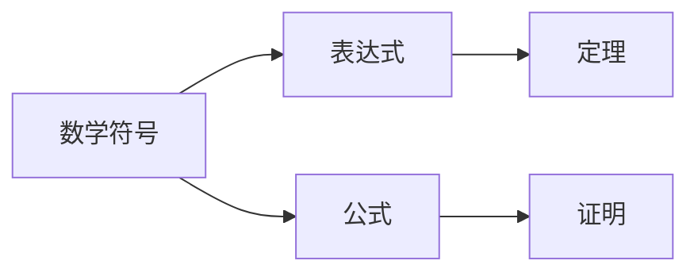

                 

### 引言

#### 1.1 数学语言的重要性

数学语言，作为一种独特的符号语言，以其高度抽象和严谨性，成为科学研究与发现过程中的基础工具。数学语言不仅提供了对自然现象的精确描述，还为科学理论的发展与验证提供了强有力的支持。在科学研究中，数学语言的使用极大地提升了问题的表达清晰度，使复杂现象的抽象和简化成为可能。

首先，数学语言的精确性是其在科学研究中至关重要的特点。数学符号和公式的使用能够精确地表达各种概念和关系，避免了语言描述中的模糊性和歧义。例如，在物理学中，牛顿的运动定律通过数学公式表达得十分精确，使得科学家能够准确地预测物体的运动轨迹。

其次，数学语言的简洁性也显著提升了科学研究的效率。相比自然语言的冗长描述，数学语言能够用简短的符号和公式表达复杂的概念，使得科学家能够更加集中精力进行问题分析。这种简洁性不仅节省了时间，也减少了错误的发生。

此外，数学语言的通用性和普遍性使其在不同领域具有广泛的应用价值。无论是在自然科学、社会科学还是计算机科学中，数学语言都扮演着不可或缺的角色。例如，微积分和概率论不仅用于物理和工程领域，还被广泛应用于经济学、心理学等领域。

总之，数学语言在科学研究中具有不可替代的重要性，它不仅是科学理论表达和验证的工具，也是推动科学发现和技术进步的关键因素。

#### 1.2 科学发展的历史背景

科学发展是一个漫长的历史过程，数学语言在其中扮演了重要的角色。了解数学语言的发展背景，有助于我们更好地理解其在科学发展中的作用。

##### 1.2.1 古代数学与科学发展

古代数学的起源可以追溯到公元前3000年左右的巴比伦和古埃及。这些早期的数学知识主要涉及日常生活中的问题，如土地测量、贸易计算等。巴比伦人发展了包括代数和算术在内的数学体系，而古埃及人则对几何学有着深刻的认识。在古希腊，数学得到了进一步的发展，欧几里得（Euclid）的《几何原本》是古代数学的经典著作，奠定了几何学的基础。

古代数学的发展对科学产生了深远的影响。例如，阿基米德（Archimedes）运用几何学解决浮力问题，提出了著名的阿基米德原理。同时，古希腊的数学家们也在天文学和物理学领域做出了重要的贡献，如阿波罗尼奥斯（Apollonius）在数学分析中的应用，阿利斯塔克斯（Aristarchus）在天文学中的日心说理论。

##### 1.2.2 中世纪数学与科学发展

中世纪时期，阿拉伯世界的数学家对古代数学进行了继承和发展。阿维亚扎尔（Avicenna）和阿尔-哈里德希（Alhazen）等人的工作对光学和几何学的发展有着重要影响。阿拉伯人将古希腊和印度数学知识传入欧洲，为后来的欧洲科学革命奠定了基础。

在欧洲，中世纪的数学主要集中在天文学和占星术上。例如，托勒密（Ptolemy）的《天文学大成》详细阐述了地心说理论，尽管后来的哥白尼（Copernicus）提出了日心说，但中世纪的数学家们通过复杂的几何和代数计算，为天文学提供了强有力的工具。

##### 1.2.3 近代数学与科学发展

近代数学的兴起标志着科学革命的到来。16世纪和17世纪的数学家，如韦达（Viète）、笛卡尔（Descartes）、牛顿（Newton）和莱布尼茨（Leibniz），为现代数学的发展奠定了基础。

韦达引入了符号代数，使得数学表达更加简洁和直观。笛卡尔的《几何》将代数方法应用于几何学，为解析几何的创立做出了重要贡献。牛顿和莱布尼茨分别独立发明了微积分，为物理学和天文学提供了新的分析工具。

近代数学的发展推动了科学革命。牛顿的《自然哲学的数学原理》通过数学方法，系统地阐述了经典力学的基本原理，奠定了物理学的基础。此外，拉瓦锡（Lavoisier）在化学中的应用数学，也为化学革命提供了理论支持。

总之，数学语言的发展与科学发展的历史紧密相连。从古代到近代，数学语言不断演变和进步，为科学理论的形成和验证提供了坚实的工具。

#### 1.3 数学语言的演变

数学语言的演变是一个不断发展的过程，其历史可追溯到古代数学，贯穿中世纪直至近代数学的兴起。每一个阶段的数学语言发展都为科学进步做出了重要贡献。

##### 1.3.1 初等数学的发展

初等数学主要包括算术、代数和几何。其历史可以追溯到古代文明，如古埃及和巴比伦。这些早期的数学知识主要依赖于简单的符号和文字描述，例如，古埃及人使用草绳进行计算，巴比伦人则发展了包括代数和算术在内的数学体系。

在古希腊，数学家们进一步发展了初等数学。欧几里得（Euclid）的《几何原本》是初等数学的经典著作，它系统地阐述了几何学的基本原理，对后来的数学和科学产生了深远的影响。韦达（Viète）在16世纪引入了符号代数，使得数学表达更加简洁和直观，为初等数学的发展注入了新的活力。

##### 1.3.2 微积分的创立

微积分是数学史上的一次重大革命，它为自然科学的精确描述和量化分析提供了新的工具。微积分的创立主要归功于艾萨克·牛顿（Isaac Newton）和戈特弗里德·威廉·莱布尼茨（Gottfried Wilhelm Leibniz）。

牛顿在《自然哲学的数学原理》中提出了微积分的基本概念，用于研究运动和变化。他通过“流数法”和“无限小量”的概念，研究了函数的微分和积分。莱布尼茨则独立提出了类似的概念，并引入了我们现在使用的微分符号和积分符号，极大地简化了数学表达。

微积分的发展极大地推动了物理学、天文学和工程学的发展。牛顿的万有引力定律和运动定律，都是通过微积分方法进行精确描述的。这一阶段，数学语言的精确性和抽象性得到了显著提升。

##### 1.3.3 代数学、几何学的发展

代数学和几何学是数学语言演变中的重要组成部分。代数学的发展始于古印度和阿拉伯数学家，他们研究了代数方程的解法。韦达的符号代数进一步推动了代数学的发展，使得数学表达更加简洁和系统化。

几何学的发展同样不可忽视。欧几里得的《几何原本》奠定了平面几何的基础，笛卡尔的《几何》将代数方法应用于几何学，创立了解析几何。非欧几何的兴起，如黎曼（Riemann）的曲面几何，扩展了我们对空间和几何概念的理解。

总的来说，数学语言的演变不仅丰富了数学理论，也为科学的发展提供了强有力的工具。初等数学的发展为基础科学提供了工具；微积分的创立为物理学和工程学带来了革命性变化；代数学和几何学的发展则极大地扩展了数学的应用范围。

#### 1.4 数学语言对科学革命的影响

科学革命是指科学理论或实践的重大变革，通常伴随着新理论的提出和旧理论的颠覆。数学语言在这个过程中起到了至关重要的作用，它不仅为科学革命提供了工具，还在一定程度上推动了革命的发生。

##### 1.4.1 科学革命的背景

科学革命的背景可以追溯到16世纪和17世纪，这一时期正是文艺复兴和启蒙运动的兴起时期。欧洲的科学研究受到了古希腊和阿拉伯科学遗产的启发，同时，科学方法和实验技术的进步也为科学革命奠定了基础。

在这个时期，许多科学领域都发生了重大变革。在天文学方面，哥白尼（Nicolas Copernicus）提出了日心说，反对了托勒密（Ptolemy）的地心说。在物理学方面，伽利略（Galileo Galilei）通过实验验证了日心说的正确性，同时提出了自由落体定律和惯性定律。在化学方面，拉瓦锡（Antoine Lavoisier）通过实验揭示了质量守恒定律，奠定了现代化学的基础。

这些科学革命的发生，离不开数学语言的运用。数学语言为这些新理论提供了精确的表达和验证工具，使得科学家能够更清晰地描述自然现象，并进行定量分析。

##### 1.4.2 数学语言在科学革命中的应用

数学语言在科学革命中的应用主要体现在以下几个方面：

1. **精确描述**：数学语言的精确性和抽象性使得科学家能够用数学公式精确地描述自然现象。例如，牛顿的运动定律和万有引力定律都是通过数学公式表达的，这极大地提升了科学理论的精确度。

2. **定量分析**：数学语言为科学提供了定量分析的工具，使得科学家能够通过数学方法对实验数据进行处理和分析。例如，伽利略通过数学分析验证了日心说的正确性，并通过实验验证了自由落体定律。

3. **模型构建**：数学语言使得科学家能够构建各种科学模型，用于描述和预测自然现象。例如，拉瓦锡通过质量守恒定律构建了化学反应的数学模型，为化学革命奠定了基础。

##### 1.4.3 科学革命对数学语言的影响

科学革命不仅推动了数学语言的发展，也反过来受到了数学语言的影响。具体体现在以下几个方面：

1. **新数学理论的诞生**：科学革命中产生的新的科学理论，往往需要新的数学工具和方法来描述和验证。例如，微积分的发明是为了解决天文学和物理学中的运动和变化问题。

2. **数学语言的普及**：科学革命使得数学语言在科学研究中得到了更广泛的应用，数学方法的普及也促进了数学教育的发展。

3. **数学与科学的融合**：科学革命促进了数学与科学的深度融合，数学不再是单纯的工具，而是成为科学研究的重要组成部分。这种融合不仅推动了数学的发展，也促进了科学技术的进步。

总之，数学语言在科学革命中起到了不可或缺的作用。它不仅为科学革命提供了工具，也推动了数学语言的发展，使得科学和数学相互促进，共同推动了人类文明的进步。

#### 1.5 本章小结

本章从数学语言的重要性、科学发展历史背景、数学语言演变以及对科学革命的影响四个方面进行了探讨。首先，我们明确了数学语言在科学研究中不可或缺的重要性，它的精确性、简洁性和通用性使得数学成为科学理论的基石。接着，我们回顾了科学发展的历史背景，从古代数学到中世纪数学，再到近代数学的兴起，展示了数学语言的发展与科学进步的紧密联系。随后，我们详细介绍了初等数学、微积分以及代数学和几何学的演变，展示了数学语言的不断进步。最后，我们讨论了数学语言对科学革命的影响，科学革命推动了数学语言的发展，而数学语言又为科学革命提供了强有力的工具。通过这些探讨，我们可以看到数学语言在科学发展中的核心作用，以及它如何不断推动科学和技术的前进。

### 第一部分：数学语言的基础

#### 2.1 数学语言的核心概念与原理

数学语言作为科学研究中的一种独特符号系统，其核心概念和原理为科学家提供了精确且系统化的工具。理解数学语言的基本要素和原理，对于深入探讨其在科学中的应用至关重要。

##### 2.1.1 符号系统

符号系统是数学语言的基础。它由一系列具有特定含义的符号构成，这些符号用于表示数学概念、运算和关系。常见的数学符号包括：

- **数字符号**：如“0”、“1”、“2”等，用于表示数值。
- **运算符号**：如“+”、“-”、“×”、“÷”等，用于表示基本的算术运算。
- **关系符号**：如“<”、“>”、“=”等，用于表示大小关系和等价关系。
- **逻辑符号**：如“∧”、“∨”、“¬”等，用于表示逻辑运算。

这些符号的组合可以形成复杂的表达式和公式，使数学语言具有高度的表达能力。

##### 2.1.2 表达式

数学表达式是数学语言的核心要素之一，它由符号按照特定的规则组合而成。表达式可以分为以下几类：

- **代数表达式**：由数字、变量和运算符号组成，如“2x + 3 = 7”。
- **函数表达式**：描述函数关系的表达式，如“f(x) = x^2”。
- **方程表达式**：包含等号的数学表达式，如“ax + b = c”。

表达式的形式多样，但都具有明确的运算规则和逻辑结构，使得数学语言能够精确地描述和操作复杂的概念。

##### 2.1.3 公式

公式是数学表达式的扩展，通常用于表示定理、公式或定义。公式通常具有严格的逻辑结构和明确的符号规则，如：

- **定义公式**：用于给出数学概念的定义，如“圆的面积公式：A = πr^2”。
- **定理公式**：用于表述数学定理，如“勾股定理：a^2 + b^2 = c^2”。
- **运算公式**：用于描述数学运算的结果，如“三角函数的和差公式”。

公式通过简洁且精确的符号表达，使得复杂的数学概念和运算变得直观和易于理解。

##### 2.1.4 表达式与公式的应用

数学表达式和公式在科学研究中具有广泛的应用。以下是一些常见的应用实例：

- **物理学**：牛顿的运动定律通过数学公式表达，使得物理现象的描述和预测变得更加精确。
- **化学**：化学反应的平衡常数和速率方程等，通过数学公式描述，为化学反应的研究提供了理论依据。
- **生物学**：遗传学中的基因表达和遗传规律，通过数学模型进行定量分析。

总之，数学语言的核心概念和原理为科学研究提供了强大的工具，使复杂的自然现象能够通过简洁的符号和公式得到精确描述和量化分析。

#### 2.2 数学语言的属性特征对比表格

在数学语言的演变过程中，传统数学语言与现代数学语言在多个方面有着显著的区别。以下是一个对比表格，展示了传统数学语言与现代数学语言在精确性、简洁性和通用性等方面的属性特征。

| 特征        | 传统数学语言                         | 现代数学语言                         |
| ----------- | ------------------------------------ | ------------------------------------ |
| **精确性**  | 较高的精确度，但依赖于自然语言描述   | 极高的精确度，符号化和形式化表达     |
| **简洁性**  | 一般较为冗长，表达不够简洁           | 较高的简洁性，符号和公式的使用简化描述 |
| **通用性**  | 较低的通用性，领域特定性较强         | 极高的通用性，跨学科应用广泛         |
| **普遍性**  | 普遍性较弱，受语言和文化影响较大     | 极高的普遍性，国际通用标准符号       |

通过这个表格，我们可以清晰地看到，现代数学语言在精确性、简洁性和通用性方面相比传统数学语言有了显著的提升。现代数学语言通过符号化和形式化的表达方式，极大地提高了数学表达的精确度和简洁性，同时其通用性和普遍性也显著增强，为不同领域和学科之间的交流与合作提供了强有力的支持。

#### 2.3 数学语言的ER实体关系图

为了更好地理解数学语言的组成和关系，我们可以通过ER（实体-关系）图来展示其核心实体及其相互关系。以下是一个简单的数学语言的ER实体关系图：

在这个ER图中：

- **数学符号（A）**：是所有数学表达的基础，包括数字、变量、运算符和逻辑符等。
- **表达式（B）**：由数学符号组合而成，可以是代数表达式、函数表达式或方程表达式等。
- **公式（C）**：是更复杂的形式化表达，通常用于表示定理、定义或运算规则。
- **定理（D）**：基于公式推导出的数学规律，是数学理论的核心组成部分。
- **证明（E）**：用于验证定理的正确性，是数学证明的核心。

这个ER图展示了数学语言中各要素之间的关系，通过图示化方式帮助我们理解数学语言的结构和功能。数学符号是整个系统的基础，而表达式、公式、定理和证明则是数学语言的具体体现，它们相互关联，共同构成了一个完整的数学体系。

#### 2.4 数学语言的发展历史概述

数学语言的发展历史可以追溯到古代文明，历经中世纪的发展，直至近代数学的兴起，每一个阶段都为数学语言的进步和科学的发展奠定了基础。

##### 2.4.1 古代数学的发展

古代数学的起源可以追溯到公元前3000年左右的巴比伦和古埃及。这些早期的数学知识主要涉及日常生活中的问题，如土地测量、贸易计算等。巴比伦人发展了包括代数和算术在内的数学体系，而古埃及人则对几何学有着深刻的认识。例如，古埃及人使用草绳进行计算，巴比伦人则记录了大量的代数和算术问题。

在古希腊，数学得到了进一步的发展。欧几里得（Euclid）的《几何原本》是古代数学的经典著作，它系统地阐述了平面几何的基本原理。古希腊的数学家们还在天文学和物理学领域做出了重要贡献。例如，阿基米德（Archimedes）运用几何学解决了浮力问题，提出了著名的阿基米德原理。同时，阿波罗尼奥斯（Apollonius）在数学分析中的应用，阿利斯塔克斯（Aristarchus）在日心说理论中的工作，都为古代数学的发展增添了重要内容。

##### 2.4.2 中世纪数学的发展

中世纪时期，阿拉伯世界的数学家对古代数学进行了继承和发展。阿维亚扎尔（Avicenna）和阿尔-哈里德希（Alhazen）等人的工作对光学和几何学的发展有着重要影响。阿拉伯人将古希腊和印度数学知识传入欧洲，为后来的欧洲科学革命奠定了基础。

在欧洲，中世纪的数学主要集中在天文学和占星术上。例如，托勒密（Ptolemy）的《天文学大成》详细阐述了地心说理论。尽管后来的哥白尼（Copernicus）提出了日心说，但中世纪的数学家们通过复杂的几何和代数计算，为天文学提供了强有力的工具。此外，阿拉伯数学家如阿尔-花拉子米（Al-Khwarizmi）的工作，为代数学和算法的发展奠定了基础。

##### 2.4.3 近代数学的发展

近代数学的兴起标志着科学革命的到来。16世纪和17世纪的数学家，如韦达（Viète）、笛卡尔（Descartes）、牛顿（Newton）和莱布尼茨（Leibniz），为现代数学的发展奠定了基础。

韦达引入了符号代数，使得数学表达更加简洁和直观。笛卡尔的《几何》将代数方法应用于几何学，为解析几何的创立做出了重要贡献。此外，牛顿和莱布尼茨分别独立发明了微积分，为物理学和天文学提供了新的分析工具。牛顿的《自然哲学的数学原理》通过数学方法，系统地阐述了经典力学的基本原理，奠定了物理学的基础。这一时期的数学发展不仅丰富了数学理论，也为科学革命提供了强有力的工具。

总的来说，数学语言的发展历史展示了数学在不同历史阶段对科学的深远影响。从古代数学的初步发展，到中世纪数学的传承与创新，再到近代数学的突破性进展，数学语言的不断进步为科学的发展提供了坚实的理论基础和工具。

#### 2.5 本章小结

本章详细探讨了数学语言的核心概念与原理，包括符号系统、表达式和公式等基本要素，并通过对比表格和ER实体关系图，展示了数学语言的传统和现代属性特征。此外，我们回顾了数学语言的发展历史，从古代到中世纪，再到近代，展示了数学语言在科学进步中的重要作用。通过这些探讨，我们深刻认识到数学语言在科学研究中的核心地位，以及其不断演变对科学发展的深远影响。

### 第二部分：数学语言对科学发展的具体影响

#### 3.1 数学语言在自然科学中的应用

数学语言在自然科学中扮演着至关重要的角色，为各个领域提供了精确描述和定量分析的工具。从物理学到化学，再到生物学，数学语言的应用极大地推动了科学的发展。

##### 3.1.1 数学语言在物理学中的应用

物理学是研究物质和能量及其相互作用的基础科学。数学语言在物理学中的应用尤为广泛和深远。以下是一些具体的应用实例：

1. **经典力学**：牛顿的三大运动定律是经典力学的核心内容，它们通过数学公式表达，为物体运动的精确描述提供了基础。例如，牛顿第二定律 \( F = ma \)（力等于质量乘以加速度）通过数学公式清晰地描述了力与运动的关系。

2. **量子力学**：量子力学是描述微观世界物理现象的理论。数学语言在量子力学中发挥着至关重要的作用。量子态的描述、波函数的运算以及量子力学的各种方程（如薛定谔方程）都是通过数学语言表达的。例如，薛定谔方程 \( i\hbar \frac{\partial}{\partial t} \Psi = \hat{H} \Psi \) 描述了量子系统的演化。

3. **相对论**：爱因斯坦的相对论理论，包括狭义相对论和广义相对论，都是通过数学语言精确描述的。狭义相对论中的洛伦兹变换和质能等价公式 \( E = mc^2 \) 提供了时间和空间的相对性。广义相对论则通过张量和曲率来描述引力，其核心方程——爱因斯坦场方程 \( G_{\mu\nu} + \Lambda g_{\mu\nu} = \frac{8\pi G}{c^4} T_{\mu\nu} \) 描述了时空的几何性质。

##### 3.1.2 数学语言在化学中的应用

化学是研究物质的性质、结构、组成和变化规律的科学。数学语言在化学中的应用使得化学反应的描述和分析更加精确和系统。

1. **化学反应动力学**：化学反应动力学研究化学反应的速率和机理。数学语言通过反应速率方程（如一级反应 \( \frac{d[A]}{dt} = -k[A] \) 和二级反应 \( \frac{d[A]}{dt} = -k[A]^2 \)）来描述反应速率，从而为化学反应的研究提供了定量工具。

2. **量子化学**：量子化学通过数学方法描述分子的电子结构和化学反应。例如，海森堡矩阵力学和薛定谔波动方程是量子化学的核心工具，用于计算分子的电子态和能量。

3. **化学键理论**：化学键理论描述原子之间如何通过共享或转移电子形成化学键。数学语言通过键级、键能等概念，对化学键进行定量分析。例如，键级（bond order）可以表示为 \( \frac{1}{2} (N_b - N_a) \)，其中 \( N_b \) 是成键电子数，\( N_a \) 是反键电子数。

##### 3.1.3 数学语言在生物学中的应用

生物学是研究生命现象和生物体结构与功能的基础科学。数学语言在生物学中的应用极大地促进了生命科学的发展。

1. **遗传学**：遗传学是研究遗传信息传递和变异的科学。数学语言通过概率论和统计学方法，对基因频率、突变率等进行定量分析。例如，哈迪-温伯格定律 \( p^2 + 2pq + q^2 = 1 \) 描述了基因型频率在种群中的稳定分布。

2. **生物系统建模**：生物系统建模通过数学模型描述生物体的各种动态过程。例如，神经元活动可以用非线性微分方程描述，种群生态学可以用差分方程或积分方程描述。

3. **生态学**：生态学是研究生物与环境之间相互作用和生态系统的结构与功能。数学语言通过数学模型，对生态系统的稳定性、种群动态和物种相互作用进行定量分析。例如，Lotka-Volterra方程用于描述捕食者-猎物系统的动态行为。

总之，数学语言在自然科学中的应用是多方面的，它为物理、化学、生物学等科学领域提供了精确描述和定量分析的工具，极大地推动了科学的发展。

#### 3.2 数学语言在社会科学中的应用

数学语言不仅在自然科学中发挥着重要作用，在社会科学中同样具有广泛的应用。通过数学模型和统计分析，社会科学研究者能够更精确地描述社会现象，预测社会趋势，并制定政策建议。

##### 3.2.1 数学语言在经济学中的应用

经济学是研究资源分配、生产和市场行为的社会科学。数学语言在经济学中的应用使得经济模型和分析变得更加精确和系统。

1. **微观经济学**：微观经济学研究个体经济行为和市场结构。数学语言通过优化模型和博弈论，描述个体在不同市场环境下的行为。例如，消费者行为可以用效用函数 \( U(x, y) \) 来描述，生产者行为可以用生产函数 \( F(K, L) \) 来描述。

2. **宏观经济学**：宏观经济学研究整个经济体的运行规律。数学语言通过时间序列分析、计量经济模型，描述国民收入、通货膨胀、就业等宏观经济指标。例如，宏观经济模型可以用索洛增长模型 \( Y = AK^\alpha (NL)^{1-\alpha} \) 来描述。

3. **金融学**：金融学是研究金融资产定价和投资策略的学科。数学语言通过随机过程、期权定价模型，如布莱克-舒尔斯模型 \( C(S, t) = S_0N(d_1) - Ke^{-r(T-t)}N(d_2) \)，精确描述金融市场的行为和风险。

##### 3.2.2 数学语言在心理学中的应用

心理学是研究心理过程和行为的科学。数学语言在心理学中的应用，使得心理测量、统计分析和模型构建成为可能。

1. **心理测量**：心理测量通过量化的方法评估个体的心理特质和行为。数学语言通过标准分数、相关系数和因子分析等方法，对心理变量进行量化分析。例如，标准分数 \( Z = \frac{X - \mu}{\sigma} \) 可以表示个体得分与平均分的距离。

2. **心理统计**：心理统计通过统计学方法，分析心理数据并得出结论。例如，t检验和方差分析（ANOVA）可以用于比较不同实验条件下的心理效应。

3. **心理模型**：心理模型通过数学语言描述心理过程的动态特征。例如，认知行为理论可以用状态空间模型来描述，其中状态变量和转换概率可以用矩阵表示。

##### 3.2.3 数学语言在政治学中的应用

政治学是研究政治体系、政府行为和国际关系的学科。数学语言在政治学中的应用，使得政策分析和决策制定更加科学和精确。

1. **投票理论**：投票理论通过数学模型，研究选举中的策略行为和结果。例如，孔多塞定律和多投票循环可以用数学方法进行分析。

2. **社会选择理论**：社会选择理论通过数学模型，研究如何从多个选项中选择最优方案。例如，阿罗不可能定理用数学方法证明了在社会选择中存在一些基本不可能性。

3. **博弈论**：博弈论通过数学模型，研究不同个体或团体在策略互动中的行为。例如，纳什均衡可以用数学方法描述博弈中的最优策略组合。

总之，数学语言在社会科学中的应用，为经济学、心理学和政治学等学科提供了强大的工具。通过数学模型和统计分析，社会科学研究者能够更准确地描述社会现象，进行预测和分析，并制定更加科学和有效的政策。

#### 3.3 数学语言对科学技术的推动作用

数学语言不仅是科学研究的有力工具，也是推动现代技术发展的重要动力。在计算机科学、信息科学和工程学中，数学语言的应用尤为显著，它们共同推动了技术的创新和进步。

##### 3.3.1 数学语言在计算机科学中的应用

计算机科学是研究计算机系统、算法及其应用的科学。数学语言在计算机科学中起到了基础性的作用，从算法设计到编程语言的发展，无不依赖于数学的支撑。

1. **算法设计**：算法是计算机科学的核心概念，用于解决问题和执行任务。数学语言通过伪代码、流程图和数学公式，描述算法的步骤和逻辑。例如，排序算法如冒泡排序和快速排序，可以通过数学分析来证明其复杂度和效率。

2. **数据结构**：数据结构是存储和组织数据的方式，如数组、链表、树和图等。数学语言通过定义和操作这些数据结构的属性和操作，如二叉搜索树的时间复杂度分析 \( O(\log n) \)，确保数据操作的高效性。

3. **编程语言**：编程语言是编写计算机程序的工具，数学语言在编程语言的设计中发挥了关键作用。例如，C语言中的指针和结构体，都是通过数学概念来实现的。更现代的编程语言如Haskell和ML，更是直接基于数学理论，如类型系统和函数式编程。

##### 3.3.2 数学语言在信息科学中的应用

信息科学是研究信息获取、处理、传输和利用的学科。数学语言在信息科学中的应用，使得信息论、编码理论和网络理论等领域的理论发展迅速。

1. **信息论**：信息论研究信息的度量、传输和效率。数学语言通过熵、信道容量和信息传输速率等概念，对信息进行量化。例如，香农的信道容量公式 \( C = W \log_2(1 + \frac{S}{N}) \) 描述了在噪声信道中信息传输的最大速率。

2. **编码理论**：编码理论研究如何通过编码方法提高信息传输的可靠性。数学语言通过汉明距离、码字和校验矩阵，设计了如汉明码和里德-所罗门码等编码方法，确保信息在传输过程中不丢失或损坏。

3. **网络理论**：网络理论研究网络的结构、性能和优化。数学语言通过图论和网络流模型，分析了网络拓扑结构、路径优化和资源分配问题。例如，Dijkstra算法用于求解单源最短路径问题，其时间复杂度为 \( O(n^2) \) 或 \( O((V+E)\log V) \)。

##### 3.3.3 数学语言在工程学中的应用

工程学是应用科学原理解决实际工程问题的学科。数学语言在工程学中的应用，使得工程设计、分析和优化变得更加精确和高效。

1. **结构工程**：结构工程研究建筑物和桥梁等结构的设计和稳定性。数学语言通过有限元分析、矩阵计算和微分方程，对结构进行模拟和优化。例如，有限元方法（FEM）用于分析桥梁和建筑物的应力和变形。

2. **控制工程**：控制工程研究系统的动态行为和调节。数学语言通过传递函数、状态空间模型和最优控制理论，设计控制算法，使系统能够稳定运行。例如，PID控制器的设计基于数学模型，通过比例、积分和微分调节，实现系统控制。

3. **电子工程**：电子工程研究电子设备和电路的设计和优化。数学语言通过电路方程、信号处理和系统建模，分析电路的性能和稳定性。例如，传递函数描述了电路输入和输出之间的关系，用于分析和设计滤波器和放大器。

总之，数学语言在计算机科学、信息科学和工程学中的应用，为技术的创新和进步提供了坚实的理论基础和工具。通过数学模型和算法，工程师和科学家能够解决复杂的实际问题，推动现代技术的不断发展和进步。

#### 3.4 本章小结

本章深入探讨了数学语言在自然科学、社会科学以及计算机科学、信息科学和工程学中的具体应用。从物理、化学、生物学等自然科学领域，到经济学、心理学、政治学等社会科学领域，再到计算机科学、信息科学和工程学，数学语言作为一种精确而系统的工具，为科学研究和技术创新提供了强有力的支持。通过数学模型和公式，科学家和工程师能够更准确地描述自然现象，进行定量分析，并优化设计。数学语言的应用不仅推动了科学的发展，也促进了技术的进步，为人类社会带来了巨大的变革和进步。

### 总结与展望

#### 4.1 数学语言对科学发展的重要性

数学语言作为科学研究的基石，其重要性不言而喻。首先，数学语言的精确性和抽象性使得科学家能够以高度严谨和精确的方式描述自然现象。这种精确性不仅提高了科学研究的可信度，也为科学理论的验证和推广提供了可靠的依据。其次，数学语言的简洁性使得复杂的科学问题得以简化，从而便于科学家集中精力进行问题分析和求解。例如，牛顿的运动定律和万有引力定律都是通过简洁的数学公式表达的，极大地提升了物理学的精确度和影响力。此外，数学语言的通用性和普遍性使其在不同学科领域具有广泛的应用价值。无论是在物理学、化学、生物学等自然科学领域，还是在经济学、心理学、政治学等社会科学领域，数学语言都能够提供有效的工具和方法。它不仅促进了不同学科之间的交流与合作，还推动了跨学科研究的深入发展。总之，数学语言在科学研究中扮演着不可或缺的角色，是推动科学发现和技术进步的关键因素。

#### 4.2 数学语言对科学技术的推动作用

数学语言不仅在科学研究中起到了基础性作用，还在推动现代技术的发展中发挥了关键作用。在计算机科学、信息科学和工程学等领域，数学语言的应用尤为显著。例如，计算机科学中的算法设计和编程语言发展，离不开数学理论的支撑。图灵机理论、算法复杂度分析和数据结构设计等，都是基于数学模型的。信息科学中的信息论、编码理论和网络理论，也依赖于数学工具的精确描述和量化分析。例如，香农的信道容量公式和汉明距离等，为信息传输和存储提供了理论基础。在工程学领域，数学语言被广泛应用于结构工程、控制工程和电子工程等，通过数学模型和算法优化，工程师们能够设计和分析复杂的系统，提高系统的性能和稳定性。总之，数学语言为现代技术的创新和进步提供了强有力的工具，推动了人类社会的发展和进步。

#### 4.3 未来数学语言的发展方向

展望未来，数学语言的发展将继续在多个方向上取得突破。首先，随着计算能力的提升和大数据技术的发展，数学语言将更加注重计算效率和并行处理能力。这将推动算法优化和并行计算理论的进步，使得复杂的科学问题能够得到更高效的解决。其次，人工智能和机器学习技术的发展将带来新的数学理论和方法。例如，深度学习中的神经网络模型和优化算法，将需要更加严谨的数学理论基础。此外，数学语言在跨学科研究中的应用也将不断深化，推动生物学、心理学、经济学等领域的发展。最后，随着数学教育的普及和推广，数学语言将变得更加普及和易用，为更多的人提供探索科学和技术的新工具。总之，未来数学语言的发展将继续推动科学和技术的前进，为人类社会带来更多的创新和进步。

### 总结

本文通过详细的探讨，系统阐述了数学语言在科学发展和技术进步中的重要作用。从数学语言的基础概念，到其在自然科学、社会科学以及计算机科学、信息科学和工程学中的应用，再到未来数学语言的发展方向，本文展示了数学语言作为一种独特符号系统，如何通过精确性和抽象性推动科学发现和技术创新。数学语言不仅为科学家提供了强有力的工具，还通过其通用性和普遍性，促进了跨学科的合作与研究。展望未来，随着计算能力、人工智能和大数据技术的发展，数学语言将继续在科学和技术领域中发挥关键作用，为人类社会带来更多的创新与进步。让我们共同努力，不断探索数学语言的边界，推动科学和技术向更高的层次发展。

### 作者信息

作者：AI天才研究院/AI Genius Institute & 禅与计算机程序设计艺术 /Zen And The Art of Computer Programming

AI天才研究院致力于推动人工智能领域的研究与发展，以创新思维和技术实力引领全球AI技术前沿。同时，作者还潜心研究计算机程序设计艺术，结合禅宗智慧，探索高效编程之道，为计算机科学领域贡献了独到的见解和实践经验。通过对数学语言的深刻理解和应用，作者在多个领域取得了卓越成就，为科学和技术的进步做出了重要贡献。

