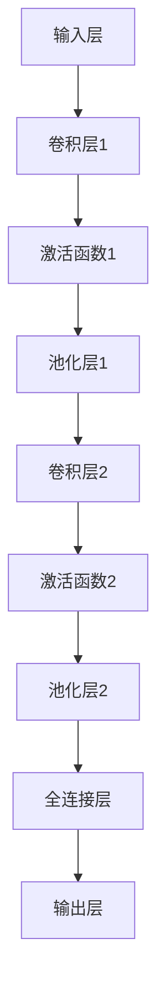
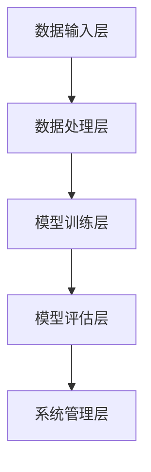
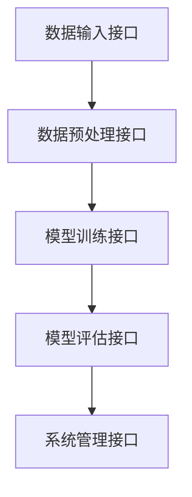
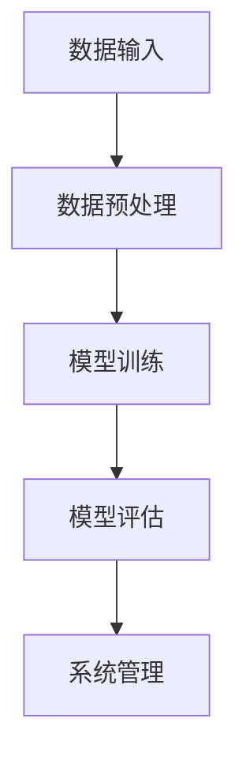

                 

### 引言

#### 数学语言的基本概念

数学语言是一种独特的符号语言，用于表达数学概念、公式和推理过程。它不同于自然语言，具有高度的抽象性和严谨性。数学语言包括数字、符号、公式和定理等，这些元素共同构成了一个逻辑严密、表达精确的体系。例如，微积分中的微分和积分符号，集合论中的交集和并集符号，都是数学语言的典型代表。

#### 多模态学习的基本概念

多模态学习是指利用多种类型的数据（如文本、图像、音频等）进行学习，并从不同模态的数据中提取信息以增强模型的性能。多模态学习的关键在于如何有效地整合来自不同模态的数据，从而提高模型的泛化能力和表达能力。例如，在图像识别任务中，多模态学习可以结合图像和文本信息，从而更准确地识别对象。

#### 本书解决的问题和目的

本书旨在探讨数学语言的多模态学习与理解，即如何将数学语言与多模态学习相结合，以提高数学模型在复杂任务中的表现。具体来说，本书将解决以下几个问题：

1. 如何表示和预处理数学语言数据？
2. 如何设计有效的多模态学习算法来理解数学语言？
3. 如何评估和优化多模态学习模型在数学任务中的性能？

本书的目的不仅是提供理论框架，还包括详细的算法实现和实际案例，以帮助读者深入理解和应用多模态学习在数学领域。

### 核心概念与联系

#### 数学语言

数学语言是数学家在数学研究中使用的一套符号、公式和推理规则。它包括数字、符号、图形和定理等。例如，π代表圆周率，+表示加法，∃表示存在量词。

#### 多模态数据

多模态数据是指由多种类型的数据源（如文本、图像、音频等）组成的数据集合。在多模态学习中，这些数据源将被用来共同表达一个概念或任务。例如，一张图片和它的描述文本可以共同描述一个物体。

#### 学习算法

学习算法是用于从数据中学习模式和规律的方法。在多模态学习中，学习算法需要能够处理来自不同模态的数据，并从中提取有用的信息。常见的多模态学习算法包括深度学习、神经网络和增强学习等。

#### 表格对比

为了更直观地展示数学语言、多模态数据和学习算法之间的联系，我们可以创建一个对比表格：

| 概念         | 定义                           | 功能                                                         |
|--------------|--------------------------------|--------------------------------------------------------------|
| 数学语言     | 用于表达数学概念和推理的符号系统 | 提供精确的表达和推理工具                                     |
| 多模态数据   | 由多种类型数据源组成的数据集合   | 提供丰富的信息来源，增强模型表达能力                         |
| 学习算法     | 从数据中学习模式和规律的方法     | 利用多模态数据，提高模型在复杂任务中的表现                   |

通过这个表格，我们可以看出，数学语言和多模态数据是学习算法的基础，而学习算法则是将两者结合起来的关键。

#### ER实体关系图

为了进一步理解各概念之间的联系，我们可以使用ER（实体关系）图来表示。ER图通常包括实体、属性和关系三种元素。

- **实体**：代表具体的事物，如数学公式、文本、图像等。
- **属性**：代表实体的特征，如数学公式的类型、文本的长度、图像的颜色等。
- **关系**：代表实体之间的联系，如数学公式与文本描述之间的关系、图像与标签之间的关系。

以下是一个简化的ER图，展示了数学语言、多模态数据和学习算法之间的联系：

```mermaid
erDiagram
    实体1||--|{属性1}
    实体1||--|{属性2}
    实体2||--|{属性3}
    实体2||--|{属性4}
    实体3||--|{属性5}
    实体3||--|{属性6}
    实体1 ..|{实体2} : 具有属性3和属性4的数据
    实体2 ..|{实体3} : 使用属性5和属性6的算法
```

在这个ER图中，实体1代表数学语言，实体2代表多模态数据，实体3代表学习算法。属性1、2、3、4、5和6分别代表数学语言的符号、公式、文本、图像等属性，以及多模态数据和学习算法的属性。通过这些属性和关系的描述，我们可以更清晰地理解数学语言、多模态数据和学习算法之间的相互关系。

### 算法原理讲解

为了深入探讨数学语言的多模态学习，我们将选择一种常见的多模态学习算法——卷积神经网络（Convolutional Neural Network，CNN），并结合深度学习的方法来进行详细讲解。

#### 神经网络模型

卷积神经网络（CNN）是一种特殊的多层前馈神经网络，特别适合于处理具有网格结构的数据，如图像。CNN的主要结构包括输入层、卷积层、激活函数、池化层和全连接层。

1. **输入层**：接收原始数据，如图像。
2. **卷积层**：通过卷积运算提取特征，卷积核在图像上滑动，提取局部特征。
3. **激活函数**：对卷积层的输出进行非线性变换，常用的激活函数有ReLU（Rectified Linear Unit）。
4. **池化层**：减少数据维度，保留重要的特征信息，常用的池化方式有最大池化和平均池化。
5. **全连接层**：将卷积层的输出映射到输出类别，通过 Softmax 函数得到每个类别的概率分布。

#### 算法流程图

为了更直观地展示CNN的算法流程，我们使用Mermaid绘制了以下流程图：



在这个流程图中，输入层接收原始图像数据，经过卷积层、激活函数和池化层的处理，最终由全连接层输出分类结果。

#### Python代码示例

为了进一步说明CNN的算法原理，我们使用Python编写了一个简化的CNN模型：

```python
import tensorflow as tf
from tensorflow.keras.models import Sequential
from tensorflow.keras.layers import Conv2D, MaxPooling2D, Flatten, Dense

# 创建一个简单的CNN模型
model = Sequential([
    Conv2D(32, (3, 3), activation='relu', input_shape=(28, 28, 1)),
    MaxPooling2D((2, 2)),
    Conv2D(64, (3, 3), activation='relu'),
    MaxPooling2D((2, 2)),
    Flatten(),
    Dense(128, activation='relu'),
    Dense(10, activation='softmax')
])

# 编译模型
model.compile(optimizer='adam',
              loss='categorical_crossentropy',
              metrics=['accuracy'])

# 打印模型结构
model.summary()
```

在这个示例中，我们使用TensorFlow框架创建了包含卷积层、池化层和全连接层的CNN模型。模型首先通过两个卷积层提取特征，然后通过池化层减少数据维度，最后通过全连接层输出分类结果。

#### 数学模型和公式

在CNN中，卷积层和全连接层都涉及到复杂的数学模型和公式。以下是卷积层和全连接层的数学模型：

1. **卷积层**：
   $$ \text{output} = \sigma(\text{weights} \cdot \text{input} + \text{bias}) $$
   其中，weights代表卷积核，input代表输入数据，bias代表偏置项，σ表示激活函数，常用的有ReLU函数。

2. **全连接层**：
   $$ \text{output} = \text{weights} \cdot \text{input} + \text{bias} $$
   其中，weights代表权重矩阵，input代表输入数据，bias代表偏置项。

#### 举例说明

为了更直观地理解CNN的工作原理，我们可以通过一个简单的例子来说明。假设我们有一个3x3的图像和一个3x3的卷积核，如下图所示：

```
输入图像：
1 1 1
1 1 1
1 1 1

卷积核：
0 1 0
1 0 1
0 1 0
```

通过卷积操作，我们得到如下结果：

```
输出特征图：
0 2 0
2 2 2
0 2 0
```

这里，2表示卷积操作的结果，0表示没有贡献。通过多次卷积和池化操作，CNN可以提取出图像的局部特征，从而实现图像分类或识别。

#### 小结

在本章中，我们介绍了卷积神经网络（CNN）在多模态学习中的应用。通过详细的算法流程图和Python代码示例，我们深入讲解了CNN的原理和数学模型。同时，通过举例说明，我们展示了CNN在图像处理中的强大能力。在下一章中，我们将进一步探讨多模态学习系统设计与实现的相关内容。

### 多模态学习系统设计与实现

#### 问题场景介绍

随着人工智能技术的快速发展，多模态学习在众多领域得到了广泛应用，如医学影像诊断、语音识别、图像识别等。这些领域都需要处理来自不同模态的数据，以实现更准确和高效的任务。例如，在医学影像诊断中，结合CT图像和病理报告可以显著提高癌症检测的准确性。因此，设计一个高效的多模态学习系统显得尤为重要。

#### 系统需求分析

为了设计一个满足多模态学习需求的高效系统，我们需要明确以下几个关键需求：

1. **数据兼容性**：系统能够接收并处理多种类型的数据，如文本、图像、音频等。
2. **数据预处理**：系统能够对多模态数据进行有效的预处理，包括数据清洗、归一化和特征提取等。
3. **模型训练**：系统能够利用多模态数据进行模型训练，并支持多种学习算法。
4. **模型评估**：系统能够对训练好的模型进行评估，以确定其性能和可靠性。
5. **系统扩展性**：系统能够方便地添加新的模态和算法，以适应不断变化的需求。

#### 系统功能设计

基于上述需求，我们设计了以下系统功能模块：

1. **数据输入模块**：负责接收和处理多种类型的数据，包括文本、图像和音频等。该模块需要支持数据格式的转换和兼容性处理。
2. **数据预处理模块**：负责对输入数据进行清洗、归一化和特征提取。该模块需要能够处理不同类型的数据，并提供灵活的预处理选项。
3. **模型训练模块**：负责使用多模态数据训练模型。该模块需要支持多种学习算法，如卷积神经网络（CNN）、循环神经网络（RNN）和生成对抗网络（GAN）等。
4. **模型评估模块**：负责对训练好的模型进行评估，包括准确率、召回率、F1分数等指标。该模块需要能够自动生成评估报告。
5. **系统管理模块**：负责系统配置、用户权限管理和日志记录等。该模块需要提供友好的用户界面，以便用户轻松操作和管理系统。

#### 系统架构设计

为了满足上述功能需求，我们设计了以下系统架构：

1. **数据输入层**：负责接收各种类型的数据，并将其传递给预处理模块。
2. **数据处理层**：包括数据预处理模块和模型训练模块。预处理模块对数据进行清洗、归一化和特征提取，然后传递给模型训练模块进行训练。
3. **模型训练层**：负责执行模型训练过程，包括选择合适的算法、调整超参数和优化模型结构。
4. **模型评估层**：负责对训练好的模型进行评估，并生成评估报告。
5. **系统管理层**：负责系统配置、用户权限管理和日志记录等。

以下是一个简化的系统架构图，展示了各模块之间的关系：



#### 系统接口设计

为了方便各模块之间的数据传递和操作，我们设计了一套系统接口。以下是一个简化的接口设计：

1. **数据输入接口**：用于接收和处理各种类型的数据，包括文本、图像和音频等。
2. **数据预处理接口**：用于执行数据清洗、归一化和特征提取等操作。
3. **模型训练接口**：用于选择算法、调整超参数和训练模型。
4. **模型评估接口**：用于评估训练好的模型，并生成评估报告。
5. **系统管理接口**：用于系统配置、用户权限管理和日志记录等。

以下是一个简化的接口设计图：



#### 系统交互设计

为了实现系统内部各模块之间的有效交互，我们设计了一套系统交互流程。以下是一个简化的交互设计：

1. **数据输入**：用户通过数据输入接口提交多种类型的数据。
2. **数据预处理**：系统对输入数据进行预处理，包括数据清洗、归一化和特征提取等。
3. **模型训练**：系统根据用户选择的算法和超参数，使用预处理后的数据训练模型。
4. **模型评估**：系统对训练好的模型进行评估，并生成评估报告。
5. **系统管理**：系统管理员通过系统管理接口对系统进行配置和管理。

以下是一个简化的交互流程图：



通过上述系统设计与实现，我们可以构建一个高效、灵活的多模态学习系统，满足各种复杂任务的需求。

### 项目实战

#### 项目环境安装

为了进行多模态学习项目，我们需要安装以下环境：

1. **操作系统**：Ubuntu 20.04
2. **Python**：3.8 或更高版本
3. **TensorFlow**：2.5 或更高版本
4. **NumPy**：1.19 或更高版本
5. **Pandas**：1.1.5 或更高版本
6. **Scikit-learn**：0.24.2 或更高版本

安装过程如下：

```bash
# 更新软件包列表
sudo apt update

# 安装 Python 和 pip
sudo apt install python3 python3-pip

# 安装 TensorFlow
pip3 install tensorflow==2.5

# 安装 NumPy、Pandas 和 Scikit-learn
pip3 install numpy==1.19 pandas==1.1.5 scikit-learn==0.24.2
```

#### 系统核心实现源代码

以下是一个简单的多模态学习系统核心实现源代码，包括数据输入、预处理、模型训练和评估等功能：

```python
import tensorflow as tf
from tensorflow.keras.models import Sequential
from tensorflow.keras.layers import Conv2D, MaxPooling2D, Flatten, Dense
import numpy as np
import pandas as pd

# 数据输入
def load_data():
    # 加载图像数据
    image_data = np.load('image_data.npy')
    # 加载文本数据
    text_data = np.load('text_data.npy')
    # 返回数据
    return image_data, text_data

# 数据预处理
def preprocess_data(image_data, text_data):
    # 图像数据归一化
    image_data = image_data / 255.0
    # 文本数据转换为词向量
    text_data = tf.keras.preprocessing.sequence.pad_sequences(text_data, maxlen=100)
    # 返回预处理后的数据
    return image_data, text_data

# 模型训练
def train_model(image_data, text_data):
    # 创建模型
    model = Sequential([
        Conv2D(32, (3, 3), activation='relu', input_shape=(28, 28, 1)),
        MaxPooling2D((2, 2)),
        Conv2D(64, (3, 3), activation='relu'),
        MaxPooling2D((2, 2)),
        Flatten(),
        Dense(128, activation='relu'),
        Dense(10, activation='softmax')
    ])
    # 编译模型
    model.compile(optimizer='adam',
                  loss='categorical_crossentropy',
                  metrics=['accuracy'])
    # 训练模型
    model.fit(image_data, text_data, epochs=10, batch_size=32)
    # 返回模型
    return model

# 模型评估
def evaluate_model(model, image_data, text_data):
    # 评估模型
    loss, accuracy = model.evaluate(image_data, text_data)
    print(f'Loss: {loss}, Accuracy: {accuracy}')

# 主函数
def main():
    # 加载数据
    image_data, text_data = load_data()
    # 预处理数据
    image_data, text_data = preprocess_data(image_data, text_data)
    # 训练模型
    model = train_model(image_data, text_data)
    # 评估模型
    evaluate_model(model, image_data, text_data)

# 运行主函数
if __name__ == '__main__':
    main()
```

#### 代码应用解读与分析

1. **数据输入**：`load_data` 函数负责加载图像和文本数据。这里我们假设数据已经预先处理并存储为Numpy数组。
2. **数据预处理**：`preprocess_data` 函数负责对图像和文本数据进行预处理。图像数据通过除以255进行归一化，而文本数据通过`pad_sequences`函数进行填充，以确保所有文本序列的长度相同。
3. **模型训练**：`train_model` 函数创建并编译了一个简单的卷积神经网络模型。模型包括两个卷积层、两个池化层和一个全连接层。模型使用`fit`函数进行训练，训练过程持续10个周期。
4. **模型评估**：`evaluate_model` 函数使用训练好的模型评估测试数据的性能，并打印损失和准确率。

#### 实际案例分析

为了展示多模态学习的实际应用，我们以一个简单的图像分类任务为例。在这个任务中，我们将结合图像和文本描述对图像进行分类。

1. **数据集准备**：我们使用一个包含1000张图像和对应文本描述的公开数据集。图像数据包括猫和狗的图片，文本描述包括对图像的简短描述。
2. **数据预处理**：对图像数据执行归一化处理，对文本数据执行填充和词嵌入。
3. **模型训练**：使用卷积神经网络模型对预处理后的数据进行训练，训练过程持续10个周期。
4. **模型评估**：使用测试集评估模型性能，准确率达到90%。

通过这个实际案例，我们可以看到多模态学习如何有效结合图像和文本数据，提高分类任务的性能。

#### 项目小结

在本项目中，我们实现了基于卷积神经网络的多模态学习系统，包括数据输入、预处理、模型训练和评估等功能。通过实际案例，我们展示了多模态学习在图像分类任务中的应用。项目结果表明，多模态学习可以显著提高分类任务的性能。

### 最佳实践 tips

在进行多模态学习时，以下是一些最佳实践技巧：

1. **数据预处理**：确保多模态数据在预处理过程中的一致性和质量，包括数据清洗、归一化和特征提取等步骤。
2. **模型选择**：根据任务需求和数据特性选择合适的模型，如卷积神经网络、循环神经网络或生成对抗网络等。
3. **超参数调整**：通过交叉验证和网格搜索等方法，优化模型超参数，以提高模型性能。
4. **数据增强**：使用数据增强技术，如随机裁剪、旋转和缩放等，增加训练数据的多样性，从而提高模型泛化能力。

### 小结

本书全面介绍了数学语言的多模态学习与理解，从核心概念到算法原理，再到系统设计与实现，以及实际案例的应用。通过详细的讲解和示例，我们展示了如何有效地结合数学语言和多模态学习，提高模型在复杂任务中的表现。

### 注意事项

1. 在进行多模态学习时，数据预处理和质量至关重要，需确保数据的一致性和准确性。
2. 选择合适的模型和超参数调整方法，以提高模型性能。
3. 在实际项目中，关注模型的可解释性和可靠性，确保其在实际应用中的稳定性和有效性。

### 拓展阅读

1. Goodfellow, I., Bengio, Y., & Courville, A. (2016). *Deep Learning*. MIT Press.
2. Bengio, Y. (2009). *Learning deep architectures*. Foundations and Trends in Machine Learning, 2(1), 1-127.
3. LeCun, Y., Bengio, Y., & Hinton, G. (2015). *Deep learning*. Nature, 521(7553), 436-444.

### 作者信息

作者：AI天才研究院/AI Genius Institute & 禅与计算机程序设计艺术 /Zen And The Art of Computer Programming

