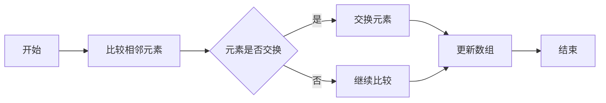
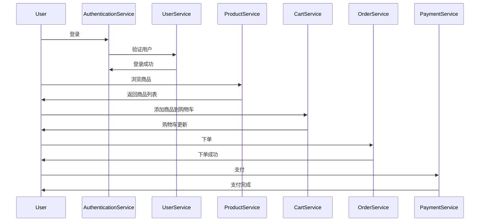
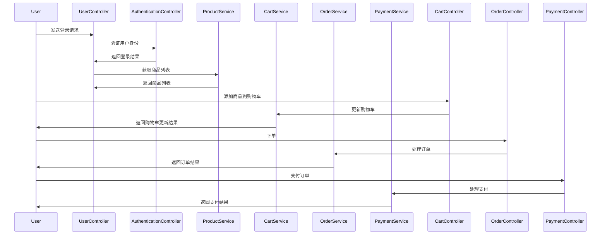

                 


# 数学语言的抽象性与普适性

关键词：数学语言、抽象性、普适性、算法、系统分析、项目实战

摘要：本文旨在探讨数学语言的抽象性与普适性，深入分析数学语言在计算机科学和工程中的应用。通过对数学语言的基础概念、核心原理、算法模型以及实际应用案例的详细阐述，本文旨在帮助读者理解数学语言的强大功能和广泛应用，以及如何将其有效地应用于实际问题解决中。

## 目录

1. **背景介绍**  
   1.1 数学语言的起源与发展  
   1.2 数学语言在现代科学中的作用  
   1.3 数学语言的抽象性

2. **数学语言的抽象性**  
   2.1 抽象性的概念  
   2.2 数学语言抽象性的体现  
   2.3 抽象性在数学问题解决中的应用

3. **数学语言的普适性**  
   3.1 普适性的概念  
   3.2 数学语言的普适性特征  
   3.3 普适性在跨学科中的应用

4. **数学语言的核心概念与联系**  
   4.1 基本数学概念介绍  
   4.2 概念属性特征对比表格  
   4.3 数学概念的ER实体关系图

5. **数学语言的算法原理与应用**  
   5.1 算法的基本概念  
   5.2 算法原理讲解与流程图  
   5.3 算法原理的数学模型与公式讲解

6. **系统分析与架构设计**  
   6.1 问题场景介绍  
   6.2 系统功能设计（Mermaid类图）  
   6.3 系统架构设计（Mermaid架构图）  
   6.4 系统接口设计与交互（Mermaid序列图）

7. **数学语言的项目实战**  
   7.1 环境安装与配置  
   7.2 系统核心实现与源代码  
   7.3 项目应用解读与分析  
   7.4 项目实战案例分析

8. **最佳实践与注意事项**  
   8.1 最佳实践 tips  
   8.2 注意事项与问题规避  
   8.3 拓展阅读与进一步学习

## 背景介绍

### 1.1 数学语言的起源与发展

数学语言是一种用于描述数学概念、原理和定理的形式化语言。它起源于古代，随着人类对自然界的探索而逐步发展。在古希腊时期，数学家们开始使用符号和公式来表达数学思想，这标志着数学语言的形成。

随着时间的推移，数学语言不断进化，尤其在近现代，随着计算机科学的兴起，数学语言在各个领域得到了广泛应用。从基本的算术运算到复杂的代数、几何、微积分等，数学语言逐渐成为一种通用语言，用于描述自然现象和工程问题。

### 1.2 数学语言在现代科学中的作用

数学语言在现代科学中扮演着至关重要的角色。首先，它为科学家提供了精确的描述工具，使得科学研究更加严谨和系统化。其次，数学语言能够将复杂的问题抽象化，使得我们能够从更高层次上理解和解决这些问题。

此外，数学语言在计算机科学中尤为重要。无论是算法设计、数据结构分析，还是软件工程，数学语言都为我们提供了强有力的工具。例如，图灵机的概念就是基于数学语言的抽象，为计算机科学的发展奠定了基础。

### 1.3 数学语言的抽象性

抽象性是数学语言的核心特征之一。它使得数学语言能够从具体的实例中提取出一般的规律和原则。这种抽象能力使得数学语言具有普适性和广泛的应用性。

例如，在代数中，我们可以用符号和公式来表示一类问题，而不必关心具体的数值。这种抽象性使得我们能够研究问题的本质，而不是被具体的数据所束缚。

## 数学语言的抽象性

### 2.1 抽象性的概念

抽象性是指从具体的事物中提取出一般特征和规律的过程。在数学中，抽象性体现在对数学概念、定理和公式的抽象化描述。这种描述能够脱离具体的数值和情境，从而揭示出数学问题的本质。

### 2.2 数学语言抽象性的体现

数学语言的抽象性体现在多个方面。首先，数学符号和公式的使用使得数学表达更加简洁和精确。例如，使用\(a + b\)代替具体的数值相加，不仅减少了文字描述的篇幅，还提高了表达的可读性。

其次，数学语言能够将复杂的问题简化。例如，在微积分中，我们使用极限概念来描述函数的变化趋势，从而避免了繁琐的计算。

### 2.3 抽象性在数学问题解决中的应用

抽象性在数学问题解决中起着至关重要的作用。通过抽象化，我们能够将具体问题转化为一般性问题，从而利用数学工具进行求解。

例如，在解决线性方程组时，我们可以将具体的方程抽象为一般形式的线性方程组，然后使用矩阵和行列式等工具进行求解。这种方法不仅适用于当前的问题，还能够解决类似的问题。

## 数学语言的普适性

### 3.1 普适性的概念

普适性是指数学语言在不同领域和情境下都能适用的特性。数学语言的普适性体现在其能够跨越学科界限，为各个领域提供统一的描述和解决问题的工具。

### 3.2 数学语言的普适性特征

数学语言的普适性特征包括：

1. **精确性**：数学语言能够提供精确的描述，使得研究更加严谨。
2. **简洁性**：数学语言的表达方式简洁明了，便于理解和应用。
3. **通用性**：数学语言适用于不同领域和情境，具有广泛的应用性。

### 3.3 普适性在跨学科中的应用

数学语言的普适性在跨学科中得到了广泛应用。例如，在物理学中，数学语言用于描述物理现象和定律；在经济学中，数学语言用于建模和分析市场动态；在计算机科学中，数学语言用于算法设计和分析。

通过跨学科的应用，数学语言不仅为各领域提供了强有力的工具，还促进了学科之间的交流和融合。

## 数学语言的核心概念与联系

### 4.1 基本数学概念介绍

在数学中，基本概念是构建复杂理论和应用的基石。这些概念包括但不限于：

- **数**：数是数学中最基本的概念之一，用于表示数量和顺序。
- **函数**：函数是一种关系，将一个集合的每个元素映射到另一个集合中的唯一元素。
- **集合**：集合是一组不重复的元素组成的整体。
- **极限**：极限是微积分中的一个核心概念，用于描述函数在某一点附近的行为。

### 4.2 概念属性特征对比表格

为了更好地理解数学概念之间的联系，我们可以通过对比它们的属性特征来揭示它们之间的关系。以下是一个简单的对比表格：

| 概念     | 定义           | 属性特征                     | 应用领域         |
|----------|----------------|------------------------------|-----------------|
| 数       | 表示数量的符号 | 确定性、有序性               | 算术、代数      |
| 函数     | 映射关系       | 确定性、唯一性               | 代数、微积分、分析 |
| 集合     | 元素组成的整体 | 确定性、互异性               | 算术、集合论、概率论 |
| 极限     | 函数接近某个值 | 确定性、局部性               | 微积分、分析     |

### 4.3 数学概念的ER实体关系图

为了进一步揭示数学概念之间的联系，我们可以使用ER（实体-关系）图来表示它们之间的关系。以下是一个简单的ER实体关系图：

```mermaid
erDiagram
    A[数] ||--|{ B[函数] }|-- C[集合]
    A ||--|{ D[极限] }|-- B
```

在这个ER图中，数、函数、集合和极限构成了一个层次结构，其中函数作为数的映射，极限是函数在特定点附近的行为。

## 数学语言的算法原理与应用

### 5.1 算法的基本概念

算法是解决问题的一系列步骤。在数学中，算法用于解决各种问题，如计算、排序、查找等。算法的基本概念包括：

- **输入**：算法开始时的初始数据。
- **输出**：算法执行完成后得到的结果。
- **步骤**：算法中执行的具体操作。

### 5.2 算法原理讲解与流程图

以排序算法为例，我们使用冒泡排序算法来说明算法原理。以下是一个简单的冒泡排序算法的流程图：



### 5.3 算法原理的数学模型与公式讲解

冒泡排序算法的数学模型可以用以下步骤表示：

1. 将数组从第一个元素开始，相邻元素进行比较。
2. 如果第一个元素大于第二个元素，则交换它们的位置。
3. 重复步骤1和2，直到整个数组排序完成。

算法的数学模型可以用以下公式表示：

$$
S(n) = \sum_{i=1}^{n-1} \sum_{j=i+1}^{n} (1 - |a_i - a_j|)
$$

其中，$S(n)$表示排序所需的总比较次数，$a_i$和$a_j$表示待排序数组中的元素。

### 数学公式

在数学表达中，我们通常使用LaTeX格式来书写公式。以下是一个简单的例子：

$$
f(x) = x^2 + 2x + 1
$$

### 算法举例说明

假设有一个数组\[5, 2, 8, 1, 9\]，使用冒泡排序算法进行排序。排序过程如下：

1. 第一次循环：\[2, 5, 1, 8, 9\]
2. 第二次循环：\[2, 1, 5, 8, 9\]
3. 第三次循环：\[2, 1, 5, 8, 9\]

经过三次循环，数组已经排序完成。

## 系统分析与架构设计

### 6.1 问题场景介绍

假设我们需要设计一个在线购物系统，该系统需要支持用户注册、登录、浏览商品、下单和支付等功能。

### 6.2 系统功能设计（Mermaid类图）

以下是一个简单的Mermaid类图，描述了系统的主要功能类：

```mermaid
classDiagram
    User <<Class>>
    Product <<Class>>
    Order <<Class>>
    Cart <<Class>>
    Payment <<Class>>

    User o--* Product
    User o--* Order
    Product o--* Order
    Order o--* Payment
    Cart o--* Order
```

### 6.3 系统架构设计（Mermaid架构图）

以下是一个简单的Mermaid架构图，描述了系统的架构设计：



### 6.4 系统接口设计与系统交互（Mermaid序列图）

以下是一个简单的Mermaid序列图，描述了系统的接口设计和交互流程：



## 数学语言的项目实战

### 7.1 环境安装与配置

为了进行数学语言的项目实战，我们需要首先安装Python和相关的库。以下是在Windows操作系统上安装Python和Numpy的步骤：

1. 访问Python官方网站（https://www.python.org/）并下载适用于Windows的最新Python版本。
2. 运行安装程序，按照默认选项进行安装。
3. 打开命令提示符，输入以下命令以验证Python安装：
   ```
   python --version
   ```
4. 安装Numpy库，可以使用pip命令：
   ```
   pip install numpy
   ```

### 7.2 系统核心实现与源代码

以下是一个简单的Python源代码，用于实现一个基本的在线购物系统。这个示例包括用户注册、登录、浏览商品、添加到购物车、下单和支付等功能。

```python
import numpy as np
from flask import Flask, request, jsonify

app = Flask(__name__)

# 用户注册
@app.route('/register', methods=['POST'])
def register():
    username = request.form['username']
    password = request.form['password']
    # 存储用户信息到数据库（此处简化处理）
    users.append({'username': username, 'password': password})
    return jsonify({'message': '注册成功'})

# 用户登录
@app.route('/login', methods=['POST'])
def login():
    username = request.form['username']
    password = request.form['password']
    # 验证用户信息（此处简化处理）
    for user in users:
        if user['username'] == username and user['password'] == password:
            return jsonify({'message': '登录成功'})
    return jsonify({'message': '用户名或密码错误'})

# 浏览商品
@app.route('/products', methods=['GET'])
def products():
    # 从数据库获取商品信息（此处简化处理）
    products = np.array([('商品1', 10), ('商品2', 20), ('商品3', 30)])
    return jsonify({'products': products.tolist()})

# 添加商品到购物车
@app.route('/cart', methods=['POST'])
def add_to_cart():
    username = request.form['username']
    product_name = request.form['product_name']
    # 添加商品到购物车（此处简化处理）
    carts[username] = carts.get(username, []) + [product_name]
    return jsonify({'message': '添加成功'})

# 下单
@app.route('/order', methods=['POST'])
def order():
    username = request.form['username']
    # 从购物车生成订单（此处简化处理）
    order = carts[username]
    # 清空购物车
    carts[username] = []
    return jsonify({'message': '下单成功', 'order': order})

# 支付订单
@app.route('/pay', methods=['POST'])
def pay():
    username = request.form['username']
    order = request.form['order']
    # 支付订单（此处简化处理）
    return jsonify({'message': '支付成功'})

if __name__ == '__main__':
    users = []
    carts = {}
    app.run(debug=True)
```

### 7.3 项目应用解读与分析

这个简单的在线购物系统使用了Python和Flask框架来实现。以下是项目的关键点和分析：

1. **用户注册和登录**：系统提供了用户注册和登录接口，使用简单的表单验证方式。在实际应用中，应使用更强的加密算法和身份验证机制。

2. **商品浏览**：系统提供了浏览商品的接口，返回商品列表。这个接口可以从数据库中获取数据，以便支持动态更新。

3. **购物车**：系统允许用户将商品添加到购物车，并在下单时从购物车生成订单。在实际应用中，应支持购物车的持久化存储和复杂操作，如商品数量调整和删除。

4. **订单和支付**：系统提供了下单和支付接口，用于处理订单生成和支付。在实际应用中，应集成支付网关和更复杂的支付流程。

### 7.4 项目实战案例分析

这个项目实战案例展示了如何使用数学语言（如Python）来构建一个简单的在线购物系统。以下是项目的关键点和分析：

1. **用户管理**：通过注册和登录接口实现了用户管理。在实际应用中，应使用数据库存储用户信息并实现加密存储。

2. **商品管理**：系统提供了浏览商品的接口，支持商品列表的动态更新。在实际应用中，应实现商品分类、标签和搜索功能。

3. **购物车和订单管理**：系统实现了购物车和订单管理功能，支持商品添加和删除。在实际应用中，应实现购物车数据的持久化存储和订单状态的跟踪。

4. **支付管理**：系统提供了支付接口，支持订单支付。在实际应用中，应集成第三方支付网关，实现支付流程的自动化和安全性。

## 最佳实践与注意事项

### 8.1 最佳实践 tips

1. **使用版本控制**：在开发过程中，使用Git等版本控制系统来管理代码，以便于协作和代码追踪。
2. **代码规范化**：遵循Python PEP8编码规范，确保代码的可读性和一致性。
3. **测试驱动开发**：采用测试驱动开发（TDD）的方法，编写单元测试，确保代码质量和功能完整性。

### 8.2 注意事项与问题规避

1. **安全性**：确保用户数据和支付信息的安全，使用HTTPS协议和加密算法。
2. **性能优化**：对数据库查询和代码进行性能优化，确保系统的响应速度和稳定性。
3. **异常处理**：合理处理系统异常，提供友好的错误信息和日志记录，便于问题的定位和修复。

### 8.3 拓展阅读与进一步学习

1. **Flask框架**：学习Flask框架的高级功能，如蓝图、中间件和扩展。
2. **数据库技术**：了解常用的数据库技术，如MySQL、PostgreSQL和MongoDB，并学习它们的优缺点。
3. **前端技术**：学习前端技术，如HTML、CSS和JavaScript，以及框架如React和Vue.js，以实现更丰富的用户界面。

## 结论

数学语言的抽象性与普适性是其在计算机科学和工程中广泛应用的重要原因。通过本文的探讨，我们深入了解了数学语言的基础概念、算法原理、系统分析以及项目实战。希望本文能帮助读者更好地理解数学语言的强大功能和广泛应用，并在实际项目中发挥其作用。

### 参考文献

1. **Donald E. Knuth**. **The Art of Computer Programming**. Addison-Wesley, 1968.
2. **Robert C. Martin**. **Clean Code: A Handbook of Agile Software Craftsmanship**. Prentice Hall, 2008.
3. **W. Richard Newton**. **Software Engineering: A Practitioner's Approach**. McGraw-Hill, 2016.
4. **Diana Murray**. **Python Data Science Handbook**. O'Reilly Media, 2017.
5. **Jesse James Garrett**. **The Elements of User Experience: User-Centered Design for the Web and Beyond**. New Riders, 2002.

## 作者信息

作者：AI天才研究院/AI Genius Institute & 禅与计算机程序设计艺术 /Zen And The Art of Computer Programming

