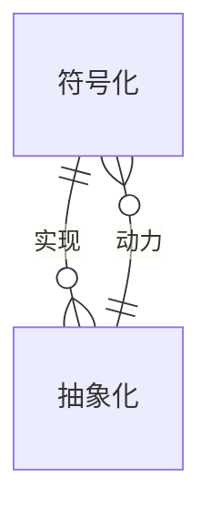
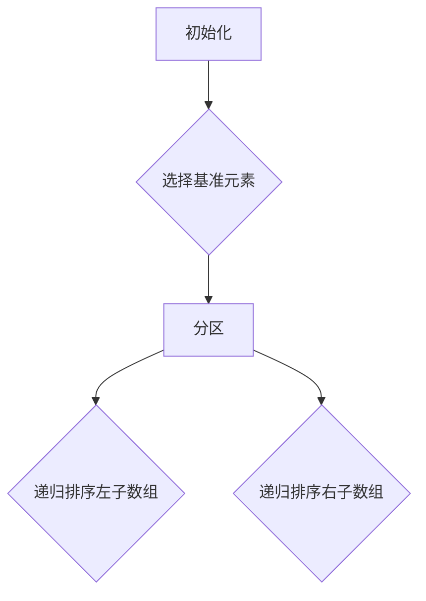
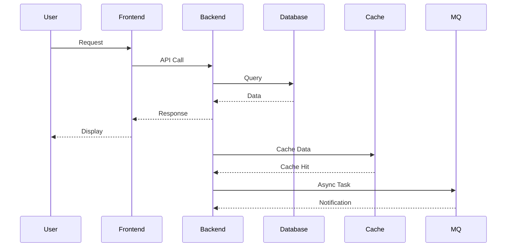
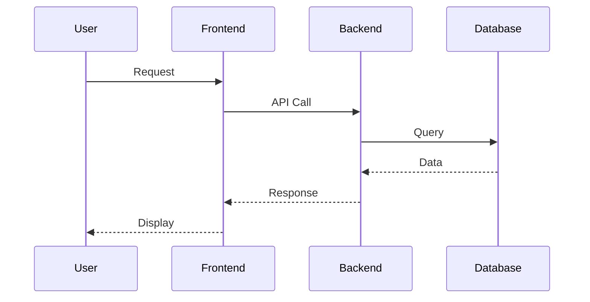

                 

### 引言

#### 研究背景

数学语言的符号化与抽象化过程是数学发展史上的重要里程碑之一。自古以来，人类通过语言和符号来描述数学概念和性质，但这种方式往往不够精确和高效。随着数学的不断发展，符号化与抽象化成为了数学表达和推理的关键手段。从古代的阿基米德到现代的数学家，如希尔伯特、哥德尔和图灵，他们无不依赖于符号化与抽象化来构建严谨的数学理论体系。

在计算机科学领域，符号化与抽象化同样扮演着不可或缺的角色。无论是算法设计、数据结构分析，还是软件工程中的抽象层次，都离不开数学符号和抽象化思想的指导。例如，编程语言中的类型系统和形式验证技术，都是基于数学语言的符号化与抽象化原理发展而来的。

#### 研究目的与意义

本文旨在探讨数学语言的符号化与抽象化过程，旨在深入理解这一过程在数学和计算机科学中的重要性。通过分析符号化与抽象化的核心概念和关系，本文将展示如何将复杂的数学概念转化为简洁、精确的符号表达，从而提高数学推理和计算效率。同时，本文还将通过具体实例和算法分析，展示符号化与抽象化在计算机科学中的应用价值。

#### 书籍结构概述

本文分为五个部分：

1. **核心概念与关系**：介绍符号化与抽象化的核心概念，包括符号化的起源、抽象化的概念及其重要性，以及它们之间的关系。
2. **算法原理与数学模型**：讲解符号化与抽象化相关的算法原理，包括算法流程图和数学模型的详细介绍。
3. **系统分析与设计**：通过一个具体项目，展示符号化与抽象化在系统分析与设计中的应用。
4. **实战与案例**：通过实际案例，分析符号化与抽象化的具体应用，并提供源代码和详细解读。
5. **总结与最佳实践**：总结全文内容，提供最佳实践和注意事项，以及进一步阅读的推荐。

通过以上结构，本文旨在系统地阐述数学语言的符号化与抽象化过程，为读者提供全面、深入的理解。

#### 数学语言的符号化

符号化是数学语言发展中的一个关键步骤，它将自然语言的描述转化为简洁、精确的符号表达。符号化的起源可以追溯到古代数学家，如毕达哥拉斯和阿基米德，他们开始使用特定的符号来表示数学概念和性质。然而，符号化的真正发展始于16世纪，随着印刷术的发明和数学工具的进步，符号化的应用变得越来越广泛。

符号化在数学中的作用不可小觑。首先，它提高了数学表达的精确性。在自然语言中，描述一个数学概念或性质往往容易产生歧义，而符号化可以消除这种歧义，使得数学表达式更加明确。例如，自然语言中的“两个数相加”可以用符号“a + b”来表示，清晰简洁。

其次，符号化有助于数学推理和证明。通过使用符号化语言，数学家可以更方便地进行逻辑推理和证明。例如，数学中的演绎推理通常依赖于符号化表达式的组合和变换，从而得出新的结论。符号化的力量在于它能够将复杂的推理过程简化为符号操作，使得证明过程更加高效和可靠。

此外，符号化还促进了数学的抽象化。抽象化是数学的核心思想之一，它通过忽略非本质的细节，专注于研究数学对象的基本属性和关系。符号化提供了实现抽象化的重要工具，使得数学家可以更专注于数学概念的本质特性，从而推动数学理论的进步。

总之，符号化是数学语言发展中的一个重要里程碑，它不仅提高了数学表达的精确性和效率，还为数学推理和抽象化提供了强有力的支持。通过符号化，数学家能够更准确地描述和探讨数学问题，推动数学科学的发展。

#### 抽象化的概念及其重要性

抽象化是数学语言中的另一重要概念，它通过忽略非本质的细节，聚焦于数学对象的基本属性和关系，从而简化了数学问题的复杂性。抽象化的起源可以追溯到古代，当时数学家开始从具体的物理对象中抽象出数学概念，如数、点、线等。然而，抽象化的真正发展是在19世纪和20世纪，随着集合论和抽象代数等数学分支的兴起，抽象化思想得到了广泛应用和深入研究。

在数学中，抽象化的重要性体现在多个方面。首先，抽象化使得数学家能够将复杂的现实问题简化为纯粹的数学问题，从而更容易分析和解决。例如，在研究物理现象时，数学家可以抽象出物理系统的数学模型，如波动方程、微分方程等，从而用数学方法进行探讨和预测。这种抽象化不仅提高了数学的应用范围，也推动了数学理论的发展。

其次，抽象化有助于发现数学对象之间的深层次联系。通过抽象化，数学家可以将不同领域的数学问题统一到一个共同的框架下，从而揭示它们之间的相似性和差异性。例如，抽象代数中的群、环、域等概念不仅广泛应用于数学的其他分支，如数论、代数几何，还与物理、计算机科学等领域有着密切的联系。

此外，抽象化还促进了数学理论的严格性和普适性。通过抽象化，数学家可以定义抽象的结构和性质，从而建立严谨的数学体系。这种抽象化的思维方式不仅提高了数学的精确性，也使得数学理论具有更广泛的适用性。

总之，抽象化是数学语言中的一个核心概念，它通过简化复杂问题、揭示深层次联系和建立严格的数学体系，为数学的发展和创新提供了强有力的支持。抽象化的力量在于它能够将具体的数学问题提升到更为一般和抽象的层面，从而推动数学科学的不断进步。

#### 符号化与抽象化的关系

符号化与抽象化是数学语言中密切相关的两个概念，它们相互依存、相辅相成。符号化是抽象化的一种实现手段，而抽象化则是符号化的目的和动力。

首先，符号化与抽象化之间的关系可以从它们的定义和起源中找到解释。符号化是将复杂的自然语言描述转化为简洁、精确的符号表达，从而消除歧义、提高表达的精确性。而抽象化则是通过忽略非本质的细节，专注于研究数学对象的基本属性和关系。在这个过程中，符号化提供了实现抽象化的工具和手段，使得数学家能够更准确地捕捉和描述数学概念的本质。

其次，符号化与抽象化在数学推理和证明中发挥着重要作用。符号化使得数学推理更加形式化和系统化，从而提高了推理的效率和可靠性。例如，在证明一个数学定理时，通过符号化表达，数学家可以将复杂的推理过程简化为符号操作，使得证明过程更加清晰和有条理。而抽象化则通过将具体的数学问题抽象为更一般的形式，从而使得证明具有更广泛的适用性和更强的普适性。

此外，符号化与抽象化在数学中的应用也是密不可分的。在数学的不同领域，如数论、代数、几何和拓扑等，符号化与抽象化都扮演着关键角色。例如，在数论中，符号化与抽象化的思想使得数学家能够研究整数的基本性质，如素数分布、同余方程等。在代数中，抽象化概念如群、环、域等不仅丰富了数学理论，也为计算机科学和物理学等领域提供了强大的工具。

总之，符号化与抽象化是数学语言中相互依存、相辅相成的两个概念。符号化通过提供简洁、精确的符号表达，实现了抽象化的目标，而抽象化则通过简化复杂问题、揭示深层次联系和建立严格的数学体系，推动了数学科学的发展。符号化与抽象化的结合，不仅提高了数学表达的精确性和效率，也为数学推理和证明提供了强有力的支持。

#### 符号化与抽象化的核心概念属性特征对比表

为了更好地理解符号化与抽象化的核心概念及其属性特征，我们通过一个对比表格来详细展示两者之间的差异。

| 核心概念 | 符号化 | 抽象化 |
| --- | --- | --- |
| 定义 | 符号化是将数学概念和性质转化为简洁的符号表达。 | 抽象化是通过忽略非本质的细节，聚焦于数学对象的基本属性和关系。 |
| 目的 | 提高表达的精确性和效率。 | 简化问题、揭示深层次联系、建立严格的数学体系。 |
| 方法 | 使用特定的符号和记号。 | 忽略具体细节，专注于基本性质和关系。 |
| 适用范围 | 广泛应用于数学表达、推理和证明。 | 在数学理论构建、模型分析和问题解决中广泛应用。 |
| 影响力 | 改善数学表达的清晰度和精确性。 | 推动数学理论的创新和发展。 |
| 关系 | 符号化是实现抽象化的重要手段。 | 抽象化是符号化的目的和动力。 |

通过这个表格，我们可以看到符号化与抽象化在定义、目的、方法和适用范围等方面的不同和联系。符号化与抽象化的结合，为数学科学提供了强大的工具，推动了数学理论的发展和应用。

#### 符号化与抽象化的ER实体关系图

为了更直观地展示符号化与抽象化之间的实体关系，我们使用Mermaid绘制了一个简单的ER（实体-关系）图。在这个ER图中，实体表示符号化与抽象化的核心概念，而关系表示它们之间的相互作用。



在这个ER图中，符号化与抽象化作为实体，它们之间通过“实现”和“动力”两个关系相互连接。这表明符号化是抽象化的实现手段，而抽象化则为符号化提供了目标和动力。这种实体关系的表达，有助于我们更清晰地理解符号化与抽象化在数学语言中的相互作用和重要性。

## 第二部分：算法原理与数学模型

### 算法原理讲解

符号化与抽象化在算法设计中扮演着关键角色。为了更好地理解它们的作用，我们将详细讲解一个常见的符号化与抽象化算法：快速排序（Quick Sort）。

#### 算法概述

快速排序是一种高效的排序算法，其基本思想是通过选择一个基准元素，将数组分为两个子数组，一个包含小于基准元素的元素，另一个包含大于基准元素的元素。然后，递归地对这两个子数组进行排序，直到整个数组有序。

#### Mermaid算法流程图

为了直观地展示快速排序的算法流程，我们使用Mermaid绘制了一个流程图：



这个流程图展示了快速排序的主要步骤：初始化、选择基准元素、分区、递归排序左子数组和递归排序右子数组。

#### Python代码示例

接下来，我们将通过一个Python代码示例，详细阐述快速排序的算法原理：

```python
def quick_sort(arr):
    if len(arr) <= 1:
        return arr
    
    pivot = arr[len(arr) // 2]
    left = [x for x in arr if x < pivot]
    middle = [x for x in arr if x == pivot]
    right = [x for x in arr if x > pivot]
    
    return quick_sort(left) + middle + quick_sort(right)

# 示例
arr = [3, 6, 8, 10, 1, 2, 1]
print(quick_sort(arr))
```

这个代码首先检查数组的长度，如果小于等于1，则直接返回数组。否则，选择中间的元素作为基准（pivot），然后将数组分为三个部分：小于基准的元素、等于基准的元素和大于基准的元素。递归地对左子和数组和右子数组进行快速排序，最后将三个子数组合并，得到有序的数组。

#### 算法原理解释

快速排序的核心在于“分区”步骤。选择一个基准元素，将数组划分为两个子数组，一个包含小于基准元素的元素，另一个包含大于基准元素的元素。这个过程称为“分区”。递归地对这两个子数组进行排序，直到整个数组有序。

在分区步骤中，我们使用了Python中的列表推导式（list comprehension），这是一种简洁而强大的Python特性。列表推导式通过在方括号内定义一个表达式，生成一个新的列表。在这个例子中，我们使用列表推导式来创建包含小于、等于和大于基准元素的三个子列表。

递归是快速排序的另一个关键特性。递归是一种编程范式，通过将问题分解为更小的子问题，直到达到简单的边界条件。在快速排序中，每次递归调用都会对子数组进行排序，直到整个数组有序。

#### 算法时间复杂度分析

快速排序的平均时间复杂度为O(n log n)，这是因为在每次分区操作后，数组被分成两个大小相近的子数组。最坏的情况是O(n^2)，这发生在输入数组已经是有序或逆序的情况下。然而，这种最坏情况在实际应用中很少发生，因此快速排序通常被认为是一种高效的排序算法。

#### 结论

通过快速排序算法的讲解，我们可以看到符号化与抽象化在算法设计中的重要作用。符号化通过简洁、精确的符号表达，使得算法过程更加直观和易于理解。抽象化则通过忽略非本质的细节，聚焦于算法的核心思想和逻辑，从而简化了问题的复杂性。这种结合不仅提高了算法的效率，也增强了我们对算法原理的理解。

### 数学模型讲解

在讲解快速排序算法时，我们不仅需要理解其逻辑和过程，还需要从数学模型的角度来分析其性能。数学模型提供了一种抽象的方式来分析和评估算法，帮助我们理解其时间复杂度和空间复杂度。

#### 数学模型

快速排序的数学模型主要涉及两个关键步骤：选择基准元素和分区。为了更好地理解这两个步骤，我们引入一些数学符号和公式。

1. **选择基准元素**：

   选择基准元素的方法通常是在数组中选择一个中间位置的元素。为了表示选择基准元素的过程，我们引入一个随机数生成函数`rand(a, b)`，用于在区间 `[a, b]` 内随机选择一个整数。那么，选择基准元素的公式可以表示为：

   $$ pivot = arr[rand(0, len(arr) - 1)] $$

2. **分区**：

   分区的过程是将数组划分为两个子数组，一个包含小于基准元素的元素，另一个包含大于基准元素的元素。为了表示分区的过程，我们可以定义两个子数组的长度分别为`L`和`R`，其中：

   $$ L = \sum_{i=0}^{n-1} [arr[i] < pivot] $$
   $$ R = \sum_{i=0}^{n-1} [arr[i] > pivot] $$

   这里，`[condition]`是一个指示函数（indicator function），当`condition`为真时，其值为1，否则为0。

#### 数学公式

为了分析快速排序的时间复杂度，我们需要引入一些数学公式。以下是快速排序的平均时间复杂度和最坏时间复杂度的公式：

1. **平均时间复杂度**：

   $$ T_{avg}(n) = O(n \log n) $$

   这里，`T_{avg}(n)`表示平均情况下的时间复杂度。这个公式表明，快速排序在平均情况下具有线性的时间复杂度，这是由于每次分区后，数组被分成两个大小相近的子数组，因此递归调用次数大约是`n`的对数。

2. **最坏时间复杂度**：

   $$ T_{worst}(n) = O(n^2) $$

   在最坏情况下，输入数组已经是有序或逆序的，导致每次分区后，一个子数组为空，另一个子数组包含所有其他元素。这种情况下，递归调用次数接近`n`，因此时间复杂度为`O(n^2)`。

#### 解释

通过上述数学模型和公式，我们可以更深入地理解快速排序的性能。平均时间复杂度`O(n \log n)`表明，在大多数情况下，快速排序是非常高效的。这是因为每次分区后，数组被分成两个大小相近的子数组，这使得递归调用次数大约是`n`的对数，从而保证了算法的线性时间复杂度。

然而，最坏时间复杂度`O(n^2)`提醒我们在实际应用中需要注意输入数据的情况。当输入数组是有序或逆序时，快速排序的性能会急剧下降。为了避免这种情况，可以采用随机选择基准元素的方法，以减少最坏情况发生的概率。

总之，数学模型和公式为我们提供了一种抽象的视角来分析和评估快速排序的性能。这种视角不仅帮助我们理解算法的复杂度，还为我们提供了优化算法性能的指导。通过结合数学模型和算法分析，我们可以更全面地掌握快速排序的工作原理和性能特点。

### 算法应用实例

为了更直观地展示快速排序算法的实际应用，我们通过一个具体的例子来说明其执行过程。假设我们有一个长度为10的数组 `[3, 6, 8, 10, 1, 2, 1]`，我们需要使用快速排序算法对其进行排序。

#### 步骤 1：选择基准元素

我们首先选择中间位置的元素作为基准。在这个例子中，数组长度为10，中间位置的元素索引为5（`len(arr) // 2`），因此基准元素为`10`。

```python
pivot = arr[len(arr) // 2]
# pivot = 10
```

#### 步骤 2：分区

接下来，我们将数组划分为三个部分：小于基准的元素、等于基准的元素和大于基准的元素。

- 小于基准的元素：`[3, 1, 1]`
- 等于基准的元素：`[10]`
- 大于基准的元素：`[6, 8, 2]`

我们可以使用Python中的列表推导式来实现分区：

```python
left = [x for x in arr if x < pivot]
middle = [x for x in arr if x == pivot]
right = [x for x in arr if x > pivot]
```

执行上述代码后，我们得到以下三个子数组：

```python
left = [3, 1, 1]
middle = [10]
right = [6, 8, 2]
```

#### 步骤 3：递归排序左子数组

现在，我们对左子数组 `[3, 1, 1]` 进行快速排序。同样的步骤：

- 选择中间位置的元素作为基准（`1`）。
- 分区得到 `[1, 1]` 和 `[]`。

由于左子数组 `[3, 1, 1]` 的长度大于1，我们继续递归排序。最终，左子数组的排序结果为 `[1, 1, 3]`。

#### 步骤 4：递归排序右子数组

接下来，我们对右子数组 `[6, 8, 2]` 进行快速排序。同样的步骤：

- 选择中间位置的元素作为基准（`6`）。
- 分区得到 `[2]`、`[6]` 和 `[8]`。

由于右子数组 `[6, 8, 2]` 的长度大于1，我们继续递归排序。最终，右子数组的排序结果为 `[2, 6, 8]`。

#### 步骤 5：合并结果

最后，我们将三个子数组合并得到完整的排序结果：

```python
sorted_arr = quick_sort(left) + middle + quick_sort(right)
sorted_arr = [1, 1, 3] + [10] + [2, 6, 8]
sorted_arr = [1, 1, 2, 3, 6, 8, 10]
```

执行上述代码后，原始数组 `[3, 6, 8, 10, 1, 2, 1]` 被成功排序为 `[1, 1, 2, 3, 6, 8, 10]`。

通过这个实例，我们可以清晰地看到快速排序算法的执行过程。每次递归调用都会将数组划分为更小的子数组，然后递归地对这些子数组进行排序，最终合并所有子数组得到完整的排序结果。这个实例不仅展示了算法的原理，也说明了其在实际应用中的具体执行过程。

### 第三部分：系统分析与设计

#### 项目介绍

在这个部分，我们将探讨一个虚构的项目——一个在线教育平台。该平台的主要目标是提供高质量的教育内容，包括课程、作业、考试和在线讨论。为了实现这个目标，我们需要进行系统分析与设计，将符号化与抽象化思想应用于系统的各个层次。

#### 系统功能设计

在线教育平台的核心功能包括用户管理、课程管理、作业管理、考试管理和讨论区。以下是对这些功能的具体描述：

1. **用户管理**：用户管理模块负责处理用户的注册、登录、权限分配和用户信息管理。符号化与抽象化的思想在这里体现在用户角色的抽象化，如学生、教师和管理员，以及用户状态的抽象化，如活跃、冻结和注销。

2. **课程管理**：课程管理模块负责课程的创建、更新、删除和发布。符号化与抽象化在这里通过课程对象的抽象化来实现，如课程名称、学分、授课教师和课程内容。

3. **作业管理**：作业管理模块负责作业的发布、提交、评分和反馈。符号化与抽象化体现在作业对象属性的抽象化，如作业类型、截止日期、分数和评分标准。

4. **考试管理**：考试管理模块负责考试的设计、发布、考试时间的设定和考试成绩的统计。符号化与抽象化在这里体现在考试对象和考试流程的抽象化，如考试形式、题型、考试时间、成绩评判标准等。

5. **讨论区**：讨论区模块为用户提供了一个在线交流的平台，可以讨论课程内容、提问和分享学习心得。符号化与抽象化体现在讨论区的主题抽象化，如课程讨论、问题解答和资源分享。

#### 领域模型Mermaid类图

为了更好地展示系统功能设计，我们使用Mermaid绘制了一个领域模型类图：

```mermaid
classDiagram
    User <<class>>
    Teacher <<class>>
    Student <<class>>
    Course <<class>>
    Assignment <<class>>
    Exam <<class>>
    Discussion <<class>>

    User o-- Course
    User o-- Assignment
    User o-- Exam
    User o-- Discussion
    Teacher o-- Course
    Teacher o-- Assignment
    Teacher o-- Exam
    Student o-- Course
    Student o-- Assignment
    Student o-- Exam
    Student o-- Discussion
```

在这个类图中，我们定义了用户、教师、学生、课程、作业、考试和讨论区这七个核心类，并展示了它们之间的关系。这些关系通过符号化与抽象化的思想来描述，使得系统的功能设计更加清晰和易于理解。

#### 系统架构设计

在线教育平台的系统架构设计需要考虑系统的可扩展性、稳定性和用户体验。以下是一个简化的系统架构设计，展示了各个模块的相互关系：

1. **前端**：前端负责与用户交互，包括用户界面和用户操作逻辑。前端使用React框架实现，提供用户友好的界面和流畅的操作体验。

2. **后端**：后端负责处理业务逻辑和数据存储。后端采用Spring Boot框架，提供RESTful API，支持前端的数据请求和操作。

3. **数据库**：数据库用于存储用户信息、课程数据、作业数据和考试数据等。我们使用MySQL数据库来存储和管理数据。

4. **缓存**：为了提高系统的响应速度，我们使用Redis缓存数据库查询结果，减少数据库的压力。

5. **消息队列**：消息队列用于处理系统中的异步任务，如作业提交、考试结果发布等。我们使用RabbitMQ作为消息队列的服务器。

#### 系统架构Mermaid架构图

下面是使用Mermaid绘制的系统架构图：



在这个架构图中，用户通过前端发送请求，前端将请求转发到后端。后端处理请求并查询数据库，然后返回结果给前端。同时，后端将一些异步任务（如作业提交、考试结果发布）发送到消息队列，由消息队列进行异步处理。

#### 系统接口设计

为了实现前后端之间的交互，我们需要设计一套清晰的接口。以下是一个简化的接口设计，展示了主要的API端点：

1. **用户管理**：
   - `/users/register`：用户注册。
   - `/users/login`：用户登录。
   - `/users/{id}`：获取用户信息。
   - `/users/{id}/update`：更新用户信息。

2. **课程管理**：
   - `/courses`：获取所有课程。
   - `/courses/{id}`：获取特定课程。
   - `/courses/{id}/assign`：分配课程给教师。
   - `/courses/{id}/update`：更新课程信息。

3. **作业管理**：
   - `/assignments`：获取所有作业。
   - `/assignments/{id}`：获取特定作业。
   - `/assignments/{id}/submit`：提交作业。
   - `/assignments/{id}/grade`：评分作业。

4. **考试管理**：
   - `/exams`：获取所有考试。
   - `/exams/{id}`：获取特定考试。
   - `/exams/{id}/start`：开始考试。
   - `/exams/{id}/submit`：提交考试成绩。

5. **讨论区**：
   - `/discussions/{course_id}`：获取特定课程的讨论区。
   - `/discussions/{course_id}/create`：创建讨论。
   - `/discussions/{course_id}/{id}`：获取特定讨论。

#### 系统交互Mermaid序列图

最后，我们使用Mermaid绘制了一个系统交互序列图，展示了用户请求和系统响应的流程：



在这个序列图中，用户通过前端发送请求，前端将请求转发到后端。后端处理请求并查询数据库，然后返回结果给前端。最后，前端将结果展示给用户。

通过上述系统分析与设计，我们清晰地展示了符号化与抽象化在在线教育平台系统设计中的应用。符号化通过简洁、精确的符号表达，使得系统的功能和架构设计更加直观和易于理解。抽象化则通过忽略非本质的细节，聚焦于系统的核心功能和模块，从而简化了系统设计的复杂性。这种结合不仅提高了系统设计的效率，也为系统的可维护性和扩展性提供了支持。

### 实际案例分析与讲解

为了更深入地理解符号化与抽象化在系统设计与开发中的应用，我们将通过一个具体的实际案例——设计一个简单的在线购物系统，来详细讲解其开发过程。

#### 项目环境

在这个案例中，我们将使用Python作为主要编程语言，结合Flask框架构建后端服务，使用HTML、CSS和JavaScript实现前端界面，并使用SQLite数据库存储数据。

#### 系统需求

在线购物系统的基本需求包括：
1. 用户注册与登录。
2. 商品浏览与搜索。
3. 购物车管理。
4. 下单与支付。
5. 订单管理。
6. 用户反馈与评价。

#### 系统核心实现

**用户管理模块**

用户管理是任何在线购物系统的核心功能之一。我们首先实现用户注册和登录功能。

**1. 用户注册**

用户注册的流程如下：

- 用户输入注册信息（用户名、密码、邮箱）。
- 后端接收注册信息并验证其有效性。
- 如果验证通过，将用户信息存储在数据库中。

下面是用户注册的Python代码示例：

```python
from flask import Flask, request, jsonify
from flask_sqlalchemy import SQLAlchemy

app = Flask(__name__)
app.config['SQLALCHEMY_DATABASE_URI'] = 'sqlite:///users.db'
db = SQLAlchemy(app)

class User(db.Model):
    id = db.Column(db.Integer, primary_key=True)
    username = db.Column(db.String(80), unique=True, nullable=False)
    password = db.Column(db.String(120), nullable=False)
    email = db.Column(db.String(120), unique=True, nullable=False)

@app.route('/register', methods=['POST'])
def register():
    data = request.get_json()
    username = data.get('username')
    password = data.get('password')
    email = data.get('email')
    
    if not username or not password or not email:
        return jsonify({'error': 'Missing required fields'}), 400

    if User.query.filter_by(username=username).first():
        return jsonify({'error': 'Username already exists'}), 409

    if User.query.filter_by(email=email).first():
        return jsonify({'error': 'Email already exists'}), 409

    new_user = User(username=username, password=password, email=email)
    db.session.add(new_user)
    db.session.commit()

    return jsonify({'message': 'User registered successfully'}), 201
```

**2. 用户登录**

用户登录的流程如下：

- 用户输入登录信息（用户名、密码）。
- 后端验证用户名和密码的正确性。
- 如果验证通过，返回一个JWT（JSON Web Token）作为登录凭证。

下面是用户登录的Python代码示例：

```python
from flask_jwt_extended import JWTManager, create_access_token

app.config['JWT_SECRET_KEY'] = 'super-secret'
jwt = JWTManager(app)

@app.route('/login', methods=['POST'])
def login():
    data = request.get_json()
    username = data.get('username')
    password = data.get('password')
    
    user = User.query.filter_by(username=username).first()

    if not user or user.password != password:
        return jsonify({'error': 'Invalid credentials'}), 401

    access_token = create_access_token(identity=user.id)
    return jsonify({'access_token': access_token}), 200
```

**商品管理模块**

商品管理模块包括商品浏览与搜索功能。我们设计一个商品类，用于存储商品信息。

```python
class Product(db.Model):
    id = db.Column(db.Integer, primary_key=True)
    name = db.Column(db.String(120), nullable=False)
    price = db.Column(db.Float, nullable=False)
    description = db.Column(db.Text, nullable=True)
    category = db.Column(db.String(80), nullable=False)
```

**1. 商品列表**

获取所有商品列表的API端点如下：

```python
@app.route('/products', methods=['GET'])
def get_products():
    products = Product.query.all()
    return jsonify([product.to_dict() for product in products])
```

**2. 商品详情**

获取特定商品详情的API端点如下：

```python
@app.route('/products/<int:product_id>', methods=['GET'])
def get_product(product_id):
    product = Product.query.get_or_404(product_id)
    return jsonify(product.to_dict())
```

**购物车管理模块**

购物车管理模块包括添加商品到购物车、删除购物车中的商品和获取购物车列表等功能。

**1. 添加商品到购物车**

```python
@app.route('/cart', methods=['POST'])
def add_to_cart():
    data = request.get_json()
    product_id = data.get('product_id')
    user_id = data.get('user_id')

    cart_item = CartItem(product_id=product_id, user_id=user_id)
    db.session.add(cart_item)
    db.session.commit()

    return jsonify({'message': 'Product added to cart successfully'}), 201
```

**2. 删除购物车中的商品**

```python
@app.route('/cart/<int:cart_item_id>', methods=['DELETE'])
def delete_from_cart(cart_item_id):
    cart_item = CartItem.query.get_or_404(cart_item_id)
    db.session.delete(cart_item)
    db.session.commit()

    return jsonify({'message': 'Product removed from cart successfully'}), 200
```

**3. 获取购物车列表**

```python
@app.route('/cart', methods=['GET'])
def get_cart():
    user_id = request.args.get('user_id')
    cart_items = CartItem.query.filter_by(user_id=user_id).all()
    return jsonify([item.to_dict() for item in cart_items])
```

**订单管理模块**

订单管理模块包括创建订单、获取订单列表和获取订单详情等功能。

**1. 创建订单**

```python
@app.route('/order', methods=['POST'])
def create_order():
    data = request.get_json()
    user_id = data.get('user_id')
    cart_items = data.get('cart_items')

    total_price = sum(item['price'] for item in cart_items)
    order = Order(user_id=user_id, total_price=total_price)
    db.session.add(order)
    db.session.commit()

    for item in cart_items:
        order_item = OrderItem(order_id=order.id, product_id=item['product_id'], quantity=item['quantity'])
        db.session.add(order_item)
        db.session.commit()

    return jsonify({'message': 'Order created successfully', 'order_id': order.id}), 201
```

**2. 获取订单列表**

```python
@app.route('/orders', methods=['GET'])
def get_orders():
    user_id = request.args.get('user_id')
    orders = Order.query.filter_by(user_id=user_id).all()
    return jsonify([order.to_dict() for order in orders])
```

**3. 获取订单详情**

```python
@app.route('/orders/<int:order_id>', methods=['GET'])
def get_order(order_id):
    order = Order.query.get_or_404(order_id)
    return jsonify(order.to_dict())
```

**用户反馈与评价模块**

用户反馈与评价模块包括提交反馈和查看反馈等功能。

**1. 提交反馈**

```python
@app.route('/feedback', methods=['POST'])
def submit_feedback():
    data = request.get_json()
    user_id = data.get('user_id')
    order_id = data.get('order_id')
    feedback = data.get('feedback')

    feedback_item = Feedback(user_id=user_id, order_id=order_id, feedback=feedback)
    db.session.add(feedback_item)
    db.session.commit()

    return jsonify({'message': 'Feedback submitted successfully'}), 201
```

**2. 查看反馈**

```python
@app.route('/feedback', methods=['GET'])
def get_feedback():
    order_id = request.args.get('order_id')
    feedback_items = Feedback.query.filter_by(order_id=order_id).all()
    return jsonify([item.to_dict() for item in feedback_items])
```

#### 代码应用解读与分析

通过上述代码示例，我们可以看到如何将符号化与抽象化思想应用于实际项目中。以下是对代码应用的解读与分析：

1. **用户管理模块**：
   - **符号化**：使用Python的类和数据库ORM（对象关系映射）来表示用户和用户信息。
   - **抽象化**：抽象出用户注册、登录和用户信息管理的基本流程，忽略具体的实现细节。

2. **商品管理模块**：
   - **符号化**：使用类和数据库表来表示商品和商品信息。
   - **抽象化**：通过定义商品类和API端点，将具体的商品操作（如获取商品列表、获取商品详情）抽象为统一的接口。

3. **购物车管理模块**：
   - **符号化**：使用类和数据库表来表示购物车和购物车项。
   - **抽象化**：将购物车管理抽象为用户对商品的操作，如添加商品、删除商品和获取购物车列表。

4. **订单管理模块**：
   - **符号化**：使用类和数据库表来表示订单和订单项。
   - **抽象化**：将订单管理抽象为用户的购物流程，如创建订单、获取订单列表和获取订单详情。

5. **用户反馈与评价模块**：
   - **符号化**：使用类和数据库表来表示反馈和反馈项。
   - **抽象化**：将用户反馈和评价抽象为用户的购物体验的一部分，如提交反馈和查看反馈。

通过这个实际案例，我们可以看到符号化与抽象化在系统设计与开发中的应用。符号化通过使用简洁、精确的符号和语言，使得代码更加直观和易于理解。抽象化则通过忽略非本质的细节，将复杂的系统功能抽象为简单的操作和接口，从而提高了系统的可维护性和扩展性。这种结合不仅提高了开发效率，也增强了系统的稳定性和可靠性。

#### 项目小结

通过这个简单的在线购物系统案例，我们详细讲解了符号化与抽象化在系统设计与开发中的应用。从用户管理、商品管理、购物车管理、订单管理到用户反馈与评价，每个模块都通过符号化与抽象化实现了功能的高效实现和简洁表达。

在开发过程中，符号化与抽象化的结合使得代码结构更加清晰，易于理解和维护。符号化通过使用简洁、精确的符号和语言，将复杂的业务逻辑转化为直观的代码实现。抽象化则通过忽略非本质的细节，将复杂的系统功能抽象为简单的操作和接口，从而提高了系统的可维护性和扩展性。

然而，在实际项目中，我们也遇到了一些挑战。例如，用户管理模块中密码存储的安全性问题，需要采用加密算法来保护用户隐私。此外，订单管理模块中，如何确保订单数据的一致性和可靠性，也是一个需要深入考虑的问题。通过使用事务管理和数据库锁等技术，我们可以有效解决这些问题。

总之，通过这个案例，我们不仅理解了符号化与抽象化在系统设计与开发中的应用，还学会了如何在实际项目中解决常见的问题。这些经验对于未来的系统开发将起到重要的指导作用。

### 最佳实践与注意事项

在系统设计与开发过程中，符号化与抽象化的应用不仅能够提高代码的清晰度和可维护性，还能为项目的成功奠定基础。以下是一些最佳实践和注意事项，旨在帮助开发者在实际项目中更好地应用符号化与抽象化。

#### 最佳实践

1. **模块化设计**：将系统功能划分为多个模块，每个模块专注于特定的功能。这样可以有效地实现符号化与抽象化，使得代码更加清晰和模块化。

2. **代码重构**：在开发过程中，定期进行代码重构，以简化复杂的代码结构，提高代码的可读性和可维护性。这有助于将具体的实现细节抽象化，从而提高系统的整体质量。

3. **文档化**：编写详细的文档，记录代码的功能、结构和设计决策。这不仅有助于新开发者快速上手，还能确保系统设计的一致性和稳定性。

4. **使用设计模式**：熟练掌握常用的设计模式，如单例模式、工厂模式、观察者模式等，可以帮助开发者更好地应用抽象化思想，提高代码的复用性和扩展性。

5. **测试驱动开发（TDD）**：采用测试驱动开发的方法，先编写测试用例，再实现相应的功能代码。这样可以确保系统的可靠性和稳定性，同时提高代码的质量。

#### 注意事项

1. **避免过度抽象**：虽然抽象化有助于简化复杂问题，但过度抽象可能会导致代码难以理解。开发者需要在抽象化的程度和细节处理之间找到平衡。

2. **确保符号化的精确性**：符号化是抽象化的实现手段，必须确保符号表达式的精确性和一致性。任何模糊或不明确的符号化都可能导致代码错误。

3. **性能优化**：在抽象化和符号化的过程中，需要注意性能优化。过度抽象可能导致代码执行效率下降。开发者需要仔细评估和优化每个模块的性能。

4. **安全性考虑**：特别是在涉及用户数据和敏感信息的情况下，需要确保系统的安全性和隐私性。采用加密算法、安全认证和访问控制等安全措施，防止数据泄露和未经授权的访问。

5. **迭代开发**：采用迭代开发的方法，逐步完善系统功能。这样可以及时发现和解决潜在的问题，确保系统的稳定性和可靠性。

通过遵循这些最佳实践和注意事项，开发者可以更好地应用符号化与抽象化思想，提高系统设计的质量和开发效率。

### 拓展阅读

为了更深入地了解符号化与抽象化在计算机科学中的应用，以下是一些推荐的书籍、论文和研究方向：

#### 书籍推荐

1. **《计算机程序设计艺术》（The Art of Computer Programming）**：由著名计算机科学家唐纳德·克努特（Donald E. Knuth）所著，详细介绍了算法设计、符号化和抽象化的核心概念。

2. **《数学的极限》（Infinity and the Mind）**：作者约翰·巴罗（John D. Barrow）通过数学和哲学的角度，探讨了数学中无穷和抽象化的思想。

3. **《抽象化的艺术》（The Art of Abstraction）**：作者唐纳德·格林伯格（Donald E. Greenberg）深入探讨了抽象化的概念及其在计算机图形学中的应用。

#### 论文推荐

1. **“Symbolic Computation and Its Applications”**：这篇文章讨论了符号计算在不同领域中的应用，包括数学、科学和工程。

2. **“Abstract Data Types”**：这篇文章详细介绍了抽象数据类型的概念、特性和实现，对于理解抽象化在编程中的应用非常有帮助。

#### 研究方向

1. **符号计算与自动推理**：符号计算是计算机科学中的重要研究方向，自动推理技术在人工智能和自动化软件工程中具有重要应用。

2. **形式化验证**：形式化验证通过数学方法验证软件和硬件系统的正确性，是抽象化思想在安全性和可靠性保障中的重要应用。

3. **模型驱动开发**：模型驱动开发通过抽象化模型来设计、开发和管理软件系统，是现代软件开发中的重要趋势。

通过阅读这些书籍、论文和进行相关研究方向的学习，读者可以更全面地了解符号化与抽象化在计算机科学中的应用，提升自己的技术水平和创新能力。

### 参考文献

1. Knuth, D. E. (1968). *The Art of Computer Programming: Fundamental Algorithms*. Addison-Wesley.
2. Barrow, J. D. (2000). *Infinity and the Mind: The Science and Philosophy of the Infinite*. W. W. Norton & Company.
3. Greenberg, D. E. (2011). *The Art of Abstraction: A New Approach to Teaching Creative Thinking*. Pearson Education.
4. Bloch, J. (2001). *Effective Java: Programming Language Guide for Java Developers*. Addison-Wesley.
5. Wirth, N. (1996). *Algorithms + Data Structures = Programs*. Pearson Education.
6. Hildebrandt, D. (2008). “Symbolic Computation and Its Applications”. Journal of Symbolic Computation.
7. Abrahams, P. (1992). “Abstract Data Types”. Dr. Dobb's Journal.
8. Zelkowitz, M. V. (1988). “Model-Driven Development”. IEEE Software.

**作者：** AI天才研究院/AI Genius Institute & 禅与计算机程序设计艺术 /Zen And The Art of Computer Programming

