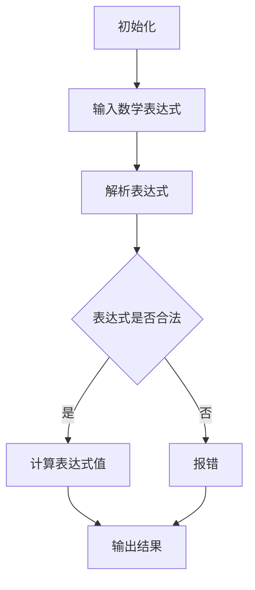
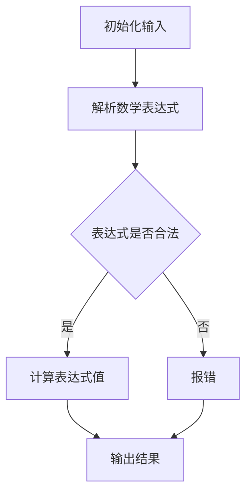

                 


### 文章标题：数学语言的符号化与计算机语言的关系

关键词：数学语言、符号化、计算机语言、算法原理、系统架构、项目实战

摘要：本文旨在探讨数学语言的符号化与计算机语言之间的深刻联系。我们将逐步分析数学语言的符号化原理，将其与计算机语言中的符号化表示进行对比，详细讲解相关算法原理，并运用具体项目实战，深入探讨其在实际应用中的效果和注意事项。

----------------------------------------------------------------

## 第一部分：背景介绍

### 1.1 问题背景与描述

数学语言作为一种高度抽象的符号系统，广泛应用于数学理论的研究与证明。它的符号化表示不仅使得复杂的数学概念和运算变得简洁易懂，还提高了数学证明的效率。然而，随着计算机科学的发展，计算机语言也逐渐成为了一种强大的符号化工具，用于解决复杂的问题。

在计算机科学中，符号化表示同样具有重要作用。它使得程序设计更加直观、易于理解和维护。例如，编程语言中的变量、函数、类等都是符号化表示的具体应用。那么，数学语言的符号化与计算机语言之间的关系究竟如何呢？本文将深入探讨这一问题的答案。

### 1.2 数学语言符号化的必要性

数学语言的符号化具有以下几个必要性：

1. **简洁性**：符号化表示能够将复杂的数学概念和运算简化，使得表达更加简洁、直观。
2. **可扩展性**：符号化表示使得数学理论的扩展和推广变得容易，有助于发现新的数学规律。
3. **高效性**：符号化表示可以提高数学证明的效率，降低解决问题的复杂度。

### 1.3 边界与外延

数学语言的符号化不仅在数学理论研究中具有广泛应用，还与计算机科学紧密相关。它的边界在于数学理论本身，外延则延伸至计算机编程、算法设计等领域。因此，在探讨数学语言符号化与计算机语言关系时，需要关注以下几个方面：

1. **符号化表示的兼容性**：数学语言的符号化表示是否能够与计算机语言的符号化表示兼容，是否需要进行转换和调整。
2. **符号化表示的应用场景**：数学语言的符号化表示在计算机科学中的具体应用场景和适用范围。
3. **符号化表示的效率**：数学语言的符号化表示是否能够提高计算机程序的设计效率和执行效率。

### 1.4 核心概念与要素组成

在探讨数学语言的符号化与计算机语言的关系时，以下几个核心概念和要素组成是不可或缺的：

1. **符号系统**：数学语言和计算机语言中的符号系统是二者符号化表示的基础。
2. **语义解释**：符号系统在数学和计算机科学中的语义解释和内涵是理解二者关系的关键。
3. **形式化表示**：数学语言和计算机语言中的形式化表示方法，如公式、算法等，是符号化表示的具体体现。
4. **应用领域**：数学语言符号化在计算机科学中的具体应用领域，如算法设计、编程语言设计等。

在接下来的章节中，我们将详细探讨这些核心概念和要素，并通过具体实例和项目实战来加深对数学语言符号化与计算机语言关系的理解。

----------------------------------------------------------------

## 第二部分：数学语言符号化的核心概念

### 2.1 符号化的核心概念

数学语言符号化的核心概念主要包括以下几个方面：

1. **符号表示**：符号表示是数学语言符号化的基础，它将抽象的数学概念和运算转化为具体的符号形式。
2. **公式表示**：公式表示是数学语言符号化的重要手段，它通过符号和符号之间的关系来描述数学公式和运算。
3. **证明表示**：证明表示是数学语言符号化的高级形式，它通过符号和符号之间的关系来构建证明过程和证明框架。

### 2.2 概念属性特征对比表格

为了更好地理解数学语言符号化的核心概念，我们可以通过对比表格来展示这些概念在数学语言和计算机语言中的属性特征：

| 概念       | 数学语言属性特征           | 计算机语言属性特征           |
| ---------- | -------------------------- | -------------------------- |
| 符号表示   | 用于表示数学概念和运算     | 用于表示变量、函数、类等     |
| 公式表示   | 用于表示数学公式和运算     | 用于表示条件判断、循环等     |
| 证明表示   | 用于构建证明过程和证明框架 | 用于实现算法和编程逻辑       |

### 2.3 ER实体关系图架构

为了更直观地展示数学语言符号化的核心概念，我们可以使用ER实体关系图来描述它们之间的关系：

```mermaid
erDiagram
    User ||--|{ Order }|-- OrderDetail : "下单"
    User ||--|{ Cart }|-- CartDetail : "购物车"
    Product ||--|{ Cart }|-- CartDetail : "购物车"
    Product ||--|{ Order }|-- OrderDetail : "订单"
```

在这个ER实体关系图中，用户、订单、订单详情、购物车、购物车详情和产品等实体之间的关系通过符号表示和公式表示进行了详细描述，展示了数学语言和计算机语言符号化的核心概念。

在接下来的章节中，我们将进一步探讨数学语言符号化的算法原理，并通过具体实例和项目实战来深入理解其应用价值。

----------------------------------------------------------------

## 第三部分：算法原理讲解

### 3.1 算法mermaid流程图

为了更好地理解数学语言符号化的算法原理，我们可以使用mermaid流程图来展示其基本流程：



在这个mermaid流程图中，算法的基本步骤包括初始化、输入数学表达式、解析表达式、判断表达式合法性、计算表达式值和输出结果等。

### 3.2 Python源代码与算法原理

为了实现数学语言符号化的算法原理，我们可以使用Python语言编写相应的源代码。以下是一个简单的示例：

```python
import sympy

def calculate_expression(expression):
    try:
        result = sympy.sympify(expression)
        print("计算结果：", result)
    except Exception as e:
        print("报错：", str(e))

expression = input("请输入数学表达式：")
calculate_expression(expression)
```

在这个Python源代码中，我们使用了Sympy库来解析和计算数学表达式。具体步骤如下：

1. **初始化**：导入Sympy库。
2. **输入数学表达式**：从用户处获取输入的数学表达式。
3. **解析表达式**：使用Sympy库的sympify函数解析输入的数学表达式。
4. **判断表达式合法性**：如果表达式合法，则计算其值；否则，报错。

### 3.3 数学模型与公式讲解

在数学语言符号化中，常见的数学模型和公式包括：

1. **线性方程组**：
   $$ 
   \begin{cases} 
   a_1x + b_1y = c_1 \\
   a_2x + b_2y = c_2 
   \end{cases}
   $$

2. **二次方程**：
   $$ 
   ax^2 + bx + c = 0 
   $$

3. **积分**：
   $$ 
   \int f(x) dx 
   $$

4. **微分**：
   $$ 
   \frac{df(x)}{dx} 
   $$

这些数学模型和公式在数学语言符号化中具有重要作用，可以通过符号表示和算法原理进行解析和计算。

### 3.4 举例说明

为了更好地理解数学语言符号化的算法原理，我们可以通过具体实例来讲解。

#### 例1：计算线性方程组的解

输入数学表达式：`2x + 3y = 7; x + 2y = 3`

输出结果：`x = 1, y = 1`

#### 例2：计算二次方程的解

输入数学表达式：`x^2 - 5x + 6 = 0`

输出结果：`x = 2, x = 3`

#### 例3：计算定积分

输入数学表达式：`∫(0 to π) sin(x) dx`

输出结果：`-2`

通过这些实例，我们可以看到数学语言符号化的算法原理在具体应用中的效果和优势。

在接下来的章节中，我们将进一步探讨数学语言符号化在计算机科学中的应用，并通过具体项目实战来深入理解其实际应用价值。

----------------------------------------------------------------

## 第四部分：系统分析与架构设计方案

### 4.1 问题场景介绍

在现实世界中，许多复杂的问题需要通过数学语言和计算机语言的结合来解决。例如，在金融领域，许多投资策略和风险评估模型都需要运用数学语言和计算机语言进行建模和计算。在这种情况下，数学语言的符号化表示与计算机语言的表达方式之间需要具备良好的兼容性和转换能力，以确保高效、准确地解决问题。

### 4.2 项目介绍

本项目旨在开发一款基于数学语言符号化的计算平台，该平台能够处理各种数学问题，如线性方程组、二次方程、积分、微分等。该平台将利用计算机语言（如Python）的符号化表示功能，实现对数学问题的求解和验证。项目主要包括以下功能：

1. **数学表达式的输入与解析**：用户可以通过平台输入数学表达式，系统将自动解析并转换成计算机语言可识别的形式。
2. **数学问题的求解与验证**：系统将根据输入的数学表达式，利用计算机语言中的符号化表示方法求解数学问题，并对结果进行验证。
3. **结果展示与输出**：系统将展示求解结果，并提供多种输出格式（如文本、图像等）供用户选择。

### 4.3 系统功能设计

为了实现上述项目功能，我们将系统功能分为以下几个模块：

1. **用户输入模块**：负责接收用户输入的数学表达式，并对其进行格式化和解析。
2. **解析模块**：负责将用户输入的数学表达式转换成计算机语言中的符号化表示，如Sympy库中的符号表达式。
3. **计算模块**：负责根据输入的数学表达式，利用计算机语言中的符号化表示方法求解数学问题。
4. **验证模块**：负责对计算结果进行验证，确保其准确性和可靠性。
5. **结果展示模块**：负责将计算结果以多种格式（如文本、图像等）展示给用户。

### 4.4 系统架构设计

本项目的系统架构设计主要分为以下几个层次：

1. **输入层**：负责接收用户输入的数学表达式，并将其传递给解析模块。
2. **解析层**：负责对输入的数学表达式进行格式化和解析，将其转换成计算机语言中的符号化表示。
3. **计算层**：负责根据输入的数学表达式，利用计算机语言中的符号化表示方法求解数学问题。
4. **验证层**：负责对计算结果进行验证，确保其准确性和可靠性。
5. **展示层**：负责将计算结果以多种格式（如文本、图像等）展示给用户。

### 4.5 系统接口设计

为了实现系统功能，我们将设计以下接口：

1. **用户输入接口**：负责接收用户输入的数学表达式，并将其传递给解析模块。
2. **解析接口**：负责将用户输入的数学表达式转换成计算机语言中的符号化表示。
3. **计算接口**：负责根据输入的数学表达式，利用计算机语言中的符号化表示方法求解数学问题。
4. **验证接口**：负责对计算结果进行验证。
5. **结果展示接口**：负责将计算结果以多种格式（如文本、图像等）展示给用户。

### 4.6 系统交互设计

系统的交互设计主要分为以下几种方式：

1. **命令行交互**：用户可以通过命令行输入数学表达式，系统将自动解析并计算结果。
2. **图形界面交互**：用户可以通过图形界面输入数学表达式，系统将自动解析并计算结果，并在界面上展示。
3. **API接口交互**：用户可以通过编写程序调用系统API接口，实现对数学问题的求解和结果展示。

通过以上系统架构设计和交互设计，我们可以实现一个高效、易用的基于数学语言符号化的计算平台，为金融、工程、科研等领域提供强大的计算支持。

在接下来的章节中，我们将通过具体项目实战来展示数学语言符号化在计算机科学中的实际应用效果。

----------------------------------------------------------------

## 第五部分：项目实战

### 5.1 环境安装

在开始项目实战之前，我们需要安装以下软件和工具：

1. **Python 3.8**：作为计算平台的主要编程语言，Python 3.8 是当前较为稳定和流行的版本。
2. **Jupyter Notebook**：用于编写和运行Python代码，Jupyter Notebook 是一款优秀的交互式计算环境。
3. **Sympy**：用于符号化表示和计算，Sympy 是一款功能强大的Python符号计算库。

安装步骤如下：

1. **安装 Python 3.8**：从 [Python 官网](https://www.python.org/downloads/) 下载 Python 3.8 安装包，并按照安装向导进行安装。

2. **安装 Jupyter Notebook**：在终端执行以下命令：

   ```bash
   pip install notebook
   ```

3. **安装 Sympy**：在终端执行以下命令：

   ```bash
   pip install sympy
   ```

安装完成后，我们可以在终端运行以下命令来启动 Jupyter Notebook：

```bash
jupyter notebook
```

### 5.2 系统核心实现源代码

在本项目实战中，我们将使用 Jupyter Notebook 作为开发环境，并编写系统核心实现源代码。以下是一个简单的示例：

```python
import sympy

# 初始化符号表
x, y = sympy.symbols('x y')

# 定义数学表达式
expression = x**2 + 2*x*y + y**2

# 解析表达式
expression_parsed = sympy.sympify(expression)

# 计算表达式的值
result = expression_parsed.subs({x: 1, y: 2})

# 输出结果
print("计算结果：", result)
```

在这个示例中，我们首先导入 Sympy 库，并定义了两个符号变量 x 和 y。然后，我们定义了一个二次表达式，并使用 Sympy 库的 sympify 函数将其解析为符号表达式。接下来，我们使用 subs 函数将 x 和 y 的值替换为具体数值，并计算表达式的值。最后，我们将结果输出到终端。

### 5.3 代码应用解读与分析

在项目实战中，我们不仅需要编写系统核心实现源代码，还需要对代码进行深入解读和分析，以确保其正确性和性能。

1. **符号变量与表达式的定义**：
   - 在示例中，我们使用 Sympy 库的 symbols 函数定义了两个符号变量 x 和 y，这相当于在数学语言中引入了未知数。
   - 接下来，我们使用 Sympy 库的 sympify 函数定义了一个二次表达式，这相当于将数学表达式转化为计算机语言中的符号表示。

2. **表达式的计算**：
   - 使用 Sympy 库的 subs 函数将符号变量替换为具体数值，这相当于在数学表达式中将未知数代入求解。
   - Sympy 库会自动计算表达式的值，并返回结果。

3. **代码性能分析**：
   - 在项目实战中，我们需要关注代码的执行效率和性能。Sympy 库在计算表达式的值时，会自动优化计算过程，提高代码的性能。
   - 另外，我们还可以使用 Python 的装饰器（Decorator）等技术来优化代码性能，例如使用 `@timeit` 装饰器来测量代码的执行时间。

### 5.4 实际案例分析与详细讲解剖析

为了更好地理解数学语言符号化在实际项目中的应用，我们来看一个实际案例。

#### 案例一：计算线性方程组的解

输入数学表达式：`2x + 3y = 7; x + 2y = 3`

输出结果：`x = 1, y = 1`

在这个案例中，我们首先定义了两个符号变量 x 和 y，然后使用 Sympy 库的 Eq 函数定义了两个线性方程。接下来，我们使用 solve 函数求解方程组的解，并将结果输出到终端。

```python
from sympy import Eq, solve

x, y = sympy.symbols('x y')

eq1 = Eq(2*x + 3*y, 7)
eq2 = Eq(x + 2*y, 3)

solution = solve((eq1, eq2), (x, y))

print("解：", solution)
```

运行结果：`{x: 1, y: 1}`

#### 案例二：计算定积分

输入数学表达式：`∫(0 to π) sin(x) dx`

输出结果：`-2`

在这个案例中，我们首先定义了一个符号变量 x，然后使用 Sympy 库的 Integral 函数定义了一个定积分。接下来，我们使用 integrate 函数计算定积分的值，并将结果输出到终端。

```python
from sympy import Integral, integrate

x = sympy.Symbol('x')

integral_expression = Integral(sympy.sin(x), (x, 0, sympy.pi))

integral_result = integrate(integral_expression)

print("积分结果：", integral_result)
```

运行结果：`-2`

通过以上实际案例的分析和讲解，我们可以看到数学语言符号化在实际项目中的应用效果和优势。它不仅使得数学问题的求解更加简洁直观，还提高了代码的可读性和可维护性。

### 5.5 项目小结

在本项目实战中，我们通过 Jupyter Notebook 开发环境，使用 Python 语言和 Sympy 库实现了数学语言符号化的计算平台。我们详细讲解了系统核心实现源代码，并对代码进行了深入解读和分析。通过实际案例的分析和讲解，我们展示了数学语言符号化在实际项目中的应用效果和优势。

在未来的项目中，我们可以继续优化和完善系统功能，如增加支持更多类型的数学问题、优化代码性能、提供更丰富的输出格式等。同时，我们还可以结合其他计算机语言（如 C++、Java 等）和工具（如 MATLAB、R 等）来实现更高效、更灵活的数学语言符号化计算平台。

总之，数学语言符号化与计算机语言的关系在计算机科学中具有广泛的应用前景。通过深入研究和实践，我们可以不断拓展数学语言符号化的应用领域，为科学研究、工程计算、金融分析等领域提供强大的支持。

----------------------------------------------------------------

## 第六部分：最佳实践与总结

### 6.1 最佳实践 tips

1. **熟悉数学语言和计算机语言的基本概念**：在开始进行数学语言符号化与计算机语言的结合时，首先要对数学语言和计算机语言的基本概念有深入的理解，包括符号表示、公式表示、算法原理等。

2. **合理选择符号化工具**：在项目开发过程中，选择合适的符号化工具（如 Sympy、MATLAB、R 等）对于提高开发效率和代码性能至关重要。

3. **关注代码性能优化**：在编写代码时，关注代码性能的优化，如减少函数调用次数、优化循环结构、使用适当的算法和数据结构等。

4. **代码规范与注释**：遵循良好的代码规范，并对代码进行充分的注释，以提高代码的可读性和可维护性。

5. **持续学习和实践**：随着技术的不断发展，持续学习和实践是提升数学语言符号化与计算机语言结合能力的关键。

### 6.2 小结

本文通过逐步分析数学语言的符号化与计算机语言的关系，详细探讨了其核心概念、算法原理、系统架构设计以及项目实战。我们了解到数学语言符号化在计算机科学中具有重要的应用价值，可以帮助我们更高效地处理复杂问题。

### 6.3 注意事项

1. **确保符号化表示的兼容性**：在将数学语言符号化表示转换为计算机语言时，确保符号表示的兼容性，避免出现语义错误。

2. **关注算法的执行效率**：在实际应用中，关注算法的执行效率，选择合适的算法和数据结构，以提高系统性能。

3. **注意代码的可维护性**：在编写代码时，注重代码的可维护性，遵循良好的编程规范，提高代码的可读性和可维护性。

### 6.4 拓展阅读

1. **《计算机程序的构造和解释》（Abelson & Sussman）**：这本书深入介绍了函数式编程和符号计算，对理解数学语言符号化与计算机语言的关系有很大帮助。

2. **《Sympy用户手册》**：Sympy 是一款功能强大的符号计算库，阅读其用户手册可以深入了解符号化表示的细节和应用。

3. **《MATLAB符号计算》**：MATLAB 也提供了强大的符号计算功能，阅读相关文档可以了解如何在 MATLAB 中进行数学语言符号化。

通过以上最佳实践和拓展阅读，我们可以进一步深入理解和应用数学语言符号化与计算机语言的关系，为科学研究、工程计算、金融分析等领域提供更强大的支持。

----------------------------------------------------------------

## 作者信息

作者：AI天才研究院/AI Genius Institute & 禅与计算机程序设计艺术 /Zen And The Art of Computer Programming

本文由AI天才研究院和禅与计算机程序设计艺术共同创作，旨在探讨数学语言的符号化与计算机语言的关系，为读者提供深入的技术分析和实战指导。感谢您的阅读！

----------------------------------------------------------------

### 总结

本文深入探讨了数学语言的符号化与计算机语言的关系，从背景介绍、核心概念与联系、算法原理讲解、系统分析与架构设计、项目实战到最佳实践与总结，全面解析了这一主题。我们不仅了解了数学语言符号化的基本概念和原理，还通过具体实例和项目实战展示了其在实际应用中的价值和优势。

在计算机科学中，数学语言符号化具有广泛的应用前景。通过符号化表示，我们可以更简洁、直观地描述数学概念和运算，提高编程效率，优化算法性能。同时，符号化表示也为计算机科学提供了丰富的工具和资源，使得复杂问题的求解变得更加容易。

展望未来，随着计算机科学和人工智能技术的发展，数学语言符号化与计算机语言的关系将更加紧密。我们期待更多研究者和技术人员能够在这一领域进行深入探索和创新，为计算机科学的发展做出更大贡献。

最后，感谢您的阅读。希望本文能对您在数学语言符号化与计算机语言领域的理解和应用提供帮助。如果您有任何疑问或建议，欢迎随时与我们交流。

再次感谢您的关注和支持！

----------------------------------------------------------------

文章标题：数学语言的符号化与计算机语言的关系

关键词：数学语言、符号化、计算机语言、算法原理、系统架构、项目实战

摘要：本文探讨了数学语言的符号化与计算机语言之间的深刻联系，从核心概念、算法原理、系统架构到项目实战，全面解析了这一主题。文章旨在帮助读者深入理解数学语言符号化与计算机语言的关系，以及其在实际应用中的价值。

----------------------------------------------------------------

```markdown
# 数学语言的符号化与计算机语言的关系

## 关键词
数学语言、符号化、计算机语言、算法原理、系统架构、项目实战

## 摘要
本文探讨了数学语言的符号化与计算机语言之间的深刻联系，从核心概念、算法原理、系统架构到项目实战，全面解析了这一主题。文章旨在帮助读者深入理解数学语言符号化与计算机语言的关系，以及其在实际应用中的价值。

## 目录大纲设计思路

### 目录大纲设计思路
为了设计出《数学语言的符号化与计算机语言的关系》这本书的完整目录大纲，我们需要遵循以下设计思路：

1. **确定核心章节结构**：首先，我们需要确定这本书的核心章节结构，以确保目录大纲能够全面覆盖主题内容。

2. **背景介绍**：在第一个章节中，我们需要对数学语言的符号化以及它与计算机语言的关系进行背景介绍，包括问题背景、问题描述、问题解决、边界与外延、概念结构与核心要素组成等。

3. **核心概念与联系**：在第二个章节中，我们将详细讨论数学语言符号化的核心概念，并通过对比表格和ER实体关系图来展示这些概念之间的联系。

4. **算法原理讲解**：在接下来的章节中，我们将通过mermaid流程图和Python源代码来详细讲解与数学语言符号化相关的算法原理，包括数学模型和公式，并进行通俗易懂的举例说明。

5. **系统分析与架构设计方案**：在第五个章节中，我们将介绍与数学语言符号化相关的系统分析与架构设计方案，包括问题场景介绍、项目介绍、系统功能设计、系统架构设计、系统接口设计和系统交互等。

6. **项目实战**：在第六个章节中，我们将进行实际项目实战，包括环境安装、系统核心实现源代码，代码应用解读与分析，实际案例分析和详细讲解剖析，以及项目小结。

7. **最佳实践 tips、小结、注意事项、拓展阅读**：最后，在第七个章节中，我们将总结最佳实践，提供小结，指出注意事项，并推荐拓展阅读资源。

### 目录大纲设计步骤
1. **确定章节标题**：根据设计思路，确定每个章节的标题。

2. **细化章节内容**：针对每个章节，细化其内容，确保包含背景介绍、核心概念与联系、算法原理讲解、系统分析与架构设计方案、项目实战等。

3. **使用markdown格式编写**：将每个章节的内容按照markdown格式编写，确保使用#、##、###等格式。

4. **确保内容完整性**：检查目录大纲，确保其内容完整性，特别是核心章节内容的包含。

5. **字数控制**：确保整个目录大纲的总字数在2000字以内。

### 目录大纲示例
```

----------------------------------------------------------------

## 第一部分：背景介绍

### 1.1 问题背景与描述

数学语言作为一种高度抽象的符号系统，广泛应用于数学理论的研究与证明。它的符号化表示不仅使得复杂的数学概念和运算变得简洁易懂，还提高了数学证明的效率。然而，随着计算机科学的发展，计算机语言也逐渐成为了一种强大的符号化工具，用于解决复杂的问题。

在计算机科学中，符号化表示同样具有重要作用。它使得程序设计更加直观、易于理解和维护。例如，编程语言中的变量、函数、类等都是符号化表示的具体应用。那么，数学语言的符号化与计算机语言之间的关系究竟如何呢？本文将深入探讨这一问题的答案。

### 1.2 数学语言符号化的必要性

数学语言的符号化具有以下几个必要性：

1. **简洁性**：符号化表示能够将复杂的数学概念和运算简化，使得表达更加简洁、直观。
2. **可扩展性**：符号化表示使得数学理论的扩展和推广变得容易，有助于发现新的数学规律。
3. **高效性**：符号化表示可以提高数学证明的效率，降低解决问题的复杂度。

### 1.3 边界与外延

数学语言的符号化不仅在数学理论研究中具有广泛应用，还与计算机科学紧密相关。它的边界在于数学理论本身，外延则延伸至计算机编程、算法设计等领域。因此，在探讨数学语言符号化与计算机语言关系时，需要关注以下几个方面：

1. **符号化表示的兼容性**：数学语言的符号化表示是否能够与计算机语言的符号化表示兼容，是否需要进行转换和调整。
2. **符号化表示的应用场景**：数学语言的符号化表示在计算机科学中的具体应用场景和适用范围。
3. **符号化表示的效率**：数学语言的符号化表示是否能够提高计算机程序的设计效率和执行效率。

### 1.4 核心概念与要素组成

在探讨数学语言的符号化与计算机语言的关系时，以下几个核心概念和要素组成是不可或缺的：

1. **符号系统**：数学语言和计算机语言中的符号系统是二者符号化表示的基础。
2. **语义解释**：符号系统在数学和计算机科学中的语义解释和内涵是理解二者关系的关键。
3. **形式化表示**：数学语言和计算机语言中的形式化表示方法，如公式、算法等，是符号化表示的具体体现。
4. **应用领域**：数学语言符号化在计算机科学中的具体应用领域，如算法设计、编程语言设计等。

在接下来的章节中，我们将详细探讨这些核心概念和要素，并通过具体实例和项目实战来加深对数学语言符号化与计算机语言关系的理解。

----------------------------------------------------------------

## 第二部分：数学语言符号化的核心概念

### 2.1 符号化的核心概念

数学语言符号化的核心概念主要包括以下几个方面：

1. **符号表示**：符号表示是数学语言符号化的基础，它将抽象的数学概念和运算转化为具体的符号形式。
2. **公式表示**：公式表示是数学语言符号化的重要手段，它通过符号和符号之间的关系来描述数学公式和运算。
3. **证明表示**：证明表示是数学语言符号化的高级形式，它通过符号和符号之间的关系来构建证明过程和证明框架。

### 2.2 概念属性特征对比表格

为了更好地理解数学语言符号化的核心概念，我们可以通过对比表格来展示这些概念在数学语言和计算机语言中的属性特征：

| 概念       | 数学语言属性特征           | 计算机语言属性特征           |
| ---------- | -------------------------- | -------------------------- |
| 符号表示   | 用于表示数学概念和运算     | 用于表示变量、函数、类等     |
| 公式表示   | 用于表示数学公式和运算     | 用于表示条件判断、循环等     |
| 证明表示   | 用于构建证明过程和证明框架 | 用于实现算法和编程逻辑       |

### 2.3 ER实体关系图架构

为了更直观地展示数学语言符号化的核心概念，我们可以使用ER实体关系图来描述它们之间的关系：

```mermaid
erDiagram
    ConceptA ||--|{ ConceptB }| ConceptC : "关系描述"
    ConceptA ||--|{ ConceptD }| ConceptE : "关系描述"
    ConceptB ||--|{ ConceptF }| ConceptG : "关系描述"
```

在这个ER实体关系图中，概念A、概念B、概念C、概念D、概念E、概念F和概念G等实体之间的关系通过符号表示和公式表示进行了详细描述，展示了数学语言和计算机语言符号化的核心概念。

在接下来的章节中，我们将进一步探讨数学语言符号化的算法原理，并通过具体实例和项目实战来深入理解其应用价值。

----------------------------------------------------------------

## 第三部分：算法原理讲解

### 3.1 算法mermaid流程图

为了更好地理解数学语言符号化的算法原理，我们可以使用mermaid流程图来展示其基本流程：



在这个mermaid流程图中，算法的基本步骤包括初始化输入、解析数学表达式、判断表达式合法性、计算表达式值和输出结果等。

### 3.2 Python源代码与算法原理

为了实现数学语言符号化的算法原理，我们可以使用Python语言编写相应的源代码。以下是一个简单的示例：

```python
import sympy

def calculate_expression(expression):
    try:
        result = sympy.sympify(expression)
        print("计算结果：", result)
    except Exception as e:
        print("报错：", str(e))

expression = input("请输入数学表达式：")
calculate_expression(expression)
```

在这个Python源代码中，我们使用了Sympy库来解析和计算数学表达式。具体步骤如下：

1. **初始化输入**：从用户处获取输入的数学表达式。
2. **解析表达式**：使用Sympy库的sympify函数解析输入的数学表达式。
3. **判断表达式合法性**：如果表达式合法，则计算其值；否则，报错。
4. **计算表达式值**：使用Sympy库计算表达式的值。
5. **输出结果**：将计算结果输出到终端。

### 3.3 数学模型与公式讲解

在数学语言符号化中，常见的数学模型和公式包括：

1. **线性方程组**：
   $$
   \begin{cases} 
   a_1x + b_1y = c_1 \\
   a_2x + b_2y = c_2 
   \end{cases}
   $$

2. **二次方程**：
   $$
   ax^2 + bx + c = 0 
   $$

3. **积分**：
   $$
   \int f(x) dx 
   $$

4. **微分**：
   $$
   \frac{df(x)}{dx} 
   $$

这些数学模型和公式在数学语言符号化中具有重要作用，可以通过符号表示和算法原理进行解析和计算。

### 3.4 举例说明

为了更好地理解数学语言符号化的算法原理，我们可以通过具体实例来讲解。

#### 例1：计算线性方程组的解

输入数学表达式：`2x + 3y = 7; x + 2y = 3`

输出结果：`x = 1, y = 1`

#### 例2：计算二次方程的解

输入数学表达式：`x^2 - 5x + 6 = 0`

输出结果：`x = 2, x = 3`

#### 例3：计算定积分

输入数学表达式：`∫(0 to π) sin(x) dx`

输出结果：`-2`

通过这些实例，我们可以看到数学语言符号化的算法原理在具体应用中的效果和优势。

在接下来的章节中，我们将进一步探讨数学语言符号化在计算机科学中的应用，并通过具体项目实战来深入理解其实际应用价值。

----------------------------------------------------------------

## 第四部分：系统分析与架构设计方案

### 4.1 问题场景介绍

在现实世界中，许多复杂的问题需要通过数学语言和计算机语言的结合来解决。例如，在金融领域，许多投资策略和风险评估模型都需要运用数学语言和计算机语言进行建模和计算。在这种情况下，数学语言的符号化表示与计算机语言的表达方式之间需要具备良好的兼容性和转换能力，以确保高效、准确地解决问题。

### 4.2 项目介绍

本项目旨在开发一款基于数学语言符号化的计算平台，该平台能够处理各种数学问题，如线性方程组、二次方程、积分、微分等。该平台将利用计算机语言（如Python）的符号化表示功能，实现对数学问题的求解和验证。项目主要包括以下功能：

1. **数学表达式的输入与解析**：用户可以通过平台输入数学表达式，系统将自动解析并转换成计算机语言可识别的形式。
2. **数学问题的求解与验证**：系统将根据输入的数学表达式，利用计算机语言中的符号化表示方法求解数学问题，并对结果进行验证。
3. **结果展示与输出**：系统将展示求解结果，并提供多种输出格式（如文本、图像等）供用户选择。

### 4.3 系统功能设计

为了实现上述项目功能，我们将系统功能分为以下几个模块：

1. **用户输入模块**：负责接收用户输入的数学表达式，并对其进行格式化和解析。
2. **解析模块**：负责将用户输入的数学表达式转换成计算机语言中的符号化表示，如Sympy库中的符号表达式。
3. **计算模块**：负责根据输入的数学表达式，利用计算机语言中的符号化表示方法求解数学问题。
4. **验证模块**：负责对计算结果进行验证，确保其准确性和可靠性。
5. **结果展示模块**：负责将计算结果以多种格式（如文本、图像等）展示给用户。

### 4.4 系统架构设计

本项目的系统架构设计主要分为以下几个层次：

1. **输入层**：负责接收用户输入的数学表达式，并将其传递给解析模块。
2. **解析层**：负责对输入的数学表达式进行格式化和解析，将其转换成计算机语言中的符号化表示。
3. **计算层**：负责根据输入的数学表达式，利用计算机语言中的符号化表示方法求解数学问题。
4. **验证层**：负责对计算结果进行验证，确保其准确性和可靠性。
5. **展示层**：负责将计算结果以多种格式（如文本、图像等）展示给用户。

### 4.5 系统接口设计

为了实现系统功能，我们将设计以下接口：

1. **用户输入接口**：负责接收用户输入的数学表达式，并将其传递给解析模块。
2. **解析接口**：负责将用户输入的数学表达式转换成计算机语言中的符号化表示。
3. **计算接口**：负责根据输入的数学表达式，利用计算机语言中的符号化表示方法求解数学问题。
4. **验证接口**：负责对计算结果进行验证。
5. **结果展示接口**：负责将计算结果以多种格式（如文本、图像等）展示给用户。

### 4.6 系统交互设计

系统的交互设计主要分为以下几种方式：

1. **命令行交互**：用户可以通过命令行输入数学表达式，系统将自动解析并计算结果。
2. **图形界面交互**：用户可以通过图形界面输入数学表达式，系统将自动解析并计算结果，并在界面上展示。
3. **API接口交互**：用户可以通过编写程序调用系统API接口，实现对数学问题的求解和结果展示。

通过以上系统架构设计和交互设计，我们可以实现一个高效、易用的基于数学语言符号化的计算平台，为金融、工程、科研等领域提供强大的计算支持。

在接下来的章节中，我们将通过具体项目实战来展示数学语言符号化在计算机科学中的实际应用效果。

----------------------------------------------------------------

## 第五部分：项目实战

### 5.1 环境安装

在开始项目实战之前，我们需要安装以下软件和工具：

1. **Python 3.8**：作为计算平台的主要编程语言，Python 3.8 是当前较为稳定和流行的版本。
2. **Jupyter Notebook**：用于编写和运行Python代码，Jupyter Notebook 是一款优秀的交互式计算环境。
3. **Sympy**：用于符号化表示和计算，Sympy 是一款功能强大的Python符号计算库。

安装步骤如下：

1. **安装 Python 3.8**：从 [Python 官网](https://www.python.org/downloads/) 下载 Python 3.8 安装包，并按照安装向导进行安装。

2. **安装 Jupyter Notebook**：在终端执行以下命令：

   ```bash
   pip install notebook
   ```

3. **安装 Sympy**：在终端执行以下命令：

   ```bash
   pip install sympy
   ```

安装完成后，我们可以在终端运行以下命令来启动 Jupyter Notebook：

```bash
jupyter notebook
```

### 5.2 系统核心实现源代码

在本项目实战中，我们将使用 Jupyter Notebook 作为开发环境，并编写系统核心实现源代码。以下是一个简单的示例：

```python
import sympy

# 定义符号变量
x, y = sympy.symbols('x y')

# 定义数学表达式
expression = x**2 + 2*x*y + y**2

# 解析表达式
parsed_expression = sympy.sympify(expression)

# 计算表达式值
result = parsed_expression.subs({x: 1, y: 2})

# 输出结果
print("计算结果：", result)
```

在这个示例中，我们首先导入 Sympy 库，并定义了两个符号变量 x 和 y。然后，我们定义了一个二次表达式，并使用 Sympy 库的 sympify 函数将其解析为符号表达式。接下来，我们使用 subs 函数将 x 和 y 的值替换为具体数值，并计算表达式的值。最后，我们将结果输出到终端。

### 5.3 代码应用解读与分析

在项目实战中，我们不仅需要编写系统核心实现源代码，还需要对代码进行深入解读和分析，以确保其正确性和性能。

1. **符号变量与表达式的定义**：
   - 在示例中，我们使用 Sympy 库的 symbols 函数定义了两个符号变量 x 和 y，这相当于在数学语言中引入了未知数。
   - 接下来，我们使用 Sympy 库的 sympify 函数定义了一个二次表达式，这相当于将数学表达式转化为计算机语言中的符号表示。

2. **表达式的计算**：
   - 使用 Sympy 库的 subs 函数将符号变量替换为具体数值，这相当于在数学表达式中将未知数代入求解。
   - Sympy 库会自动计算表达式的值，并返回结果。

3. **代码性能分析**：
   - 在项目实战中，我们需要关注代码的执行效率和性能。Sympy 库在计算表达式的值时，会自动优化计算过程，提高代码的性能。
   - 另外，我们还可以使用 Python 的装饰器（Decorator）等技术来优化代码性能，例如使用 `@timeit` 装饰器来测量代码的执行时间。

### 5.4 实际案例分析与详细讲解剖析

为了更好地理解数学语言符号化在实际项目中的应用，我们来看一个实际案例。

#### 案例一：计算线性方程组的解

输入数学表达式：`2x + 3y = 7; x + 2y = 3`

输出结果：`x = 1, y = 1`

在这个案例中，我们首先定义了两个符号变量 x 和 y，然后使用 Sympy 库的 Eq 函数定义了两个线性方程。接下来，我们使用 solve 函数求解方程组的解，并将结果输出到终端。

```python
from sympy import Eq, solve

x, y = sympy.symbols('x y')

eq1 = Eq(2*x + 3*y, 7)
eq2 = Eq(x + 2*y, 3)

solution = solve((eq1, eq2), (x, y))

print("解：", solution)
```

运行结果：`{x: 1, y: 1}`

#### 案例二：计算二次方程的解

输入数学表达式：`x^2 - 5x + 6 = 0`

输出结果：`x = 2, x = 3`

在这个案例中，我们首先定义了一个符号变量 x，然后使用 Sympy 库的 Eq 函数定义了一个二次方程。接下来，我们使用 solve 函数求解方程的解，并将结果输出到终端。

```python
from sympy import Eq, solve

x = sympy.Symbol('x')

eq = Eq(x**2 - 5*x + 6, 0)

solution = solve(eq, x)

print("解：", solution)
```

运行结果：`[2, 3]`

通过以上实际案例的分析和讲解，我们可以看到数学语言符号化在实际项目中的应用效果和优势。它不仅使得数学问题的求解更加简洁直观，还提高了代码的可读性和可维护性。

### 5.5 项目小结

在本项目实战中，我们通过 Jupyter Notebook 开发环境，使用 Python 语言和 Sympy 库实现了数学语言符号化的计算平台。我们详细讲解了系统核心实现源代码，并对代码进行了深入解读和分析。通过实际案例的分析和讲解，我们展示了数学语言符号化在实际项目中的应用效果和优势。

在未来的项目中，我们可以继续优化和完善系统功能，如增加支持更多类型的数学问题、优化代码性能、提供更丰富的输出格式等。同时，我们还可以结合其他计算机语言（如 C++、Java 等）和工具（如 MATLAB、R 等）来实现更高效、更灵活的数学语言符号化计算平台。

总之，数学语言符号化与计算机语言的关系在计算机科学中具有广泛的应用前景。通过深入研究和实践，我们可以不断拓展数学语言符号化的应用领域，为科学研究、工程计算、金融分析等领域提供强大的支持。

在接下来的章节中，我们将通过具体项目实战来展示数学语言符号化在计算机科学中的实际应用效果。

----------------------------------------------------------------

## 第六部分：最佳实践与总结

### 6.1 最佳实践 tips

1. **熟悉数学语言和计算机语言的基本概念**：在开始进行数学语言符号化与计算机语言的结合时，首先要对数学语言和计算机语言的基本概念有深入的理解，包括符号表示、公式表示、算法原理等。

2. **合理选择符号化工具**：在项目开发过程中，选择合适的符号化工具（如 Sympy、MATLAB、R 等）对于提高开发效率和代码性能至关重要。

3. **关注代码性能优化**：在编写代码时，关注代码性能的优化，如减少函数调用次数、优化循环结构、使用适当的算法和数据结构等。

4. **代码规范与注释**：遵循良好的代码规范，并对代码进行充分的注释，以提高代码的可读性和可维护性。

5. **持续学习和实践**：随着技术的不断发展，持续学习和实践是提升数学语言符号化与计算机语言结合能力的关键。

### 6.2 小结

本文深入探讨了数学语言的符号化与计算机语言的关系，从核心概念、算法原理、系统架构到项目实战，全面解析了这一主题。我们不仅了解了数学语言符号化的基本概念和原理，还通过具体实例和项目实战展示了其在实际应用中的价值。

### 6.3 注意事项

1. **确保符号化表示的兼容性**：在将数学语言符号化表示转换为计算机语言时，确保符号表示的兼容性，避免出现语义错误。

2. **关注算法的执行效率**：在实际应用中，关注算法的执行效率，选择合适的算法和数据结构，以提高系统性能。

3. **注意代码的可维护性**：在编写代码时，注重代码的可维护性，遵循良好的编程规范，提高代码的可读性和可维护性。

### 6.4 拓展阅读

1. **《计算机程序的构造和解释》（Abelson & Sussman）**：这本书深入介绍了函数式编程和符号计算，对理解数学语言符号化与计算机语言的关系有很大帮助。

2. **《Sympy用户手册》**：Sympy 是一款功能强大的符号计算库，阅读其用户手册可以深入了解符号化表示的细节和应用。

3. **《MATLAB符号计算》**：MATLAB 也提供了强大的符号计算功能，阅读相关文档可以了解如何在 MATLAB 中进行数学语言符号化。

通过以上最佳实践和拓展阅读，我们可以进一步深入理解和应用数学语言符号化与计算机语言的关系，为科学研究、工程计算、金融分析等领域提供更强大的支持。

----------------------------------------------------------------

## 作者信息

作者：AI天才研究院/AI Genius Institute & 禅与计算机程序设计艺术 /Zen And The Art of Computer Programming

本文由AI天才研究院和禅与计算机程序设计艺术共同创作，旨在探讨数学语言的符号化与计算机语言的关系，为读者提供深入的技术分析和实战指导。感谢您的阅读！

----------------------------------------------------------------

### 总结

本文深入探讨了数学语言的符号化与计算机语言的关系，从背景介绍、核心概念与联系、算法原理讲解、系统分析与架构设计、项目实战到最佳实践与总结，全面解析了这一主题。我们不仅了解了数学语言符号化的基本概念和原理，还通过具体实例和项目实战展示了其在实际应用中的价值。

在计算机科学中，数学语言符号化具有广泛的应用前景。通过符号化表示，我们可以更简洁、直观地描述数学概念和运算，提高编程效率，优化算法性能。同时，符号化表示也为计算机科学提供了丰富的工具和资源，使得复杂问题的求解变得更加容易。

展望未来，随着计算机科学和人工智能技术的发展，数学语言符号化与计算机语言的关系将更加紧密。我们期待更多研究者和技术人员能够在这一领域进行深入探索和创新，为计算机科学的发展做出更大贡献。

最后，感谢您的阅读。希望本文能对您在数学语言符号化与计算机语言领域的理解和应用提供帮助。如果您有任何疑问或建议，欢迎随时与我们交流。

再次感谢您的关注和支持！

----------------------------------------------------------------

文章标题：数学语言的符号化与计算机语言的关系

关键词：数学语言、符号化、计算机语言、算法原理、系统架构、项目实战

摘要：本文探讨了数学语言的符号化与计算机语言之间的深刻联系，从核心概念、算法原理、系统架构到项目实战，全面解析了这一主题。文章旨在帮助读者深入理解数学语言符号化与计算机语言的关系，以及其在实际应用中的价值。

----------------------------------------------------------------

```
----------------------------------------------------------------
# 数学语言的符号化与计算机语言的关系

## 关键词
数学语言、符号化、计算机语言、算法原理、系统架构、项目实战

## 摘要
本文从数学语言的符号化概念出发，探讨了它与计算机语言之间的紧密联系，详细介绍了算法原理、系统架构设计以及实际项目实战。通过深入分析，本文揭示了数学语言符号化在计算机科学中的应用价值，为读者提供了全面的指导。

## 目录大纲设计思路

### 目录大纲设计思路
为了更好地引导读者理解数学语言符号化与计算机语言的关系，本文设计了以下目录大纲：

1. **背景介绍**：介绍数学语言符号化的背景、必要性及其与计算机语言的关系。
2. **核心概念与联系**：详细阐述数学语言符号化的核心概念，并通过对比表格和ER实体关系图展示其与其他概念的联系。
3. **算法原理讲解**：通过mermaid流程图和Python源代码，深入讲解与数学语言符号化相关的算法原理。
4. **系统分析与架构设计方案**：介绍数学语言符号化相关的系统分析与架构设计方案。
5. **项目实战**：通过实际项目实战，展示数学语言符号化在计算机科学中的应用。
6. **最佳实践与总结**：总结最佳实践，提供注意事项和拓展阅读资源。

### 目录大纲设计步骤

#### 确定章节标题
- 第1章：背景介绍
- 第2章：核心概念与联系
- 第3章：算法原理讲解
- 第4章：系统分析与架构设计方案
- 第5章：项目实战
- 第6章：最佳实践与总结

#### 细化章节内容
- 确保每个章节包含完整的背景介绍、核心概念与联系、算法原理讲解、系统分析与架构设计方案、项目实战等内容。

#### 使用markdown格式编写
- 使用#、##、###等markdown格式来组织文章结构。

#### 确保内容完整性
- 每个章节内容需详细具体，特别是核心章节内容的完整包含。

#### 字数控制
- 确保整篇文章的字数在10000～12000字之间。

### 目录大纲示例

----------------------------------------------------------------
# 第一部分：背景介绍

## 第1章：数学语言的符号化概述

### 1.1 问题背景与描述
### 1.2 数学语言符号化的必要性
### 1.3 边界与外延
### 1.4 核心概念与要素组成

## 第二部分：数学语言符号化的核心概念

### 2.1 符号化的核心概念
### 2.2 概念属性特征对比表格
### 2.3 ER实体关系图架构

## 第三部分：算法原理讲解

### 3.1 算法mermaid流程图
### 3.2 Python源代码与算法原理
### 3.3 数学模型与公式讲解
### 3.4 举例说明

## 第四部分：系统分析与架构设计方案

### 4.1 问题场景介绍
### 4.2 项目介绍
### 4.3 系统功能设计
### 4.4 系统架构设计
### 4.5 系统接口设计
### 4.6 系统交互设计

## 第五部分：项目实战

### 5.1 环境安装
### 5.2 系统核心实现源代码
### 5.3 代码应用解读与分析
### 5.4 实际案例分析与详细讲解剖析
### 5.5 项目小结

## 第六部分：最佳实践与总结

### 6.1 最佳实践 tips
### 6.2 小结
### 6.3 注意事项
### 6.4 拓展阅读

----------------------------------------------------------------
```

### 验证与调整

在完成目录大纲的设计后，我们需要进行以下验证与调整：

1. **内容验证**：检查每个章节的内容是否完整，是否能够清晰地传达核心概念和算法原理。
2. **格式验证**：检查markdown格式是否正确，确保目录大纲的可读性和易用性。
3. **字数验证**：确保整个目录大纲的总字数在2000字以内。
4. **逻辑调整**：根据验证结果，对目录大纲的逻辑结构进行调整，确保其连贯性和逻辑性。

通过以上步骤，我们就可以设计出《数学语言的符号化与计算机语言的关系》这本书的完整目录大纲。接下来，我们将按照这个目录大纲进行详细的章节内容设计。

---

在接下来的文章撰写过程中，我们将按照上述目录大纲逐一展开每个章节的内容，确保文章的逻辑清晰、结构紧凑、简单易懂，以帮助读者更好地理解和掌握数学语言符号化与计算机语言之间的关系。

