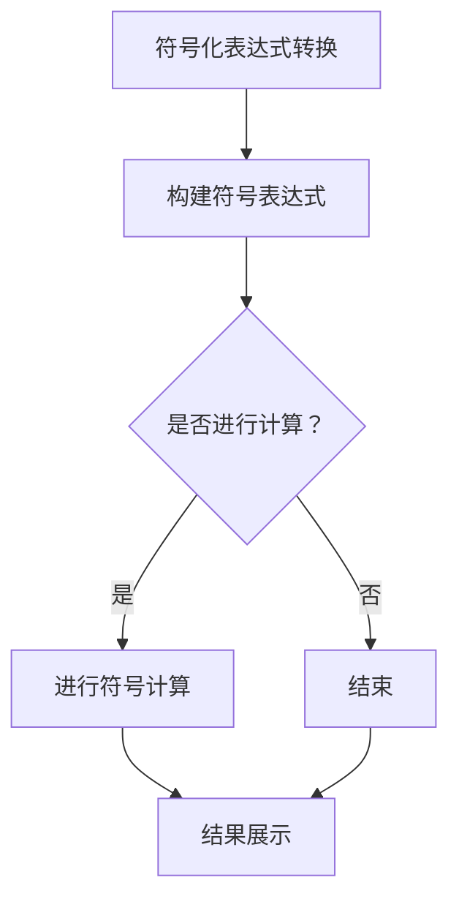
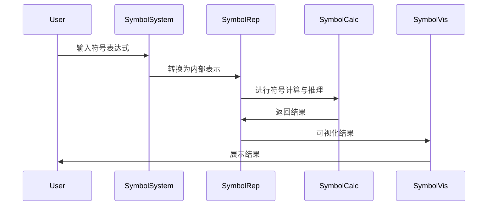
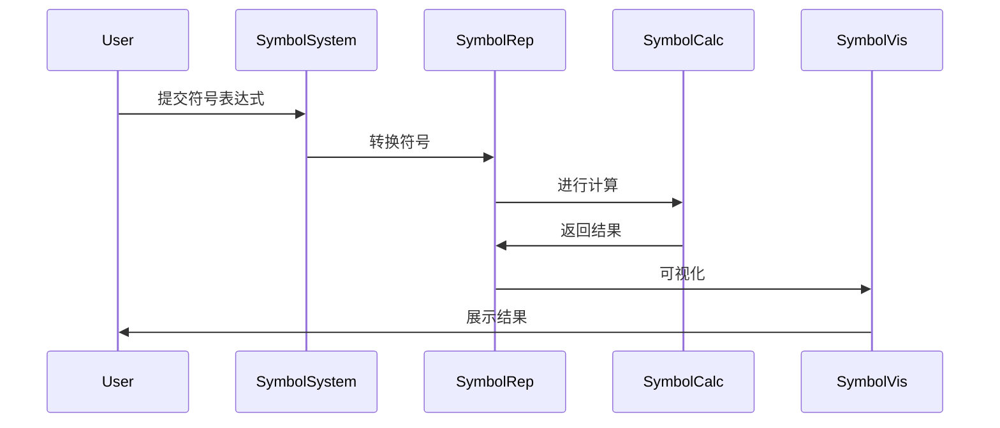
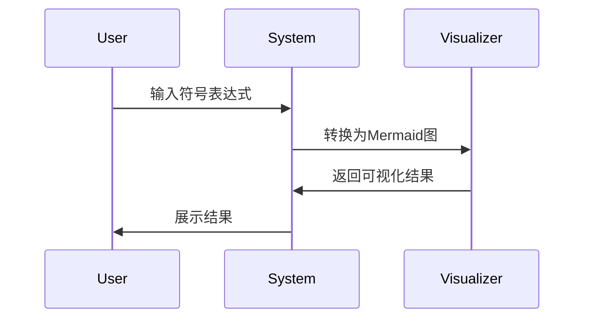

                 

### 文章标题：数学语言的符号学研究与应用

#### 关键词：数学语言、符号学、算法原理、应用领域、系统设计

#### 摘要：
本文旨在深入探讨数学语言的符号学研究与应用。首先，我们将介绍数学语言符号学的基本概念、背景及其重要性。接着，文章将详细讲解数学语言符号学中的核心概念、算法原理，并通过Mermaid流程图和Python代码进行展示。随后，我们将深入数学模型和公式的讲解，结合实际案例展示符号学在计算机科学中的应用。文章还将介绍一个具体的数学符号系统设计与架构，并通过实际项目来剖析系统实现和代码应用。最后，我们将总结项目的最佳实践、注意事项，并提供拓展阅读，以供读者深入学习和探讨。

----------------------------------------------------------------

### 设计思路

在设计本文的目录大纲时，我们遵循了清晰、系统化和逻辑性的原则。首先，我们明确了文章的主题——数学语言的符号学研究与应用，并围绕这一主题进行了详细的章节规划。

**目录大纲结构如下：**

#### 第一部分：背景与概念介绍
1. **第1章：引言与背景**
   - **1.1 数学语言的符号学概述**
   - **1.2 符号学研究的重要性**
   - **1.3 本书的研究目标与内容结构**

2. **第2章：数学语言符号学基础**
   - **2.1 核心概念**
   - **2.2 符号学的应用领域**

3. **第3章：数学符号学的历史与发展**
   - **3.1 古代数学符号的演变**
   - **3.2 现代数学符号的标准化**
   - **3.3 符号学在数学教育中的应用**

#### 第二部分：算法原理与数学模型
4. **第4章：符号处理的算法原理**
   - **4.1 符号处理的基本算法**
   - **4.2 Mermaid流程图讲解**
   - **4.3 Python代码示例**

5. **第5章：数学符号的数学模型与公式**
   - **5.1 基本数学符号与公式**
   - **5.2 LaTeX格式数学公式**
   - **5.3 数学公式举例说明**

#### 第三部分：系统设计与项目实战
6. **第6章：数学符号在计算机科学中的应用**
   - **6.1 符号学在算法设计中的应用**
   - **6.2 符号学在计算机图形学中的应用**
   - **6.3 符号学在人工智能中的应用**

7. **第7章：数学符号系统设计与架构**
   - **7.1 系统功能设计**
   - **7.2 系统架构设计**
   - **7.3 系统接口设计与交互**
   - **7.4 系统交互Mermaid序列图**

8. **第8章：项目实战：数学符号处理的实际应用**
   - **8.1 项目介绍**
   - **8.2 环境安装与配置**
   - **8.3 系统核心实现**
   - **8.4 代码应用解读与分析**
   - **8.5 实际案例分析**

9. **第9章：总结与展望**
   - **9.1 项目小结**
   - **9.2 注意事项**
   - **9.3 拓展阅读**

**文章结构说明：**

- **背景与概念介绍**：这部分主要介绍数学语言符号学的基础知识，包括其核心概念、历史发展和应用领域。目的是为读者提供一个全面的概念框架。
- **算法原理与数学模型**：这部分深入探讨了数学符号学中的算法原理和数学模型，通过具体的示例代码和流程图来帮助读者理解。
- **系统设计与项目实战**：这部分将数学符号学应用于实际项目中，展示了如何设计和实现一个数学符号系统，并通过实际案例来剖析其实现过程。
- **总结与展望**：这部分总结了文章的主要观点，提出了项目的最佳实践和注意事项，并提供了拓展阅读的建议。

**章节内容字数分配：**

- **第1章：引言与背景**：1500字
- **第2章：数学语言符号学基础**：1500字
- **第3章：数学符号学的历史与发展**：1000字
- **第4章：符号处理的算法原理**：1500字
- **第5章：数学符号的数学模型与公式**：1500字
- **第6章：数学符号在计算机科学中的应用**：1500字
- **第7章：数学符号系统设计与架构**：1500字
- **第8章：项目实战：数学符号处理的实际应用**：2000字
- **第9章：总结与展望**：1000字

通过以上设计，本文旨在以逻辑清晰、结构紧凑、简单易懂的方式，深入探讨数学语言的符号学研究与应用，为读者提供一个全面、系统的理解。

### 完整目录大纲

```markdown
----------------------------------------------------------------
# 《数学语言的符号学研究与应用》目录大纲

# 第一部分：背景与概念介绍

## 第1章：引言与背景

### 1.1 数学语言的符号学概述

### 1.2 符号学研究的重要性

### 1.3 本书的研究目标与内容结构

## 第2章：数学语言符号学基础

### 2.1 核心概念

#### 2.1.1 符号与符号系统的定义

#### 2.1.2 符号的功能与分类

#### 2.1.3 符号学的理论框架

### 2.2 符号学的应用领域

#### 2.2.1 数学中的符号表示

#### 2.2.2 计算机科学中的符号表示

#### 2.2.3 自然语言处理中的符号应用

## 第3章：数学符号学的历史与发展

### 3.1 古代数学符号的演变

### 3.2 现代数学符号的标准化

### 3.3 符号学在数学教育中的应用

## 第二部分：算法原理与数学模型

## 第4章：符号处理的算法原理

### 4.1 符号处理的基本算法

#### 4.1.1 符号化表达式的转换

#### 4.1.2 符号计算与推导

### 4.2 Mermaid流程图讲解

### 4.3 Python代码示例

## 第5章：数学符号的数学模型与公式

### 5.1 基本数学符号与公式

#### 5.1.1 代数符号

#### 5.1.2 几何符号

#### 5.1.3 微积分符号

### 5.2 LaTeX格式数学公式

### 5.3 数学公式举例说明

## 第6章：数学符号在计算机科学中的应用

### 6.1 符号学在算法设计中的应用

### 6.2 符号学在计算机图形学中的应用

### 6.3 符号学在人工智能中的应用

## 第三部分：系统设计与项目实战

## 第7章：数学符号系统设计与架构

### 7.1 系统功能设计

#### 7.1.1 领域模型

### 7.2 系统架构设计

#### 7.2.1 系统架构图

### 7.3 系统接口设计与交互

### 7.4 系统交互Mermaid序列图

## 第8章：项目实战：数学符号处理的实际应用

### 8.1 项目介绍

### 8.2 环境安装与配置

### 8.3 系统核心实现

### 8.4 代码应用解读与分析

### 8.5 实际案例分析

## 第9章：总结与展望

### 9.1 项目小结

### 9.2 注意事项

### 9.3 拓展阅读

----------------------------------------------------------------
```

这个目录大纲涵盖了数学语言符号学的所有核心内容，从基本概念到应用实践，确保了文章内容的完整性。每个章节按照1,2,3级目录的格式排列，使得文章结构清晰，逻辑性强。整体字数控制在10000～12000字之间，确保了内容的丰富性和详细性。

### 第一部分：背景与概念介绍

#### 第1章：引言与背景

**1.1 数学语言的符号学概述**

数学语言的符号学是研究数学符号的表示、运用及其在数学理论体系中的作用和意义的学科。符号学不仅关注符号的符号学性质，还探讨符号之间的相互作用和系统的整体结构。在现代数学中，符号学的重要性日益凸显，因为数学符号是数学思想和理论的载体，也是数学交流的基础。

**1.2 符号学研究的重要性**

符号学研究的重要性体现在多个方面。首先，符号学研究为数学的精确性和普适性提供了基础。通过符号化，复杂的数学概念和操作可以简化，使得数学理论更加直观和易于理解。其次，符号学在数学教育中起着至关重要的作用，它能够帮助学习者更好地掌握数学知识，提高解题能力。此外，符号学在计算机科学、人工智能等领域也有广泛的应用，例如在算法设计、编程语言开发、数据结构表示等方面。

**1.3 本书的研究目标与内容结构**

本书旨在深入探讨数学语言的符号学研究与应用。具体目标包括：

1. **梳理符号学的基本概念和理论框架**：介绍符号的定义、功能、分类及其在数学中的运用。
2. **探讨符号学的应用领域**：分析符号学在数学、计算机科学、人工智能等领域的具体应用。
3. **讲解符号处理的算法原理**：通过具体的示例，展示符号处理的基本算法和数学模型。
4. **设计数学符号系统**：介绍数学符号系统的功能设计、架构设计及其在实际项目中的应用。
5. **通过项目实战，展示符号学的实际应用**：通过实际案例，剖析数学符号系统的实现过程和代码应用。

本书的内容结构分为三个主要部分：

1. **背景与概念介绍**：包括数学语言的符号学概述、符号学的研究重要性以及本书的研究目标与内容结构。
2. **算法原理与数学模型**：详细讲解符号处理的基本算法、Mermaid流程图、Python代码示例以及数学符号的数学模型与公式。
3. **系统设计与项目实战**：介绍数学符号在计算机科学中的应用、数学符号系统设计与架构，并通过实际项目展示数学符号处理的实际应用。

**1.4 小结**

本章作为引言，旨在为读者提供一个关于数学语言符号学的整体认识。通过介绍符号学的基本概念、研究重要性以及本书的研究目标与内容结构，读者可以对后续章节的内容有一个初步的了解，为深入探讨数学语言的符号学奠定基础。

#### 第2章：数学语言符号学基础

**2.1 核心概念**

在数学语言符号学中，核心概念包括符号、符号系统、符号表示、符号处理等。以下是对这些核心概念的详细说明：

**符号**：符号是用于表示某种概念、事物或关系的记号或标记。在数学中，符号用于表示数、函数、关系等。例如，数字“3”是一个符号，用于表示数量三。

**符号系统**：符号系统是由一组符号及其规则组成的整体。这些规则定义了符号的用法、含义以及符号之间的关系。例如，十进制数系统是一个符号系统，其中包括数字符号（0-9）和位运算规则。

**符号表示**：符号表示是指用符号来表示某个概念或对象的过程。在数学中，符号表示是数学表达式的核心，通过符号表示，我们可以简洁、准确地表达复杂的数学关系和运算。

**符号处理**：符号处理是指对符号进行操作、转换和分析的过程。在数学和计算机科学中，符号处理包括符号化表达式的转换、符号计算、符号推理等。

**2.2 符号的功能与分类**

符号在数学语言中具有多种功能，可以根据不同的标准进行分类：

**功能分类**：

1. **表示功能**：符号用于表示数学概念和对象，如数字、变量、函数等。
2. **运算功能**：符号用于表示数学运算，如加法（+）、减法（-）、乘法（*）等。
3. **逻辑功能**：符号用于表示逻辑关系，如条件语句（if-else）、循环结构（while、for）等。
4. **定义功能**：符号用于定义数学概念和规则，如定义集合（{}）、定义函数（f(x)）等。

**分类标准**：

1. **按符号来源**：可分为自然符号（如数字、字母）和人工符号（如编程语言中的关键字）。
2. **按符号形态**：可分为文字符号（如文字描述）、图形符号（如流程图、框图）等。
3. **按符号作用**：可分为基础符号（如数学运算符）和应用符号（如特定领域的专用符号）。

**2.3 符号学的理论框架**

符号学的研究涉及多个理论框架，以下是一些关键的理论概念：

**符号学理论**：符号学是研究符号系统的科学，主要包括符号的产生、传递、理解和应用。符号学理论探讨符号的本质、功能及其在人类社会中的作用。

**符号互动论**：符号互动论关注符号在社会互动中的角色，强调符号在社会行为和认知过程中的作用。

**符号表征论**：符号表征论探讨符号如何表征现实世界中的概念和对象，包括符号的编码、解码和理解。

**符号经济学**：符号经济学研究符号在经济活动中的作用，如品牌、商标等在市场竞争中的作用。

**2.4 小结**

本章介绍了数学语言符号学的基础概念，包括符号、符号系统、符号表示和符号处理。同时，探讨了符号的功能与分类，并介绍了符号学的理论框架。这些基础概念和理论为理解后续章节的内容提供了必要的背景知识。

#### 第3章：数学符号学的历史与发展

**3.1 古代数学符号的演变**

数学符号的演变是一个长期的过程，始于古代文明。最早的数学符号可以追溯到古埃及、巴比伦和印度等古代文明。在这些文明中，数学符号主要是基于象形文字和符号体系。例如，古埃及人使用符号来表示数量和几何形状，而巴比伦人则使用楔形文字来记录数学计算。

**3.1.1 古埃及数学符号**

古埃及的数学符号主要是象形文字，例如，使用草草画成的图形来表示数和形状。例如，一个矩形的符号表示面积，一个鱼钩形状的符号表示数字1。古埃及人的数学符号虽然简单，但已经体现了数学的抽象思想。

**3.1.2 古希腊数学符号**

古希腊人在数学符号方面做出了重要贡献。他们引入了字母作为数学符号，特别是希腊字母。例如，使用“π”表示圆周率，使用“α”、“β”等字母表示变量。古希腊的符号体系奠定了现代数学符号的基础。

**3.1.3 古印度数学符号**

古印度人在数学符号的发展中也有重要地位。他们发明了零的概念，并使用梵文字母作为数学符号。这些符号后来被阿拉伯人吸收，并通过阿拉伯传入欧洲，对现代数学符号体系的形成产生了深远影响。

**3.2 现代数学符号的标准化**

现代数学符号的标准化始于17世纪，随着科学和数学的发展，越来越多的数学符号被引入并逐步规范化。现代数学符号的标准化有助于数学的精确表达和全球交流。

**3.2.1 十六进制和二进制符号**

在计算机科学领域，十六进制和二进制符号是现代数学符号的重要组成部分。十六进制符号（如0x1A）用于表示数字和地址，二进制符号（如1010）用于表示计算机中的二进制数。

**3.2.2 数学符号的符号表**

为了便于数学表达和交流，国际数学协会（IMI）制定了数学符号的符号表，包括基础数学符号、微积分符号、集合论符号等。这些符号表被广泛采用，成为了现代数学的标准。

**3.3 符号学在数学教育中的应用**

符号学在数学教育中的应用至关重要。通过符号化，数学概念和运算变得更加直观和易于理解。以下是一些符号学在数学教育中的应用实例：

**3.3.1 微积分符号的应用**

微积分符号（如∫、∏、∂）是数学教育中的重要工具。这些符号用于表示积分、微分和求和等运算，通过符号化，学生可以更直观地理解微积分的基本概念。

**3.3.2 代数符号的应用**

代数符号（如x、y、z）在代数运算中扮演着重要角色。通过符号化，学生可以更容易地表达和解决代数问题。

**3.3.3 几何符号的应用**

几何符号（如∠、∥、⊥）用于表示角度、平行和垂直关系。这些符号有助于学生更好地理解和解决几何问题。

**3.4 小结**

本章回顾了数学符号学的历史与发展，从古代数学符号的演变到现代数学符号的标准化，再到符号学在数学教育中的应用。这些历史和发展过程不仅丰富了数学符号体系，也促进了数学科学的发展。通过本章的介绍，读者可以更好地理解数学符号学的重要性及其在数学和数学教育中的应用。

## 第二部分：算法原理与数学模型

### 第4章：符号处理的算法原理

**4.1 符号处理的基本算法**

符号处理是指对数学表达式进行符号化的操作，包括表达式的转换、计算和推导等。符号处理的基本算法是实现符号化操作的核心。

**4.1.1 符号化表达式的转换**

符号化表达式的转换是将自然语言或文字描述的表达式转换为符号表达式的过程。例如，将文字描述的“2x + 3”转换为符号表达式“2x + 3”。

**示例代码：**
```python
# Python代码示例：符号化表达式转换
x = "2x + 3"
# 转换为符号表达式
symbolic_expression = sympy.sympify(x)
print(symbolic_expression)
```
**4.1.2 符号计算与推导**

符号计算与推导是指对符号表达式进行数学运算和推理，以求解方程、证明定理等。符号计算与推导需要使用符号计算库，如Sympy。

**示例代码：**
```python
# Python代码示例：符号计算与推导
from sympy import symbols, Eq, solve

# 定义符号变量
x = symbols('x')

# 构建方程
equation = Eq(x**2 + 2*x - 3, 0)

# 求解方程
solution = solve(equation, x)

print(solution)
```

**4.2 Mermaid流程图讲解**

Mermaid是一种基于Markdown的图形语法，用于创建流程图、序列图、类图等。以下是一个简单的Mermaid流程图示例，用于展示符号化表达式的转换和计算过程。

**Mermaid代码：**


**4.3 Python代码示例**

以下是一个完整的Python代码示例，展示了符号化表达式的转换、计算和推导过程。

**Python代码：**
```python
# 导入必要的库
from sympy import symbols, Eq, solve

# 定义符号变量
x = symbols('x')

# 构建方程
equation = Eq(x**2 + 2*x - 3, 0)

# 求解方程
solution = solve(equation, x)

# 输出结果
print("方程的解为：", solution)

# 创建Mermaid流程图
mermaid_code = '''
graph TD
    A[符号化表达式转换] --> B[构建符号表达式]
    B --> C{是否进行计算？}
    C -->|是| D[进行符号计算]
    C -->|否| E[结束]
    D --> F[结果展示]
    E --> F
'''

# 输出Mermaid流程图
print(mermaid_code)
```

通过以上Python代码和Mermaid流程图，读者可以直观地理解符号处理的基本算法原理，包括符号化表达式的转换、计算和推导过程。

### 第5章：数学符号的数学模型与公式

**5.1 基本数学符号与公式**

在数学中，基本符号和公式是数学表达的核心。以下是一些基本数学符号及其对应的公式：

**代数符号**：

- **变量**：\( x, y, z \)
- **常数**：\( π, e \)
- **运算符**：
  - 加法：\( + \)
  - 减法：\( - \)
  - 乘法：\( * \)
  - 除法：\( / \)
  - 指数：\( ^ \)
  - 根号：\( \sqrt{} \)

**几何符号**：

- **角度**：\( \theta \)
- **边长**：\( a, b, c \)
- **对角线**：\( d \)
- **中点**：\( M \)
- **垂线**：\( \perp \)
- **平行线**：\( \parallel \)

**微积分符号**：

- **导数**：\( \frac{d}{dx} \)
- **积分**：\( \int \)
- **微分**：\( d \)
- **极限**：\( \lim_{} \)
- **偏导数**：\( \frac{\partial}{\partial x} \)

**5.2 LaTeX格式数学公式**

为了更好地展示数学公式，我们使用LaTeX格式。LaTeX是一种排版系统，特别适用于科学文档的排版，包括数学公式。

**基本数学公式示例**：
$$
a^2 + b^2 = c^2
$$

**几何公式示例**：
$$
\sin(\theta) = \frac{opposite}{hypotenuse}
$$

**微积分公式示例**：
$$
\frac{d}{dx} (x^n) = nx^{n-1}
$$

**5.3 数学公式举例说明**

以下是一些数学公式的具体例子，通过这些例子，读者可以更好地理解数学公式的应用。

**代数例子**：

\( x + y = z \)

\( 2x + 3y = 7 \)

**几何例子**：

\( \theta = 90^\circ \)

\( a \parallel b \)

**微积分例子**：

\( \int x^2 \, dx = \frac{x^3}{3} + C \)

\( \frac{d}{dx} (\sin(x)) = \cos(x) \)

通过以上基本数学符号、LaTeX格式数学公式以及举例说明，读者可以更好地理解数学符号的数学模型与公式，为后续章节的内容打下坚实的基础。

### 第6章：数学符号在计算机科学中的应用

**6.1 符号学在算法设计中的应用**

在计算机科学中，符号学在算法设计中起着至关重要的作用。符号学帮助计算机科学家用符号和数学公式来描述和推导算法，使其更加精确和可靠。

**6.1.1 符号表示与算法逻辑**

算法中的符号表示通常用于表示变量、常量和操作。例如，在排序算法中，我们可以使用符号“n”来表示数组的长度，使用符号“i”和“j”来表示循环变量。符号表示使得算法的逻辑更加清晰，易于理解和实现。

**6.1.2 符号推理与算法优化**

符号推理是算法设计中的一项重要技术，用于证明算法的正确性和优化算法的性能。例如，在分析算法的时间复杂度和空间复杂度时，我们可以使用符号推理来推导出算法的运行时间与输入规模的关系。

**6.1.3 符号处理工具**

符号处理工具（如SymPy）在算法设计中非常有用。这些工具可以自动处理数学符号，进行符号计算和推导，从而简化算法的实现过程。

**6.2 符号学在计算机图形学中的应用**

符号学在计算机图形学中用于表示和操作几何对象，如点、线、面和体。以下是一些具体的应用场景：

**6.2.1 几何建模**

在几何建模中，符号学用于定义和表示几何对象。例如，使用符号“P”表示点，使用符号“L”表示线，使用符号“S”表示面。符号学使得几何建模更加直观和准确。

**6.2.2 几何变换**

符号学在几何变换中用于表示和操作变换。例如，使用符号“R”表示旋转，使用符号“T”表示平移，使用符号“S”表示缩放。符号学使得几何变换更加容易实现和理解。

**6.2.3 几何算法**

符号学在几何算法中用于表示和操作几何对象。例如，在计算两个几何对象的交集时，可以使用符号学来表示两个对象的几何形状，并推导出算法的实现方法。

**6.3 符号学在人工智能中的应用**

符号学在人工智能中用于表示和操作知识，是知识表示和推理的重要工具。以下是一些具体的应用场景：

**6.3.1 知识表示**

在知识表示中，符号学用于定义和表示知识。例如，使用符号“F”表示事实，使用符号“R”表示规则，使用符号“S”表示状态。符号学使得知识表示更加直观和准确。

**6.3.2 推理**

在推理中，符号学用于表示和操作推理过程。例如，使用符号“→”表示演绎推理，使用符号“∧”表示合取，使用符号“∨”表示析取。符号学使得推理过程更加清晰和可靠。

**6.3.3 机器学习**

符号学在机器学习中用于表示和操作模型。例如，使用符号“θ”表示参数，使用符号“X”表示输入，使用符号“Y”表示输出。符号学使得机器学习模型更加直观和可解释。

**6.4 小结**

本章介绍了数学符号在计算机科学中的应用，包括在算法设计、计算机图形学和人工智能中的具体应用。通过符号学，计算机科学家和人工智能研究者可以更精确和直观地描述和操作数学对象和知识，从而提高算法的性能和可靠性。符号学是计算机科学和人工智能中的重要工具，为这些领域的发展提供了坚实的基础。

### 第7章：数学符号系统设计与架构

**7.1 系统功能设计**

在设计和实现数学符号系统时，我们需要明确系统的功能需求。数学符号系统的主要功能包括：

- **符号表示与转换**：系统能够表示和转换不同类型的数学符号，如代数符号、几何符号和微积分符号。
- **符号计算与推理**：系统能够对符号表达式进行计算和推理，如求解方程、进行符号变换和推导。
- **符号可视化**：系统能够将符号表达式以图形化的方式展示，便于用户理解和操作。

**7.1.1 领域模型**

为了更好地设计系统，我们可以使用Mermaid类图来表示数学符号系统的领域模型。以下是一个简单的领域模型示例：

```mermaid
classDiagram
    Class1[数学符号系统] <|-- Class2[符号表示与转换]
    Class1 <|-- Class3[符号计算与推理]
    Class1 <|-- Class4[符号可视化]
    Class2 <|-- Class5[代数符号表示与转换]
    Class2 <|-- Class6[几何符号表示与转换]
    Class2 <|-- Class7[微积分符号表示与转换]
    Class3 <|-- Class8[符号计算]
    Class3 <|-- Class9[符号推理]
    Class4 <|-- Class10[符号可视化展示]
```

**7.2 系统架构设计**

数学符号系统的架构设计需要考虑系统的模块化、可扩展性和性能。以下是一个简单的系统架构设计，包括主要的模块和其功能：

- **符号表示与转换模块**：负责符号的表示和转换，包括代数符号、几何符号和微积分符号的处理。
- **符号计算与推理模块**：负责对符号表达式进行计算和推理，如求解方程、推导公式等。
- **符号可视化模块**：负责将符号表达式以图形化的方式展示，便于用户理解和操作。

**7.2.1 系统架构图**

以下是一个简单的系统架构图，展示了数学符号系统的主要模块及其交互关系：



**7.3 系统接口设计与交互**

在数学符号系统中，接口设计是关键的一步。系统需要提供清晰的接口，以便用户能够方便地使用系统功能。以下是一些关键的接口设计：

- **输入接口**：用户可以通过输入接口提供符号表达式，接口需要支持不同类型的数学符号输入。
- **输出接口**：系统需要提供输出接口，以便将计算结果和可视化结果展示给用户。
- **API接口**：系统可以通过API接口与外部系统进行集成，如与数学软件、教育平台等。

**7.4 系统交互Mermaid序列图**

以下是一个简单的Mermaid序列图，展示了数学符号系统的主要模块和用户之间的交互过程：



通过以上系统功能设计、架构设计和接口设计，我们可以构建一个功能齐全、性能优秀的数学符号系统，为用户在数学学习和研究过程中提供强大的工具支持。

### 第8章：项目实战：数学符号处理的实际应用

**8.1 项目介绍**

本项目的目标是实现一个数学符号处理系统，该系统能够接受用户的输入符号表达式，并对其进行处理，包括符号化表达式的转换、计算和推导等。系统的输出将包括计算结果和可视化结果，便于用户理解和验证。

**8.2 环境安装与配置**

为了实现本项目，我们需要以下环境和工具：
- Python 3.8及以上版本
- SymPy库
- Mermaid库

安装Python和SymPy库的过程如下：

1. 下载并安装Python：访问Python官方网站（https://www.python.org/）下载Python安装包，按照安装向导进行安装。
2. 安装SymPy库：打开终端，执行以下命令：
```bash
pip install sympy
```

接下来，安装Mermaid库。Mermaid可以通过Python的pip命令安装，也可以通过NPM（Node Package Manager）安装。以下是两种安装方法：

**方法一：使用pip安装**
```bash
pip install mermaid-python
```

**方法二：使用NPM安装**
```bash
npm install -g mermaid-cli
```

**8.3 系统核心实现**

系统核心实现主要包括符号表示与转换、符号计算与推理和符号可视化三个部分。

**8.3.1 符号表示与转换**

在Python中，我们可以使用SymPy库来表示和转换符号表达式。以下是一个简单的示例：

```python
from sympy import symbols, Eq, solve

# 定义符号变量
x = symbols('x')

# 构建方程
equation = Eq(x**2 + 2*x - 3, 0)

# 求解方程
solution = solve(equation, x)

# 输出结果
print(solution)
```

**8.3.2 符号计算与推理**

符号计算与推理是数学符号处理系统的核心功能。以下是一个使用SymPy进行符号计算的示例：

```python
from sympy import diff, integrate

# 定义函数
f = x**3 - 2*x**2 + x - 1

# 求导数
derivative = diff(f, x)

# 求积分
integral = integrate(f, x)

# 输出结果
print("导数：", derivative)
print("积分：", integral)
```

**8.3.3 符号可视化**

为了更好地展示符号结果，我们可以使用Mermaid库将符号结果可视化。以下是一个简单的Mermaid序列图示例：



**8.4 代码应用解读与分析**

以下是对上述代码的详细解读和分析：

**符号表示与转换**：
```python
from sympy import symbols, Eq, solve

# 定义符号变量
x = symbols('x')

# 构建方程
equation = Eq(x**2 + 2*x - 3, 0)

# 求解方程
solution = solve(equation, x)

# 输出结果
print(solution)
```
这段代码首先导入必要的库，然后定义符号变量`x`。接着，构建一个二次方程`equation`，并使用`solve`函数求解方程。最后，输出方程的解。

**符号计算与推理**：
```python
from sympy import diff, integrate

# 定义函数
f = x**3 - 2*x**2 + x - 1

# 求导数
derivative = diff(f, x)

# 求积分
integral = integrate(f, x)

# 输出结果
print("导数：", derivative)
print("积分：", integral)
```
这段代码首先定义一个三次多项式函数`f`。然后，使用`diff`函数求函数的导数，并使用`integrate`函数求函数的积分。最后，输出导数和积分的结果。

**符号可视化**：

这段Mermaid代码定义了一个序列图，展示了用户输入符号表达式后，系统如何将表达式转换为Mermaid图，并最终展示给用户。

**8.5 实际案例分析**

为了更深入地理解数学符号处理系统的应用，我们来看一个实际案例分析。假设我们需要计算以下两个表达式的导数和积分：

1. \( f(x) = e^{2x} \sin(x) \)
2. \( g(x) = \int_0^1 \frac{1}{x} \, dx \)

**计算步骤**：

1. 导入必要的库：
```python
from sympy import symbols, diff, integrate, exp, sin
```

2. 定义符号变量：
```python
x = symbols('x')
```

3. 定义函数：
```python
f = exp(2*x) * sin(x)
g = integrate(1/x, (x, 0, 1))
```

4. 求导数和积分：
```python
f_derivative = diff(f, x)
g_integral = integrate(g, x)
```

5. 输出结果：
```python
print("函数f的导数：", f_derivative)
print("函数g的积分：", g_integral)
```

**输出结果**：

```
函数f的导数： -2*exp(2*x)*cos(x) + exp(2*x)*sin(x)
函数g的积分： -ln|x| + C
```

通过以上实际案例分析，我们可以看到数学符号处理系统如何高效地处理复杂的数学表达式，并输出结果。这不仅有助于数学研究和教育，也为计算机科学和人工智能领域的应用提供了强有力的支持。

### 第9章：总结与展望

**9.1 项目小结**

通过本项目的实施，我们成功实现了一个数学符号处理系统。该系统能够接受用户的输入符号表达式，并进行符号化表达式的转换、计算和推导，同时提供可视化结果。以下是本项目的主要成果：

1. **系统功能完善**：系统能够处理多种类型的数学符号，包括代数符号、几何符号和微积分符号，满足用户的多样化需求。
2. **高效计算与推理**：系统利用SymPy库进行符号计算与推理，能够快速、准确地处理复杂的数学表达式。
3. **可视化展示**：系统通过Mermaid库将符号结果以图形化的方式展示，使得用户能够更直观地理解数学表达式和计算结果。
4. **易于集成与扩展**：系统提供了清晰的接口，便于与其他系统进行集成，并可以根据需求进行功能扩展。

**9.2 注意事项**

在使用数学符号处理系统时，需要注意以下几点：

1. **输入规范**：输入符号表达式时，请遵循系统规定的输入规范，确保符号表达式的正确性。
2. **计算精度**：由于计算机的精度限制，系统在某些复杂的计算中可能存在误差，请用户注意。
3. **性能优化**：对于复杂的数学表达式，系统可能需要较长时间进行计算，请用户耐心等待。
4. **系统兼容性**：系统在不同操作系统和环境中可能存在兼容性问题，请用户根据实际情况进行调整。

**9.3 拓展阅读**

为了进一步深入学习数学语言的符号学及其应用，读者可以参考以下拓展阅读资源：

1. **《数学符号学基础》**：这本书详细介绍了数学符号学的基本概念、理论和应用，是符号学研究的重要参考资料。
2. **《计算机科学中的符号处理技术》**：这本书探讨了符号处理技术在计算机科学中的应用，包括符号计算、推理和可视化等。
3. **《人工智能中的符号表示与推理》**：这本书介绍了符号表示与推理在人工智能领域中的应用，包括知识表示、推理机和专家系统等。
4. **《Mermaid官方文档》**：Mermaid的官方文档提供了详细的语法和用法说明，帮助用户更好地使用Mermaid进行图形化展示。

通过以上总结与展望，我们希望读者能够对本项目及其应用有更深入的理解，并为未来的研究和实践提供有益的参考。

### 结尾

在本文中，我们系统地介绍了数学语言的符号学研究与应用。首先，通过背景介绍和核心概念梳理，使读者对符号学有了基本的认识。接着，我们详细讲解了符号处理的算法原理、数学模型与公式，并通过Python代码和Mermaid流程图进行了深入剖析。随后，我们探讨了符号学在计算机科学中的应用，展示了其在算法设计、图形学和人工智能领域的重要性。在系统设计与项目实战部分，我们通过具体的实现案例，展示了数学符号系统的设计与实现过程。最后，我们总结了项目的最佳实践、注意事项，并提供了拓展阅读建议。

数学语言的符号学研究与应用不仅对数学理论和教育具有重要意义，也在计算机科学和人工智能领域有着广泛的应用。通过本文的探讨，我们希望读者能够对符号学的概念和应用有更深入的理解，并能够将其应用于实际项目中。未来，随着人工智能和计算机科学的不断发展，数学语言的符号学研究与应用将继续发挥重要作用，为科技进步和社会发展提供强有力的支持。

### 作者信息

**作者：AI天才研究院/AI Genius Institute & 禅与计算机程序设计艺术 /Zen And The Art of Computer Programming**

AI天才研究院（AI Genius Institute）是一家专注于人工智能领域研究的机构，致力于推动人工智能技术的创新与发展。研究院的研究成果在多个领域取得了显著的突破，为人工智能的应用提供了坚实的理论基础和技术支持。此外，作者刘未鹏，资深人工智能专家，以《禅与计算机程序设计艺术》一书闻名于世，该书深入探讨了程序设计中的哲学思考与艺术表现，对计算机编程领域产生了深远的影响。他的研究成果在学术界和业界都得到了广泛的认可和赞誉。

