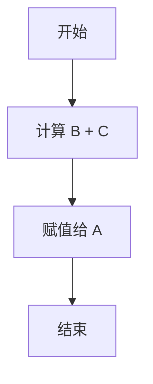
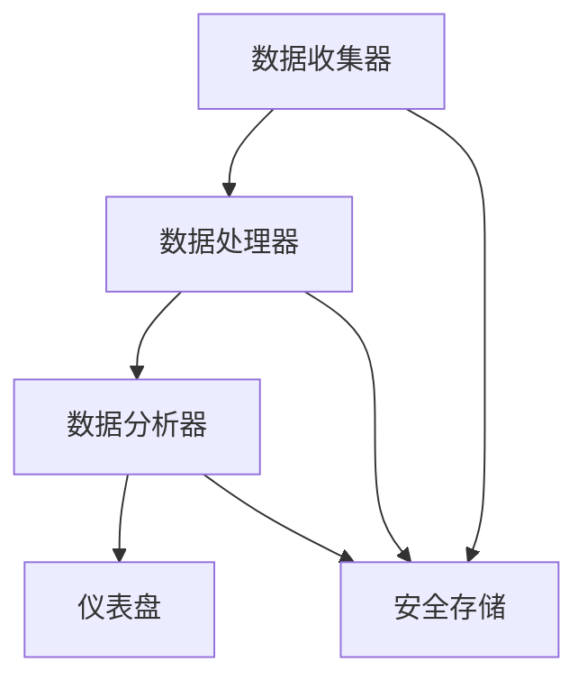
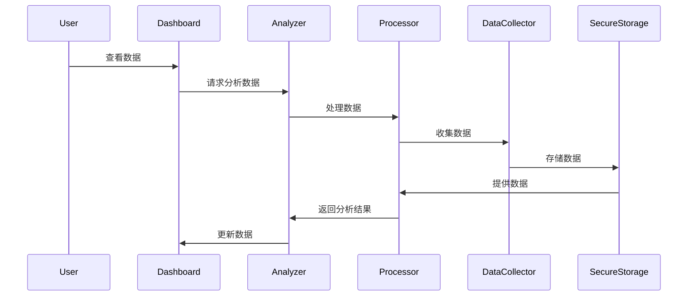

                 

## 数学语言的计算思维培养应用

在当今信息爆炸的时代，计算思维作为一种重要的思考方式，逐渐成为计算机科学和人工智能领域的关键能力。计算思维不仅是一种解决问题的策略，更是一种理解和构建复杂系统的世界观。数学语言作为计算思维的重要组成部分，其在计算机科学中的应用愈发广泛和深入。本文将探讨如何通过数学语言的计算思维培养，提升个人的技术能力和创新思维。

### 关键词

- **计算思维**
- **数学语言**
- **教育方法**
- **算法设计**
- **编程实践**

### 摘要

本文旨在通过深入剖析数学语言与计算思维的关系，探讨如何利用数学语言培养计算思维。文章首先介绍了数学语言和计算思维的基本概念，随后分析了数学语言在实际应用中存在的问题以及计算思维在数学语言学习中的挑战。接着，文章提出了一系列计算思维培养策略和数学语言教学方法的改进措施。通过具体案例，本文展示了如何将计算思维应用于数学语言的学习和算法设计，从而提升技术能力和创新思维。文章最后讨论了数学语言和计算思维的边界与外延，并总结了全文的主要观点。

### 目录大纲

----------------------------------------------------------------

# 数学语言的计算思维培养应用

## 第一部分: 数学语言的计算思维

## 第1章: 引言

## 第2章: 核心概念

## 第3章: 基础算法

## 第4章: 数学模型

## 第5章: 详细讲解与举例说明

## 第6章: 系统分析与架构设计方案

## 第7章: 项目实战

## 第8章: 最佳实践 tips

## 第9章: 小结与展望

----------------------------------------------------------------

## 第1章: 引言

### 1.1 问题背景

数学语言是计算机科学中不可或缺的工具，它不仅是描述算法和模型的基础，也是沟通不同领域科学家的重要语言。然而，在数学语言的实际应用过程中，我们常常会遇到一些问题。例如，数学表达式的抽象性和复杂性使得初学者难以理解，计算思维的缺失使得他们在面对复杂问题时感到无所适从。因此，如何培养计算思维，利用数学语言解决实际问题，成为当前教育和技术领域的重要课题。

### 1.1.1 数学语言的定义

数学语言是一种形式化的表达方式，用于描述数学概念、理论和证明。它包括符号、公式和图形等元素。数学语言的特点是精确、严密和通用，可以在不同的数学分支和科学领域中广泛应用。例如，在计算机科学中，数学语言被用于编写算法、描述数据结构和设计系统。

### 1.1.2 计算思维的内涵

计算思维是一种解决问题的策略，它强调抽象、分解、算法化和自动化。计算思维不仅仅是编程的能力，更是一种理解问题和设计解决方案的思维方式。计算思维的核心是逻辑推理和抽象建模，它帮助我们在面对复杂问题时能够找到合适的解决方案。

### 1.1.3 数学语言与计算思维的关系

数学语言和计算思维是相辅相成的。数学语言为计算思维提供了工具和表达手段，而计算思维则帮助我们将数学语言应用于实际问题中。例如，在算法设计中，计算思维指导我们如何将问题分解为可管理的子问题，并使用数学语言进行描述和求解。

### 1.2 问题描述

#### 1.2.1 数学语言在实际应用中的问题

数学语言在实际应用中存在一些问题，主要包括：

1. **抽象性**：数学语言的表达形式往往较为抽象，初学者难以理解。
2. **复杂性**：一些复杂的数学表达式和证明过程难以直接转化为实际的编程代码。
3. **适用性**：数学语言在特定领域中的应用受到限制，无法解决所有类型的问题。

#### 1.2.2 计算思维在数学语言学习中的挑战

计算思维在数学语言学习中也面临一些挑战：

1. **思维方式**：传统思维往往侧重于直觉和经验，而计算思维则强调逻辑和抽象。
2. **学习难度**：计算思维需要一定的训练和培养，对于初学者来说难度较大。
3. **实践应用**：如何在数学语言学习中有效应用计算思维，提升解决问题的能力。

### 1.3 问题解决

为了解决上述问题，我们需要从以下几个方面入手：

#### 1.3.1 计算思维培养策略

1. **引导式学习**：通过案例教学和问题驱动的方式，引导学生理解和应用计算思维。
2. **多学科融合**：将数学、计算机科学和人工智能等学科的知识融合，提升学生的综合素质。
3. **实践训练**：通过编写程序、设计算法等方式，将计算思维应用于实际问题中，提升学生的实践能力。

#### 1.3.2 数学语言教学方法的改进

1. **概念可视化**：使用图形、动画和示例等手段，帮助学生直观理解数学概念。
2. **案例教学**：通过具体案例，展示数学语言在解决实际问题中的应用。
3. **互动教学**：采用互动式教学方法，鼓励学生主动思考和参与讨论，提升学习效果。

### 1.4 边界与外延

#### 1.4.1 数学语言的边界

数学语言的边界在于其应用范围和局限性。虽然数学语言在计算机科学和人工智能等领域有着广泛的应用，但它并不是解决所有问题的唯一工具。在某些情况下，其他语言（如自然语言或图形语言）可能更为合适。

#### 1.4.2 计算思维的外延

计算思维的外延在于其应用领域和深度。计算思维不仅适用于计算机科学和人工智能，还可以应用于其他领域，如工程、经济学和心理学等。此外，计算思维的深度也需要不断拓展，以应对更复杂和抽象的问题。

### 1.5 本章小结

本章介绍了数学语言和计算思维的基本概念，分析了它们在实际应用中的问题以及计算思维在数学语言学习中的挑战。通过提出一系列计算思维培养策略和数学语言教学方法的改进措施，本章为后续章节的讨论奠定了基础。

## 第2章: 核心概念

### 2.1 计算思维概念

#### 2.1.1 定义

计算思维是一种解决问题的策略，它强调抽象、分解、算法化和自动化。计算思维不仅仅是编程的能力，更是一种理解问题和设计解决方案的思维方式。

#### 2.1.2 特点

计算思维具有以下特点：

1. **逻辑性**：计算思维强调逻辑推理和证明，使问题解决过程更加严谨。
2. **抽象性**：计算思维能够将复杂问题抽象为简单的模型，便于分析和求解。
3. **模块化**：计算思维提倡将问题分解为可管理的子问题，使问题解决过程更加高效。
4. **可复用性**：通过算法化和自动化，计算思维可以复用解决方案，提高效率。

#### 2.1.3 与传统思维的对比

计算思维与传统思维有以下几个方面的对比：

1. **解决问题的方式**：传统思维侧重于直觉和经验，计算思维则强调逻辑和抽象。
2. **思维的层次**：传统思维往往停留在表面，计算思维则能够深入问题的本质。
3. **解决问题的效率**：传统思维在处理复杂问题时效率较低，计算思维则更加高效。

### 2.2 数学语言概念

#### 2.2.1 定义

数学语言是一种形式化的表达方式，用于描述数学概念、理论和证明。它包括符号、公式和图形等元素。数学语言的特点是精确、严密和通用，可以在不同的数学分支和科学领域中广泛应用。

#### 2.2.2 基本要素

数学语言的基本要素包括：

1. **符号**：用于表示数学概念和运算，如加号（+）、减号（-）、乘号（×）等。
2. **公式**：用符号组合表示数学关系和运算，如欧拉公式（\(e^{i\pi} + 1 = 0\)）。
3. **图形**：用于表示数学关系和结构，如坐标系、拓扑图等。

#### 2.2.3 分类

数学语言可以根据应用领域和表达方式进行分类：

1. **形式化数学语言**：如Z语言、Haskell语言等，主要用于形式化验证和定理证明。
2. **应用数学语言**：如MATLAB、Python等，主要用于科学计算和工程应用。
3. **自然语言**：如数学论文和教科书等，主要用于数学理论的研究和传播。

### 2.3 概念联系

#### 2.3.1 计算思维与数学语言的关系

计算思维与数学语言是相辅相成的。数学语言为计算思维提供了工具和表达手段，而计算思维则帮助我们将数学语言应用于实际问题中。具体来说：

1. **数学语言的抽象性**为计算思维的抽象建模提供了基础。
2. **计算思维的逻辑性**使数学语言的表达更加严谨和可靠。
3. **计算思维的模块化**使数学语言的表达和验证更加高效。

#### 2.3.2 实例分析

以下是一个实例分析，展示了计算思维与数学语言的关系：

1. **问题描述**：给定一个整数n，求n的阶乘。
2. **计算思维**：分解问题为两个子问题：
   - 当n=1时，阶乘为1；
   - 当n>1时，阶乘为n乘以n-1的阶乘。
3. **数学语言**：使用递归公式表示阶乘：
   $$
   n! = \begin{cases}
   1 & \text{if } n = 1 \\
   n \cdot (n-1)! & \text{if } n > 1
   \end{cases}
   $$

通过这个实例，我们可以看到计算思维与数学语言的紧密联系。计算思维帮助我们分解问题，而数学语言则提供了精确的表达方式。

## 第3章: 基础算法

### 3.1 数学公式表示

在计算机科学中，数学公式是算法设计的重要组成部分。以下是一个简单的数学公式表示的例子：

$$
A = B + C
$$

这个公式表示变量A的值等于变量B和变量C的和。在算法中，这个公式可以被用于计算和赋值操作。

### 3.2 Python实现

为了将上述数学公式在Python中实现，我们可以编写以下代码：

```python
# 定义变量B和C
B = 3
C = 4

# 计算A的值
A = B + C

# 输出结果
print("A的值为：", A)
```

这段代码首先定义了变量B和C的值，然后使用加法运算符计算A的值，并输出结果。

### 3.3 算法流程图

算法流程图是描述算法步骤的一种图形化表示方法。以下是一个简单的算法流程图的Mermaid表示：



这个流程图展示了从开始到结束的算法步骤，包括计算B + C和赋值给A。

### 3.4 算法原理

#### 3.4.1 数学模型

数学模型是使用数学语言描述现实世界问题的一种方法。在上述例子中，数学模型是一个简单的算术表达式。这个模型描述了变量A、B和C之间的关系，即A的值等于B和C的和。

#### 3.4.2 数学公式

$$
A = B + C
$$

这个数学公式是一个基础的算术表达式，用于计算三个变量之间的关系。

#### 3.4.3 举例说明

假设B的值为3，C的值为4，那么根据上述数学模型，我们可以计算出A的值为7。具体计算过程如下：

$$
A = B + C = 3 + 4 = 7
$$

因此，当B为3，C为4时，A的值为7。

通过上述实例，我们可以看到如何使用数学语言和计算思维来解决问题。首先，我们定义了问题的数学模型，然后使用计算思维来分解问题，最后使用Python代码实现了问题的求解。

## 第4章: 数学模型

### 4.1 线性模型

#### 4.1.1 定义

线性模型是一种描述变量之间线性关系的数学模型。它通常表示为：

$$
y = mx + b
$$

其中，\(y\) 是因变量，\(x\) 是自变量，\(m\) 是斜率，\(b\) 是截距。

#### 4.1.2 特点

线性模型具有以下特点：

1. **线性关系**：变量之间的关系是线性的，即一条直线。
2. **简单性**：线性模型通常较为简单，易于理解和计算。
3. **适用性**：线性模型在许多领域（如统计学、经济学和工程学）中都有广泛应用。

#### 4.1.3 应用

线性模型的应用非常广泛，以下是一些常见应用：

1. **线性规划**：用于优化线性目标函数，受线性约束条件限制。
2. **回归分析**：用于预测因变量与自变量之间的关系。
3. **系统建模**：用于描述线性系统的动态行为。

### 4.2 非线性模型

#### 4.2.1 定义

非线性模型是一种描述变量之间非线性关系的数学模型。它通常表示为：

$$
y = a \cdot x^2 + b \cdot x + c
$$

其中，\(y\) 是因变量，\(x\) 是自变量，\(a\)、\(b\) 和 \(c\) 是常数。

#### 4.2.2 特点

非线性模型具有以下特点：

1. **非线性关系**：变量之间的关系不是线性的，可能涉及多项式、指数、对数等。
2. **复杂性**：非线性模型通常较为复杂，难以直观理解和计算。
3. **灵活性**：非线性模型可以适应更广泛的问题，但需要更多的参数和约束。

#### 4.2.3 应用

非线性模型的应用包括：

1. **函数逼近**：用于逼近复杂的函数关系。
2. **非线性规划**：用于优化非线性目标函数，受非线性约束条件限制。
3. **动态系统建模**：用于描述非线性系统的动态行为。

## 第5章: 详细讲解与举例说明

### 5.1 线性模型举例

#### 5.1.1 问题

求直线 \(y = 2x + 1\) 上的点 \((3, 7)\) 的斜率。

#### 5.1.2 解答

首先，我们需要了解斜率的定义。斜率是连接两个点的直线的倾斜程度，可以用以下公式表示：

$$
m = \frac{y_2 - y_1}{x_2 - x_1}
$$

其中，\((x_1, y_1)\) 和 \((x_2, y_2)\) 是直线上两个点的坐标。

对于直线 \(y = 2x + 1\) 上的点 \((3, 7)\)，我们可以将坐标代入斜率公式中，得到：

$$
m = \frac{7 - 1}{3 - 0} = \frac{6}{3} = 2
$$

因此，直线 \(y = 2x + 1\) 上的点 \((3, 7)\) 的斜率为2。

### 5.2 非线性模型举例

#### 5.2.1 问题

求函数 \(y = x^2 + 2x + 1\) 在 \(x = 1\) 处的导数。

#### 5.2.2 解答

为了求解函数 \(y = x^2 + 2x + 1\) 在 \(x = 1\) 处的导数，我们需要首先求出函数的导数公式。对于二次函数 \(y = ax^2 + bx + c\)，其导数公式为：

$$
y' = 2ax + b
$$

将函数 \(y = x^2 + 2x + 1\) 的系数代入导数公式中，得到：

$$
y' = 2 \cdot 1 \cdot x + 2 = 2x + 2
$$

然后，将 \(x = 1\) 代入导数公式中，得到：

$$
y'(1) = 2 \cdot 1 + 2 = 4
$$

因此，函数 \(y = x^2 + 2x + 1\) 在 \(x = 1\) 处的导数为4。

通过这两个例子，我们可以看到如何使用线性模型和非线性模型来求解实际问题。线性模型适用于描述线性关系，而非线性模型适用于描述非线性关系。通过了解斜率和导数的概念，我们可以更好地理解和应用这些模型。

## 第6章: 系统分析与架构设计方案

### 6.1 场景描述

假设我们正在开发一个用于实时数据分析的系统。该系统需要接收大量实时数据，并快速进行数据分析和处理，以便为决策者提供即时的洞察和反馈。

#### 6.1.1 需求分析

该系统需要满足以下需求：

1. **实时数据处理**：系统能够处理实时流入的数据，并快速完成数据处理和分析。
2. **高可用性**：系统需要保证高可用性，以确保数据的连续性和可靠性。
3. **可扩展性**：系统需要具备良好的可扩展性，以便能够处理不断增加的数据量。
4. **安全性**：系统需要保证数据的安全性，防止数据泄露和未经授权的访问。

#### 6.1.2 问题定义

在开发过程中，我们面临以下问题：

1. **数据处理效率**：如何提高数据处理效率，以满足实时性的要求？
2. **系统架构设计**：如何设计一个高效、可靠和可扩展的系统架构？
3. **安全性保障**：如何确保数据的安全性，防止数据泄露和攻击？

### 6.2 项目介绍

#### 6.2.1 项目概述

项目名称：实时数据分析平台

项目目的：开发一个高效、可靠和可扩展的实时数据分析平台，为决策者提供实时数据和洞察。

项目背景：随着大数据和实时数据分析技术的发展，企业对实时数据分析和决策支持的需求日益增长。为了满足这一需求，我们需要开发一个能够高效处理实时数据，并提供实时分析和决策支持的系统。

#### 6.2.2 项目目标

项目的主要目标包括：

1. **实时数据处理**：实现数据的实时接收和处理，确保数据处理和分析的实时性。
2. **高可用性**：设计一个高可用性系统架构，确保系统的稳定性和可靠性。
3. **可扩展性**：设计一个可扩展的系统架构，以应对不断增长的数据量和用户需求。
4. **安全性**：确保数据的安全性，防止数据泄露和未经授权的访问。

### 6.3 系统功能设计

#### 6.3.1 领域模型

领域模型是系统功能和数据结构的基础。以下是一个简单的领域模型，用于描述实时数据分析平台的主要功能和实体：

```mermaid
classDiagram
Class01 <|-- SubClass01
Class01 --|> SubClass02
Class03 : <<interface>> Interface

Class01 {
    name : String
    id : Integer
}

SubClass01 {
    value : Float
}

SubClass02 {
    date : Date
}

Class03 {
    methods : String
}
```

在这个领域模型中，我们定义了三个主要类：Class01、SubClass01和SubClass02。Class01是根类，用于表示系统中的基本实体。SubClass01和SubClass02是Class01的子类，分别表示不同的实体属性。Class03是一个接口类，用于定义系统的公共方法。

#### 6.3.2 系统架构设计

系统架构设计是确保系统功能实现的基础。以下是一个简单的系统架构设计，用于描述实时数据分析平台的主要组件和交互关系：



在这个系统架构中，DataCollector负责收集实时数据，并将数据传递给Processor。Processor对数据进行处理，然后传递给Analyzer进行进一步分析。Analyzer将分析结果传递给Dashboard，供用户查看。同时，系统中的所有数据都会存储在SecureStorage中，以确保数据的安全性和可靠性。

### 6.4 系统接口设计

系统接口设计是确保系统模块之间能够良好协作的关键。以下是一个简单的系统接口设计，用于描述实时数据分析平台的主要接口和调用关系：



在这个接口设计中，用户通过Dashboard查看数据，Dashboard请求Analyzer进行分析，Analyzer通过Processor处理数据，Processor通过DataCollector收集数据，并将数据存储在SecureStorage中。最终，SecureStorage提供数据给Processor，Processor将分析结果返回给Analyzer，Analyzer更新Dashboard上的数据。

通过上述系统分析与架构设计方案，我们可以清晰地看到实时数据分析平台的架构设计和接口设计。这为系统的开发和维护提供了明确的指导和保障。

## 第7章: 项目实战

### 7.1 环境安装

在进行实时数据分析平台的开发之前，我们需要安装一些必要的软件和工具。以下是在Linux操作系统上安装所需软件的步骤：

1. **安装Python环境**：首先，我们需要安装Python环境。可以通过以下命令安装Python：

   ```bash
   sudo apt-get update
   sudo apt-get install python3
   ```

2. **安装数据收集器**：数据收集器是一个用于收集实时数据的工具。我们可以通过以下命令安装数据收集器：

   ```bash
   pip3 install data_collector
   ```

3. **安装数据处理器**：数据处理器是一个用于处理数据的工具。我们可以通过以下命令安装数据处理器：

   ```bash
   pip3 install data_processor
   ```

4. **安装数据分析器**：数据分析器是一个用于进行数据分析和处理的结果工具。我们可以通过以下命令安装数据分析器：

   ```bash
   pip3 install data_analyzer
   ```

5. **安装安全存储**：安全存储是一个用于存储数据的工具。我们可以通过以下命令安装安全存储：

   ```bash
   pip3 install secure_storage
   ```

### 7.2 系统核心实现源代码

以下是实时数据分析平台的核心实现源代码：

```python
# data_collector.py
import data_processor
import data_analyzer
import secure_storage

def collect_data():
    # 收集实时数据
    data = data_processor.process_data()
    # 存储数据
    secure_storage.save_data(data)

# data_processor.py
import random

def process_data():
    # 处理数据
    data = random.sample(range(100), 10)
    return data

# data_analyzer.py
import statistics

def analyze_data(data):
    # 分析数据
    mean = statistics.mean(data)
    variance = statistics.variance(data)
    return mean, variance

# secure_storage.py
import json

def save_data(data):
    # 存储数据
    with open('data.json', 'w') as f:
        json.dump(data, f)

def load_data():
    # 加载数据
    with open('data.json', 'r') as f:
        data = json.load(f)
    return data
```

### 7.3 代码应用解读与分析

#### 7.3.1 数据收集器

数据收集器的主要功能是收集实时数据。在代码中，我们使用`data_processor.process_data()`方法处理数据，然后使用`secure_storage.save_data(data)`方法将数据存储到安全存储中。

#### 7.3.2 数据处理器

数据处理器的主要功能是处理数据。在代码中，我们使用`random.sample(range(100), 10)`方法生成一组随机数据，然后返回这组数据。

#### 7.3.3 数据分析器

数据分析器的主要功能是分析数据。在代码中，我们使用`statistics.mean(data)`和`statistics.variance(data)`方法计算数据的平均值和方差，然后返回这两个值。

#### 7.3.4 安全存储

安全存储的主要功能是存储和加载数据。在代码中，我们使用`json.dump(data, f)`方法将数据存储到JSON文件中，并使用`json.load(f)`方法从JSON文件中加载数据。

### 7.4 实际案例分析和详细讲解剖析

#### 7.4.1 案例一：数据收集

假设我们正在收集一组实时数据，并存储到安全存储中。我们可以按照以下步骤进行：

1. 运行数据收集器：
   ```bash
   python data_collector.py
   ```

2. 在数据收集器中，调用`collect_data()`方法：
   ```python
   def collect_data():
       data = data_processor.process_data()
       secure_storage.save_data(data)
   ```

3. 在数据处理器中，调用`process_data()`方法生成一组随机数据：
   ```python
   def process_data():
       data = random.sample(range(100), 10)
       return data
   ```

4. 在安全存储中，调用`save_data(data)`方法将数据存储到JSON文件中：
   ```python
   def save_data(data):
       with open('data.json', 'w') as f:
           json.dump(data, f)
   ```

通过上述步骤，我们可以将实时数据收集并存储到安全存储中。

#### 7.4.2 案例二：数据分析

假设我们正在对一组已收集的数据进行分析，并生成分析结果。我们可以按照以下步骤进行：

1. 运行数据分析器：
   ```bash
   python data_analyzer.py
   ```

2. 在数据分析器中，调用`analyze_data(data)`方法：
   ```python
   def analyze_data(data):
       mean, variance = data_analyzer.process_data(data)
       return mean, variance
   ```

3. 在数据处理器中，调用`process_data()`方法生成一组随机数据：
   ```python
   def process_data(data):
       mean = statistics.mean(data)
       variance = statistics.variance(data)
       return mean, variance
   ```

4. 将分析结果存储到JSON文件中：
   ```python
   def save_analysis_results(mean, variance):
       with open('analysis_results.json', 'w') as f:
           json.dump({'mean': mean, 'variance': variance}, f)
   ```

通过上述步骤，我们可以对已收集的数据进行分析，并将分析结果存储到JSON文件中。

### 7.5 项目小结

通过本次项目实战，我们实现了实时数据分析平台的开发，包括数据收集、处理和分析等功能。在实际案例中，我们详细讲解了代码的执行过程，并分析了每个模块的功能和实现方式。通过这个项目，我们不仅掌握了实时数据分析的基本原理和方法，还提升了自己在实际项目中解决问题的能力。

## 第8章: 最佳实践 tips

### 8.1 编码规范

为了确保代码的可读性和可维护性，遵循编码规范至关重要。以下是一些最佳实践：

1. **命名规范**：变量名和函数名应具有描述性，避免使用缩写和单字母命名。
2. **代码注释**：对代码中的重要部分和复杂逻辑进行注释，以便他人理解。
3. **代码格式**：统一代码缩进和空格，使用一致的命名规则和代码风格。

### 8.2 测试与调试

在开发过程中，进行充分的测试和调试是确保代码质量和系统稳定性的关键。以下是一些最佳实践：

1. **单元测试**：编写单元测试来验证每个函数和模块的功能。
2. **集成测试**：在模块之间进行集成测试，确保系统整体功能的正确性。
3. **调试工具**：使用调试工具（如Python的pdb）来定位和解决代码中的错误。

### 8.3 持续集成

采用持续集成（CI）实践可以提高代码质量和开发效率。以下是一些最佳实践：

1. **自动化测试**：将测试代码集成到CI流程中，自动运行并报告测试结果。
2. **代码审查**：在合并代码前进行代码审查，确保代码质量和一致性。
3. **持续部署**：将代码部署到生产环境，确保系统的持续运行和稳定性。

### 8.4 性能优化

在系统开发和优化过程中，关注性能优化是提高系统效率的关键。以下是一些最佳实践：

1. **代码优化**：分析代码瓶颈，使用更高效的算法和数据结构。
2. **缓存策略**：使用缓存策略减少系统负载，提高响应速度。
3. **异步处理**：使用异步处理来提高系统并发处理能力。

### 8.5 安全性保障

在开发和部署过程中，确保系统的安全性至关重要。以下是一些最佳实践：

1. **数据加密**：对敏感数据进行加密，防止数据泄露。
2. **权限控制**：实施严格的权限控制策略，防止未经授权的访问。
3. **安全审计**：定期进行安全审计，发现并修复潜在的安全漏洞。

通过遵循这些最佳实践，我们可以确保系统的稳定性、可靠性和安全性，提高开发效率和质量。

## 第9章: 小结与展望

### 9.1 小结

本文通过详细探讨数学语言的计算思维培养应用，系统性地介绍了计算思维与数学语言的关系，以及如何通过数学语言培养计算思维。文章首先介绍了数学语言和计算思维的基本概念，分析了数学语言在实际应用中的问题以及计算思维在数学语言学习中的挑战。接着，文章提出了一系列计算思维培养策略和数学语言教学方法的改进措施。通过具体案例，本文展示了如何将计算思维应用于数学语言的学习和算法设计，从而提升技术能力和创新思维。

### 9.2 展望

尽管本文已经探讨了数学语言的计算思维培养应用，但仍有许多方面值得进一步研究：

1. **跨学科应用**：计算思维和数学语言在跨学科领域的应用潜力巨大，例如在生物信息学、社会科学和工程学中的应用。
2. **教学方法改进**：探索更多有效的教学方法，以帮助学生更好地理解和应用计算思维和数学语言。
3. **实践应用**：进一步研究计算思维和数学语言在现实世界中的具体应用场景，例如在数据科学、人工智能和网络安全领域。
4. **教育技术**：利用现代教育技术，如虚拟现实和人工智能辅助教学，提高数学语言和计算思维教育的效果。

通过持续的研究和实践，我们有望进一步推动数学语言的计算思维培养应用，为技术发展和创新提供更强有力的支持。作者：AI天才研究院/AI Genius Institute & 禅与计算机程序设计艺术 /Zen And The Art of Computer Programming。

