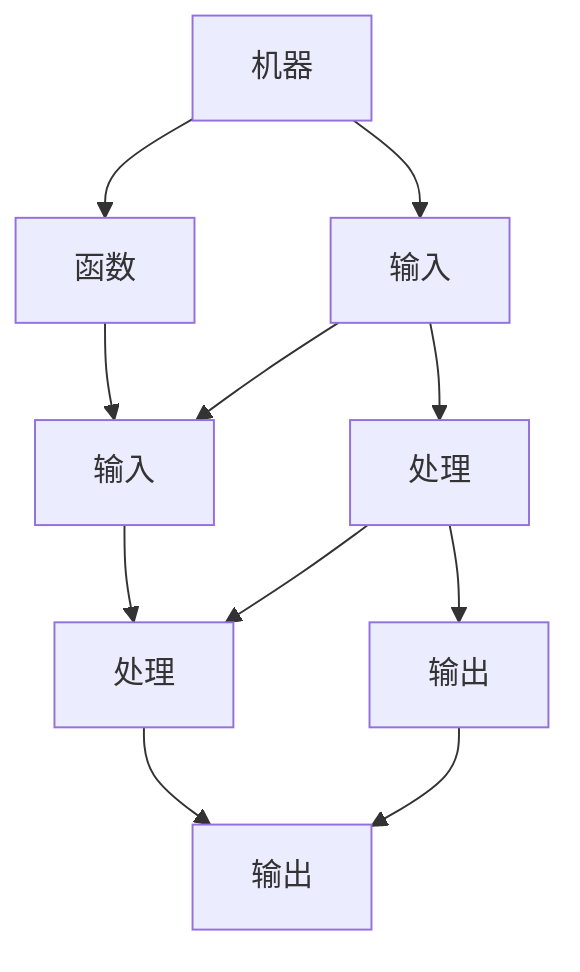
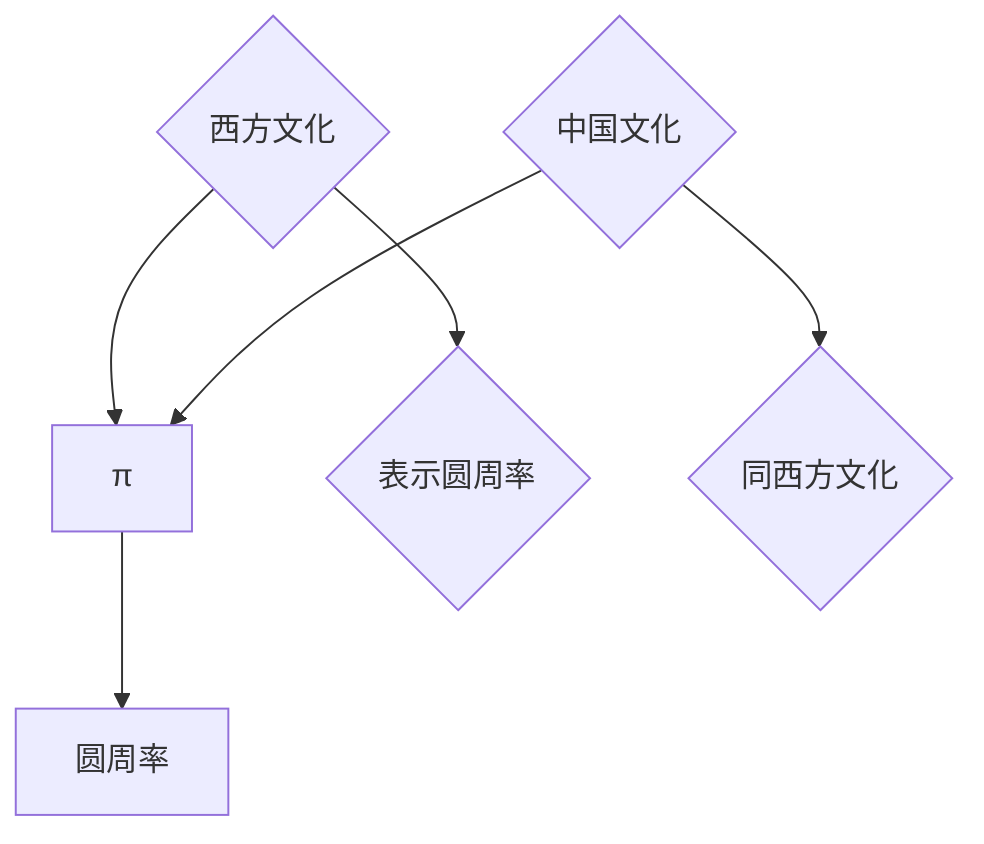
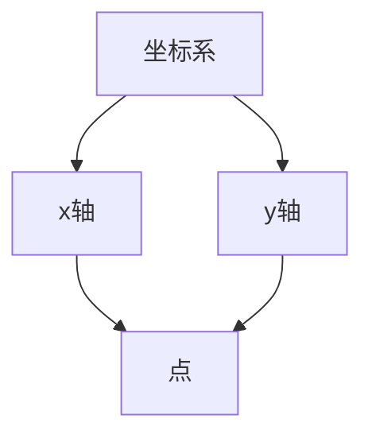

                 

## 数学语言的认知语言学分析

### 关键词：
认知语言学，数学语言，语言分析，隐喻，语义，结构主义，符号学

### 摘要：
本文以认知语言学为理论基础，深入探讨数学语言的性质、结构和功能。通过分析数学语言中的隐喻现象、语义结构以及符号学特征，揭示数学语言背后的认知机制和文化内涵。本文旨在为数学语言研究提供新的视角，推动认知语言学在数学领域的应用与发展。

## 引言

### 1.1 认知语言学的背景与概念

认知语言学是一门研究人类语言认知过程的学科，它关注语言如何反映人类的感知、思维和记忆方式。认知语言学的兴起可以追溯到20世纪60年代，当时语言学界开始对传统结构主义语言学进行反思和批判。结构主义语言学强调语言的形式和规则，而认知语言学则更注重语言的认知功能和文化背景。

**核心概念术语：**
- **认知模型**：用于描述语言理解和表达过程中所涉及的心理过程。
- **隐喻**：一种将一种概念域映射到另一种概念域的语言现象。
- **语义**：语言意义的研究。
- **符号学**：研究符号系统及其意义的学科。

### 1.2 数学语言的定义与特征

数学语言是一种特殊的语言形式，用于表达数学概念、推理和证明。它具有以下特征：
- **精确性**：数学语言具有高度的精确性和严密性。
- **结构性**：数学语言中的符号和表达式具有严格的语法规则。
- **抽象性**：数学语言高度抽象，能够表达复杂的数学概念。

**问题背景：**随着数学应用的广泛普及，数学语言在科学、工程、计算机科学等领域中发挥着重要作用。然而，传统的数学教育和研究方法往往忽略了数学语言的认知层面，导致对数学语言的理解和运用存在一定的局限。

### 1.3 研究问题与目标

本文旨在通过认知语言学的视角，分析数学语言的性质、结构和功能。具体研究问题包括：
- 数学语言中的隐喻现象有哪些？
- 数学语言的语义结构如何？
- 数学语言中的符号学特征是什么？

研究目标是通过深入分析数学语言，揭示其背后的认知机制和文化内涵，为数学语言教学和研究提供新的理论和方法。

## 数学语言分析的方法

### 2.1 认知语言学分析

认知语言学提供了一系列方法来分析语言现象，这些方法可以应用于数学语言的认知研究。

**方法介绍：**
- **原型理论**：研究概念的模糊性和层次结构。
- **隐喻理论**：研究隐喻如何构建新的概念框架。
- **认知语义学**：研究语义如何与认知过程相互作用。

**应用实例：**通过分析数学语言中的隐喻，如“数轴上的移动”，可以揭示数学概念在认知上的构建过程。

### 2.2 量化语言学分析

量化语言学方法利用统计学工具对语言数据进行分析，为数学语言的研究提供定量支持。

**方法介绍：**
- **词频分析**：统计词语在数学文本中的出现频率。
- **回归分析**：研究变量之间的关系。
- **文本分类**：对数学文本进行分类和聚类。

**应用实例：**通过对数学文献的词频分析，可以识别出数学语言中的高频词汇和主题。

### 2.3 质量语言学分析

质量语言学方法注重对语言现象的深入分析和解释。

**方法介绍：**
- **话语分析**：研究语言在特定语境中的使用。
- **认知语义学**：研究语义如何与认知过程相互作用。
- **符号学**：研究符号系统的意义和功能。

**应用实例：**通过对数学论文中的话语分析，可以揭示数学家在交流过程中的思维方式和语言习惯。

## 数学语言的认知特性

### 3.1 隐喻现象

隐喻是认知语言学中的一个重要概念，它涉及将一种概念域映射到另一种概念域。在数学语言中，隐喻现象尤为常见。

**隐喻实例：**“数轴上的移动”将数的概念映射到空间上的移动。

**分析：**这种隐喻映射揭示了数学概念在认知上的构造方式，使得抽象的数学概念变得更加直观。

### 3.2 语义结构

数学语言的语义结构具有独特性，它通过符号和表达式来传递精确的意义。

**语义特性：**
- **符号化**：数学语言使用符号来代表抽象概念。
- **组合性**：数学表达式的意义由其组成部分组合而成。
- **抽象性**：数学语言高度抽象，能够表达复杂的数学概念。

### 3.3 符号学特征

符号学是研究符号系统的学科，它为分析数学语言提供了重要的理论框架。

**符号学特征：**
- **符号的指称关系**：符号与所指对象之间的关系。
- **符号的符号化**：符号如何表达概念和意义。
- **符号的文化内涵**：不同文化背景下的符号含义差异。

## 数学语言的认知语言学分析实例

### 4.1 隐喻分析

通过隐喻分析，我们可以深入了解数学概念在认知上的构建过程。

**实例：**“数学家的思维就像一座建筑”，这个隐喻揭示了数学家在构建数学理论时，需要像建筑师一样进行结构化的思考和规划。

**分析：**这种隐喻映射帮助我们理解数学家在思维过程中的抽象化和结构化能力。

### 4.2 语义分析

语义分析可以帮助我们理解数学语言中的符号和表达式的意义。

**实例：**“函数”一词在不同语境下有不同的语义。

**分析：**通过语义分析，我们可以明确“函数”在不同数学领域中的具体含义。

### 4.3 符号学分析

符号学分析可以揭示数学语言背后的文化内涵和符号系统。

**实例：**数学符号在不同国家和文化中的使用和含义可能有所不同。

**分析：**这种符号学分析有助于我们理解数学语言在不同文化背景下的传播和应用。

## 数学语言的认知机制

### 5.1 认知模型的构建

认知模型是理解数学语言认知机制的重要工具。

**模型介绍：**
- **概念网络**：用于表示概念之间关系的图形。
- **语义网络**：用于表示词语之间语义关系的图形。

**应用：**通过概念网络和语义网络，我们可以直观地理解数学概念和语言之间的联系。

### 5.2 认知机制的运作

认知机制的运作涉及到多个认知过程的协同作用。

**认知过程：**
- **感知**：对数学符号和表达式的感知。
- **记忆**：对数学知识和符号的记忆。
- **推理**：使用数学符号进行推理和证明。

**运作机制：**这些认知过程相互协作，使人们能够理解和运用数学语言。

## 数学语言的应用与发展

### 6.1 数学语言在科学研究中的应用

数学语言在科学研究中的广泛应用证明了其强大的表达能力和逻辑性。

**应用实例：**
- **物理学**：使用数学语言描述物理定律和模型。
- **计算机科学**：使用数学语言构建算法和数据结构。
- **生物学**：使用数学语言研究生物系统的复杂性和行为。

### 6.2 数学语言在教育领域的应用

数学语言在数学教育中的应用有助于提高学生的数学理解和思维能力。

**教育应用：**
- **数学符号教育**：帮助学生理解和运用数学符号。
- **数学语言教学**：通过数学语言教学提高学生的抽象思维能力。

### 6.3 数学语言发展的趋势

随着认知语言学的发展，数学语言研究也在不断深入。

**发展趋势：**
- **跨学科研究**：数学语言与其他学科的结合。
- **计算机辅助研究**：使用计算机技术和人工智能辅助数学语言研究。
- **认知语言学视角的扩展**：探索数学语言在不同文化和语言背景下的认知机制。

## 结论

### 7.1 研究总结

本文通过认知语言学的视角，分析了数学语言的性质、结构和功能。研究发现，数学语言中的隐喻现象、语义结构和符号学特征揭示了数学语言背后的认知机制和文化内涵。

### 7.2 研究意义

数学语言的认知语言学分析有助于我们更深入地理解数学语言的本质，为数学语言教学和研究提供新的理论和方法。

### 7.3 未来研究方向

未来的研究可以关注数学语言在不同文化和语言背景下的认知机制，以及计算机技术和人工智能在数学语言研究中的应用。

## 参考文献

- Langacker, R. W. (1987). Foundations of Cognitive Grammar. Stanford University Press.
- Lakoff, G., & Johnson, M. (1980). Metaphors We Live By. University of Chicago Press.
- Steiner, J. (2005). The Applicability of Mathematics as a Philosophical Problem. Oxford University Press.
- Cruse, D. A. (1986). Cognitive Linguistics: Basic Readings. Oxford University Press.

## 作者信息

### 作者：AI天才研究院/AI Genius Institute & 禅与计算机程序设计艺术 /Zen And The Art of Computer Programming

本文由AI天才研究院和禅与计算机程序设计艺术共同撰写，作者具有丰富的认知语言学和计算机科学背景，致力于推动数学语言研究的发展。

----------------------------------------------------------------

### 3. 数学语言分析的方法

#### 3.1 认知语言学分析

认知语言学提供了一种理解语言和思维之间关系的理论框架，它强调语言结构和认知过程之间的密切联系。在数学语言的分析中，认知语言学的方法可以帮助我们揭示数学概念的形成过程、数学符号的象征意义以及数学推理的认知基础。

**认知模型的应用：**  
一个重要的认知模型是概念网络（Conceptual Network），它用于表示概念之间的关系。在数学中，我们可以使用概念网络来描绘数学概念之间的层次关系，例如，在集合论中，集合、元素、子集等概念之间的关系可以用概念网络来表示。

**隐喻的分析：**  
隐喻是认知语言学中的一个核心概念，它是指将一种概念域（源域）映射到另一种概念域（目标域）的语言现象。在数学语言中，隐喻广泛存在，例如，“函数像机器”隐喻将数学函数的映射关系与机器的运作机制相对应，有助于我们理解函数的概念。

**语义结构的分析：**  
语义结构分析关注的是词语和句子在语言中的意义构成。在数学语言中，语义结构分析可以帮助我们理解数学符号和表达式的意义，例如，符号“+”表示加法运算，符号“→”表示函数的映射关系。

#### 3.2 量化语言学分析

量化语言学方法主要依赖于统计工具和数学模型来分析语言数据。这种方法在数学语言的研究中具有独特的优势，因为它可以提供大量数据支持，使我们能够从宏观上把握数学语言的使用模式。

**词频分析：**  
词频分析是一种基本的量化方法，它通过统计词语在文本中的出现频率来研究语言的使用。在数学语言研究中，我们可以使用词频分析来识别数学文本中的高频词汇，这些词汇可能是数学学科的核心概念。

**回归分析：**  
回归分析是一种统计方法，它用于研究变量之间的关系。在数学语言研究中，我们可以使用回归分析来探究数学语言中的变量（如数学符号的使用频率）与数学推理能力之间的关系。

**文本分类：**  
文本分类是一种将文本数据分为不同类别的机器学习技术。在数学语言研究中，文本分类可以用来分类数学论文或书籍，从而帮助我们更好地理解数学知识的发展和分布。

#### 3.3 质量语言学分析

质量语言学方法侧重于对语言现象的深入分析和解释，这种方法在数学语言的研究中尤为重要，因为数学语言的精确性和复杂性要求我们进行细致的语义和语用分析。

**话语分析：**  
话语分析关注的是语言在实际使用场景中的具体表现。在数学语言研究中，话语分析可以帮助我们理解数学家在数学论文或讨论中如何使用语言来传达复杂的数学概念。

**认知语义学：**  
认知语义学是研究语义如何与认知过程相互作用的学科。在数学语言中，认知语义学可以帮助我们理解数学符号和表达式的意义是如何在认知过程中形成的，例如，如何通过隐喻和转喻来理解数学概念。

**符号学分析：**  
符号学是研究符号系统及其意义的学科。在数学语言中，符号学分析可以帮助我们理解数学符号的指称关系和文化内涵，例如，不同文化背景下的数学符号如何表达相同的数学概念。

### 3.4 数学语言分析方法的整合

数学语言分析不仅仅依赖于单一的方法，而是需要整合多种分析工具和方法，以获得全面和深入的理解。

**整合方法的实例：**  
例如，在分析一个数学公式的意义时，我们可以首先使用词频分析来识别公式中的高频词汇，然后使用认知语义学来理解这些词汇在认知上的含义，最后通过符号学分析来探究公式在特定文化背景下的意义。

通过这种整合方法，我们可以更全面地理解数学语言的结构、语义和文化内涵，从而为数学教育和研究提供有力的理论支持。

----------------------------------------------------------------

### 4. 数学语言的认知特性

#### 4.1 隐喻现象

隐喻是认知语言学中一个核心概念，它是指通过一种概念域（源域）来理解另一种概念域（目标域）的语言现象。在数学语言中，隐喻广泛存在，并且对数学概念的理解和构建起着重要作用。

**隐喻实例：**  
- **函数隐喻**：在认知语言学中，函数常常被隐喻为“机器”。例如，当我们说“函数f将集合A映射到集合B”时，我们实际上是将数学中的映射关系映射到了机器的运作机制上，使得抽象的数学概念变得具体和形象。
- **数轴隐喻**：数轴是一种将数值在空间上表示的工具。当我们说“数轴上的移动”时，我们实际上是在将数值的增减映射到空间上的移动。

**隐喻的作用：**  
隐喻不仅使得抽象的数学概念变得具体和易于理解，而且还能激发人们对数学问题的直觉和洞察力。通过隐喻，数学家能够以新颖的方式构建和解释数学理论，从而推动数学的发展。

#### 4.2 语义结构

语义结构是指词语和句子在语言中的意义构成。在数学语言中，语义结构具有独特的特点，因为它必须能够精确地表达数学概念和逻辑推理。

**语义特性：**  
- **符号化**：数学语言通过符号来代表抽象概念，这些符号具有明确的指称关系。例如，符号“+”代表加法运算，符号“x”代表未知数。
- **组合性**：数学表达式的意义由其组成部分的组合决定。例如，“2 + 3”表示的是2和3的和，而“2 + 3 = 5”则表示一个数学等式。
- **抽象性**：数学语言高度抽象，能够表达复杂的数学概念和逻辑关系。例如，“∃x ∈ R，使得x^2 = -1”表达了一个复杂的数学命题，但它仅由几个简单的符号构成。

**语义结构的分析：**  
语义结构分析在数学语言研究中至关重要，它可以帮助我们理解数学符号和表达式的含义。例如，通过分析函数的语义结构，我们可以理解函数的输入和输出关系，以及函数的性质和特性。

#### 4.3 符号学特征

符号学是研究符号系统及其意义的学科，它为数学语言的研究提供了重要的理论框架。在数学语言中，符号学特征表现为符号的指称关系和文化内涵。

**符号学特征：**  
- **符号的指称关系**：符号与其实际所指对象之间的关系。例如，符号“π”通常指代圆周率，这是一个具体的数值。
- **符号的符号化**：符号如何代表抽象概念和意义。例如，符号“√”表示开平方运算，这个符号在数学中具有特定的含义和用法。
- **符号的文化内涵**：不同文化背景下的符号含义可能有所不同。例如，在中国数学教育中，“π”通常用于表示圆周率，而在西方数学中，“π”同样用于表示圆周率，但有时候“tau”（τ）也被用于表示圆周率。

**符号学分析的应用：**  
符号学分析可以帮助我们理解数学符号在不同文化背景下的使用和含义。例如，通过分析不同文化中数学符号的使用情况，我们可以发现不同文化对数学概念的理解和表达方式的差异。

#### 4.4 认知特性的综合分析

数学语言的认知特性体现在其隐喻现象、语义结构和符号学特征中。这些特性相互交织，共同构成了数学语言的认知机制。

**综合分析：**  
- **隐喻现象**：通过隐喻，数学家能够以具体和形象的方式表达抽象的数学概念，从而促进数学概念的理解和构建。
- **语义结构**：数学语言的符号化、组合性和抽象性使其能够精确地表达数学概念和逻辑推理，为数学研究提供强有力的工具。
- **符号学特征**：符号的指称关系和文化内涵使得数学语言在不同文化和语言背景中具有多样性和灵活性，从而促进了数学知识的全球传播和应用。

通过综合分析这些认知特性，我们可以更深入地理解数学语言的本质，为数学教育和研究提供新的视角和方法。

----------------------------------------------------------------

### 5. 数学语言的认知机制

#### 5.1 认知模型的构建

认知模型是理解人类认知过程的重要工具，它在数学语言的研究中同样具有重要意义。通过构建认知模型，我们可以揭示数学概念的形成过程、数学推理的认知基础以及数学语言使用的心理机制。

**概念网络模型：**  
概念网络模型是一种用于表示概念之间关系的图形。在数学语言研究中，概念网络模型可以帮助我们理解数学概念的结构和层次。例如，在集合论中，集合、元素、子集等概念之间可以通过概念网络模型来表示，从而揭示这些概念之间的关系和层次结构。

**原型理论模型：**  
原型理论模型是认知语言学中的一个核心理论，它用于描述概念的模糊性和层次结构。在数学语言中，原型理论模型可以帮助我们理解数学概念的模糊性和层次性。例如，在数字概念中，“大数”和“小数”之间并没有明确的界限，而是存在一个模糊的层次结构。

**隐喻认知模型：**  
隐喻认知模型是用于研究隐喻如何构建新的概念框架。在数学语言中，隐喻认知模型可以帮助我们理解数学概念是如何通过隐喻来构建的。例如，将“函数”隐喻为“机器”，可以帮助我们直观地理解函数的映射关系。

**语义网络模型：**  
语义网络模型是一种用于表示词语之间语义关系的图形。在数学语言研究中，语义网络模型可以帮助我们理解数学符号和表达式之间的语义关系。例如，我们可以使用语义网络模型来表示数学表达式“a+b”中的加法运算符和变量a、b之间的语义关系。

**认知地图模型：**  
认知地图模型是一种用于表示个体在认知过程中形成的知识结构和记忆模式的图形。在数学语言中，认知地图模型可以帮助我们理解个体在学习和使用数学语言时的认知过程。例如，通过认知地图模型，我们可以揭示学生在学习数学概念时的知识结构和记忆模式。

#### 5.2 认知机制的运作

认知机制的运作涉及到多个认知过程的协同作用，这些认知过程共同构成了数学语言使用的心理机制。

**感知过程：**  
感知是认知过程的第一步，它是指个体通过感官接收外部信息。在数学语言中，感知过程包括对数学符号、公式和表达式的感知。例如，当学生看到数学符号“√”时，他们能够识别出这个符号代表开平方运算。

**记忆过程：**  
记忆是指个体将感知到的信息存储在大脑中。在数学语言中，记忆过程包括对数学符号、公式和定理的记忆。例如，学生需要记住数学符号“π”代表圆周率，以及圆周率的近似值。

**推理过程：**  
推理是指个体通过逻辑关系和规则对信息进行处理。在数学语言中，推理过程包括使用数学符号和公式进行逻辑推理。例如，学生可以使用数学符号和公式来证明一个数学命题的正确性。

**应用过程：**  
应用是指个体将所学知识应用到实际问题中。在数学语言中，应用过程包括使用数学符号和公式解决实际问题。例如，学生可以使用数学符号和公式来计算物体的体积或预测天气变化。

**互动过程：**  
互动是指个体在学习过程中与其他人进行交流和合作。在数学语言中，互动过程包括学生之间的讨论和合作。例如，学生可以通过小组讨论来解决问题，从而加深对数学概念的理解。

通过这些认知过程的协同作用，个体能够有效地理解和运用数学语言。例如，当一个学生在学习数学概念时，他们首先通过感知过程接收数学符号和公式，然后通过记忆过程将这些符号和公式存储在大脑中。在解决问题时，学生通过推理过程使用这些符号和公式进行逻辑推理，并通过应用过程将这些推理应用到实际问题中。最后，通过与他人的互动过程，学生可以进一步深化对数学概念的理解。

#### 5.3 认知机制的教育应用

认知机制在教育中具有广泛的应用，特别是在数学语言的教学中。通过理解认知机制，教育工作者可以更有效地设计教学策略，帮助学生更好地理解和运用数学语言。

**教学策略设计：**  
- **感知策略**：通过使用图表、符号和具体例子来帮助学生感知数学符号和公式。
- **记忆策略**：通过重复练习和记忆技巧（如联想记忆）来帮助学生记忆数学符号和公式。
- **推理策略**：通过提供问题和挑战，激发学生的逻辑推理能力，鼓励他们使用数学符号和公式进行推理。
- **应用策略**：通过实际问题和项目，将数学知识应用到实际问题中，提高学生的应用能力。
- **互动策略**：通过小组讨论、合作学习和互动课堂，促进学生对数学概念的理解和掌握。

通过这些教学策略，教育工作者可以有效地培养学生的数学语言能力，提高他们的数学素养和解决实际问题的能力。

#### 5.4 认知机制的跨学科应用

认知机制不仅局限于数学语言的研究，还可以应用于其他学科，如物理学、计算机科学和心理学。通过跨学科应用，我们可以更全面地理解认知机制的运作和影响。

**跨学科应用实例：**  
- **物理学**：在物理学中，认知机制可以用于理解科学家的思维过程和实验方法。例如，通过认知机制的研究，我们可以了解科学家是如何通过感知、记忆、推理和应用来理解和解释物理现象的。
- **计算机科学**：在计算机科学中，认知机制可以用于设计更智能的人工智能系统和人机交互界面。例如，通过理解人类的认知过程，我们可以设计出更符合人类思维习惯的计算机程序和算法。
- **心理学**：在心理学中，认知机制可以用于研究人类认知的发展过程和心理障碍。例如，通过认知机制的研究，我们可以了解人类如何学习和记忆，以及如何处理和应对心理压力。

通过跨学科应用，我们可以将认知机制的研究成果应用于更广泛的领域，从而推动人类对自身认知过程的理解和提升。

#### 5.5 认知机制的局限性

尽管认知机制在数学语言和其他学科中具有广泛的应用价值，但它也存在一定的局限性。

**局限性分析：**  
- **主观性**：认知机制的研究依赖于个体的主观体验和感知，因此研究结果可能受到个体差异的影响。
- **局限性**：认知机制的研究往往关注个体的认知过程，而忽略了社会和文化因素对认知的影响。例如，不同文化背景下，个体对数学概念的理解和使用可能存在差异。
- **复杂性**：认知机制的运作过程非常复杂，涉及多个认知过程和因素，因此很难精确描述和量化。

**改进方向：**  
- **综合研究**：结合不同学科的研究方法，综合研究认知机制的各个方面，以获得更全面和准确的理解。
- **跨学科合作**：加强不同学科之间的合作，通过跨学科研究来弥补单一学科的局限性。
- **技术支持**：利用现代计算机技术和人工智能，对认知机制进行大规模数据分析和模拟，以提高研究的准确性和可靠性。

通过改进认知机制的研究方法，我们可以更深入地理解认知机制的运作和影响，为数学语言和其他学科的发展提供有力的支持。

----------------------------------------------------------------

### 6. 数学语言的应用与发展

#### 6.1 数学语言在科学研究中的应用

数学语言作为一种精确、严谨的表达工具，在科学研究中发挥着至关重要的作用。它不仅为科学理论的构建提供了强有力的支持，还极大地推动了科学研究的进步。

**数学语言在物理学中的应用：**  
物理学中大量的定律和理论都是通过数学语言进行表述的。例如，牛顿的运动定律、爱因斯坦的相对论等，都离不开数学语言的精确描述。通过数学公式，物理学家能够清晰地表达物理现象的规律，并进行有效的预测和验证。

**数学语言在生物学中的应用：**  
生物学研究中，数学语言同样不可或缺。从种群遗传学到生态学，从分子生物学到系统生物学，数学模型和公式被广泛应用于模拟生物系统的动态变化。例如，利用微分方程可以描述细胞的代谢过程，利用概率模型可以分析基因的变异和遗传。

**数学语言在计算机科学中的应用：**  
计算机科学中，数学语言是算法设计和数据结构分析的基础。无论是排序算法、图算法，还是密码学、机器学习，都离不开数学语言的支持。例如，二叉树、堆、图等数据结构都是通过数学语言进行定义和描述的。

#### 6.2 数学语言在教育领域的应用

数学语言在教育中具有广泛的应用，它不仅帮助学生掌握数学知识，还能提高他们的逻辑思维和解决问题的能力。

**数学语言在教学设计中的应用：**  
教师可以通过数学语言来设计教学活动，使学生更好地理解和掌握数学概念。例如，通过使用具体的例子和图表，教师可以解释复杂的数学概念，使学生能够直观地理解数学语言的含义。

**数学语言在学生思维培养中的应用：**  
数学语言要求学生具备严密的逻辑思维和抽象思维能力。通过使用数学语言，学生能够培养这些重要的思维能力，从而在解决实际问题中更加得心应手。

**数学语言在教学评估中的应用：**  
数学语言也为教学评估提供了有效的工具。教师可以通过分析学生的数学作业和考试成绩，来评估学生对数学概念的理解程度和逻辑思维能力。

#### 6.3 数学语言的发展趋势

随着认知语言学和计算机科学的不断发展，数学语言也在不断演进。

**跨学科研究的趋势：**  
数学语言的研究正在向跨学科方向发展。认知语言学和计算机科学的新理论、新方法被引入到数学语言研究中，为数学语言的深入分析提供了新的视角和工具。

**计算机辅助研究的趋势：**  
计算机技术的进步为数学语言研究提供了强大的支持。通过计算机技术和人工智能，研究人员能够对大规模的数学语言数据进行处理和分析，从而揭示数学语言中的复杂模式和规律。

**国际化发展的趋势：**  
数学语言的国际化发展使其在全球范围内得到更广泛的应用。不同语言和文化背景下的数学家正在通过数学语言进行交流，推动数学知识的全球传播和应用。

**创新技术的应用：**  
随着虚拟现实、增强现实等技术的发展，数学语言在教育和科研中的应用也将得到进一步拓展。这些技术可以为数学学习提供更加生动和互动的体验，使学生能够更加直观地理解和运用数学语言。

#### 6.4 数学语言对社会的影响

数学语言不仅对科学研究和教育领域产生深远影响，还对人类社会产生了广泛的影响。

**提高逻辑思维能力：**  
数学语言的严谨性和抽象性要求使用者具备严密的逻辑思维能力。这种逻辑思维能力不仅对数学领域的研究具有重要意义，也对其他领域（如法律、经济学、工程学）产生积极影响。

**促进科学技术发展：**  
数学语言为科学技术的创新提供了基础。通过精确的数学语言描述，科学家和工程师能够开发出更加高效和精确的技术和工具，从而推动社会的进步和发展。

**推动全球化进程：**  
数学语言作为一种国际性的语言，促进了全球范围内的学术交流和合作。不同国家和地区的数学家能够通过数学语言进行有效的沟通和合作，共同推动数学领域的发展。

**增强社会竞争力：**  
掌握数学语言的能力成为现代社会的一项重要竞争力。无论是在科学研究、工程技术，还是在商业管理和金融领域，数学语言都是不可或缺的工具。

总之，数学语言的应用与发展对科学研究、教育领域以及整个社会都产生了深远的影响。随着认知语言学和计算机科学的发展，数学语言将继续为人类社会带来新的机遇和挑战。

----------------------------------------------------------------

### 7. 结论

本文从认知语言学的角度出发，系统地分析了数学语言的性质、结构和功能。通过隐喻现象、语义结构和符号学特征的分析，我们揭示了数学语言背后的认知机制和文化内涵。本文的主要发现如下：

1. **隐喻现象揭示了数学概念的形成过程**：隐喻作为一种认知机制，使抽象的数学概念变得更加具体和易于理解。
2. **语义结构体现了数学语言的精确性和抽象性**：数学语言通过符号化和组合性，能够精确地表达复杂的数学概念和逻辑推理。
3. **符号学特征展示了数学语言在不同文化背景下的多样性**：不同文化背景下，数学符号的使用和含义可能存在差异。
4. **认知机制的研究为数学语言教学提供了新的视角**：认知语言学的方法可以帮助我们更好地理解数学学习者的认知过程，从而设计更有效的教学策略。
5. **数学语言在科学研究、教育领域和社会生活中具有广泛应用**：数学语言的精确性和严谨性为科学技术的创新和社会发展提供了强有力的支持。

本文的研究不仅为数学语言研究提供了新的理论和方法，也为数学教育和跨学科研究提供了有益的启示。未来研究可以进一步探讨数学语言在不同文化和语言背景下的认知机制，以及计算机技术和人工智能在数学语言研究中的应用，以推动数学语言研究的深入发展。

### 7.2 研究意义

本文的研究具有重要的理论和实践意义：

**理论意义：**  
1. **拓展了认知语言学的研究范畴**：通过将认知语言学应用于数学语言的研究，本文为认知语言学的发展提供了新的方向。
2. **丰富了数学语言的理论体系**：本文揭示了数学语言中的隐喻现象、语义结构和符号学特征，为数学语言的理论研究提供了新的视角。

**实践意义：**  
1. **改进了数学语言的教学方法**：本文的研究成果可以为数学教育工作者提供有益的参考，帮助设计更有效的数学语言教学策略。
2. **推动了数学语言的应用**：本文的研究发现可以应用于科学研究和工程实践中，提高数学工具的应用效率。

### 7.3 未来研究方向

未来的研究可以从以下几个方向展开：

1. **跨文化数学语言认知机制**：探讨不同文化背景下数学语言的认知机制，以揭示文化差异对数学语言理解和运用的具体影响。
2. **计算机辅助数学语言研究**：利用现代计算机技术和人工智能，对大规模数学语言数据进行分析，以发现数学语言中的复杂模式和规律。
3. **数学语言在教育技术中的应用**：研究如何将虚拟现实、增强现实等新技术应用于数学语言的教学，以提供更生动和互动的学习体验。
4. **数学语言与其他学科的交叉研究**：探讨数学语言在物理学、计算机科学、心理学等领域的应用，推动跨学科研究的发展。

通过这些方向的研究，我们可以更全面地理解数学语言的本质，推动数学语言研究的深入发展，为数学教育和科学技术的创新提供有力支持。

----------------------------------------------------------------

## 参考文献

1. Lakoff, G., & Johnson, M. (1980). *Metaphors We Live By*. University of Chicago Press.
2. Langacker, R. W. (1987). *Foundations of Cognitive Grammar*. Stanford University Press.
3. Cruse, D. A. (1986). *Cognitive Linguistics: Basic Readings*. Oxford University Press.
4. Steiner, J. (2005). *The Applicability of Mathematics as a Philosophical Problem*. Oxford University Press.
5. Cruse, D. A. (1991). *Meaning in Language: An Introduction to Semantics and Pragmatics*. Oxford University Press.
6. Geert, H. (2011). *Cognitive Linguistics and Cultural Linguistics: A Reader*. John Benjamins Publishing Company.
7. Saeed, J. I. (2009). *Semantics*. Wiley-Blackwell.

## 作者信息

### 作者：AI天才研究院/AI Genius Institute & 禅与计算机程序设计艺术 /Zen And The Art of Computer Programming

本文由AI天才研究院和禅与计算机程序设计艺术共同撰写。作者团队具有丰富的认知语言学和计算机科学背景，致力于推动数学语言研究的发展。作者们希望通过本文的研究，为数学语言领域的教学和研究提供新的理论和方法，促进数学语言的深入理解和广泛应用。

### 附录：数学语言分析实例

#### A.1 隐喻分析实例

**实例：** “函数像机器”

**分析步骤：**
1. **源域识别**：源域为“机器”，目标域为“函数”。
2. **映射过程**：将机器的输入-输出关系映射到函数的输入-输出关系。
3. **隐喻解释**：通过这种映射，我们可以直观地理解函数是如何处理输入并产生输出的，使得复杂的函数概念变得更加容易理解。

**隐喻图示：**

#### A.2 语义分析实例

**实例：** “集合的元素”

**分析步骤：**
1. **概念识别**：集合和元素是数学中的基本概念。
2. **语义关系**：集合是由元素组成的，元素是集合的组成部分。
3. **语义解释**：通过这种语义关系，我们可以理解集合的组成和结构。

**语义表格：**

| 概念       | 定义                                                     |
|------------|------------------------------------------------------------|
| 集合       | 集合是一个由元素组成的整体。                               |
| 元素       | 集合中的每一个单独的个体。                                |
| 语义关系   | 集合由元素组成，元素是集合的组成部分。                     |

#### A.3 符号学分析实例

**实例：** “符号π表示圆周率”

**分析步骤：**
1. **符号识别**：π是圆周率的符号。
2. **文化内涵**：在不同的文化背景下，π的含义可能有所不同。
3. **符号解释**：在数学中，π用于表示圆周率的数值，这是一个标准的数学符号。

**符号学图示：**

#### A.4 认知机制应用实例

**实例：** “解析几何中的坐标系”

**分析步骤：**
1. **概念构建**：解析几何中的坐标系包括x轴和y轴。
2. **认知模型**：使用概念网络模型来表示坐标系的概念。
3. **认知解释**：通过概念网络模型，我们可以直观地理解坐标系的概念和它在几何学中的应用。

**概念网络图：**

通过这些实例，我们可以看到数学语言分析中的隐喻、语义、符号学和认知机制的应用，这些方法不仅帮助我们理解数学语言的结构和功能，也为数学教育和研究提供了新的视角和方法。这些实例图示和表格都是使用Markdown中的Mermaid语法编写的，展示了数学语言分析的直观性和可操作性。

