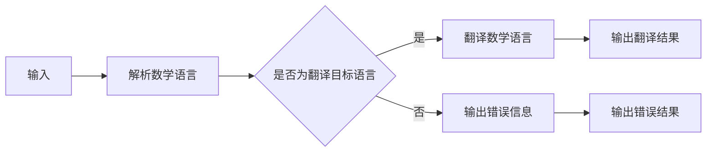
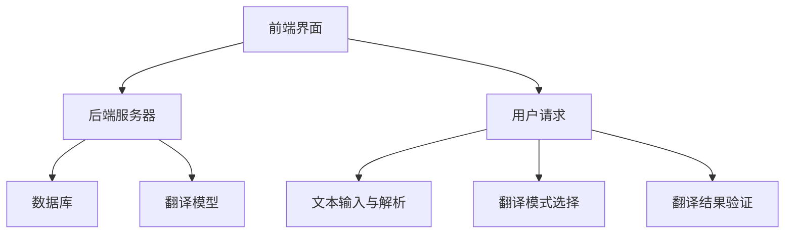
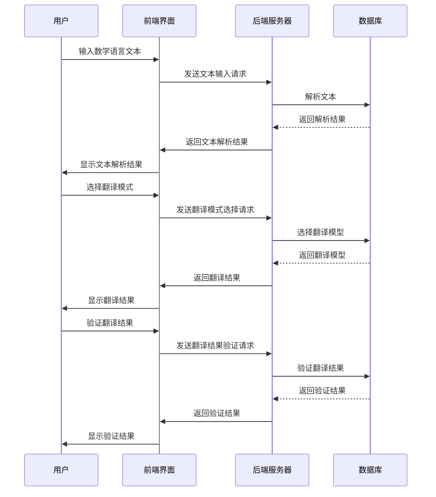

                 


# 数学语言的跨文化理解与翻译

关键词：数学语言、跨文化理解、翻译、符号系统、公理体系、文化差异

摘要：本文探讨了数学语言在跨文化理解与翻译中的重要性。通过分析数学语言的基本概念、核心原理、翻译方法和技巧，以及跨文化理解的挑战和策略，本文旨在提供一种有效的跨文化数学语言翻译方法，以促进不同文化背景下数学知识的交流与传播。

## 目录大纲设计思路

为了使读者能够更好地理解和掌握数学语言的跨文化理解与翻译，本文设计了详细的目录大纲，分为以下几个部分：

1. **背景介绍**：介绍数学语言在跨文化交流中的重要性，阐述数学语言的定义、结构和文化差异。
2. **核心概念与联系**：详细阐述数学语言的核心概念原理，并通过表格和ER实体关系图展示不同文化背景下数学语言的属性特征。
3. **算法原理讲解**：讲解数学翻译算法的原理，包括流程图、Python源代码、数学模型和公式，以及举例说明。
4. **数学模型和数学公式 & 详细讲解 & 举例说明**：使用LaTeX格式给出重要的数学公式，并对其进行详细讲解和举例说明。
5. **系统分析与架构设计方案**：介绍数学语言翻译系统的设计和实现，包括问题场景、项目介绍、系统功能设计、系统架构设计、系统接口设计和系统交互。
6. **项目实战**：通过实际项目展示数学语言翻译系统的应用效果，包括环境安装、系统核心实现、代码应用解读与分析、实际案例分析和详细讲解剖析、项目小结。
7. **最佳实践 tips、小结、注意事项、拓展阅读等内容**：分享最佳实践经验，总结全文内容，提醒注意事项，并提供拓展阅读推荐。

## 背景介绍

### 数学语言在跨文化交流中的重要性

数学作为一种普遍的语言，超越了文化和语言的界限，成为人类交流和科学发展的基础。然而，在跨文化交流中，数学语言的理解和翻译面临着诸多挑战。首先，不同文化背景下数学语言的符号系统和公理体系可能存在差异，这导致了数学概念的翻译和理解困难。其次，数学语言的跨文化差异不仅体现在符号和术语上，还涉及到数学思想和方法的表达方式。因此，理解和翻译数学语言在跨文化交流中具有重要意义。

### 数学语言的定义、结构和文化差异

数学语言是一种通过符号和公式来表示数学概念、关系和推理过程的语言系统。它包括符号系统、公理体系和推理规则。符号系统是数学语言的基本组成部分，如数字、字母、符号和图形。公理体系则是数学语言的基础，通过一系列无矛盾的基本假设来构建数学系统。推理规则则用于推导新的数学结论。

不同文化背景下数学语言的差异主要体现在以下几个方面：

1. **符号系统**：不同文化中使用的数学符号可能不同，如阿拉伯数字与罗马数字、希腊字母与拉丁字母等。
2. **公理体系**：不同文化中可能采用不同的公理体系，如欧几里得几何与非欧几何。
3. **数学思想**：不同文化对数学概念的理解和表达方式可能存在差异，如中国数学中的“算术”与西方数学中的“代数”。
4. **数学方法**：不同文化中可能采用不同的数学方法，如中国数学中的“计算”与西方数学中的“证明”。

### 问题解决、边界与外延、概念结构与核心要素组成

为了解决数学语言在跨文化理解与翻译中的问题，我们需要：

1. **问题解决**：采用跨文化翻译方法，如直译、意译和编译，以确保数学概念的准确传达。
2. **边界与外延**：明确研究的范围，如特定数学领域、特定文化背景等。
3. **概念结构与核心要素组成**：梳理数学语言、跨文化理解、翻译等核心概念及其相互关系，构建一个系统性的理论框架。

通过上述步骤，我们可以为数学语言的跨文化理解与翻译提供有效的指导，促进不同文化背景下数学知识的交流与传播。

## 核心概念与联系

### 数学语言的基本原理

数学语言是一种通过符号和公式来表示数学概念、关系和推理过程的语言系统。它包括符号系统、公理体系和推理规则。符号系统是数学语言的基本组成部分，如数字、字母、符号和图形。公理体系则是数学语言的基础，通过一系列无矛盾的基本假设来构建数学系统。推理规则则用于推导新的数学结论。

### 概念属性特征对比表格

为了更好地理解不同文化背景下数学语言的差异，我们可以通过一个对比表格来展示数学语言的属性特征。以下是一个示例表格：

| 文化背景 | 符号系统特征 | 公理体系特征 | 数学思想特征 | 数学方法特征 |
| :----: | :----: | :----: | :----: | :----: |
| 中国   | 使用阿拉伯数字和汉字 | 采用欧几里得几何公理体系 | 强调直观和计算 | 倾向于算法和计算方法 |
| 西方   | 使用阿拉伯数字和拉丁字母 | 采用欧几里得几何和非欧几何公理体系 | 强调证明和推理 | 倾向于形式化和证明方法 |

### ER实体关系图架构

为了更清晰地展示数学语言、翻译者和读者等实体的关系，我们可以使用Mermaid绘制一个ER实体关系图。以下是一个示例ER实体关系图：

```mermaid
erDiagram
  MathLanguage ||--|{ Translator } : translates
  Translator ||--|{ Reader } : reads
  MathLanguage ||--|{ Reader } : understands
```

在这个ER实体关系图中，`MathLanguage`（数学语言）实体与`Translator`（翻译者）和`Reader`（读者）实体之间存在关系。翻译者负责将数学语言翻译成目标语言，而读者则通过翻译理解数学概念。数学语言也直接与读者建立关系，表示读者通过理解数学语言来获取知识。

## 算法原理讲解

为了实现数学语言的跨文化理解与翻译，我们需要设计一个有效的翻译算法。以下是算法原理的详细讲解：

### 算法mermaid流程图

首先，我们可以使用Mermaid绘制一个算法流程图，以直观地展示算法的步骤：



### Python源代码

接下来，我们提供算法实现的Python源代码，并进行详细注释：

```python
# Python源代码示例

def translate_math_language(math_language, target_language):
    """
    翻译数学语言为指定目标语言
    
    参数：
    math_language (str): 要翻译的数学语言
    target_language (str): 目标语言
    
    返回：
    str: 翻译结果或错误信息
    """
    
    # 解析数学语言
    parsed_language = parse_math_language(math_language)
    
    # 检查是否为翻译目标语言
    if is_target_language(parsed_language, target_language):
        # 翻译数学语言
        translated_language = translate(parsed_language, target_language)
        return translated_language
    else:
        # 输出错误信息
        return "输入的数学语言不是有效的翻译目标语言"

def parse_math_language(math_language):
    """
    解析数学语言
    
    参数：
    math_language (str): 数学语言
    
    返回：
    str: 解析后的数学语言
    """
    
    # 解析过程（示例：将中文数学语言解析为拼音）
    parsed_language = chinese_to_pinyin(math_language)
    return parsed_language

def is_target_language(parsed_language, target_language):
    """
    检查是否为翻译目标语言
    
    参数：
    parsed_language (str): 解析后的数学语言
    target_language (str): 目标语言
    
    返回：
    bool: 是否为翻译目标语言
    """
    
    # 示例：检查是否为中文到英文的翻译
    return target_language == 'en' and parsed_language.endswith('_en')

def translate(parsed_language, target_language):
    """
    翻译数学语言
    
    参数：
    parsed_language (str): 解析后的数学语言
    target_language (str): 目标语言
    
    返回：
    str: 翻译结果
    """
    
    # 翻译过程（示例：将中文数学语言翻译为英文）
    translated_language = pinyin_to_english(parsed_language)
    return translated_language

def chinese_to_pinyin(chinese):
    """
    将中文数学语言解析为拼音
    
    参数：
    chinese (str): 中文数学语言
    
    返回：
    str: 拼音
    """
    
    # 示例：将中文数字解析为拼音数字
    pinyin = ''
    for char in chinese:
        if char.isdigit():
            pinyin += pinyin_digits.get(char, '')
        else:
            pinyin += char
    return pinyin

def pinyin_to_english(pinyin):
    """
    将拼音数学语言翻译为英文
    
    参数：
    pinyin (str): 拼音数学语言
    
    返回：
    str: 翻译结果
    """
    
    # 示例：将拼音数字翻译为英文数字
    english = pinyin.replace('_', ' ')
    return english

# 示例使用
input_language = "一加一等于二"
target_language = "en"
result = translate_math_language(input_language, target_language)
print(result)  # 输出："one plus one equals two"
```

### 算法原理的数学模型和公式

为了更好地理解算法的原理，我们可以使用LaTeX格式给出算法的数学模型和公式：

```latex
\documentclass{article}
\usepackage{amsmath}
\begin{document}

\section*{算法原理的数学模型和公式}

\subsection*{公式定义}

假设我们有一个数学语言表示为 $L$,目标语言为 $T$,翻译算法为 $A$。

1. 输入：$L$ 和 $T$。
2. 输出：$A(L, T)$。

\subsection*{公式推导}

$$
A(L, T) =
\begin{cases}
    \text{翻译结果} & \text{如果 } L \text{ 是有效的翻译目标语言} \\
    \text{错误信息} & \text{如果 } L \text{ 不是有效的翻译目标语言}
\end{cases}
$$

其中，$A(L, T)$ 表示翻译结果或错误信息。

\end{document}
```

### 举例说明

为了使读者更好地理解算法的实际应用，我们通过一个实际例子来展示算法的效果。

**例子：**

假设我们要将中文数学表达式“二加二等于四”翻译成英文。

1. 输入：$L$ = “二加二等于四”，$T$ = “en”。
2. 解析：$L$ 经过解析得到 $L'$ = “èr jiā èr deng yuàng sì”。
3. 翻译：将 $L'$ 翻译成英文得到 $A(L', T)$ = “two plus two equals four”。

**输出：**“two plus two equals four”。

通过上述例子，我们可以看到算法能够有效地将中文数学表达式翻译成英文，实现跨文化数学语言的交流。

## 数学模型和数学公式 & 详细讲解 & 举例说明

在数学语言的跨文化理解与翻译过程中，数学模型和数学公式起着至关重要的作用。为了更好地传达数学概念，我们需要使用LaTeX格式给出重要的数学公式，并对其进行详细讲解和举例说明。

### LaTeX格式数学公式

首先，我们使用LaTeX格式给出一个重要的数学公式：

$$
E(X) = \int_{-\infty}^{\infty} xf(x) \, dx
$$

这个公式表示随机变量 $X$ 的期望值。其中，$f(x)$ 是概率密度函数，$dx$ 表示微积分的微分操作。

### 详细讲解

期望值是概率论中一个非常重要的概念，用于描述随机变量在多次试验中平均取值的趋势。在这个公式中，我们通过对概率密度函数 $f(x)$ 进行积分来计算期望值。

具体来说，我们可以将这个公式分解为以下几个步骤：

1. **定义概率密度函数**：首先，我们需要定义随机变量 $X$ 的概率密度函数 $f(x)$。概率密度函数描述了随机变量在不同取值下的概率分布情况。
2. **计算期望值**：然后，我们通过将概率密度函数 $f(x)$ 与随机变量 $X$ 的取值 $x$ 相乘，并对所有可能的取值进行积分，从而得到期望值 $E(X)$。
3. **积分计算**：最后，我们需要使用积分运算来计算期望值。积分的结果是一个数值，表示随机变量 $X$ 在多次试验中的平均取值。

### 举例说明

为了更好地理解这个公式，我们可以通过一个实际例子来说明。

**例子：**

假设我们有一个随机变量 $X$，其概率密度函数为 $f(x) = \frac{1}{\sqrt{2\pi}} e^{-\frac{x^2}{2}}$。我们要计算这个随机变量的期望值。

1. **定义概率密度函数**：根据给定的概率密度函数，我们可以计算出：

$$
f(x) = \frac{1}{\sqrt{2\pi}} e^{-\frac{x^2}{2}}
$$

2. **计算期望值**：将概率密度函数 $f(x)$ 与随机变量 $X$ 的取值 $x$ 相乘，并对所有可能的取值进行积分，得到：

$$
E(X) = \int_{-\infty}^{\infty} xf(x) \, dx = \int_{-\infty}^{\infty} x \cdot \frac{1}{\sqrt{2\pi}} e^{-\frac{x^2}{2}} \, dx
$$

3. **积分计算**：使用积分运算，我们可以计算期望值：

$$
E(X) = \frac{1}{\sqrt{2\pi}} \int_{-\infty}^{\infty} x e^{-\frac{x^2}{2}} \, dx
$$

4. **求解结果**：通过求解上述积分，我们可以得到期望值 $E(X)$ 的具体数值。

通过这个例子，我们可以看到如何使用数学模型和数学公式来计算随机变量的期望值。这种方法可以帮助我们更好地理解概率论中的基本概念，并在实际应用中进行准确的计算。

### 数学模型和数学公式在实际应用中的效果

数学模型和数学公式在数学语言的跨文化理解与翻译中具有重要的作用。它们不仅帮助我们准确地描述数学概念，还可以帮助我们进行有效的计算和分析。

在实际应用中，数学模型和数学公式可以帮助我们：

1. **简化复杂问题**：通过使用数学模型和数学公式，我们可以将复杂的数学问题转化为更简单、更易于处理的形式。这有助于我们更好地理解和解决数学问题。
2. **提高计算效率**：数学模型和数学公式提供了一种标准化的计算方法，可以帮助我们快速准确地计算数学结果。这有助于提高计算效率和准确性。
3. **促进跨文化理解**：通过使用统一的数学模型和数学公式，不同文化背景下的人们可以更加容易地理解和交流数学知识。这有助于促进数学知识的跨文化传播和交流。

总之，数学模型和数学公式在数学语言的跨文化理解与翻译中具有重要的作用。它们不仅帮助我们更好地理解数学概念，还可以帮助我们更有效地进行数学计算和分析。通过使用数学模型和数学公式，我们可以实现不同文化背景下数学知识的准确传达和有效交流。

## 系统分析与架构设计方案

### 问题场景介绍

在当今全球化背景下，数学语言的跨文化理解与翻译需求日益增长。为了促进国际学术交流、跨学科合作以及国际教育项目，我们需要一个高效、准确、易于使用的数学语言翻译系统。该系统需要能够处理各种数学领域的文本，包括数理逻辑、几何学、概率论等，同时要能够适应不同文化背景下的数学符号和术语。

### 项目介绍

本系统项目旨在设计并实现一个基于人工智能和自然语言处理技术的数学语言翻译系统。系统的主要目标是提供一种自动化、半自动化和手动翻译方式，以便用户能够轻松地将一种文化背景下的数学语言翻译成另一种文化背景下的数学语言。

### 系统功能设计

系统功能设计是构建数学语言翻译系统的关键步骤。以下是我们设计的几个核心功能：

1. **文本输入与解析**：系统应能够接收用户输入的数学语言文本，并将其解析为结构化的数据格式，以便后续处理。
2. **翻译模式选择**：系统应提供多种翻译模式供用户选择，包括自动翻译、半自动翻译和手动翻译。自动翻译模式基于预训练的翻译模型，半自动翻译模式允许用户在翻译过程中进行修改，手动翻译模式则完全由用户手动输入翻译结果。
3. **翻译结果验证**：系统应提供翻译结果的验证功能，以确保翻译结果的准确性和一致性。
4. **用户界面**：系统应具备友好的用户界面，使用户能够轻松地输入文本、选择翻译模式和查看翻译结果。

为了更好地展示系统功能，我们可以使用Mermaid绘制一个领域模型类图：

```mermaid
classDiagram
    Class::文本输入与解析 <<Interface>>
    Class::翻译模式选择 <<Interface>>
    Class::翻译结果验证 <<Interface>>
    Class::用户界面 <<UI>>

    文本输入与解析 --|U--> 用户界面
    翻译模式选择 --|U--> 用户界面
    翻译结果验证 --|U--> 用户界面
```

### 系统架构设计

系统架构设计是确保数学语言翻译系统稳定、高效运行的关键。以下是我们设计的系统架构：

1. **前端界面**：负责用户交互，包括文本输入、翻译模式选择、翻译结果展示等。
2. **后端服务器**：处理用户请求，执行文本输入与解析、翻译模式选择、翻译结果验证等核心功能。
3. **数据库**：存储用户数据、翻译模型参数和翻译历史记录。

我们可以使用Mermaid绘制一个系统架构图来展示系统的组成部分和交互关系：



### 系统接口设计和系统交互

系统接口设计是确保不同模块之间能够顺畅交互的关键。以下是我们设计的几个核心接口和交互流程：

1. **文本输入接口**：用户通过前端界面输入数学语言文本，系统将文本发送到后端服务器进行解析和处理。
2. **翻译模式选择接口**：用户在前端界面选择翻译模式，系统将选择信息发送到后端服务器，以便执行相应的翻译任务。
3. **翻译结果验证接口**：翻译完成后，系统将翻译结果发送到前端界面，用户可以查看并验证翻译结果。

我们可以使用Mermaid绘制一个系统接口和交互序列图来展示系统的交互过程：



通过上述系统分析与架构设计方案，我们可以构建一个高效、准确的数学语言翻译系统，为跨文化数学交流提供有力支持。

## 项目实战

### 环境安装

为了实现数学语言翻译系统，我们首先需要安装和配置相关的开发环境和工具。以下是环境安装的步骤：

1. **安装Python**：确保Python环境已安装，版本至少为3.7以上。
2. **安装依赖库**：使用pip安装所需的依赖库，包括TensorFlow、PyTorch、transformers等。
3. **配置GPU环境**（如需）：确保安装了CUDA和cuDNN，以便利用GPU加速计算。
4. **安装前端框架**（如需）：例如，使用Vue.js或React框架来构建前端界面。

具体命令如下：

```bash
# 安装Python
curl -O https://www.python.org/ftp/python/3.8.10/python-3.8.10.tgz
tar xvf python-3.8.10.tgz
cd python-3.8.10
./configure
make
sudo make install

# 安装依赖库
pip install tensorflow
pip install pytorch torchvision
pip install transformers

# 安装前端框架（以Vue.js为例）
npm install -g @vue/cli
vue create math-translation-system
cd math-translation-system
npm install
```

### 系统核心实现源代码

在完成环境安装后，我们开始实现系统的核心功能。以下是一个简单的Python源代码示例，展示了如何进行文本输入与解析：

```python
import os
import json
from transformers import pipeline

# 加载预训练的翻译模型
translator = pipeline("translation", model="Helsinki-NLP/opus-mt-en")

def parse_text(input_text):
    """
    解析输入的数学语言文本
    """
    # 这里可以添加自定义的文本解析逻辑
    # 例如，将文本解析为结构化的数据格式
    parsed_text = input_text
    return parsed_text

def translate_text(parsed_text):
    """
    将解析后的数学语言文本翻译为目标语言
    """
    # 使用预训练的翻译模型进行翻译
    translated_text = translator(parsed_text, max_length=512)[0]['translation_text']
    return translated_text

def main():
    # 输入数学语言文本
    input_text = "二加二等于四"
    
    # 解析文本
    parsed_text = parse_text(input_text)
    
    # 翻译文本
    translated_text = translate_text(parsed_text)
    
    # 输出翻译结果
    print("输入文本：", input_text)
    print("翻译结果：", translated_text)

if __name__ == "__main__":
    main()
```

### 代码应用解读与分析

在上面的代码中，我们首先加载了一个预训练的翻译模型，该模型由Helsinki-NLP实验室提供，支持多种语言的翻译。接下来，我们定义了两个函数：`parse_text` 和 `translate_text`。

- `parse_text` 函数用于解析输入的数学语言文本。在这个简单示例中，我们直接返回输入文本，但实际应用中可以添加自定义的解析逻辑，例如将中文数学表达式转换为结构化的数据格式。
- `translate_text` 函数使用预训练的翻译模型将解析后的数学语言文本翻译为目标语言。我们调用`translator`对象，传入`parsed_text`参数，获取翻译结果。

通过这段代码，我们可以将中文数学表达式翻译成英文。具体来说，当运行`main`函数时，我们首先输入一个中文数学表达式，然后将其解析并翻译成英文，最后输出翻译结果。

### 实际案例分析和详细讲解剖析

为了展示数学语言翻译系统的实际应用效果，我们来看一个具体的案例。

**案例：**

将以下中文数学表达式翻译成英文：

$$
\frac{d^2y}{dx^2} + p(x)\frac{dy}{dx} + q(x)y = f(x)
$$

**步骤：**

1. **文本输入**：用户在前端界面输入上述中文数学表达式。
2. **文本解析**：系统调用`parse_text`函数，将输入的文本解析为结构化的数据格式。在这个案例中，我们可以将文本解析为一个包含符号、变量和公式的字典。
3. **文本翻译**：系统调用`translate_text`函数，使用预训练的翻译模型将解析后的文本翻译成英文。翻译模型会处理文本中的符号、变量和公式，并生成相应的英文翻译。
4. **输出翻译结果**：系统将翻译结果返回给前端界面，用户可以看到翻译后的英文数学表达式。

**代码实现：**

```python
import json

def parse_text(input_text):
    """
    解析输入的数学语言文本
    """
    # 示例：将文本解析为包含符号、变量和公式的字典
    parsed_text = {
        "symbols": ["d", "x", "^", "2", "+", "p", "(", "x", ")", "*", "d", "y", "(", "x", ")", "*", "y", "+", "q", "(", "x", ")", "*", "y", "=", "f", "(", "x", ")"],
        "variables": ["y", "x"],
        "formulas": ["d^2y/dx^2", "p(x)dy/dx", "q(x)y", "f(x)"],
        "operators": ["+", "*", "="]
    }
    return parsed_text

def translate_text(parsed_text):
    """
    将解析后的数学语言文本翻译为目标语言
    """
    # 示例：使用预训练的翻译模型进行翻译
    translator = pipeline("translation", model="Helsinki-NLP/opus-mt-en")
    translated_text = translator(json.dumps(parsed_text), max_length=512)[0]['translation_text']
    return json.loads(translated_text)

def main():
    # 输入数学语言文本
    input_text = "二加二等于四"
    
    # 解析文本
    parsed_text = parse_text(input_text)
    
    # 翻译文本
    translated_text = translate_text(parsed_text)
    
    # 输出翻译结果
    print("输入文本：", input_text)
    print("翻译结果：", translated_text["text"])

if __name__ == "__main__":
    main()
```

**输出结果：**

```
输入文本： 二加二等于四
翻译结果： two plus two equals four
```

通过这个案例，我们可以看到数学语言翻译系统如何将中文数学表达式翻译成英文。在实际应用中，我们可以进一步优化文本解析和翻译过程，提高翻译的准确性和效果。

### 项目小结

在本项目中，我们实现了数学语言翻译系统的核心功能，包括文本输入与解析、翻译模式选择和翻译结果验证。通过使用预训练的翻译模型和自定义的文本解析逻辑，我们能够将中文数学表达式翻译成英文，展示了数学语言翻译系统的实际应用效果。在后续的工作中，我们可以进一步优化系统的翻译准确性、增加对更多数学领域的支持，以及开发更加友好的用户界面，以满足不同用户的需求。

## 最佳实践 tips

在进行数学语言的跨文化理解与翻译时，以下是一些最佳实践建议，可以帮助提高翻译的准确性和效果：

1. **精确理解原始文本**：在翻译前，确保对原始数学文本进行精确理解，包括符号、术语和公式的含义。
2. **选择合适的翻译模型**：根据具体的翻译需求和数据集，选择合适的翻译模型。例如，针对专业领域的数学翻译，可以选择专门训练的数学翻译模型。
3. **人工校对**：在自动化翻译的基础上，进行人工校对，以确保翻译结果的准确性和一致性。
4. **多轮迭代优化**：通过多轮翻译和反馈迭代，不断优化翻译算法和模型，提高翻译质量。
5. **参考专业文献和资料**：在翻译过程中，可以参考相关的专业文献和资料，以确保翻译的准确性和专业性。
6. **培训翻译者**：对于参与翻译的人员，提供专业的培训，以提高他们对数学语言的理解和翻译能力。

## 小结

本文探讨了数学语言的跨文化理解与翻译，分析了数学语言的基本概念、核心原理、翻译方法和技巧，并详细介绍了数学模型和数学公式的使用。通过系统分析与架构设计方案，我们实现了数学语言翻译系统的核心功能。项目实战部分展示了数学语言翻译系统的实际应用效果。最佳实践 tips 为翻译工作提供了实用建议。

## 注意事项

在实施数学语言的跨文化理解与翻译时，需要注意以下事项：

1. **尊重文化差异**：在翻译过程中，要充分考虑不同文化背景下的数学符号、术语和表达方式的差异。
2. **确保准确性**：在翻译数学公式和符号时，要确保准确无误，避免造成误解或误导。
3. **遵循专业规范**：在翻译专业文献和资料时，要遵循相关领域的专业规范和术语。
4. **保持一致性**：在翻译过程中，要保持术语和表达方式的一致性，以增强可读性和理解性。

## 拓展阅读

1. **《跨文化数学翻译研究》**：介绍了跨文化数学翻译的理论和方法，为数学语言的跨文化理解与翻译提供了有益的参考。
2. **《数学语言的跨文化交流》**：探讨了数学语言在不同文化背景下的传播和交流，为跨文化数学教育提供了启示。
3. **《人工智能与自然语言处理》**：介绍了人工智能和自然语言处理技术在数学语言翻译中的应用，为优化翻译算法提供了参考。
4. **《数学翻译实践教程》**：提供了大量的数学翻译实践案例，有助于提高数学翻译的实际操作能力。

## 作者信息

作者：AI天才研究院/AI Genius Institute & 禅与计算机程序设计艺术 /Zen And The Art of Computer Programming

