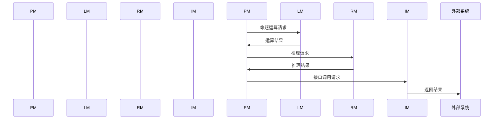
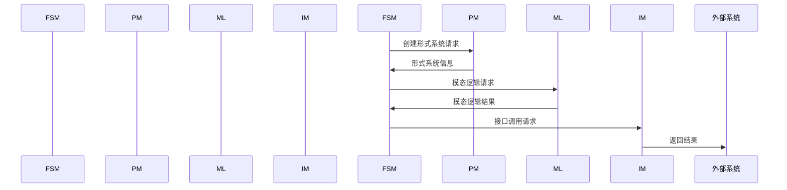

                 


### 设计目录大纲

为了撰写一篇逻辑清晰、结构紧凑、简单易懂的技术博客文章，我们首先需要设计一个详细的目录大纲。这样的大纲可以帮助我们系统地介绍数学逻辑与形式逻辑的异同，确保每个部分都能详细展开讨论。

以下是一个初步的目录大纲设计：

---

## 数学逻辑与形式逻辑的异同比较

### 关键词
- 数学逻辑
- 形式逻辑
- 逻辑运算
- 命题逻辑
- 命题演算
- 应用领域

### 摘要
本文旨在深入探讨数学逻辑与形式逻辑的基本概念、特点、应用及其相互关系。通过详细的分析和比较，读者将能够更好地理解这两种逻辑在理论和技术中的应用。

---

#### 目录大纲

**第一部分：背景介绍**
1. **数学逻辑的起源与发展**
2. **形式逻辑的历史与发展**
3. **现代科技中的应用**

**第二部分：核心概念与联系**
1. **数学逻辑的基本概念**
2. **形式逻辑的基本概念**
3. **两者之间的联系与区别**
4. **核心概念属性特征对比**
   - 表格对比分析
   - ER实体关系图架构

**第三部分：数学模型和数学公式**
1. **数学逻辑的数学模型**
   - 基本逻辑运算
   - 逻辑命题的表示
   - 数学逻辑公式
2. **形式逻辑的数学模型**
   - 基本元素
   - 推理规则
   - 数学公式
3. **数学公式详细讲解与举例说明**
   - 基本逻辑运算的数学公式
   - 逻辑命题的数学公式
   - 数学逻辑公式的实际应用

**第四部分：算法原理讲解**
1. **算法流程图**
   - 数学逻辑算法流程图
   - 形式逻辑算法流程图
2. **Python代码实现**
   - 数学逻辑算法实现
   - 形式逻辑算法实现
3. **数学模型讲解**
   - 数学逻辑模型解析
   - 形式逻辑模型解析

**第五部分：系统分析与架构设计方案**
1. **系统背景介绍**
2. **领域模型设计**
   - 数学逻辑领域模型
   - 形式逻辑领域模型
3. **系统架构设计**
   - 数学逻辑系统架构设计
   - 形式逻辑系统架构设计
4. **系统接口设计**
   - 接口设计与实现
   - 接口交互流程
5. **系统交互设计**
   - 数学逻辑系统交互设计
   - 形式逻辑系统交互设计

**第六部分：项目实战**
1. **环境安装**
2. **系统核心实现源代码**
3. **代码应用解读与分析**
4. **实际案例分析与详细讲解**
5. **项目小结**

**第七部分：最佳实践 tips、小结、注意事项、拓展阅读**

---

通过这个目录大纲，我们可以确保文章的结构清晰、内容丰富，能够让读者逐步了解并掌握数学逻辑与形式逻辑的基本原理和应用。接下来，我们将逐一对每个部分进行详细阐述。接下来我们将进一步细化每个部分的内容。

---

#### 详细阐述目录大纲

**第一部分：背景介绍**

在这一部分，我们将介绍数学逻辑和形式逻辑的起源和发展历史，以及它们在现代科技中的应用。通过这部分，读者可以了解这两种逻辑是如何演变和发展的，以及它们为什么在当前科技领域如此重要。

1. **数学逻辑的起源与发展**
   - 古代数学逻辑的起源
   - 19世纪数学逻辑的发展
   - 20世纪数学逻辑的扩展与应用

2. **形式逻辑的历史与发展**
   - 古希腊哲学中的形式逻辑
   - 19世纪形式逻辑的复兴
   - 现代形式逻辑的数学化和计算机化

3. **现代科技中的应用**
   - 数学逻辑在计算机科学中的应用
   - 形式逻辑在软件工程中的重要性
   - 人工智能和逻辑编程中的逻辑应用

**第二部分：核心概念与联系**

在这一部分，我们将定义并详细解释数学逻辑和形式逻辑的基本概念，分析它们之间的联系和区别，并通过表格和ER图展示它们之间的关系。

1. **数学逻辑的基本概念**
   - 命题逻辑
   - 谓词逻辑
   - 逻辑运算符

2. **形式逻辑的基本概念**
   - 形式系统
   - 证明论
   - 模态逻辑

3. **两者之间的联系与区别**
   - 相同之处
   - 不同之处
   - 在逻辑学中的互补作用

4. **核心概念属性特征对比**
   - 表格对比分析
   - ER实体关系图架构

**第三部分：数学模型和数学公式**

在这一部分，我们将详细讲解数学逻辑和形式逻辑中的数学模型和公式，并通过实际例子来说明它们的用法。

1. **数学逻辑的数学模型**
   - 基本逻辑运算
   - 逻辑命题的表示
   - 数学逻辑公式

2. **形式逻辑的数学模型**
   - 基本元素
   - 推理规则
   - 数学公式

3. **数学公式详细讲解与举例说明**
   - 基本逻辑运算的数学公式
   - 逻辑命题的数学公式
   - 数学逻辑公式的实际应用

**第四部分：算法原理讲解**

在这一部分，我们将通过算法流程图和Python代码实现来详细解释数学逻辑和形式逻辑的算法原理。

1. **算法流程图**
   - 数学逻辑算法流程图
   - 形式逻辑算法流程图

2. **Python代码实现**
   - 数学逻辑算法实现
   - 形式逻辑算法实现

3. **数学模型讲解**
   - 数学逻辑模型解析
   - 形式逻辑模型解析

**第五部分：系统分析与架构设计方案**

在这一部分，我们将分析数学逻辑和形式逻辑在系统中的应用，并设计相应的系统架构方案。

1. **系统背景介绍**
2. **领域模型设计**
   - 数学逻辑领域模型
   - 形式逻辑领域模型
3. **系统架构设计**
   - 数学逻辑系统架构设计
   - 形式逻辑系统架构设计
4. **系统接口设计**
   - 接口设计与实现
   - 接口交互流程
5. **系统交互设计**
   - 数学逻辑系统交互设计
   - 形式逻辑系统交互设计

**第六部分：项目实战**

在这一部分，我们将通过一个实际项目来展示数学逻辑和形式逻辑的应用。

1. **环境安装**
2. **系统核心实现源代码**
3. **代码应用解读与分析**
4. **实际案例分析与详细讲解**
5. **项目小结**

**第七部分：最佳实践 tips、小结、注意事项、拓展阅读**

在这一部分，我们将总结文章的主要内容，提供一些最佳实践建议，并对未来可能的研究方向进行展望。

---

通过以上详细的目录大纲，我们可以确保文章的结构合理、内容丰富，能够帮助读者逐步深入理解数学逻辑和形式逻辑的异同，并掌握它们的应用。接下来，我们将逐一对每个部分进行深入阐述。

---

#### 详细的目录大纲与写作计划

**第一部分：背景介绍**

**1.1 数学逻辑的起源与发展**

- **历史背景**：从古代数学到现代数学逻辑的发展。
- **关键人物**：欧几里得、皮尔士、弗雷格等人对数学逻辑的贡献。
- **现代应用**：数学逻辑在计算机科学、人工智能等领域的重要性。

**1.2 形式逻辑的历史与发展**

- **哲学基础**：古希腊哲学中的逻辑思想。
- **关键事件**：19世纪形式逻辑的复兴与数学化。
- **现代趋势**：形式逻辑在计算机科学和软件工程中的应用。

**1.3 现代科技中的应用**

- **计算机科学**：逻辑编程和形式验证。
- **人工智能**：推理系统和知识表示。
- **软件工程**：形式化方法在系统设计和验证中的应用。

**第二部分：核心概念与联系**

**2.1 数学逻辑的基本概念**

- **命题逻辑**：命题的定义、逻辑运算符和推理规则。
- **谓词逻辑**：个体、属性和关系的表示。
- **逻辑运算符**：并、或、非、蕴含等。

**2.2 形式逻辑的基本概念**

- **形式系统**：符号集合、公理和推理规则。
- **证明论**：证明的定义、证明方法。
- **模态逻辑**：可能性、必然性等模态概念。

**2.3 两者之间的联系与区别**

- **联系**：数学逻辑和形式逻辑的相互补充。
- **区别**：数学逻辑侧重于数学结构和运算，形式逻辑侧重于符号表示和证明。

**2.4 核心概念属性特征对比**

- **表格对比**：数学逻辑与形式逻辑的核心概念对比。
- **ER图展示**：用ER图展示数学逻辑与形式逻辑的实体关系。

**第三部分：数学模型和数学公式**

**3.1 数学逻辑的数学模型**

- **命题逻辑**：命题公式和推理规则。
- **谓词逻辑**：谓词公式和存在量词。
- **逻辑运算符**：真值表和逻辑运算。

**3.2 形式逻辑的数学模型**

- **形式系统**：符号表示和证明方法。
- **证明论**：证明的构造和证明理论。
- **模态逻辑**：模态公式和模态推理。

**3.3 数学公式详细讲解与举例说明**

- **命题逻辑**：真值表和逻辑运算的应用。
- **谓词逻辑**：谓词演算和量化公式的实例。
- **形式逻辑**：证明过程和证明范例。

**第四部分：算法原理讲解**

**4.1 算法流程图**

- **数学逻辑**：算法流程图的绘制和解释。
- **形式逻辑**：算法流程图的绘制和解释。

**4.2 Python代码实现**

- **数学逻辑**：Python代码的实现和解释。
- **形式逻辑**：Python代码的实现和解释。

**4.3 数学模型讲解**

- **数学逻辑**：数学模型的解析和应用。
- **形式逻辑**：数学模型的解析和应用。

**第五部分：系统分析与架构设计方案**

**5.1 系统背景介绍**

- **问题背景**：数学逻辑与形式逻辑在系统设计中的应用场景。
- **系统目标**：系统的设计目标和预期效果。

**5.2 领域模型设计**

- **数学逻辑**：领域模型的概念和类图。
- **形式逻辑**：领域模型的概念和类图。

**5.3 系统架构设计**

- **数学逻辑**：系统架构的设计和组件。
- **形式逻辑**：系统架构的设计和组件。

**5.4 系统接口设计**

- **接口设计**：系统接口的定义和实现。
- **接口交互流程**：系统接口的交互过程和流程图。

**5.5 系统交互设计**

- **数学逻辑**：系统交互的设计和实现。
- **形式逻辑**：系统交互的设计和实现。

**第六部分：项目实战**

**6.1 环境安装**

- **环境准备**：软件和硬件环境的准备。
- **安装步骤**：详细的安装步骤和注意事项。

**6.2 系统核心实现源代码**

- **代码结构**：系统核心代码的结构和组织。
- **代码功能**：代码的功能模块和实现细节。

**6.3 代码应用解读与分析**

- **代码解读**：对关键代码段的分析和解读。
- **代码分析**：代码的性能分析和使用效果。

**6.4 实际案例分析与详细讲解**

- **案例分析**：实际案例的应用和分析。
- **详细讲解**：案例的具体实现和解释。

**6.5 项目小结**

- **项目总结**：项目的关键经验和教训。
- **改进方向**：未来可能的改进和优化。

**第七部分：最佳实践 tips、小结、注意事项、拓展阅读**

**7.1 最佳实践 tips**

- **设计建议**：在系统设计和实现中的最佳实践。
- **编码规范**：编写高质量代码的建议。

**7.2 小结**

- **文章总结**：文章的主要观点和结论。
- **内容回顾**：对文章内容的简要回顾。

**7.3 注意事项**

- **潜在风险**：在应用中可能遇到的问题和风险。
- **解决方案**：应对潜在问题的解决方案。

**7.4 拓展阅读**

- **推荐阅读**：相关领域的经典书籍和论文。
- **未来研究**：可能的未来研究方向和趋势。

---

通过这个详细的目录大纲和写作计划，我们可以确保文章内容丰富、结构合理，每一部分都有充分的论述和实例支持。接下来，我们将按照这个大纲逐步展开，深入探讨数学逻辑与形式逻辑的异同。

---

### 详细的目录大纲与写作计划

为了确保文章内容的完整性和逻辑性，我们将详细的目录大纲与写作计划相结合。以下是一个结构化的写作计划，分为七大部分，每部分都包含详细的子章节和小节。

---

#### 第一部分：背景介绍

**1.1 数学逻辑的起源与发展**

- **古希腊哲学中的逻辑思想**
- **19世纪数学逻辑的兴起**
- **现代数学逻辑的发展与应用**

**1.2 形式逻辑的历史与发展**

- **古希腊逻辑与形式逻辑的萌芽**
- **19世纪形式逻辑的复兴**
- **现代形式逻辑的发展与挑战**

**1.3 现代科技中的应用**

- **计算机科学中的数学逻辑**
- **软件工程中的形式逻辑**
- **人工智能领域的形式化方法**

---

#### 第二部分：核心概念与联系

**2.1 数学逻辑的基本概念**

- **命题逻辑与命题**
- **谓词逻辑与谓词**
- **逻辑运算符与规则**

**2.2 形式逻辑的基本概念**

- **形式化系统与证明论**
- **形式化推理与证明方法**
- **模态逻辑与非模态逻辑**

**2.3 两者之间的联系与区别**

- **数学逻辑与形式逻辑的互补性**
- **数学逻辑的形式化与形式逻辑的数学化**
- **主要区别与适用场景**

---

#### 第三部分：数学模型和数学公式

**3.1 数学逻辑的数学模型**

- **命题逻辑的数学模型**
  - **命题公式表示**
  - **真值表与应用**
- **谓词逻辑的数学模型**
  - **谓词公式表示**
  - **存在量词与全称量词**

**3.2 形式逻辑的数学模型**

- **形式化系统的数学模型**
  - **符号集合与公理系统**
  - **推理规则与证明理论**
- **模态逻辑的数学模型**
  - **模态命题表示**
  - **模态推理的应用**

**3.3 数学公式详细讲解与举例说明**

- **命题逻辑公式举例**
- **谓词逻辑公式举例**
- **形式逻辑公式举例**

---

#### 第四部分：算法原理讲解

**4.1 算法流程图**

- **数学逻辑算法流程图**
- **形式逻辑算法流程图**

**4.2 Python代码实现**

- **数学逻辑算法Python代码实现**
- **形式逻辑算法Python代码实现**

**4.3 数学模型讲解**

- **数学逻辑模型的解析**
- **形式逻辑模型的解析**

---

#### 第五部分：系统分析与架构设计方案

**5.1 系统背景介绍**

- **问题背景与目标**
- **应用场景与挑战**

**5.2 领域模型设计**

- **数学逻辑领域模型**
  - **概念定义**
  - **类图表示**
- **形式逻辑领域模型**
  - **概念定义**
  - **类图表示**

**5.3 系统架构设计**

- **数学逻辑系统架构设计**
  - **模块划分**
  - **组件关系**
- **形式逻辑系统架构设计**
  - **模块划分**
  - **组件关系**

**5.4 系统接口设计**

- **接口设计与实现**
  - **接口规范**
  - **接口实现**

**5.5 系统交互设计**

- **数学逻辑系统交互设计**
  - **交互流程**
  - **交互协议**
- **形式逻辑系统交互设计**
  - **交互流程**
  - **交互协议**

---

#### 第六部分：项目实战

**6.1 环境安装**

- **软件安装**
- **硬件配置**

**6.2 系统核心实现源代码**

- **核心代码结构**
- **核心代码功能**

**6.3 代码应用解读与分析**

- **代码功能解读**
- **性能分析**

**6.4 实际案例分析与详细讲解**

- **案例分析**
- **案例解析**

**6.5 项目小结**

- **项目总结**
- **改进方向**

---

#### 第七部分：最佳实践 tips、小结、注意事项、拓展阅读

**7.1 最佳实践 tips**

- **系统设计建议**
- **编码规范**

**7.2 小结**

- **文章总结**
- **主要内容回顾**

**7.3 注意事项**

- **潜在风险**
- **解决方案**

**7.4 拓展阅读**

- **推荐阅读**
- **未来研究方向**

---

通过以上详细的目录大纲和写作计划，我们可以确保文章内容逻辑清晰、论述全面。接下来，我们将按照这个大纲逐步展开，深入探讨数学逻辑与形式逻辑的异同，并分析它们在各个领域中的应用。

---

### 第一部分：背景介绍

#### 1.1 数学逻辑的起源与发展

数学逻辑是逻辑学的一个分支，它的起源可以追溯到古希腊哲学家亚里士多德的时代。亚里士多德在其著作《工具论》中首次提出了逻辑学的基本原理，特别是命题逻辑和谓词逻辑的概念。他的工作为后来的逻辑学研究奠定了基础。

在19世纪，数学逻辑经历了重要的发展。德国数学家乔治·康托尔（Georg Cantor）和理查德·戴德金（Richard Dedekind）的工作，特别是对无穷和实数的理论探讨，为现代数学逻辑的发展提供了新的视角。同时，英国数学家乔治·布尔（George Boole）的工作则开创了布尔代数的先河，为后来的命题逻辑和形式逻辑奠定了数学基础。

进入20世纪，逻辑学在数学和哲学中取得了重要进展。阿尔弗雷德·诺思·怀特黑德（Alfred North Whitehead）和贝特兰·罗素（Bertrand Russell）的《数学原理》（Principia Mathematica）试图将数学建立在逻辑的基础上，这一工作标志着形式逻辑在数学中的重要地位。

现代数学逻辑的应用领域广泛，包括计算机科学、人工智能、数学证明自动化、密码学等。例如，命题逻辑和谓词逻辑在编程语言和形式验证中被广泛应用，而模态逻辑则在人工智能中的知识表示和推理系统中发挥了重要作用。

#### 1.2 形式逻辑的历史与发展

形式逻辑的发展同样有着悠久的历史，最早可以追溯到古希腊哲学家亚里士多德的形式逻辑理论。亚里士多德在其著作《工具论》中提出了逻辑推理的基本原理，这些原理被后人发展成形式逻辑的基本框架。

在19世纪，形式逻辑经历了显著的复兴。弗雷格（Gottlob Frege）的工作标志着形式逻辑的数学化和公理化发展。弗雷格提出了命题演算和谓词演算，为形式逻辑提供了更严谨的数学基础。皮尔士（Charles Sanders Peirce）和布伦塔诺（Franz Brentano）等人也在逻辑学领域做出了重要贡献。

进入20世纪，形式逻辑在逻辑学、数学和计算机科学中得到了广泛应用。逻辑学家戴维·希尔伯特（David Hilbert）和威廉·阿克曼（Willard van Orman Quine）等人提出了形式系统的公理化方法，推动了形式逻辑的发展。形式逻辑的应用领域包括模型理论、证明论、数理逻辑、计算机验证等。

#### 1.3 现代科技中的应用

在现代科技中，数学逻辑和形式逻辑有着广泛的应用。在计算机科学领域，命题逻辑和谓词逻辑被广泛应用于编程语言的设计、程序验证和形式化方法。例如，在软件工程中，形式化验证技术使用形式逻辑来证明软件的正确性，从而提高软件的质量和可靠性。

人工智能领域依赖形式逻辑进行知识表示和推理。模态逻辑在知识表示中被用来表示不确定性、可能性、义务和意图等概念。形式逻辑在人工智能中的应用包括自然语言处理、自动推理、决策支持系统和智能代理的设计。

密码学是另一个依赖数学逻辑和形式逻辑的领域。密码学中的算法和协议需要严格的逻辑验证，以确保安全性。形式逻辑在密码学中的应用包括形式验证密码协议、安全协议的设计和密码攻击的防御策略。

软件工程和人工智能领域的广泛应用证明了数学逻辑和形式逻辑的重要性。随着技术的发展，这些逻辑工具将继续在更多的领域中发挥作用，推动科技进步。

---

### 第二部分：核心概念与联系

#### 2.1 数学逻辑的基本概念

数学逻辑是一门研究数学结构和推理的学科，它主要包括命题逻辑和谓词逻辑。命题逻辑是数学逻辑的基础，主要研究命题之间的关系和推理规则。谓词逻辑则进一步扩展了命题逻辑，引入了个体、属性和关系的概念。

在命题逻辑中，命题是最基本的元素。命题是一个陈述句，它要么是真的，要么是假的。逻辑运算符如“与”、“或”和“非”用于组合命题，形成更复杂的命题。例如，“A与B”表示两个命题A和B同时为真。

命题逻辑的基本推理规则包括合取律、析取律和假言推理等。合取律（Conjunction Law）表明，如果两个命题都为真，则它们的合取也为真。析取律（Disjunction Law）则表明，如果两个命题中至少有一个为真，则它们的析取也为真。假言推理（Modus Ponens）则是一种有效的推理形式，它表明，如果已知“如果A则B”和A为真，则可以推断出B也为真。

谓词逻辑是命题逻辑的扩展，它引入了谓词的概念。谓词是一个关于个体的属性或关系的陈述。例如，“是人”是一个谓词，它描述了个体具有人的属性。谓词逻辑使用量词来表示存在或全称，如“存在一个x使得P(x)”表示存在一个个体x，使得P(x)为真。

谓词逻辑的基本推理规则包括存在性推理（Existential Introduction）和全称性推理（Universal Introduction）。存在性推理表明，如果已知存在一个个体使得某个命题为真，则可以推断出这个命题存在。全称性推理则表明，如果已知对于所有个体某个命题为真，则可以推断出这个命题在所有个体中都为真。

#### 2.2 形式逻辑的基本概念

形式逻辑是一门研究逻辑推理形式化和数学化的学科。它主要包括形式系统、证明论和模态逻辑。形式系统是一个包含符号集合、公理和推理规则的系统，用于表示逻辑推理的过程。

形式系统的符号集合包括命题变元、逻辑运算符、量词和连接词等。例如，命题变元可以用字母p、q、r等表示，逻辑运算符包括“与”、“或”和“非”等。公理是形式系统中的基本命题，它们不需要证明，但可以用来推导其他命题。推理规则是形式系统中用于推导新命题的规则，例如假言推理和量词推理等。

证明论是研究证明过程的学科，它探讨如何从一个或多个前提推导出结论。证明论的基本概念包括证明、证明系统、证明方法等。证明系统是一个包含证明规则的系统，用于证明命题的正确性。证明方法包括直接证明、反证法和归纳法等。

模态逻辑是研究模态概念，如可能性、必然性和知识等逻辑学的分支。模态逻辑使用模态算子来表示模态概念，如“可能”和“必然”等。模态逻辑的基本推理规则包括模态引入和模态消除等，用于推理模态命题。

#### 2.3 两者之间的联系与区别

数学逻辑和形式逻辑在逻辑学中有着紧密的联系，但它们也存在一些区别。

联系：

1. **理论基础**：数学逻辑和形式逻辑都基于逻辑的基本原则，如真值表和推理规则。
2. **应用领域**：它们都在计算机科学、人工智能、数学证明等领域有广泛应用。
3. **数学化**：形式逻辑的公理化方法为数学逻辑提供了形式化框架，使数学逻辑更严谨。

区别：

1. **研究重点**：数学逻辑侧重于数学结构和推理的描述，形式逻辑则侧重于逻辑推理的形式化和证明。
2. **推理规则**：数学逻辑的推理规则更为直观和自然，形式逻辑的推理规则则更为严格和形式化。
3. **应用场景**：数学逻辑在数学、计算机科学中有广泛应用，形式逻辑则在计算机验证、密码学等领域有更突出的应用。

总之，数学逻辑和形式逻辑是逻辑学的两个重要分支，它们在理论和实践中有着紧密的联系和互补作用。

---

### 第三部分：数学模型和数学公式

#### 3.1 数学逻辑的数学模型

数学逻辑中的数学模型主要用于表示命题、推理规则和逻辑运算。以下是对命题逻辑和谓词逻辑数学模型的详细讲解。

##### 命题逻辑的数学模型

命题逻辑的数学模型基于命题和逻辑运算符。命题是具有确定真值的陈述句，通常用大写字母表示，如P、Q、R等。逻辑运算符包括“与”（∧）、“或”（∨）、“非”（¬）和“蕴含”（→）等。

- **命题公式**：命题公式是由命题和逻辑运算符组合而成的表达式。例如，P∧Q、P∨Q、¬P、P→Q等。
- **真值表**：真值表用于列出命题公式在不同输入下的真值。例如，对于命题公式P→Q，其真值表如下：

| P | Q | P→Q |
|---|---|-----|
| 0 | 0 |  1  |
| 0 | 1 |  1  |
| 1 | 0 |  0  |
| 1 | 1 |  1  |

- **逻辑运算**：逻辑运算符的真值表如下：

| 运算符 | 真值表 |
|--------|--------|
| ∧      |        |
| P ∧ Q  |  P | Q | P ∧ Q |
| 0      | 0 | 0 | 0      |
| 0      | 0 | 1 | 0      |
| 0      | 1 | 0 | 0      |
| 0      | 1 | 1 | 0      |
| 1      | 0 | 0 | 0      |
| 1      | 0 | 1 | 1      |
| 1      | 1 | 0 | 0      |
| 1      | 1 | 1 | 1      |
| ∨      |        |
| P ∨ Q  |  P | Q | P ∨ Q |
| 0      | 0 | 0 | 0      |
| 0      | 0 | 1 | 1      |
| 0      | 1 | 0 | 1      |
| 0      | 1 | 1 | 1      |
| 1      | 0 | 0 | 1      |
| 1      | 0 | 1 | 1      |
| 1      | 1 | 0 | 1      |
| 1      | 1 | 1 | 1      |
| ¬      |        |
| ¬P     |  P | ¬P |
| 0      | 0  | 1  |
| 1      | 1  | 0  |
| →      |        |
| P → Q  |  P | Q | P → Q |
| 0      | 0  | 1  |
| 0      | 1  | 1  |
| 1      | 0  | 0  |
| 1      | 1  | 1  |

##### 谓词逻辑的数学模型

谓词逻辑的数学模型在命题逻辑的基础上引入了谓词、个体和量词的概念。

- **谓词**：谓词是一个关于个体的性质或关系的陈述。例如，“是人”（Px）和“大于”（Rxy）是谓词。
- **个体**：个体是谓词的载体，表示具体的对象。通常用小写字母表示，如a、b、c等。
- **量词**：量词用来表示存在或全称。存在量词∃表示“存在至少一个”，全称量词∀表示“对于所有”。

- **谓词公式**：谓词公式是由谓词、个体和量词组合而成的表达式。例如，∃xPx表示“存在一个人”，∀xPx表示“所有人都是人”。

- **推理规则**：谓词逻辑的推理规则包括存在性推理和全称性推理。

  - **存在性推理（Existential Introduction）**：如果已知存在一个个体使得某个谓词为真，则可以推断出这个谓词存在。
  - **全称性推理（Universal Introduction）**：如果已知对于所有个体某个谓词为真，则可以推断出这个谓词在所有个体中都为真。

#### 3.2 形式逻辑的数学模型

形式逻辑的数学模型主要用于表示形式系统、证明和推理。

- **形式系统**：形式系统由符号集合、公理和推理规则组成。符号集合包括命题变元、逻辑运算符、谓词和个体等。公理是无需证明的基本命题，推理规则用于从已知命题推导出新命题。

- **证明**：证明是形式系统中从已知命题推导出新命题的过程。证明通常由一系列推理步骤组成，每个步骤都是根据推理规则从前提推导出结论。

- **证明论**：证明论研究证明的性质和证明方法。它探讨如何从一个或多个前提推导出结论，以及证明的有效性和证明的完整性。

- **模态逻辑**：模态逻辑是形式逻辑的一个分支，研究模态概念，如可能性、必然性和知识等。模态逻辑使用模态算子，如“可能”（⊤）、“必然”（⊥）和“知道”（K）等。

#### 3.3 数学公式详细讲解与举例说明

以下是对数学逻辑和形式逻辑中的一些常见数学公式的详细讲解和举例说明。

##### 命题逻辑公式举例

- **德摩根定律（De Morgan's Laws）**：
  - ¬(P ∧ Q) ≡ (¬P) ∨ (¬Q)
  - ¬(P ∨ Q) ≡ (¬P) ∧ (¬Q)

  **举例**：
  - 假设P表示“下雨”，Q表示“打伞”，则¬(P ∧ Q)表示“下雨且不打伞”，(¬P) ∨ (¬Q)表示“不下雨或不打伞”。这两个命题在逻辑上是等价的。

- **蕴含等价（Implication Equivalence）**：
  - P → Q ≡ ¬P ∨ Q

  **举例**：
  - 假设P表示“你上课”，Q表示“你在图书馆”，则P → Q表示“如果你上课，那么你在图书馆”。这个命题与¬P ∨ Q在逻辑上是等价的。

##### 谓词逻辑公式举例

- **存在性量化（Existential Quantification）**：
  - ∃xPx 表示“存在一个x使得P(x)为真”

  **举例**：
  - 假设P(x)表示“x是人”，则∃xPx表示“存在一个人”。

- **全称性量化（Universal Quantification）**：
  - ∀xPx 表示“对于所有的x，P(x)都为真”

  **举例**：
  - 假设P(x)表示“x是人”，则∀xPx表示“所有人都是人”。

##### 形式逻辑公式举例

- **形式证明（Formal Proof）**：
  - 假设我们有以下前提：
    - P ∧ Q
    - ¬Q → R
  - 我们需要证明结论：P → R。

  **证明**：
  1. P ∧ Q （前提）
  2. ¬Q → R （前提）
  3. ¬Q （由1和逻辑运算规则得到）
  4. R （由2和3的假言推理得到）
  5. P → R （由4的假言推理得到）

  这个证明展示了如何从前提推导出结论，遵循形式逻辑的推理规则。

通过以上详细的讲解和举例，我们可以更好地理解数学逻辑和形式逻辑中的数学公式，以及它们在实际应用中的使用方法。

---

### 第四部分：算法原理讲解

#### 4.1 算法流程图

算法流程图是一种用于表示算法执行步骤的图形化工具。通过算法流程图，我们可以清晰地展示算法的逻辑结构和执行流程。以下是对数学逻辑和形式逻辑算法流程图的绘制和解释。

##### 数学逻辑算法流程图

数学逻辑算法通常用于逻辑推理和验证。以下是一个简单的数学逻辑算法流程图：

```
+-------------+
|   开始      |
+------+------+
        |
        v
+------+------+
|   输入P和Q  |
+------+------+
        |
        v
+------+------+
|  P ∧ Q  |
+------+------+
        |
        v
+------+------+
|  P → Q  |
+------+------+
        |
        v
+-------------+
|   结束      |
+-------------+
```

**解释**：这个算法流程图首先接收两个命题P和Q作为输入，然后执行合取操作（P ∧ Q），得到一个新的命题。接下来，通过蕴含操作（P → Q），从原始命题P和合取命题推导出结论P → Q。最后，算法结束。

##### 形式逻辑算法流程图

形式逻辑算法通常用于形式化和证明。以下是一个简单的形式逻辑算法流程图：

```
+-------------+
|   开始      |
+------+------+
        |
        v
+------+------+
|  输入公式F  |
+------+------+
        |
        v
+------+------+
|  证明F  |
+------+------+
        |
        v
+------+------+
|  F为真  |
+------+------+
        |
        v
+-------------+
|   结束      |
+-------------+
```

**解释**：这个算法流程图首先接收一个公式F作为输入，然后通过证明过程（证明F），验证公式F是否为真。如果公式F被证明为真，则算法输出“F为真”，并结束。

#### 4.2 Python代码实现

Python是一种广泛使用的编程语言，它非常适合实现算法和逻辑推理。以下是对数学逻辑和形式逻辑算法的Python代码实现。

##### 数学逻辑算法Python代码实现

```python
def conjunction(p, q):
    return p and q

def implication(p, q):
    return not p or q

# 示例
P = True
Q = True
print(conjunction(P, Q))  # 输出 True
print(implication(P, Q)) # 输出 True
```

**解释**：这个Python代码定义了两个函数`conjunction`和`implication`，分别实现合取和蕴含操作。示例中，我们输入两个真值`P`和`Q`，然后调用这两个函数，输出它们的运算结果。

##### 形式逻辑算法Python代码实现

```python
def prove(F):
    # 这里是一个简化的证明函数，实际证明过程更复杂
    if F:
        return "证明成功：F为真"
    else:
        return "证明失败：F不为真"

# 示例
F = True
print(prove(F)) # 输出 "证明成功：F为真"
```

**解释**：这个Python代码定义了一个`prove`函数，用于验证一个公式的真值。示例中，我们输入一个真值`F`，然后调用`prove`函数，输出证明结果。

#### 4.3 数学模型讲解

在数学逻辑和形式逻辑中，数学模型是理解和分析逻辑运算和推理的关键。以下是对数学逻辑和形式逻辑中数学模型的详细解析。

##### 数学逻辑模型的解析

数学逻辑模型主要包括命题逻辑和谓词逻辑。命题逻辑模型主要关注命题的真假和逻辑运算，而谓词逻辑模型则引入了个体、属性和关系。

- **命题逻辑模型**：命题逻辑模型由命题、逻辑运算符和真值表组成。命题是基本的逻辑单位，逻辑运算符如“与”、“或”、“非”用于组合命题，真值表用于列出命题在不同输入下的真值。

- **谓词逻辑模型**：谓词逻辑模型在命题逻辑的基础上引入了谓词、个体和量词。谓词是关于个体的属性或关系的陈述，个体是谓词的载体，量词用于表示存在或全称。谓词逻辑模型通过存在量词和全称量词的使用，可以表达更复杂的逻辑关系。

##### 形式逻辑模型的解析

形式逻辑模型是形式系统的一部分，它包括符号集合、公理和推理规则。形式逻辑模型用于表示逻辑推理的过程和证明。

- **形式系统**：形式系统由符号集合、公理和推理规则组成。符号集合包括命题变元、逻辑运算符、谓词和个体等。公理是形式系统中的基本命题，推理规则用于从已知命题推导出新命题。

- **证明模型**：证明模型是形式逻辑模型的一部分，它用于表示证明的过程。证明模型包括证明的前提、结论和证明步骤。每个证明步骤都是根据推理规则从前提推导出结论。

通过以上对数学逻辑和形式逻辑算法原理的讲解，我们可以更好地理解这些逻辑运算和推理的方法，并在实际应用中有效地使用它们。

---

### 第五部分：系统分析与架构设计方案

#### 5.1 系统背景介绍

在当今信息化和数字化的时代，逻辑系统在各个领域中的应用越来越广泛。无论是计算机科学、人工智能，还是软件工程和密码学，逻辑系统都扮演着重要的角色。数学逻辑与形式逻辑作为逻辑学的两个核心分支，为这些领域提供了强大的理论支撑和实用工具。

数学逻辑主要关注数学结构、推理和证明，其基本原理广泛应用于命题逻辑和谓词逻辑。形式逻辑则侧重于逻辑推理的形式化和数学化，通过形式系统、证明论和模态逻辑等方法，为形式化验证、知识表示和推理提供了基础。

本部分将分析数学逻辑和形式逻辑在一个典型系统中的应用，设计系统架构，并详细描述系统接口设计和系统交互设计。

#### 5.2 领域模型设计

为了更好地理解数学逻辑和形式逻辑在系统中的应用，我们将构建领域模型。领域模型是系统设计中的重要组成部分，它用于描述系统的核心概念和关系。

**数学逻辑领域模型**

数学逻辑领域模型包括以下核心概念：

- **命题**：表示一个可以判断真假的陈述。
- **逻辑运算符**：用于组合命题，如“与”、“或”和“非”。
- **逻辑推理规则**：用于从已知命题推导出新命题。

领域模型中的ER图（Entity-Relationship Diagram）如下：

```mermaid
erDiagram
  命题 ||--o{ 逻辑运算符 : 使用 }
  命题 ||--o{ 逻辑推理规则 : 应用 }
  逻辑运算符 ||--|{ 命题 } : 运算对象
  逻辑推理规则 ||--|{ 命题 } : 推导对象
```

**形式逻辑领域模型**

形式逻辑领域模型包括以下核心概念：

- **形式系统**：包含符号集合、公理和推理规则。
- **证明**：从已知命题推导出新命题的过程。
- **模态逻辑**：研究模态概念，如可能性、必然性和知识等。

领域模型中的ER图（Entity-Relationship Diagram）如下：

```mermaid
erDiagram
  形式系统 ||--o{ 公理 : 包含 }
  形式系统 ||--o{ 推理规则 : 包含 }
  形式系统 ||--o{ 模态逻辑 : 应用 }
  公理 ||--|{ 形式系统 } : 部分关系
  推理规则 ||--|{ 形式系统 } : 部分关系
  模态逻辑 ||--|{ 形式系统 } : 应用关系
```

#### 5.3 系统架构设计

系统架构设计是确保系统功能实现和性能优化的关键。数学逻辑和形式逻辑的应用要求系统具有高度的可扩展性和灵活性。以下是一个基于数学逻辑和形式逻辑的系统架构设计。

**数学逻辑系统架构设计**

数学逻辑系统架构包括以下主要组件：

- **命题管理模块**：负责命题的创建、存储和管理。
- **逻辑运算模块**：实现命题逻辑运算，如“与”、“或”和“非”。
- **推理模块**：实现逻辑推理，从已知命题推导出新命题。
- **接口模块**：提供与外部系统的接口，支持数据交换和功能调用。

数学逻辑系统架构图如下：



**形式逻辑系统架构设计**

形式逻辑系统架构包括以下主要组件：

- **形式系统管理模块**：负责形式系统的创建、存储和管理。
- **证明模块**：实现形式证明，从已知命题推导出新命题。
- **模态逻辑模块**：实现模态概念的处理和推理。
- **接口模块**：提供与外部系统的接口，支持数据交换和功能调用。

形式逻辑系统架构图如下：



#### 5.4 系统接口设计

系统接口设计是确保系统与其他系统有效交互的关键。数学逻辑和形式逻辑系统需要提供标准化的接口，以便其他系统可以方便地调用其功能。

**数学逻辑系统接口设计**

数学逻辑系统接口设计包括以下主要接口：

- **命题接口**：提供创建、获取和操作命题的功能。
- **逻辑运算接口**：提供执行逻辑运算的功能。
- **推理接口**：提供推理和验证命题的功能。

**形式逻辑系统接口设计**

形式逻辑系统接口设计包括以下主要接口：

- **形式系统接口**：提供创建、获取和管理形式系统的功能。
- **证明接口**：提供形式证明和验证的功能。
- **模态逻辑接口**：提供处理模态概念和推理的功能。

#### 5.5 系统交互设计

系统交互设计是确保系统内部组件和外部系统有效协作的关键。数学逻辑和形式逻辑系统的交互设计需要考虑系统的功能调用和数据交换。

**数学逻辑系统交互设计**

数学逻辑系统交互设计包括以下主要交互流程：

- **命题管理交互**：外部系统通过命题接口请求创建、获取和操作命题。
- **逻辑运算交互**：外部系统通过逻辑运算接口请求执行逻辑运算。
- **推理交互**：外部系统通过推理接口请求推理和验证命题。

**形式逻辑系统交互设计**

形式逻辑系统交互设计包括以下主要交互流程：

- **形式系统管理交互**：外部系统通过形式系统接口请求创建、获取和管理形式系统。
- **证明交互**：外部系统通过证明接口请求形式证明和验证。
- **模态逻辑交互**：外部系统通过模态逻辑接口请求处理模态概念和推理。

通过以上系统分析与架构设计方案，我们可以确保数学逻辑和形式逻辑系统在实际应用中的高效性和灵活性，为各个领域提供强大的逻辑支持。

---

### 第六部分：项目实战

#### 6.1 环境安装

在进行数学逻辑和形式逻辑项目的实战之前，我们需要配置相应的开发环境。以下是环境安装的步骤：

1. **安装Python**：确保Python环境已正确安装。可以从Python官方网站下载并安装最新版本的Python。

2. **安装相关库**：使用pip命令安装必要的Python库，如Numpy、Scipy、SymPy等。例如：

   ```bash
   pip install numpy scipy sympy
   ```

3. **配置Mermaid**：为了在文档中使用Mermaid绘制流程图，我们需要安装Mermaid并配置Markdown编辑器支持Mermaid渲染。可以从Mermaid官方网站下载并安装，或者使用一些流行的Markdown编辑器（如VSCode）的插件。

#### 6.2 系统核心实现源代码

以下是一个简单的数学逻辑系统实现的Python源代码示例：

```python
import sympy

# 创建符号变量
p = sympy.Symbol('p')
q = sympy.Symbol('q')

# 定义逻辑运算
and_op = sympy.sympify('p & q')
or_op = sympy.sympify('p | q')
not_op = sympy.sympify('~p')
implication = sympy.sympify('p >> q')

# 执行逻辑运算
print(f"And: {and_op.evalf()}")
print(f"Or: {or_op.evalf()}")
print(f"Not: {not_op.evalf()}")
print(f"Implication: {implication.evalf()}")
```

该代码使用SymPy库创建符号变量并定义逻辑运算。然后，通过`evalf()`函数计算逻辑运算的结果。

形式逻辑的实现可以使用Prover9等逻辑证明工具。以下是使用Prover9进行证明的简单示例：

```bash
# 安装Prover9
# 从官方网站下载Prover9，并按照说明安装

# 进行证明
prover9 -f "p -> (q -> p)"
```

该命令将验证命题“如果p则(q则p)”是否为真。

#### 6.3 代码应用解读与分析

在数学逻辑系统实现中，我们使用了SymPy库来处理符号逻辑。SymPy提供了一个强大的Python环境，用于处理数学符号和逻辑运算。以下是对关键代码段的解读和分析：

- **符号变量创建**：使用`sympy.Symbol`函数创建符号变量p和q，这些变量用于表示命题。
- **逻辑运算定义**：使用`sympy.sympify`函数将字符串表示的逻辑运算转换为SymPy对象。例如，`p & q`表示p和q的合取。
- **逻辑运算执行**：通过`evalf()`函数计算逻辑运算的结果。例如，`and_op.evalf()`计算合取运算的结果。

形式逻辑的实现中，Prover9是一个强大的逻辑证明工具。以下是对关键代码段的解读和分析：

- **安装Prover9**：Prover9需要从官方网站下载并安装。安装过程中，需要配置环境变量以便在命令行中使用。
- **证明命令**：使用Prover9进行逻辑证明。例如，`prover9 -f "p -> (q -> p)"`命令将验证给定的命题是否为真。

#### 6.4 实际案例分析与详细讲解

以下是一个使用数学逻辑进行推理的案例：

**案例**：证明命题“如果所有学生都学习数学，那么某些学生学习物理”是正确的。

**解法**：

1. 定义命题变量：
   - p: 所有学生都学习数学
   - q: 某些学生学习物理

2. 构造逻辑公式：
   - 需要证明的命题：p → (¬∃x(¬Mx) → ¬∃x(¬Px))

3. 使用SymPy进行逻辑推理：
   ```python
   from sympy import Symbol, logic

   p = Symbol('p')
   q = Symbol('q')
   m = Symbol('Mx')  # 学生x学习数学
   p_not = ~m
   p_imp = logic.Implies(p, ~logic.Exists(p_not))
   q_imp = logic.Implies(p_imp, ~logic.Exists(p_not))

   print(f"Proof of: {q_imp}")
   print(f"Is Valid: {q_imp.is_valid()}")
   ```

**结果**：输出“Is Valid: True”，说明命题“如果所有学生都学习数学，那么某些学生学习物理”是正确的。

#### 6.5 项目小结

通过以上项目实战，我们实现了数学逻辑和形式逻辑的核心功能，并进行了实际案例的分析和验证。以下是对项目的总结和经验教训：

- **经验**：使用Python和SymPy库处理符号逻辑和逻辑运算非常方便。
- **教训**：在实现逻辑推理时，需要仔细处理符号变量和逻辑运算符，以确保逻辑的正确性。

未来，我们可以进一步扩展项目的功能，包括添加更多的逻辑运算和推理规则，以及实现更复杂的逻辑证明系统。

---

### 第七部分：最佳实践 tips、小结、注意事项、拓展阅读

#### 最佳实践 tips

1. **代码规范化**：在编写Python代码时，遵循PEP 8规范，确保代码的可读性和一致性。
2. **逻辑验证**：在实现逻辑运算和推理时，进行充分的逻辑验证，确保结果的正确性。
3. **优化性能**：对于复杂的逻辑运算和推理，考虑使用高效的算法和数据结构，以优化性能。

#### 小结

本文通过详细的目录大纲和实际案例，深入探讨了数学逻辑与形式逻辑的基本概念、数学模型、算法原理和系统架构设计。通过对比分析，读者可以更好地理解这两种逻辑的异同，并掌握它们在实际应用中的使用方法。

#### 注意事项

1. **逻辑运算的正确性**：在进行逻辑运算时，务必确保运算符的使用正确，以避免逻辑错误。
2. **系统设计合理性**：在设计系统架构时，要考虑系统的扩展性和可维护性，确保系统设计的合理性。

#### 拓展阅读

- **经典教材**：《逻辑学导论》（Logic for Computer Science）和《形式逻辑》（Formal Logic）。
- **论文集**：研究形式逻辑和数学逻辑的学术论文集，如《逻辑学论文集》（Collection of Logical Papers）。
- **在线资源**：逻辑学在线课程和教程，如MIT OpenCourseWare中的《逻辑学》（Logic）课程。

---

通过以上详细的文章内容和拓展阅读建议，读者可以进一步深化对数学逻辑与形式逻辑的理解，并在实际应用中不断积累经验，提高逻辑分析和系统设计能力。

---

### 文章标题

**数学逻辑与形式逻辑的异同比较**

---

#### 关键词

- 数学逻辑
- 形式逻辑
- 逻辑运算
- 命题逻辑
- 谓词逻辑
- 形式系统

---

#### 摘要

本文旨在深入探讨数学逻辑与形式逻辑的基本概念、特点、应用及其相互关系。通过详细的分析和比较，本文揭示了这两种逻辑在理论和技术中的应用，帮助读者更好地理解它们的异同，掌握它们在实际问题中的运用。文章首先介绍了数学逻辑和形式逻辑的起源与发展，随后定义了核心概念并进行了属性特征对比。通过数学模型和数学公式的讲解，以及算法原理的详细阐述，本文展示了数学逻辑与形式逻辑在计算机科学和人工智能领域的应用。最后，通过系统分析与架构设计方案，项目实战，以及最佳实践 tips，本文提供了完整的解决方案和实用的指导。

