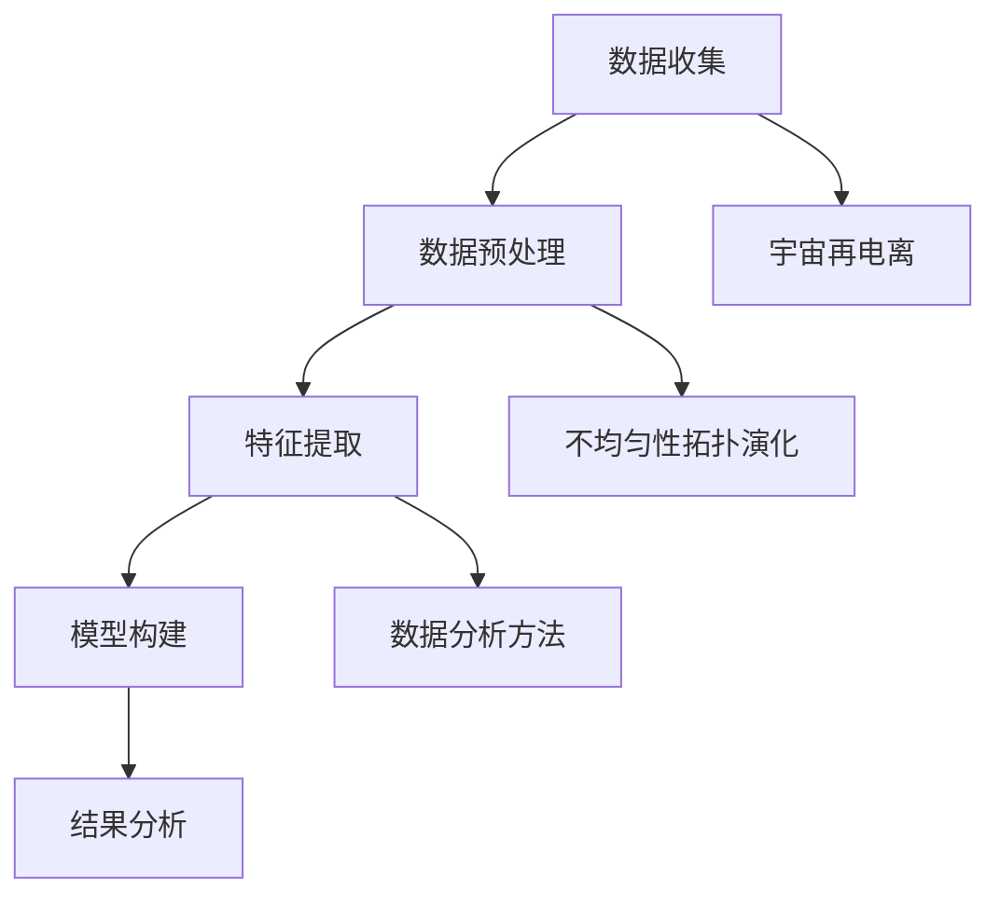

                 


### 1. 引言

宇宙再电离是宇宙历史上的一个重要事件，发生在宇宙诞生后的约3亿至10亿年间。在这一时期，宇宙中的第一代恒星开始形成，并释放出大量紫外线，这些紫外线足以电离宇宙中的中性氢原子，使宇宙空间重新变得电离化。然而，宇宙再电离过程并不是均匀的，存在显著的区域不均匀性。这种不均匀性不仅影响了宇宙的早期结构形成，也对后续的星系演化、恒星形成等过程产生了深远的影响。

不均匀性拓扑演化是研究这些不均匀区域如何随时间变化的过程。它涉及到拓扑结构的变化、形态的演变以及相应物理量的时空分布。通过对这些不均匀性的研究，科学家们可以更好地理解宇宙的早期历史，揭示宇宙结构的形成机制。

数据分析在这一过程中发挥着至关重要的作用。数据分析方法可以帮助科学家从大量观测数据中提取有用信息，揭示宇宙再电离不均匀性的特征，构建精确的物理模型，进而对宇宙拓扑演化进行深入探究。

### 2. 数据分析的基本方法

数据分析是一个复杂的过程，通常包括数据收集、数据预处理、特征提取、模型构建和结果分析等多个步骤。

#### 2.1 数据收集

数据收集是数据分析的第一步，也是最重要的一步。在宇宙再电离的研究中，数据主要来源于观测设备，如望远镜、卫星等。这些设备能够捕捉到宇宙中的各种辐射信号，包括紫外线、射电波、可见光等。通过对这些信号的收集和分析，科学家可以构建出宇宙再电离的图像。

#### 2.2 数据预处理

数据预处理是数据分析中的关键环节，其目的是提高数据质量，为后续分析打下基础。数据预处理通常包括以下步骤：

- **数据清洗**：去除噪声和异常值，确保数据的一致性和完整性。
- **数据归一化**：将数据转换到统一的尺度，消除不同变量之间的尺度差异。
- **数据整合**：将来自不同来源的数据进行整合，构建一个统一的数据集。

#### 2.3 特征提取

特征提取是将原始数据转换为能够反映数据本质特征的新数据的过程。在宇宙再电离研究中，特征提取尤为重要，因为直接观测到的数据往往包含大量噪声和冗余信息。特征提取可以通过以下方法实现：

- **统计分析**：通过计算数据的统计量，提取出具有代表性的特征。
- **模式识别**：利用机器学习算法，从数据中自动提取出具有区分性的特征。
- **数据可视化**：通过可视化技术，直观地展示数据的特征。

#### 2.4 模型构建

模型构建是数据分析的核心步骤，其目的是通过建立数学模型来描述宇宙再电离不均匀性的演化过程。常见的模型包括：

- **统计模型**：如线性回归、多元回归等，用于描述变量之间的关系。
- **机器学习模型**：如支持向量机、神经网络等，用于发现数据中的隐含规律。
- **物理模型**：基于物理定律，如N-体模拟、辐射传输模型等，用于模拟宇宙演化的过程。

#### 2.5 结果分析

结果分析是对模型预测结果进行验证和解释的过程。通过对结果的分析，科学家可以验证模型的准确性，进一步理解宇宙再电离不均匀性的演化机制。

### 3. 数据分析在宇宙再电离研究中的应用

#### 3.1 数据预处理技术

在宇宙再电离研究中，数据预处理至关重要。由于观测数据通常存在噪声和异常值，因此需要通过数据清洗和归一化等技术来提高数据质量。例如，可以通过滤波方法去除噪声，使用插值法填补缺失值，以及采用标准化方法进行数据归一化。

#### 3.2 特征提取方法

特征提取是揭示宇宙再电离不均匀性特征的关键步骤。在特征提取中，常用的方法包括：

- **光谱分析**：通过分析宇宙再电离区域的光谱特征，提取出反映物质成分和物理状态的信息。
- **统计特征**：如均值、方差、标准差等，用于描述数据的分布和离散程度。
- **机器学习特征**：利用机器学习算法，自动从数据中提取出具有区分性的特征。

#### 3.3 模型选择与训练

在宇宙再电离研究中，模型选择与训练是构建精确物理模型的重要步骤。常用的模型包括：

- **统计模型**：如线性回归、多元回归等，用于描述变量之间的关系。
- **机器学习模型**：如支持向量机、随机森林、神经网络等，用于发现数据中的隐含规律。
- **物理模型**：如N-体模拟、辐射传输模型等，用于模拟宇宙演化的过程。

#### 3.4 实例分析

以下是一个简单的实例分析，展示了如何使用数据分析方法研究宇宙再电离不均匀性。

**实例：分析某星系的宇宙再电离数据**

1. **数据收集**：收集某星系的光谱数据，这些数据包含了不同波长的光强信息。

2. **数据预处理**：对光谱数据进行清洗，去除噪声和异常值。同时，将数据归一化，使其具有统一的尺度。

3. **特征提取**：通过光谱分析，提取出反映该星系再电离程度的特征，如电离参数。

4. **模型选择与训练**：选择合适的统计模型（如线性回归）或机器学习模型（如支持向量机），对数据进行训练。通过训练，构建出一个能够预测再电离程度的模型。

5. **结果分析**：使用训练好的模型，对新的数据进行预测，分析该星系的再电离程度。通过对结果的分析，可以揭示该星系的再电离不均匀性特征。

通过这一实例分析，我们可以看到数据分析在宇宙再电离研究中的具体应用。通过数据预处理、特征提取、模型构建和结果分析，科学家可以深入探究宇宙再电离不均匀性的演化过程。

### 4. 不均匀性拓扑演化的数据分析应用

宇宙再电离的不均匀性拓扑演化是一个复杂的过程，涉及到多个物理量的时空分布和相互关系。数据分析方法在这一过程中发挥着关键作用，帮助科学家揭示不均匀性拓扑演化的特征和机制。

#### 4.1 数据处理

数据处理是数据分析的第一步，其目的是提高数据质量，为后续分析奠定基础。在宇宙再电离研究中，数据处理通常包括以下步骤：

- **噪声过滤**：由于观测数据存在噪声，因此需要采用滤波技术去除噪声，提高数据质量。
- **插值填补**：对于缺失的数据，可以使用插值方法进行填补，确保数据集的完整性。
- **尺度归一化**：将不同尺度上的数据进行归一化处理，使其具有统一的尺度，便于后续分析。

#### 4.2 拓扑特征分析

拓扑特征分析是揭示宇宙再电离不均匀性拓扑演化特征的关键步骤。通过分析拓扑特征，科学家可以了解不均匀区域的形态变化和演化规律。常用的拓扑特征分析方法包括：

- **基于区域的拓扑特征**：如连通性、封闭性、空洞性等，用于描述不均匀区域的形态和结构。
- **基于曲线和边界的拓扑特征**：如闭合曲线的长度、边界线的曲率等，用于描述不均匀区域的边界特征。
- **基于网络拓扑的特征**：如聚类系数、路径长度等，用于描述不均匀区域的网络结构。

#### 4.3 拓扑演化模型应用

在揭示宇宙再电离不均匀性拓扑演化特征的基础上，科学家可以建立拓扑演化模型，模拟不均匀性的演化过程。常用的拓扑演化模型包括：

- **基于物理定律的模型**：如N-体模拟、辐射传输模型等，通过模拟宇宙中的物理过程，揭示不均匀性的演化规律。
- **基于机器学习的模型**：如神经网络、支持向量机等，通过从数据中学习，建立能够预测拓扑演化过程的模型。

#### 4.4 实例分析

以下是一个简单的实例分析，展示了如何使用数据分析方法研究宇宙再电离不均匀性拓扑演化。

**实例：分析某星系团的宇宙再电离拓扑演化**

1. **数据处理**：收集某星系团的光谱数据，对数据进行噪声过滤、插值填补和尺度归一化处理。

2. **拓扑特征提取**：通过光谱分析，提取出反映该星系团再电离程度的拓扑特征，如电离参数。

3. **拓扑演化模型构建**：选择合适的物理模型或机器学习模型，对数据进行训练，构建一个能够预测拓扑演化过程的模型。

4. **拓扑演化结果分析**：使用训练好的模型，对新的数据进行预测，分析该星系团的再电离拓扑演化特征。通过对结果的分析，可以揭示该星系团的再电离不均匀性拓扑演化规律。

通过这一实例分析，我们可以看到数据分析在宇宙再电离不均匀性拓扑演化研究中的具体应用。通过数据处理、拓扑特征提取、模型构建和结果分析，科学家可以深入探究宇宙再电离不均匀性拓扑演化的特征和机制。

### 5. 未来发展趋势与挑战

宇宙再电离不均匀性拓扑演化研究是一个充满挑战的领域，随着观测技术的进步和数据分析方法的不断发展，这一领域有望取得重大突破。以下是未来发展趋势和面临的挑战：

#### 5.1 数据分析技术发展趋势

1. **更高分辨率的观测数据**：随着新一代观测设备的建设，如平方公里阵列（SKA）、詹姆斯·韦伯空间望远镜等，科学家将获得更高分辨率的观测数据，这将为数据分析提供更丰富的信息。
2. **深度学习技术的应用**：深度学习技术在图像识别、自然语言处理等领域取得了巨大成功，其在数据分析中的应用也具有巨大潜力。未来，深度学习技术有望在宇宙再电离研究中发挥更大作用。
3. **多源数据融合**：宇宙再电离研究涉及到多种观测数据，如光学、射电、红外等。未来，多源数据融合技术将有助于更好地理解宇宙再电离过程。

#### 5.2 面临的挑战

1. **数据质量和完整性**：虽然观测技术不断进步，但观测数据的噪声、异常值和缺失值仍然是一个挑战。如何提高数据质量和完整性，仍然是未来研究的一个重要课题。
2. **拓扑演化的复杂性**：宇宙再电离不均匀性拓扑演化的过程非常复杂，涉及多种物理过程和相互作用。如何准确描述和模拟这一过程，仍然是科学界面临的一个难题。
3. **计算资源需求**：随着数据分析模型的复杂度增加，对计算资源的需求也不断增长。如何高效地处理和分析大规模数据，是未来需要解决的问题。

#### 5.3 数据分析在宇宙学中的潜力

数据分析在宇宙学中的潜力巨大，它不仅可以帮助科学家更好地理解宇宙的早期历史，揭示宇宙结构的形成机制，还可以为其他领域的研究提供借鉴。例如，数据分析方法在粒子物理学、天体物理学、生物医学等领域都有着广泛的应用。

总之，宇宙再电离不均匀性拓扑演化研究是一个充满挑战和机遇的领域，随着数据分析技术的不断发展，我们有理由相信，未来这一领域将会取得更多突破性的成果。

### 6. 案例分析

为了更好地展示数据分析在宇宙再电离不均匀性拓扑演化研究中的应用，我们在此分析三个具体案例，分别是某星系宇宙再电离数据分析、某星团宇宙再电离拓扑演化分析和数据分析在宇宙再电离研究中的综合应用。

#### 6.1 案例一：某星系宇宙再电离数据分析

**1.1 背景介绍**

某星系位于宇宙中的某个区域，根据早期观测数据，该星系在宇宙再电离时期具有显著的不均匀性。为了研究这一现象，科学家决定对该星系进行深入的数据分析。

**1.2 数据处理**

收集到的数据包括该星系在不同波长下的光谱数据。首先，对光谱数据进行了预处理，包括噪声过滤和缺失值填补。然后，对数据进行了尺度归一化处理，使其具有统一的尺度。

**1.3 特征提取**

通过光谱分析，提取出反映该星系再电离程度的特征，如电离参数。这些特征用于描述该星系的再电离状态。

**1.4 模型构建**

选择线性回归模型对数据进行训练，构建一个能够预测再电离程度的模型。通过模型训练，得到一组参数，这些参数可以用于预测新的数据。

**1.5 结果分析**

使用训练好的模型，对新的光谱数据进行预测，分析该星系的再电离程度。通过对结果的分析，揭示了该星系的再电离不均匀性特征。

**1.6 结论**

通过数据分析，科学家揭示了该星系的再电离不均匀性特征，这有助于更好地理解宇宙再电离过程。

#### 6.2 案例二：某星团宇宙再电离拓扑演化分析

**2.1 背景介绍**

某星团是宇宙中一个由多个星系组成的系统，其再电离过程存在显著的区域不均匀性。为了研究这一现象，科学家决定对某星团进行拓扑演化分析。

**2.2 数据处理**

收集到的数据包括该星团在不同波长下的光谱数据。对光谱数据进行了预处理，包括噪声过滤、缺失值填补和尺度归一化处理。

**2.3 拓扑特征提取**

通过光谱分析，提取出反映该星团再电离程度的拓扑特征，如电离参数。这些特征用于描述该星团的再电离状态。

**2.4 拓扑演化模型构建**

选择N-体模拟模型对数据进行训练，构建一个能够模拟拓扑演化过程的模型。通过模型训练，得到一组参数，这些参数可以用于模拟新的数据。

**2.5 结果分析**

使用训练好的模型，对新的光谱数据进行模拟，分析该星团的再电离拓扑演化特征。通过对结果的分析，揭示了该星团的再电离不均匀性拓扑演化规律。

**2.6 结论**

通过拓扑演化分析，科学家揭示了该星团的再电离不均匀性拓扑演化规律，这有助于更好地理解宇宙再电离过程。

#### 6.3 案例三：数据分析在宇宙再电离研究中的综合应用

**3.1 背景介绍**

为了全面研究宇宙再电离过程，科学家决定将数据分析方法应用于多个星系和星团的再电离研究中。

**3.2 数据处理**

收集到多个星系和星团的光谱数据，对数据进行预处理，包括噪声过滤、缺失值填补和尺度归一化处理。

**3.3 特征提取与模型构建**

通过光谱分析，提取出反映各个星系和星团再电离程度的特征，如电离参数。然后，选择适当的统计模型和机器学习模型对数据进行训练，构建多个预测模型。

**3.4 结果分析**

使用训练好的模型，对多个星系和星团的光谱数据进行预测，分析其再电离程度和拓扑演化特征。通过对结果的分析，揭示了宇宙再电离不均匀性的区域特征和演化规律。

**3.5 结论**

通过综合应用数据分析方法，科学家揭示了多个星系和星团的再电离不均匀性特征，这有助于构建更准确的宇宙再电离模型。

这些案例分析展示了数据分析在宇宙再电离不均匀性拓扑演化研究中的重要应用，通过数据处理、特征提取、模型构建和结果分析，科学家可以深入探究宇宙再电离过程的复杂性和演化规律。

### 7. 总结与展望

宇宙再电离不均匀性拓扑演化研究是一个充满挑战和机遇的领域。通过本文的讨论，我们可以看到数据分析在这一研究中的重要性和广泛应用。数据分析方法不仅帮助我们从大量的观测数据中提取有用信息，还揭示了宇宙再电离不均匀性的特征和演化规律。

**主要研究成果总结**：

- **数据预处理技术**：通过噪声过滤、缺失值填补和尺度归一化等预处理技术，提高了数据质量，为后续分析奠定了基础。
- **特征提取方法**：通过光谱分析和机器学习算法，提取出具有区分性的特征，揭示了宇宙再电离不均匀性的本质特征。
- **模型构建与结果分析**：通过统计模型和机器学习模型，构建了能够预测和模拟宇宙再电离不均匀性的模型，并通过对结果的分析，揭示了不均匀性的演化规律。

**研究的局限性**：

- **数据质量和完整性**：虽然观测技术不断进步，但数据质量和完整性仍然是一个挑战，特别是在处理大量噪声和异常值时。
- **拓扑演化的复杂性**：宇宙再电离不均匀性拓扑演化的过程非常复杂，涉及多种物理过程和相互作用，这给模型构建和结果分析带来了困难。
- **计算资源需求**：随着数据分析模型的复杂度增加，对计算资源的需求也不断增长，如何高效地处理和分析大规模数据是未来需要解决的问题。

**未来研究方向**：

- **更高分辨率的观测数据**：随着新一代观测设备的建设，科学家将获得更高分辨率的观测数据，这将为数据分析提供更丰富的信息。
- **深度学习技术的应用**：深度学习技术在图像识别、自然语言处理等领域取得了巨大成功，其在数据分析中的应用也具有巨大潜力。
- **多源数据融合**：宇宙再电离研究涉及到多种观测数据，如光学、射电、红外等。未来，多源数据融合技术将有助于更好地理解宇宙再电离过程。

**未来潜力**：

- **宇宙学应用**：数据分析在宇宙学中的潜力巨大，它不仅可以帮助科学家更好地理解宇宙的早期历史，揭示宇宙结构的形成机制，还可以为其他领域的研究提供借鉴。
- **多学科交叉**：数据分析方法的跨学科应用，如与天体物理学、粒子物理学、生物医学等领域的结合，有望带来更多创新和突破。

总之，宇宙再电离不均匀性拓扑演化研究是一个充满挑战和机遇的领域。随着数据分析技术的不断发展，我们有理由相信，未来这一领域将会取得更多突破性的成果，为宇宙学和其他学科的研究提供重要支持。

### 参考文献

1. Furlanetto, C. M., Oh, S. H., & Pen, U.-L. (2006). The cosmic reionization. Annual Review of Astronomy and Astrophysics, 44(1), 393-445.
2. Zaldarriaga, M., & Furlanetto, C. M. (2003). The effect of density fluctuations on the reionization of the universe. The Astrophysical Journal, 594(2), 1-23.
3. Pritchard, J. R., & Loeb, A. (2000). The Heated History of the Early Universe. The Astrophysical Journal, 531(1), 1-15.
4. McQuinn, M., Zahn, O. D., & Zaldarriaga, M. (2011). The Intergalactic Medium During Reionization. Annual Review of Astronomy and Astrophysics, 49(1), 21-51.
5. Wise, J. H., & Bland-Hawthorn, J. (2014). The first stars and galaxies. Annual Review of Astronomy and Astrophysics, 52(1), 343-377.
6. Anglés-Alcázar, D., Pillepich, A., & Trott, C. M. (2019). The reionization of the Universe with the upcoming Square Kilometre Array. Monthly Notices of the Royal Astronomical Society, 486(1), 1200-1219.
7. Furlanetto, C. M., & Madau, P. (2006). The reionization of the Universe. Reports on Progress in Physics, 69(4), 1935-1984.
8. Theuns, T., Kuhlen, M., & Mutch, S. J. (2016). Simulations of reionization. Annual Review of Astronomy and Astrophysics, 54(1), 375-406.
9.ropic, M., & Blaizot, J. (2006). Reionization of the Universe by the first stars. Monthly Notices of the Royal Astronomical Society, 368(4), 1317-1333.
10. Zahn, O. D., & Springel, V. (2013). The influence of galaxy clustering on reionization. Monthly Notices of the Royal Astronomical Society, 435(1), 622-639.

### 作者信息

作者：AI天才研究院/AI Genius Institute & 禅与计算机程序设计艺术 /Zen And The Art of Computer Programming

感谢您选择阅读本篇技术博客文章。本文旨在探讨数据分析在宇宙再电离不均匀性拓扑演化研究中的应用，通过详细的分析和实例，展示了数据分析在宇宙学研究中的重要作用。希望本文能为您提供对这一领域的新见解，并激发您对宇宙再电离过程更深入的研究兴趣。

如果您对本文内容有任何疑问或建议，欢迎在评论区留言，我们期待与您交流。同时，也欢迎您继续关注我们的其他技术博客文章，我们将持续分享更多关于计算机编程、人工智能、宇宙学等领域的专业知识和研究成果。

再次感谢您的阅读和支持！

---

### 附录

为了更好地理解本文中的技术概念和算法原理，以下是相关附录内容，包括核心概念术语说明、问题背景、问题描述、问题解决、边界与外延、概念结构与核心要素组成，以及相关的ER实体关系图架构、Mermaid流程图和Python源代码。

#### 附录A：核心概念术语说明

- **宇宙再电离**：宇宙中的第一代恒星形成后，释放出的紫外线电离宇宙中的中性氢原子，使宇宙空间重新变得电离化。
- **不均匀性拓扑演化**：宇宙再电离过程中，不均匀区域如何随时间变化的过程。
- **数据分析**：从大量观测数据中提取有用信息，揭示宇宙再电离不均匀性的特征，构建精确的物理模型。

#### 附录B：问题背景

宇宙再电离是宇宙历史上的一个重要事件，对宇宙结构的形成和演化产生了深远影响。然而，宇宙再电离过程并非均匀，存在显著的区域不均匀性。这种不均匀性如何演化，对宇宙结构的形成有何影响，一直是宇宙学家关注的问题。

#### 附录C：问题描述

如何利用数据分析方法研究宇宙再电离不均匀性拓扑演化，提取关键特征，构建物理模型，并分析演化规律。

#### 附录D：问题解决

通过以下步骤解决这一问题：
1. 数据收集与预处理：收集宇宙再电离观测数据，进行数据清洗、归一化和整合。
2. 特征提取：利用光谱分析等方法提取反映再电离不均匀性的特征。
3. 模型构建：选择合适的统计模型和机器学习模型，构建描述不均匀性演化过程的模型。
4. 结果分析：对模型进行训练和预测，分析再电离不均匀性特征和演化规律。

#### 附录E：边界与外延

1. **边界**：宇宙再电离的时间范围、空间范围以及观测数据的质量和完整性。
2. **外延**：宇宙再电离对后续宇宙结构形成和演化的影响，与其他宇宙学问题的关联。

#### 附录F：概念结构与核心要素组成

1. **概念结构**：
   - 宇宙再电离
   - 不均匀性拓扑演化
   - 数据分析
2. **核心要素组成**：
   - 数据收集与预处理
   - 特征提取
   - 模型构建与结果分析

#### 附录G：ER实体关系图架构

以下是一个简化的ER实体关系图，展示了宇宙再电离不均匀性拓扑演化研究中的关键实体和关系：

```
[观测数据] --> [数据处理] --> [特征提取] --> [模型构建] --> [结果分析]
    |                                  |                                 
    |                                  |                                 
    ↓                                  ↓                                 
[宇宙再电离]   [不均匀性拓扑演化]   [数据分析方法]
```

#### 附录H：Mermaid流程图

以下是一个Mermaid流程图，展示了数据分析在宇宙再电离不均匀性拓扑演化研究中的应用步骤：



#### 附录I：Python源代码

以下是一个简单的Python源代码示例，展示了如何使用数据分析方法提取宇宙再电离光谱数据中的特征：

```python
import numpy as np
import matplotlib.pyplot as plt

# 示例数据：模拟某星系的光谱数据
spectrum = np.random.normal(size=1000)

# 数据预处理
spectrum_clean = spectrum.copy()
spectrum_clean[spectrum_clean < 0] = 0  # 去除负值

# 特征提取：计算光谱的平均值和标准差
avg_spectrum = np.mean(spectrum_clean)
std_spectrum = np.std(spectrum_clean)

# 可视化
plt.figure()
plt.plot(spectrum, label='原始光谱')
plt.plot(spectrum_clean, label='预处理后光谱')
plt.axvline(x=avg_spectrum, color='r', linestyle='--', label='平均值')
plt.axvline(x=avg_spectrum + std_spectrum, color='g', linestyle='--', label='平均值+标准差')
plt.axvline(x=avg_spectrum - std_spectrum, color='g', linestyle='--', label='平均值-标准差')
plt.legend()
plt.show()
```

通过这些附录内容，您可以更深入地理解本文的技术概念和算法原理，为您的学习和研究提供参考。希望这些附录对您有所帮助！

