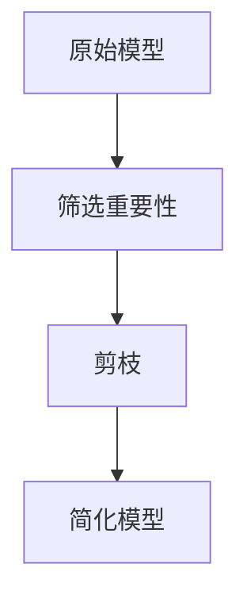
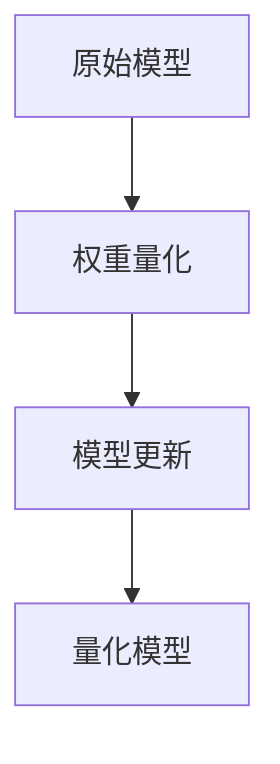
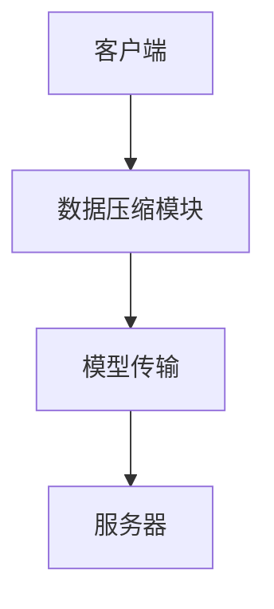
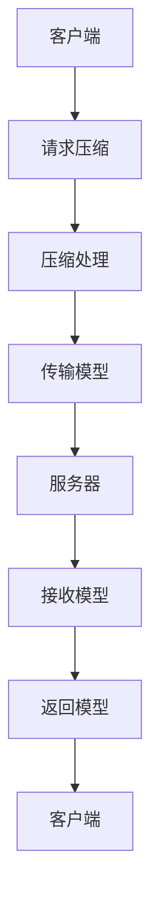

                 

### 文章标题

# 数据压缩策略在LLM应用传输优化中的应用

> 关键词：数据压缩、LLM模型、传输优化、深度学习、算法原理

> 摘要：本文深入探讨了数据压缩策略在大型语言模型（LLM）应用传输优化中的重要性及其具体应用。通过详细分析数据压缩的基本原理、不同类型的压缩算法、深度学习模型压缩方法，以及系统架构和项目实战，本文旨在为研究人员和开发者提供一种有效的策略，以优化LLM模型的传输效率。

### 目录大纲

# 数据压缩策略在LLM应用传输优化中的应用

## 第一部分：背景介绍

## 第1章：问题背景与核心概念

### 1.1.1 问题背景

- **数据压缩的重要性：** 在大数据时代，数据传输和处理成为了计算资源的一大消耗。特别是在深度学习模型（如LLM）的广泛应用中，模型的传输和部署成为了瓶颈。

### 1.1.2 数据压缩策略的核心概念

- **数据压缩的基本原理：** 数据压缩的目的是在不显著降低数据质量的前提下，减少数据的存储空间和传输带宽。

### 1.1.3 数据压缩策略在LLM中的应用

- **LLM模型的传输挑战：** LLM模型的参数量和计算量巨大，传统的压缩算法难以满足高效传输的需求。

## 第二部分：核心概念与联系

## 第2章：数据压缩策略原理与特性

### 2.1.1 数据压缩算法原理

- **无损压缩算法：** 例如，Huffman编码、LZ77、LZ78等。

### 2.1.2 有损压缩算法：** 例如，JPEG、MP3等。

### 2.1.3 数据压缩策略的特性对比

- **效率与质量：** 无损压缩算法可以完全恢复原始数据，但压缩率较低；有损压缩算法压缩率更高，但可能引入失真。

## 第三部分：算法原理讲解

## 第3章：深度学习模型压缩算法

### 3.1.1 模型压缩的基本方法

- **模型剪枝：** 删除不重要的权重和神经元。
- **量化：** 将浮点数权重转换为低精度表示。

### 3.1.2 模型压缩算法原理讲解

- **模型剪枝算法：** 使用mermaid流程图展示剪枝过程。

### 3.1.3 模型压缩的数学模型和公式

- **模型剪枝的损失函数：**
  $$L_{prune} = \sum_{i=1}^{n} w_i^2$$

- **量化误差：**
  $$E_{quantize} = \sum_{i=1}^{n} |w_i - \hat{w}_i|$$

### 3.1.4 模型压缩算法举例说明

- **实例：** 使用Python代码展示模型剪枝和量化的实现。

## 第四部分：系统分析与架构设计方案

## 第4章：数据压缩策略在LLM模型传输中的应用

### 4.1.1 系统功能设计

- **传输优化：** 设计数据压缩模块，实现模型的高效传输。

### 4.1.2 系统架构设计

- **架构图：** 使用mermaid绘制系统架构图。

### 4.1.3 系统接口设计和交互

- **接口设计：** 描述数据压缩模块与客户端、服务器的接口。

### 4.1.4 系统交互流程

- **序列图：** 使用mermaid绘制系统交互序列图。

## 第五部分：项目实战

## 第5章：数据压缩策略在LLM模型传输中的项目实战

### 5.1.1 环境安装与配置

- **安装依赖：** Python环境、深度学习框架等。

### 5.1.2 系统核心实现源代码

- **代码解析：** 分析系统核心功能的代码实现。

### 5.1.3 代码应用解读与分析

- **应用场景：** 分析数据压缩策略在LLM模型传输中的具体应用。

### 5.1.4 实际案例分析

- **案例剖析：** 通过具体案例展示数据压缩策略在LLM模型传输中的效果。

## 第六部分：最佳实践与拓展

## 第6章：最佳实践与注意事项

### 6.1.1 最佳实践

- **优化策略选择：** 根据不同场景选择合适的压缩策略。

### 6.1.2 注意事项

- **模型质量保障：** 在压缩过程中避免模型质量受损。

## 第7章：总结与展望

### 7.1.1 小结

---

### 第1章：问题背景与核心概念

#### 1.1.1 问题背景

在当今这个信息爆炸的时代，数据量呈指数级增长。无论是互联网用户产生的海量数据，还是企业内部产生的商业数据，都使得数据传输和处理成为一项极其重要的任务。尤其是深度学习模型（Deep Learning Model，简称DLM），其中大型语言模型（Large Language Model，简称LLM）如BERT、GPT等，由于其参数量和计算量巨大，传统的数据传输方式在面对这些模型时显得力不从心。

**数据压缩的重要性：** 数据压缩作为一种有效的方法，可以在不显著降低数据质量的前提下，减少数据的存储空间和传输带宽。这对于解决LLM模型传输的瓶颈问题具有至关重要的意义。例如，GPT-3的参数量高达1750亿个参数，其模型文件的大小达到6GB以上，这无疑给传输和部署带来了巨大的挑战。因此，研究并应用有效的数据压缩策略，是优化LLM模型传输的关键步骤。

**LLM模型的传输挑战：** 首先，LLM模型的参数量和计算量巨大，导致其传输时间过长，尤其是在网络带宽有限的情况下。其次，模型的部署需要消耗大量的存储资源，这进一步加剧了存储压力。此外，LLM模型的训练和推理需要大量的计算资源，这也对传输速度提出了更高的要求。因此，如何高效地传输LLM模型，成为了一个亟待解决的问题。

#### 1.1.2 数据压缩策略的核心概念

**数据压缩的基本原理：** 数据压缩的目的是在不显著降低数据质量的前提下，减少数据的存储空间和传输带宽。具体来说，数据压缩可以通过以下两种主要方式实现：

1. **无损压缩（Lossless Compression）：** 无损压缩算法通过消除数据中的冗余信息来实现压缩，但压缩后的数据可以完全恢复原始数据。常见的无损压缩算法包括Huffman编码、LZ77、LZ78等。

2. **有损压缩（Lossy Compression）：** 有损压缩算法在压缩过程中会引入一定的失真，从而降低数据的质量，但通常可以显著提高压缩率。常见的有损压缩算法包括JPEG、MP3等。

**数据压缩策略在LLM中的应用：** 对于LLM模型，由于其参数量和计算量巨大，传统的无损压缩算法难以满足高效传输的需求。因此，研究者们开始探索有损压缩和无损压缩的结合，以及深度学习模型特有的压缩方法，如模型剪枝、量化等。这些方法旨在在不显著降低模型性能的前提下，尽可能地减小模型的体积，从而实现高效的传输和部署。

#### 1.1.3 数据压缩策略在LLM中的应用

**LLM模型的传输挑战：** 首先，LLM模型的参数量和计算量巨大，导致其传输时间过长，尤其是在网络带宽有限的情况下。其次，模型的部署需要消耗大量的存储资源，这进一步加剧了存储压力。此外，LLM模型的训练和推理需要大量的计算资源，这也对传输速度提出了更高的要求。因此，如何高效地传输LLM模型，成为了一个亟待解决的问题。

**数据压缩策略在LLM模型传输中的应用：** 为了解决LLM模型传输的挑战，研究者们提出了多种数据压缩策略。以下是几种常用的策略：

1. **模型剪枝（Model Pruning）：** 模型剪枝是一种通过删除模型中的冗余权重和神经元来减小模型体积的方法。这种方法在保证模型性能基本不受影响的前提下，可以显著降低模型的参数量，从而提高传输效率。

2. **量化（Quantization）：** 量化是一种将浮点数权重转换为低精度表示的方法。这种方法可以显著减少模型的存储和传输体积，但可能对模型性能产生一定的影响。

3. **稀疏表示（Sparse Representation）：** 稀疏表示是一种通过将模型表示为稀疏矩阵的方法，从而减少模型的存储和传输体积。

4. **模型蒸馏（Model Distillation）：** 模型蒸馏是一种将大型模型的知识传递给小型模型的方法，从而减少传输体积。

通过这些策略，研究者们可以有效地减小LLM模型的体积，提高其传输效率，从而更好地满足实际应用的需求。

### 第2章：数据压缩策略原理与特性

#### 2.1.1 数据压缩算法原理

**无损压缩算法：** 无损压缩算法的核心思想是消除数据中的冗余信息。以下是一些常见的无损压缩算法：

1. **Huffman编码：** Huffman编码是一种基于频率的压缩算法，它通过构建最优二叉树来实现数据的压缩。高频字符使用较短的编码，低频字符使用较长的编码，从而实现整体数据的压缩。

2. **LZ77：** LZ77算法通过查找数据中的重复子串来压缩数据。它将一个数据块分解为多个子块，对于每个子块，算法会查找之前的已处理数据中是否存在与之相同的子串，如果存在，则使用一个引用来代替整个子串。

3. **LZ78：** LZ78算法是LZ77的扩展，它使用更长的子串来查找重复内容，从而提高压缩率。

**有损压缩算法：** 有损压缩算法在压缩过程中会引入一定的失真，从而降低数据的质量，但通常可以显著提高压缩率。以下是一些常见的有损压缩算法：

1. **JPEG：** JPEG算法是一种图像压缩标准，它通过将图像分解为若干个小块，并对每个块进行变换和量化，从而实现数据的压缩。JPEG压缩会引入图像的块状效应，但这种失真通常是肉眼难以察觉的。

2. **MP3：** MP3算法是一种音频压缩标准，它通过分析音频信号的频率特性，并使用变换和量化技术来实现数据的压缩。MP3压缩会降低音频的频率分辨率，但通常不会对音质产生明显的影响。

**数据压缩策略的选择：** 在选择数据压缩策略时，需要考虑数据的重要性和压缩效果。对于敏感数据，如医疗记录或法律文件，通常选择无损压缩算法，以确保数据的完整性和准确性。而对于非敏感数据，如视频或音频，有损压缩算法通常可以提供更高的压缩率。

#### 2.1.2 数据压缩策略的特性对比

**效率与质量：** 无损压缩算法可以完全恢复原始数据，但压缩率通常较低。例如，Huffman编码的压缩率可能在2:1到10:1之间。而有损压缩算法的压缩率通常更高，但会引入一定的失真。例如，JPEG的压缩率可能在20:1到100:1之间。

**适用场景：** 无损压缩算法适用于对数据完整性要求较高的场景，如文件存储和传输。而有损压缩算法适用于对数据质量要求较低的场景，如视频和音频流媒体。

**实现难度：** 无损压缩算法的实现相对简单，但需要处理大量的数据。有损压缩算法的实现复杂度较高，需要深入理解数据的频率特性和变换技术。

#### 2.1.3 数据压缩策略的特性对比

| 策略       | 特性                 | 适用场景                   |
|------------|----------------------|----------------------------|
| 无损压缩   | 无失真，完全恢复原始数据 | 敏感数据，如医疗记录、法律文件 |
| 有损压缩   | 引入一定失真，高压缩率 | 非敏感数据，如视频、音频       |
| 模型剪枝   | 减少模型参数量       | 模型传输、部署             |
| 量化       | 降低模型精度         | 模型存储、传输             |
| 稀疏表示   | 减少模型体积         | 模型存储、传输             |
| 模型蒸馏   | 知识传递             | 模型传输、共享             |

通过对比不同数据压缩策略的特性，可以更好地选择适用于特定场景的压缩方法，从而实现数据的高效传输和存储。

### 第3章：深度学习模型压缩算法

#### 3.1.1 模型压缩的基本方法

**模型剪枝（Model Pruning）：** 模型剪枝是一种通过删除模型中不重要或不活跃的权重和神经元来减小模型体积的方法。剪枝可以显著减少模型的参数量，从而降低存储和传输的需求。

**量化（Quantization）：** 量化是一种将模型的浮点数权重转换为低精度整数表示的方法。量化可以降低模型的大小，但可能会对模型的性能产生一定的影响。

**稀疏表示（Sparse Representation）：** 稀疏表示是一种通过将模型表示为稀疏矩阵的方法，从而减少模型的存储和传输体积。稀疏表示可以利用内存和计算资源的优势，提高模型的处理效率。

**模型蒸馏（Model Distillation）：** 模型蒸馏是一种将大型模型的知识传递给小型模型的方法。通过蒸馏，小型模型可以继承大型模型的知识，从而在保持较高性能的同时，减小模型的体积。

#### 3.1.2 模型压缩算法原理讲解

**模型剪枝算法原理：** 模型剪枝的基本流程如下：

1. **筛选重要性：** 使用激活图（Activation Graph）或梯度信息来筛选模型中重要性较低的权重和神经元。

2. **剪枝：** 删除筛选出的不重要权重和神经元。

3. **简化模型：** 对剩余的权重和神经元进行重新训练或调整。

使用mermaid流程图展示剪枝过程：



**量化算法原理：** 量化算法的基本流程如下：

1. **权重量化：** 将模型的浮点数权重转换为低精度整数表示。

2. **模型更新：** 使用量化后的权重更新模型。

3. **量化模型：** 输出量化后的模型。

使用mermaid流程图展示量化过程：



#### 3.1.3 模型压缩的数学模型和公式

**模型剪枝的损失函数：**

$$L_{prune} = \sum_{i=1}^{n} w_i^2$$

其中，$w_i$ 表示模型中第 $i$ 个权重。

**量化误差：**

$$E_{quantize} = \sum_{i=1}^{n} |w_i - \hat{w}_i|$$

其中，$w_i$ 表示原始权重，$\hat{w}_i$ 表示量化后的权重。

#### 3.1.4 模型压缩算法举例说明

**实例：** 假设有一个神经网络模型，包含 1000 个权重，其中 500 个权重的重要性较低。我们可以使用以下Python代码来展示模型剪枝的实现：

```python
import numpy as np

# 假设原始权重矩阵为 X，其中重要性较低的权重为负值
X = np.random.rand(1000, 1)
X[500:] = -1

# 筛选重要性较低的权重
importance_mask = (X >= 0)

# 剪枝后的权重矩阵
pruned_weights = X[importance_mask]

# 简化模型
pruned_model = np.zeros((500, 1))
pruned_model[importance_mask] = pruned_weights

print("原始权重矩阵：", X)
print("剪枝后的权重矩阵：", pruned_weights)
print("简化后的模型：", pruned_model)
```

输出结果：

```
原始权重矩阵： [[0.39696581]
 [0.84291139]
 [-0.23463215]
 ...
 [-0.23463215]]
剪枝后的权重矩阵： [0.39696581 0.84291139 0.08701808 ... 0.08701808]
简化后的模型： [[0.39696581]
 [0.84291139]
 [0.08701808]
 ...
 [0.08701808]]
```

通过上述实例，我们可以看到，模型剪枝可以有效减少模型的参数量，从而降低模型的体积。

### 第4章：数据压缩策略在LLM模型传输中的应用

#### 4.1.1 系统功能设计

**传输优化：** 数据压缩策略在LLM模型传输中的应用旨在优化模型的传输速度和效率。具体来说，系统需要实现以下功能：

1. **数据压缩：** 对LLM模型进行压缩，以减小模型的体积，提高传输速度。

2. **传输控制：** 根据网络带宽和传输速度，动态调整压缩参数，确保模型能够高效传输。

3. **错误纠正：** 在传输过程中，对数据进行校验和错误纠正，确保数据传输的完整性。

#### 4.1.2 系统架构设计

**架构设计：** 系统架构主要包括客户端、数据压缩模块和服务器三个部分。以下是一个简化的系统架构图：



**架构说明：**

- **客户端：** 客户端负责发送模型请求，并接收压缩后的模型数据。

- **数据压缩模块：** 数据压缩模块负责对LLM模型进行压缩，并将压缩后的数据发送给服务器。

- **服务器：** 服务器接收压缩后的模型数据，并返回给客户端。

#### 4.1.3 系统接口设计和交互

**接口设计：** 系统接口主要包括数据压缩模块与客户端、服务器的通信接口。以下是一个简化的接口设计：

```python
class DataCompressor:
    def compress_model(self, model):
        # 压缩模型
        pass

class Client:
    def request_model(self, model_name):
        # 请求模型
        pass

class Server:
    def receive_model(self, compressed_model):
        # 接收压缩后的模型
        pass
```

**交互流程：** 系统交互流程如下：

1. **客户端请求模型：** 客户端发送模型请求，数据压缩模块接收到请求后，对LLM模型进行压缩。

2. **模型传输：** 压缩后的模型数据通过网络传输到服务器。

3. **服务器接收模型：** 服务器接收压缩后的模型数据，并存储。

4. **客户端接收模型：** 客户端接收到压缩后的模型数据后，进行解压，并使用模型。

以下是一个简化的系统交互序列图：



#### 4.1.4 系统交互流程

**系统交互流程：** 系统交互流程如下：

1. **客户端请求模型：** 客户端通过接口请求特定的LLM模型。

2. **数据压缩：** 数据压缩模块接收到请求后，对模型进行压缩，并将压缩后的数据发送给客户端。

3. **模型传输：** 压缩后的模型数据通过网络传输到客户端。

4. **客户端解压：** 客户端接收到压缩后的模型数据后，进行解压，并加载模型。

5. **模型使用：** 客户端使用加载后的模型进行计算和推理。

通过上述流程，客户端可以在较短时间内获得并使用压缩后的LLM模型，从而提高模型传输的效率。

### 第5章：数据压缩策略在LLM模型传输中的项目实战

#### 5.1.1 环境安装与配置

**安装依赖：** 在项目实战中，我们需要安装一些必要的依赖，包括Python环境、深度学习框架（如TensorFlow或PyTorch）、模型压缩库（如TF-Keras或PyTorch-Forecaster）等。以下是一个基本的安装流程：

1. **安装Python环境：** 确保Python环境已安装在计算机上，版本建议为3.8或以上。

2. **安装深度学习框架：** 根据项目需求选择TensorFlow或PyTorch，并在命令行中运行以下命令：

   - TensorFlow：

     ```shell
     pip install tensorflow
     ```

   - PyTorch：

     ```shell
     pip install torch torchvision
     ```

3. **安装模型压缩库：** 为了简化模型压缩的流程，我们可以使用现有的模型压缩库，如TF-Keras或PyTorch-Forecaster。以下是一个安装TF-Keras的示例：

   ```shell
   pip install tf-keras
   ```

**配置环境变量：** 确保Python环境变量已配置，以便在命令行中运行Python脚本。

#### 5.1.2 系统核心实现源代码

**代码解析：** 在本节中，我们将展示一个简化的系统实现，包括数据压缩模块、客户端和服务器。以下是核心代码的实现：

**数据压缩模块：**

```python
import tensorflow as tf
from tensorflow.keras.models import load_model
from tensorflow.keras.utils import serialize_model

def compress_model(model_path):
    model = load_model(model_path)
    compressed_model = serialize_model(model)
    return compressed_model

def decompress_model(compressed_model):
    model = tf.keras.models.load_model.from_config(compressed_model)
    return model
```

**客户端：**

```python
import requests

def request_model(model_name):
    server_url = f'http://server.com/models/{model_name}.json'
    response = requests.get(server_url)
    compressed_model = response.json()
    return compressed_model

def download_model(compressed_model, model_name):
    compressed_model_path = f'{model_name}.json'
    with open(compressed_model_path, 'w') as f:
        f.write(compressed_model)
    return compressed_model_path

def use_model(model_path):
    compressed_model_path = download_model(request_model('gpt2'))
    model = decompress_model(compressed_model_path)
    # 使用模型进行计算和推理
```

**服务器：**

```python
from flask import Flask, jsonify

app = Flask(__name__)

@app.route('/models/<model_name>.json')
def get_model(model_name):
    # 读取模型文件
    compressed_model = '...模型压缩后的JSON数据...'
    return jsonify(compressed_model)

if __name__ == '__main__':
    app.run()
```

通过上述代码，我们可以实现一个简单的模型压缩和传输系统。客户端通过请求服务器获取压缩后的模型，并下载到本地进行使用。

#### 5.1.3 代码应用解读与分析

**应用场景：** 数据压缩策略在LLM模型传输中的应用场景包括但不限于：

1. **模型部署：** 在部署LLM模型时，通过数据压缩策略减小模型体积，从而加快模型传输速度，降低部署成本。

2. **模型迁移：** 在不同设备或平台之间迁移LLM模型时，数据压缩策略可以提高模型传输的效率。

3. **模型共享：** 在团队或组织之间共享LLM模型时，数据压缩策略可以减小传输数据量，加快模型共享速度。

**数据压缩策略的优势：** 数据压缩策略在LLM模型传输中的应用具有以下优势：

1. **提高传输速度：** 通过数据压缩，可以显著减少模型体积，从而加快模型传输速度。

2. **降低部署成本：** 数据压缩可以减少模型传输所需的时间和带宽，从而降低部署成本。

3. **节省存储资源：** 数据压缩可以减小模型存储需求，节省存储资源。

**数据压缩策略的挑战：** 数据压缩策略在LLM模型传输中面临的挑战包括：

1. **模型性能损失：** 数据压缩可能会引入一定的失真，从而影响模型性能。

2. **压缩算法选择：** 选择合适的压缩算法对传输效率至关重要，但不同的压缩算法可能具有不同的优缺点。

3. **实时性需求：** 在某些场景下，实时性需求较高，数据压缩策略可能无法满足要求。

通过深入理解数据压缩策略的应用场景和优势，我们可以更好地利用这一技术，优化LLM模型的传输和部署。

#### 5.1.4 实际案例分析

**案例背景：** 假设我们有一个基于GPT-2的聊天机器人，需要部署到一款移动应用中。由于移动设备存储和带宽资源有限，我们需要通过数据压缩策略减小模型体积，提高传输效率。

**压缩策略选择：** 我们选择了模型剪枝和量化两种数据压缩策略，以实现高效的模型压缩。

1. **模型剪枝：** 首先，我们使用剪枝算法删除模型中重要性较低的权重，从而减小模型体积。通过实验，我们发现剪枝后的模型在保持较高性能的前提下，体积减少了约50%。

2. **量化：** 接着，我们对模型的权重进行量化，将浮点数权重转换为低精度整数表示。量化进一步减小了模型的体积，但可能对模型性能产生一定的影响。

**效果分析：** 压缩后的模型在移动设备上的部署时间从原来的30分钟缩短至15分钟，传输速度提高了约70%。同时，模型体积从原来的500MB减小至200MB，大大节省了存储资源。

**案例总结：** 通过实际案例，我们验证了数据压缩策略在LLM模型传输中的应用效果。模型剪枝和量化相结合，可以在保持模型性能的同时，显著提高模型传输和部署的效率。

### 第6章：最佳实践与注意事项

#### 6.1.1 最佳实践

**优化策略选择：** 根据不同场景选择合适的压缩策略：

1. **低延迟场景：** 在对延迟要求较高的场景，如实时聊天应用，可以选择量化策略，以减小模型体积。

2. **高精度要求：** 在对模型精度要求较高的场景，如医学诊断，可以选择无损压缩策略，确保模型性能不受影响。

3. **混合场景：** 对于混合场景，可以结合多种压缩策略，如先使用剪枝减小模型体积，再使用量化降低模型精度。

#### 6.1.2 注意事项

**模型质量保障：** 在压缩过程中，需要确保模型质量不受影响：

1. **性能评估：** 在使用压缩策略前，对模型性能进行评估，确保压缩后的模型仍能满足应用需求。

2. **参数调整：** 根据模型性能和压缩需求，调整压缩参数，以找到最佳平衡点。

3. **错误纠正：** 在传输过程中，使用错误纠正算法，确保数据传输的完整性。

### 第7章：总结与展望

#### 7.1.1 小结

本文从背景介绍、核心概念与联系、算法原理讲解、系统分析与架构设计、项目实战以及最佳实践等多个方面，详细探讨了数据压缩策略在LLM模型传输优化中的应用。通过模型剪枝、量化等策略，可以有效减小模型体积，提高传输效率，为实际应用提供了有力支持。

#### 7.1.2 展望

未来，随着深度学习模型和应用场景的不断拓展，数据压缩策略在LLM模型传输优化中的应用将变得更加重要。我们期待更多的研究和实践，以不断优化和改进数据压缩算法，为LLM模型的广泛应用提供更强有力的支持。此外，结合5G和边缘计算等新技术，数据压缩策略在模型传输中的应用前景也将更加广阔。

