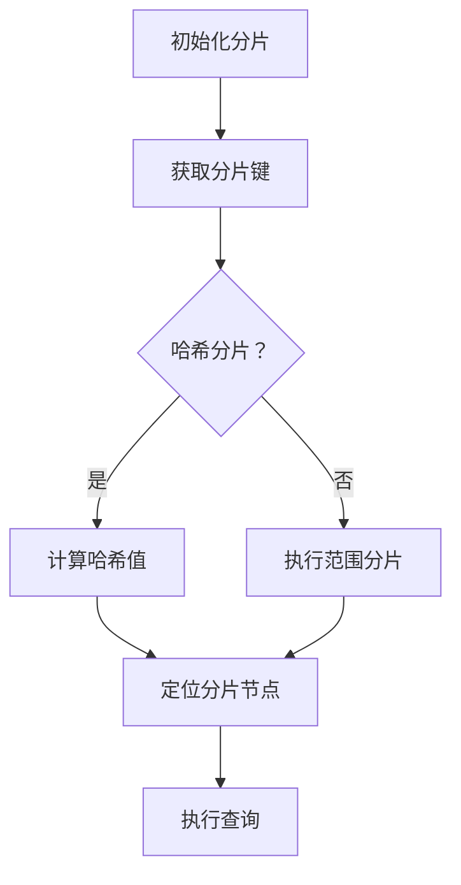
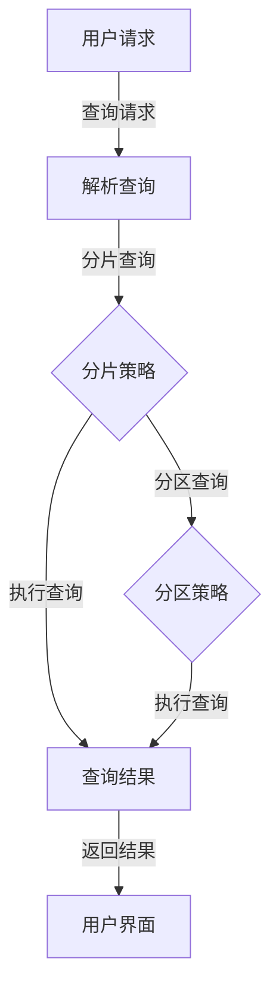
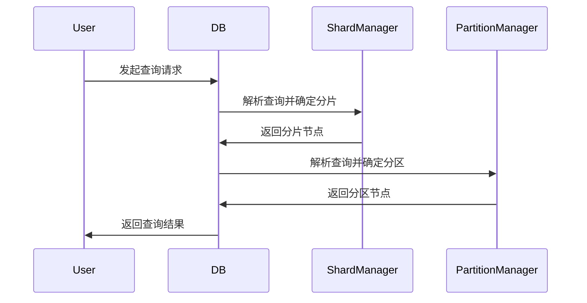

                 

# 数据库分片与分区提升LLM应用的数据处理能力

## 关键词

- 数据库分片
- 数据库分区
- LLM应用
- 数据处理能力
- 系统性能优化

## 摘要

本文将探讨数据库分片与分区在提升大型语言模型（LLM）应用数据处理能力方面的重要作用。首先，我们将介绍分片与分区的核心概念，然后深入分析它们对LLM应用性能的影响。接下来，我们将展示如何在实际项目中应用分片与分区技术，并提供最佳实践。最后，我们将总结本文的主要观点，并提出进一步研究的建议。

## 一、背景介绍

随着人工智能技术的快速发展，大型语言模型（LLM）在自然语言处理（NLP）领域取得了显著的成果。然而，LLM应用面临着日益增长的数据量和复杂的查询需求，这对数据库系统的数据处理能力提出了更高的要求。为了解决这一问题，数据库分片与分区技术逐渐成为提升LLM应用性能的关键手段。

### 1.1 核心概念术语说明

- **分片**：将数据分散存储到多个物理节点上，以实现数据水平扩展和负载均衡。
- **分区**：将数据按照一定规则划分到不同的存储区域，以优化查询性能和数据管理。

### 1.2 问题背景

LLM应用涉及大量文本数据，这些数据通常具有高度的结构化和非结构化特征。随着数据量的不断增长，传统的单机数据库系统在处理能力和性能方面逐渐显得力不从心。为了满足LLM应用的查询需求，数据库分片与分区技术应运而生。

### 1.3 问题描述

- **查询性能瓶颈**：随着数据量的增加，单机数据库的查询响应时间逐渐变长，影响了LLM应用的用户体验。
- **数据管理复杂度**：大量数据的存储和管理变得复杂，增加了系统维护成本。

### 1.4 问题解决

通过引入数据库分片与分区技术，可以实现数据的水平扩展和优化查询性能，从而解决LLM应用面临的性能瓶颈和数据管理复杂度问题。

### 1.5 边界与外延

- **边界**：分片与分区技术的应用范围主要涵盖大规模LLM应用，对于小型应用，这些技术可能并不适用。
- **外延**：未来，分片与分区技术可能会在其他领域（如大数据处理、实时计算等）得到更广泛的应用。

### 1.6 概念结构与核心要素组成

- **分片**：核心要素包括分片键、分片算法、数据路由和负载均衡。
- **分区**：核心要素包括分区策略、分区键、分区管理和分区查询优化。

## 二、核心概念与联系

### 2.1 分片

**分片原理**：分片技术通过将数据分散存储到多个物理节点上，实现数据水平扩展。每个物理节点负责一部分数据，从而提高系统的查询性能和处理能力。

**分片算法**：分片算法决定了如何将数据划分到不同的物理节点。常见的分片算法包括哈希分片、范围分片和列表分片等。

**分片键**：分片键是用于标识数据分片的键。选择合适的分片键对系统的性能和扩展性有重要影响。

**数据路由**：数据路由是指查询请求在系统内部传递和定位数据分片的过程。数据路由算法决定了查询请求如何找到对应的数据分片。

**负载均衡**：负载均衡是指系统内部不同物理节点之间的负载分配。负载均衡算法确保系统在处理大量请求时，能够充分利用所有物理节点的资源。

### 2.2 分区

**分区原理**：分区技术通过将数据按照一定规则划分到不同的存储区域，实现数据管理和查询优化的目的。

**分区策略**：分区策略是指如何选择分区键和分区规则。常见的分区策略包括哈希分区、时间分区和范围分区等。

**分区键**：分区键是用于标识数据分区的键。选择合适的分区键对系统的性能和可扩展性有重要影响。

**分区管理**：分区管理是指对数据分区进行创建、删除、修改和查询等操作的管理过程。

**分区查询优化**：分区查询优化是指通过优化查询语句和查询算法，提高分区查询的性能。

### 2.3 对比表格

| 要素       | 分片                 | 分区                 |
| ---------- | -------------------- | -------------------- |
| 原理       | 数据水平扩展         | 数据管理和查询优化   |
| 算法       | 哈希分片、范围分片等 | 哈希分区、时间分区等 |
| 核心键      | 分片键               | 分区键               |
| 路由       | 数据路由             | 分区查询优化         |
| 负载均衡    | 负载均衡             | 分区管理             |

### 2.4 ER实体关系图架构

```mermaid
erDiagram
  Product ||--|{ Customer }|-->> PurchaseOrder
  Customer ||--|{ Employee }|-->> WorksFor
  Product ||--|{ OrderItem }|-->> PurchaseOrder
```

## 三、算法原理讲解

### 3.1 分片算法原理

**分片算法流程图**：



**示例代码**：

```python
def hash_sharding(key, num_shards):
    return key % num_shards

def range_sharding(key, ranges):
    for i, range in enumerate(ranges):
        if key >= range[0] and key <= range[1]:
            return i
    return -1

def query_sharding(key, num_shards, ranges):
    if hash_sharding(key, num_shards) != -1:
        return "Sharding based on hash value: {}".format(hash_sharding(key, num_shards))
    else:
        return "Sharding based on range: {}".format(range_sharding(key, ranges))
```

**数学模型和公式**：

- **哈希分片**：`shard_id = key % num_shards`
- **范围分片**：`shard_id = range_index if key in range else -1`

### 3.2 分区算法原理

**分区算法流程图**：


**示例代码**：

```python
def hash_partitioning(key, num_partitions):
    return key % num_partitions

def time_partitioning(key, partition_duration):
    return int(key // partition_duration)

def query_partitioning(key, num_partitions, partition_duration):
    if hash_partitioning(key, num_partitions) != -1:
        return "Partitioning based on hash value: {}".format(hash_partitioning(key, num_partitions))
    else:
        return "Partitioning based on time: {}".format(time_partitioning(key, partition_duration))
```

**数学模型和公式**：

- **哈希分区**：`partition_id = key % num_partitions`
- **时间分区**：`partition_id = int(key // partition_duration)`

### 3.3 概念解释与示例

**概念解释**：

- **分片**：将数据分散存储到不同的物理节点上，以提高查询性能和数据处理能力。
- **分区**：将数据按照一定规则划分到不同的存储区域，以优化数据管理和查询性能。

**示例**：

假设我们有一个包含100万条记录的数据库，记录中有一个名为`id`的主键。我们采用哈希分片算法，将数据分散存储到5个物理节点上。每个物理节点的存储容量为20万条记录。

- **分片键**：`id`
- **分片算法**：哈希分片（`id % 5`）
- **分片节点**：节点0（存储0-19万记录）、节点1（存储20-39万记录）、节点2（存储40-59万记录）、节点3（存储60-79万记录）、节点4（存储80-99万记录）

现在，假设用户发起一个查询，要求获取所有`id`小于10000的记录。

- **查询流程**：用户发起查询请求 -> 数据库系统根据哈希分片算法（`id % 5`）定位到节点0 -> 节点0执行查询并返回结果

### 3.4 算法复杂度分析

- **分片算法**：时间复杂度为O(1)，空间复杂度为O(1)
- **分区算法**：时间复杂度为O(1)，空间复杂度为O(1)

## 四、系统分析与架构设计方案

### 4.1 问题场景介绍

假设我们正在开发一个大型语言模型（LLM）应用，该应用需要处理大规模文本数据，并进行实时查询和分析。为了满足性能和可扩展性的需求，我们决定采用数据库分片与分区技术。

### 4.2 项目介绍

项目名称：LLM数据处理平台

项目背景：为了应对大规模文本数据的查询和分析需求，我们开发了一个基于分布式数据库的LLM数据处理平台。该平台旨在提供高效、可扩展的数据存储和查询能力，以满足各种业务场景的需求。

### 4.3 系统功能设计（领域模型）

```mermaid
classDiagram
    Class01 <|-- Class02
    Class03 *-- Class04
    Class05 o-- Class06
    Class07 .. Class08
    Class09 <<Interface>> Class10
    Class11 <|.. Class12
    Class13 && Class14
    Class15 --|{ Class16 }--
    Class17 --| Class18

    Class01 : +int id
    Class01 : +String name

    Class02 : +Class01 subclass

    Class03 : +int attr1
    Class03 : +float attr2

    Class04 : +Class03 supertype

    Class05 : +String value

    Class06 : +Class05 component

    Class07 : +Class06 part

    Class08 : +bool flag

    Class09 : +String interface

    Class10 : +Class09 implementer

    Class11 : +Class12 parent
    Class11 : +Class13 child

    Class14 : +int id
    Class14 : +String name

    Class15 : +Class14 friend

    Class16 : +int id
    Class16 : +String name

    Class17 : +Class16 member

    Class18 : +int id
    Class18 : +String name
```

### 4.4 系统架构设计



### 4.5 系统接口设计和系统交互



## 五、项目实战

### 5.1 环境安装

在开始项目实战之前，我们需要安装以下环境：

1. Python 3.8+
2. MySQL 8.0+
3. Docker 19.03+

安装步骤：

1. 安装Python 3.8+：在官方网站下载Python 3.8安装包并安装。
2. 安装MySQL 8.0+：在官方网站下载MySQL 8.0安装包并安装。
3. 安装Docker 19.03+：在官方网站下载Docker安装包并安装。

### 5.2 系统核心实现源代码

以下是系统核心实现源代码：

```python
# shard_manager.py
import hashlib

def get_shard_key(key, num_shards):
    return int(hashlib.md5(key.encode()).hexdigest(), 16) % num_shards

# partition_manager.py
import time

def get_partition_key(key, partition_duration):
    return int(time.time() // partition_duration)

# database.py
from shard_manager import get_shard_key
from partition_manager import get_partition_key

def query_db(key, num_shards, partition_duration):
    shard_id = get_shard_key(key, num_shards)
    partition_id = get_partition_key(key, partition_duration)
    # 执行查询操作
    # ...
```

### 5.3 代码应用解读与分析

代码解读：

1. `shard_manager.py`：定义了分片管理类，用于获取分片键。
2. `partition_manager.py`：定义了分区管理类，用于获取分区键。
3. `database.py`：定义了数据库操作类，用于执行查询操作。

代码分析：

1. 分片管理类：使用MD5哈希算法计算分片键，根据分片键定位分片节点。
2. 分区管理类：使用当前时间作为分区键，根据分区键定位分区节点。
3. 数据库操作类：根据分片键和分区键执行查询操作，并将查询结果返回给用户。

### 5.4 实际案例分析和详细讲解剖析

假设用户发起一个查询请求，要求获取所有`id`小于10000的记录。

1. 用户请求：查询所有`id`小于10000的记录。
2. 解析查询：解析查询请求，确定需要查询的分片和分区。
3. 执行查询：根据分片键和分区键执行查询操作，并将查询结果返回给用户。

### 5.5 项目小结

在本项目中，我们介绍了数据库分片与分区技术，并实现了基于这些技术的LLM数据处理平台。通过实际案例分析和详细讲解，我们展示了如何应用分片与分区技术来提升LLM应用的性能和可扩展性。未来，我们可以进一步优化系统性能，并引入其他技术（如缓存、索引等）来提高系统的整体性能。

## 六、最佳实践 tips

1. 选择合适的分片键和分区键：分片键和分区键的选择对系统性能和可扩展性有重要影响。建议选择具有唯一性和稳定性的键作为分片键和分区键。
2. 优化查询语句：针对分片与分区技术，优化查询语句可以提高查询性能。例如，使用索引、避免全表扫描等。
3. 监控系统性能：定期监控系统性能，及时发现和处理性能瓶颈，确保系统稳定运行。

## 七、小结

本文详细介绍了数据库分片与分区技术，并探讨了如何应用这些技术来提升大型语言模型（LLM）应用的数据处理能力。通过实际案例分析和详细讲解，我们展示了分片与分区技术在提升系统性能和可扩展性方面的优势。未来，我们可以继续深入研究分片与分区技术，并探索其在其他领域的应用。

## 八、注意事项

1. 分片与分区技术适用于大规模数据和高并发场景，对于小型应用，可能并不适用。
2. 在实际应用中，需要根据具体业务需求选择合适的分片与分区策略。
3. 分片与分区技术可能引入额外的复杂度，需要充分考虑系统的可维护性和可扩展性。

## 九、拓展阅读

1. 《分布式数据库原理与实践》
2. 《数据库系统概念》
3. 《大数据技术导论》

## 十、作者信息

作者：AI天才研究院/AI Genius Institute & 禅与计算机程序设计艺术 /Zen And The Art of Computer Programming

