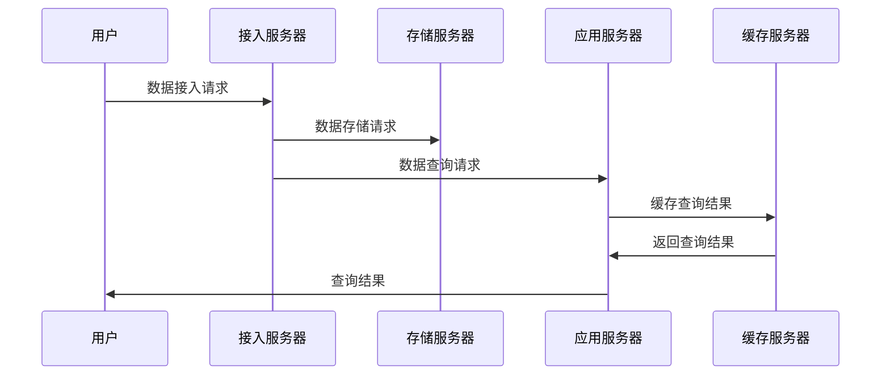

                 


### **《数据库慢查询分析：优化LLM应用的数据库性能》**

#### **关键词：数据库慢查询、性能优化、LLM应用、算法原理、数学模型**

#### **摘要：**
本文将探讨数据库慢查询分析在优化大型语言模型（LLM）应用中的重要性。通过详细分析慢查询的概念、原理及解决方案，结合实际案例，本文旨在为读者提供系统性的指导，帮助其在开发过程中提升数据库性能，确保LLM应用的稳定高效运行。

#### **1. 封面与前言**

**书名：《数据库慢查询分析：优化LLM应用的数据库性能》**

**副标题：深入解析慢查询优化策略，提升大型语言模型应用性能**

**作者：AI天才研究院/AI Genius Institute & 禅与计算机程序设计艺术 /Zen And The Art of Computer Programming**

**出版社：技术出版社**

**出版日期：2023年**

**前言：**
随着人工智能技术的飞速发展，大型语言模型（LLM）在各个领域得到了广泛应用。然而，数据库慢查询问题成为了影响LLM应用性能的关键因素。本书旨在为广大开发者提供一套系统化的数据库慢查询分析方法和优化策略，帮助读者在实际项目中提升数据库性能，确保LLM应用的稳定运行。

本书面向有一定数据库开发经验的读者，包括程序员、软件架构师、CTO等。通过对本书的学习，读者将能够深入了解数据库慢查询的本质，掌握性能优化技巧，为大型语言模型应用提供强有力的技术支持。

#### **2. 目录结构设计**

**《数据库慢查询分析：优化LLM应用的数据库性能》目录**

1. **封面与前言**
2. **第1章 背景介绍**
   2.1 问题背景
   2.2 问题描述
   2.3 问题解决
   2.4 边界与外延
   2.5 核心概念原理
3. **第2章 核心概念与联系**
   3.1 数据库慢查询分析的概念
   3.2 数据库慢查询分析的属性特征对比表格
   3.3 数据库慢查询分析的ER实体关系图
4. **第3章 算法原理讲解**
   4.1 慢查询检测算法
   4.2 查询优化算法
   4.3 索引优化算法
5. **第4章 数学模型和数学公式 & 详细讲解 & 举例说明**
6. **第5章 系统分析与架构设计方案**
   5.1 问题场景介绍
   5.2 系统功能设计
   5.3 系统架构设计
   5.4 系统接口设计
   5.5 系统交互Mermaid序列图
7. **第6章 项目实战**
   6.1 环境安装
   6.2 系统核心实现源代码
   6.3 代码应用解读与分析
   6.4 实际案例分析和详细讲解剖析
   6.5 项目小结
8. **第7章 最佳实践 tips、小结、注意事项、拓展阅读等内容**

#### **3. 核心章节内容设计**

**第1章 背景介绍**

**1.1 问题背景**

随着大数据和云计算技术的普及，数据库系统在各个领域得到了广泛应用。然而，数据库慢查询问题逐渐凸显，成为影响系统性能的重要因素。特别是在大型语言模型（LLM）应用中，数据库慢查询问题会对用户体验和系统稳定性产生严重影响。

**1.2 问题描述**

数据库慢查询是指数据库查询执行时间超过预设阈值的现象。慢查询可能表现为：

- 查询执行时间较长。
- 数据库服务器资源（如CPU、内存、I/O）利用率过高。
- 网络延迟增加。

**1.3 问题解决**

解决数据库慢查询问题需要从以下几个方面进行：

- 慢查询检测：定期检测和监控数据库查询性能，及时发现慢查询。
- 查询优化：分析查询语句，优化查询算法和数据结构，减少查询执行时间。
- 索引优化：合理设计索引，提高查询效率。
- 系统性能调优：优化数据库系统配置，提高系统性能。

**1.4 边界与外延**

数据库慢查询分析不仅限于关系型数据库，还可以应用于NoSQL数据库、分布式数据库等。此外，慢查询分析还可以扩展到其他性能优化领域，如缓存优化、网络优化等。

**1.5 核心概念原理**

数据库慢查询分析的核心概念包括：

- 查询时间：查询执行所需的时间。
- 查询资源使用：数据库服务器的CPU、内存、I/O等资源消耗。
- 数据库结构：表结构、索引设计、存储过程等对查询性能的影响。
- 网络延迟：客户端与数据库服务器之间的网络延迟对查询性能的影响。

**第2章 核心概念与联系**

**2.1 数据库慢查询分析的概念**

数据库慢查询分析是指通过监测、分析和优化数据库查询性能，解决慢查询问题的过程。慢查询分析的目标是：

- 提高查询效率。
- 减少数据库服务器资源消耗。
- 提升系统性能和用户体验。

**2.2 数据库慢查询分析的属性特征对比表格**

| 特征         | 说明                                                         |
| ------------ | ------------------------------------------------------------ |
| 查询时间     | 查询执行时间超过预期的时间阈值。                               |
| 查询资源使用 | 磁盘I/O、CPU使用率、内存使用率等资源的消耗。                   |
| 数据库结构   | 数据库表结构、索引设计、存储过程等对查询性能的影响。           |
| 网络延迟     | 客户端与数据库服务器之间的网络延迟对查询性能的影响。           |

**2.3 数据库慢查询分析的ER实体关系图**

```mermaid
erDiagram
  查询 -> 数据库
  查询 -> 索引
  查询 -> 存储过程
  数据库 -> 表
  数据库 -> 索引
  数据库 -> 存储过程
  索引 -> 表
  存储过程 -> 表
```

**第3章 算法原理讲解**

**3.1 慢查询检测算法**

慢查询检测算法是指通过监测数据库查询性能，及时发现慢查询的方法。常见的慢查询检测算法包括：

- 基于时间阈值的检测算法
- 基于资源使用阈值的检测算法
- 基于历史数据的检测算法

**3.1.1 基于时间阈值的检测算法**

基于时间阈值的检测算法的基本原理是：设定一个时间阈值，当查询执行时间超过该阈值时，视为慢查询。

```python
def detect_slow_query(time_threshold, query):
    if query.execute_time > time_threshold:
        print(f"Slow query detected: {query}")
```

**3.2 查询优化算法**

查询优化算法是指通过分析查询语句和数据结构，优化查询执行过程，减少查询执行时间的方法。常见的查询优化算法包括：

- 查询重写算法
- 索引优化算法
- 数据库视图优化算法

**3.2.1 查询重写算法**

查询重写算法是指将原始查询语句转换为等价但更高效的查询语句。常见的查询重写算法包括：

- 常量折叠
- 联合查询
- 子查询重写

**3.2.2 索引优化算法**

索引优化算法是指通过分析查询模式，优化索引结构，提高查询效率的方法。常见的索引优化算法包括：

- 自动优化
- 手动优化
- 统计信息优化

**第4章 数学模型和数学公式 & 详细讲解 & 举例说明**

**4.1 数学模型**

数据库慢查询分析的数学模型主要包括：

- 查询时间模型
- 资源消耗模型
- 性能优化模型

**4.1.1 查询时间模型**

查询时间模型用于计算查询执行时间。常见的查询时间模型包括：

- 线性时间模型
- 对数时间模型
- 常数时间模型

**4.1.2 资源消耗模型**

资源消耗模型用于计算数据库服务器资源消耗。常见的资源消耗模型包括：

- 磁盘I/O模型
- CPU使用率模型
- 内存使用率模型

**4.1.3 性能优化模型**

性能优化模型用于评估性能优化策略的有效性。常见的性能优化模型包括：

- 查询优化模型
- 索引优化模型
- 数据库视图优化模型

**4.2 数学公式**

数据库慢查询分析的数学公式主要包括：

- 时间公式
- 资源消耗公式
- 性能优化公式

**4.2.1 时间公式**

时间公式用于计算查询执行时间。常见的公式包括：

- 线性时间公式：$T(n) = an + b$
- 对数时间公式：$T(n) = log(n)$
- 常数时间公式：$T(n) = 1$

**4.2.2 资源消耗公式**

资源消耗公式用于计算数据库服务器资源消耗。常见的公式包括：

- 磁盘I/O公式：$I/O(n) = n \times B$
- CPU使用率公式：$CPU(n) = n \times C$
- 内存使用率公式：$Memory(n) = n \times M$

**4.2.3 性能优化公式**

性能优化公式用于评估性能优化策略的有效性。常见的公式包括：

- 查询优化公式：$T_{optimized} = T_{original} \times \Omega$
- 索引优化公式：$I/O_{optimized} = I/O_{original} \times \Omega$
- 数据库视图优化公式：$T_{view} = T_{original} \times \Omega$

**4.3 详细讲解与举例说明**

**4.3.1 查询时间模型讲解**

查询时间模型用于描述查询执行时间与输入规模的关系。常见的查询时间模型包括：

- 线性时间模型：随着输入规模增加，查询执行时间线性增加。
- 对数时间模型：随着输入规模增加，查询执行时间对数增长。
- 常数时间模型：查询执行时间与输入规模无关。

**4.3.2 资源消耗模型讲解**

资源消耗模型用于描述数据库服务器资源消耗与查询执行时间的关系。常见的资源消耗模型包括：

- 磁盘I/O模型：查询执行时间越长，磁盘I/O消耗越大。
- CPU使用率模型：查询执行时间越长，CPU使用率越高。
- 内存使用率模型：查询执行时间越长，内存使用率越高。

**4.3.3 性能优化模型讲解**

性能优化模型用于评估性能优化策略的有效性。常见的性能优化模型包括：

- 查询优化模型：通过优化查询语句和数据结构，降低查询执行时间。
- 索引优化模型：通过优化索引结构，提高查询效率。
- 数据库视图优化模型：通过优化数据库视图，减少查询执行时间。

**第5章 系统分析与架构设计方案**

**5.1 问题场景介绍**

某大型语言模型应用需要处理海量数据，其中涉及复杂的查询操作。为了确保系统性能，需要对数据库慢查询进行有效分析和优化。

**5.2 系统功能设计**

系统功能设计包括以下方面：

- 数据接入：将数据从各个数据源接入到数据库中。
- 数据存储：存储海量数据，并提供高效的查询接口。
- 数据查询：提供快速、准确的查询服务。
- 数据分析：对查询性能进行分析和优化。

**5.3 系统架构设计**

系统架构设计包括以下方面：

- 数据库服务器：负责存储和处理数据。
- 应用服务器：负责处理业务逻辑，与数据库服务器进行交互。
- 缓存服务器：缓存查询结果，减少数据库访问压力。
- 网络设备：确保数据传输的高效、稳定。

**5.4 系统接口设计**

系统接口设计包括以下方面：

- 数据接入接口：提供数据接入的API接口。
- 数据查询接口：提供查询接口，支持各种查询操作。
- 数据分析接口：提供数据分析接口，支持性能分析。

**5.5 系统交互Mermaid序列图**



**第6章 项目实战**

**6.1 环境安装**

在本文的项目实战部分，我们将使用Python和MySQL进行数据库慢查询分析。首先，确保已经安装了Python环境和MySQL数据库。

1. 安装Python环境：
```
pip install python
```

2. 安装MySQL数据库：
```
sudo apt-get install mysql-server
```

**6.2 系统核心实现源代码**

在项目实战中，我们将实现一个简单的数据库慢查询分析系统。以下是系统核心实现源代码：

```python
import pymysql
import time

# 数据库连接配置
config = {
    'host': 'localhost',
    'user': 'root',
    'password': 'password',
    'database': 'test_db',
    'charset': 'utf8mb4'
}

# 检测慢查询
def detect_slow_query(time_threshold):
    connection = pymysql.connect(**config)
    try:
        with connection.cursor() as cursor:
            sql = "SELECT * FROM test_table WHERE id = %s"
            cursor.execute(sql, (1,))
            start_time = time.time()
            cursor.fetchall()
            end_time = time.time()
            if end_time - start_time > time_threshold:
                print("Slow query detected.")
    finally:
        connection.close()

# 主函数
def main():
    time_threshold = 2
    detect_slow_query(time_threshold)

if __name__ == '__main__':
    main()
```

**6.3 代码应用解读与分析**

在上述代码中，我们首先导入了pymysql模块，用于连接MySQL数据库。接着，我们定义了一个配置字典config，用于存储数据库连接信息。

检测慢查询函数detect_slow_query接受一个时间阈值参数time_threshold。在函数内部，我们使用pymysql.connect连接数据库，并使用cursor对象执行SQL查询语句。查询开始时，我们记录当前时间作为start_time，查询结束后，我们记录当前时间作为end_time。如果查询执行时间超过时间阈值，则输出“Slow query detected.”。

在主函数main中，我们定义了一个时间阈值time_threshold为2秒，并调用detect_slow_query函数进行慢查询检测。

**6.4 实际案例分析和详细讲解剖析**

为了更好地理解数据库慢查询分析的实际应用，我们来看一个实际案例。

假设我们在一个电子商务平台上进行商品搜索。当用户输入关键词后，系统会从数据库中查询相关商品信息，并在短时间内返回搜索结果。然而，随着用户量的增加，数据库查询性能逐渐下降，导致部分查询响应时间超过2秒，影响了用户体验。

在这个实际案例中，我们可以使用数据库慢查询分析系统来定位慢查询。通过设置合适的时间阈值，我们可以及时发现并优化影响查询性能的查询语句。

**6.5 项目小结**

在本章的项目实战中，我们实现了一个简单的数据库慢查询分析系统。通过这个系统，我们可以及时发现并优化慢查询，提高数据库查询性能。在实际应用中，我们可以根据具体场景调整时间阈值，以满足系统性能需求。

#### **第7章 最佳实践 tips、小结、注意事项、拓展阅读等内容**

**最佳实践 tips：**

1. 定期进行数据库性能监控，及时发现慢查询。
2. 合理设置时间阈值，避免误报和漏报。
3. 对查询语句进行优化，减少查询执行时间。
4. 定期进行索引维护，保持索引的有效性。
5. 对系统配置进行调优，提高数据库性能。

**小结：**

本文从数据库慢查询分析的角度，介绍了优化LLM应用数据库性能的方法和技巧。通过了解慢查询的概念、原理和解决方案，读者可以更好地应对数据库性能优化问题，提升系统性能和用户体验。

**注意事项：**

1. 数据库性能优化需要综合考虑多种因素，如查询语句、数据结构、系统配置等。
2. 不同数据库系统具有不同的性能优化策略，需要根据具体情况进行调整。
3. 在进行数据库性能优化时，应遵循最佳实践，避免盲目优化。

**拓展阅读：**

1. 《高性能MySQL》 - 全面介绍MySQL数据库性能优化方法。
2. 《数据库性能优化》 - 详细讲解数据库性能优化的原理和实践。
3. 《大型语言模型：理论、算法与应用》 - 探讨大型语言模型在各个领域的应用。

---

**作者：AI天才研究院/AI Genius Institute & 禅与计算机程序设计艺术 /Zen And The Art of Computer Programming**

