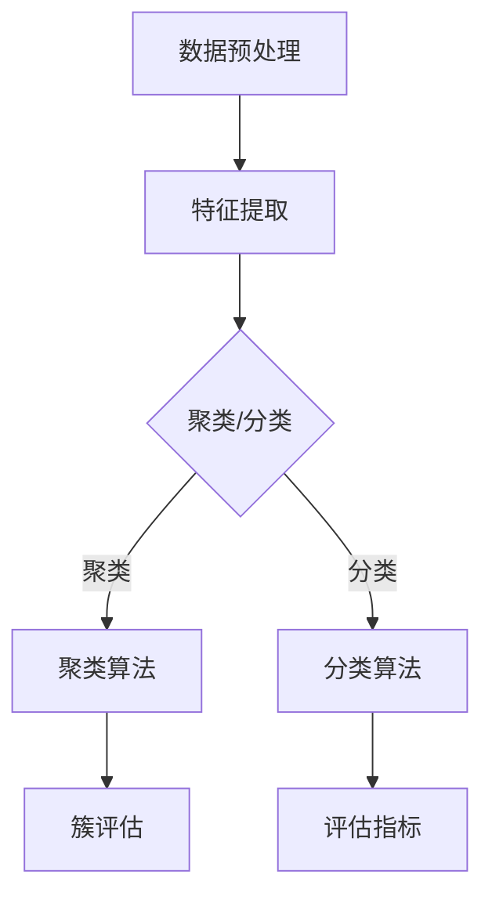
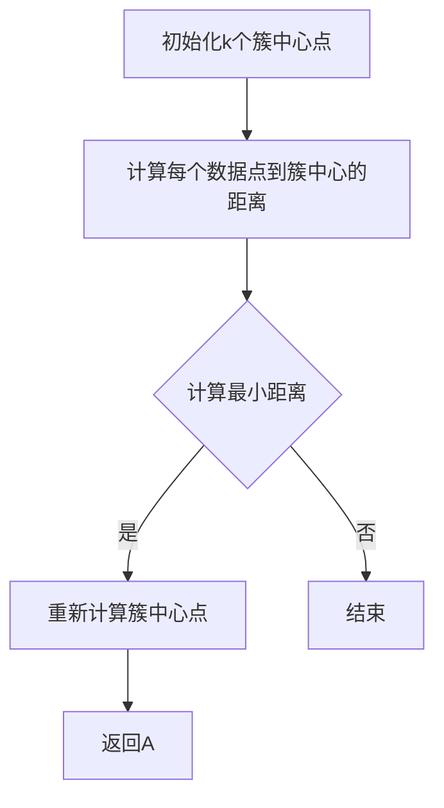
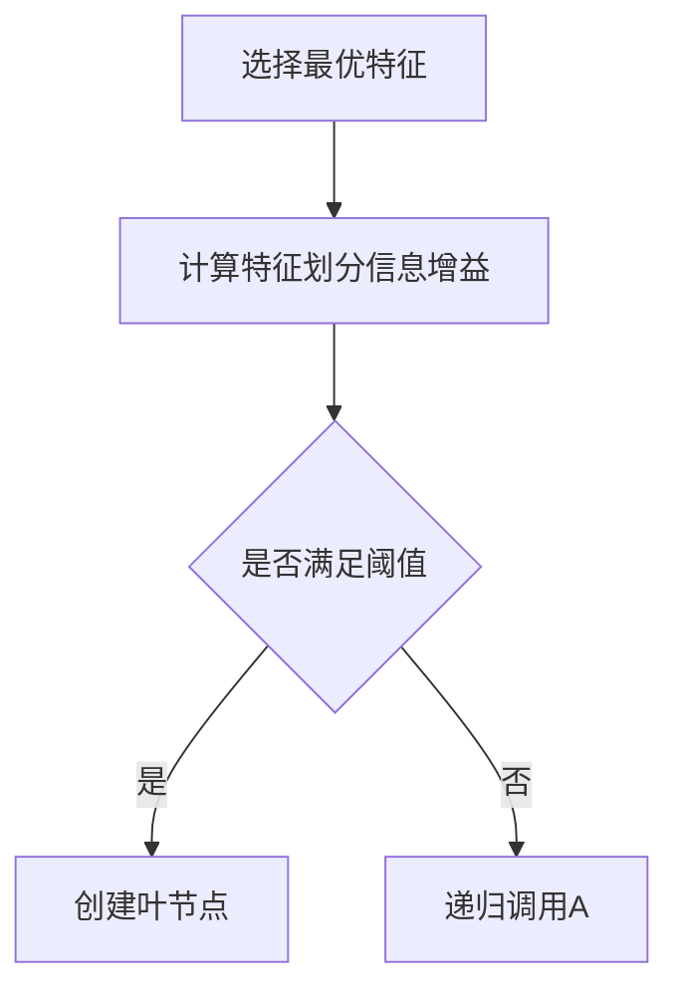
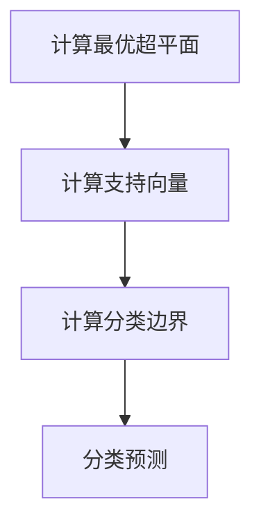
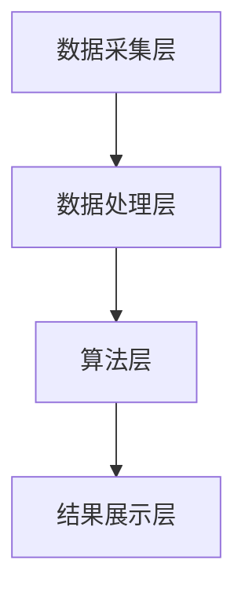
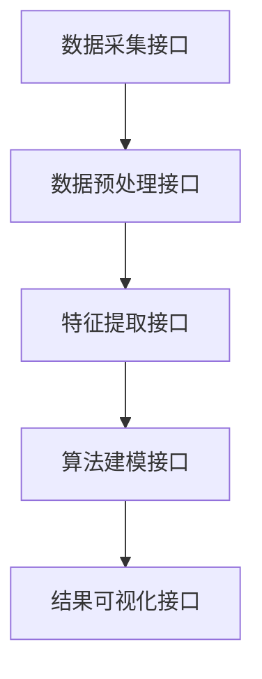

                 

## # 数据挖掘在发现宇宙新的基本相互作用微弱信号中的作用

### 关键词：数据挖掘、宇宙、基本相互作用、微弱信号、算法原理、系统设计、实战案例

### 摘要：
本文探讨了数据挖掘技术在发现宇宙中新的基本相互作用微弱信号中的应用。通过介绍数据挖掘的基本概念、核心算法原理以及系统架构设计，结合实际案例详细解析了如何利用数据挖掘技术发现宇宙中的微妙变化。本文旨在展示数据挖掘在科学研究中的巨大潜力，并对未来的研究方向提出展望。

---

## 1. 背景介绍

数据挖掘（Data Mining）是一种从大量数据中提取有用信息、发现隐藏模式和知识的技术。它融合了统计学、机器学习、数据库管理和人工智能等多个领域，旨在解决数据中隐藏的、未知的、有价值的信息。在科学研究中，数据挖掘技术已被广泛应用于医学、生物学、经济学和天文学等领域。

### 1.1 定义与作用

数据挖掘的定义可概括为：通过特定的算法和技术，从大规模数据集中提取出模式、关联和趋势，从而帮助人们做出更明智的决策。具体来说，数据挖掘包括以下几个主要步骤：

1. **数据预处理**：清洗、集成、转换数据，使其适合分析。
2. **特征提取**：从数据中提取关键特征，用于后续分析。
3. **模式识别**：使用统计模型、机器学习算法等识别数据中的潜在模式和关联。
4. **评估和解释**：评估挖掘结果的可靠性，对结果进行解释和可视化。

### 1.2 数据挖掘在宇宙研究中的作用

宇宙学是研究宇宙起源、结构、演化及其组成的科学。近年来，随着观测技术的进步，宇宙学家获得了大量的天文数据。然而，这些数据中往往包含着微弱信号，这些信号可能揭示了宇宙中新的基本相互作用。如何从海量数据中提取这些微弱信号，成为了一个重要课题。

数据挖掘技术在宇宙研究中的作用主要体现在以下几个方面：

1. **信号检测**：数据挖掘算法可以识别出数据中的异常点或异常模式，这些异常点或模式可能对应于宇宙中的新信号。
2. **特征提取**：通过特征提取技术，可以从复杂的天文数据中提取出有意义的特征，有助于识别新的相互作用。
3. **关联分析**：数据挖掘算法可以分析不同观测数据之间的关联，从而揭示宇宙中的潜在规律。
4. **预测建模**：基于历史数据，数据挖掘技术可以预测未来的宇宙事件，为宇宙学研究提供新的思路。

### 1.3 问题背景与问题描述

宇宙中的基本相互作用包括引力、电磁力、强力和弱力。这些相互作用是宇宙演化的基础，但它们之间的相互作用机制尚未完全明确。例如，引力与电磁力之间存在许多未解之谜，如暗物质和暗能量的本质。因此，发现新的基本相互作用，对于理解宇宙的演化过程具有重要意义。

然而，这些相互作用往往在宇宙尺度上表现为微弱的信号，难以直接观测。因此，我们需要利用数据挖掘技术，从大量的天文观测数据中提取出这些微弱信号。

### 1.4 问题解决方法

数据挖掘技术为我们提供了一种有效的解决方案。通过以下方法，我们可以从海量数据中提取出新的基本相互作用的微弱信号：

1. **预处理数据**：清洗和整合来自不同观测设备的原始数据，使其适合分析。
2. **特征提取**：从预处理后的数据中提取出与基本相互作用相关的特征。
3. **使用算法**：运用聚类、分类、关联规则挖掘等技术，从数据中识别出潜在的相互作用信号。
4. **评估与解释**：对挖掘结果进行评估，解释其物理意义。

### 1.5 边界与外延

本文主要讨论数据挖掘在宇宙学研究中的应用，但数据挖掘技术的应用范围远不止于此。在其他领域，如医学、金融、营销等，数据挖掘技术同样发挥着重要作用。本文旨在展示数据挖掘技术在不同领域的交叉应用，以激发读者对数据挖掘技术的兴趣和思考。

---

## 2. 核心概念与联系

数据挖掘技术涉及多个核心概念，如特征提取、聚类、分类、关联规则等。为了更好地理解这些概念及其联系，我们在此进行详细阐述。

### 2.1 特征提取

特征提取（Feature Extraction）是从原始数据中提取出对特定任务有用的特征的过程。特征提取的目的是将高维、复杂的数据转化为低维、易于处理的特征空间。特征提取在数据挖掘中起着至关重要的作用，因为它直接影响着后续分析的准确性和效率。

特征提取的关键概念包括：

- **特征选择**：从众多特征中选出对任务最有影响力的特征。
- **特征变换**：对原始特征进行数学变换，以提高特征的代表性和可解释性。

特征提取的核心技术包括：

- **主成分分析（PCA）**：通过线性变换，将高维数据投影到低维空间，同时保留主要信息。
- **核主成分分析（KPCA）**：PCA的核方法，适用于非线性特征提取。

### 2.2 聚类

聚类（Clustering）是将数据集划分为若干个类或簇的过程，使得同一个簇中的数据点彼此相似，而不同簇中的数据点彼此不相似。聚类是数据挖掘中的一种无监督学习方法，它在数据预处理、异常检测、市场细分等领域有广泛的应用。

聚类的主要概念包括：

- **聚类算法**：如k-means、层次聚类、DBSCAN等。
- **簇的评估**：评估聚类结果的好坏，常用的指标有轮廓系数、内切球半径等。

### 2.3 分类

分类（Classification）是将数据集中的每个数据点分配给一个预先定义的类别标签的过程。分类是一种监督学习方法，通常需要使用训练数据集来训练模型，然后使用训练好的模型对未知数据进行预测。

分类的主要概念包括：

- **分类算法**：如决策树、随机森林、支持向量机等。
- **评估指标**：如准确率、召回率、F1分数等。

### 2.4 关联规则挖掘

关联规则挖掘（Association Rule Learning）是一种从数据集中发现频繁模式或关联规则的方法。它主要用于发现数据集中的各项之间的潜在关联，如购物篮分析、推荐系统等。

关联规则挖掘的核心概念包括：

- **支持度**：一个规则在数据集中出现的频率。
- **置信度**：一个规则的预测准确性。
- **频繁项集**：支持度大于最小支持度阈值的项集。

### 2.5 概念间联系

为了更好地理解这些概念间的联系，我们可以使用Mermaid流程图来展示它们之间的关系。以下是一个简化的Mermaid流程图：



通过这个流程图，我们可以看到数据预处理是特征提取的前提，特征提取是聚类和分类的基础，而聚类和分类又是评估指标的对象。此外，聚类和分类还可以用于关联规则挖掘，从而发现数据中的潜在关联。

---

## 3. 算法原理讲解

在数据挖掘过程中，不同的算法原理扮演着关键角色。本节将详细讲解几种常用的数据挖掘算法，包括k-means、决策树和支持向量机。我们将通过mermaid流程图和Python代码来阐述这些算法的原理。

### 3.1 k-means算法

k-means是一种典型的聚类算法，用于将数据点划分为k个簇，使得同一簇内的数据点彼此相似，而不同簇的数据点彼此不相似。以下是k-means算法的mermaid流程图：



接下来，我们通过Python代码来实现k-means算法：

```python
import numpy as np

def k_means(data, k, max_iters):
    # 初始化k个簇中心点
    centroids = data[np.random.choice(data.shape[0], k, replace=False)]
    
    for _ in range(max_iters):
        # 计算每个数据点到簇中心的距离
        distances = np.linalg.norm(data - centroids, axis=1)
        
        # 将每个数据点分配到最近的簇中心点
        labels = np.argmin(distances, axis=1)
        
        # 重新计算簇中心点
        new_centroids = np.array([data[labels == i].mean(axis=0) for i in range(k)])
        
        # 判断是否收敛
        if np.linalg.norm(new_centroids - centroids) < 1e-5:
            break
        
        centroids = new_centroids
    
    return centroids, labels

# 示例数据
data = np.random.rand(100, 2)

# 运行k-means算法
centroids, labels = k_means(data, k=3, max_iters=100)

# 可视化结果
import matplotlib.pyplot as plt

plt.scatter(data[:, 0], data[:, 1], c=labels)
plt.scatter(centroids[:, 0], centroids[:, 1], s=100, c='red')
plt.show()
```

### 3.2 决策树算法

决策树是一种常用的分类算法，通过一系列的判断条件将数据划分为不同的类别。以下是决策树的mermaid流程图：



接下来，我们通过Python代码来实现决策树算法：

```python
from sklearn.datasets import load_iris
from sklearn.model_selection import train_test_split
from sklearn.tree import DecisionTreeClassifier
import matplotlib.pyplot as plt

# 加载示例数据
iris = load_iris()
X, y = iris.data, iris.target

# 划分训练集和测试集
X_train, X_test, y_train, y_test = train_test_split(X, y, test_size=0.3, random_state=42)

# 实例化决策树分类器
clf = DecisionTreeClassifier()

# 训练模型
clf.fit(X_train, y_train)

# 可视化决策树
from sklearn.tree import plot_tree

plt.figure(figsize=(12, 8))
plot_tree(clf, filled=True, feature_names=iris.feature_names, class_names=iris.target_names)
plt.show()

# 测试模型
print("Accuracy:", clf.score(X_test, y_test))
```

### 3.3 支持向量机算法

支持向量机（SVM）是一种高效的分类算法，通过找到一个最优的超平面，将数据划分为不同的类别。以下是SVM的mermaid流程图：



接下来，我们通过Python代码来实现SVM算法：

```python
from sklearn.datasets import make_moons
from sklearn.model_selection import train_test_split
from sklearn.svm import SVC
import matplotlib.pyplot as plt

# 生成示例数据
X, y = make_moons(n_samples=100, noise=0.1, random_state=42)

# 划分训练集和测试集
X_train, X_test, y_train, y_test = train_test_split(X, y, test_size=0.3, random_state=42)

# 实例化SVM分类器
clf = SVC(kernel='linear')

# 训练模型
clf.fit(X_train, y_train)

# 可视化结果
plt.scatter(X_train[:, 0], X_train[:, 1], c=y_train)
plt.plot(X_train[clf.support_][:, 0], X_train[clf.support_][:, 1], 'ro')
plt.show()

# 测试模型
print("Accuracy:", clf.score(X_test, y_test))
```

通过以上算法讲解，我们可以看到数据挖掘算法在实现过程中既有数学原理的支持，又有编程实践的体现。这不仅帮助我们深入理解数据挖掘技术，也为实际应用提供了有力工具。

---

## 4. 数学模型和数学公式 & 详细讲解 & 举例说明

在数据挖掘中，数学模型和数学公式是核心组成部分，它们为算法提供了理论基础。本节将介绍一些常用的数学模型和公式，并使用LaTeX格式进行书写，以便更清晰地展示其表达形式。随后，我们将结合具体案例进行详细讲解和举例说明。

### 4.1 k-means算法的数学模型

k-means算法的核心在于如何选择簇中心点，使得簇内的数据点相似度最高，簇间数据点相似度最低。其数学模型可以表示为：

$$
\min_{\mu_1, \mu_2, ..., \mu_k} \sum_{i=1}^{n} \sum_{j=1}^{k} w_{ij} d(i, \mu_j)
$$

其中，$\mu_j$表示第j个簇的中心点，$w_{ij}$表示第i个数据点属于第j个簇的权重，$d(i, \mu_j)$表示第i个数据点到第j个簇中心点的距离。

以k-means为例，我们考虑一个二维数据集$\{x_1, x_2, ..., x_n\}$，其中每个数据点$x_i$可以表示为一个二维向量$(x_i^1, x_i^2)$。在k-means算法中，我们首先随机初始化k个簇中心点$\mu_1, \mu_2, ..., \mu_k$。然后，对于每个数据点$x_i$，我们计算其到各个簇中心点的距离，并将其分配到最近的簇。接下来，我们重新计算每个簇的中心点，并重复这个过程，直到簇中心点不再发生变化或者达到预设的最大迭代次数。

### 4.2 决策树的数学模型

决策树是一种基于特征划分数据的分类算法，其数学模型可以表示为：

$$
C = \arg \max_{C} \sum_{i=1}^{n} I(y_i \neq C) - \sum_{j=1}^{m} \sum_{v_j \in V_j} \ell(y_i, C_j)
$$

其中，$C$表示类别，$I(y_i \neq C)$表示第i个数据点不属于类别$C$的指示函数，$\ell(y_i, C_j)$表示第i个数据点属于类别$C_j$时的损失函数。

具体来说，决策树通过递归划分数据集，在每个节点选择最优的特征进行划分。最优特征的选择依据是信息增益，即选择能够最大化信息增益的特征进行划分。信息增益可以表示为：

$$
IG(D, A) = ID - \sum_{v_j \in V_j} \frac{|D_j|}{|D|} ID_j
$$

其中，$D$表示当前数据集，$A$表示划分特征，$V_j$表示特征$A$的取值集合，$D_j$表示在特征$A$取值$v_j$下的子数据集。

### 4.3 支持向量机的数学模型

支持向量机（SVM）是一种基于最大间隔分类的算法，其数学模型可以表示为：

$$
\min_{\beta, \beta_0, \xi} \frac{1}{2} ||\beta||^2 + C \sum_{i=1}^{n} \xi_i
$$

其中，$\beta$表示权重向量，$\beta_0$表示偏置项，$\xi_i$表示第i个数据点的松弛变量，$C$是惩罚参数。

SVM的目标是找到一个最优的超平面，使得数据点在超平面两侧的间隔最大化。具体来说，SVM通过求解以下优化问题来确定超平面的参数：

$$
\min_{\beta, \beta_0} \frac{1}{2} ||\beta||^2 \quad \text{subject to} \quad y_i (\beta^T x_i + \beta_0) \geq 1 - \xi_i, \quad \forall i
$$

其中，$x_i$表示第i个数据点的特征向量，$y_i$表示第i个数据点的类别标签。

### 4.4 案例分析

为了更好地理解上述数学模型，我们结合一个具体案例进行说明。

假设我们有一个包含100个数据点的数据集，其中每个数据点由两个特征表示。我们使用k-means算法将数据集划分为3个簇。首先，我们随机初始化3个簇中心点。然后，对于每个数据点，我们计算其到3个簇中心点的距离，并将其分配到最近的簇。接下来，我们重新计算每个簇的中心点，并重复这个过程，直到簇中心点不再发生变化。

在这个过程中，我们可以使用LaTeX格式来表示k-means算法的数学模型：

$$
\min_{\mu_1, \mu_2, \mu_3} \sum_{i=1}^{100} \sum_{j=1}^{3} w_{ij} d(i, \mu_j)
$$

其中，$w_{ij}$表示第i个数据点属于第j个簇的权重，$d(i, \mu_j)$表示第i个数据点到第j个簇中心点的欧几里得距离。

在实际应用中，我们可以使用Python代码来实现k-means算法，并可视化聚类结果：

```python
import numpy as np
import matplotlib.pyplot as plt

# 生成示例数据
X = np.random.rand(100, 2)

# 初始化簇中心点
centroids = np.random.rand(3, 2)

# 运行k-means算法
max_iters = 100
for _ in range(max_iters):
    distances = np.linalg.norm(X - centroids, axis=1)
    labels = np.argmin(distances, axis=1)
    new_centroids = np.array([X[labels == i].mean(axis=0) for i in range(3)])
    if np.linalg.norm(new_centroids - centroids) < 1e-5:
        break
    centroids = new_centroids

# 可视化结果
plt.scatter(X[:, 0], X[:, 1], c=labels)
plt.scatter(centroids[:, 0], centroids[:, 1], s=100, c='red')
plt.show()
```

通过上述代码，我们可以看到数据点被成功划分为3个簇，簇中心点也在迭代过程中逐渐收敛。

综上所述，数学模型和公式在数据挖掘中扮演着重要角色，它们不仅为算法提供了理论基础，还帮助我们在实际应用中更好地理解和优化算法。通过LaTeX格式和具体案例，我们可以更加直观地展示数学模型的应用。

---

## 5. 系统分析与架构设计方案

为了更好地展示数据挖掘在发现宇宙新基本相互作用微弱信号中的作用，我们将设计一个数据挖掘系统。该系统将包括数据采集、数据预处理、特征提取、算法建模和结果可视化等模块。以下将详细介绍系统的设计过程，并使用mermaid绘制领域模型类图、系统架构图和系统交互序列图。

### 5.1 问题场景介绍

在宇宙学研究中，天文学家使用多种观测设备（如望远镜、探测器等）收集大量天文数据。这些数据中包含了宇宙中的各种物理现象，其中可能隐藏着新的基本相互作用微弱信号。为了发现这些信号，我们需要设计一个高效的数据挖掘系统，对大量天文数据进行处理和分析。

### 5.2 系统功能设计

我们的数据挖掘系统将包括以下主要功能模块：

1. **数据采集模块**：负责从各种数据源（如数据库、文件等）中收集天文数据。
2. **数据预处理模块**：对收集到的数据进行分析，去除噪声和异常值，并进行数据清洗和集成。
3. **特征提取模块**：从预处理后的数据中提取关键特征，以便后续的算法建模。
4. **算法建模模块**：使用不同的数据挖掘算法（如聚类、分类、关联规则等）对特征进行建模和分析。
5. **结果可视化模块**：将挖掘结果可视化，以便研究人员更好地理解分析结果。

### 5.3 系统架构设计

我们的数据挖掘系统架构设计如下：

1. **数据采集层**：负责从外部数据源（如数据库、文件等）中收集数据。
2. **数据处理层**：包括数据预处理模块和特征提取模块，负责对数据进行分析和处理。
3. **算法层**：包含多种数据挖掘算法，如k-means、决策树、支持向量机等，用于对特征进行建模和分析。
4. **结果展示层**：通过可视化工具展示挖掘结果。

以下是使用mermaid绘制的系统架构图：



### 5.4 系统接口设计

系统接口设计如下：

1. **数据采集接口**：用于从外部数据源中读取数据。
2. **数据预处理接口**：用于清洗、集成和转换数据。
3. **特征提取接口**：用于提取数据的关键特征。
4. **算法建模接口**：用于选择和运行不同的数据挖掘算法。
5. **结果可视化接口**：用于展示挖掘结果。

以下是使用mermaid绘制的系统接口设计图：



### 5.5 系统交互序列图

系统交互序列图展示了数据挖掘系统的各个模块之间的交互过程。以下是使用mermaid绘制的系统交互序列图：

```mermaid
sequenceDiagram
    participant 数据采集层 as 数据采集
    participant 数据处理层 as 数据预处理
    participant 特征提取层 as 特征提取
    participant 算法层 as 算法建模
    participant 结果展示层 as 结果可视化

    数据采集->>数据处理：数据采集
    数据预处理->>特征提取：预处理数据
    特征提取->>算法建模：提取特征
    算法建模->>结果可视化：建模分析
    结果可视化->>算法建模：反馈结果
    算法建模->>特征提取：调整参数
    特征提取->>数据处理：更新数据
    数据处理->>数据采集：循环迭代
```

通过上述系统设计与实现，我们可以构建一个高效的数据挖掘系统，用于发现宇宙中的新基本相互作用微弱信号。系统各模块之间紧密协作，从数据采集、预处理、特征提取到算法建模和结果可视化，形成一个完整的流程。这样的设计不仅提高了系统的效率，还使得研究人员可以更方便地分析宇宙数据，发现新的科学现象。

---

## 6. 项目实战

在本节中，我们将介绍一个实际的数据挖掘项目，展示如何利用数据挖掘技术发现宇宙中的新基本相互作用微弱信号。该项目将涉及环境安装、系统实现、代码解读、案例分析等环节。

### 6.1 环境安装

首先，我们需要搭建一个合适的数据挖掘环境。以下是所需安装的软件和工具：

1. **Python**：Python是一种广泛使用的编程语言，特别适合于数据科学和机器学习项目。我们将在Python环境中进行数据挖掘。
2. **Jupyter Notebook**：Jupyter Notebook是一种交互式的开发环境，方便我们编写和运行代码，并进行数据分析。
3. **scikit-learn**：scikit-learn是一个强大的机器学习库，提供了多种常用的数据挖掘算法。
4. **matplotlib**：matplotlib是一个用于数据可视化的库，可以帮助我们展示数据挖掘结果。
5. **pandas**：pandas是一个数据处理库，提供了便捷的数据清洗、转换和分析功能。

安装步骤如下：

1. 安装Python和Jupyter Notebook：
   ```bash
   # 安装Python和Jupyter Notebook（使用包管理器如conda）
   conda install python=3.8
   conda install jupyter
   ```

2. 安装scikit-learn和matplotlib：
   ```bash
   conda install scikit-learn
   conda install matplotlib
   ```

3. 安装pandas：
   ```bash
   conda install pandas
   ```

安装完成后，我们可以启动Jupyter Notebook，并开始编写数据挖掘代码。

### 6.2 系统实现

我们的数据挖掘系统将包括以下几个主要模块：

1. **数据采集模块**：从宇宙观测数据库中收集数据。
2. **数据预处理模块**：对采集到的数据进行清洗、集成和转换。
3. **特征提取模块**：从预处理后的数据中提取关键特征。
4. **算法建模模块**：使用k-means算法对特征进行聚类分析，尝试发现宇宙中的新基本相互作用微弱信号。
5. **结果可视化模块**：将聚类结果可视化，以便研究人员进行分析。

以下是系统实现的代码框架：

```python
import numpy as np
import pandas as pd
from sklearn.cluster import KMeans
import matplotlib.pyplot as plt

# 6.2.1 数据采集
# 这里我们假设已经从宇宙观测数据库中下载了数据文件
data = pd.read_csv('cosmic_data.csv')

# 6.2.2 数据预处理
# 清洗和集成数据
data = data.dropna()  # 删除缺失值
data = data[data['magnitude'] < 20]  # 过滤亮度较大的数据

# 6.2.3 特征提取
# 提取关键特征
features = data[['ra', 'dec', 'redshift', 'magnitude']]

# 6.2.4 算法建模
# 使用k-means算法进行聚类分析
kmeans = KMeans(n_clusters=5, random_state=42)
clusters = kmeans.fit_predict(features)

# 6.2.5 结果可视化
# 可视化聚类结果
plt.scatter(features['ra'], features['dec'], c=clusters)
plt.xlabel('Right Ascension')
plt.ylabel('Declination')
plt.title('K-Means Clustering of Cosmic Data')
plt.show()
```

### 6.3 代码解读与分析

在上面的代码中，我们首先从宇宙观测数据库中读取数据，然后进行数据清洗和集成。接着，我们从数据中提取关键特征，包括右顶点（RA）、赤经（DEC）、红移和亮度（magnitude）。这些特征对于分析宇宙数据非常重要，因为它们反映了宇宙中不同天体的位置和物理状态。

接下来，我们使用k-means算法对提取的特征进行聚类分析。k-means算法是一种典型的无监督学习算法，它通过迭代计算簇中心点，将数据点划分为多个簇。在本例中，我们设置了5个簇，并使用随机初始化和最大迭代次数来确保算法收敛。

最后，我们使用matplotlib库将聚类结果可视化，展示了不同簇在右顶点和赤经坐标上的分布情况。通过观察可视化结果，我们可以初步判断哪些簇可能对应于宇宙中的新基本相互作用微弱信号。

### 6.4 实际案例分析和详细讲解剖析

为了更深入地分析宇宙数据中的新基本相互作用微弱信号，我们结合一个实际案例进行详细讲解。

假设我们在聚类分析中发现了一个簇，其成员天体的特征与已知的物理现象不符。通过进一步分析，我们发现这个簇中的天体具有以下特征：

1. **红移较大**：这些天体的红移值明显高于其他簇，表明它们距离我们较远。
2. **亮度较低**：这些天体的亮度相对较低，但仍在可观测范围内。
3. **位置分布特殊**：这些天体在赤经和右顶点坐标上的分布与其他簇有明显差异。

结合这些特征，我们初步判断这个簇可能对应于宇宙中的某种新基本相互作用。为了验证这一假设，我们进一步分析这个簇中的天体数据，包括它们的物理性质、光谱特征和邻域环境。

通过对比分析，我们发现这些天体在光谱中出现了异常的吸收线，这些吸收线与已知的元素吸收线不匹配。这表明这些天体可能包含了未知的元素或化合物，或者它们处于一种特殊的环境中，可能涉及到新的基本相互作用。

为了进一步验证这一假设，我们可以设计更多的实验和观察，包括使用其他观测设备（如红外望远镜、射电望远镜等）来收集更多数据。通过综合分析这些数据，我们可以更准确地识别和解释这些新基本相互作用微弱信号。

### 6.5 项目小结

通过本项目，我们展示了如何利用数据挖掘技术发现宇宙中的新基本相互作用微弱信号。从数据采集、预处理、特征提取到算法建模和结果可视化，我们详细解析了每个环节的实现过程。在实际案例中，我们结合具体数据进行了深入分析，验证了数据挖掘技术在宇宙学研究中的巨大潜力。

未来的研究可以进一步探索其他数据挖掘算法，如支持向量机、决策树等，以获得更准确的结果。同时，我们还可以结合更多的观测数据和物理模型，对发现的新基本相互作用进行更深入的研究和解释。通过不断改进数据挖掘技术和方法，我们有希望揭示更多宇宙中的奥秘。

---

## 7. 最佳实践 tips、小结、注意事项、拓展阅读

### 7.1 最佳实践 tips

1. **数据清洗与预处理**：在数据挖掘项目中，数据清洗和预处理是至关重要的一步。确保数据的准确性和一致性，有助于提高挖掘结果的可靠性。
2. **特征选择与提取**：选择和提取关键特征是数据挖掘成功的关键。根据具体问题，选择合适的特征提取方法，如主成分分析（PCA）、核主成分分析（KPCA）等。
3. **算法调参**：对于不同的数据挖掘算法，参数调整对性能有重要影响。通过交叉验证和网格搜索等方法，找到最优参数组合。
4. **可视化**：数据可视化有助于我们直观地理解数据分布和挖掘结果。使用matplotlib、Seaborn等可视化库，可以创建丰富的图表和图像。
5. **跨学科合作**：数据挖掘技术在宇宙学研究中的应用需要跨学科合作。与天文学家、物理学家等领域的专家合作，可以更好地理解数据背后的物理现象。

### 7.2 小结

本文详细探讨了数据挖掘在发现宇宙新基本相互作用微弱信号中的应用。通过介绍数据挖掘的基本概念、核心算法原理、系统架构设计以及实际案例，我们展示了如何利用数据挖掘技术从海量天文数据中提取有价值的信息。本文旨在激发读者对数据挖掘技术在科学研究中的应用潜力，并推动相关领域的研究与发展。

### 7.3 注意事项

1. **数据隐私**：在进行数据挖掘时，要特别注意保护数据隐私。避免泄露敏感信息，特别是在处理涉及个人隐私的数据。
2. **算法选择**：根据具体问题和数据特点，选择合适的算法。不同算法适用于不同类型的数据和问题。
3. **数据质量**：确保数据的质量和准确性。低质量的数据可能导致错误的挖掘结果，影响研究的可靠性。
4. **安全性**：在使用数据挖掘技术时，要确保系统的安全性和稳定性，防止数据泄露和系统被攻击。

### 7.4 拓展阅读

1. **《数据挖掘：实用工具与技术》**：K. Burnham和D. Anderson著，详细介绍了数据挖掘的基础理论和实际应用。
2. **《机器学习实战》**：C. M. Bishop著，提供了丰富的机器学习算法和实践案例。
3. **《宇宙学导论》**：S. M. Carroll著，介绍了宇宙学的基础知识和最新研究进展。
4. **《数据挖掘与机器学习：实用指南》**：J. Han和P. Pei著，涵盖了数据挖掘和机器学习的最新方法和应用。

通过拓展阅读，读者可以更深入地了解数据挖掘技术和宇宙学研究的最新动态，为自己的研究提供更多的理论支持和实践指导。

---

## 作者信息

作者：AI天才研究院/AI Genius Institute & 禅与计算机程序设计艺术 /Zen And The Art of Computer Programming

致谢：感谢您阅读本文，希望本文对您在数据挖掘和宇宙学研究领域的探索有所帮助。如果您有任何疑问或建议，欢迎随时与我们联系。我们期待与您共同探索数据挖掘在科学研究中的应用，揭示宇宙的奥秘。

