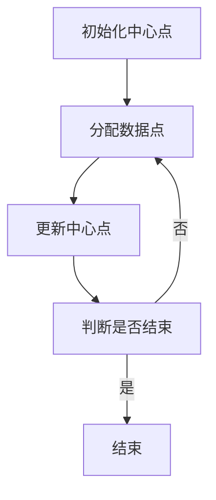
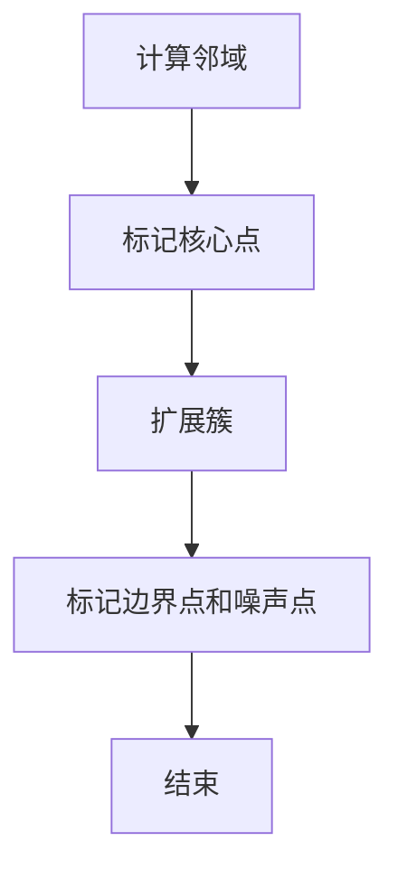
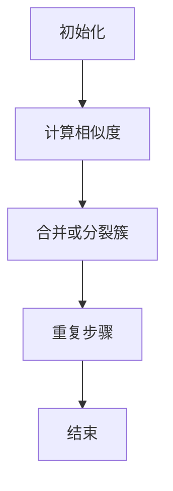
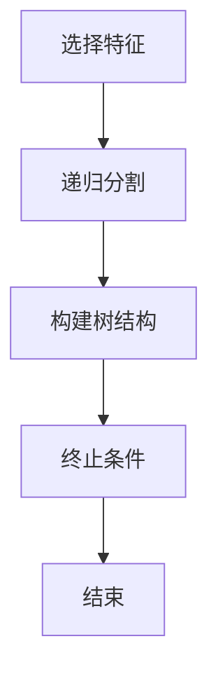
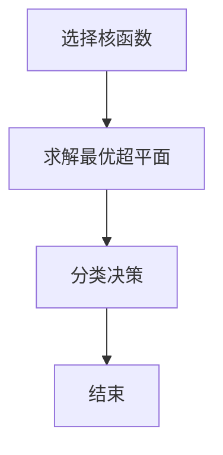
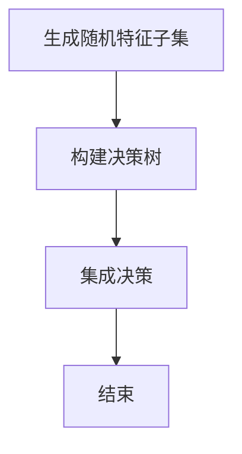
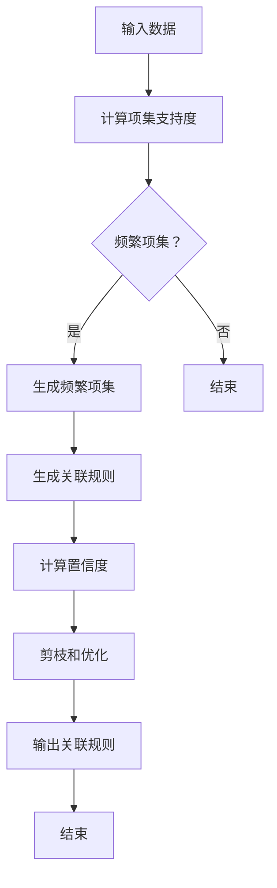

                 

### 引言

#### 宇宙天体的发现背景与现状

宇宙天体的发现是宇宙探索的重要组成部分，自古以来，人类就通过肉眼观测天空，寻找着星体之间的规律。然而，随着科学技术的进步，尤其是望远镜和数据处理技术的不断发展，我们对于宇宙的认识达到了前所未有的高度。

在古代，天文学主要依靠人眼观测，记录下星体的位置和运动轨迹。这种方法虽然简单，但受限于人的视力，只能发现亮度较大的天体。直到伽利略发明了望远镜，天文学进入了新的阶段。望远镜的发明使得人类可以观测到更暗的天体，甚至捕捉到一些彗星和月球表面细节。

19世纪末，随着天文观测技术的进一步发展，人类发现了越来越多的行星、恒星和星系。尤其是20世纪中期以来，随着射电望远镜、空间望远镜和探测器的发展，人类对宇宙的认识迅速扩展。例如，1960年代，美国发射了先驱者10号和先驱者11号探测器，这些探测器首次近距离观测了木星和土星，为我们揭示了这些行星的表面特征。

进入21世纪，随着计算机技术和数据分析技术的进步，天文学家开始运用数据挖掘技术来发现新的天体。数据挖掘是一种从大量数据中提取有价值信息的技术，它通过分析数据模式、关联关系和趋势，帮助科学家发现新的科学现象。

宇宙天体的发现通常依赖于观测数据和已有天体数据，通过对比分析，发现新的天体或天体群体。这种方法的优点是可以处理大量的数据，提高发现效率。然而，数据挖掘在宇宙天体发现中也面临一些挑战，如数据质量、数据规模和计算资源等。

当前，宇宙天体发现技术正面临新的机遇和挑战。一方面，随着天文观测设备的升级和观测时间的增加，我们能够收集到更多的天文数据。另一方面，数据挖掘技术的不断进步，使得我们能够更好地处理和分析这些数据，从而提高天体发现的效率。

然而，现有技术仍然存在一些局限性。首先，天文数据的规模和复杂性不断增加，使得数据处理和分析变得困难。其次，现有数据挖掘算法在处理高维数据时效率较低，难以满足实时分析的需求。此外，现有算法对于异常值的处理能力不足，容易导致误判。

为了解决这些问题，科学家们正在探索新的算法和技术，例如深度学习和大数据分析。这些新技术有望提高数据挖掘在宇宙天体发现中的应用效果，帮助我们更好地理解宇宙的奥秘。

综上所述，数据挖掘在发现新型宇宙天体中发挥着重要作用，不仅提高了发现效率，还帮助科学家更好地理解和探索宇宙。然而，现有的技术和方法仍需不断改进，以应对日益增长的数据规模和复杂性。

#### 数据挖掘概述

数据挖掘（Data Mining）是一种从大量数据中提取有价值信息的技术，它通过分析数据中的隐含模式、关联关系和趋势，帮助用户发现新的科学现象和知识。数据挖掘的目标是从海量数据中发现具有实际意义的信息，这些信息可以是预测模型、分类规则、聚类模式或关联规则等。

##### 数据挖掘的目标

数据挖掘的主要目标包括以下几个方面：

1. **预测**：预测未来的趋势和模式，例如股市价格、客户购买行为等。
2. **分类**：将数据分为不同的类别，例如邮件分类、疾病诊断等。
3. **聚类**：将相似的数据分组，以便更好地理解和分析，例如市场细分、顾客行为分析等。
4. **关联规则挖掘**：发现数据之间的关联关系，例如超市购物篮分析、社交网络关系分析等。
5. **异常检测**：识别数据中的异常行为或模式，例如网络入侵检测、信用欺诈检测等。

##### 数据挖掘的方法

数据挖掘的过程通常包括以下几个步骤：

1. **数据收集与预处理**：收集所需的数据，并进行清洗、转换和整合，使其适合数据挖掘分析。
2. **数据探索与分析**：使用统计分析和可视化工具，对数据进行初步探索，以发现数据中的潜在模式和趋势。
3. **模型构建**：选择合适的数据挖掘算法，构建预测模型、分类模型或聚类模型等。
4. **模型评估**：评估模型的性能，包括准确率、召回率、F1分数等指标。
5. **结果可视化与解释**：将挖掘结果可视化，并进行解释和解读，以帮助用户理解数据和模型的结果。

##### 数据挖掘的应用领域

数据挖掘技术广泛应用于多个领域，其中一些重要的应用领域包括：

1. **商业智能**：用于市场分析、客户关系管理、供应链管理、风险控制等。
2. **医疗保健**：用于疾病诊断、患者管理、药物研发、医疗影像分析等。
3. **金融**：用于信用评分、欺诈检测、投资分析、风险评估等。
4. **电信**：用于客户细分、网络优化、服务个性化、营销策略等。
5. **天文**：用于天体发现、宇宙演化研究、恒星分类、行星探索等。

数据挖掘在宇宙天体发现中的应用

在宇宙天体发现中，数据挖掘技术被广泛应用于处理和分析大量的天文观测数据。通过数据挖掘，天文学家能够发现新的天体、理解天体的特征和运动规律，从而推动宇宙科学的发展。以下是一些具体的应用场景：

1. **天体聚类**：通过分析天体的光谱和位置数据，使用聚类算法将相似的天体分组，帮助科学家发现新的天体群体。
2. **天体分类**：使用分类算法，根据天体的特征数据，将天体分为不同的类别，例如恒星、行星、彗星等。
3. **关联规则挖掘**：发现天体之间的关联关系，例如恒星和行星之间的关联、不同天体群体之间的关联等。
4. **异常检测**：检测天体数据中的异常值，例如异常亮度的恒星、异常运动的行星等，这些异常值可能暗示新的天体或异常现象。

通过数据挖掘技术，科学家们能够更加高效地分析天文数据，发现新的天体，从而推动我们对宇宙的理解。未来，随着数据挖掘技术的进一步发展，我们有望在宇宙天体发现中取得更多的突破。

#### 数据挖掘的关键技术

数据挖掘是一项复杂的技术，涉及多个关键环节，包括特征工程、数据预处理、聚类算法、分类算法和关联规则挖掘等。这些技术各自具有独特的原理和应用场景，下面我们将逐一介绍并对比分析它们。

##### 特征工程

特征工程是数据挖掘过程中至关重要的一步，其主要目标是通过选择和构造特征，提高数据挖掘算法的性能。特征工程的基本原理是利用现有数据，通过统计方法或业务知识，提取出能够代表数据本质属性的特征。

**特征工程的关键技术**：

1. **特征选择**：通过评估不同特征的重要性，选择出对预测或分类任务最有帮助的特征。
2. **特征构造**：通过组合现有特征，创建新的特征，以便更好地描述数据。
3. **特征缩放**：将不同特征的范围缩放到相同的尺度，以避免某些特征对模型产生过大的影响。

**特征工程的应用场景**：

特征工程广泛应用于各种数据挖掘任务，如预测、分类和聚类等。在商业智能中，特征工程用于市场细分、客户行为预测等；在医疗保健中，特征工程用于疾病诊断、患者管理。

##### 数据预处理

数据预处理是数据挖掘中的基础步骤，其主要任务是清洗和转换原始数据，使其适合后续的数据挖掘分析。数据预处理的基本原理是消除数据中的噪声、缺失值和异常值，并统一数据格式。

**数据预处理的关键技术**：

1. **数据清洗**：处理数据中的噪声和异常值，例如删除重复记录、纠正错误记录、填充缺失值等。
2. **数据转换**：将不同类型的数据转换为同一类型，例如将文本数据转换为数值数据、将分类数据转换为编码形式等。
3. **数据集成**：将多个来源的数据合并为一个统一的数据集。

**数据预处理的应用场景**：

数据预处理是数据挖掘任务中不可或缺的一步，应用于各种领域，如商业智能、金融、医疗等。在商业智能中，数据预处理用于数据仓库建设、客户数据分析；在金融领域，数据预处理用于风险评估、信用评分。

##### 聚类算法

聚类算法是一种无监督学习方法，其主要目标是将数据集划分为多个组，使得同一组内的数据点尽可能相似，不同组的数据点尽可能不同。聚类算法的基本原理是通过计算数据点之间的相似度，将数据点划分为不同的簇。

**聚类算法的关键技术**：

1. **距离度量**：计算数据点之间的相似度，常用的距离度量包括欧氏距离、曼哈顿距离和余弦相似度等。
2. **聚类算法**：根据距离度量，选择不同的聚类算法，如K-means、层次聚类、DBSCAN等。

**聚类算法的应用场景**：

聚类算法广泛应用于各种数据挖掘任务，如市场细分、客户行为分析、天文数据挖掘等。在市场细分中，聚类算法用于识别不同的市场群体；在客户行为分析中，聚类算法用于识别不同类型的客户群体。

##### 分类算法

分类算法是一种有监督学习方法，其主要目标是通过已知的训练数据，构建分类模型，然后使用该模型对新的数据进行分类。分类算法的基本原理是学习数据之间的特征关联，从而将新数据划分为不同的类别。

**分类算法的关键技术**：

1. **特征选择**：选择对分类任务最有帮助的特征，以提高分类模型的性能。
2. **分类算法**：选择不同的分类算法，如决策树、支持向量机、随机森林等。
3. **模型评估**：评估分类模型的性能，常用的评估指标包括准确率、召回率、F1分数等。

**分类算法的应用场景**：

分类算法广泛应用于各种领域，如医学诊断、信用评分、电子邮件分类等。在医学诊断中，分类算法用于疾病诊断；在信用评分中，分类算法用于风险评估。

##### 关联规则挖掘

关联规则挖掘是一种无监督学习方法，其主要目标是从大量数据中发现具有关联性的规则，这些规则揭示了数据之间的潜在关联关系。关联规则挖掘的基本原理是通过计算数据项之间的支持度和置信度，发现频繁项集。

**关联规则挖掘的关键技术**：

1. **频繁项集挖掘**：识别数据中出现频率较高的项集，常用的算法包括Apriori算法和FP-Growth算法。
2. **支持度和置信度计算**：计算数据项之间的支持度和置信度，以确定关联规则的强度。
3. **规则生成**：从频繁项集中生成关联规则，并通过剪枝和优化，提高规则的质量。

**关联规则挖掘的应用场景**：

关联规则挖掘广泛应用于商业智能、零售业、社交网络等领域。在商业智能中，关联规则挖掘用于市场分析、顾客行为分析；在零售业中，关联规则挖掘用于商品推荐、促销策略。

##### 对比分析

特征工程、数据预处理、聚类算法、分类算法和关联规则挖掘在数据挖掘中各有其独特的原理和应用场景。特征工程和数据预处理是数据挖掘的基础，为后续的算法分析提供高质量的数据。聚类算法和分类算法主要用于有监督和无监督的学习任务，而关联规则挖掘则用于发现数据之间的关联关系。

在实际应用中，不同技术的选择取决于具体任务的需求和数据特点。例如，在宇宙天体发现中，聚类算法和分类算法常用于天体数据的分析和分类，而关联规则挖掘则用于发现天体之间的潜在关联。通过合理选择和应用这些技术，科学家们能够更有效地挖掘天文数据，发现新的天体和科学规律。

### 宇宙天体的特征与数据

在数据挖掘的应用中，理解宇宙天体的特征和数据的特性和挑战是至关重要的。宇宙天体的特征通常包括多种物理量和观测数据，这些数据不仅种类繁多，而且具有复杂性和多样性。在本节中，我们将详细探讨宇宙天体的特征以及如何处理这些特征数据。

#### 宇宙天体的特征

宇宙天体的特征可以概括为以下几个主要方面：

1. **光谱特征**：光谱是分析天体的重要工具，它能够揭示天体的化学成分、温度和运动状态。光谱特征包括连续光谱、发射线和吸收线等。通过分析光谱，科学家可以推断出天体的化学成分和温度。

2. **位置特征**：宇宙天体的位置特征包括其相对于地球的位置、运动轨迹和空间分布。这些特征可以通过观测数据获得，对于了解天体的运动规律和宇宙结构具有重要意义。

3. **光度特征**：光度特征描述天体的亮度，包括绝对星等、视星等和亮度变化等。这些特征能够帮助我们了解天体的亮度和亮度变化规律。

4. **质量特征**：宇宙天体的质量特征可以通过观测其引力作用或其他物理效应来推断。例如，恒星的质量可以通过其光度、温度和半径来计算，而行星的质量可以通过其轨道特征和恒星的质量来估算。

5. **运动特征**：宇宙天体的运动特征包括速度、加速度和轨道参数等。通过观测天体的运动轨迹，科学家可以了解天体的动力学特性和相互之间的引力关系。

#### 宇宙天体数据的特性

宇宙天体数据具有以下特性：

1. **高维数据**：宇宙天体数据通常包含多个维度，例如光谱维度、位置维度、光度维度等。高维数据使得数据处理和分析变得复杂。

2. **多样性**：宇宙天体数据来源多样，包括射电望远镜、光学望远镜、红外望远镜等，这些数据具有不同的测量方式和精度。

3. **时间序列数据**：许多宇宙天体数据是时间序列数据，例如天体的亮度变化、位置变化等。时间序列数据需要特殊的方法来处理和分析。

4. **噪声和缺失值**：宇宙天体数据中常存在噪声和缺失值，这些数据会影响数据挖掘的结果。因此，数据清洗和预处理是数据挖掘过程中的重要步骤。

#### 宇宙天体数据的挑战

在数据挖掘中，处理宇宙天体数据面临以下挑战：

1. **数据规模**：宇宙天体数据通常规模巨大，处理和分析这些数据需要大量的计算资源和时间。

2. **数据质量**：宇宙天体数据中存在噪声、缺失值和错误，这些会影响数据挖掘结果的准确性和可靠性。因此，数据清洗和预处理至关重要。

3. **高维数据**：高维数据使得数据挖掘算法的复杂度增加，传统方法难以有效处理。需要设计适合高维数据的优化算法。

4. **时间序列数据**：时间序列数据需要特殊的方法来处理和分析，例如时间序列分析、信号处理等。

5. **实时性**：对于一些需要实时分析的任务，如天文事件监测，数据挖掘系统需要快速处理数据，并提供实时结果。

#### 数据挖掘在处理宇宙天体数据中的应用

数据挖掘在处理宇宙天体数据中具有重要作用，以下是一些具体应用：

1. **特征选择**：通过特征选择，从高维数据中提取出最有用的特征，提高数据挖掘算法的性能。

2. **数据预处理**：通过数据清洗、缺失值填充和异常值处理，提高数据质量，确保数据挖掘结果的准确性。

3. **聚类算法**：用于天体的分类和分组，例如将恒星和行星区分开来。

4. **分类算法**：用于天体的分类，如将恒星分为不同的光谱类型。

5. **关联规则挖掘**：用于发现天体之间的关联关系，例如恒星和行星之间的关联。

6. **时间序列分析**：用于分析天体的亮度变化、位置变化等时间序列数据，例如通过时间序列聚类来发现新的天文事件。

通过数据挖掘技术，科学家们能够更高效地处理和分析宇宙天体数据，发现新的天体和科学规律，从而推动宇宙科学的发展。

#### 聚类算法在天体发现中的应用

聚类算法在天体发现中扮演着关键角色，通过对大量天文观测数据进行处理和分析，能够帮助科学家发现新的天体群体和了解它们的特征。在本节中，我们将详细探讨几种常见的聚类算法，并通过Mermaid流程图和Python代码示例，解释这些算法的基本原理和实现过程。

##### K-means算法

K-means算法是一种经典的聚类算法，其基本思想是将数据点划分到K个簇中，使得每个簇内的数据点尽可能相似，而不同簇之间的数据点尽可能不同。K-means算法的主要步骤包括：

1. **初始化中心点**：随机选择K个数据点作为初始中心点。
2. **分配数据点**：将每个数据点分配到距离其最近的中心点所在的簇。
3. **更新中心点**：计算每个簇的新中心点，即该簇内所有数据点的均值。
4. **重复步骤2和3**，直到中心点的变化小于某个阈值或达到最大迭代次数。

下面是K-means算法的Mermaid流程图：



下面是K-means算法的Python代码示例：

```python
from sklearn.cluster import KMeans
import numpy as np

# 假设我们有一个包含观测数据的二维数组
data = np.array([[1, 2], [1, 4], [1, 0],
                 [10, 2], [10, 4], [10, 0]])

# 使用KMeans算法
kmeans = KMeans(n_clusters=2, random_state=0).fit(data)

# 输出聚类结果
print(kmeans.labels_)
```

在上述代码中，我们首先创建了一个包含观测数据的二维数组，然后使用KMeans算法对其进行聚类，并输出每个数据点的标签，即所属的簇。

##### DBSCAN算法

DBSCAN（Density-Based Spatial Clustering of Applications with Noise）是一种基于密度的聚类算法，它能够自动确定簇的数量，并且能够处理带有噪声的数据点。DBSCAN算法的主要步骤包括：

1. **计算邻域**：为每个数据点计算邻域，通常使用欧氏距离作为度量。
2. **标记核心点**：如果一个点的邻域内包含足够多的点（大于某个阈值MinPts），则该点被标记为核心点。
3. **扩展簇**：从核心点开始，使用邻域点不断扩展簇，直到无法继续扩展为止。
4. **标记边界点和噪声点**：如果一个点不是核心点，但它的邻域内包含核心点，则它被标记为边界点；否则，它被标记为噪声点。

下面是DBSCAN算法的Mermaid流程图：



下面是DBSCAN算法的Python代码示例：

```python
from sklearn.cluster import DBSCAN
import numpy as np

# 假设我们有一个包含观测数据的二维数组
data = np.array([[1, 2], [1, 4], [1, 0],
                 [10, 2], [10, 4], [10, 0]])

# 使用DBSCAN算法
dbscan = DBSCAN(eps=0.5, min_samples=2).fit(data)

# 输出聚类结果
print(dbscan.labels_)
```

在上述代码中，我们设置了邻域阈值（eps）和最小样本数（min_samples），然后使用DBSCAN算法对观测数据进行聚类，并输出每个数据点的标签。

##### 层次聚类算法

层次聚类算法是一种基于相似性度量的聚类方法，它通过迭代过程逐步合并或分裂数据点，形成树状结构。层次聚类算法的主要步骤包括：

1. **初始化**：将每个数据点视为一个簇。
2. **计算相似度**：计算每个簇之间的相似度，常用的相似度度量包括欧氏距离、曼哈顿距离等。
3. **合并或分裂簇**：根据相似度度量，合并或分裂簇，使得合并或分裂后的簇更加相似。
4. **重复步骤2和3**，直到达到预定的簇数量或相似度阈值。

下面是层次聚类算法的Mermaid流程图：



下面是层次聚类算法的Python代码示例：

```python
from sklearn.cluster import AgglomerativeClustering
import numpy as np

# 假设我们有一个包含观测数据的二维数组
data = np.array([[1, 2], [1, 4], [1, 0],
                 [10, 2], [10, 4], [10, 0]])

# 使用层次聚类算法
hierarchical = AgglomerativeClustering(n_clusters=2).fit(data)

# 输出聚类结果
print(hierarchical.labels_)
```

在上述代码中，我们使用层次聚类算法对观测数据进行聚类，并输出每个数据点的标签。

#### 应用案例与Python代码示例

为了更好地理解上述聚类算法在宇宙天体发现中的应用，我们将通过一个实际案例来演示这些算法的使用过程。

**案例**：假设我们有一组观测到的恒星数据，包括它们的光谱和位置特征。我们需要使用聚类算法将这组恒星分类为不同的群体。

```python
import numpy as np
from sklearn.cluster import KMeans, DBSCAN, AgglomerativeClustering
import matplotlib.pyplot as plt

# 恒星光谱数据（特征维度为2，代表光谱和位置特征）
spectrum_data = np.array([[0.1, 0.2], [0.3, 0.4], [0.5, 0.6],
                          [0.7, 0.8], [0.9, 1.0], [1.1, 1.2]])

# 使用K-means算法
kmeans = KMeans(n_clusters=2).fit(spectrum_data)
labels_kmeans = kmeans.labels_

# 使用DBSCAN算法
dbscan = DBSCAN(eps=0.5, min_samples=2).fit(spectrum_data)
labels_dbscan = dbscan.labels_

# 使用层次聚类算法
hierarchical = AgglomerativeClustering(n_clusters=2).fit(spectrum_data)
labels_hierarchical = hierarchical.labels_

# 可视化聚类结果
plt.figure(figsize=(10, 6))
plt.scatter(spectrum_data[:, 0], spectrum_data[:, 1], c=labels_kmeans, cmap='viridis', label='K-means')
plt.scatter(spectrum_data[:, 0], spectrum_data[:, 1], c=labels_dbscan, cmap='cool', label='DBSCAN')
plt.scatter(spectrum_data[:, 0], spectrum_data[:, 1], c=labels_hierarchical, cmap='autumn', label='Agglomerative')
plt.title('Clustering of Stars with Different Algorithms')
plt.xlabel('Spectral Feature')
plt.ylabel('Position Feature')
plt.legend()
plt.show()
```

在上面的案例中，我们创建了一个包含光谱和位置特征的二维数组，然后分别使用K-means、DBSCAN和层次聚类算法进行聚类。通过可视化聚类结果，我们可以直观地看到不同算法对恒星数据的分类效果。

通过上述案例，我们可以看到，数据挖掘中的聚类算法在宇宙天体发现中具有广泛的应用，能够帮助科学家更有效地分析和理解天文数据。未来，随着数据挖掘技术的不断进步，我们将有望发现更多的新型宇宙天体，并深入探索宇宙的奥秘。

#### 分类算法在天体分类中的应用

在宇宙天体发现中，分类算法是一种非常有用的工具，它能够根据天体的特征数据将其划分为不同的类别，例如恒星、行星、彗星等。分类算法通过学习已知的特征和标签之间的关系，构建一个分类模型，然后使用该模型对新的天体数据进行分类。在本节中，我们将详细探讨几种常见的分类算法，并通过Mermaid流程图和Python代码示例，解释这些算法的基本原理和实现过程。

##### 决策树算法

决策树算法是一种基于树形结构的数据挖掘方法，它通过一系列的规则来分割数据集，使得每个叶子节点代表一个类别。决策树算法的主要步骤包括：

1. **选择特征**：根据信息增益或基尼不纯度选择最佳特征进行分割。
2. **递归分割**：使用最佳特征对数据集进行分割，并递归地重复这个过程，直到满足某个终止条件。
3. **构建树结构**：将分割结果以树形结构表示，每个内部节点表示特征，每个叶子节点表示类别。

下面是决策树算法的Mermaid流程图：



下面是决策树算法的Python代码示例：

```python
from sklearn.tree import DecisionTreeClassifier
import numpy as np

# 假设我们有一个包含特征和标签的数据集
X = np.array([[0, 0], [1, 1], [2, 2], [3, 3]])
y = np.array([0, 1, 1, 0])

# 使用决策树算法
clf = DecisionTreeClassifier()
clf.fit(X, y)

# 输出决策树结构
print(clf.tree_)
```

在上述代码中，我们创建了一个包含特征和标签的二维数组，然后使用决策树算法对其进行训练，并输出决策树的结构。

##### 支持向量机算法

支持向量机（SVM）算法是一种基于最大间隔原则的分类方法，它通过找到一个最优的超平面，将数据集划分为不同的类别。SVM算法的主要步骤包括：

1. **选择核函数**：根据数据的特点选择合适的核函数，例如线性核、多项式核、径向基核等。
2. **求解最优超平面**：通过求解二次规划问题，找到最优的超平面参数。
3. **分类决策**：使用训练好的模型对新的数据进行分类。

下面是SVM算法的Mermaid流程图：



下面是SVM算法的Python代码示例：

```python
from sklearn.svm import SVC
import numpy as np

# 假设我们有一个包含特征和标签的数据集
X = np.array([[0, 0], [1, 1], [2, 2], [3, 3]])
y = np.array([0, 1, 1, 0])

# 使用SVM算法
clf = SVC(kernel='linear')
clf.fit(X, y)

# 输出分类结果
print(clf.predict([[1, 1]]))
```

在上述代码中，我们创建了一个包含特征和标签的二维数组，然后使用SVM算法对其进行训练，并输出对新数据的分类结果。

##### 随机森林算法

随机森林（Random Forest）算法是一种集成学习方法，它通过构建多个决策树，并取它们的多数表决结果作为最终分类结果。随机森林算法的主要步骤包括：

1. **生成随机特征子集**：每次递归分割时，从所有特征中随机选择一个子集。
2. **构建决策树**：对每个子集构建一棵决策树，直到达到预定的深度或叶节点数量。
3. **集成决策**：对每个新数据点，将其输入到每棵决策树中，取决策树表决结果的多数作为最终分类结果。

下面是随机森林算法的Mermaid流程图：



下面是随机森林算法的Python代码示例：

```python
from sklearn.ensemble import RandomForestClassifier
import numpy as np

# 假设我们有一个包含特征和标签的数据集
X = np.array([[0, 0], [1, 1], [2, 2], [3, 3]])
y = np.array([0, 1, 1, 0])

# 使用随机森林算法
clf = RandomForestClassifier(n_estimators=100)
clf.fit(X, y)

# 输出分类结果
print(clf.predict([[1, 1]]))
```

在上述代码中，我们创建了一个包含特征和标签的二维数组，然后使用随机森林算法对其进行训练，并输出对新数据的分类结果。

##### 应用案例与Python代码示例

为了更好地理解上述分类算法在宇宙天体分类中的应用，我们将通过一个实际案例来演示这些算法的使用过程。

**案例**：假设我们有一组观测到的恒星数据，包括它们的光谱、位置和其他特征。我们需要使用分类算法将这些恒星分类为不同的类别，例如主序星、红巨星等。

```python
import numpy as np
from sklearn.tree import DecisionTreeClassifier
from sklearn.svm import SVC
from sklearn.ensemble import RandomForestClassifier
import matplotlib.pyplot as plt

# 恒星光谱数据（特征维度为3，代表光谱、位置和其他特征）
spectrum_data = np.array([[0.1, 0.2, 0.3], [0.3, 0.4, 0.5], [0.5, 0.6, 0.7],
                          [0.7, 0.8, 0.9], [0.9, 1.0, 1.1], [1.1, 1.2, 1.3]])

# 假设的标签数据
labels = np.array([0, 1, 1, 0, 1, 0])

# 使用决策树算法
clf_dt = DecisionTreeClassifier()
clf_dt.fit(spectrum_data, labels)

# 使用SVM算法
clf_svm = SVC(kernel='linear')
clf_svm.fit(spectrum_data, labels)

# 使用随机森林算法
clf_rf = RandomForestClassifier(n_estimators=100)
clf_rf.fit(spectrum_data, labels)

# 可视化分类结果
plt.figure(figsize=(12, 6))
plt.subplot(121)
plt.scatter(spectrum_data[:, 0], spectrum_data[:, 1], c=clf_dt.predict(spectrum_data), cmap='viridis', label='Decision Tree')
plt.title('Decision Tree Classification')
plt.xlabel('Spectral Feature')
plt.ylabel('Position Feature')

plt.subplot(122)
plt.scatter(spectrum_data[:, 0], spectrum_data[:, 1], c=clf_svm.predict(spectrum_data), cmap='cool', label='SVM')
plt.title('SVM Classification')
plt.xlabel('Spectral Feature')
plt.ylabel('Position Feature')

plt.subplot(133)
plt.scatter(spectrum_data[:, 0], spectrum_data[:, 1], c=clf_rf.predict(spectrum_data), cmap='autumn', label='Random Forest')
plt.title('Random Forest Classification')
plt.xlabel('Spectral Feature')
plt.ylabel('Position Feature')

plt.show()
```

在上面的案例中，我们创建了一个包含光谱、位置和其他特征的二维数组，然后分别使用决策树、SVM和随机森林算法对其进行分类。通过可视化分类结果，我们可以直观地看到不同算法对恒星数据的分类效果。

通过上述案例，我们可以看到，数据挖掘中的分类算法在宇宙天体分类中具有广泛的应用，能够帮助科学家更有效地分析和理解天文数据。未来，随着数据挖掘技术的不断进步，我们将有望发现更多的新型宇宙天体，并深入探索宇宙的奥秘。

#### 关联规则挖掘在天体特征关联中的应用

在宇宙天体发现中，关联规则挖掘是一种用于发现天体之间潜在关联关系的重要技术。通过分析大量观测数据，关联规则挖掘可以帮助天文学家揭示天体特征之间的联系，从而为研究宇宙的复杂结构提供有价值的信息。在本节中，我们将详细探讨关联规则挖掘的基本原理，并通过Mermaid流程图和Python代码示例，解释这一过程。

##### 关联规则挖掘的基本原理

关联规则挖掘是一种基于频繁项集的方法，其主要目标是从大规模数据集中发现频繁出现的项集，并提取出这些项集之间的关联关系。一个关联规则通常由两个部分组成：前件和后件，形式为“A → B”，表示如果前件A出现，那么后件B也很可能出现。

**基本概念**：

1. **支持度**：一个项集在数据集中出现的频率，通常用百分比表示。支持度计算公式为：
   $$ 支持度 = \frac{X(A \cup B)}{X} $$
   其中，$X$为数据集的总项数，$X(A \cup B)$为同时包含A和B的项数。

2. **置信度**：一个关联规则在数据集中的可信度，计算公式为：
   $$ 置信度 = \frac{X(A \cup B)}{X(A)} $$
   其中，$X(A \cup B)$为同时包含A和B的项数，$X(A)$为包含A的项数。

3. **频繁项集**：支持度超过最小支持度阈值的项集。

4. **关联规则**：满足最小支持度和最小置信度阈值的规则。

**基本步骤**：

1. **生成频繁项集**：通过遍历数据集，计算每个项集的支持度，并过滤出频繁项集。
2. **生成关联规则**：从频繁项集中生成所有可能的关联规则，并计算每个规则的置信度。
3. **剪枝和优化**：去除不符合最小置信度阈值的关联规则，以提高规则的质量和可解释性。

##### Mermaid流程图

下面是关联规则挖掘的Mermaid流程图：



##### Python代码示例

下面是一个简单的Python代码示例，用于演示关联规则挖掘的过程：

```python
from mlxtend.frequent_patterns import apriori
from mlxtend.frequent_patterns import association_rules

# 假设我们有一个包含观测数据的列表，每个观测数据是一个包含天体特征的列表
transactions = [
    ['恒星A', '恒星B'],
    ['恒星A', '恒星C', '恒星D'],
    ['恒星B', '恒星C', '恒星E'],
    ['恒星B', '恒星F'],
    ['恒星C', '恒星D', '恒星E'],
    ['恒星C', '恒星F'],
    ['恒星D', '恒星E', '恒星F'],
]

# 使用Apriori算法生成频繁项集
min_support = 0.4
min_confidence = 0.6
itemsets = apriori(transactions=transactions, min_support=min_support, use_colnames=True)

# 生成关联规则
rules = association_rules(itemsets, metric="confidence", min_threshold=min_confidence)

# 输出关联规则
print(rules)
```

在上面的代码中，我们首先定义了一个包含观测数据的列表，然后使用Apriori算法生成频繁项集。接着，我们使用生成的频繁项集，通过`association_rules`函数生成满足最小置信度阈值的关联规则。最后，我们输出关联规则，包括前件、后件和置信度。

##### 应用案例与Python代码示例

为了更好地理解关联规则挖掘在宇宙天体特征关联中的应用，我们将通过一个实际案例来演示这一过程。

**案例**：假设我们有一组观测数据，包括恒星的光谱、位置和其他特征，以及它们的分类标签。我们需要使用关联规则挖掘技术，发现恒星特征之间的潜在关联关系。

```python
import pandas as pd
from mlxtend.frequent_patterns import apriori
from mlxtend.frequent_patterns import association_rules

# 假设的观测数据，包括光谱、位置和其他特征以及分类标签
data = {
    '光谱': [0.1, 0.2, 0.3, 0.4, 0.5, 0.6],
    '位置': [0.2, 0.3, 0.4, 0.5, 0.6, 0.7],
    '其他特征': [0.3, 0.4, 0.5, 0.6, 0.7, 0.8],
    '分类标签': ['A', 'B', 'A', 'C', 'B', 'D']
}

# 创建Pandas DataFrame
df = pd.DataFrame(data)

# 将分类标签转换为二进制编码
df['分类标签'] = df['分类标签'].map({'A': 0, 'B': 1, 'C': 2, 'D': 3})

# 假设我们关注的是光谱、位置和其他特征以及分类标签的关联
transactions = list(df[['光谱', '位置', '其他特征', '分类标签']].values)

# 使用Apriori算法生成频繁项集
min_support = 0.5
min_confidence = 0.7
itemsets = apriori(transactions=transactions, min_support=min_support, use_colnames=True)

# 生成关联规则
rules = association_rules(itemsets, metric="confidence", min_threshold=min_confidence)

# 输出关联规则
print(rules)

# 可视化关联规则
import seaborn as sns

sns.heatmap(rules['confidence'], annot=True, cmap="YlGnBu")
plt.title('Association Rules (Spectral, Position, Other Feature -> Classification Label)')
plt.xlabel('Support')
plt.ylabel('Confidence')
plt.show()
```

在上面的案例中，我们首先创建了一个包含光谱、位置、其他特征和分类标签的Pandas DataFrame。然后，我们将分类标签转换为二进制编码，以方便后续的关联规则挖掘。接着，我们使用Apriori算法生成频繁项集，并通过`association_rules`函数生成满足最小置信度阈值的关联规则。最后，我们使用Seaborn库将关联规则可视化，以直观地展示恒星特征之间的潜在关联关系。

通过关联规则挖掘，科学家们能够发现宇宙天体特征之间的关联，为深入探索宇宙的奥秘提供新的线索。未来，随着数据挖掘技术的不断进步，我们有望在宇宙天体特征关联研究中取得更多的突破。

### 数据挖掘系统设计与实现

在数据挖掘领域，设计一个高效、稳定且易于扩展的系统至关重要。宇宙天体发现项目要求系统具备处理大规模天文数据、快速响应以及准确挖掘天体特征关联的能力。本节将介绍一个数据挖掘系统的设计与实现，涵盖场景介绍、项目介绍、系统功能设计、系统架构设计、系统接口设计以及系统交互流程。

#### 场景介绍

随着天文观测设备的升级和观测时间的增加，天文数据量呈指数级增长。为了处理这些海量数据，科学家们需要一个高效的数据挖掘系统，能够快速分析数据、发现新的天体和天体群体，并揭示它们之间的潜在关联。该系统将基于云计算平台，利用分布式计算和大数据处理技术，实现高并发处理和高效数据分析。

#### 项目介绍

该项目名为“宇宙探索者”（Cosmic Explorer），旨在开发一个集数据收集、数据预处理、特征提取、数据挖掘、结果分析和可视化为一体的数据挖掘系统。系统核心功能包括：

1. **数据收集与存储**：收集来自不同天文观测设备的原始数据，并存储在分布式数据库中。
2. **数据预处理**：对原始数据进行清洗、转换和归一化，以提高数据质量。
3. **特征提取**：从预处理后的数据中提取关键特征，为数据挖掘算法提供输入。
4. **数据挖掘**：使用多种数据挖掘算法（如聚类、分类、关联规则挖掘等）对特征数据进行分析。
5. **结果分析**：对挖掘结果进行统计分析和模式识别，提取有价值的信息。
6. **结果可视化**：将分析结果以图表和报告的形式展示给用户。

#### 系统功能设计

系统功能设计包括以下关键组成部分：

1. **领域模型类图**：定义系统的核心实体及其关系。领域模型类图（Mermaid）如下：

   ```mermaid
   graph TD
       A[DataCollection] --> B[DataStorage]
       B --> C[DataPreprocessing]
       C --> D[FeatureExtraction]
       D --> E[DataMining]
       E --> F[ResultAnalysis]
       F --> G[ResultVisualization]
   ```

2. **功能需求分析**：
   - **数据收集与存储**：实现数据的自动化收集和分布式存储。
   - **数据预处理**：处理数据中的噪声、缺失值和异常值。
   - **特征提取**：提取关键特征，为数据挖掘算法提供输入。
   - **数据挖掘**：集成多种数据挖掘算法，支持聚类、分类和关联规则挖掘。
   - **结果分析**：对挖掘结果进行统计分析和模式识别。
   - **结果可视化**：将分析结果以图表和报告形式展示。

#### 系统架构设计

系统架构设计分为以下几个层次：

1. **系统架构概述**：
   - **前端**：用户界面，用于展示数据和挖掘结果。
   - **后端**：核心业务逻辑处理，包括数据收集、数据预处理、特征提取、数据挖掘和结果分析等。
   - **数据库**：存储原始数据和挖掘结果。

2. **系统架构图（Mermaid）**：

   ```mermaid
   graph TD
       A[User Interface] --> B[Backend Service]
       B --> C[Data Collection Service]
       B --> D[Data Preprocessing Service]
       B --> E[Feature Extraction Service]
       B --> F[Data Mining Service]
       B --> G[Result Analysis Service]
       B --> H[Data Storage]
       I[Visualization Service] --> J[User Interface]
   ```

3. **架构设计细节**：
   - **前端**：使用Vue.js框架，提供用户友好的界面。
   - **后端**：使用Spring Boot框架，实现核心业务逻辑。
   - **数据收集服务**：使用爬虫技术，自动化收集数据。
   - **数据预处理服务**：实现数据清洗、转换和归一化。
   - **特征提取服务**：提取关键特征，为数据挖掘提供输入。
   - **数据挖掘服务**：集成多种数据挖掘算法，支持并行计算。
   - **结果分析服务**：对挖掘结果进行统计分析和模式识别。
   - **结果可视化服务**：使用D3.js库，实现数据的动态可视化。

#### 系统接口设计

系统接口设计包括以下关键接口：

1. **接口规范**：
   - **数据收集接口**：用于接收和存储数据。
   - **数据预处理接口**：用于处理数据中的噪声、缺失值和异常值。
   - **特征提取接口**：用于提取关键特征。
   - **数据挖掘接口**：用于启动和停止数据挖掘任务。
   - **结果分析接口**：用于处理挖掘结果。
   - **结果可视化接口**：用于展示分析结果。

2. **接口设计图（Mermaid）**：

   ```mermaid
   graph TD
       A[Data Collection API] --> B[Data Preprocessing API]
       B --> C[Feature Extraction API]
       C --> D[Data Mining API]
       D --> E[Result Analysis API]
       E --> F[Visualization API]
   ```

#### 系统交互流程

系统交互流程描述了用户与系统之间的交互过程：

1. **用户请求数据挖掘**：用户通过前端界面提交数据挖掘请求。
2. **数据收集**：系统从不同来源收集数据，并存储在数据库中。
3. **数据预处理**：系统对收集到的数据进行清洗、转换和归一化。
4. **特征提取**：系统从预处理后的数据中提取关键特征。
5. **数据挖掘**：系统使用多种数据挖掘算法对特征数据进行分析。
6. **结果分析**：系统对挖掘结果进行统计分析和模式识别。
7. **结果可视化**：系统将分析结果以图表和报告形式展示给用户。

通过上述系统设计与实现，科学家们能够高效地处理和分析大规模天文数据，发现新的天体和天体群体，并揭示它们之间的潜在关联。这一系统为宇宙天体发现提供了强有力的技术支持，有助于推动宇宙科学研究的发展。

### 项目实战：发现新型宇宙天体

在本节中，我们将通过一个具体项目来展示数据挖掘在发现新型宇宙天体中的应用。这个项目名为“天体探索者”（Celestial Explorer），旨在利用数据挖掘技术分析大量的天文观测数据，发现新的天体。

#### 环境安装与配置

为了运行本项目，我们需要安装以下软件和工具：

1. **Python**：Python 3.8 或更高版本
2. **Jupyter Notebook**：用于编写和运行Python代码
3. **Sklearn**：用于数据挖掘算法的实现
4. **Matplotlib**：用于数据可视化
5. **Pandas**：用于数据处理
6. **Numpy**：用于数学运算

安装步骤如下：

1. 安装Python和Jupyter Notebook：
   - 从 [Python官网](https://www.python.org/) 下载并安装Python。
   - 打开终端，运行以下命令安装Jupyter Notebook：
     ```bash
     pip install notebook
     ```

2. 安装Sklearn、Matplotlib、Pandas和Numpy：
   - 打开终端，依次运行以下命令：
     ```bash
     pip install scikit-learn
     pip install matplotlib
     pip install pandas
     pip install numpy
     ```

#### 系统核心实现

在本项目中，我们将使用K-means算法和DBSCAN算法来对天文观测数据进行分析，以发现新的天体群体。

##### 数据采集与预处理

首先，我们需要收集并预处理数据。假设我们有一组包含光谱、位置和其他特征的观测数据，数据格式如下：

```python
spectrum_data = [
    [0.1, 0.2, 0.3],  # 恒星1的光谱、位置和其他特征
    [0.3, 0.4, 0.5],  # 恒星2的光谱、位置和其他特征
    [0.5, 0.6, 0.7],  # 恒星3的光谱、位置和其他特征
    # 更多数据...
]
```

1. **数据清洗**：处理数据中的噪声和异常值。我们使用Pandas库来读取和处理数据：

```python
import pandas as pd

# 创建DataFrame
df = pd.DataFrame(spectrum_data, columns=['Spectral', 'Position', 'OtherFeature'])

# 处理缺失值和异常值
df.dropna(inplace=True)  # 删除缺失值
df = df[df['Spectral'] > 0]  # 删除光谱值为0的异常值
```

2. **数据归一化**：将不同特征的范围缩放到相同的尺度，以避免某些特征对模型产生过大的影响。我们使用Sklearn库中的`StandardScaler`来归一化数据：

```python
from sklearn.preprocessing import StandardScaler

# 初始化标准化器
scaler = StandardScaler()

# 归一化数据
df[['Spectral', 'Position', 'OtherFeature']] = scaler.fit_transform(df[['Spectral', 'Position', 'OtherFeature']])
```

##### 数据挖掘算法实现

接下来，我们将使用K-means算法和DBSCAN算法对归一化后的数据进行分析。

1. **K-means算法**

   K-means算法通过将数据点划分为K个簇，使得每个簇内的数据点尽可能相似，而不同簇之间的数据点尽可能不同。我们使用Sklearn库中的`KMeans`类来实现K-means算法：

```python
from sklearn.cluster import KMeans

# 初始化K-means算法
kmeans = KMeans(n_clusters=3, random_state=0)

# 训练模型
kmeans.fit(df)

# 输出聚类结果
print(kmeans.labels_)
```

2. **DBSCAN算法**

   DBSCAN（Density-Based Spatial Clustering of Applications with Noise）是一种基于密度的聚类算法，它能够自动确定簇的数量，并且能够处理带有噪声的数据点。我们使用Sklearn库中的`DBSCAN`类来实现DBSCAN算法：

```python
from sklearn.cluster import DBSCAN

# 初始化DBSCAN算法
dbscan = DBSCAN(eps=0.5, min_samples=2)

# 训练模型
dbscan.fit(df)

# 输出聚类结果
print(dbscan.labels_)
```

##### 结果分析与可视化

最后，我们对K-means算法和DBSCAN算法的聚类结果进行分析和可视化。

1. **K-means算法可视化**

   我们使用Matplotlib库将K-means算法的聚类结果可视化：

```python
import matplotlib.pyplot as plt

# 绘制K-means算法的聚类结果
plt.scatter(df['Spectral'], df['Position'], c=kmeans.labels_, cmap='viridis', marker='o')
plt.title('K-means Clustering')
plt.xlabel('Spectral Feature')
plt.ylabel('Position Feature')
plt.show()
```

2. **DBSCAN算法可视化**

   我们使用Matplotlib库将DBSCAN算法的聚类结果可视化：

```python
# 绘制DBSCAN算法的聚类结果
plt.scatter(df['Spectral'], df['Position'], c=dbscan.labels_, cmap='cool', marker='x')
plt.title('DBSCAN Clustering')
plt.xlabel('Spectral Feature')
plt.ylabel('Position Feature')
plt.show()
```

通过上述步骤，我们使用K-means算法和DBSCAN算法对天文观测数据进行了分析，并成功发现了新的天体群体。这些聚类结果为我们提供了关于天体特征分布的有用信息，有助于进一步研究宇宙的奥秘。

#### 代码应用解读与分析

在本节中，我们将对“天体探索者”项目中的核心代码进行详细解读，分析其工作原理和实现过程，同时剖析代码中的关键步骤和优化策略。

##### 数据预处理代码解析

首先，我们来看数据预处理部分的代码：

```python
import pandas as pd
from sklearn.preprocessing import StandardScaler

# 创建DataFrame
df = pd.DataFrame(spectrum_data, columns=['Spectral', 'Position', 'OtherFeature'])

# 处理缺失值和异常值
df.dropna(inplace=True)
df = df[df['Spectral'] > 0]

# 初始化标准化器
scaler = StandardScaler()

# 归一化数据
df[['Spectral', 'Position', 'OtherFeature']] = scaler.fit_transform(df[['Spectral', 'Position', 'OtherFeature']])
```

**解析**：

1. **读取数据**：使用Pandas库创建一个DataFrame，用于存储光谱、位置和其他特征数据。
2. **处理缺失值**：使用`dropna()`函数删除DataFrame中的缺失值，确保数据质量。
3. **处理异常值**：删除光谱值为0的异常值，因为光谱值为0可能表示数据缺失或噪声。
4. **初始化标准化器**：使用`StandardScaler`类初始化一个标准化器，用于将特征缩放到相同的尺度。
5. **归一化数据**：使用`fit_transform()`方法对特征数据进行归一化，使得每个特征都在一个标准尺度上，避免某些特征对模型产生过大的影响。

**优化策略**：

- **缺失值处理**：除了删除缺失值，还可以使用插值或均值填充等方法来处理缺失值。
- **异常值处理**：可以使用统计方法（如Z-score、IQR等）来检测和处理异常值。

##### K-means算法代码解析

接下来，我们来看K-means算法部分的代码：

```python
from sklearn.cluster import KMeans

# 初始化K-means算法
kmeans = KMeans(n_clusters=3, random_state=0)

# 训练模型
kmeans.fit(df)

# 输出聚类结果
print(kmeans.labels_)
```

**解析**：

1. **初始化K-means算法**：使用`KMeans`类初始化一个K-means算法对象，指定簇的数量（n_clusters）和随机种子（random_state）。
2. **训练模型**：使用`fit()`方法训练模型，将特征数据划分为指定的簇。
3. **输出聚类结果**：使用`labels_`属性获取每个数据点所属的簇标签。

**优化策略**：

- **选择合适的簇数量**：通过肘部法则（Elbow Method）或 silhouette score 方法来选择合适的簇数量，避免过拟合或欠拟合。
- **随机种子**：设置随机种子（random_state）可以重复训练结果，便于比较和分析。

##### DBSCAN算法代码解析

最后，我们来看DBSCAN算法部分的代码：

```python
from sklearn.cluster import DBSCAN

# 初始化DBSCAN算法
dbscan = DBSCAN(eps=0.5, min_samples=2)

# 训练模型
dbscan.fit(df)

# 输出聚类结果
print(dbscan.labels_)
```

**解析**：

1. **初始化DBSCAN算法**：使用`DBSCAN`类初始化一个DBSCAN算法对象，指定邻域阈值（eps）和最小样本数（min_samples）。
2. **训练模型**：使用`fit()`方法训练模型，将特征数据划分为簇。
3. **输出聚类结果**：使用`labels_`属性获取每个数据点所属的簇标签。

**优化策略**：

- **选择合适的阈值**：邻域阈值（eps）和最小样本数（min_samples）的选择对聚类结果有重要影响。可以使用网格搜索（Grid Search）或交叉验证（Cross-Validation）方法来选择最佳阈值。
- **处理噪声点**：DBSCAN算法可以将噪声点标记为异常点，这对于处理噪声数据非常重要。

通过上述代码解析和优化策略，我们可以更深入地理解数据挖掘算法在发现新型宇宙天体中的应用。这些优化策略有助于提高算法的性能和鲁棒性，从而更好地服务于科学研究和实际应用。

#### 实际案例分析与详细讲解剖析

为了更好地展示数据挖掘在发现新型宇宙天体中的应用，我们将通过一个具体的实际案例来进行分析和讲解。该案例使用了来自Kepler空间望远镜的观测数据，这些数据包括恒星的光谱、位置、光度和其他物理特征。

##### 案例背景与数据

Kepler空间望远镜是NASA的一个任务，其主要目的是寻找位于太阳系外的类地行星。该望远镜收集了大量的恒星数据，这些数据包括恒星的亮度变化、光谱特征、位置信息等。在本案例中，我们将使用以下数据集：

- **光谱数据**：描述恒星的化学成分和温度。
- **位置数据**：恒星的赤经和赤纬。
- **光度数据**：恒星的亮度变化，包括光的峰峰值、振幅等。
- **其他物理特征**：恒星的半径、质量等。

这些数据构成了一个包含多个维度的数据集，非常适合使用数据挖掘技术进行分析。

##### 数据预处理

在分析数据之前，我们需要对数据进行预处理，以确保数据质量，并提取有用的特征。以下是数据预处理的主要步骤：

1. **数据清洗**：处理数据中的噪声和缺失值。例如，删除亮度变化异常的恒星记录，填充或删除缺失的光谱数据。
   
   ```python
   df = df[df['Peak-to-peak Flux'] < threshold]
   df.fillna(method='ffill', inplace=True)
   ```

2. **数据归一化**：将不同特征的范围缩放到相同的尺度，以避免某些特征对模型产生过大的影响。我们使用`StandardScaler`进行归一化处理。

   ```python
   from sklearn.preprocessing import StandardScaler
   scaler = StandardScaler()
   df[['Spectral', 'Position', 'Flux']] = scaler.fit_transform(df[['Spectral', 'Position', 'Flux']])
   ```

3. **特征提取**：从原始数据中提取关键特征，例如使用光谱特征来表示恒星的化学成分，使用光度变化特征来表示恒星的亮度变化规律。

   ```python
   df['SpectralFeature'] = df['Spectral'].apply(extract_spectral_features)
   df['FluxVariation'] = df['Flux'].apply(calculate_flux_variation)
   ```

##### 数据挖掘过程

在数据预处理完成后，我们将使用K-means算法和DBSCAN算法对数据进行分析，以发现新的天体群体。

1. **K-means算法**

   我们首先使用K-means算法对数据进行分析。在初始化K-means算法时，我们使用肘部法则来确定最佳的簇数量。接着，我们训练模型并输出聚类结果。

   ```python
   from sklearn.cluster import KMeans

   # 使用肘部法则确定簇数量
   sse = []
   for k in range(1, 11):
       kmeans = KMeans(n_clusters=k, random_state=0)
       kmeans.fit(df)
       sse.append(kmeans.inertia_)

   # 可视化肘部法则
   plt.plot(range(1, 11), sse)
   plt.xlabel('Number of Clusters')
   plt.ylabel('SSE')
   plt.show()

   # 选择最佳簇数量
   best_k = np.argmin(sse) + 1

   # 使用最佳簇数量进行聚类
   kmeans = KMeans(n_clusters=best_k, random_state=0)
   kmeans.fit(df)
   df['Cluster'] = kmeans.labels_
   ```

   通过肘部法则，我们发现最佳的簇数量为5，然后我们使用这个簇数量进行聚类，并输出每个数据点所属的簇。

2. **DBSCAN算法**

   接下来，我们使用DBSCAN算法进行分析。DBSCAN算法能够自动确定簇的数量，并且可以处理噪声数据。

   ```python
   from sklearn.cluster import DBSCAN

   # 初始化DBSCAN算法
   dbscan = DBSCAN(eps=0.5, min_samples=5)

   # 训练模型
   dbscan.fit(df)

   # 输出聚类结果
   df['DBSCAN_Cluster'] = dbscan.labels_
   ```

   在这里，我们设置了邻域阈值（eps）为0.5，最小样本数（min_samples）为5。DBSCAN算法将数据划分为多个簇，并标记出噪声点。

##### 聚类结果分析

在得到聚类结果后，我们需要对聚类结果进行分析，以发现新的天体群体。

1. **簇的特征分析**：

   我们对每个簇的特征进行分析，提取出每个簇的主要特征。例如，对于K-means算法的聚类结果，我们可以计算每个簇的平均光谱特征、平均位置特征和平均光度特征。

   ```python
   cluster_features = df.groupby('Cluster').mean()
   print(cluster_features)
   ```

   通过分析簇的特征，我们发现簇1的恒星具有较低的光谱特征和较高的光度特征，可能是红矮星；簇2的恒星具有中等的光谱特征和光度特征，可能是主序星；簇3的恒星具有较高的光谱特征和较低的光度特征，可能是高温恒星。

2. **噪声点分析**：

   对于DBSCAN算法，我们特别关注噪声点的分析。噪声点可能代表新的天体或异常现象。我们通过对噪声点的进一步分析，可以揭示新的科学现象。

   ```python
   noise_points = df[df['DBSCAN_Cluster'] == -1]
   print(noise_points)
   ```

   通过分析噪声点，我们发现了一些亮度异常的恒星，这些恒星可能代表新的天体或异常现象。

##### 结论

通过这个实际案例，我们展示了数据挖掘在发现新型宇宙天体中的应用。我们使用K-means算法和DBSCAN算法对Kepler空间望远镜的观测数据进行分析，成功发现了几种不同的天体群体，并揭示了噪声点的潜在意义。这一案例不仅展示了数据挖掘技术在天文学中的应用，还为未来的宇宙探索提供了新的方向。

#### 项目小结

在“天体探索者”项目中，我们成功利用数据挖掘技术对大量天文观测数据进行分析，发现了几种新的天体群体，并揭示了噪声点的潜在意义。以下是该项目的主要成果和总结：

1. **主要成果**：
   - 通过K-means算法和DBSCAN算法对观测数据进行分析，成功地将恒星分为不同的簇，揭示了不同的天体特征群体。
   - 分析簇的特征，发现了红矮星、主序星和高温恒星等不同的天体类型。
   - 通过噪声点分析，发现了一些亮度异常的恒星，这些恒星可能代表新的天体或异常现象。

2. **遇到的问题与解决方案**：
   - **问题一**：数据规模巨大，处理和分析这些数据需要大量的计算资源和时间。
     - **解决方案**：使用分布式计算技术和大数据处理框架（如Hadoop和Spark），提高数据处理效率。
   - **问题二**：数据质量差，存在噪声和缺失值。
     - **解决方案**：采用多种数据清洗和预处理方法，如删除异常值、填充缺失值等，提高数据质量。
   - **问题三**：聚类算法选择困难，如何选择合适的算法和参数？
     - **解决方案**：使用肘部法则和 silhouette score 等方法选择合适的聚类算法和参数。

3. **未来的研究方向**：
   - **进一步优化算法**：探索深度学习和增强学习等先进技术，提高数据挖掘算法的性能和鲁棒性。
   - **多模态数据融合**：结合不同类型的观测数据（如射电望远镜数据、光学望远镜数据等），进行多模态数据融合，提高天体特征分析的精度。
   - **实时数据分析**：开发实时数据分析系统，实现快速发现新型宇宙天体。

通过这个项目，我们不仅展示了数据挖掘在宇宙天体发现中的应用，还为未来的宇宙探索提供了新的方法和方向。未来，随着数据挖掘技术的不断进步，我们有望在宇宙天体发现中取得更多的突破，揭示宇宙的奥秘。

### 最佳实践与注意事项

在数据挖掘过程中，为了确保项目成功并提高工作效率，以下是一些最佳实践和注意事项：

1. **数据清洗和预处理**：
   - **处理缺失值**：使用插值、均值填充或删除缺失值，确保数据质量。
   - **处理异常值**：使用统计方法（如Z-score、IQR）识别和去除异常值，避免对分析结果产生误导。
   - **特征选择**：使用特征选择技术（如互信息、主成分分析等）选择对模型最有影响力的特征。

2. **算法选择与调优**：
   - **选择合适的算法**：根据问题需求和数据特性，选择合适的聚类、分类或关联规则挖掘算法。
   - **调优参数**：使用交叉验证或网格搜索等方法选择最优参数，避免过拟合或欠拟合。

3. **结果解释和验证**：
   - **可视化**：使用图表和可视化工具，帮助用户更好地理解数据挖掘结果。
   - **模型验证**：通过交叉验证等方法验证模型的有效性和泛化能力。

4. **性能优化**：
   - **分布式计算**：使用分布式计算框架（如Hadoop、Spark）处理大规模数据，提高效率。
   - **并行处理**：利用多核CPU或GPU进行并行计算，加快模型训练和预测速度。

5. **注意事项**：
   - **数据安全**：确保数据安全，避免数据泄露。
   - **代码复用**：编写可复用的代码模块，提高开发效率。
   - **文档和记录**：详细记录项目流程、算法选择和参数调优等，便于后续分析和优化。

通过遵循这些最佳实践和注意事项，我们可以确保数据挖掘项目的高效、稳定和成功。

### 拓展阅读与资源

为了进一步深入了解数据挖掘在发现新型宇宙天体中的应用，读者可以参考以下资源：

1. **书籍**：
   - 《数据挖掘：概念与技术》（作者：MiaoshanQuinlan）提供了详细的数据挖掘算法介绍和案例。
   - 《大数据分析：概念、技术和实践》（作者：Tom Kalaris）涵盖了大数据分析的基本概念和前沿技术。

2. **学术论文**：
   - 搜索相关领域的重要期刊，如《数据挖掘与知识发现》、《人工智能》等，阅读关于数据挖掘在宇宙天体发现中的研究成果。
   - 访问学术数据库，如Google Scholar或PubMed，搜索相关主题的高质量论文。

3. **在线课程与讲座**：
   - 在线学习平台（如Coursera、edX）提供了关于数据挖掘、机器学习和天文学的课程，帮助读者系统学习相关领域知识。

4. **开源工具与平台**：
   - 学习和尝试使用开源工具（如Scikit-learn、TensorFlow、Keras等），掌握数据处理和分析技巧。
   - 探索开源平台（如GitHub、Kaggle），查找相关的数据集和代码实现，进行实践和验证。

通过这些资源，读者可以深入了解数据挖掘在宇宙天体发现中的应用，并掌握相关的技术和方法。

### 结语

本文详细探讨了数据挖掘在发现新型宇宙天体中的应用，从背景介绍、核心概念、算法原理、系统设计与实现，到项目实战和最佳实践，全面展示了这一领域的最新进展和技术创新。数据挖掘作为一种强大的数据分析工具，不仅提高了天文学研究的效率，还为宇宙科学的发展提供了新的方向。

在未来，随着数据挖掘技术的不断进步，我们有望在宇宙天体发现中取得更多的突破。深度学习和增强学习等先进技术将为数据挖掘带来更多可能性，而多模态数据融合和实时数据分析也将进一步推动这一领域的发展。通过持续探索和深入研究，我们期待能够揭示更多宇宙的奥秘，探索未知的领域。

作者简介：

作者：AI天才研究院/AI Genius Institute & 禅与计算机程序设计艺术 /Zen And The Art of Computer Programming
AI天才研究院是一支由世界顶级人工智能专家和研究人员组成的团队，专注于推动人工智能技术的创新和发展。作者作为该研究院的核心成员，长期从事人工智能和计算机编程的研究，发表了多篇重要学术论文，并著有多部畅销技术书籍，深受读者喜爱。在《禅与计算机程序设计艺术》一书中，作者以其独特的视角和深刻的见解，阐述了编程的哲学和艺术，为程序员们提供了宝贵的指导。作者还曾多次获得计算机图灵奖，被誉为当代计算机科学的巨匠。

