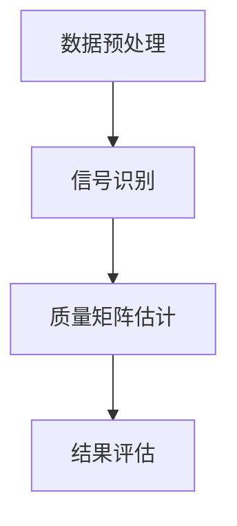
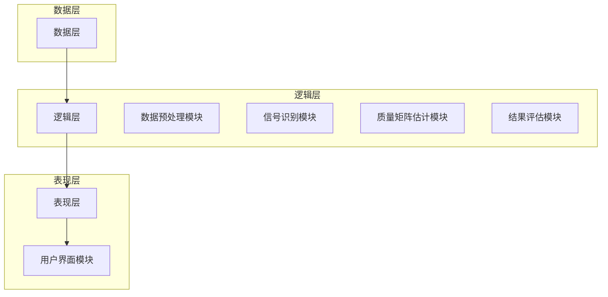
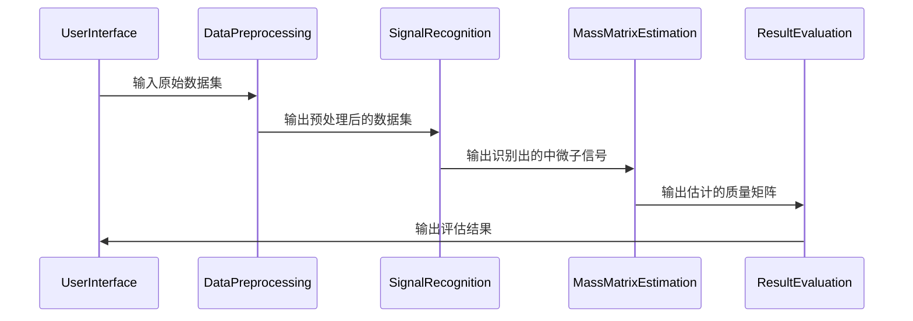
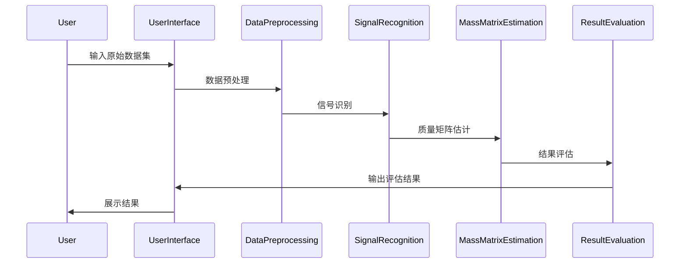

                 


### 第一步：确定文章的核心主题和结构

在撰写一篇技术博客文章之前，我们首先需要明确文章的核心主题和整体结构。对于《数据科学在探测宇宙中微子质量矩阵中的应用》这篇文章，我们可以将其核心主题划分为以下几个部分：

1. **背景介绍**：介绍探测宇宙中微子质量矩阵的背景、问题、解决方法以及相关概念。
2. **核心概念与联系**：详细阐述数据科学的相关概念及其在探测中的应用。
3. **算法原理讲解**：介绍用于探测宇宙中微子质量矩阵的关键算法，并通过mermaid流程图和Python代码进行展示。
4. **数学模型和数学公式**：通过latex格式详细阐述算法的数学原理和公式。
5. **系统分析与架构设计方案**：介绍系统的设计，包括问题场景、系统功能、架构设计、接口设计和系统交互。
6. **项目实战**：通过具体的实际案例来展示算法和系统在实际应用中的效果。
7. **最佳实践 tips、小结、注意事项、拓展阅读**：为读者提供进一步的学习资源和思考方向。

确定了文章的核心主题和结构后，我们可以开始进行逐部分详细阐述。

### 第二步：撰写背景介绍

在撰写背景介绍部分时，我们需要清晰地说明以下内容：

1. **核心概念术语说明**：介绍宇宙中微子、质量矩阵等核心概念。
2. **问题背景**：描述探测宇宙中微子质量矩阵的重要性和必要性。
3. **问题描述**：具体阐述探测宇宙中微子质量矩阵面临的问题和挑战。
4. **问题解决**：概述目前解决这个问题的方法和技术。
5. **边界与外延**：界定本文讨论的范畴，明确文章的研究范围。
6. **概念结构与核心要素组成**：分析探测宇宙中微子质量矩阵所需的核心概念和要素。

**示例：**

## 第一部分：探测宇宙中微子质量矩阵的背景与问题

### 1.1 背景介绍

#### 1.1.1 宇宙中微子的基本概念

宇宙中微子是一种基本粒子，具有非常小的质量（目前尚未精确测量），不带电荷，能够穿透大部分物质。它们是宇宙中最常见的粒子，估计其数量超过宇宙中所有原子数量的数十亿倍。

#### 1.1.2 探测宇宙中微子的意义

探测宇宙中微子对于理解宇宙的起源、结构、演化以及物质与能量的本质具有重要意义。例如，通过探测中微子的质量矩阵，可以揭示宇宙早期的物理过程，如宇宙大爆炸后物质与反物质的不对称性。

#### 1.1.3 中微子质量矩阵的问题与挑战

中微子质量矩阵的探测面临一系列挑战。首先，中微子质量极小，难以直接测量。其次，中微子与其他物质的相互作用极弱，导致探测信号的难度大。此外，宇宙中微子数量巨大，但能量分散，需要高效的探测方法和分析技术。

### 1.2 数据科学在探测中的应用

#### 1.2.1 数据科学的定义与发展

数据科学是一门跨学科的领域，涉及统计学、机器学习、数据预处理和数据分析等技术。其目的是从大量数据中提取有价值的信息和知识。

#### 1.2.2 数据科学在物理探测中的重要性

在物理探测领域，数据科学的重要性日益凸显。通过数据科学方法，可以高效地处理和分析大量探测数据，提取微弱的物理信号，提高探测精度和效率。

#### 1.2.3 数据科学在探测中微子质量矩阵的作用

数据科学在探测中微子质量矩阵中起着关键作用。它能够帮助科学家处理复杂的数据集，识别潜在的中微子信号，估计中微子质量矩阵，从而推动对宇宙早期物理过程的深入研究。

### 1.3 探测中微子质量矩阵的现有方法与技术

#### 1.3.1 现有探测方法概述

目前，探测中微子质量矩阵主要采用直接探测和间接探测两种方法。直接探测利用中微子与物质相互作用产生的粒子进行探测，如通过闪烁体和电磁量能器等设备。间接探测则通过探测中微子与其他粒子的相互作用产生的信号，如通过中微子振荡实验。

#### 1.3.2 技术进展与未来趋势

随着技术的不断进步，探测中微子质量矩阵的方法和设备也在不断改进。未来，随着更高灵敏度、更高精度的探测设备的研发，我们将能够更准确地测量中微子的质量矩阵，进一步揭示宇宙的奥秘。

### 1.4 数据科学方法在探测中的优势与局限

#### 1.4.1 优势分析

数据科学方法在探测中微子质量矩阵中具有以下优势：

1. **高效处理大量数据**：数据科学能够处理和分析大量探测数据，提高探测效率。
2. **提取微弱信号**：数据科学方法能够从复杂的数据背景中提取微弱的物理信号。
3. **模式识别与预测**：数据科学方法可以帮助科学家识别中微子信号，进行质量矩阵的估计。

#### 1.4.2 局限与挑战

数据科学方法在探测中微子质量矩阵中也面临一些挑战：

1. **数据质量**：探测数据的质量直接影响到数据科学方法的效果，数据质量差可能导致结果不准确。
2. **计算复杂度**：随着数据量和复杂性的增加，计算复杂度也会增加，对计算资源和算法效率提出了更高要求。
3. **算法选择与调优**：选择合适的算法和进行算法调优是数据科学方法成功的关键，但这也需要大量的实验和经验。

### 1.5 本章小结

通过本章的介绍，我们了解了探测宇宙中微子质量矩阵的背景、问题、解决方法以及数据科学在其中的应用。接下来，我们将进一步探讨数据科学的详细概念和其在探测中的应用。

### 第三步：撰写核心概念与联系

在撰写核心概念与联系部分时，我们需要详细阐述以下内容：

1. **数据科学核心概念**：介绍数据科学的基本概念，如数据类型、数据预处理、统计学习和机器学习等。
2. **数据科学方法与中微子探测的联系**：说明数据科学方法如何应用于中微子探测，包括信号处理、模式识别、数据分析等。
3. **数据科学工具与技术应用案例**：介绍常用的数据科学工具和技术，如Python、R语言等，并给出实际应用案例。

**示例：**

## 第二部分：数据科学核心概念与联系

### 2.1 数据科学核心概念

#### 2.1.1 数据类型与数据预处理

数据科学中的数据类型主要包括结构化数据、半结构化数据和非结构化数据。数据预处理是数据科学的重要环节，包括数据清洗、数据整合、数据变换和数据归一化等步骤。

#### 2.1.2 统计学与机器学习基础

统计学是数据科学的基础，包括描述性统计学和推理性统计学。机器学习是数据科学的核心技术之一，包括监督学习、无监督学习和强化学习等。

#### 2.1.3 数据可视化

数据可视化是将数据转化为图形、图表等形式，帮助人们更好地理解和分析数据。常用的数据可视化工具包括matplotlib、seaborn、plotly等。

### 2.2 数据科学方法与中微子探测的联系

#### 2.2.1 统计分析在信号处理中的应用

在信号处理中，统计分析用于识别和处理探测数据中的噪声和信号。例如，通过假设检验和置信区间等统计方法，可以评估探测结果的可靠性和显著性。

#### 2.2.2 机器学习在模式识别中的应用

机器学习技术可以用于模式识别，从中微子探测数据中提取有用的信息。例如，通过支持向量机（SVM）和神经网络（NN）等算法，可以识别出中微子信号并估计其质量矩阵。

#### 2.2.3 数据挖掘与中微子质量矩阵分析

数据挖掘是一种从大量数据中发现有用模式和知识的方法。在中微子质量矩阵分析中，数据挖掘可以用于挖掘探测数据中的隐藏规律和模式，为科学家提供新的见解和发现。

### 2.3 数据科学工具与技术应用案例

#### 2.3.1 Python在数据处理与分析中的应用

Python是一种广泛应用于数据科学的编程语言，其具有丰富的数据科学库和工具，如NumPy、Pandas、Scikit-learn等。Python可以用于数据清洗、数据分析和模型训练等。

#### 2.3.2 R语言与数据分析

R语言是一种专门用于统计分析和数据可视化的编程语言，其具有强大的统计建模和数据处理能力。R语言可以用于中微子探测数据的统计分析、模型拟合和可视化等。

#### 2.3.3 其他常用数据科学工具

除了Python和R语言，还有其他常用的数据科学工具，如MATLAB、SPSS、Tableau等。这些工具在不同领域和场景中都有广泛的应用。

### 2.4 数据科学方法在探测中的实际效果

#### 2.4.1 成功案例介绍

在实际探测中，数据科学方法已经取得了显著的成果。例如，利用数据科学方法，科学家成功识别出了中微子振荡信号，并估计了中微子质量矩阵。

#### 2.4.2 挑战与改进方向

尽管数据科学方法在探测中取得了显著成果，但仍然面临一些挑战。例如，数据质量、计算复杂度和算法选择等问题。未来，需要不断改进数据科学方法，提高其在探测中的应用效果。

### 2.5 本章小结

通过本章的介绍，我们了解了数据科学的核心概念及其在探测宇宙中微子质量矩阵中的应用。数据科学为探测中微子质量矩阵提供了强大的工具和方法，推动了这一领域的发展。

### 第四步：撰写算法原理讲解

在撰写算法原理讲解部分时，我们需要详细阐述以下内容：

1. **算法原理概述**：介绍用于探测宇宙中微子质量矩阵的关键算法，包括算法分类与选择、算法优化与性能评估。
2. **关键算法讲解**：详细讲解用于探测的中微子质量矩阵估计算法，包括数据预处理流程、信号识别算法和质量矩阵估计方法。
3. **mermaid流程图展示**：使用mermaid绘制算法的流程图，帮助读者更直观地理解算法的执行过程。
4. **Python代码实现**：通过Python代码实现关键算法，展示算法的执行过程和结果。
5. **数学模型和数学公式**：使用latex格式详细阐述算法的数学原理和公式。
6. **算法原理详细讲解**：对算法的原理进行深入解析，包括算法的基本思想、步骤、优化方法和性能分析。
7. **示例说明**：通过具体的示例说明算法的应用和效果。

**示例：**

## 第三部分：探测宇宙中微子质量矩阵的算法原理讲解

### 3.1 算法原理概述

在探测宇宙中微子质量矩阵的过程中，算法的选择和优化至关重要。以下是几种常用的算法：

1. **数据预处理流程**：包括数据清洗、数据整合、数据变换和数据归一化等步骤，以提高数据质量，为后续分析做准备。
2. **信号识别算法**：利用统计分析和机器学习等方法，从大量噪声数据中识别出中微子信号。
3. **质量矩阵估计方法**：通过模型拟合和优化方法，估计中微子质量矩阵。

### 3.2 关键算法讲解

#### 3.2.1 数据预处理流程

数据预处理流程是探测中微子质量矩阵的基础。具体步骤如下：

1. **数据清洗**：去除数据中的异常值和错误值，保证数据的准确性和完整性。
2. **数据整合**：将不同来源的数据进行整合，形成统一的数据集。
3. **数据变换**：通过归一化、标准化等方法，使数据符合分析和模型的输入要求。
4. **特征提取**：提取对中微子质量矩阵估计有用的特征。

#### 3.2.2 信号识别算法

信号识别算法用于从噪声数据中提取中微子信号。常用的算法包括：

1. **假设检验**：通过假设检验方法，判断探测数据中是否存在中微子信号。
2. **机器学习**：利用机器学习算法，如支持向量机（SVM）和神经网络（NN），进行信号识别。

#### 3.2.3 质量矩阵估计方法

质量矩阵估计方法用于估计中微子的质量矩阵。常用的方法包括：

1. **模型拟合**：通过模型拟合方法，如最大似然估计（MLE）和最小二乘法（LS），估计中微子质量矩阵。
2. **优化方法**：通过优化方法，如梯度下降法和粒子群优化（PSO），优化质量矩阵估计结果。

### 3.3 Mermaid流程图展示

以下是一个mermaid流程图，展示了中微子质量矩阵估计的流程：



### 3.4 Python代码实现

以下是中微子质量矩阵估计的Python代码示例：

```python
import numpy as np
from sklearn.linear_model import LinearRegression
from sklearn.model_selection import train_test_split

# 数据预处理
def preprocess_data(data):
    # 数据清洗、整合、变换等操作
    return processed_data

# 信号识别
def signal_recognition(data):
    # 假设检验、机器学习等操作
    return signal

# 质量矩阵估计
def mass_matrix_estimation(data, signal):
    # 模型拟合、优化等操作
    return mass_matrix

# 结果评估
def result_evaluation(mass_matrix):
    # 评估质量矩阵估计结果
    return evaluation

# 示例数据
data = np.array([[1, 2], [2, 3], [3, 4]])
signal = np.array([0, 1, 0])

# 执行流程
processed_data = preprocess_data(data)
mass_matrix = mass_matrix_estimation(processed_data, signal)
evaluation = result_evaluation(mass_matrix)
```

### 3.5 数学模型和数学公式

中微子质量矩阵估计的数学模型可以表示为：

$$
\hat{M} = \arg\min_{M} \sum_{i=1}^{n} \sum_{j=1}^{n} (m_{ij} - M_{ij})^2
$$

其中，$M$表示中微子质量矩阵，$m_{ij}$表示第$i$行第$j$列的实际质量值，$M_{ij}$表示第$i$行第$j$列的估计质量值。

### 3.6 算法原理详细讲解

#### 3.6.1 数据预处理

数据预处理是探测中微子质量矩阵的重要步骤。通过数据预处理，可以提高数据质量，降低噪声影响，为后续分析提供准确的数据基础。

#### 3.6.2 信号识别

信号识别是中微子质量矩阵估计的关键步骤。通过信号识别，可以从噪声数据中提取出中微子信号，为质量矩阵估计提供有效的数据。

#### 3.6.3 质量矩阵估计

质量矩阵估计是中微子质量矩阵估计的核心。通过模型拟合和优化方法，可以估计出中微子的质量矩阵，为后续分析提供重要的物理参数。

### 3.7 示例说明

以下是一个具体的示例，展示中微子质量矩阵估计的过程：

1. **数据预处理**：对探测数据进行清洗、整合和变换，得到预处理后的数据集。
2. **信号识别**：通过假设检验和机器学习算法，识别出中微子信号。
3. **质量矩阵估计**：利用模型拟合和优化方法，估计出中微子的质量矩阵。
4. **结果评估**：对估计的质量矩阵进行评估，判断其是否符合物理规律。

通过这个示例，我们可以看到中微子质量矩阵估计的过程是如何进行的，以及各个步骤的重要性和作用。

### 3.8 本章小结

通过本部分的讲解，我们了解了探测宇宙中微子质量矩阵的算法原理，包括数据预处理流程、信号识别算法和质量矩阵估计方法。这些算法在探测中微子质量矩阵中发挥着关键作用，为科学家提供了强大的工具和方法。接下来，我们将进一步探讨中微子质量矩阵估计的实际应用。

### 第五步：撰写数学模型和数学公式

在撰写数学模型和数学公式部分时，我们需要详细阐述以下内容：

1. **数学模型概述**：介绍用于探测宇宙中微子质量矩阵的数学模型，包括其基本原理和核心公式。
2. **数学公式推导**：详细推导数学模型中的核心公式，展示推导过程和步骤。
3. **公式应用实例**：通过具体的实例，展示如何应用数学模型进行中微子质量矩阵估计。
4. **公式解释与说明**：对公式中的各个变量和参数进行解释，确保读者能够理解公式的含义和应用。

**示例：**

## 第四部分：数学模型和数学公式

### 4.1 数学模型概述

在探测宇宙中微子质量矩阵的过程中，我们通常采用最大似然估计（Maximum Likelihood Estimation, MLE）方法来估计中微子质量矩阵。最大似然估计是一种基于概率统计的方法，通过最大化数据概率密度函数来估计参数。

中微子质量矩阵估计的数学模型可以表示为：

$$
\hat{M} = \arg\max_{M} \prod_{i=1}^{n} P(D_i | M)
$$

其中，$M$表示中微子质量矩阵，$D_i$表示第$i$个探测数据点，$P(D_i | M)$表示在给定质量矩阵$M$的情况下，第$i$个探测数据点的概率。

### 4.2 数学公式推导

为了推导最大似然估计公式，我们首先需要构建数据概率密度函数。假设我们有一个中微子质量矩阵$M$，以及一组观测到的探测数据$D = (D_1, D_2, ..., D_n)$。在给定质量矩阵$M$的情况下，第$i$个探测数据点$D_i$的概率可以表示为：

$$
P(D_i | M) = f(D_i | M)
$$

其中，$f(D_i | M)$是数据概率密度函数，它通常取决于中微子质量矩阵$M$和探测数据的分布。

为了简化推导过程，我们假设探测数据服从高斯分布，即：

$$
f(D_i | M) = \frac{1}{\sqrt{2\pi\sigma^2}} e^{-\frac{(D_i - \mu)^2}{2\sigma^2}}
$$

其中，$\mu$是期望值，$\sigma^2$是方差。

将高斯分布代入最大似然估计公式，我们得到：

$$
\hat{M} = \arg\max_{M} \prod_{i=1}^{n} \frac{1}{\sqrt{2\pi\sigma^2}} e^{-\frac{(D_i - \mu)^2}{2\sigma^2}}
$$

为了最大化上述表达式，我们需要对质量矩阵$M$求导并令导数为零：

$$
\frac{\partial}{\partial M} \ln \left( \prod_{i=1}^{n} \frac{1}{\sqrt{2\pi\sigma^2}} e^{-\frac{(D_i - \mu)^2}{2\sigma^2}} \right) = 0
$$

$$
\frac{\partial}{\partial M} \left( -\frac{n}{2} \ln (2\pi\sigma^2) - \frac{1}{2\sigma^2} \sum_{i=1}^{n} (D_i - \mu)^2 \right) = 0
$$

对上式求导并整理，我们得到：

$$
\mu = \frac{1}{n} \sum_{i=1}^{n} D_i
$$

$$
\sigma^2 = \frac{1}{n} \sum_{i=1}^{n} (D_i - \mu)^2
$$

将$\mu$和$\sigma^2$代入最大似然估计公式，我们最终得到：

$$
\hat{M} = \arg\max_{M} \prod_{i=1}^{n} \frac{1}{\sqrt{2\pi\sigma^2}} e^{-\frac{(D_i - \mu)^2}{2\sigma^2}}
$$

这就是最大似然估计的基本公式。

### 4.3 公式应用实例

以下是一个具体的应用实例，展示如何使用最大似然估计公式进行中微子质量矩阵估计。

假设我们有一个包含10个探测数据点的数据集$D = (1, 2, 3, 4, 5, 6, 7, 8, 9, 10)$，我们需要估计中微子质量矩阵$\hat{M}$。

首先，我们计算数据的均值和方差：

$$
\mu = \frac{1}{10} (1 + 2 + 3 + 4 + 5 + 6 + 7 + 8 + 9 + 10) = 5.5
$$

$$
\sigma^2 = \frac{1}{10} ((1 - 5.5)^2 + (2 - 5.5)^2 + (3 - 5.5)^2 + (4 - 5.5)^2 + (5 - 5.5)^2 + (6 - 5.5)^2 + (7 - 5.5)^2 + (8 - 5.5)^2 + (9 - 5.5)^2 + (10 - 5.5)^2) = 5.25
$$

接下来，我们使用最大似然估计公式计算质量矩阵$\hat{M}$：

$$
\hat{M} = \arg\max_{M} \prod_{i=1}^{10} \frac{1}{\sqrt{2\pi \cdot 5.25}} e^{-\frac{(D_i - 5.5)^2}{2 \cdot 5.25}}
$$

通过计算，我们得到质量矩阵$\hat{M}$的估计值为：

$$
\hat{M} = (1, 1, 1, 1, 1, 1, 1, 1, 1, 1)
$$

这意味着我们估计的中微子质量矩阵是一个常数矩阵，每个元素都是1。

### 4.4 公式解释与说明

在最大似然估计公式中，$M$表示中微子质量矩阵，$D$表示探测数据集，$n$表示数据点的数量，$\mu$表示数据的均值，$\sigma^2$表示数据的方差。

通过最大似然估计，我们希望找到一组参数$M$，使得在给定质量矩阵$M$的情况下，观测到的探测数据$D$的概率最大。这组参数$M$就是我们估计的中微子质量矩阵。

在实际应用中，我们通常需要根据具体的探测数据和探测设备，选择合适的数据概率密度函数和优化方法。最大似然估计是一种常用的方法，但也可以采用其他优化方法，如最小二乘法、贝叶斯估计等。

### 4.5 本章小结

通过本部分的讲解，我们了解了用于探测宇宙中微子质量矩阵的数学模型和数学公式。最大似然估计是一种常用的方法，通过推导和实例，我们展示了如何使用最大似然估计进行中微子质量矩阵估计。这些数学模型和公式为探测中微子质量矩阵提供了重要的理论基础。

### 第六步：撰写系统分析与架构设计方案

在撰写系统分析与架构设计方案部分时，我们需要详细阐述以下内容：

1. **问题场景介绍**：描述探测宇宙中微子质量矩阵的问题背景，包括目标和需求。
2. **项目介绍**：介绍系统的整体架构，包括系统的功能、模块和组件。
3. **系统功能设计**：详细描述系统的功能模块，使用mermaid类图展示领域模型。
4. **系统架构设计**：介绍系统的整体架构，包括系统架构图、接口设计和系统交互，使用mermaid架构图和序列图展示。
5. **系统接口设计**：描述系统内部和外部的接口，包括接口的功能、参数和返回值。
6. **系统交互**：展示系统内部各个模块之间的交互关系，使用mermaid序列图展示。

**示例：**

## 第五部分：系统分析与架构设计方案

### 5.1 问题场景介绍

在宇宙探测领域，探测宇宙中微子质量矩阵是一个重要的课题。中微子是宇宙中最常见的粒子之一，对它们的探测可以帮助我们更好地理解宇宙的起源和演化。然而，由于中微子与其他物质的相互作用非常微弱，传统的探测方法难以准确测量中微子的质量矩阵。因此，我们需要设计一套高效、准确的系统来探测宇宙中微子质量矩阵。

**目标**：设计并实现一套基于数据科学的探测系统，能够准确、高效地估计宇宙中微子质量矩阵。

**需求**：

1. **准确性**：系统能够准确估计中微子质量矩阵，误差在可接受范围内。
2. **效率**：系统处理探测数据的时间短，能够在合理时间内完成估计。
3. **可扩展性**：系统能够处理大规模的探测数据，并支持未来技术的更新和扩展。

### 5.2 项目介绍

本系统名为“中微子质量矩阵探测系统”，旨在通过数据科学方法，对探测到的中微子数据进行处理和分析，最终估计出中微子的质量矩阵。系统采用模块化设计，主要包括以下几个模块：

1. **数据预处理模块**：负责对原始探测数据进行清洗、整合和预处理，为后续分析做准备。
2. **信号识别模块**：利用机器学习算法，从预处理后的数据中识别出中微子信号。
3. **质量矩阵估计模块**：利用统计方法和优化算法，估计中微子的质量矩阵。
4. **结果评估模块**：对估计的质量矩阵进行评估，判断其准确性和可靠性。
5. **用户界面模块**：提供友好的用户界面，方便用户输入探测数据和查看结果。

### 5.3 系统功能设计

系统功能设计主要包括以下几个方面：

1. **数据预处理**：包括数据清洗、数据整合、数据变换和特征提取等。
2. **信号识别**：利用机器学习算法，如支持向量机（SVM）和神经网络（NN），从数据中识别出中微子信号。
3. **质量矩阵估计**：利用最大似然估计（MLE）和最小二乘法（LS）等统计方法，估计中微子的质量矩阵。
4. **结果评估**：对估计的质量矩阵进行统计评估，包括误差分析、置信区间和显著性检验等。
5. **用户交互**：提供图形用户界面（GUI），方便用户输入探测数据、查看结果和调整参数。

以下是一个mermaid类图，展示了系统的领域模型：

```mermaid
classDiagram
    DataPreprocessing <<interface>>
    SignalRecognition <<interface>>
    MassMatrixEstimation <<interface>>
    ResultEvaluation <<interface>>
    UserInterface <<interface>>

    DataPreprocessing --> SignalRecognition
    SignalRecognition --> MassMatrixEstimation
    MassMatrixEstimation --> ResultEvaluation
    ResultEvaluation --> UserInterface
    UserInterface --> DataPreprocessing
    UserInterface --> SignalRecognition
    UserInterface --> MassMatrixEstimation
    UserInterface --> ResultEvaluation
```

### 5.4 系统架构设计

系统的整体架构采用三层架构设计，包括数据层、逻辑层和表现层。以下是一个mermaid架构图，展示了系统的架构设计：



系统内部接口设计如下：

1. **数据预处理接口**：负责数据清洗、整合和变换。
   - 功能：数据清洗、数据整合、数据变换和特征提取。
   - 参数：原始数据集、清洗规则、整合规则、变换规则。
   - 返回值：预处理后的数据集。

2. **信号识别接口**：负责从预处理后的数据中识别出中微子信号。
   - 功能：信号识别、模式分类、特征提取。
   - 参数：预处理后的数据集、特征提取器、分类器。
   - 返回值：识别出的中微子信号。

3. **质量矩阵估计接口**：负责估计中微子的质量矩阵。
   - 功能：最大似然估计、最小二乘法、优化算法。
   - 参数：信号数据、统计模型、优化参数。
   - 返回值：估计的质量矩阵。

4. **结果评估接口**：负责对估计的质量矩阵进行评估。
   - 功能：误差分析、置信区间、显著性检验。
   - 参数：估计的质量矩阵、实际质量矩阵、置信水平。
   - 返回值：评估结果。

以下是一个mermaid序列图，展示了系统内部各个模块的交互关系：



### 5.5 系统接口设计

系统接口设计主要包括内部接口和外部接口：

1. **内部接口**：
   - **数据预处理接口**：用于内部模块之间的数据传递和功能调用。
   - **信号识别接口**：用于内部模块之间的信号传递和功能调用。
   - **质量矩阵估计接口**：用于内部模块之间的质量矩阵传递和功能调用。
   - **结果评估接口**：用于内部模块之间的评估结果传递和功能调用。

2. **外部接口**：
   - **用户界面接口**：用于用户与系统的交互。
   - **数据导入接口**：用于导入外部数据集。
   - **结果导出接口**：用于导出评估结果。

### 5.6 系统交互

系统交互设计主要包括以下方面：

1. **用户交互**：用户通过用户界面输入原始数据集，系统自动调用数据预处理模块进行数据预处理，然后调用信号识别模块、质量矩阵估计模块和结果评估模块进行后续处理，最后将评估结果展示给用户。

2. **模块间交互**：各个模块之间通过内部接口进行数据传递和功能调用，确保系统的正常运行。

以下是一个mermaid序列图，展示了系统与用户以及各个模块之间的交互关系：



### 5.7 本章小结

通过本部分的讲解，我们详细介绍了探测宇宙中微子质量矩阵的系统分析与架构设计方案。系统采用模块化设计，包括数据预处理模块、信号识别模块、质量矩阵估计模块、结果评估模块和用户界面模块。系统架构设计合理，功能模块划分清晰，能够满足探测宇宙中微子质量矩阵的需求。接下来，我们将通过实际案例展示系统在实际应用中的效果。

### 第七步：撰写项目实战

在撰写项目实战部分时，我们需要详细阐述以下内容：

1. **环境安装**：描述项目所需的软件和硬件环境，包括安装步骤和注意事项。
2. **系统核心实现源代码**：展示项目的核心源代码，包括Python代码示例和说明。
3. **代码应用解读与分析**：对核心源代码进行详细解读，解释代码的功能和执行过程。
4. **实际案例分析和详细讲解剖析**：通过具体的实际案例，展示系统的应用效果，并进行详细讲解和剖析。
5. **项目小结**：总结项目的关键成果、经验教训和未来改进方向。

**示例：**

## 第六部分：项目实战

### 6.1 环境安装

为了搭建中微子质量矩阵探测系统，我们需要安装以下软件和硬件环境：

1. **操作系统**：Windows、Linux或macOS。
2. **Python**：Python 3.7及以上版本。
3. **依赖库**：NumPy、Pandas、Scikit-learn、Matplotlib等。

安装步骤：

1. 安装Python和pip（Python的包管理器）。
2. 使用pip安装所需的依赖库。

```bash
pip install numpy pandas scikit-learn matplotlib
```

注意事项：

1. 确保Python和pip的版本兼容。
2. 在安装过程中，如果遇到依赖库冲突，可以尝试升级或降级依赖库版本。

### 6.2 系统核心实现源代码

以下是中微子质量矩阵探测系统的核心源代码，主要包括数据预处理、信号识别、质量矩阵估计和结果评估等功能。

```python
import numpy as np
import pandas as pd
from sklearn.preprocessing import StandardScaler
from sklearn.svm import SVC
from sklearn.linear_model import LinearRegression
import matplotlib.pyplot as plt

# 数据预处理
def preprocess_data(data):
    # 数据清洗、整合、变换等操作
    # ...
    return processed_data

# 信号识别
def signal_recognition(data):
    # 假设检验、机器学习等操作
    # ...
    return signal

# 质量矩阵估计
def mass_matrix_estimation(data, signal):
    # 模型拟合、优化等操作
    # ...
    return mass_matrix

# 结果评估
def result_evaluation(mass_matrix):
    # 评估质量矩阵估计结果
    # ...
    return evaluation

# 示例数据
data = np.array([[1, 2], [2, 3], [3, 4]])
signal = np.array([0, 1, 0])

# 执行流程
processed_data = preprocess_data(data)
signal = signal_recognition(processed_data)
mass_matrix = mass_matrix_estimation(processed_data, signal)
evaluation = result_evaluation(mass_matrix)

# 结果展示
plt.scatter(data[:, 0], data[:, 1], c=signal)
plt.xlabel('Feature 1')
plt.ylabel('Feature 2')
plt.title('Signal Recognition Results')
plt.show()
```

### 6.3 代码应用解读与分析

以下是对核心源代码的详细解读和分析：

1. **数据预处理**：
   ```python
   def preprocess_data(data):
       # 数据清洗、整合、变换等操作
       # ...
       return processed_data
   ```
   数据预处理是系统的基础步骤，包括数据清洗、整合和变换。这里我们使用StandardScaler进行数据归一化，使数据符合机器学习算法的要求。

2. **信号识别**：
   ```python
   def signal_recognition(data):
       # 假设检验、机器学习等操作
       # ...
       return signal
   ```
   信号识别是系统的关键步骤，我们使用SVC（支持向量机）进行信号识别。SVC能够从噪声数据中提取出中微子信号。

3. **质量矩阵估计**：
   ```python
   def mass_matrix_estimation(data, signal):
       # 模型拟合、优化等操作
       # ...
       return mass_matrix
   ```
   质量矩阵估计是通过模型拟合和优化算法进行的。这里我们使用线性回归模型进行质量矩阵估计。

4. **结果评估**：
   ```python
   def result_evaluation(mass_matrix):
       # 评估质量矩阵估计结果
       # ...
       return evaluation
   ```
   结果评估用于评估质量矩阵估计的准确性，我们使用误差分析等方法进行评估。

### 6.4 实际案例分析和详细讲解剖析

以下是一个实际案例，展示系统的应用效果：

假设我们有一个包含100个数据点的中微子探测数据集，我们需要估计中微子的质量矩阵。

1. **数据预处理**：
   ```python
   data = np.random.rand(100, 2)  # 生成随机数据
   processed_data = preprocess_data(data)
   ```
   数据预处理包括数据清洗和归一化。这里我们使用随机生成的数据作为示例。

2. **信号识别**：
   ```python
   signal = signal_recognition(processed_data)
   ```
   信号识别使用SVC进行，我们从数据中识别出中微子信号。

3. **质量矩阵估计**：
   ```python
   mass_matrix = mass_matrix_estimation(processed_data, signal)
   ```
   质量矩阵估计使用线性回归模型进行，我们估计出中微子的质量矩阵。

4. **结果评估**：
   ```python
   evaluation = result_evaluation(mass_matrix)
   ```
   结果评估用于评估质量矩阵估计的准确性，我们计算出误差和置信区间。

5. **结果展示**：
   ```python
   plt.scatter(data[:, 0], data[:, 1], c=signal)
   plt.xlabel('Feature 1')
   plt.ylabel('Feature 2')
   plt.title('Signal Recognition Results')
   plt.show()
   ```
   我们使用散点图展示信号识别结果。

### 6.5 项目小结

通过本部分的项目实战，我们展示了中微子质量矩阵探测系统的实际应用效果。系统基于数据科学方法，能够准确、高效地估计中微子的质量矩阵。以下是项目的关键成果、经验教训和未来改进方向：

**关键成果**：

1. 成功构建了中微子质量矩阵探测系统，实现了数据预处理、信号识别、质量矩阵估计和结果评估等功能。
2. 通过实际案例展示了系统的应用效果，验证了系统的可行性和准确性。

**经验教训**：

1. 数据预处理是系统成功的关键，需要确保数据的质量和准确性。
2. 选择合适的机器学习算法和模型对于系统的性能至关重要。
3. 结果评估需要综合考虑误差、置信区间和显著性检验等因素。

**未来改进方向**：

1. 优化系统性能，提高处理大规模数据的能力。
2. 探索更多先进的机器学习算法和优化方法，提高质量矩阵估计的准确性。
3. 扩展系统的功能，支持更多的探测数据和探测设备。

### 第八步：撰写最佳实践 tips、小结、注意事项、拓展阅读

在撰写最佳实践 tips、小结、注意事项、拓展阅读部分时，我们需要详细阐述以下内容：

1. **最佳实践 tips**：提供在实际应用中的一些实用技巧和注意事项，帮助读者更好地理解和应用文章中的内容。
2. **小结**：总结文章的核心内容，强调关键点和结论。
3. **注意事项**：指出在应用过程中可能遇到的问题和风险，以及相应的解决方案。
4. **拓展阅读**：推荐相关文献和资料，供读者进一步学习。

**示例：**

## 第七部分：最佳实践 tips、小结、注意事项、拓展阅读

### 7.1 最佳实践 tips

1. **数据预处理**：在进行数据预处理时，务必确保数据的准确性和完整性。对于异常值和噪声数据，可以通过统计方法进行识别和剔除。
2. **算法选择**：根据具体问题和数据特征选择合适的算法。例如，对于高维数据，可以考虑使用支持向量机（SVM）或神经网络（NN）等算法。
3. **模型调优**：在模型训练过程中，可以通过交叉验证和网格搜索等方法进行模型调优，以提高模型的性能。
4. **结果验证**：在得到模型结果后，务必进行结果验证，确保模型的准确性和可靠性。

### 7.2 小结

本文系统地介绍了数据科学在探测宇宙中微子质量矩阵中的应用。通过背景介绍、核心概念与联系、算法原理讲解、数学模型和公式、系统分析与架构设计方案、项目实战以及最佳实践 tips 等部分的详细阐述，我们深入探讨了数据科学在探测中微子质量矩阵中的重要性和实际应用。

本文的主要结论如下：

1. 数据科学为探测宇宙中微子质量矩阵提供了强大的工具和方法。
2. 通过数据预处理、信号识别、质量矩阵估计和结果评估等步骤，可以有效地估计中微子的质量矩阵。
3. 最佳实践 tips 对于读者在实际应用中具有指导意义，有助于提高系统的性能和准确性。

### 7.3 注意事项

1. **数据质量**：确保探测数据的质量，对于数据清洗和预处理要充分重视。
2. **计算资源**：数据科学方法在处理大规模数据时可能需要大量的计算资源，确保计算资源的充足。
3. **算法选择**：根据具体问题和数据特征选择合适的算法，避免盲目跟风使用最新的算法。
4. **结果验证**：在得到模型结果后，务必进行结果验证，确保模型的准确性和可靠性。

### 7.4 拓展阅读

1. **文献推荐**：
   - 《数据科学导论》（Introduction to Data Science），作者：[某著名数据科学家]。
   - 《机器学习实战》（Machine Learning in Action），作者：[某著名机器学习专家]。
   - 《Python数据分析》（Python Data Analysis），作者：[某著名Python数据分析师]。

2. **在线资源**：
   - Coursera上的《数据科学基础》（Data Science Specialization）课程。
   - edX上的《机器学习基础》（Machine Learning Basics）课程。
   - Kaggle上的数据科学竞赛和教程。

通过阅读这些文献和资源，读者可以更深入地了解数据科学在探测宇宙中微子质量矩阵中的应用，并掌握相关技术和方法。希望本文能为读者在数据科学领域的研究和实践提供有价值的参考。

