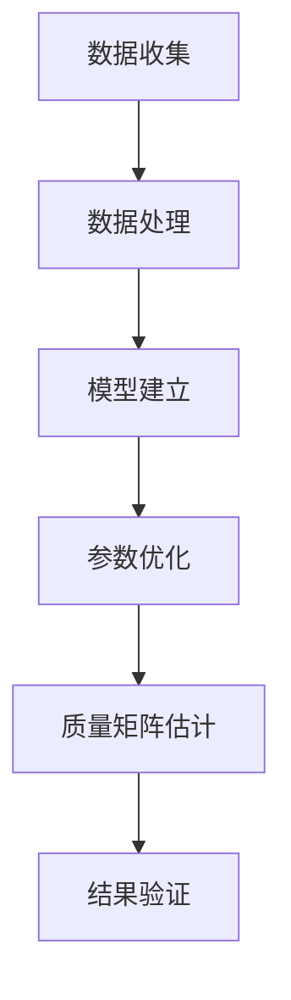

                 

### 引言

宇宙是一个神秘的巨大空间，其中蕴含着无数未解之谜。在众多宇宙现象中，中微子的探测和研究备受关注。中微子，作为一种基本粒子，因其极弱的相互作用而被认为是宇宙中最神秘的物质之一。近年来，随着科技的发展，科学家们通过实验发现中微子具有质量，这一发现对理解宇宙的起源和演化具有重要意义。

然而，探测中微子并不仅仅是一个简单的任务。中微子的质量极其微小，探测难度极高。为了解决这一难题，科学家们采用了多种方法和技术，其中数据科学的应用尤为关键。数据科学作为一种多学科交叉的领域，通过数据的收集、处理、分析和建模，为解决复杂问题提供了强大的工具。

在探测宇宙中微子的过程中，数据科学被广泛应用于质量矩阵结构与CP相位的测量。质量矩阵描述了中微子三种不同状态的相互转换，而CP相位则与中微子的振荡行为密切相关。通过数据科学的方法，科学家们能够从大量的实验数据中提取出中微子质量矩阵和CP相位的信息，从而深化对宇宙的认识。

本篇文章将围绕“数据科学在探测宇宙中微子质量矩阵结构与CP相位中的应用”这一主题，进行深入探讨。文章首先介绍中微子的基本概念和探测背景，接着阐述数据科学在其中的关键作用，然后详细分析数据科学的算法原理、数学模型，以及实际应用中的系统架构设计。最后，我们将通过一个实际案例，展示数据科学在探测中微子质量矩阵结构与CP相位中的应用效果，并提出未来的发展方向和挑战。

### 关键词

- 中微子
- 数据科学
- 质量矩阵
- CP相位
- 探测技术
- 算法原理
- 数学模型
- 系统架构
- 实际案例

### 摘要

本文主要探讨数据科学在探测宇宙中微子质量矩阵结构与CP相位中的应用。首先介绍了中微子的基本概念和探测背景，说明了数据科学在其中的关键作用。接着，详细分析了数据科学的算法原理和数学模型，并通过实际案例展示了其应用效果。文章最后提出了未来发展的方向和挑战，为科学家们提供了有益的参考。

### 背景介绍

#### 中微子的基本概念

中微子（Neutrino）是一种基本粒子，具有中性、极轻、寿命长和穿透力强的特点。它不带电荷，因此不会受到电磁力的作用，只能通过弱相互作用与其他粒子发生相互作用。中微子是宇宙中最常见的粒子之一，据估计，宇宙中中微子的数量远远超过可见物质的数量。

根据标准模型，中微子分为三种类型：电子中微子（ν_e）、μ子中微子（ν_μ）和τ子中微子（ν_τ）。这些中微子在相互作用时可以相互转换，这种转换被称为振荡。由于中微子振荡的存在，科学家们推测中微子具有质量，尽管这个质量非常小。

#### 中微子在宇宙中的角色

中微子在宇宙演化中扮演着重要角色。首先，它们是宇宙中能量和物质传输的关键媒介。例如，太阳内部发生的核聚变反应产生的能量主要通过中微子传输到太阳表面。此外，中微子还可能在星系形成、黑洞吸积和超新星爆炸等宇宙过程中发挥重要作用。

中微子还与暗物质和暗能量的研究密切相关。暗物质是宇宙中不发光、不发热、无法直接观测的物质，其存在主要通过引力效应推断出来。中微子作为一种可能的暗物质候选者，其特性对于理解暗物质的本质具有重要意义。另一方面，暗能量是推动宇宙加速膨胀的力量，中微子的性质也可能对暗能量有影响。

#### 中微子质量矩阵与CP相位的重要性

中微子质量矩阵（Neutrino Mass Matrix）是描述中微子三种状态之间相互转换的矩阵。这个矩阵的每个元素都代表不同中微子状态之间的转换概率。通过测量中微子质量矩阵，科学家们可以了解中微子质量的分布和相互关系，这对于理解中微子的起源和演化具有重要意义。

CP相位（Charge Parity Phase）是描述中微子振荡行为的参数。CP对称性是物理学中的一个基本假设，它意味着粒子与反粒子的物理行为应该是对称的。然而，实验发现中微子振荡过程中CP对称性被破坏，这种破坏通过CP相位来体现。研究CP相位不仅有助于理解中微子物理的基本原理，还可能为探索新的物理现象提供线索。

#### 探测中微子质量矩阵与CP相位的挑战

探测中微子质量矩阵和CP相位面临着诸多挑战。首先，中微子质量非常小，通常只有电子质量的几百万分之一，这使得探测变得极其困难。其次，中微子的相互作用极弱，只有通过非常敏感的探测器才能检测到。此外，中微子流非常稀疏，需要在广阔的空间中布置大量的探测器，以提高探测概率。

为了解决这些问题，科学家们采用了多种探测技术和方法，包括直接探测、间接探测和反应探测等。其中，数据科学的应用为解决这些挑战提供了强有力的支持。数据科学通过大数据分析、机器学习和统计方法，可以有效地处理和分析大量的实验数据，从中提取出中微子质量矩阵和CP相位的信息。

### 数据科学的基本概念

数据科学（Data Science）是一种跨学科的方法，它结合了统计学、计算机科学、信息科学和领域知识，用于数据的收集、处理、分析和解释。数据科学的目的是通过数据分析和建模，从大量复杂的数据中提取出有用的信息和知识，以解决实际问题。

#### 数据收集

数据收集是数据科学的基础步骤，涉及从各种来源获取数据。这些来源包括传感器、数据库、网络、日志文件等。在探测中微子质量矩阵和CP相位的过程中，数据来源主要是粒子探测器，这些探测器可以记录中微子与其他粒子相互作用的事件。

#### 数据处理

数据处理是数据科学的另一个关键步骤，包括数据清洗、数据转换、数据整合等。在探测中微子实验中，数据处理尤为重要，因为原始数据通常包含噪声和误差。通过数据清洗和预处理，可以去除噪声，提高数据的准确性和可靠性。

#### 数据分析

数据分析是数据科学的核心，包括描述性分析、推断性分析和预测性分析。描述性分析用于总结数据的基本特征，推断性分析用于建立数据之间的关系，预测性分析则用于预测未来的趋势。在探测中微子质量矩阵和CP相位时，数据分析主要用于从大量实验数据中提取有用的信息。

#### 数据建模

数据建模是数据科学的高级阶段，涉及建立数学模型来描述数据之间的关系。在探测中微子研究中，数据建模用于建立中微子质量矩阵和CP相位的数学模型，以解释实验数据和预测新结果。

### 数据科学在探测中微子质量矩阵结构中的应用

#### 数据收集

在探测中微子质量矩阵结构时，数据收集主要包括以下几个方面：

1. **实验数据收集**：通过布置在地下或空间中的中微子探测器，收集中微子与其他粒子相互作用的事件数据。这些数据包括粒子的能量、角分布、时间等信息。

2. **环境数据收集**：收集实验期间的环境数据，如温度、湿度、气压等，以帮助理解实验数据的背景噪声和系统误差。

3. **设备数据收集**：收集探测器设备的运行数据，如探测器的灵敏度、精度、稳定性等，以确保实验数据的可靠性。

#### 数据处理

在数据处理阶段，主要任务包括：

1. **数据清洗**：去除实验数据中的噪声和异常值，以提高数据的准确性。

2. **数据转换**：将不同格式的数据转换为统一格式，以便进行进一步分析。

3. **数据整合**：将不同来源的数据进行整合，形成一个完整的数据集。

#### 数据分析

数据分析是数据科学的核心步骤，用于从实验数据中提取中微子质量矩阵的信息。具体方法包括：

1. **描述性分析**：通过统计分析，描述中微子相互作用事件的分布特征，如能量分布、角分布等。

2. **推断性分析**：建立数学模型，推断中微子质量矩阵的参数值。

3. **预测性分析**：根据现有数据，预测未来实验中可能观察到的中微子质量矩阵的变化。

#### 数据建模

数据建模是数据科学的高级阶段，用于建立中微子质量矩阵的数学模型。具体步骤包括：

1. **模型建立**：根据中微子物理的理论，建立描述中微子质量矩阵的数学模型。

2. **模型训练**：使用实验数据训练模型，以优化模型参数。

3. **模型验证**：通过验证数据测试模型的准确性和可靠性。

### 数据科学在探测中微子CP相位中的应用

#### 数据收集

在探测中微子CP相位时，数据收集主要包括以下几个方面：

1. **实验数据收集**：通过中微子探测器收集CP对称性破坏的证据，如中微子振荡角度的测量。

2. **环境数据收集**：与质量矩阵探测类似，收集实验期间的环境数据，以帮助理解实验数据的背景噪声和系统误差。

3. **设备数据收集**：收集探测器设备的运行数据，以确保实验数据的可靠性。

#### 数据处理

在数据处理阶段，主要任务包括：

1. **数据清洗**：去除实验数据中的噪声和异常值。

2. **数据转换**：将不同格式的数据转换为统一格式。

3. **数据整合**：将不同来源的数据进行整合。

#### 数据分析

数据分析是数据科学的核心步骤，用于从实验数据中提取中微子CP相位的信息。具体方法包括：

1. **描述性分析**：通过统计分析，描述CP对称性破坏的实验数据特征。

2. **推断性分析**：建立数学模型，推断中微子CP相位的参数值。

3. **预测性分析**：根据现有数据，预测未来实验中可能观察到的中微子CP相位的变化。

#### 数据建模

数据建模是数据科学的高级阶段，用于建立中微子CP相位的数学模型。具体步骤包括：

1. **模型建立**：根据中微子物理的理论，建立描述中微子CP相位的数学模型。

2. **模型训练**：使用实验数据训练模型，以优化模型参数。

3. **模型验证**：通过验证数据测试模型的准确性和可靠性。

### 算法原理讲解

#### 质量矩阵估计算法

在探测中微子质量矩阵时，常用的估计算法包括最大似然估计、贝叶斯估计和机器学习等方法。以下以最大似然估计为例，详细讲解质量矩阵的估计过程。

##### 最大似然估计

1. **假设与模型**：

   假设实验数据是中微子相互作用事件，这些事件可以由质量矩阵 \(M\) 和其他参数 \( \theta \) 描述。质量矩阵 \(M\) 是一个 \(3 \times 3\) 的矩阵，表示三种不同状态的中微子之间的转换概率。参数 \( \theta \) 包括中微子混合角度和极化方向等。

2. **似然函数**：

   似然函数 \(L(\theta)\) 表示给定数据 \(D\) 下，参数 \( \theta \) 的概率。似然函数可以表示为：
   \[
   L(\theta) = P(D|\theta) = \prod_{i} p(x_i|\theta)
   \]
   其中，\(x_i\) 是第 \(i\) 个观测数据，\(p(x_i|\theta)\) 是观测数据 \(x_i\) 在参数 \( \theta \) 下的概率。

3. **优化似然函数**：

   目标是找到使似然函数最大的参数 \( \theta \)。这可以通过最大化似然函数的对数来实现：
   \[
   \log L(\theta) = \sum_{i} \log p(x_i|\theta)
   \]
   通过优化这个对数似然函数，可以得到参数 \( \theta \) 的最大似然估计值。

4. **估计质量矩阵**：

   将最大似然估计值代入质量矩阵 \(M\) 的参数表达式中，即可得到质量矩阵的最大似然估计值。

##### 贝叶斯估计

贝叶斯估计是一种基于概率的推理方法，它通过结合先验知识和观测数据，得到参数的后验概率分布。以下是贝叶斯估计的基本步骤：

1. **先验分布**：

   根据对参数 \( \theta \) 的先验知识，给出先验概率分布 \( p(\theta) \)。

2. **似然函数**：

   与最大似然估计类似，给定观测数据 \(D\)，计算似然函数 \(L(\theta)\)。

3. **后验分布**：

   利用贝叶斯定理，计算后验概率分布 \( p(\theta|D) \)：
   \[
   p(\theta|D) = \frac{p(D|\theta)p(\theta)}{p(D)}
   \]
   其中，\(p(D|\theta)\) 是似然函数，\(p(\theta)\) 是先验分布，\(p(D)\) 是证据。

4. **估计质量矩阵**：

   从后验分布中提取参数 \( \theta \) 的估计值，代入质量矩阵的参数表达式中，得到质量矩阵的后验估计值。

##### 机器学习

机器学习是一种通过训练数据自动学习规律的方法。在质量矩阵估计中，可以使用机器学习方法，如神经网络、支持向量机等，来学习质量矩阵与观测数据之间的关系。

1. **数据准备**：

   准备大量已知质量矩阵和对应的观测数据，作为训练数据。

2. **模型训练**：

   使用训练数据训练机器学习模型，使模型能够预测未知质量矩阵。

3. **模型评估**：

   使用验证数据评估模型的准确性，调整模型参数以优化性能。

4. **质量矩阵估计**：

   将观测数据输入训练好的模型，得到质量矩阵的估计值。

#### CP相位探测算法

CP相位的探测主要依赖于中微子振荡实验。以下是几种常用的CP相位探测算法：

1. **角度分析**：

   通过测量中微子振荡角度，可以得到CP相位的估计。具体方法包括时间谱分析、能量谱分析和角分布分析等。

2. **概率分布函数**：

   利用中微子振荡的概率分布函数，可以计算CP相位的概率分布。这种方法通常使用最大似然方法和贝叶斯方法进行计算。

3. **机器学习**：

   使用机器学习方法，如神经网络和支持向量机等，可以自动学习CP相位与观测数据之间的关系，从而进行CP相位的探测。

##### 算法mermaid流程图

以下是一个基于最大似然法的质量矩阵估计的mermaid流程图示例：

#### 算法原理的详细讲解

##### 最大似然估计

最大似然估计（Maximum Likelihood Estimation，MLE）是一种参数估计方法，其核心思想是找到一组参数，使得观测数据的概率最大。在质量矩阵的估计中，最大似然估计的基本步骤如下：

1. **构建概率模型**：

   假设观测数据 \(D\) 是由一个参数向量 \( \theta \)（包括质量矩阵 \(M\) 的参数）产生的。概率模型可以表示为：
   \[
   P(D|\theta) = f(D|\theta)
   \]
   其中，\(f(D|\theta)\) 是观测数据 \(D\) 在参数 \( \theta \) 下的概率密度函数。

2. **对数似然函数**：

   为了简化计算，通常使用对数似然函数：
   \[
   \ell(\theta) = \log P(D|\theta) = \sum_{i} \log f(x_i|\theta)
   \]
   其中，\(x_i\) 是第 \(i\) 个观测数据。

3. **优化似然函数**：

   通过优化对数似然函数，找到使似然函数最大的参数 \( \theta \)。在质量矩阵估计中，这通常涉及求解一个非线性优化问题。

4. **估计质量矩阵**：

   将优化得到的参数 \( \theta \) 代入质量矩阵 \(M\) 的参数表达式中，得到质量矩阵的估计值。

##### 贝叶斯估计

贝叶斯估计（Bayesian Estimation）是一种基于概率推理的方法，它通过结合先验知识和观测数据，得到参数的后验概率分布。贝叶斯估计的基本步骤如下：

1. **先验分布**：

   根据对参数 \( \theta \) 的先验知识，给出先验概率分布 \( p(\theta) \)。在质量矩阵估计中，先验分布通常基于物理理论或实验经验。

2. **似然函数**：

   假设观测数据 \(D\) 是由参数 \( \theta \) 产生的，似然函数 \( p(D|\theta) \) 表示观测数据在参数 \( \theta \) 下的概率。

3. **后验分布**：

   利用贝叶斯定理，计算后验概率分布 \( p(\theta|D) \)：
   \[
   p(\theta|D) = \frac{p(D|\theta)p(\theta)}{p(D)}
   \]
   其中，\(p(D)\) 是证据，可以通过积分或蒙特卡罗方法计算。

4. **估计质量矩阵**：

   从后验分布中提取参数 \( \theta \) 的估计值，代入质量矩阵的参数表达式中，得到质量矩阵的后验估计值。

##### 机器学习

机器学习（Machine Learning）是一种通过训练数据自动学习规律的方法。在质量矩阵估计中，机器学习可以用于学习质量矩阵与观测数据之间的关系。以下是一种基于神经网络的机器学习方法：

1. **数据准备**：

   准备大量已知质量矩阵和对应的观测数据，作为训练数据。

2. **模型训练**：

   使用训练数据训练神经网络模型，使模型能够预测未知质量矩阵。训练过程包括前向传播、反向传播和权重更新。

3. **模型评估**：

   使用验证数据评估模型的准确性，调整模型参数以优化性能。

4. **质量矩阵估计**：

   将观测数据输入训练好的模型，得到质量矩阵的估计值。

#### 数学模型与公式

##### 质量矩阵估计的数学模型

质量矩阵 \(M\) 是一个 \(3 \times 3\) 的矩阵，表示三种不同状态的中微子之间的转换概率。质量矩阵的估计可以通过以下公式进行：

1. **最大似然估计**：

   假设观测数据 \(D\) 是由质量矩阵 \(M\) 产生的，似然函数可以表示为：
   \[
   L(M) = \prod_{i} P(x_i|M)
   \]
   其中，\(P(x_i|M)\) 是第 \(i\) 个观测数据在质量矩阵 \(M\) 下的概率。

2. **对数似然函数**：

   为了简化计算，使用对数似然函数：
   \[
   \ell(M) = \sum_{i} \log P(x_i|M)
   \]

3. **优化似然函数**：

   通过优化对数似然函数，找到使似然函数最大的质量矩阵 \(M\)：
   \[
   M^* = \arg\max_M \ell(M)
   \]

##### CP相位探测的数学模型

CP相位的探测可以通过测量中微子振荡角度来实现。中微子振荡角度的数学模型可以表示为：

1. **振荡概率**：

   假设中微子在初始状态 \(i\) 经过时间 \(t\) 后，转换到状态 \(f\) 的概率为 \(P(i \to f)\)，则振荡概率可以表示为：
   \[
   P(i \to f) = \cos^2(\theta_{ik}) - \cos^2(\theta_{ik} - \delta)
   \]
   其中，\(\theta_{ik}\) 是混合角度，\(\delta\) 是CP相位。

2. **角度测量**：

   通过测量中微子振荡角度，可以得到CP相位的估计。具体方法包括时间谱分析、能量谱分析和角分布分析等。

#### 举例说明

##### 质量矩阵估计的举例

假设我们有三个观测数据点 \(x_1, x_2, x_3\)，它们分别对应于中微子从状态1到状态2、从状态2到状态3、从状态3到状态1的转换概率。我们可以使用最大似然估计方法来估计质量矩阵。

1. **构建概率模型**：

   假设质量矩阵 \(M\) 的形式为：
   \[
   M = \begin{bmatrix}
   m_{11} & m_{12} & m_{13} \\
   m_{21} & m_{22} & m_{23} \\
   m_{31} & m_{32} & m_{33}
   \end{bmatrix}
   \]
   其中，\(m_{ij}\) 表示中微子从状态 \(i\) 到状态 \(j\) 的转换概率。

2. **计算似然函数**：

   对于每个观测数据点，计算其在质量矩阵 \(M\) 下的概率：
   \[
   L(M) = P(x_1|

