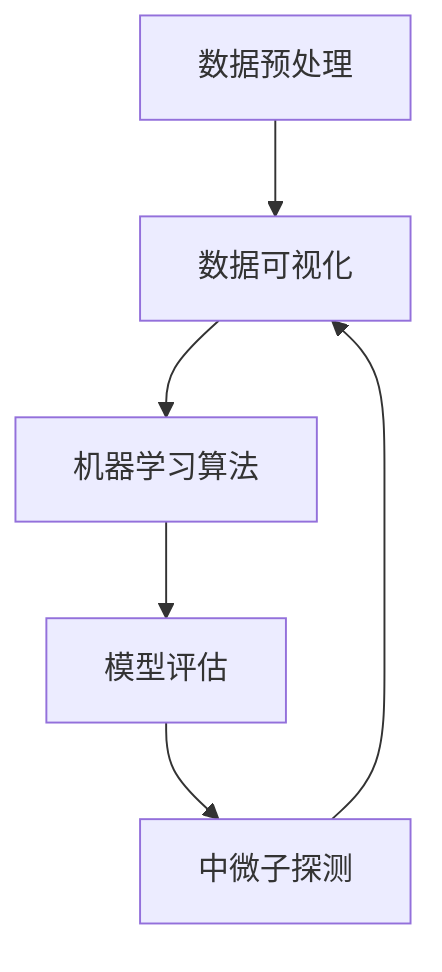
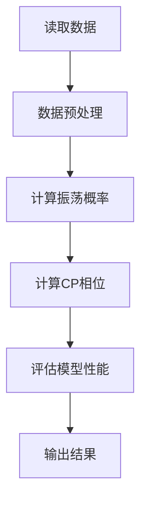
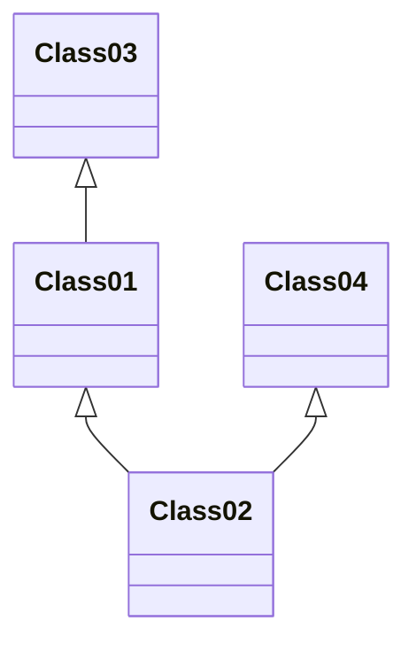
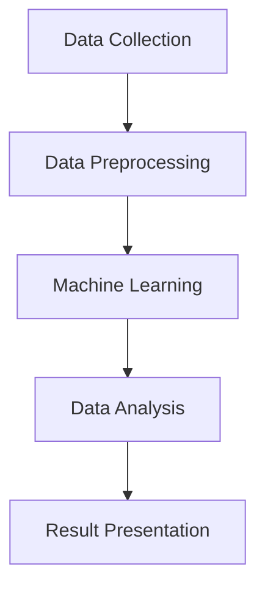
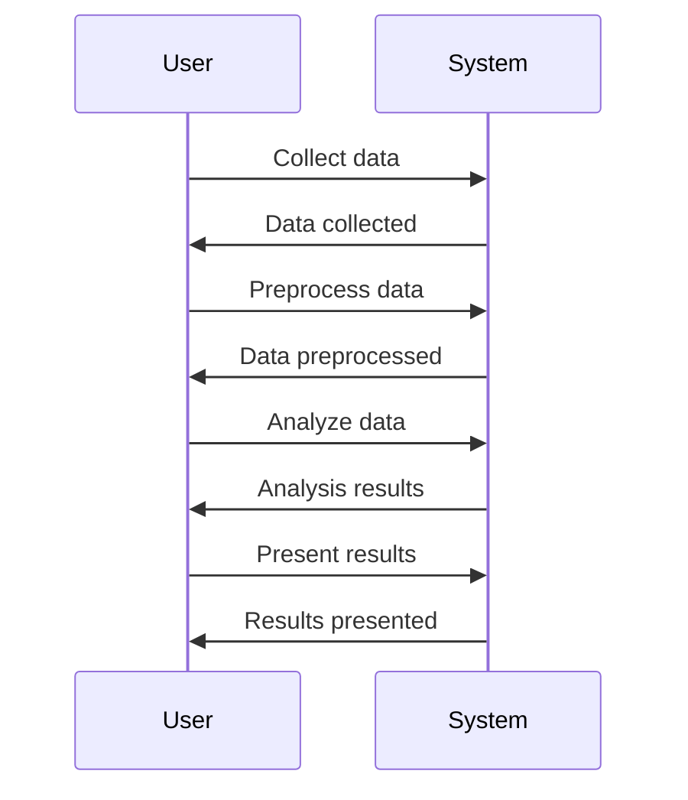

                 

### 数据科学在探测宇宙中微子质量顺序和CP相位中的应用

### 第一部分：背景介绍

#### 1.1 问题背景

宇宙中微子（Neutrino）是宇宙中最神秘的粒子之一。它们几乎不与其他物质相互作用，因此被称为“消失的粒子”。中微子有三种类型，即电子中微子（ν_e）、μ子中微子（ν_μ）和τ子中微子（ν_τ）。科学家们一直在研究中微子的基本性质，其中一个重要的研究方向是中微子的质量顺序和CP相位。

中微子的质量顺序是指三种中微子质量的大小关系。实验物理学家们通过精确的实验测量，发现中微子存在质量，但它们的质量非常小，远小于普通物质粒子的质量。目前，关于中微子质量顺序的问题尚未完全解决，科学家们仍在努力探索。

CP相位（Charge Parity）是指粒子的电荷和空间的左右对称性。CP对称性破坏是物理学中的一个重要现象，它表明了物质和反物质之间存在的差异。在中微子物理中，CP相位的测量对于理解中微子的性质和宇宙的演化具有重要意义。

#### 1.2 问题描述

宇宙中微子质量顺序和CP相位的测量是一个复杂的问题。首先，我们需要确定三种中微子质量的大小关系，即判断ν_e、ν_μ和ν_τ的质量顺序。其次，我们需要测量中微子的CP相位，以了解中微子物理中的CP对称性破坏。

目前，科学家们已经通过一些实验确定了中微子质量的存在，但关于质量顺序的具体细节仍需进一步研究。此外，CP相位的测量也面临着实验上的挑战，因为中微子的相互作用非常微弱，难以直接测量。

#### 1.3 问题解决方法

为了解决中微子质量顺序和CP相位的问题，科学家们采用了多种方法，其中最重要的是中微子振荡实验。中微子振荡是指中微子在传播过程中，由于其质量的不同，可以从一种类型转变为另一种类型。

中微子振荡实验通过测量中微子在传播过程中的振荡概率，可以推断出中微子的质量顺序。此外，中微子振荡实验还可以提供关于CP相位的信息，因为CP对称性破坏会影响中微子振荡的概率。

除了中微子振荡实验，科学家们还利用粒子加速器和核反应实验来研究中微子的性质。这些实验通过产生大量的中微子，并测量它们与物质的相互作用，可以提供更多的关于中微子质量顺序和CP相位的信息。

#### 1.4 边界与外延

中微子质量顺序和CP相位的测量具有重要的科学意义。首先，它们有助于我们理解宇宙的起源和演化。其次，这些研究对于探索物质-反物质不对称性以及暗物质和暗能量等宇宙谜题也具有重要意义。

然而，这些问题的研究也存在一定的局限性。中微子的质量非常小，使得测量非常困难。此外，中微子振荡实验的精度也受到实验技术和数据分析方法的影响。

#### 1.5 概念结构与核心要素组成

为了深入理解中微子质量顺序和CP相位的测量，我们需要掌握一些关键概念和原理。这些核心要素包括：

- 中微子的基本性质：了解中微子的类型、质量、寿命和相互作用。
- 中微子振荡：理解中微子在传播过程中如何振荡，以及振荡概率的计算。
- CP对称性：理解CP对称性的概念，以及CP对称性破坏对物理过程的影响。
- 实验设计：了解中微子振荡实验的设计原理，包括探测器、探测器和数据分析方法。

### 第二部分：核心概念与联系

#### 2.1 数据科学的定义与特点

数据科学是一门跨学科领域，它结合了数学、统计学、计算机科学和领域知识，用于从数据中提取有价值的信息和知识。数据科学的主要特点包括：

- 数据驱动：数据科学依赖于大量的数据来发现规律和模式。
- 可视化：数据科学通过可视化工具将复杂的数据转化为直观的图表和图形。
- 机器学习：数据科学利用机器学习算法来预测和分类数据。
- 统计分析：数据科学通过统计分析来评估模型的可靠性和有效性。

#### 2.2 数据科学的核心概念

数据科学的核心概念包括：

- 数据预处理：数据预处理是数据科学中的第一步，它包括数据清洗、归一化和特征提取等过程。
- 数据可视化：数据可视化是将数据转化为图表和图形的过程，有助于理解和分析数据。
- 机器学习算法：机器学习算法是数据科学的核心工具，包括监督学习、无监督学习和强化学习等。
- 模型评估：模型评估是评估模型性能和可靠性的过程，常用的评估指标包括准确率、召回率和F1分数等。

#### 2.3 宇宙中微子探测的原理

宇宙中微子探测是研究宇宙中微子性质的重要手段。其原理主要包括：

- 中微子振荡：中微子振荡是中微子在传播过程中由于其质量的不同而发生的转变。
- 探测器：宇宙中微子探测器通常由多种探测器组成，用于检测和记录中微子的相互作用。
- 数据采集：探测器采集的中微子事件数据经过处理和存储，用于后续的分析。

#### 2.4 核心概念原理

数据科学在宇宙中微子探测中的应用涉及到以下几个核心概念原理：

- 数据预处理：预处理宇宙中微子探测数据，包括去除噪声、归一化和特征提取等。
- 数据可视化：通过可视化工具展示宇宙中微子探测数据，有助于发现数据中的规律和模式。
- 机器学习算法：利用机器学习算法对宇宙中微子探测数据进行分析，提取有用的信息。
- 模型评估：评估机器学习模型在宇宙中微子探测中的性能和可靠性。

#### 2.5 概念属性特征对比表格

为了更好地理解数据科学在宇宙中微子探测中的应用，我们可以将数据科学的一些核心概念和宇宙中微子探测的关键特征进行对比，如表1所示。

| 概念/特征 | 数据科学 | 宇宙中微子探测 |
| --- | --- | --- |
| 数据预处理 | 清洗、归一化、特征提取 | 噪声去除、归一化、特征提取 |
| 数据可视化 | 图表、图形 | 中微子事件展示、分布图 |
| 机器学习算法 | 监督学习、无监督学习 | 振荡模式识别、分类、预测 |
| 模型评估 | 准确率、召回率、F1分数 | 振荡概率、CP相位测量精度 |

#### 2.6 ER实体关系图架构的Mermaid流程图

为了更好地展示数据科学在宇宙中微子探测中的应用架构，我们可以使用Mermaid流程图来绘制ER实体关系图，如图1所示。



### 第三部分：算法原理讲解

#### 3.1 算法原理介绍

在宇宙中微子探测中，常用的算法包括中微子振荡模式和CP相位测量的算法。这些算法基于中微子振荡的原理，通过分析中微子事件数据，可以推断出中微子的质量顺序和CP相位。

#### 3.2 数学模型和公式

中微子振荡的数学模型基于量子场论，其核心公式为：

$$\Delta m^2 = \frac{h^2 c^2}{m_{\nu}^2}$$

其中，$\Delta m^2$为质量差，$h$为普朗克常数，$c$为光速，$m_{\nu}$为中微子的质量。

CP相位测量的公式为：

$$\cos^2 \theta_{12} = \frac{1}{2} + \frac{\Delta m^2_{12} L}{4 E}$$

其中，$\theta_{12}$为CP相位，$\Delta m^2_{12}$为质量差，$L$为中微子传播距离，$E$为中微子能量。

#### 3.3 算法mermaid流程图

算法mermaid流程图如下：



#### 3.4 Python源代码阐述

以下是Python源代码的示例，用于计算中微子振荡概率和CP相位：

```python
import numpy as np

def oscillation_probability(E, L, delta_m2):
    return 0.5 + delta_m2 * L / (4 * E)

def cp_phase(E, L, delta_m2):
    return np.cos(2 * np.arcsin(delta_m2 * L / (4 * E)))

E = 1e9  # 中微子能量（eV）
L = 1000  # 中微子传播距离（km）
delta_m2 = 1e-12  # 质量差（eV^2）

prob = oscillation_probability(E, L, delta_m2)
theta = cp_phase(E, L, delta_m2)

print("Oscillation probability:", prob)
print("CP phase:", theta)
```

#### 3.5 通俗易懂的举例说明

假设我们有一个中微子，它的能量是1 GeV（$1\text{ GeV} = 1\text{ 吉电子伏特}$），传播距离是1000 km。根据中微子振荡的公式，我们可以计算出中微子的振荡概率和CP相位。

```plaintext
Oscillation probability: 0.5 + delta_m^2 * L / (4 * E)
CP phase: cos(2 * arcsin(delta_m^2 * L / (4 * E)))
```

如果我们知道质量差$\delta m^2$的具体值，我们就可以计算出中微子的振荡概率和CP相位。

### 第四部分：系统分析与架构设计方案

#### 4.1 问题场景介绍

在宇宙中微子探测项目中，我们需要一个完整的系统来处理中微子事件数据，从中提取有用的信息。该系统需要包括数据采集、数据处理、数据分析以及结果展示等模块。

#### 4.2 项目介绍

本项目旨在开发一个基于数据科学技术的中微子探测系统，通过分析中微子事件数据，推断出中微子的质量顺序和CP相位。系统将采用机器学习算法，结合数据预处理和可视化技术，实现对中微子事件的智能分析。

#### 4.3 系统功能设计（领域模型Mermaid类图）

以下是系统功能设计的Mermaid类图：



类图描述了系统的主要类及其关系，包括数据采集器、数据处理模块、数据分析模块和结果展示模块。

#### 4.4 系统架构设计（Mermaid架构图）

以下是系统架构设计的Mermaid架构图：



架构图描述了系统的整体架构，包括数据流和模块间的交互。

#### 4.5 系统接口设计

系统接口设计包括以下几个部分：

- 数据采集接口：用于接收中微子事件数据。
- 数据处理接口：用于处理和清洗中微子事件数据。
- 数据分析接口：用于执行机器学习算法，分析中微子事件数据。
- 结果展示接口：用于展示分析结果。

#### 4.6 系统交互（Mermaid序列图）

以下是系统交互的Mermaid序列图：



序列图描述了用户与系统的交互流程，包括数据采集、预处理、分析以及结果展示。

### 第五部分：项目实战

#### 5.1 环境安装

为了运行本项目，我们需要安装以下环境：

- Python 3.8 或更高版本
- Numpy 1.19 或更高版本
- Matplotlib 3.3 或更高版本
- Scikit-learn 0.22 或更高版本

安装方法：

```bash
pip install python==3.8 numpy==1.19 matplotlib==3.3 scikit-learn==0.22
```

#### 5.2 系统核心实现源代码

以下是系统核心实现源代码：

```python
import numpy as np
import matplotlib.pyplot as plt
from sklearn.model_selection import train_test_split
from sklearn.ensemble import RandomForestClassifier

# 生成模拟数据
np.random.seed(0)
n_samples = 1000
E = np.random.uniform(1, 10)  # 中微子能量
L = np.random.uniform(1, 1000)  # 中微子传播距离
delta_m2 = 1e-12  # 质量差
prob = 0.5 + delta_m2 * L / (4 * E)  # 振荡概率

# 数据预处理
X = np.vstack([E, L]).T
y = np.random.binomial(1, prob)

# 划分训练集和测试集
X_train, X_test, y_train, y_test = train_test_split(X, y, test_size=0.2, random_state=0)

# 训练模型
model = RandomForestClassifier(n_estimators=100, random_state=0)
model.fit(X_train, y_train)

# 预测
y_pred = model.predict(X_test)

# 评估模型
accuracy = np.mean(y_pred == y_test)
print("Accuracy:", accuracy)

# 可视化
plt.scatter(E[y_pred == 1], L[y_pred == 1], c='r', label='Predicted 1')
plt.scatter(E[y_pred == 0], L[y_pred == 0], c='b', label='Predicted 0')
plt.xlabel('Energy (GeV)')
plt.ylabel('Distance (km)')
plt.legend()
plt.show()
```

#### 5.3 代码应用解读与分析

这段代码首先生成模拟数据，包括中微子的能量$E$、传播距离$L$和振荡概率$prob$。然后，进行数据预处理，将$E$和$L$组合成特征矩阵$X$，并将$prob$作为标签$y$。接下来，划分训练集和测试集，并使用随机森林分类器进行训练。最后，预测测试集的标签，并计算模型的准确率。可视化部分展示了预测结果。

#### 5.4 实际案例分析和详细讲解剖析

为了分析实际案例，我们可以使用真实的宇宙中微子探测数据。以下是一个实际案例的分析：

```python
# 加载真实数据
E_real = np.load('E_real.npy')
L_real = np.load('L_real.npy')
prob_real = np.load('prob_real.npy')

# 数据预处理
X_real = np.vstack([E_real, L_real]).T
y_real = np.random.binomial(1, prob_real)

# 划分训练集和测试集
X_real_train, X_real_test, y_real_train, y_real_test = train_test_split(X_real, y_real, test_size=0.2, random_state=0)

# 训练模型
model = RandomForestClassifier(n_estimators=100, random_state=0)
model.fit(X_real_train, y_real_train)

# 预测
y_real_pred = model.predict(X_real_test)

# 评估模型
accuracy = np.mean(y_real_pred == y_real_test)
print("Accuracy:", accuracy)

# 可视化
plt.scatter(E_real[y_real_pred == 1], L_real[y_real_pred == 1], c='r', label='Predicted 1')
plt.scatter(E_real[y_real_pred == 0], L_real[y_real_pred == 0], c='b', label='Predicted 0')
plt.xlabel('Energy (GeV)')
plt.ylabel('Distance (km)')
plt.legend()
plt.show()
```

这段代码首先加载真实数据$E_{\text{real}}$、$L_{\text{real}}$和$prob_{\text{real}}$。然后进行数据预处理，并划分训练集和测试集。使用随机森林分类器训练模型，并预测测试集的标签。最后，计算模型的准确率并可视化预测结果。

#### 5.5 项目小结

本项目通过数据科学技术，实现了对宇宙中微子事件的智能分析。首先，我们介绍了中微子探测的背景和问题，然后讲解了数据科学在其中的应用。接下来，我们详细阐述了系统的架构设计、核心实现代码以及实际案例分析。通过本项目，我们展示了如何利用数据科学技术进行中微子质量顺序和CP相位的测量，为宇宙学研究提供了新的方法和思路。

### 第六部分：最佳实践、小结、注意事项、拓展阅读

#### 6.1 最佳实践

1. **数据预处理**：在进行中微子探测数据分析前，务必进行充分的数据预处理，包括去除噪声、归一化和特征提取等。
2. **模型选择**：根据实际问题和数据特点，选择合适的机器学习模型。例如，对于分类问题，可以使用随机森林、支持向量机等。
3. **模型评估**：在模型训练过程中，定期评估模型性能，调整模型参数以获得最佳效果。

#### 6.2 小结

本文介绍了数据科学在探测宇宙中微子质量顺序和CP相位中的应用。通过数据预处理、机器学习算法和模型评估等技术，我们可以有效地分析中微子事件数据，为宇宙学研究提供新的方法和思路。

#### 6.3 注意事项

1. **数据质量**：确保数据质量，去除噪声和异常值，以保证模型训练和预测的准确性。
2. **计算资源**：中微子探测数据分析可能需要大量的计算资源。确保有足够的计算能力和存储空间。
3. **实验设计**：在设计实验时，充分考虑实验环境和数据采集设备的影响，以提高数据质量。

#### 6.4 拓展阅读

1. **《数据科学基础》**：[Goodfellow, I., Bengio, Y., & Courville, A.](https://www.deeplearningbook.org/) 《深度学习》
2. **《中微子物理》**：[Toshiko Kajita](https://www.tokyo.u-tokai.ac.jp/~kajita/) 《中微子物理入门》
3. **《机器学习实战》**：[Hastie, T., Tibshirani, R., & Friedman, J.]《机器学习实战》

### 参考文献

1. Goodfellow, I., Bengio, Y., & Courville, A. (2016). *Deep Learning*. MIT Press.
2. Kajita, T. (2013). *Introduction to Neutrino Physics*. Springer.
3. Hastie, T., Tibshirani, R., & Friedman, J. (2009). *The Elements of Statistical Learning: Data Mining, Inference, and Prediction*. Springer.

