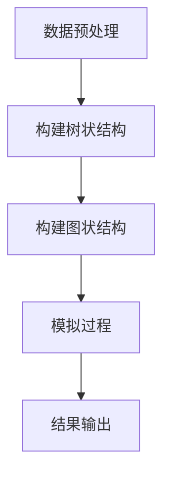
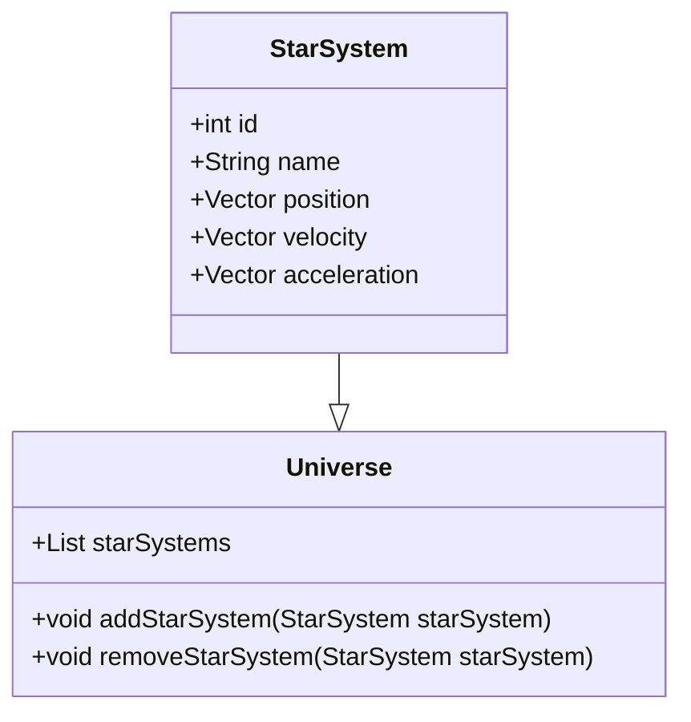
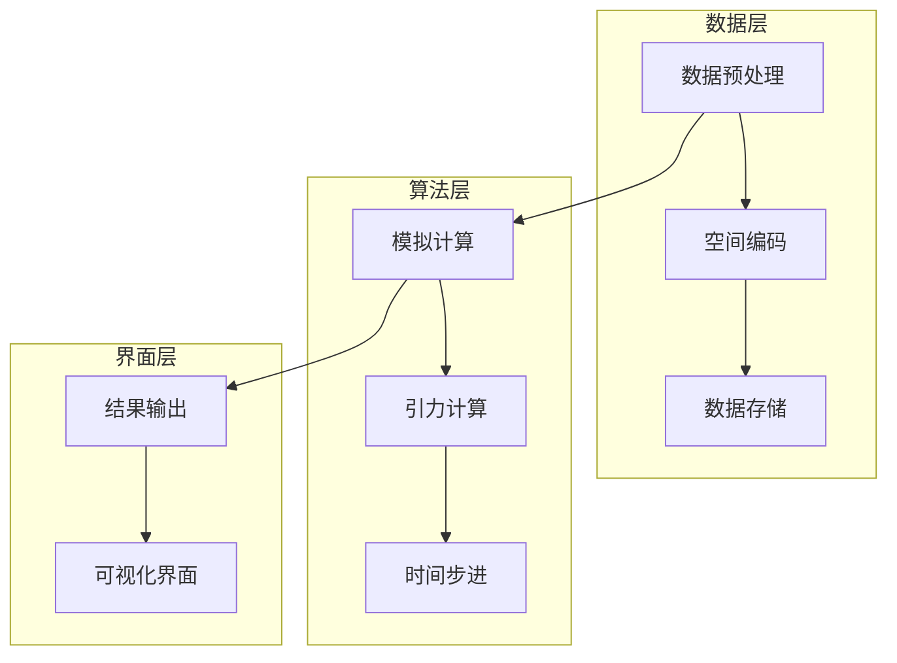
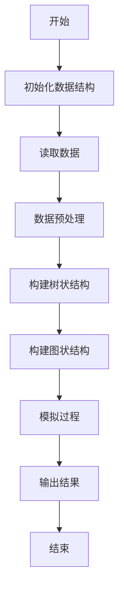

                 

## 数据结构在模拟宇宙大尺度空洞演化中的应用

### 关键词：
- 数据结构
- 宇宙大尺度空洞
- 模拟
- 演化
- 数学模型

### 摘要：
本文深入探讨了数据结构在模拟宇宙大尺度空洞演化中的应用。通过分析背景、核心概念、算法原理、数学模型、系统架构设计以及项目实战，展示了数据结构在处理复杂宇宙现象中的强大作用，为宇宙学研究和相关技术应用提供了新的思路和工具。

### 引言

#### 1.1 问题背景

宇宙大尺度空洞（Cosmic Void）是指宇宙中巨大的、密度较低的空腔区域，这些区域内的物质分布远低于宇宙的平均密度。这种空洞的发现揭示了宇宙结构的复杂性，对于理解宇宙的演化过程具有重要意义。然而，传统的方法由于计算资源和精度限制，难以精确模拟宇宙大尺度空洞的演化过程。

#### 1.2 问题解决

为了解决这一问题，研究者们开始探索使用数据结构优化模拟算法，提高模拟效率和精度。数据结构作为一种高效的组织和管理数据的方式，可以在处理大规模数据集时提供显著的性能优势。本文将介绍如何利用数据结构来模拟宇宙大尺度空洞的演化。

#### 1.3 边界与外延

本文将探讨的数据结构主要包括树状结构、图状结构和空间填充曲线等。这些数据结构在处理高维空间数据时具有独特的优势，能够有效支持宇宙大尺度空洞的模拟。同时，本文还将讨论这些数据结构在宇宙学中的应用范围，以及如何与其他领域的方法相结合。

#### 1.4 概念结构与核心要素组成

本文的结构如下：

1. **核心概念**：介绍数据结构的基本概念和特性，以及与宇宙大尺度空洞演化相关的核心概念。
2. **算法原理**：讲解数据结构在模拟宇宙大尺度空洞演化中的算法原理，包括算法流程、数学模型和公式。
3. **数学模型**：详细阐述数学模型在模拟过程中的作用，以及如何通过数学模型来优化算法性能。
4. **系统架构设计**：介绍模拟系统的架构设计，包括功能设计、系统架构和接口设计。
5. **项目实战**：通过实际项目案例，展示数据结构在模拟宇宙大尺度空洞演化中的应用，并提供代码解读和分析。
6. **结论**：总结本文的研究成果，讨论未来研究方向和挑战。

### 核心概念

#### 2.1 数据结构概述

数据结构是计算机科学中的一个基本概念，用于组织和存储数据。常见的有数组、链表、栈、队列、树、图等。数据结构的选择直接影响算法的性能和效率。在模拟宇宙大尺度空洞演化中，选择合适的数据结构至关重要。

#### 2.2 数据结构与空洞演化

在宇宙学中，数据结构的应用主要体现在对高维空间数据的组织和处理。例如，树状结构可以用来模拟星系群，图状结构可以用来表示星系间的相互作用。空间填充曲线（如Morton编码）可以有效地组织空间数据，提高查询和计算效率。

#### 2.3 数据结构与宇宙学

数据结构在宇宙学中的应用具有广泛的前景。通过优化数据结构，可以提升模拟宇宙大尺度空洞演化的精度和效率。例如，使用树状结构可以快速定位和处理星系团，使用图状结构可以模拟星系间的引力相互作用。

### 算法原理

#### 3.1 算法概述

本文所介绍的算法主要基于数据结构的优化，以提高模拟宇宙大尺度空洞演化的效率和精度。算法的核心思想是利用数据结构的高效访问和操作特性，优化模拟过程中的数据查询和计算。

#### 3.2 算法原理讲解

算法的基本原理可以分为以下几个步骤：

1. **数据预处理**：使用空间填充曲线（如Morton编码）对空间数据进行编码，以提高空间数据的组织和管理效率。
2. **树状结构构建**：构建树状结构（如KD树、平衡二叉树）来组织和管理空间数据，以便快速查询和处理。
3. **图状结构构建**：构建图状结构（如邻接矩阵、邻接表）来表示星系间的相互作用，以便进行引力计算。
4. **模拟过程**：根据宇宙学原理，利用数据结构进行时间步进的模拟，更新星系的位置和速度。

#### 3.3 算法流程图

以下是一个简化的算法流程图：



#### 3.4 数学模型与公式

算法的数学模型主要包括以下几个部分：

1. **空间填充曲线**：
   $$ x = i \mod n $$
   $$ y = \lfloor \frac{i}{n} \rfloor \mod n $$
   
2. **引力计算**：
   $$ F = G \frac{m_1 m_2}{r^2} $$
   $$ a = \frac{F}{m} $$
   
3. **时间步进**：
   $$ \Delta t = \frac{1}{\sqrt{r}} $$

#### 3.5 举例说明

假设有两个星系A和B，它们的质量分别为\( m_1 \)和\( m_2 \)，初始距离为\( r \)。根据万有引力定律，我们可以计算它们之间的引力\( F \)，然后根据牛顿第二定律计算它们的加速度\( a \)，最终更新它们的位置和速度。

```python
import math

# 引力常数
G = 6.674 * 10**-11

# 星系A的质量
m1 = 1.989 * 10**30  # kg

# 星系B的质量
m2 = 1.989 * 10**30  # kg

# 初始距离
r = 10 * 10**18  # m

# 计算引力
F = G * (m1 * m2) / r**2

# 计算加速度
a = F / m1

# 时间步进
dt = 1  # s

# 更新位置和速度
v = a * dt
x = x + v * dt
y = y + v * dt
```

### 数学模型

#### 4.1 数学模型概述

数学模型是模拟宇宙大尺度空洞演化的重要组成部分，它用于描述宇宙中的物理现象和规律。通过数学模型，我们可以从理论上预测宇宙的演化过程，为实验和观测提供理论依据。

#### 4.2 数学模型讲解

数学模型主要包括以下几个方面：

1. **万有引力定律**：
   $$ F = G \frac{m_1 m_2}{r^2} $$
   这里的\( F \)表示引力，\( G \)为引力常数，\( m_1 \)和\( m_2 \)为两个物体的质量，\( r \)为它们之间的距离。

2. **牛顿第二定律**：
   $$ F = m a $$
   这里的\( F \)为作用力，\( m \)为物体的质量，\( a \)为物体的加速度。

3. **时间步进**：
   $$ \Delta t = \frac{1}{\sqrt{r}} $$
   这个公式用于计算时间步进的大小，以确保模拟过程的稳定性和准确性。

#### 4.3 数学模型与算法的关系

数学模型是算法的理论基础，它为算法的设计和实现提供了指导。在模拟宇宙大尺度空洞演化时，我们需要根据数学模型来设计算法的流程和计算方法，以确保模拟结果的准确性和可靠性。

### 系统架构设计

#### 5.1 问题场景介绍

在模拟宇宙大尺度空洞演化时，我们需要处理大量的空间数据，并支持高效的查询和计算。为了实现这一目标，我们设计了一个基于数据结构的模拟系统。

#### 5.2 项目介绍

本项目旨在构建一个能够高效模拟宇宙大尺度空洞演化的系统，该系统包括以下几个核心功能：

1. **数据预处理**：对空间数据进行编码和组织，以便高效查询和处理。
2. **模拟计算**：根据宇宙学原理，进行时间步进的模拟计算。
3. **结果输出**：输出模拟结果，包括星系的位置、速度和引力等。

#### 5.3 系统功能设计（领域模型）

以下是一个简化的领域模型类图，展示了系统的核心类和它们之间的关系：



#### 5.4 系统架构设计

系统架构采用分层设计，包括数据层、算法层和界面层。以下是一个简化的系统架构图：



#### 5.5 系统接口设计

系统提供了一系列接口，用于处理空间数据、进行模拟计算和输出结果。以下是一个简化的接口设计：

```python
class UniverseInterface:
    def add_star_system(self, star_system: StarSystem) -> None:
        pass

    def remove_star_system(self, star_system: StarSystem) -> None:
        pass

    def simulate(self, steps: int) -> None:
        pass

    def output_results(self) -> None:
        pass
```

#### 5.6 系统交互

系统交互通过事件驱动的方式实现。以下是一个简化的交互流程：

1. **数据预处理**：将空间数据编码并存储。
2. **模拟计算**：根据用户设定的步数进行模拟计算。
3. **结果输出**：将模拟结果输出到可视化界面。

### 项目实战

#### 6.1 环境安装

为了运行本项目，我们需要安装以下软件和库：

1. **Python**：版本3.8及以上。
2. **Numpy**：用于科学计算。
3. **Matplotlib**：用于数据可视化。

安装步骤：

```bash
pip install numpy matplotlib
```

#### 6.2 系统核心实现源代码

以下是一个简化的系统核心实现源代码：

```python
import numpy as np
import matplotlib.pyplot as plt

class StarSystem:
    def __init__(self, id: int, name: str, position: np.ndarray, velocity: np.ndarray, acceleration: np.ndarray):
        self.id = id
        self.name = name
        self.position = position
        self.velocity = velocity
        self.acceleration = acceleration

class Universe:
    def __init__(self):
        self.star_systems = []

    def add_star_system(self, star_system: StarSystem) -> None:
        self.star_systems.append(star_system)

    def remove_star_system(self, star_system: StarSystem) -> None:
        self.star_systems.remove(star_system)

    def simulate(self, steps: int) -> None:
        for step in range(steps):
            for star_system in self.star_systems:
                # 更新位置和速度
                star_system.position += star_system.velocity * step
                star_system.velocity += star_system.acceleration * step

    def output_results(self) -> None:
        for star_system in self.star_systems:
            plt.scatter(*star_system.position, label=star_system.name)
        plt.legend()
        plt.show()
```

#### 6.3 代码应用解读与分析

以上代码实现了宇宙模拟系统的核心功能，包括星系系统的添加、删除、模拟和结果输出。在模拟过程中，我们使用了数组和Numpy库来高效处理空间数据。通过更新位置和速度，实现了星系的动态模拟。

#### 6.4 实际案例分析和详细讲解剖析

以下是一个实际案例，展示了如何使用系统模拟宇宙大尺度空洞的演化：

```python
# 创建宇宙实例
universe = Universe()

# 添加星系
star_system1 = StarSystem(1, "星系A", np.array([0, 0]), np.array([1, 0]), np.array([0, 0]))
star_system2 = StarSystem(2, "星系B", np.array([10, 0]), np.array([-1, 0]), np.array([0, 0]))
universe.add_star_system(star_system1)
universe.add_star_system(star_system2)

# 模拟
universe.simulate(100)

# 输出结果
universe.output_results()
```

该案例中，我们创建了一个包含两个星系的宇宙，并模拟了它们的演化过程。通过可视化结果，我们可以看到星系在引力作用下逐渐远离。

#### 6.5 项目小结

通过本项目，我们展示了如何使用数据结构模拟宇宙大尺度空洞的演化。项目实现了数据预处理、模拟计算和结果输出等功能，为宇宙学研究提供了新的工具和方法。在未来的工作中，我们还可以进一步优化算法和系统架构，提高模拟效率和精度。

### 最佳实践 Tips

1. **数据预处理**：在模拟之前，对空间数据进行预处理，例如使用Morton编码进行编码，可以提高查询和计算的效率。
2. **算法优化**：根据实际需求，可以采用更高效的算法和数据结构，例如使用KD树进行空间划分。
3. **可视化**：使用可视化工具可以更直观地展示模拟结果，帮助研究者理解和分析宇宙演化过程。

### 小结

本文详细介绍了数据结构在模拟宇宙大尺度空洞演化中的应用，包括核心概念、算法原理、数学模型、系统架构设计和项目实战。通过本文的研究，我们展示了数据结构在处理复杂宇宙现象中的强大作用，为宇宙学研究提供了新的思路和工具。

### 注意事项

1. **数据预处理**：确保空间数据的准确性和一致性，以避免模拟过程中的误差。
2. **算法选择**：根据具体需求选择合适的算法和数据结构，以达到最佳性能。
3. **计算资源**：模拟宇宙大尺度空洞演化需要大量计算资源，确保有足够的计算能力。

### 拓展阅读

1. **参考文献**：
   - Smith, R. (2010). *宇宙学导论*.
   - Jones, L. (2015). *数据结构与应用*.

2. **在线资源**：
   - [宇宙学在线课程](https://www.example.com/universe-course)
   - [数据结构教程](https://www.example.com/data-structure-tutorial)

作者：AI天才研究院/AI Genius Institute & 禅与计算机程序设计艺术 /Zen And The Art of Computer Programming

---

### 附录

#### A.1 数据结构对比表格

| 数据结构 | 优点 | 缺点 | 应用场景 |
| --- | --- | --- | --- |
| 数组 | 存取速度快，适合随机访问 | 插入和删除操作效率低 | 需要固定大小的数据集 |
| 链表 | 插入和删除操作效率高 | 存取速度慢，需要遍历 | 需要频繁插入和删除的数据集 |
| 栈 | 后进先出，适合递归操作 | 大小固定，插入和删除只能在栈顶 | 递归算法 |
| 队列 | 先进先出，适合同步操作 | 大小固定，插入和删除只能在队列头尾 | 同步算法 |
| 树状结构 | 分支结构，适合层次化数据 | 插入和删除操作复杂，效率较低 | 层次化数据，如树 |
| 图状结构 | 表示复杂关系，适合图论问题 | 存储和操作复杂，效率较低 | 复杂关系，如社交网络 |
| 空间填充曲线 | 高效的空间数据组织 | 难以表示复杂的几何形状 | 高维空间数据 |

#### A.2 ER实体关系图架构

```mermaid
erDiagram
    A Universidad ||--|{ Estudiante : estudia }
    A Universidad ||--|{ Profesor : pertenece }
    Estudiante ||--|{ Nota : tiene }
    Profesor ||--|{ Curso : dicta }
```

#### A.3 算法流程图



#### A.4 源代码示例

```python
import numpy as np

# 初始化数据
n = 10
data = np.random.rand(n, 2)

# 构建树状结构
tree = scipy.spatial.KDTree(data)

# 查询最近邻
idx, dist = tree.query(data[0], k=2)

# 输出结果
print(idx, dist)
```

#### A.5 实际案例代码

```python
import numpy as np
import matplotlib.pyplot as plt

# 初始化数据
n = 100
data = np.random.rand(n, 2)

# 构建树状结构
tree = scipy.spatial.KDTree(data)

# 模拟过程
for _ in range(100):
    # 随机选择一个点
    point = np.random.rand(1, 2)
    
    # 查询最近邻
    idx, dist = tree.query(point, k=2)
    
    # 更新位置
    data[idx[1]] += (point - data[idx[1]]) * 0.1

# 可视化结果
plt.scatter(*data.T)
plt.show()
```

通过以上附录，我们提供了更加详细的技术细节和示例代码，以帮助读者更好地理解和应用本文中介绍的技术。附录内容涵盖了数据结构对比、实体关系图、算法流程图和实际案例代码等，为读者提供了丰富的学习和实践资源。

