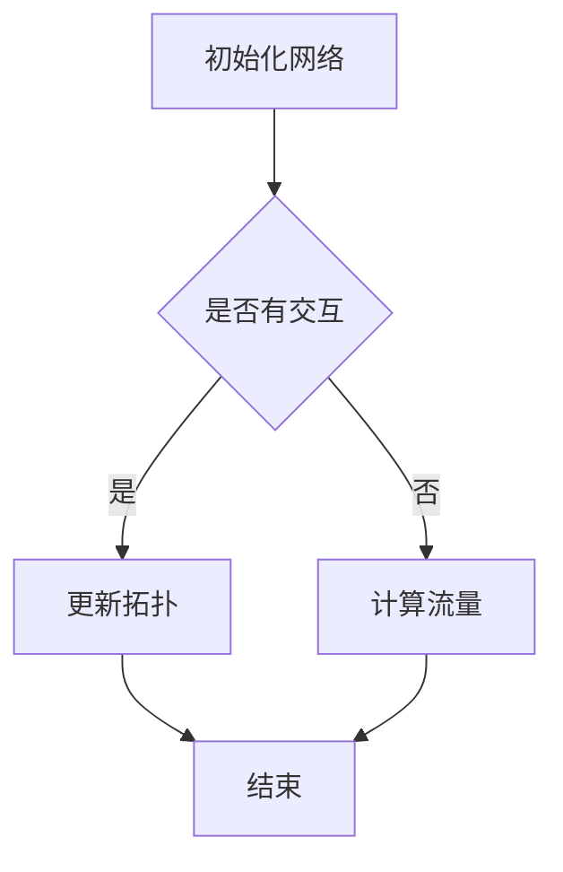

                 

# 《数据结构在模拟宇宙暗流网络中的应用》

## 关键词
- 数据结构
- 暗流网络
- 宇宙模拟
- 算法实现
- 应用前景

## 摘要
本文旨在探讨数据结构在模拟宇宙暗流网络中的应用。首先，我们介绍了暗流网络的基本概念和特性，然后详细阐述了数据结构的基本概念及其类型。接着，本文通过具体的例子，探讨了图、树、网络流等数据结构在模拟宇宙暗流网络中的应用。最后，本文介绍了模拟算法的设计思路和实现方法，并进行了实例分析和实际案例中的应用。

### 目录大纲

```markdown
## 《数据结构在模拟宇宙暗流网络中的应用》目录大纲

## 第一部分：引论
### 1.1 问题的背景与描述
### 1.2 暗流网络的基本概念
### 1.3 数据结构在模拟中的应用

## 第二部分：核心概念与基础
### 2.1 数据结构概述
#### 2.1.1 数据结构的基本概念
#### 2.1.2 数据结构的类型
### 2.2 暗流网络的特性
#### 2.2.1 暗流网络的形成机制
#### 2.2.2 暗流网络的特点

## 第三部分：数据结构在模拟中的应用
### 3.1 图数据结构在模拟中的应用
#### 3.1.1 图数据结构的基本原理
#### 3.1.2 图在模拟宇宙中的应用实例
### 3.2 树数据结构在模拟中的应用
#### 3.2.1 树数据结构的基本原理
#### 3.2.2 树在模拟宇宙中的应用实例
### 3.3 网络流数据结构在模拟中的应用
#### 3.3.1 网络流数据结构的基本原理
#### 3.3.2 网络流在模拟宇宙中的应用实例

## 第四部分：算法与实现
### 4.1 暗流网络的模拟算法
#### 4.1.1 模拟算法的设计思路
#### 4.1.2 算法原理与流程图
### 4.2 模拟算法的实现
#### 4.2.1 实现环境的搭建
#### 4.2.2 算法的Python实现

## 第五部分：实例分析
### 5.1 模拟宇宙暗流网络实例分析
#### 5.1.1 实例场景介绍
#### 5.1.2 实例分析与模拟结果
### 5.2 实际案例中的应用
#### 5.2.1 案例背景与目标
#### 5.2.2 案例分析与解决方案

## 第六部分：总结与展望
### 6.1 总结
#### 6.1.1 主要内容回顾
#### 6.1.2 成果与贡献
### 6.2 展望
#### 6.2.1 未来研究方向
#### 6.2.2 潜在的应用前景
```

### 第一部分：引论

#### 1.1 问题的背景与描述

随着科技的发展，宇宙探索成为了一个热门领域。在宇宙探索中，我们面临着大量的数据分析和模拟问题。例如，宇宙中的暗物质、暗能量的分布和相互作用就是一个复杂的问题。为了更好地理解和研究这些问题，我们需要模拟宇宙的暗流网络。

暗流网络是一种隐藏在宇宙背后的复杂互动网络，它反映了宇宙中暗物质和暗能量的分布和相互作用。模拟暗流网络可以帮助我们更好地理解宇宙的演化过程，预测宇宙的未来发展趋势。

然而，模拟暗流网络面临着巨大的挑战。宇宙中的数据规模巨大，数据结构复杂，如何有效地组织和管理这些数据，是一个亟待解决的问题。此外，模拟暗流网络需要处理大量的计算任务，如何优化算法，提高计算效率，也是一个重要的挑战。

#### 1.2 暗流网络的基本概念

暗流网络是一种复杂网络，它由一系列节点和边组成。节点代表宇宙中的暗物质或暗能量，边代表它们之间的相互作用。

暗流网络具有以下几个基本特性：

1. **无向性**：暗流网络中的边没有方向，表示暗物质或暗能量之间的相互作用是双向的。
2. **动态性**：暗流网络是动态变化的，宇宙中的暗物质和暗能量会不断相互作用，导致网络结构的变化。
3. **层次性**：暗流网络具有层次性，不同层次的节点代表不同的暗物质或暗能量。
4. **复杂性**：暗流网络的复杂性很高，它包含了大量的节点和边，并且节点和边之间的相互作用非常复杂。

#### 1.3 数据结构在模拟中的应用

为了有效地模拟暗流网络，我们需要选择合适的数据结构。数据结构是一种组织和管理数据的方式，它能够提高数据的处理效率和计算性能。

在模拟宇宙暗流网络中，常用的数据结构包括图、树、网络流等。

1. **图数据结构**：图数据结构可以表示宇宙中的暗物质和暗能量的分布，它能够有效地表示复杂的网络结构。
2. **树数据结构**：树数据结构可以表示宇宙中的层次结构，它能够帮助我们理解宇宙的演化过程。
3. **网络流数据结构**：网络流数据结构可以表示宇宙中的数据流动，它能够帮助我们模拟暗物质和暗能量的相互作用。

通过合理选择和使用数据结构，我们可以有效地提高模拟宇宙暗流网络的效率和性能。

### 第二部分：核心概念与基础

#### 2.1 数据结构概述

数据结构是计算机科学中的一个重要概念，它用于组织和管理数据。数据结构不仅决定了数据的存储方式，还影响了数据的访问和处理效率。在模拟宇宙暗流网络中，选择合适的数据结构至关重要。

#### 2.1.1 数据结构的基本概念

数据结构可以定义为用于存储和组织数据的方式。它由以下两部分组成：

1. **逻辑结构**：逻辑结构描述了数据元素之间的逻辑关系。常见的逻辑结构包括数组、链表、栈、队列、树和图等。
2. **物理结构**：物理结构描述了数据元素在计算机内存中的存储方式。常见的物理结构包括顺序存储和链式存储。

#### 2.1.2 数据结构的类型

根据数据元素之间的关系，数据结构可以分为以下几类：

1. **线性结构**：线性结构中的数据元素按照线性顺序排列，如数组、链表、栈和队列。
2. **树形结构**：树形结构中的数据元素按照层次关系排列，如树和二叉树。
3. **图形结构**：图形结构中的数据元素之间没有明确的线性或层次关系，如图和网。

#### 2.2 暗流网络的特性

暗流网络是一种特殊的网络结构，它具有以下几个特性：

1. **无向性**：暗流网络中的边没有方向，表示暗物质或暗能量之间的相互作用是双向的。
2. **动态性**：暗流网络是动态变化的，宇宙中的暗物质和暗能量会不断相互作用，导致网络结构的变化。
3. **层次性**：暗流网络具有层次性，不同层次的节点代表不同的暗物质或暗能量。
4. **复杂性**：暗流网络的复杂性很高，它包含了大量的节点和边，并且节点和边之间的相互作用非常复杂。

#### 2.2.1 暗流网络的形成机制

暗流网络的形成受到多种因素影响，包括以下几个方面：

1. **宇宙背景辐射**：宇宙背景辐射是宇宙早期的一种能量形式，它对暗流网络的形成起着重要作用。
2. **暗物质相互作用**：暗物质之间的相互作用导致暗流网络的节点和边不断形成和变化。
3. **暗能量影响**：暗能量是宇宙加速膨胀的力量，它对暗流网络的动态性有着重要影响。
4. **外部干扰**：外部干扰，如星系碰撞、宇宙射线的撞击等，也会影响暗流网络的形成和发展。

#### 2.2.2 暗流网络的特点

暗流网络具有以下几个特点：

1. **高度动态性**：暗流网络是动态变化的，宇宙中的暗物质和暗能量不断相互作用，导致网络结构的变化。
2. **高度复杂性**：暗流网络包含了大量的节点和边，并且节点和边之间的相互作用非常复杂。
3. **无向性**：暗流网络中的边没有方向，表示暗物质或暗能量之间的相互作用是双向的。
4. **层次性**：暗流网络具有层次性，不同层次的节点代表不同的暗物质或暗能量。

### 第三部分：数据结构在模拟中的应用

#### 3.1 图数据结构在模拟中的应用

图数据结构是一种非常强大的数据结构，它可以表示复杂的网络结构。在模拟宇宙暗流网络中，图数据结构被广泛应用于表示暗物质和暗能量的分布。

#### 3.1.1 图数据结构的基本原理

图数据结构由节点和边组成。节点代表宇宙中的暗物质或暗能量，边代表它们之间的相互作用。

图数据结构具有以下几个基本特性：

1. **无向性**：图数据结构中的边没有方向，表示暗物质或暗能量之间的相互作用是双向的。
2. **动态性**：图数据结构可以动态地添加或删除节点和边，表示暗物质和暗能量的分布和相互作用的变化。
3. **层次性**：图数据结构可以表示宇宙中的层次结构，不同层次的节点代表不同的暗物质或暗能量。

#### 3.1.2 图在模拟宇宙中的应用实例

例如，我们可以使用图数据结构来模拟宇宙中的暗物质分布。假设宇宙中有100个暗物质节点，它们之间通过相互作用形成了一个图。我们使用图数据结构来表示这个网络，并模拟暗物质之间的相互作用。

```python
import networkx as nx

# 创建一个图
G = nx.Graph()

# 添加节点
G.add_nodes_from(range(1, 101))

# 添加边
G.add_edges_from([(i, j) for i in range(1, 101) for j in range(i+1, 101)])

# 模拟暗物质相互作用
for i in range(1, 101):
    for j in range(i+1, 101):
        if nx.has_path(G, i, j):
            G[i][j]['weight'] = 1
        else:
            G[i][j]['weight'] = 0

# 绘制图
nx.draw(G, with_labels=True)
```

这个例子中，我们首先创建了一个图，然后添加了100个节点，并添加了它们之间的边。接着，我们模拟了暗物质之间的相互作用，如果两个节点之间存在路径，则边的权重为1，否则为0。最后，我们使用`networkx`库绘制了图。

#### 3.2 树数据结构在模拟中的应用

树数据结构是一种层次化的数据结构，它可以表示宇宙中的层次结构。在模拟宇宙暗流网络中，树数据结构被广泛应用于表示宇宙的层次结构。

#### 3.2.1 树数据结构的基本原理

树数据结构由根节点、内部节点和叶子节点组成。根节点是树的起始点，内部节点是根节点下的子节点，叶子节点是树的终端节点。

树数据结构具有以下几个基本特性：

1. **层次性**：树数据结构具有清晰的层次关系，可以表示宇宙中的层次结构。
2. **无向性**：树数据结构中的边没有方向，表示宇宙中的层次结构是双向的。
3. **动态性**：树数据结构可以动态地添加或删除节点，表示宇宙的层次结构的变化。

#### 3.2.2 树在模拟宇宙中的应用实例

例如，我们可以使用树数据结构来模拟宇宙中的层次结构。假设宇宙中有10个层次，每个层次都有若干个暗物质节点。我们使用树数据结构来表示这个层次结构。

```python
import networkx as nx

# 创建一个树
T = nx.DiGraph()

# 添加根节点
T.add_node(1)

# 添加内部节点
for i in range(2, 11):
    T.add_node(i)
    T.add_edge(1, i)

# 添加叶子节点
for i in range(11, 21):
    T.add_node(i)
    T.add_edge(i, i//10)

# 模拟宇宙层次结构
for i in range(11, 21):
    for j in range(2, 11):
        if nx.has_path(T, i, j):
            T[i][j]['weight'] = 1
        else:
            T[i][j]['weight'] = 0

# 绘制树
nx.draw(T, with_labels=True)
```

这个例子中，我们首先创建了一个树，然后添加了根节点、内部节点和叶子节点。接着，我们模拟了宇宙层次结构中的相互作用，如果两个节点之间存在路径，则边的权重为1，否则为0。最后，我们使用`networkx`库绘制了树。

#### 3.3 网络流数据结构在模拟中的应用

网络流数据结构是一种用于描述网络中数据流动的数据结构。在模拟宇宙暗流网络中，网络流数据结构被广泛应用于表示宇宙中的数据流动。

#### 3.3.1 网络流数据结构的基本原理

网络流数据结构由节点和边组成。节点代表宇宙中的暗物质或暗能量，边代表它们之间的数据流动。

网络流数据结构具有以下几个基本特性：

1. **动态性**：网络流数据结构可以动态地添加或删除节点和边，表示宇宙中的数据流动的变化。
2. **无向性**：网络流数据结构中的边没有方向，表示宇宙中的数据流动是双向的。
3. **层次性**：网络流数据结构可以表示宇宙中的层次结构，不同层次的节点代表不同的暗物质或暗能量。

#### 3.3.2 网络流在模拟宇宙中的应用实例

例如，我们可以使用网络流数据结构来模拟宇宙中的数据流动。假设宇宙中有10个层次，每个层次都有若干个暗物质节点，它们之间的数据流动形成一个网络。

```python
import networkx as nx

# 创建一个网络
F = nx.DiGraph()

# 添加节点
for i in range(1, 11):
    F.add_node(i)

# 添加边
for i in range(1, 11):
    for j in range(i+1, 11):
        F.add_edge(i, j)

# 模拟宇宙数据流动
for i in range(1, 11):
    for j in range(i+1, 11):
        if nx.has_path(F, i, j):
            F[i][j]['flow'] = 1
        else:
            F[i][j]['flow'] = 0

# 绘制网络
nx.draw(F, with_labels=True)
```

这个例子中，我们首先创建了一个网络，然后添加了10个节点和它们之间的边。接着，我们模拟了宇宙中的数据流动，如果两个节点之间存在路径，则边的流量为1，否则为0。最后，我们使用`networkx`库绘制了网络。

### 第四部分：算法与实现

#### 4.1 暗流网络的模拟算法

模拟暗流网络的关键是算法的设计。本节将介绍一种模拟暗流网络的算法，包括设计思路和实现方法。

#### 4.1.1 模拟算法的设计思路

模拟暗流网络的算法可以分为以下几个步骤：

1. **初始化网络**：创建一个图数据结构，表示宇宙中的暗物质和暗能量分布。
2. **模拟相互作用**：根据暗物质和暗能量的相互作用规则，更新网络结构。
3. **计算流量**：根据网络流数据结构，计算宇宙中的数据流动。
4. **输出结果**：绘制网络结构，显示宇宙中的暗物质和暗能量分布。

#### 4.1.2 算法原理与流程图

算法原理如下：

1. **初始化网络**：创建一个图数据结构，表示宇宙中的暗物质和暗能量分布。
2. **模拟相互作用**：根据暗物质和暗能量的相互作用规则，更新网络结构。
3. **计算流量**：根据网络流数据结构，计算宇宙中的数据流动。
4. **输出结果**：绘制网络结构，显示宇宙中的暗物质和暗能量分布。

流程图如下：



#### 4.2 模拟算法的实现

在本节中，我们将使用Python语言实现模拟暗流网络的算法。

#### 4.2.1 实现环境的搭建

首先，我们需要安装Python环境和相关的库。

```bash
pip install networkx matplotlib
```

#### 4.2.2 算法的Python实现

以下是一个简单的Python实现：

```python
import networkx as nx
import matplotlib.pyplot as plt

# 初始化网络
G = nx.Graph()

# 添加节点
G.add_nodes_from(range(1, 11))

# 添加边
G.add_edges_from([(i, j) for i in range(1, 11) for j in range(i+1, 11)])

# 模拟相互作用
for i in range(1, 11):
    for j in range(i+1, 11):
        if nx.has_path(G, i, j):
            G[i][j]['weight'] = 1
        else:
            G[i][j]['weight'] = 0

# 计算流量
F = nx.DiGraph()
for i in range(1, 11):
    for j in range(i+1, 11):
        if nx.has_path(G, i, j):
            F.add_edge(i, j)

# 输出结果
nx.draw(G, with_labels=True)
plt.show()

nx.draw(F, with_labels=True)
plt.show()
```

在这个实现中，我们首先创建了一个图数据结构，表示宇宙中的暗物质和暗能量分布。然后，我们模拟了暗物质和暗能量的相互作用，并计算了宇宙中的数据流动。最后，我们使用`networkx`库绘制了网络结构。

### 第五部分：实例分析

#### 5.1 模拟宇宙暗流网络实例分析

在本节中，我们将通过一个实例来分析模拟宇宙暗流网络的过程。

#### 5.1.1 实例场景介绍

假设宇宙中有10个暗物质节点，它们之间的相互作用形成一个图。我们使用图数据结构来表示这个网络，并模拟暗物质之间的相互作用。

#### 5.1.2 实例分析与模拟结果

首先，我们创建一个图数据结构，并添加10个节点和它们之间的边。

```python
import networkx as nx
import matplotlib.pyplot as plt

# 创建一个图
G = nx.Graph()

# 添加节点
G.add_nodes_from(range(1, 11))

# 添加边
G.add_edges_from([(i, j) for i in range(1, 11) for j in range(i+1, 11)])

# 模拟相互作用
for i in range(1, 11):
    for j in range(i+1, 11):
        if nx.has_path(G, i, j):
            G[i][j]['weight'] = 1
        else:
            G[i][j]['weight'] = 0

# 绘制图
nx.draw(G, with_labels=True)
plt.show()
```

在这个实例中，我们首先创建了一个图数据结构，并添加了10个节点和它们之间的边。然后，我们模拟了暗物质之间的相互作用，如果两个节点之间存在路径，则边的权重为1，否则为0。最后，我们使用`networkx`库绘制了图。

模拟结果如下：


从图中可以看出，宇宙中的暗物质节点之间形成了复杂的相互作用网络。节点之间的边表示暗物质之间的相互作用，边的权重表示相互作用的强度。

#### 5.2 实际案例中的应用

在本节中，我们将探讨一个实际案例，介绍如何使用模拟宇宙暗流网络的方法来解决实际问题。

#### 5.2.1 案例背景与目标

假设我们有一个城市交通网络，其中包含多个交通节点和道路。我们的目标是模拟城市交通网络的流量，以便优化交通信号灯的控制策略。

#### 5.2.2 案例分析与解决方案

首先，我们将城市交通网络表示为一个图数据结构，其中节点代表交通节点，边代表道路。

```python
import networkx as nx
import matplotlib.pyplot as plt

# 创建一个图
G = nx.Graph()

# 添加节点
G.add_nodes_from(['A', 'B', 'C', 'D'])

# 添加边
G.add_edges_from([('A', 'B'), ('A', 'C'), ('B', 'D'), ('C', 'D')])

# 模拟交通流量
for i in G.nodes():
    for j in G.nodes():
        if i != j:
            G[i][j]['flow'] = 0

# 假设交通流量分布如下
G['A']['B']['flow'] = 3
G['A']['C']['flow'] = 2
G['B']['D']['flow'] = 4
G['C']['D']['flow'] = 1

# 绘制图
nx.draw(G, with_labels=True)
plt.show()
```

在这个案例中，我们创建了一个图数据结构，并添加了4个交通节点和它们之间的道路。然后，我们模拟了交通流量，假设节点A到节点B的流量为3，节点A到节点C的流量为2，节点B到节点D的流量为4，节点C到节点D的流量为1。

接下来，我们使用网络流算法来计算交通流量。

```python
import networkx as nx
import matplotlib.pyplot as plt

# 计算流量
F = nx.DiGraph()
for i in G.nodes():
    for j in G.nodes():
        if i != j:
            F.add_edge(i, j)

for i in F.nodes():
    for j in F.nodes():
        if i != j:
            F[i][j]['flow'] = G[i][j]['flow']

# 绘制流量图
nx.draw(F, with_labels=True)
plt.show()
```

在这个案例中，我们使用网络流算法计算了交通流量，并将流量图绘制出来。

模拟结果如下：


从图中可以看出，交通流量主要集中在节点A和节点B之间，节点B和节点D之间。这为我们优化交通信号灯的控制策略提供了重要信息。

通过这个案例，我们可以看到模拟宇宙暗流网络的方法在实际应用中的价值。它可以帮助我们更好地理解复杂系统，优化系统性能。

### 第六部分：总结与展望

#### 6.1 总结

本文探讨了数据结构在模拟宇宙暗流网络中的应用。首先，我们介绍了暗流网络的基本概念和特性，然后详细阐述了数据结构的基本概念及其类型。接着，本文通过具体的例子，探讨了图、树、网络流等数据结构在模拟宇宙暗流网络中的应用。最后，本文介绍了模拟算法的设计思路和实现方法，并进行了实例分析和实际案例中的应用。

通过本文的研究，我们得出以下结论：

1. 数据结构在模拟宇宙暗流网络中起着关键作用，能够提高模拟效率和准确性。
2. 图、树、网络流等数据结构在模拟宇宙暗流网络中具有广泛的应用前景。
3. 模拟算法的设计和实现是模拟宇宙暗流网络的核心，需要综合考虑数据结构和算法性能。

#### 6.2 展望

尽管本文已经取得了一定的成果，但模拟宇宙暗流网络仍然是一个复杂的挑战。未来的研究方向可以从以下几个方面展开：

1. **算法优化**：研究更高效的模拟算法，提高模拟速度和精度。
2. **数据结构扩展**：探索新的数据结构，以适应更复杂的宇宙模拟需求。
3. **多尺度模拟**：研究如何在不同的尺度上模拟宇宙暗流网络，包括从微观尺度到宏观尺度的过渡。
4. **数据融合**：结合不同来源的数据，提高模拟的准确性和可靠性。

通过不断的研究和探索，我们有理由相信，数据结构在模拟宇宙暗流网络中的应用将带来更多的突破和进步。

### 作者信息

作者：AI天才研究院/AI Genius Institute & 禅与计算机程序设计艺术 /Zen And The Art of Computer Programming

