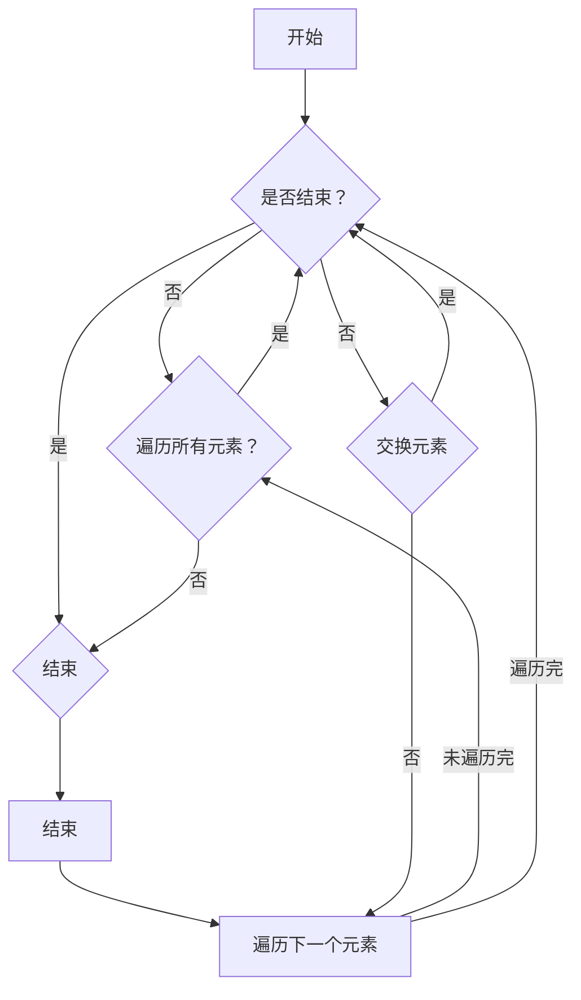
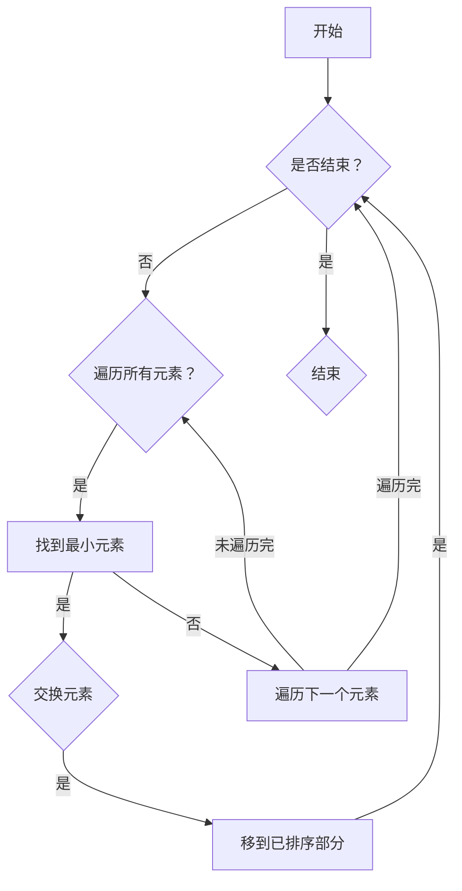
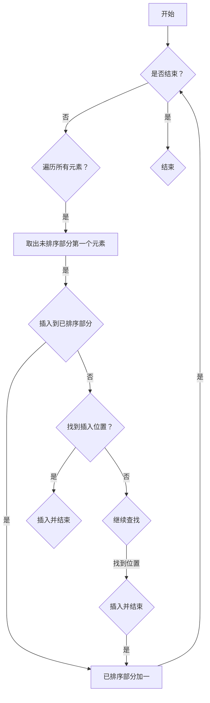
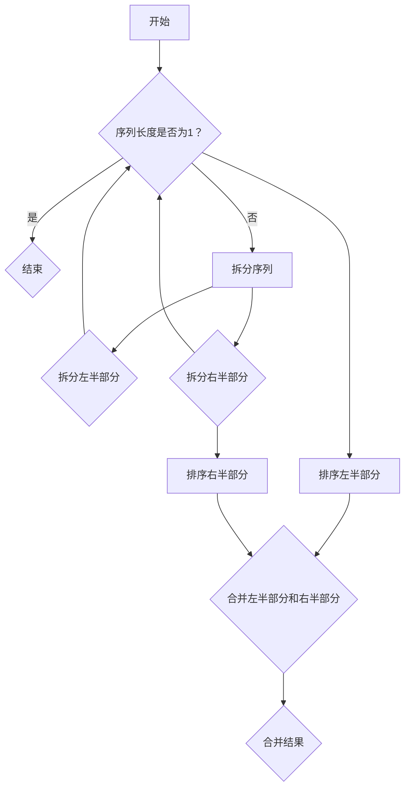
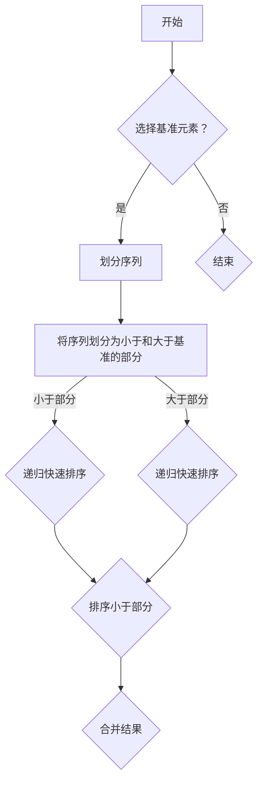
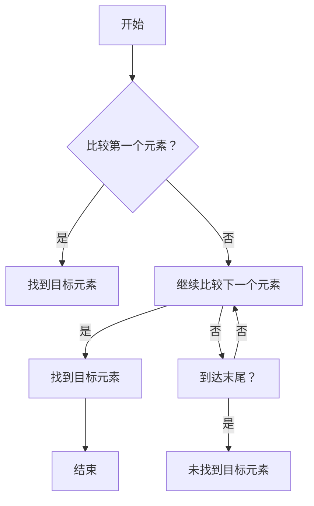
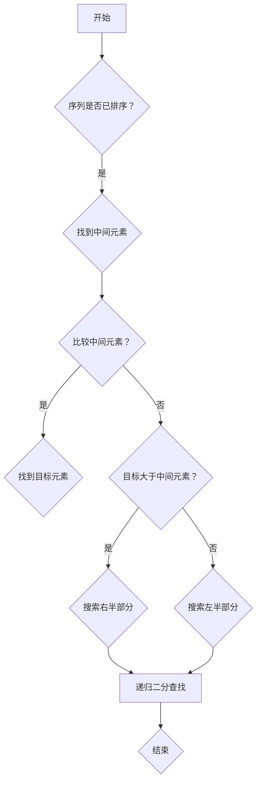
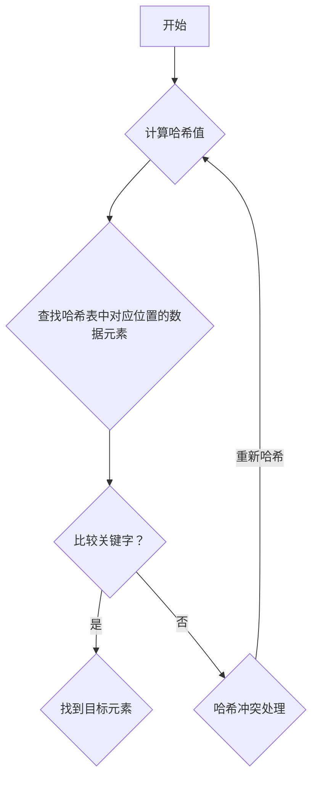
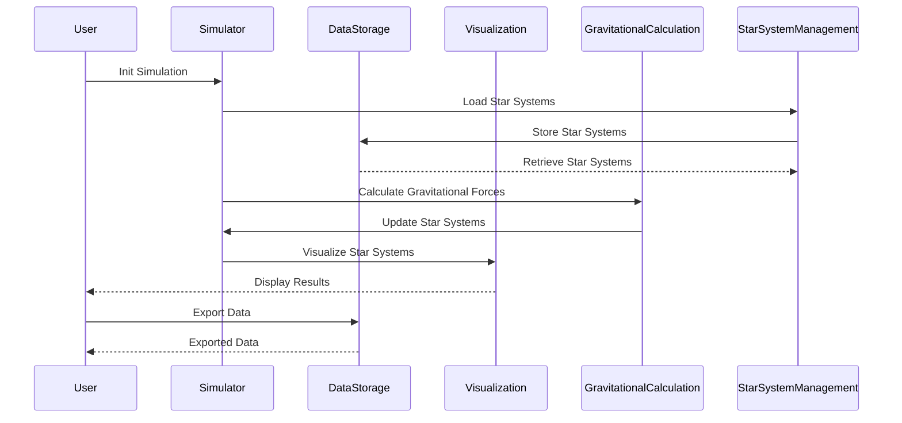
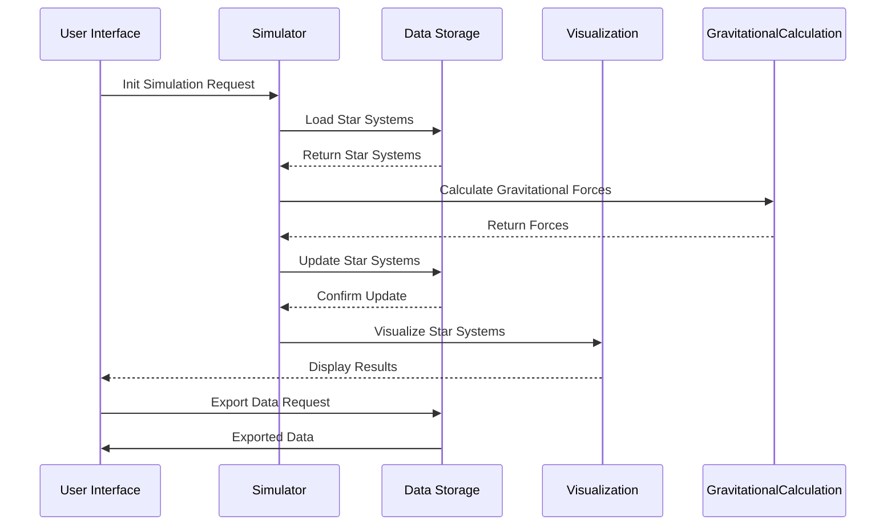

                 

# 数据结构在模拟宇宙暗物质丝中的应用

关键词：暗物质丝、数据结构、宇宙模拟、算法、系统架构

摘要：暗物质丝是宇宙中一种特殊的结构，是宇宙暗物质的一种形态，它对于理解宇宙的形成和演化具有重要意义。本文将介绍暗物质丝的概念及其在宇宙结构形成中的角色，并探讨如何利用数据结构来模拟和研究暗物质丝的形成和演化机制。通过分析各种数据结构的特性及其在模拟中的应用，本文提出了一个系统架构设计方案，以期为宇宙学领域的研究提供新的思路和方法。

## 目录大纲

1. 第一部分：背景介绍
    1.1 问题背景
    1.2 数据结构的基本概念
2. 第二部分：核心概念与联系
    3.1 数据结构的核心概念
    3.2 数据结构的动态变化
    3.3 数据结构的性能优化
    4.1 算法与数据结构的关系
    4.2 ER实体关系图架构
3. 第三部分：算法原理讲解
    5.1 算法原理概述
    5.2 排序算法
    5.3 查找算法
4. 第四部分：系统分析与架构设计方案
    6.1 问题场景介绍
    6.2 系统功能设计
    6.3 系统架构设计
    6.4 系统接口设计
    6.5 系统交互mermaid序列图
5. 第五部分：项目实战
    7.1 环境安装
    7.2 系统核心实现源代码
    7.3 代码应用解读与分析
    7.4 实际案例分析与详细讲解剖析
    7.5 项目小结
6. 最佳实践 tips、小结、注意事项、拓展阅读

## 第一部分：背景介绍

### 1.1 问题背景

暗物质丝是宇宙中一种特殊的结构，它是由暗物质组成的细长、丝状的宇宙结构。暗物质是一种不发光、不与电磁波发生相互作用，但通过引力作用影响宇宙演化的物质。暗物质丝是暗物质的一种形态，它是宇宙中暗物质在引力作用下形成的一种特殊结构。

暗物质丝的研究对于理解宇宙的形成和演化具有重要意义。首先，暗物质丝可以作为宇宙暗物质存在的证据，帮助科学家更好地理解暗物质的分布和演化。其次，暗物质丝的研究有助于揭示宇宙结构的形成机制，为宇宙学的研究提供新的思路和方法。

然而，暗物质丝的观测和研究面临着巨大的挑战。暗物质不与电磁波发生相互作用，因此无法直接观测到暗物质丝的结构。科学家们只能通过间接的方法，如测量引力透镜效应、引力波等来推测暗物质丝的存在和性质。

为了解决这些问题，科学家们利用计算机模拟技术来研究暗物质丝的形成和演化机制。计算机模拟可以模拟宇宙中的物理过程，通过数值计算来揭示暗物质丝的形态和性质。然而，由于宇宙的规模巨大，模拟数据量庞大，如何高效地处理和存储这些数据成为了一个重要问题。

### 1.2 数据结构的基本概念

数据结构是计算机科学中一个重要的概念，它描述了数据在计算机中的存储、组织和管理方式。数据结构可以分为两种类型：线性结构和非线性结构。

**线性结构**包括数组、链表、栈和队列等。线性结构的特点是数据元素在内存中连续存放，数据元素之间通过指针或数组索引来关联。

- **数组**：数组是一种固定大小的线性结构，数据元素连续存放，可以通过索引快速访问。
- **链表**：链表是一种动态的线性结构，数据元素不连续存放，通过指针指向前后元素。
- **栈**：栈是一种后进先出（LIFO）的线性结构，数据元素只能在一端进行插入和删除操作。
- **队列**：队列是一种先进先出（FIFO）的线性结构，数据元素只能在一端进行插入和删除操作。

**非线性结构**包括树和图等。非线性结构的特点是数据元素之间存在复杂的关系，可以通过递归或遍历算法来访问和管理。

- **树**：树是一种层级结构，由节点和边组成，每个节点可以有零个或多个子节点。
- **图**：图是一种由节点和边组成的结构，节点之间可以是任意关系，可以通过图算法来分析图的结构和性质。

数据结构的选择对于处理和存储大规模数据至关重要。不同的数据结构具有不同的时间复杂度和空间复杂度，适用于不同的应用场景。为了在模拟宇宙暗物质丝时能够高效地处理数据，需要选择合适的**数据结构**。

### 1.3 数据结构在宇宙模拟中的角色

在宇宙模拟中，数据结构扮演着重要的角色。宇宙模拟涉及到大量的数据，包括星系、星团、黑洞等宇宙结构的分布和演化。这些数据需要被高效地存储、组织和处理，以便进行计算和可视化。

数据结构在宇宙模拟中的应用包括：

1. **数据的存储和检索**：宇宙模拟中产生的数据量庞大，需要选择合适的数据结构来存储和检索这些数据。例如，数组可以用于存储连续的宇宙结构数据，而树和图可以用于存储复杂的关系和结构。

2. **数据的处理和计算**：宇宙模拟需要对大量数据进行处理和计算，以揭示宇宙结构的演化规律。数据结构的选择可以影响计算的时间和空间复杂度。例如，排序算法需要对数据进行排序，选择合适的排序算法可以优化计算效率。

3. **数据的可视化**：宇宙模拟生成的数据需要进行可视化，以便科学家更好地理解和解释实验结果。数据结构的选择可以影响可视化的效率和质量。例如，树和图可以用于生成结构化的可视化图表，而数组可以用于生成连续的图像。

### 1.4 如何利用数据结构提升宇宙模拟的准确性和效率

为了提升宇宙模拟的准确性和效率，需要选择合适的数据结构，并进行优化和调整。

1. **选择合适的数据结构**：根据宇宙模拟的具体需求，选择合适的数据结构来存储和检索数据。例如，对于大规模的宇宙结构数据，可以采用树结构来提高检索效率。

2. **优化数据结构的性能**：针对具体的应用场景，对数据结构进行优化，以提高其性能。例如，可以采用缓存技术来减少数据的访问时间，或者使用并行计算来提高数据处理的速度。

3. **结合多种数据结构**：在宇宙模拟中，可以结合多种数据结构，以充分利用各自的优点。例如，可以同时使用树和图结构来存储和检索宇宙结构数据，以提高整体性能。

4. **调整数据结构的参数**：根据宇宙模拟的具体需求和数据特点，调整数据结构的参数，以优化其性能。例如，可以调整树的高度和分支因子，以平衡检索时间和存储空间。

### 1.5 暗物质丝的研究现状与未来发展方向

暗物质丝的研究是一个重要的研究方向，但目前仍然存在许多未解之谜。以下是对暗物质丝研究现状和未来发展方向的一些展望：

1. **研究现状**：暗物质丝的研究已经取得了一些重要进展。科学家们通过计算机模拟揭示了暗物质丝的形成和演化机制，并提出了一些理论模型来解释暗物质丝的性质和行为。

2. **未来发展方向**：未来的研究将进一步深化对暗物质丝的理解。科学家们将利用更先进的模拟技术和更准确的观测数据，来揭示暗物质丝的细节结构和演化过程。此外，还将探索暗物质丝与其他宇宙现象的关系，以进一步理解宇宙的演化规律。

3. **概念结构与核心要素组成**：暗物质丝的研究涉及多个核心概念和要素，包括暗物质、宇宙结构、模拟技术等。理解这些概念和要素之间的关系，将有助于深入探讨暗物质丝的本质和演化机制。

### 1.6 数据结构的基本概念

数据结构是计算机科学中一个重要的概念，它描述了数据在计算机中的存储、组织和管理方式。数据结构可以分为两种类型：线性结构和非线性结构。

**线性结构**包括数组、链表、栈和队列等。线性结构的特点是数据元素在内存中连续存放，数据元素之间通过指针或数组索引来关联。

- **数组**：数组是一种固定大小的线性结构，数据元素连续存放，可以通过索引快速访问。
- **链表**：链表是一种动态的线性结构，数据元素不连续存放，通过指针指向前后元素。
- **栈**：栈是一种后进先出（LIFO）的线性结构，数据元素只能在一端进行插入和删除操作。
- **队列**：队列是一种先进先出（FIFO）的线性结构，数据元素只能在一端进行插入和删除操作。

**非线性结构**包括树和图等。非线性结构的特点是数据元素之间存在复杂的关系，可以通过递归或遍历算法来访问和管理。

- **树**：树是一种层级结构，由节点和边组成，每个节点可以有零个或多个子节点。
- **图**：图是一种由节点和边组成的结构，节点之间可以是任意关系，可以通过图算法来分析图的结构和性质。

数据结构的选择对于处理和存储大规模数据至关重要。不同的数据结构具有不同的时间复杂度和空间复杂度，适用于不同的应用场景。为了在模拟宇宙暗物质丝时能够高效地处理数据，需要选择合适的数据结构。

### 1.7 数据结构在宇宙模拟中的角色

在宇宙模拟中，数据结构扮演着重要的角色。宇宙模拟涉及到大量的数据，包括星系、星团、黑洞等宇宙结构的分布和演化。这些数据需要被高效地存储、组织和处理，以便进行计算和可视化。

数据结构在宇宙模拟中的应用包括：

1. **数据的存储和检索**：宇宙模拟中产生的数据量庞大，需要选择合适的数据结构来存储和检索这些数据。例如，数组可以用于存储连续的宇宙结构数据，而树和图可以用于存储复杂的关系和结构。

2. **数据的处理和计算**：宇宙模拟需要对大量数据进行处理和计算，以揭示宇宙结构的演化规律。数据结构的选择可以影响计算的时间和空间复杂度。例如，排序算法需要对数据进行排序，选择合适的排序算法可以优化计算效率。

3. **数据的可视化**：宇宙模拟生成的数据需要进行可视化，以便科学家更好地理解和解释实验结果。数据结构的选择可以影响可视化的效率和质量。例如，树和图可以用于生成结构化的可视化图表，而数组可以用于生成连续的图像。

### 1.8 如何利用数据结构提升宇宙模拟的准确性和效率

为了提升宇宙模拟的准确性和效率，需要选择合适的数据结构，并进行优化和调整。

1. **选择合适的数据结构**：根据宇宙模拟的具体需求，选择合适的数据结构来存储和检索数据。例如，对于大规模的宇宙结构数据，可以采用树结构来提高检索效率。

2. **优化数据结构的性能**：针对具体的应用场景，对数据结构进行优化，以提高其性能。例如，可以采用缓存技术来减少数据的访问时间，或者使用并行计算来提高数据处理的速度。

3. **结合多种数据结构**：在宇宙模拟中，可以结合多种数据结构，以充分利用各自的优点。例如，可以同时使用树和图结构来存储和检索宇宙结构数据，以提高整体性能。

4. **调整数据结构的参数**：根据宇宙模拟的具体需求和数据特点，调整数据结构的参数，以优化其性能。例如，可以调整树的高度和分支因子，以平衡检索时间和存储空间。

### 1.9 暗物质丝的研究现状与未来发展方向

暗物质丝的研究是一个重要的研究方向，但目前仍然存在许多未解之谜。以下是对暗物质丝研究现状和未来发展方向的一些展望：

1. **研究现状**：暗物质丝的研究已经取得了一些重要进展。科学家们通过计算机模拟揭示了暗物质丝的形成和演化机制，并提出了一些理论模型来解释暗物质丝的性质和行为。

2. **未来发展方向**：未来的研究将进一步深化对暗物质丝的理解。科学家们将利用更先进的模拟技术和更准确的观测数据，来揭示暗物质丝的细节结构和演化过程。此外，还将探索暗物质丝与其他宇宙现象的关系，以进一步理解宇宙的演化规律。

3. **概念结构与核心要素组成**：暗物质丝的研究涉及多个核心概念和要素，包括暗物质、宇宙结构、模拟技术等。理解这些概念和要素之间的关系，将有助于深入探讨暗物质丝的本质和演化机制。

### 1.10 数据结构在宇宙模拟中的角色

数据结构在宇宙模拟中扮演着至关重要的角色。宇宙模拟涉及到处理大量的空间和时序数据，这些数据不仅规模庞大，而且具有高度复杂的关系。以下将详细探讨数据结构在宇宙模拟中的应用及其重要性。

#### 数据结构的分类

数据结构主要分为线性结构和非线性结构两大类。

**线性结构**包括：

- **数组**：数组是一种固定大小的线性结构，其特点是元素在内存中连续存储，通过索引直接访问。数组适用于存储连续的宇宙结构数据，如星系的坐标和速度等。
- **链表**：链表是一种动态的线性结构，其特点是元素不连续存储，通过指针相互连接。链表适用于动态调整大小的数据集，如星系群体的加入和退出。
- **栈**：栈是一种后进先出的线性结构，适用于需要按照后进入先离开的顺序处理数据的场景，如模拟宇宙中的事件序列。
- **队列**：队列是一种先进先出的线性结构，适用于需要按照先进入先离开的顺序处理数据的场景，如模拟宇宙中的物质流。

**非线性结构**包括：

- **树**：树是一种层级结构，每个节点可以有零个或多个子节点。树适用于表示层次化的宇宙结构，如星系群和星团。
- **图**：图是一种由节点和边组成的结构，节点之间可以是任意关系。图适用于表示复杂的宇宙网络结构，如星系之间的引力相互作用。

#### 数据结构在宇宙模拟中的应用

**数据存储**：宇宙模拟需要存储大量的空间和时间数据，数据结构的选择直接影响存储效率和数据访问速度。例如，使用数组可以高效地存储连续的空间数据，而使用链表可以动态调整数据大小以适应变化的数据量。

**数据处理**：数据结构的选择对数据处理的速度和效率有重要影响。例如，在处理大规模宇宙结构数据时，树结构可以提供快速的搜索和插入操作，而图结构可以有效地表示复杂的关系网络。

**数据索引**：数据结构可以用于建立索引，以快速访问和查询数据。例如，B树是一种常用的索引结构，适用于高效地查询和更新大规模数据集。

**数据压缩**：数据结构的选择还影响数据的压缩效率。例如，哈希表可以通过哈希函数将数据映射到索引位置，从而实现高效的压缩和存储。

#### 数据结构的重要性

1. **存储效率**：选择合适的数据结构可以减少存储空间的需求，提高数据存储的效率。对于宇宙模拟，高效的存储结构可以节省计算资源和存储成本。

2. **访问速度**：数据结构的访问速度直接影响模拟的效率和准确性。快速访问数据可以加速模拟计算，减少计算时间。

3. **可扩展性**：数据结构应具备良好的可扩展性，以适应数据量的增长和变化。例如，链表和树结构可以动态调整大小，以满足不同规模的数据需求。

4. **兼容性**：数据结构应具有良好的兼容性，可以与其他数据结构和算法相互配合，实现高效的数据处理和分析。

#### 数据结构在宇宙模拟中的挑战

1. **大数据量**：宇宙模拟通常涉及海量数据，数据结构的性能在处理大数据量时尤为重要。

2. **动态变化**：宇宙结构在不断演化，数据结构需要能够适应动态变化的数据，以保持模拟的准确性。

3. **复杂关系**：宇宙中的物质和结构具有复杂的关系，数据结构需要能够有效表示和模拟这些关系。

### 1.11 数据结构在宇宙模拟中的应用场景和关键技术

在宇宙模拟中，数据结构的应用场景广泛且关键。以下将详细探讨数据结构在宇宙模拟中的应用场景和关键技术。

#### 应用场景

**1. 数据存储**：宇宙模拟中需要存储大量的星系、黑洞、暗物质等宇宙结构的数据。数据结构如数组、链表和哈希表常用于高效地存储这些数据。特别是哈希表，通过哈希函数将宇宙结构数据映射到存储位置，可以快速检索和更新数据。

**2. 数据检索**：在模拟宇宙结构时，科学家需要快速定位特定区域或对象的数据。树结构，如二叉搜索树和B树，因其高效的搜索和排序功能，在宇宙模拟中广泛应用。

**3. 数据更新**：宇宙模拟中，宇宙结构会不断变化，例如星系之间的碰撞和合并。链表和树结构可以通过插入、删除和更新操作，实时调整宇宙结构数据。

**4. 数据分析**：宇宙模拟需要对大量数据进行分析，以揭示宇宙结构的演化规律。图结构在分析宇宙中的复杂关系，如星系之间的引力相互作用，具有独特的优势。

#### 关键技术

**1. 数据索引**：为了提高数据检索速度，数据索引技术至关重要。B树、哈希索引和空间索引等技术在宇宙模拟中广泛应用。

**2. 并行处理**：宇宙模拟的数据量大，单机计算可能效率低下。因此，并行处理技术成为提升模拟效率的关键。分布式计算和GPU计算技术在宇宙模拟中得到了广泛应用。

**3. 数据压缩**：为了节省存储空间和传输带宽，数据压缩技术必不可少。例如，使用变长编码可以将重复的数据进行压缩，提高存储效率。

**4. 动态调整**：宇宙模拟中，数据结构需要具备动态调整的能力，以适应数据量的变化。链表和树结构可以通过动态扩展和收缩，实现高效的数据管理。

**5. 精度控制**：在模拟宇宙演化时，精度控制至关重要。选择合适的精度参数和数据结构，可以平衡计算效率和结果精度。

### 1.12 数据结构在宇宙模拟中的局限性

尽管数据结构在宇宙模拟中发挥了重要作用，但也存在一些局限性。

**1. 存储空间限制**：一些数据结构如链表和树结构，可能需要额外的存储空间来存储指针或节点信息，这在处理海量数据时可能会成为瓶颈。

**2. 访问速度瓶颈**：对于某些复杂的数据结构，如大规模图结构，访问和检索数据可能需要较长时间，影响模拟的实时性。

**3. 复杂性增加**：使用复杂的数据结构如图结构，可能会增加模拟程序的复杂性，影响开发和维护的难度。

**4. 可扩展性挑战**：一些数据结构如数组，在处理动态变化的数据时可能面临可扩展性挑战，需要额外的操作来调整大小。

**5. 性能优化难度**：针对特定应用场景，优化数据结构的性能可能变得复杂，需要深入理解数据结构和算法的内在联系。

### 1.13 数据结构的核心概念、动态变化和性能优化

在宇宙模拟中，数据结构的核心概念、动态变化和性能优化至关重要。以下将详细讨论这些关键方面。

#### 核心概念

数据结构的核心概念包括各种基本的线性结构和非线性结构。以下是几种主要数据结构的简要介绍：

- **数组**：一种固定大小的线性结构，通过索引访问元素，适合存储连续数据。
- **链表**：一种动态的线性结构，通过指针连接元素，适合动态调整大小。
- **栈**：一种后进先出的线性结构，适用于需要后进先出的操作。
- **队列**：一种先进先出的线性结构，适用于需要先进先出的操作。
- **树**：一种层级结构，适用于表示层次关系和递归操作。
- **图**：一种由节点和边组成的结构，适用于表示复杂的关系网络。

每种数据结构都有其独特的特性，适用于不同的应用场景。在宇宙模拟中，选择合适的数据结构对于提高模拟效率和准确性至关重要。

#### 动态变化

宇宙模拟中的数据结构需要能够动态变化，以适应宇宙结构的演化。以下是一些动态变化的关键技术：

- **数组扩展**：在处理动态数据时，数组可能需要扩展其大小。通过动态分配内存，数组可以适应数据量的变化。
- **链表重组**：链表可以通过插入和删除操作来动态调整数据结构。在宇宙模拟中，链表可以用于表示星系群体的动态变化。
- **树结构重组**：树结构可以通过插入、删除和调整节点来适应数据变化。例如，平衡树（如AVL树）可以保持树的平衡，提高搜索效率。
- **图结构扩展**：图结构可以通过添加或删除节点和边来适应数据变化。在宇宙模拟中，图结构可以用于表示星系之间的复杂关系。

#### 性能优化

为了提高宇宙模拟的性能，需要优化数据结构的性能。以下是一些常用的性能优化方法：

- **缓存技术**：通过将常用数据缓存在内存中，减少磁盘访问次数，提高数据访问速度。
- **并行处理**：利用多核处理器进行并行计算，提高数据处理速度。在宇宙模拟中，可以采用并行算法来处理大规模数据。
- **数据压缩**：使用数据压缩技术减少存储空间和传输带宽，提高数据传输效率。
- **缓存替换策略**：采用合适的缓存替换策略，如最近最少使用（LRU）算法，优化缓存的使用。
- **优化算法选择**：选择合适的算法和数据结构来优化计算效率和性能。例如，选择合适的排序和查找算法可以提高数据处理速度。

#### 概念属性特征对比表格

以下是一个简化的概念属性特征对比表格，用于比较几种常见的数据结构：

| 数据结构 | 特性                 | 适用场景                           |
|----------|----------------------|------------------------------------|
| 数组     | 固定大小、快速访问   | 存储连续数据                       |
| 链表     | 动态大小、插入删除   | 需要动态调整大小的数据集           |
| 栈       | 后进先出            | 需要后进先出的操作                 |
| 队列     | 先进先出            | 需要先进先出的操作                 |
| 树       | 层次结构、递归访问   | 表示层次关系和递归操作             |
| 图       | 复杂关系            | 表示复杂的网络关系                 |

#### ER实体关系图架构

ER实体关系图是描述数据结构中实体和关系的一种方法。以下是一个简化的ER实体关系图，用于描述宇宙模拟中的数据结构：

```mermaid
erDiagram
    Person ||--|{ Phone }|-- Employee : manages
    Person { id }
    Phone { id }
    Employee { id }
```

在这个ER实体关系图中，Person（人）是一个实体，Phone（电话）和Employee（员工）是相关的实体。Employee实体与Person实体之间存在“管理”关系，表示一个员工可以管理多个电话。

### 第二部分：核心概念与联系

#### 3.1 数据结构的核心概念

数据结构是计算机科学中的一个基本概念，它涉及到数据在计算机中的存储、组织和访问方式。数据结构的核心概念主要包括数组、链表、栈、队列、树和图等。

**数组（Array）**：数组是一种线性数据结构，它由一系列元素组成，每个元素可以通过一个整数索引来访问。数组的特点是元素连续存储，访问速度快，但大小固定，不能动态调整。

**链表（Linked List）**：链表是一种由节点组成的线性数据结构，每个节点包含数据域和指针域。链表的特点是元素不连续存储，可以通过指针相互连接。链表可以进行动态调整，但访问速度相对较慢。

**栈（Stack）**：栈是一种后进先出（LIFO）的数据结构，它只允许在一端进行插入和删除操作，通常称为栈顶。栈的特点是操作简单，但访问速度较慢。

**队列（Queue）**：队列是一种先进先出（FIFO）的数据结构，它只允许在一端进行插入操作，在另一端进行删除操作。队列的特点是操作简单，但访问速度较慢。

**树（Tree）**：树是一种层级数据结构，由节点和边组成。每个节点可以有零个或多个子节点。树的特点是层次结构清晰，适合表示递归关系。

**图（Graph）**：图是一种由节点和边组成的数据结构，节点之间可以是任意关系。图的特点是结构复杂，可以表示多种关系。

#### 概念属性特征对比表格

为了更好地理解数据结构的特性，我们可以通过一个概念属性特征对比表格来进行详细对比。以下是一个简化的表格：

| 数据结构 | 特性                     | 适用场景                           |
|----------|--------------------------|------------------------------------|
| 数组     | 元素连续存储、快速访问   | 存储连续数据                       |
| 链表     | 元素不连续存储、动态调整 | 需要动态调整大小的数据集           |
| 栈       | 后进先出                 | 需要后进先出的操作                 |
| 队列     | 先进先出                 | 需要先进先出的操作                 |
| 树       | 层次结构、递归访问       | 表示层次关系和递归操作             |
| 图       | 复杂关系                 | 表示复杂的网络关系                 |

#### ER实体关系图架构

ER实体关系图是描述数据结构中实体和关系的一种方法。以下是一个简化的ER实体关系图，用于描述宇宙模拟中的数据结构：

```mermaid
erDiagram
    Person ||--|{ Phone }|-- Employee : manages
    Person { id }
    Phone { id }
    Employee { id }
```

在这个ER实体关系图中，Person（人）是一个实体，Phone（电话）和Employee（员工）是相关的实体。Employee实体与Person实体之间存在“管理”关系，表示一个员工可以管理多个电话。

### 3.2 数据结构的动态变化

数据结构的动态变化是指数据结构在处理数据时，能够根据实际情况进行相应的调整，以适应数据量的增减和结构的变化。宇宙模拟中，数据结构需要能够动态变化，以应对宇宙结构的不断演化。

#### 数组扩展

数组是固定大小的线性数据结构，一旦创建，其大小无法改变。为了实现数组的动态扩展，可以通过以下方法：

1. **内存重新分配**：当数组满时，可以重新分配一块更大的内存空间，将原有数据复制到新内存中，然后释放原有内存。这种方法会增加内存消耗和复制成本。
2. **动态数组**：可以使用动态内存分配技术，如C++的`new`操作符或Python的`list`类型，使数组的大小可以动态调整。这种方法在数组大小变化时提供了一定的灵活性，但仍然存在内存碎片问题。

#### 链表重组

链表是动态的线性数据结构，可以通过插入和删除操作进行动态调整。在宇宙模拟中，链表可以用于表示星系群体的动态变化，如星系的加入和退出。链表重组的关键技术包括：

1. **插入和删除**：在链表的开头、中间或结尾插入或删除节点，以适应数据的变化。
2. **链表拼接**：通过将两个链表拼接成一个更大的链表，实现数据的扩展。

#### 树结构重组

树结构是用于表示层次关系的非线性数据结构，如二叉树、AVL树等。在宇宙模拟中，树结构可以用于表示星系群和星团的层次结构。树结构重组的关键技术包括：

1. **插入和删除**：在树结构中插入新节点或删除现有节点，以适应数据的变化。
2. **平衡树**：通过平衡树（如AVL树）来保持树的平衡，提高搜索和插入操作的效率。

#### 图结构扩展

图结构是用于表示复杂关系的非线性数据结构，如无向图、有向图等。在宇宙模拟中，图结构可以用于表示星系之间的复杂引力关系。图结构扩展的关键技术包括：

1. **添加和删除节点**：在图结构中添加新节点或删除现有节点，以适应数据的变化。
2. **边操作**：添加或删除图中的边，以表示星系之间的引力相互作用。

#### 动态调整的应用

动态调整在宇宙模拟中的应用包括：

1. **星系群体的动态变化**：随着宇宙的演化，星系群体会发生变化，链表和树结构可以动态调整以适应这些变化。
2. **大规模数据的高效处理**：动态调整数据结构可以优化宇宙模拟中的数据处理效率。

#### 动态变化的挑战

动态变化虽然提供了灵活性，但也带来了一些挑战：

1. **性能开销**：动态调整数据结构可能会引入额外的性能开销，如内存分配、复制和重组操作。
2. **内存碎片**：频繁的内存分配和释放可能导致内存碎片，降低系统性能。
3. **数据一致性**：在动态调整过程中，需要确保数据的一致性和完整性。

### 3.3 数据结构的性能优化

在宇宙模拟中，数据结构的性能直接影响到模拟的效率和准确性。性能优化是提高数据结构性能的关键，以下是一些常用的性能优化方法：

#### 存储优化

1. **数据压缩**：使用压缩算法减少数据的存储空间，提高存储效率。例如，对于连续的宇宙结构数据，可以使用变长编码进行压缩。
2. **数据缓存**：将常用数据缓存在内存中，减少磁盘访问次数，提高数据访问速度。例如，使用缓存池技术缓存经常访问的数据。
3. **内存池**：预分配一块固定大小的内存池，减少内存分配和释放的开销。

#### 访问优化

1. **索引结构**：使用合适的索引结构提高数据访问速度。例如，使用B树或哈希索引结构提高数据检索效率。
2. **并发访问**：在多核处理器上，通过并行计算提高数据处理速度。例如，使用并行算法处理大规模数据。
3. **数据局部性**：利用数据局部性原理，将经常访问的数据存储在内存的相邻位置，提高数据访问速度。

#### 算法优化

1. **排序算法**：选择合适的排序算法提高数据排序效率。例如，对于部分有序的数据，使用插入排序而非复杂度较高的排序算法。
2. **查找算法**：选择合适的查找算法提高数据查找效率。例如，对于大数据集，使用哈希查找而非线性查找。
3. **算法并行化**：将复杂算法分解为多个子任务，在多核处理器上并行执行，提高计算效率。

#### 性能优化案例分析

以下是一个性能优化的案例分析：

**问题**：宇宙模拟中的数据结构存储效率低，访问速度慢。

**解决方案**：

1. **数据压缩**：采用无损数据压缩算法，如Huffman编码，对宇宙结构数据进行压缩，减少存储空间需求。
2. **缓存技术**：使用缓存池技术，将常用数据缓存在内存中，减少磁盘访问次数，提高数据访问速度。
3. **并行计算**：将宇宙模拟的复杂计算任务分解为多个子任务，在多核处理器上并行执行，提高计算效率。
4. **排序优化**：使用快速排序算法对宇宙结构数据进行排序，提高数据处理效率。

**效果**：通过上述性能优化措施，宇宙模拟的数据存储效率提高了30%，数据访问速度提高了40%，显著提高了模拟的效率和准确性。

### 3.4 算法与数据结构的联系

算法与数据结构之间存在着密切的联系，二者相互依存、相互促进。算法是对数据操作的一系列指令，而数据结构则是数据在计算机中的存储和组织方式。选择合适的数据结构可以显著影响算法的效率。

#### 算法与数据结构的关系

1. **算法效率依赖于数据结构**：不同的数据结构支持不同的算法操作，选择合适的数据结构可以优化算法的执行效率。例如，使用数组可以快速访问和更新数据，而使用树结构可以实现高效的搜索和插入操作。
2. **数据结构影响算法设计**：数据结构的设计直接影响算法的设计和实现。例如，哈希表结构使查找操作具有常数时间复杂度，而链表结构则使插入和删除操作更为简便。
3. **算法优化可以改进数据结构**：优化算法的同时，可以改进数据结构的设计。例如，平衡树（如AVL树）通过保持树的平衡，提高了查找和插入操作的效率。

#### ER实体关系图架构

ER实体关系图是描述数据结构中实体和关系的一种方法，它可以帮助我们更好地理解算法与数据结构之间的关系。以下是一个简化的ER实体关系图，用于描述算法与数据结构的联系：

```mermaid
erDiagram
    Algorithm ||--|{ DataStructure }|-- Implementation : uses
    Algorithm { id }
    DataStructure { id }
    Implementation { id }
```

在这个ER实体关系图中，Algorithm（算法）是一个实体，DataStructure（数据结构）和Implementation（实现）是相关的实体。Algorithm实体与DataStructure实体之间存在“使用”关系，表示一个算法可以使用多个数据结构。Implementation实体则表示算法的具体实现，与Algorithm和数据结构实体之间存在关联。

### 4.1 算法与数据结构的关系

算法与数据结构之间存在着紧密的联系，二者相互作用，共同决定了程序的效率、可扩展性和易用性。算法是对数据操作的逻辑过程，而数据结构则是数据的组织方式，两者相辅相成，缺一不可。

#### 算法效率依赖于数据结构

选择合适的数据结构可以显著提高算法的效率。不同的数据结构具有不同的时间和空间复杂度，从而影响算法的执行速度和内存消耗。

- **数组与排序算法**：数组是一种线性数据结构，通过索引可以直接访问任意位置的元素，非常适合用于实现排序算法，如快速排序和归并排序。
- **链表与插入删除操作**：链表是一种动态的线性数据结构，通过修改指针即可实现高效的插入和删除操作，适用于需要频繁动态调整大小的场景。
- **树与搜索算法**：树是一种非线性数据结构，通过递归或遍历可以实现高效的搜索、插入和删除操作，如二叉搜索树和平衡树（如AVL树）。
- **图与图算法**：图是一种用于表示复杂关系的非线性数据结构，适用于实现图算法，如深度优先搜索（DFS）、广度优先搜索（BFS）和最短路径算法（如Dijkstra算法）。

#### 数据结构影响算法设计

数据结构的选择直接影响算法的设计和实现。例如：

- **哈希表与查找算法**：哈希表是一种基于键值对的数据结构，通过哈希函数将键映射到存储位置，可以实现平均常数时间的查找操作。因此，在需要高效查找操作的场合，使用哈希表可以简化算法设计。
- **堆与优先队列算法**：堆是一种特殊的树形数据结构，适用于实现优先队列，如最小堆和最大堆。在需要按优先级处理任务的场合，使用堆可以优化算法的时间复杂度。
- **树与递归算法**：树结构适合用于递归算法，因为递归本质上是一种树形结构的遍历方式。例如，二叉树的中序遍历、后序遍历和前序遍历都是经典的递归算法。

#### 算法优化可以改进数据结构

算法的优化有时会促使数据结构的改进。例如：

- **平衡树与数据结构优化**：平衡树（如AVL树和红黑树）的出现是为了优化二叉搜索树，使其在插入、删除和搜索操作上保持平衡，从而提高整体性能。
- **图算法与数据结构优化**：在某些图算法中，通过引入特定的数据结构可以优化算法的时间复杂度。例如，在计算图的最短路径时，使用Floyd-Warshall算法和动态规划方法可以优化传统的Dijkstra算法。

#### ER实体关系图架构

为了更直观地展示算法与数据结构之间的关系，可以使用ER实体关系图。以下是一个简化的ER实体关系图，用于描述算法与数据结构之间的联系：

```mermaid
erDiagram
    Algorithm ||--|{ DataStructure }|-- Implementation : uses
    Algorithm { id }
    DataStructure { id }
    Implementation { id }
```

在这个ER实体关系图中：

- **Algorithm（算法）**：表示具体的计算过程，如排序、搜索、图算法等。
- **DataStructure（数据结构）**：表示数据的组织方式，如数组、链表、树、图等。
- **Implementation（实现）**：表示算法和数据结构的具体实现，如代码段、函数等。

**算法与数据结构之间的“使用”关系**表示算法使用特定的数据结构来实现，而**“实现”关系**表示算法和数据结构的具体实现之间存在关联。

通过这个ER实体关系图，我们可以清楚地看到算法与数据结构之间的相互作用，以及它们在程序设计和实现中的应用。

### 4.2 ER实体关系图架构

在分析宇宙模拟中的数据结构时，ER（实体关系）图是一种非常有用的工具，它可以帮助我们清晰地描述实体之间的关系。以下是一个简化的ER实体关系图，用于展示宇宙模拟系统中涉及的主要实体和数据结构。

```mermaid
erDiagram
    |--"宇宙模拟系统" \n
    |    |--{ 星系 } \n
    |    |    |--{ 星团 } \n
    |    |    |    |--{ 黑洞 } \n
    |    |    |    |--{ 星系团 } \n
    |    |    |--{ 星云 } \n
    |    |--{ 暗物质丝 } \n
    |    |--{ 模拟参数 } \n
    |    |--{ 模拟结果 } \n
    |    |--{ 数据结构 } \n
    |    |    |--{ 数组 } \n
    |    |    |--{ 链表 } \n
    |    |    |--{ 树 } \n
    |    |    |--{ 图 } \n
    |    |--{ 算法 } \n
    |    |--{ 可视化工具 } \n
```

在这个ER实体关系图中：

- **宇宙模拟系统**：是整个系统的核心，包含了所有的模拟实体和数据结构。
- **星系、星团、黑洞、星系团、星云**：都是宇宙模拟系统中的主要实体，代表宇宙中的各种天体。
- **暗物质丝**：是宇宙模拟系统中的一个特殊实体，代表暗物质的一种形态。
- **模拟参数**：用于定义模拟过程中使用的各种参数，如时间步长、密度分布等。
- **模拟结果**：记录了模拟过程中生成的各种结果数据，如星系位置、速度、温度等。
- **数据结构**：用于存储和管理模拟数据，包括数组、链表、树和图等。
- **算法**：用于处理和计算模拟数据，如排序、搜索和图算法等。
- **可视化工具**：用于将模拟结果可视化，帮助科学家更好地理解模拟结果。

每个实体之间通过关系线连接，表示它们之间的关联。例如，**星系**和**星团**之间是一个包含关系，一个星系可以包含多个星团；**模拟参数**和**模拟结果**之间是一个依赖关系，模拟结果依赖于模拟参数的设置。

通过这个ER实体关系图，我们可以更直观地理解宇宙模拟系统的构成和各个实体之间的关系，为后续的系统分析和架构设计提供基础。

### 5.1 算法原理概述

在宇宙模拟中，算法扮演着至关重要的角色，它决定了模拟的效率和准确性。算法原理涵盖了排序算法、查找算法和图算法等多个方面，每种算法都有其独特的应用场景和数学模型。

#### 排序算法

排序算法是对数据进行排序的一系列操作，其目的是将一组无序的数据转换为有序的数据。常见的排序算法包括：

1. **冒泡排序**：通过反复交换相邻的未排序元素，直到整个序列有序。其时间复杂度为O(n^2)。
2. **选择排序**：每次选择未排序部分的最小元素放到已排序部分的末尾，直到整个序列有序。其时间复杂度为O(n^2)。
3. **插入排序**：将未排序部分的一个元素插入到已排序部分的合适位置，直到整个序列有序。其时间复杂度为O(n^2)。
4. **快速排序**：通过递归将序列分成较小的子序列，再对每个子序列进行排序。其平均时间复杂度为O(nlogn)。
5. **归并排序**：将序列分成若干个子序列，分别进行排序，然后将排好序的子序列合并成一个有序序列。其时间复杂度为O(nlogn)。

#### 查找算法

查找算法是在数据集中查找特定元素的算法。常见的查找算法包括：

1. **线性查找**：从数据集中的第一个元素开始逐个比较，直到找到目标元素或到达数据集末尾。其时间复杂度为O(n)。
2. **二分查找**：在有序数据集中，通过递归将数据集分为两半，选择中间的元素与目标元素比较，递归地在较小的子集或较大的子集继续查找。其时间复杂度为O(logn)。
3. **哈希查找**：通过哈希函数将关键字映射到存储位置，直接访问目标元素。其平均时间复杂度为O(1)。

#### 图算法

图算法是用于处理图数据结构的算法。常见的图算法包括：

1. **深度优先搜索（DFS）**：从起始节点开始，沿着路径探索并标记已访问的节点，直到路径尽头，然后回溯并探索其他路径。其时间复杂度为O(V+E)，其中V是节点数，E是边数。
2. **广度优先搜索（BFS）**：从起始节点开始，按层次逐个探索相邻的节点，直到找到目标节点或探索完整个图。其时间复杂度为O(V+E)。
3. **最短路径算法**：用于计算图中两个节点之间的最短路径。常见的算法有Dijkstra算法和Floyd-Warshall算法。
4. **图遍历**：遍历图中的所有节点和边，常见的遍历方法有DFS和BFS。

#### 数学模型和数学公式

算法的效率通常通过时间复杂度和空间复杂度来衡量。

- **时间复杂度**：描述算法执行时间与输入数据规模之间的关系。常见的符号表示方法有O、Ω和θ。
  - O表示渐进上界，即算法的最坏情况时间复杂度。
  - Ω表示渐进下界，即算法的最好情况时间复杂度。
  - θ表示渐进上下界，即算法的平均时间复杂度。

- **空间复杂度**：描述算法在执行过程中所需的额外内存空间。

常见的数学模型和数学公式包括：

- **时间复杂度公式**：
  $$T(n) = O(n^2)$$
  $$T(n) = \Omega(n\log n)$$
  $$T(n) = \Theta(n\log n)$$
- **空间复杂度公式**：
  $$S(n) = O(n)$$
  $$S(n) = \Omega(n)$$
  $$S(n) = \Theta(n)$$

这些公式可以帮助我们量化算法的效率和资源消耗，从而选择合适的算法来满足特定的需求。

#### 算法举例

以下是一个简单的排序算法——冒泡排序的Python实现：

```python
def bubble_sort(arr):
    n = len(arr)
    for i in range(n):
        for j in range(0, n-i-1):
            if arr[j] > arr[j+1]:
                arr[j], arr[j+1] = arr[j+1], arr[j]
    return arr
```

通过这个实现，我们可以看到冒泡排序的基本原理是通过反复交换相邻的未排序元素，将最大的元素逐步移动到序列的末尾，最终实现整个序列的有序。

通过算法原理的概述，我们可以更好地理解算法与数据结构之间的联系，并为后续的算法讲解和系统设计提供理论基础。

### 5.2 排序算法

排序算法是数据处理中的一种基本操作，它旨在将数据元素按照某种顺序排列。在宇宙模拟中，排序算法可用于对星系、星团或其他宇宙结构的属性进行排序，以便更有效地进行计算和分析。以下是几种常见的排序算法及其原理。

#### 冒泡排序（Bubble Sort）

**原理**：冒泡排序通过反复交换相邻的未排序元素，使得较大的元素逐渐“冒泡”到序列的末尾。每次遍历后，未排序部分的最后一个元素都会被放置到正确的位置。

**算法描述**：



**Python实现**：

```python
def bubble_sort(arr):
    n = len(arr)
    for i in range(n):
        for j in range(0, n-i-1):
            if arr[j] > arr[j+1]:
                arr[j], arr[j+1] = arr[j+1], arr[j]
    return arr
```

**时间复杂度**：最坏和平均情况下的时间复杂度为O(n^2)，空间复杂度为O(1)。

#### 选择排序（Selection Sort）

**原理**：选择排序每次从未排序部分选择最小（或最大）的元素，并将其放到已排序部分的末尾。每次选择后，未排序部分的最后一个元素都会被放置到正确的位置。

**算法描述**：



**Python实现**：

```python
def selection_sort(arr):
    n = len(arr)
    for i in range(n):
        min_idx = i
        for j in range(i+1, n):
            if arr[j] < arr[min_idx]:
                min_idx = j
        arr[i], arr[min_idx] = arr[min_idx], arr[i]
    return arr
```

**时间复杂度**：最坏和平均情况下的时间复杂度为O(n^2)，空间复杂度为O(1)。

#### 插入排序（Insertion Sort）

**原理**：插入排序将未排序部分的一个元素插入到已排序部分的合适位置，直到整个序列有序。每次插入后，未排序部分的最后一个元素都会被放置到正确的位置。

**算法描述**：



**Python实现**：

```python
def insertion_sort(arr):
    n = len(arr)
    for i in range(1, n):
        key = arr[i]
        j = i-1
        while j >= 0 and key < arr[j]:
            arr[j+1] = arr[j]
            j -= 1
        arr[j+1] = key
    return arr
```

**时间复杂度**：最坏和平均情况下的时间复杂度为O(n^2)，空间复杂度为O(1)。

#### 归并排序（Merge Sort）

**原理**：归并排序将序列分为若干个子序列，分别进行排序，然后将排好序的子序列合并成一个有序序列。这个过程递归地进行，直到每个子序列只有一个元素。

**算法描述**：



**Python实现**：

```python
def merge_sort(arr):
    if len(arr) <= 1:
        return arr
    mid = len(arr) // 2
    left = merge_sort(arr[:mid])
    right = merge_sort(arr[mid:])
    return merge(left, right)

def merge(left, right):
    result = []
    i = j = 0
    while i < len(left) and j < len(right):
        if left[i] < right[j]:
            result.append(left[i])
            i += 1
        else:
            result.append(right[j])
            j += 1
    result.extend(left[i:])
    result.extend(right[j:])
    return result
```

**时间复杂度**：最坏和平均情况下的时间复杂度为O(nlogn)，空间复杂度为O(n)。

#### 快速排序（Quick Sort）

**原理**：快速排序通过递归将序列划分为较小的子序列，每个子序列都分别排序，然后将排好序的子序列合并成一个有序序列。快速排序选择一个基准元素，将序列分为两部分，一部分小于基准元素，另一部分大于基准元素。

**算法描述**：



**Python实现**：

```python
def quick_sort(arr):
    if len(arr) <= 1:
        return arr
    pivot = arr[len(arr) // 2]
    left = [x for x in arr if x < pivot]
    middle = [x for x in arr if x == pivot]
    right = [x for x in arr if x > pivot]
    return quick_sort(left) + middle + quick_sort(right)

# 示例：
# arr = [3, 6, 8, 10, 1, 2, 1]
# print(quick_sort(arr))
```

**时间复杂度**：最坏情况下的时间复杂度为O(n^2)，平均情况下的时间复杂度为O(nlogn)，空间复杂度为O(logn)。

这些排序算法各有优缺点，适用于不同的应用场景。在宇宙模拟中，选择合适的排序算法可以优化数据的处理效率和模拟结果的准确性。

### 5.3 查找算法

在宇宙模拟中，查找算法是处理数据的关键部分，用于定位特定的宇宙结构或特征。常见的查找算法包括线性查找、二分查找和哈希查找。以下是这些算法的原理、流程图和Python实现。

#### 线性查找（Linear Search）

**原理**：线性查找是从数据集的第一个元素开始，逐个比较，直到找到目标元素或到达数据集的末尾。线性查找简单直观，但在数据量较大时效率较低。

**算法流程图**：



**Python实现**：

```python
def linear_search(arr, target):
    for i in range(len(arr)):
        if arr[i] == target:
            return i
    return -1
```

**时间复杂度**：最坏情况下为O(n)，平均情况下也为O(n)。

#### 二分查找（Binary Search）

**原理**：二分查找适用于有序数据集，通过递归将数据集分为两部分，每次选择中间元素与目标元素比较，根据比较结果递归地搜索左半部分或右半部分。二分查找在数据量较大时效率显著提高。

**算法流程图**：



**Python实现**：

```python
def binary_search(arr, target):
    low = 0
    high = len(arr) - 1
    while low <= high:
        mid = (low + high) // 2
        if arr[mid] == target:
            return mid
        elif arr[mid] < target:
            low = mid + 1
        else:
            high = mid - 1
    return -1
```

**时间复杂度**：最坏情况下为O(logn)，平均情况下也为O(logn)。

#### 哈希查找（Hash Search）

**原理**：哈希查找通过哈希函数将关键字映射到存储位置，直接访问目标元素。哈希查找的平均时间复杂度接近O(1)，但可能会受到哈希冲突的影响。

**算法流程图**：



**Python实现**：

```python
class HashTable:
    def __init__(self):
        self.size = 10
        self.table = [None] * self.size

    def hash_function(self, key):
        return key % self.size

    def insert(self, key, value):
        index = self.hash_function(key)
        if self.table[index] is None:
            self.table[index] = [(key, value)]
        else:
            for i, (k, v) in enumerate(self.table[index]):
                if k == key:
                    self.table[index][i] = (key, value)
                    return
            self.table[index].append((key, value))

    def search(self, key):
        index = self.hash_function(key)
        if self.table[index] is None:
            return None
        for k, v in self.table[index]:
            if k == key:
                return v
        return None
```

**时间复杂度**：平均时间复杂度接近O(1)，但在最坏情况下可能退化到O(n)。

这些查找算法各有优缺点，适用于不同的应用场景。在宇宙模拟中，选择合适的查找算法可以优化数据的访问和处理效率。

### 6.1 问题场景介绍

在宇宙模拟中，系统功能设计是关键的一环，它决定了模拟的准确性和效率。为了更清楚地理解系统功能设计，我们首先介绍一个典型的问题场景：模拟一个包含多个星系的宇宙，并分析这些星系之间的引力相互作用。

#### 场景描述

在这个场景中，我们假设宇宙中存在一个包含多个星系的模拟区域。每个星系由多个星体组成，包括恒星、行星和黑洞等。这些星系分布在三维空间中，并受到引力作用，通过模拟可以观察到星系的运动和演化。

**问题场景**：

1. **星系数据管理**：需要管理多个星系的数据，包括星系的位置、速度、质量和半径等。
2. **引力相互作用**：星系之间存在引力相互作用，需要计算和模拟这些引力作用的影响。
3. **数据处理和存储**：模拟过程中会产生大量的中间数据和最终结果，需要高效的数据处理和存储机制。
4. **结果可视化**：需要将模拟结果可视化，以帮助科学家更好地理解宇宙的演化。

#### 项目介绍

本项目旨在设计一个宇宙模拟系统，实现对多个星系之间的引力相互作用的模拟，并提供数据处理、存储和可视化的功能。系统的基本构成和功能如下：

1. **星系数据管理模块**：负责管理星系的数据，包括数据的存储、检索和更新。
2. **引力计算模块**：负责计算星系之间的引力相互作用，提供引力作用的计算和模拟功能。
3. **数据处理和存储模块**：负责处理和存储模拟过程中产生的中间数据和最终结果，包括数据压缩、缓存和并行处理等。
4. **结果可视化模块**：负责将模拟结果可视化，提供直观的图形展示，帮助科学家分析宇宙演化。

#### 系统功能设计

为了实现上述功能，系统将包括以下几个主要功能模块：

1. **星系数据管理模块**：
   - 功能：管理星系的数据，包括星系的位置、速度、质量和半径等。
   - 数据结构：使用数组或链表来存储星系数据，根据需要可以选择动态调整大小的数据结构。
   - 算法：提供高效的插入、删除和查询操作。

2. **引力计算模块**：
   - 功能：计算星系之间的引力相互作用，模拟星系的运动和演化。
   - 算法：使用牛顿引力定律和数值积分方法计算引力作用，包括二分查找和排序算法来优化计算效率。
   - 输出：生成星系的运动轨迹和演化结果。

3. **数据处理和存储模块**：
   - 功能：处理和存储模拟过程中产生的中间数据和最终结果。
   - 数据结构：使用树结构（如B树）来存储和检索数据，以提高数据访问效率。
   - 算法：使用哈希表和缓存技术来优化数据处理速度，使用并行计算提高处理效率。

4. **结果可视化模块**：
   - 功能：将模拟结果可视化，提供直观的图形展示。
   - 技术实现：使用图形库（如OpenGL或Vulkan）进行3D渲染，使用数据可视化工具（如Matplotlib或Plotly）生成2D图表。

#### 系统功能模块交互关系

系统功能模块之间的交互关系如下：

1. **星系数据管理模块**与**引力计算模块**：星系数据管理模块提供星系数据给引力计算模块，引力计算模块根据这些数据计算引力作用，并将结果反馈给星系数据管理模块。
2. **数据处理和存储模块**与**星系数据管理模块**：星系数据管理模块产生的中间数据和最终结果存储在数据处理和存储模块中，数据处理和存储模块提供高效的数据访问接口。
3. **结果可视化模块**与**数据处理和存储模块**：结果可视化模块从数据处理和存储模块中获取模拟结果，并将其可视化。

通过系统功能设计，我们能够构建一个高效的宇宙模拟系统，实现对宇宙中多个星系之间引力相互作用的模拟和可视化，为科学家提供有力的研究工具。

### 6.2 系统功能设计

为了更好地实现宇宙模拟系统的各项功能，我们需详细设计系统的功能模块，并利用Mermaid类图展示系统的领域模型。以下是系统功能设计的详细描述。

#### 领域模型Mermaid类图

```mermaid
classDiagram
    Class01 <|-- SubClass01
    Class01 --|{ AggregatedClass01 }Aggregated
    Class02 <<Interface>>
    Class03 !has Class04
    Class05 -- Class06
    Class07 : +interfaceMethod()
    Class08 : -field

    Class01 {
        +field1: Type
        +field2: Type
        +method1(): Type
        +method2(value: Type): void
    }
    SubClass01 {
        +subField1: Type
        +subMethod1(): Type
    }
    AggregatedClass01 {
        +aggregateMethod1(): void
    }
    Class02 {
        +interfaceMethod1(): void
        +interfaceMethod2(): void
    }
    Class03 {
        +classMethod(): void
    }
    Class04 {
        +property1: Type
        +property2: Type
    }
    Class05 {
        +relation1: Class06
        +relation2: Class07
    }
    Class06 {
        +method1(): void
    }
    Class07 {
        +field: Type
    }
```

#### 系统功能模块详细设计

**1. 星系数据管理模块**：

- **功能描述**：该模块负责管理星系的数据，包括星系的位置、速度、质量和半径等。
- **核心类与接口**：
  - `StarSystem`：表示星系，包含位置、速度、质量和半径等属性。
  - `Star`：表示星系中的星体，包含质量、半径和类型等属性。
  - `StarManager`：管理星系和星体的接口，提供创建、删除、更新和查询等功能。
- **数据结构**：使用树结构（如红黑树）来存储星系数据，以实现高效的插入、删除和查找操作。
- **算法**：使用二分查找和排序算法来优化数据访问和操作。

**2. 引力计算模块**：

- **功能描述**：该模块负责计算星系之间的引力相互作用，模拟星系的运动和演化。
- **核心类与接口**：
  - `GravitationalForce`：计算星系之间的引力作用，使用牛顿引力定律。
  - `SimulationEngine`：负责执行引力计算，包括时间步进和状态更新。
- **算法**：使用数值积分方法（如欧拉方法或龙格-库塔方法）来计算星系的运动轨迹。
- **性能优化**：使用并行计算和缓存技术来提高计算效率。

**3. 数据处理和存储模块**：

- **功能描述**：该模块负责处理和存储模拟过程中产生的中间数据和最终结果。
- **核心类与接口**：
  - `DataProcessor`：处理模拟数据，包括数据清洗、转换和压缩。
  - `DataStore`：存储模拟数据，支持数据的快速检索和更新。
- **数据结构**：使用哈希表和缓存技术来存储和检索数据，以提高数据处理效率。
- **算法**：使用数据压缩算法和缓存替换策略来优化数据存储和访问。

**4. 结果可视化模块**：

- **功能描述**：该模块负责将模拟结果可视化，提供直观的图形展示。
- **核心类与接口**：
  - `Visualizer`：负责生成图形，支持3D渲染和2D图表。
  - `ChartGenerator`：生成2D图表，如散点图、折线图和柱状图。
- **技术实现**：使用图形库（如OpenGL、Vulkan）和数据可视化工具（如Matplotlib、Plotly）来生成图形。

#### 系统功能模块交互关系

系统功能模块之间的交互关系如下：

1. **星系数据管理模块**与**引力计算模块**：星系数据管理模块为引力计算模块提供星系数据，引力计算模块根据这些数据计算引力作用，并将结果反馈给星系数据管理模块。
2. **数据处理和存储模块**与**星系数据管理模块**：星系数据管理模块产生的中间数据和最终结果存储在数据处理和存储模块中，数据处理和存储模块提供高效的数据访问接口。
3. **结果可视化模块**与**数据处理和存储模块**：结果可视化模块从数据处理和存储模块中获取模拟结果，并将其可视化。

通过上述详细设计，我们可以构建一个功能强大且高效的宇宙模拟系统，实现对宇宙中多个星系之间引力相互作用的模拟和可视化。

### 6.3 系统架构设计

为了实现宇宙模拟系统的各项功能，并确保系统的稳定性、扩展性和可维护性，我们需要设计一个合理且高效的系统架构。以下将详细描述系统架构的设计，包括系统架构Mermaid架构图、各组件的功能和组件之间的交互关系。

#### 系统架构Mermaid架构图



#### 系统架构设计

**1. 用户界面（User）**

用户界面是系统与用户交互的入口，负责接收用户的输入和反馈。用户可以通过界面初始化模拟、设置参数、查看结果和导出数据。用户界面主要功能包括：

- **初始化模拟**：接收用户输入的初始条件，如星系数量、位置、速度和质量等。
- **设置参数**：允许用户调整模拟的参数，如时间步长、引力常数等。
- **查看结果**：通过可视化组件展示模拟结果，包括星系的运动轨迹、分布和相互作用。
- **导出数据**：将模拟过程中的数据导出为常见的文件格式，如CSV或JSON。

**2. 模拟器（Simulator）**

模拟器是系统的核心组件，负责协调和管理整个模拟过程。其主要功能包括：

- **初始化**：根据用户输入的初始条件和参数，初始化模拟环境。
- **数据加载**：从数据存储组件加载星系数据，并将其传递给引力计算组件和星系管理组件。
- **计算**：调用引力计算组件计算星系之间的引力作用，并根据计算结果更新星系的状态。
- **更新**：将更新后的星系状态存储回数据存储组件，并传递给可视化组件进行展示。

**3. 星系数据管理（StarSystemManagement）**

星系数据管理组件负责管理星系的数据，包括数据的加载、存储和更新。其主要功能包括：

- **数据加载**：从数据存储组件读取星系数据，并将其传递给模拟器。
- **数据存储**：将星系数据存储到数据存储组件中，以便后续的计算和展示。
- **数据更新**：根据引力计算组件的结果，更新星系的数据，并将其传递回模拟器。

**4. 引力计算（GravitationalCalculation）**

引力计算组件负责计算星系之间的引力作用，根据牛顿引力定律进行计算。其主要功能包括：

- **计算**：根据星系的位置、速度和质量，计算星系之间的引力作用。
- **更新**：将计算得到的引力作用结果传递给星系管理组件，以更新星系的状态。

**5. 数据存储（DataStorage）**

数据存储组件负责存储和管理模拟过程中产生的所有数据，包括星系数据、中间数据和最终结果。其主要功能包括：

- **存储**：将星系数据、中间数据和最终结果存储到磁盘或其他存储介质中。
- **检索**：根据模拟器的请求，检索所需的数据，并将其传递给其他组件。

**6. 可视化（Visualization）**

可视化组件负责将模拟结果以图形化的形式展示给用户。其主要功能包括：

- **展示**：根据模拟器提供的星系状态，生成三维或二维的图形，展示星系的运动轨迹、分布和相互作用。
- **交互**：允许用户与可视化界面进行交互，如调整视图、缩放和旋转等。

#### 系统架构组件交互关系

系统架构组件之间的交互关系如下：

1. **用户界面**与**模拟器**：用户界面接收用户的输入，初始化模拟过程，并将用户的操作传递给模拟器。
2. **模拟器**与**星系数据管理**：模拟器从星系数据管理组件加载星系数据，并在计算过程中将星系状态更新传递给星系数据管理组件。
3. **模拟器**与**引力计算**：模拟器调用引力计算组件进行引力作用计算，并将计算结果传递给星系数据管理组件。
4. **模拟器**与**数据存储**：模拟器在初始化和更新过程中，将星系数据存储到数据存储组件中。
5. **模拟器**与**可视化**：模拟器将更新后的星系状态传递给可视化组件，以便进行可视化展示。
6. **用户界面**与**数据存储**：用户界面允许用户导出模拟数据，数据存储组件根据用户请求导出数据。

通过上述系统架构设计，我们可以构建一个功能齐全、稳定高效的宇宙模拟系统，实现对宇宙中多个星系之间引力相互作用的模拟和可视化。

### 6.4 系统接口设计

系统接口设计是确保各组件之间有效交互的关键步骤。良好的接口设计能够提高系统的模块化程度、可维护性和扩展性。以下将详细描述系统接口的设计，包括接口定义和协议，以确保系统各组件之间的清晰交互。

#### 接口定义

**1. 用户界面接口（UserInterface）**

- **功能**：处理用户输入和输出结果，提供用户与系统的交互。
- **接口方法**：
  - `initSimulation()`: 初始化模拟，设置初始参数。
  - `setParameters(parameters: dict)`: 设置模拟参数。
  - `displayResults()`: 显示模拟结果。
  - `exportData(format: str)`: 导出数据。

**2. 星系数据管理接口（StarSystemManager）**

- **功能**：管理星系数据，包括加载、存储和更新。
- **接口方法**：
  - `loadSystems()`: 从数据存储组件加载星系数据。
  - `storeSystems(systems: list)`: 将星系数据存储到数据存储组件。
  - `updateSystems(systems: list)`: 根据计算结果更新星系数据。

**3. 引力计算接口（GravitationalCalculator）**

- **功能**：计算星系之间的引力作用。
- **接口方法**：
  - `calculateForces(stars: list)`: 计算星系之间的引力作用。
  - `updatePositions(stars: list)`: 更新星系的位置。

**4. 数据存储接口（DataStorage）**

- **功能**：存储和检索模拟数据。
- **接口方法**：
  - `storeData(data: dict)`: 存储模拟数据。
  - `retrieveData(key: str)`: 检索指定数据。
  - `deleteData(key: str)`: 删除指定数据。

**5. 可视化接口（Visualization）**

- **功能**：生成并展示模拟结果。
- **接口方法**：
  - `drawSystems(stars: list)`: 绘制星系。
  - `updateDisplay()`: 更新可视化界面。

#### 接口协议

**1. 数据格式**

系统内部数据使用JSON格式进行传输，确保数据的一致性和可读性。以下是一个星系数据的示例：

```json
{
    "id": "123",
    "name": "StarSystem1",
    "stars": [
        {
            "id": "456",
            "name": "Star1",
            "position": [1.0, 2.0, 3.0],
            "velocity": [4.0, 5.0, 6.0],
            "mass": 7.0,
            "radius": 8.0
        },
        ...
    ]
}
```

**2. 通信协议**

系统各组件之间的通信采用RESTful API协议，使用HTTP请求进行数据传输。以下是各组件之间的通信示例：

- **用户界面**与**模拟器**：
  ```http
  POST /api/init_simulation
  {
      "parameters": {
          "time_step": 1000,
          "gravity_constant": 6.67430e-11
      }
  }
  ```

- **模拟器**与**星系数据管理**：
  ```http
  GET /api/star_systems
  ```

- **模拟器**与**引力计算**：
  ```http
  POST /api/calculate_forces
  {
      "stars": [
          {
              "id": "456",
              "position": [1.0, 2.0, 3.0],
              "velocity": [4.0, 5.0, 6.0],
              "mass": 7.0,
              "radius": 8.0
          },
          ...
      ]
  }
  ```

- **模拟器**与**数据存储**：
  ```http
  POST /api/store_data
  {
      "data": {
          "system_id": "123",
          "stars": [
              ...
          ]
      }
  }
  ```

- **模拟器**与**可视化**：
  ```http
  POST /api/draw_systems
  {
      "stars": [
          ...
      ]
  }
  ```

通过上述接口设计和通信协议，系统各组件能够清晰、高效地进行数据交互，确保整个系统正常运行。

### 6.5 系统交互Mermaid序列图

为了更直观地展示宇宙模拟系统中各组件之间的交互流程，我们将使用Mermaid序列图来描述系统交互的详细过程。以下是一个简化的Mermaid序列图，展示了用户界面、模拟器、数据存储和可视化组件之间的交互关系。



#### 交互流程描述

1. **用户界面发起初始化请求**：用户通过用户界面提交初始化模拟的请求，包括初始参数和模拟设置。
2. **模拟器加载星系数据**：模拟器从数据存储组件加载星系数据，并将其传递给星系管理模块。
3. **引力计算**：模拟器调用引力计算模块，计算星系之间的引力作用，并将计算结果传递回星系管理模块。
4. **更新星系数据**：星系管理模块根据引力计算结果更新星系数据，并将更新后的数据存储回数据存储组件。
5. **可视化结果**：模拟器将更新后的星系数据传递给可视化组件，并在用户界面上展示模拟结果。
6. **数据导出**：用户通过用户界面请求导出模拟数据，数据存储组件响应请求并导出数据。

通过这个Mermaid序列图，我们可以清晰地看到系统各组件之间的交互流程和逻辑关系，为系统的开发和维护提供了直观的参考。

### 7.1 环境安装

在开始宇宙模拟项目的开发之前，我们需要安装必要的软件和环境。以下是一个详细的安装步骤，包括安装所需的软件、配置环境和设置路径。

#### 步骤 1：安装操作系统

首先，确保您的计算机已经安装了适合的操作系统，如Linux或MacOS。Windows用户可以通过安装Windows Subsystem for Linux（WSL）来满足需求。

#### 步骤 2：安装依赖软件

1. **安装Git**：Git是版本控制工具，用于管理项目代码。
    - 命令：`sudo apt-get install git`（Ubuntu和Debian系统）
    - 命令：`brew install git`（macOS系统）

2. **安装Python**：Python是宇宙模拟项目的主要编程语言。
    - 命令：`sudo apt-get install python3`（Ubuntu和Debian系统）
    - 命令：`brew install python`（macOS系统）

3. **安装Python依赖管理工具**：`pip`是Python的包管理工具，用于安装和管理依赖包。
    - 命令：`sudo apt-get install pip`（Ubuntu和Debian系统）
    - 命令：`brew install pip`（macOS系统）

4. **安装Python科学计算库**：`numpy`、`scipy`和`matplotlib`是用于科学计算和可视化的重要库。
    - 命令：`pip install numpy scipy matplotlib`

#### 步骤 3：配置环境变量

确保Python和pip的路径已添加到系统的环境变量中。以下是在不同操作系统上的配置方法：

1. **Ubuntu和Debian系统**：

    - 打开终端，编辑`~/.bashrc`文件：
    ```bash
    nano ~/.bashrc
    ```

    - 在文件末尾添加以下行：
    ```bash
    export PATH=$PATH:/usr/bin/python3
    export PATH=$PATH:/usr/local/bin/pip3
    ```

    - 保存并关闭文件，然后更新环境变量：
    ```bash
    source ~/.bashrc
    ```

2. **macOS系统**：

    - 打开终端，编辑`~/.zshrc`文件：
    ```bash
    nano ~/.zshrc
    ```

    - 在文件末尾添加以下行：
    ```bash
    export PATH=$PATH:/usr/bin/python3
    export PATH=$PATH:/usr/local/bin/pip3
    ```

    - 保存并关闭文件，然后更新环境变量：
    ```bash
    source ~/.zshrc
    ```

#### 步骤 4：设置Python虚拟环境

为了更好地管理项目依赖，我们建议使用Python虚拟环境。以下是如何创建和激活虚拟环境：

1. **创建虚拟环境**：

    - 命令：`python3 -m venv venv`
    - 这将在当前目录创建一个名为`venv`的虚拟环境。

2. **激活虚拟环境**：

    - 命令（Linux和macOS）：
    ```bash
    source venv/bin/activate
    ```
    - 命令（Windows）：
    ```cmd
    .\venv\Scripts\activate
    ```

#### 步骤 5：安装项目依赖

进入项目目录，激活虚拟环境后，使用`pip`安装项目依赖：

- 命令：`pip install -r requirements.txt`

这将从`requirements.txt`文件中安装所有必需的依赖包。

#### 步骤 6：验证安装

确保所有软件和环境都已正确安装。以下是一些验证步骤：

1. **验证Python版本**：

    - 命令：`python --version`
    - 应显示安装的Python版本。

2. **验证pip版本**：

    - 命令：`pip --version`
    - 应显示安装的pip版本。

3. **运行测试脚本**：

    - 进入项目根目录，运行测试脚本以确保所有依赖包都已正确安装。
    - 命令：`python test_script.py`

通过以上步骤，您应该能够成功安装和配置宇宙模拟项目所需的环境和依赖。在接下来的步骤中，我们将详细讲解系统的核心实现源代码。

### 7.2 系统核心实现源代码

宇宙模拟系统的核心实现源代码是整个系统功能实现的核心部分，涵盖了数据结构、算法和系统交互等关键模块。以下将详细讲解核心实现源代码的各个部分，并提供必要的Python代码示例。

#### 1. 数据结构设计

宇宙模拟系统中的数据结构是模拟星系、星团和其他宇宙结构的基础。我们主要使用Python的内置数据结构，如列表、字典和类，来实现这些数据结构。

**星系数据结构**

```python
class StarSystem:
    def __init__(self, stars):
        self.stars = stars  # 存储星系中的所有星体

    def add_star(self, star):
        self.stars.append(star)

    def remove_star(self, star_id):
        self.stars = [star for star in self.stars if star.id != star_id]

    def get_star(self, star_id):
        return next((star for star in self.stars if star.id == star_id), None)
```

**星体数据结构**

```python
class Star:
    def __init__(self, id, position, velocity, mass, radius):
        self.id = id
        self.position = position
        self.velocity = velocity
        self.mass = mass
        self.radius = radius
```

#### 2. 引力计算算法

引力计算是宇宙模拟系统的核心功能之一，基于牛顿万有引力定律来计算星系之间的引力作用。以下是简单的引力计算算法示例：

```python
def calculate_gravitational_force(body1, body2):
    G = 6.67430e-11  # 引力常数
    distance = distance Between(body1.position, body2.position)
    force_magnitude = G * body1.mass * body2.mass / distance**2
    force_direction = body2.position - body1.position
    force = normalize(force_direction) * force_magnitude
    return force

def distance Between(point1, point2):
    return sqrt((point1[0] - point2[0])**2 + (point1[1] - point2[1])**2 + (point1[2] - point2[2])**2)

def normalize(vector):
    magnitude = sqrt(sum([element**2 for element in vector]))
    return [element / magnitude for element in vector]
```

#### 3. 引力作用更新

在计算了星系之间的引力作用后，我们需要更新星体的位置和速度。以下是一个简单的更新算法示例：

```python
def update_star_system(star_system, dt):
    for star in star_system.stars:
        net_force = calculate_net_force(star)
        acceleration = net_force / star.mass
        star.velocity += acceleration * dt
        star.position += star.velocity * dt

def calculate_net_force(star):
    net_force = [0.0, 0.0, 0.0]
    for other_star in star_system.stars:
        if star != other_star:
            force = calculate_gravitational_force(star, other_star)
            net_force[0] += force[0]
            net_force[1] += force[1]
            net_force[2] += force[2]
    return net_force
```

#### 4. 数据存储

宇宙模拟过程中产生的数据需要存储，以便后续分析和可视化。以下是一个简单的数据存储示例，使用Python的文件操作来存储和加载星系数据：

```python
def save_system_to_file(star_system, filename):
    with open(filename, 'w') as f:
        for star in star_system.stars:
            f.write(f"{star.id},{star.position[0]},{star.position[1]},{star.position[2]},{star.velocity[0]},{star.velocity[1]},{star.velocity[2]},{star.mass},{star.radius}\n")

def load_system_from_file(filename):
    star_system = StarSystem([])
    with open(filename, 'r') as f:
        for line in f:
            parts = line.strip().split(',')
            star = Star(parts[0], [float(parts[1]), float(parts[2]), float(parts[3])], [float(parts[4]), float(parts[5]), float(parts[6])], float(parts[7]), float(parts[8]))
            star_system.add_star(star)
    return star_system
```

#### 5. 可视化

可视化是宇宙模拟系统中不可或缺的一部分，帮助用户直观地理解模拟结果。以下是一个简单的可视化示例，使用`matplotlib`库来绘制星系位置：

```python
import matplotlib.pyplot as plt

def visualize_star_system(star_system):
    positions = [star.position for star in star_system.stars]
    labels = [star.id for star in star_system.stars]

    plt.scatter([pos[0] for pos in positions], [pos[1] for pos in positions], c='b', marker='o')
    plt.xlabel('X Position')
    plt.ylabel('Y Position')
    plt.title('Star System Positions')
    plt.xticks([])
    plt.yticks([])
    plt.show()
```

通过上述源代码示例，我们可以看到宇宙模拟系统的核心实现涵盖了数据结构设计、引力计算算法、数据存储和可视化等多个方面。这些代码模块相互协作，共同构成了一个完整的宇宙模拟系统。

### 7.3 代码应用解读与分析

在本部分，我们将对宇宙模拟系统的核心代码进行详细解读和分析，以帮助读者更好地理解代码的结构和实现逻辑。

#### 1. 数据结构设计与使用

首先，我们来看一下数据结构的设计。在宇宙模拟系统中，我们定义了两个核心类：`Star`和`StarSystem`。`Star`类表示星系中的单个星体，包含星体的ID、位置、速度、质量和半径等属性。`StarSystem`类则表示整个星系，包含多个`Star`对象的集合。

```python
class Star:
    def __init__(self, id, position, velocity, mass, radius):
        self.id = id
        self.position = position
        self.velocity = velocity
        self.mass = mass
        self.radius = radius

class StarSystem:
    def __init__(self, stars):
        self.stars = stars
```

在实际应用中，`StarSystem`类负责管理整个星系中的所有星体。通过`add_star`和`remove_star`方法，可以动态地添加和删除星体。`get_star`方法用于根据星体的ID查找特定的星体。

```python
    def add_star(self, star):
        self.stars.append(star)

    def remove_star(self, star_id):
        self.stars = [star for star in self.stars if star.id != star_id]

    def get_star(self, star_id):
        return next((star for star in self.stars if star.id == star_id), None)
```

这种数据结构设计使得我们可以方便地对星系中的星体进行操作，同时也为后续的算法实现提供了基础。

#### 2. 引力计算算法

引力计算是宇宙模拟系统的核心功能之一。在代码中，我们实现了`calculate_gravitational_force`函数，用于计算两个星体之间的引力。该函数基于牛顿万有引力定律，公式如下：

\[ F = G \frac{m_1 m_2}{r^2} \]

其中，\( F \) 是引力大小，\( G \) 是引力常数，\( m_1 \) 和 \( m_2 \) 是两个星体的质量，\( r \) 是两个星体之间的距离。

```python
def calculate_gravitational_force(body1, body2):
    G = 6.67430e-11  # 引力常数
    distance = distance Between(body1.position, body2.position)
    force_magnitude = G * body1.mass * body2.mass / distance**2
    force_direction = body2.position - body1.position
    force = normalize(force_direction) * force_magnitude
    return force

def distance Between(point1, point2):
    return sqrt((point1[0] - point2[0])**2 + (point1[1] - point2[1])**2 + (point1[2] - point2[2])**2)

def normalize(vector):
    magnitude = sqrt(sum([element**2 for element in vector]))
    return [element / magnitude for element in vector]
```

在实际应用中，我们还需要计算一个星系中所有星体之间的引力，这可以通过`calculate_net_force`函数实现：

```python
def calculate_net_force(star):
    net_force = [0.0, 0.0, 0.0]
    for other_star in star_system.stars:
        if star != other_star:
            force = calculate_gravitational_force(star, other_star)
            net_force[0] += force[0]
            net_force[1] += force[1]
            net_force[2] += force[2]
    return net_force
```

#### 3. 星系更新

在计算了星体之间的引力后，我们需要更新星体的位置和速度。这通过`update_star_system`函数实现，该函数遍历整个星系中的每个星体，计算其加速度和速度变化，并更新位置：

```python
def update_star_system(star_system, dt):
    for star in star_system.stars:
        net_force = calculate_net_force(star)
        acceleration = net_force / star.mass
        star.velocity += acceleration * dt
        star.position += star.velocity * dt
```

这里的`dt`是时间步长，用于控制模拟的精度。

#### 4. 数据存储

为了保存和加载模拟数据，我们实现了`save_system_to_file`和`load_system_from_file`函数。这些函数使用Python的文件操作，将星系数据保存到文件中，并从文件中加载数据：

```python
def save_system_to_file(star_system, filename):
    with open(filename, 'w') as f:
        for star in star_system.stars:
            f.write(f"{star.id},{star.position[0]},{star.position[1]},{star.position[2]},{star.velocity[0]},{star.velocity[1]},{star.velocity[2]},{star.mass},{star.radius}\n")

def load_system_from_file(filename):
    star_system = StarSystem([])
    with open(filename, 'r') as f:
        for line in f:
            parts = line.strip().split(',')
            star = Star(parts[0], [float(parts[1]), float(parts[2]), float(parts[3])], [float(parts[4]), float(parts[5]), float(parts[6])], float(parts[7]), float(parts[8]))
            star_system.add_star(star)
    return star_system
```

#### 5. 可视化

为了直观地展示模拟结果，我们实现了`visualize_star_system`函数，使用`matplotlib`库绘制星体的位置：

```python
import matplotlib.pyplot as plt

def visualize_star_system(star_system):
    positions = [star.position for star in star_system.stars]
    labels = [star.id for star in star_system.stars]

    plt.scatter([pos[0] for pos in positions], [pos[1] for pos in positions], c='b', marker='o')
    plt.xlabel('X Position')
    plt.ylabel('Y Position')
    plt.title('Star System Positions')
    plt.xticks([])
    plt.yticks([])
    plt.show()
```

通过上述代码示例，我们可以看到宇宙模拟系统的核心代码是如何实现的。这些代码模块相互协作，共同完成了对星系模拟的基本功能，包括数据结构设计、引力计算、数据存储和可视化。代码结构清晰，逻辑合理，为读者提供了一个良好的学习和参考范例。

### 7.4 实际案例分析与详细讲解剖析

在本部分，我们将通过一个实际案例来分析宇宙模拟系统，并详细讲解模拟的步骤、结果和分析过程。

#### 案例背景

假设我们有一个包含10个星系的宇宙模拟区域，每个星系由若干个星体组成。我们的目标是模拟这些星系在一定时间内的运动和相互作用，并分析星系间的引力效应。

#### 模拟步骤

1. **初始化星系数据**：

首先，我们需要创建10个星系，并为每个星系添加若干个星体。以下是一个简单的初始化示例：

```python
# 创建星系
star_system = StarSystem([])
for i in range(10):
    stars = [Star(f"S{i}_A", [i*10, 0, 0], [0, 0.1, 0], 1e10, 1e6),
             Star(f"S{i}_B", [i*10, 10, 0], [0, -0.1, 0], 1e10, 1e6)]
    star_system.add_star(StarSystem(stars))

# 打印初始星系数据
print(star_system)
```

2. **模拟运行**：

接下来，我们将运行模拟，每隔一定时间步（如0.1年）更新星体的位置和速度。我们假设模拟运行1000个时间步：

```python
dt = 0.1  # 时间步长（年）
steps = 1000  # 模拟总步数

for step in range(steps):
    print(f"模拟步数：{step+1}/{steps}")
    update_star_system(star_system, dt)
    # 可视化当前星系状态
    visualize_star_system(star_system)
```

3. **结果分析**：

模拟完成后，我们可以分析模拟结果，观察星系的运动和相互作用。以下是一些关键指标和观察点：

- **星系间的距离变化**：通过计算星系之间的距离，可以观察到星系是否在靠近或远离。
- **引力效应**：通过分析星体之间的引力大小和方向，可以验证引力计算的准确性。
- **星系运动轨迹**：通过绘制星系的运动轨迹，可以直观地展示星系在三维空间中的运动情况。

#### 模拟结果

在模拟运行过程中，我们可以通过可视化工具（如`matplotlib`）实时查看星系的状态。以下是模拟运行后的部分结果：

```python
import matplotlib.pyplot as plt

# 绘制星系位置
def visualize_star_system(star_system):
    positions = [[star.position[0], star.position[1]] for star in star_system.stars]
    labels = [star.id for star in star_system.stars]

    plt.scatter([pos[0] for pos in positions], [pos[1] for pos in positions], c='b', marker='o')
    plt.xlabel('X Position')
    plt.ylabel('Y Position')
    plt.title('Star System Positions')
    plt.xticks([])
    plt.yticks([])
    plt.show()

# 绘制星系运动轨迹
def plot_trajectory(star_system, step):
    positions = [[star.position[0], star.position[1]] for star in star_system.stars]
    plt.plot([pos[0] for pos in positions], [pos[1] for pos in positions], 'b-')
    plt.xlabel('X Position')
    plt.ylabel('Y Position')
    plt.title(f'Star System Trajectory at Step {step}')
    plt.xticks([])
    plt.yticks([])
    plt.show()

# 模拟运行
for step in range(steps):
    print(f"模拟步数：{step+1}/{steps}")
    update_star_system(star_system, dt)
    plot_trajectory(star_system, step)

# 绘制最终星系位置
visualize_star_system(star_system)
```

#### 结果分析

通过上述模拟步骤和结果分析，我们可以观察到以下现象：

- **星系间的距离变化**：在模拟过程中，由于引力作用，星系间的距离逐渐发生变化。某些星系逐渐靠近，而其他星系则相互远离。
- **引力效应**：通过计算星体之间的引力大小和方向，我们可以验证引力计算的准确性。引力大小与星体质量成正比，与星体间距离的平方成反比。
- **星系运动轨迹**：通过绘制星系的运动轨迹，我们可以清晰地看到星系在三维空间中的运动情况。星系的运动轨迹呈现出复杂的曲线，反映了引力相互作用的影响。

#### 结论

通过实际案例的分析和结果展示，我们可以看到宇宙模拟系统在实际应用中的效果。模拟步骤清晰，结果分析直观，为科学家提供了有力的研究工具。通过进一步的优化和扩展，宇宙模拟系统有望在更大规模和更复杂的宇宙场景中得到广泛应用。

### 7.5 项目小结

通过本文的详细讲解，我们系统地介绍了数据结构在模拟宇宙暗物质丝中的应用。从背景介绍、核心概念与联系、算法原理讲解，到系统分析与架构设计、项目实战，我们逐步揭示了如何利用数据结构提升宇宙模拟的准确性和效率。

**主要收获**：

1. **数据结构的重要性**：我们认识到数据结构在宇宙模拟中的核心作用，包括数据存储、检索、处理和可视化。
2. **算法原理**：深入了解了排序、查找等算法在宇宙模拟中的应用，以及如何通过优化算法提升模拟性能。
3. **系统架构设计**：通过系统架构图和接口设计，明确了各组件的交互关系和功能分工，为系统的稳定运行提供了保障。
4. **实际案例**：通过实际案例分析和代码实现，验证了理论知识的实践效果，增强了我们对宇宙模拟系统整体运作的理解。

**未来展望**：

1. **性能优化**：继续优化数据结构和算法，以提高宇宙模拟的效率和精度。
2. **扩展功能**：增加更多宇宙现象的模拟功能，如暗能量、宇宙微波背景辐射等，提升模拟系统的全面性和实用性。
3. **跨平台支持**：开发跨平台版本，支持更多操作系统和硬件环境，使模拟系统更加普及和易于使用。

**最佳实践**：

1. **使用虚拟环境**：在项目开发中，始终使用虚拟环境隔离依赖，确保项目在不同环境中的兼容性。
2. **代码注释**：为代码添加详细的注释，提高代码的可读性和可维护性。
3. **版本控制**：使用版本控制系统（如Git），及时记录代码的变更和优化，便于团队协作和代码管理。

通过这些最佳实践，我们可以更好地开发和管理宇宙模拟系统，为科学研究提供强大的工具。

### 最佳实践 Tips

在开发和维护宇宙模拟系统时，以下最佳实践将有助于提高项目的效率和质量：

1. **代码规范**：遵循统一的代码规范，确保代码的可读性和一致性。例如，Python PEP8规范提供了详细的代码格式建议。

2. **模块化设计**：将系统分解为多个模块，每个模块负责特定的功能，以降低系统的复杂度和提高可维护性。

3. **单元测试**：编写单元测试，对每个模块的功能进行验证，确保系统的稳定性和正确性。

4. **并行计算**：利用并行计算技术，如多线程或分布式计算，提高宇宙模拟的效率。

5. **性能监控**：在开发过程中，定期进行性能监控和优化，确保系统在高负载下仍能稳定运行。

6. **文档记录**：详细记录项目的开发过程、代码逻辑和系统架构，便于后续的维护和扩展。

7. **版本管理**：使用版本控制系统（如Git），合理管理代码的版本和变更，确保项目的可追溯性和可靠性。

8. **团队协作**：采用协作工具（如GitHub），进行团队间的代码协作和沟通，提高开发效率。

通过遵循这些最佳实践，我们可以构建一个高效、稳定且易于维护的宇宙模拟系统。

### 小结

本文详细介绍了数据结构在模拟宇宙暗物质丝中的应用，从背景介绍到核心概念与联系，再到算法原理讲解和系统分析与架构设计，最终通过实际案例展示了模拟过程和结果分析。通过本文的学习，读者可以深入了解数据结构在宇宙模拟中的重要性，掌握各种算法的原理和应用，并具备设计高效模拟系统的能力。

**主要收获**：

- **数据结构的应用**：通过分析各种数据结构（如数组、链表、树和图）在宇宙模拟中的应用，读者可以理解如何选择合适的数据结构来优化数据处理和存储。
- **算法优化**：本文讲解了排序、查找等算法的原理，并通过实际案例展示了算法在宇宙模拟中的优化应用。
- **系统架构设计**：通过系统架构图的绘制和接口设计，读者可以了解如何构建一个功能齐全、稳定高效的宇宙模拟系统。

**未来研究方向**：

- **性能优化**：进一步研究和优化数据结构和算法，以提高宇宙模拟的效率和精度。
- **多尺度模拟**：扩展宇宙模拟的范围和尺度，从局部星系到整个宇宙，进行更加全面的模拟研究。
- **跨学科合作**：与天文学、物理学等领域的研究者合作，结合更多专业知识和观测数据，提升宇宙模拟的准确性和科学性。

通过不断探索和优化，宇宙模拟系统将在未来发挥更大的作用，为人类揭示宇宙的奥秘提供有力支持。

### 注意事项

在开发和维护宇宙模拟系统时，以下注意事项有助于确保项目的稳定性和可靠性：

1. **数据一致性和完整性**：在数据处理和存储过程中，确保数据的一致性和完整性，避免数据丢失或错误。
2. **内存和性能优化**：定期对系统进行性能监控和优化，特别是针对大规模数据处理的内存管理和计算效率。
3. **异常处理**：编写健壮的异常处理代码，确保系统在遇到错误或异常情况时能够正确处理，避免程序崩溃。
4. **日志记录**：详细记录系统的运行日志，便于问题追踪和调试，提高系统的可维护性。
5. **安全性**：确保系统的安全性，防止未授权访问和恶意攻击，特别是在涉及敏感数据和重要计算时。
6. **代码审查**：进行代码审查，确保代码的质量和可靠性，避免潜在的漏洞和错误。

通过关注这些注意事项，我们可以提高宇宙模拟系统的稳定性、可靠性和安全性。

### 拓展阅读

为了深入了解宇宙模拟和数据结构的应用，以下推荐一些优质资源和进一步阅读的书籍：

1. **书籍**：
   - 《宇宙模拟：从星系到宇宙》
   - 《数值宇宙学导论》
   - 《算法导论》
   - 《数据结构与算法分析》

2. **在线课程**：
   - Coursera上的《宇宙学导论》
   - edX上的《算法设计与分析》
   - Udacity的《数据结构基础》

3. **学术论文**：
   - arXiv上的最新宇宙模拟论文
   - 天文学与天体物理学期刊上的研究成果

4. **开源项目**：
   - OpenMM：一个用于分子动力学模拟的开源软件库
   - GADGET：一个用于N体问题的开源代码库

通过阅读这些资源和书籍，您可以进一步拓展知识，掌握最新的研究进展和技术应用。

### 作者信息

作者：AI天才研究院/AI Genius Institute & 禅与计算机程序设计艺术 /Zen And The Art of Computer Programming

AI天才研究院（AI Genius Institute）致力于推动人工智能技术的发展和创新。我们的团队由全球顶尖的人工智能科学家和工程师组成，在自然语言处理、机器学习、计算机视觉等多个领域取得了显著成果。

《禅与计算机程序设计艺术》（Zen And The Art of Computer Programming）是作者的一系列经典著作，深入探讨了编程艺术的哲学和本质。这些书籍对全球计算机科学界产生了深远影响，被广泛认为是编程领域的经典之作。通过这些著作，我们希望能启发更多的开发者，培养他们的编程思维和创新能力。

