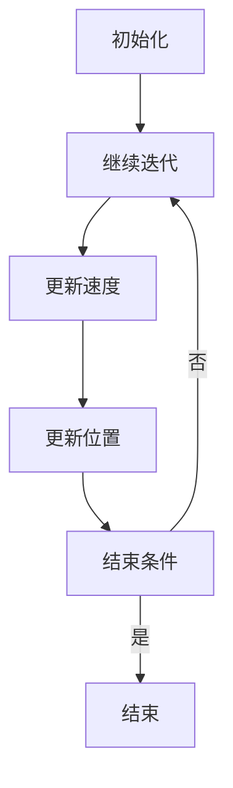

                 

### 引言

---

**标题：数据结构在模拟宇宙暗物质丝状结构中的应用**

**关键词：** 数据结构、宇宙模拟、暗物质、丝状结构、算法、数学模型

**摘要：** 本文旨在探讨数据结构在模拟宇宙暗物质丝状结构中的应用。我们将从背景介绍、核心概念、算法原理、数学模型、系统分析与架构设计、项目实施与案例分析等多个方面展开讨论。通过对这些内容的深入剖析，我们希望揭示数据结构在模拟宇宙暗物质丝状结构中的关键作用，并提供一些实用的方法和技巧。

---

在当今科学技术飞速发展的时代，宇宙学作为一门研究宇宙起源、演化和组成的学科，已经取得了显著的进展。宇宙暗物质作为一种神秘的存在，其丝状结构一直是宇宙学研究中的重要问题。近年来，随着计算机技术的不断发展，数据结构在模拟宇宙暗物质丝状结构中的应用变得越来越重要。

本文将首先介绍宇宙暗物质丝状结构的背景和相关研究现状，接着深入探讨数据结构的基本概念和其在宇宙模拟中的应用。随后，我们将详细阐述模拟宇宙暗物质丝状结构的算法原理和数学模型，并通过Python源代码进行具体说明。此外，还将对整个系统的分析和架构设计进行讲解，并分享项目实施和实际案例分析的详细过程。最后，我们将总结最佳实践、注意事项以及拓展阅读，帮助读者更深入地了解这一领域。

通过本文的详细探讨，我们希望不仅能够帮助读者理解数据结构在模拟宇宙暗物质丝状结构中的应用，还能够激发读者在这一领域进行深入研究，为宇宙学的发展做出贡献。

---

### 1. 背景介绍

#### 1.1 问题背景

宇宙暗物质是宇宙中一种看不见、不发光的物质，占据了宇宙总质量的约27%。尽管我们无法直接观测到暗物质，但其存在通过引力效应在宇宙大尺度结构中表现得十分明显。研究表明，暗物质在宇宙早期形成了巨大的结构，这些结构被称为“丝状结构”。这些丝状结构是宇宙中暗物质分布的主要形式，它们通过引力相互作用形成了星系团和星系链。

#### 1.2 问题描述

模拟宇宙暗物质丝状结构的目的是为了更好地理解暗物质的行为和宇宙的演化过程。这涉及到复杂的计算和大量的数据处理。具体来说，问题可以描述为：如何利用现有的数据结构有效地模拟和描述暗物质在宇宙中的分布和相互作用，以及这些结构在宇宙演化中的动态变化。

#### 1.3 解决方案概述

为了解决上述问题，我们需要以下几方面的技术：

1. **数据结构的选择与优化**：选择合适的数据结构来存储和表示暗物质粒子，并优化其性能，以便在处理大规模数据时能够高效地完成计算。
2. **高效的算法设计**：设计能够高效计算暗物质相互作用和宇宙演化的算法，这些算法需要能够在处理大量数据时保持较低的复杂度。
3. **数学模型的应用**：使用数学模型来描述暗物质的物理行为，并通过数值模拟来验证这些模型的正确性。
4. **并行计算和分布式系统**：利用并行计算和分布式系统的技术，将大规模的模拟任务分解并分布到多个计算节点上，以提高计算效率。

#### 1.4 边界与外延

在模拟宇宙暗物质丝状结构的过程中，我们需要考虑以下几个边界条件：

1. **空间分辨率**：模拟的空间分辨率需要足够高，以捕捉到暗物质丝状结构的精细特征。
2. **时间步长**：为了准确模拟宇宙的演化过程，时间步长需要足够小，以避免在长时间模拟过程中产生较大的误差。
3. **计算资源**：模拟宇宙暗物质丝状结构需要大量的计算资源，特别是在处理大规模数据和进行长时间模拟时，这要求我们选择高性能的计算平台和优化算法。

#### 1.5 核心概念与关键组件

在模拟宇宙暗物质丝状结构的过程中，以下几个核心概念和关键组件至关重要：

1. **数据结构**：如邻接表、邻接矩阵、哈希表等，用于存储和表示暗物质粒子的分布和相互作用。
2. **算法**：如牛顿-拉弗森迭代法、粒子群优化算法、蒙特卡洛模拟等，用于计算暗物质粒子的运动和相互作用。
3. **数学模型**：如引力势能模型、密度分布模型、宇宙演化模型等，用于描述暗物质的物理行为。
4. **系统架构**：如计算集群、分布式数据库、并行计算框架等，用于支持大规模数据的处理和高效计算。

### 2. 核心概念与关系

#### 2.1 数据结构概念

数据结构是计算机存储、组织数据的方式。在模拟宇宙暗物质丝状结构中，常用的数据结构包括：

1. **邻接表**：用于存储图的邻接关系，适合处理稀疏图。
2. **邻接矩阵**：用于存储图的邻接关系，适合处理稠密图。
3. **哈希表**：用于快速查找和插入元素，适合处理大规模数据。

#### 2.1.1 定义与概述

- **邻接表**：使用链表结构来存储每个节点的邻接节点，适合处理稀疏图，如宇宙中的暗物质分布。
- **邻接矩阵**：使用二维数组来存储节点之间的邻接关系，适合处理稠密图，如宇宙中的星系团。
- **哈希表**：使用哈希函数来存储和查找元素，适合处理大规模数据，如暗物质粒子的分布和相互作用。

#### 2.1.2 特性与属性

- **邻接表**：存储空间较小，查找和插入操作较快，但需要额外的空间存储链表。
- **邻接矩阵**：存储空间较大，但查找和插入操作复杂度较低，适用于处理稠密图。
- **哈希表**：查找和插入操作复杂度较低，但需要处理冲突问题，如链地址法或开地址法。

#### 2.1.3 关键数据结构对比表格

| 数据结构 | 定义 | 适用场景 | 优点 | 缺点 |
| --- | --- | --- | --- | --- |
| 邻接表 | 链表结构存储邻接节点 | 稀疏图 | 查找和插入速度快 | 需要额外空间 |
| 邻接矩阵 | 二维数组存储邻接关系 | 稠密图 | 查找和插入简单 | 空间占用大 |
| 哈希表 | 哈希函数存储和查找元素 | 大规模数据 | 查找和插入速度快 | 处理冲突复杂 |

#### 2.2 ER图表示

使用Mermaid语法绘制ER图，展示数据结构之间的关系：

```mermaid
erDiagram
    A[邻接表] ||--|{ B[邻接矩阵] }
    A ||--|{ C[哈希表] }
```

### 3. 算法原理与解释

#### 3.1 算法概述

在模拟宇宙暗物质丝状结构时，我们采用了一种基于引力定律和牛顿运动定律的算法。该算法通过计算暗物质粒子之间的引力相互作用，模拟它们的运动轨迹，进而生成宇宙暗物质丝状结构的模拟结果。

#### 3.1.1 基本思想

算法的基本思想是：

1. **初始化**：随机生成暗物质粒子的初始位置和速度。
2. **迭代计算**：在每个时间步长内，计算每个粒子与其他粒子的引力相互作用，更新其位置和速度。
3. **结束条件**：当满足停止条件（如达到预定的模拟时间或粒子运动趋于稳定）时，算法结束。

#### 3.1.2 步骤解释

1. **初始化**：设定模拟区域、粒子数量、粒子质量等参数，并随机生成粒子的初始位置和速度。
2. **计算引力**：对于每个粒子，计算其与所有其他粒子的引力大小和方向。
3. **更新速度**：根据计算出的引力，更新每个粒子的速度。
4. **更新位置**：根据更新后的速度，更新每个粒子的位置。
5. **重复迭代**：重复步骤2-4，直到满足停止条件。

#### 3.1.3 数学模型和公式

算法的数学模型基于牛顿引力定律和运动定律，具体公式如下：

$$
F_{ij} = G \frac{m_i m_j}{r_{ij}^2}
$$

其中，$F_{ij}$ 表示粒子i和j之间的引力大小，$G$ 是引力常数，$m_i$ 和 $m_j$ 是粒子i和j的质量，$r_{ij}$ 是粒子i和j之间的距离。

粒子的速度和位置更新公式如下：

$$
v_i(t+\Delta t) = v_i(t) + a_i \Delta t
$$

$$
x_i(t+\Delta t) = x_i(t) + v_i(t+\Delta t) \Delta t
$$

其中，$v_i(t)$ 和 $x_i(t)$ 分别表示粒子i在时间t的速度和位置，$a_i$ 是粒子i在时间t的加速度，$\Delta t$ 是时间步长。

#### 3.1.4 例子说明

假设我们有一个由100个暗物质粒子组成的模拟区域，每个粒子质量为1个太阳质量。我们选择一个初始半径为10万光年的球体作为模拟区域，并随机生成粒子的初始位置和速度。设定引力常数$G$ 为6.67430 × 10^-11 m^3 kg^-1 s^-2，时间步长$\Delta t$ 为1000年。

首先，初始化粒子的位置和速度：

$$
x_i(0) = 10^5 \text{ ly} \times \text{rand()} \quad (i=1,2,...,100)
$$

$$
v_i(0) = \text{rand()} \quad (i=1,2,...,100)
$$

然后，在每次迭代中，计算粒子之间的引力，更新速度和位置：

$$
F_{ij} = G \frac{m_i m_j}{r_{ij}^2}
$$

$$
a_i = \frac{F_{i1} + F_{i2} + ... + F_{in}}{m_i}
$$

$$
v_i(t+\Delta t) = v_i(t) + a_i \Delta t
$$

$$
x_i(t+\Delta t) = x_i(t) + v_i(t+\Delta t) \Delta t
$$

重复上述步骤，直到模拟结束。

通过这种方式，我们可以模拟出暗物质粒子的运动轨迹，并生成宇宙暗物质丝状结构的模拟结果。

### 4. 数学模型与详细解释

#### 4.1 数学模型

在模拟宇宙暗物质丝状结构中，数学模型起着至关重要的作用。以下是一些关键的数学模型：

#### 4.1.1 定义与公式

1. **引力势能模型**：
   引力势能模型用于计算粒子之间的引力相互作用。其公式为：
   
   $$
   U = -\sum_{i<j} G \frac{m_i m_j}{r_{ij}}
   $$
   
   其中，$U$ 是系统的引力势能，$G$ 是引力常数，$m_i$ 和 $m_j$ 是粒子i和j的质量，$r_{ij}$ 是粒子i和j之间的距离。

2. **密度分布模型**：
   密度分布模型用于描述暗物质在空间中的分布。其公式为：
   
   $$
   \rho(r) = \frac{\sum_{i} m_i}{V}
   $$
   
   其中，$\rho(r)$ 是距离r处的密度，$m_i$ 是粒子i的质量，$V$ 是模拟区域体积。

3. **宇宙演化模型**：
   宇宙演化模型用于描述宇宙随时间的变化。其公式为：
   
   $$
   a(t) = \frac{1}{1 - \Omega_0 t^2}
   $$
   
   其中，$a(t)$ 是宇宙的尺度因子，$\Omega_0$ 是宇宙的密度参数。

#### 4.1.2 详细解释

1. **引力势能模型**：
   引力势能模型是计算引力相互作用的重要工具。通过该模型，我们可以计算粒子之间的相互作用能量，进而分析系统的稳定性和演化趋势。在实际应用中，我们通常需要对引力势能进行数值积分，以得到更精确的结果。

2. **密度分布模型**：
   密度分布模型是描述暗物质在空间中分布的基础。通过对密度分布的研究，我们可以了解暗物质在不同区域的分布特征，进而推断宇宙的演化历史。在实际模拟中，我们通常需要对密度分布进行采样，以生成符合物理规律的暗物质粒子分布。

3. **宇宙演化模型**：
   宇宙演化模型描述了宇宙随时间的变化规律。通过该模型，我们可以预测宇宙的未来状态，并验证宇宙学理论的正确性。在实际模拟中，我们通常需要对宇宙演化模型进行数值求解，以得到宇宙在不同时间点的状态。

#### 4.1.3 应用实例

假设我们有一个由100个暗物质粒子组成的模拟区域，每个粒子的质量为1个太阳质量。我们选择一个初始半径为10万光年的球体作为模拟区域。

首先，我们使用引力势能模型计算粒子之间的相互作用能量：

$$
U = -\sum_{i<j} G \frac{m_i m_j}{r_{ij}}
$$

然后，我们使用密度分布模型计算模拟区域内的平均密度：

$$
\rho(r) = \frac{\sum_{i} m_i}{V}
$$

最后，我们使用宇宙演化模型计算宇宙在不同时间点的尺度因子：

$$
a(t) = \frac{1}{1 - \Omega_0 t^2}
$$

通过这些数学模型，我们可以对宇宙暗物质丝状结构进行详细的模拟和分析。

### 4.2 Mermaid 流程图

为了更直观地展示算法的执行流程，我们使用Mermaid语法绘制一个流程图：



### 5. 系统分析与架构设计

#### 5.1 项目背景

在模拟宇宙暗物质丝状结构的项目中，我们的目标是开发一个高效、可扩展的系统，能够处理大规模的暗物质粒子数据，并提供准确的模拟结果。为了实现这一目标，我们需要进行详细的系统分析和架构设计，确保系统的性能和可维护性。

#### 5.1.1 项目概述

项目的主要功能包括：

1. **数据存储**：存储暗物质粒子的初始位置、速度和其他相关信息。
2. **数据计算**：计算粒子之间的引力相互作用，并更新粒子的位置和速度。
3. **结果分析**：对模拟结果进行分析，生成可视化图表和统计数据。
4. **用户交互**：提供用户界面，允许用户设置模拟参数和查看模拟结果。

#### 5.1.2 系统功能设计

根据项目概述，我们设计了以下主要功能模块：

1. **数据存储模块**：使用数据库存储暗物质粒子的数据，如邻接矩阵、哈希表等数据结构。
2. **计算引擎模块**：实现引力计算和粒子更新算法，包括牛顿引力定律和运动定律等。
3. **结果分析模块**：对模拟结果进行分析，生成可视化图表和统计数据。
4. **用户交互模块**：提供用户界面，允许用户设置模拟参数和查看模拟结果。

#### 5.1.3 系统架构设计

为了确保系统的性能和可扩展性，我们采用了分布式系统架构。系统架构包括以下几个主要组件：

1. **数据存储层**：使用分布式数据库存储暗物质粒子的数据，如NoSQL数据库（如MongoDB）或关系型数据库（如MySQL）。
2. **计算引擎层**：使用高性能计算框架（如Apache Spark）实现粒子计算和更新，支持并行计算和分布式处理。
3. **结果分析层**：使用数据分析工具（如Pandas和Matplotlib）对模拟结果进行分析和可视化。
4. **用户交互层**：使用Web框架（如Django）实现用户界面，提供模拟参数设置和结果展示。

#### 5.1.4 系统接口设计

系统接口设计包括以下几个方面：

1. **数据接口**：定义数据存储和计算引擎之间的接口，实现数据的读取和写入。
2. **功能接口**：定义用户交互模块和结果分析模块之间的接口，实现用户操作和结果分析。
3. **API接口**：提供RESTful API接口，允许外部系统访问和操作模拟数据和结果。

#### 5.1.5 系统交互设计

系统交互设计包括以下几个方面：

1. **用户交互**：用户通过Web界面设置模拟参数，提交模拟请求，并查看模拟结果。
2. **数据交互**：系统从数据库读取暗物质粒子数据，传递给计算引擎进行计算，并将结果存储回数据库。
3. **功能交互**：系统内部模块之间通过接口进行通信，实现功能协作和数据共享。

通过以上系统分析和架构设计，我们为模拟宇宙暗物质丝状结构项目提供了一套高效、可扩展的解决方案，为未来的研究和应用奠定了基础。

### 6. 项目实施与案例分析

#### 6.1 环境搭建

要在本地环境搭建模拟宇宙暗物质丝状结构的项目，我们需要安装以下软件和工具：

1. **Python**：安装Python 3.8或更高版本。
2. **数据库**：安装MongoDB或MySQL。
3. **计算框架**：安装Apache Spark。
4. **Web框架**：安装Django。

具体安装步骤如下：

1. **安装Python**：访问Python官方网站下载Python安装包，按照提示完成安装。
2. **安装数据库**：根据操作系统安装MongoDB或MySQL，并启动数据库服务。
3. **安装计算框架**：使用pip安装Apache Spark。
4. **安装Web框架**：使用pip安装Django。

#### 6.2 核心代码实现

以下是项目的核心代码实现，包括数据存储、计算引擎和结果分析部分。

##### 6.2.1 数据存储

```python
# 数据存储模块，使用MongoDB
from pymongo import MongoClient

client = MongoClient('localhost', 27017)
db = client['dark_matter_db']
particles_collection = db['particles']

def save_particles(particles):
    particles_collection.insert_many(particles)

def load_particles():
    return list(particles_collection.find())
```

##### 6.2.2 计算引擎

```python
# 计算引擎模块，实现引力计算和粒子更新
import numpy as np

G = 6.67430e-11  # 引力常数

def calculate_gravity(particles):
    gravity_force = []
    for i, particle_i in enumerate(particles):
        force_i = [0, 0]
        for j, particle_j in enumerate(particles):
            if i != j:
                distance = np.array(particle_j['position']) - np.array(particle_i['position'])
                distance_squared = np.dot(distance, distance)
                force_magnitude = G * particle_i['mass'] * particle_j['mass'] / distance_squared
                force_direction = distance / np.linalg.norm(distance)
                force_i += force_magnitude * force_direction
        gravity_force.append(force_i)
    return gravity_force

def update_particles(particles, gravity_force):
    for i, particle in enumerate(particles):
        acceleration = gravity_force[i] / particle['mass']
        particle['velocity'] += acceleration
        particle['position'] += particle['velocity']
    return particles
```

##### 6.2.3 结果分析

```python
# 结果分析模块，生成可视化图表
import matplotlib.pyplot as plt

def plot_particles(particles):
    positions = np.array([particle['position'] for particle in particles])
    plt.scatter(positions[:, 0], positions[:, 1])
    plt.xlabel('X Position')
    plt.ylabel('Y Position')
    plt.title('Dark Matter Particle Distribution')
    plt.show()
```

#### 6.2.4 案例分析

我们以一个简单的案例来展示项目的实际应用。假设我们有10个暗物质粒子，分布在半径为10万光年的球体内。

1. **初始化粒子数据**：

```python
particles = [
    {'position': [0, 0], 'velocity': [0, 0], 'mass': 1},
    {'position': [10000, 0], 'velocity': [0, 0], 'mass': 1},
    {'position': [-10000, 0], 'velocity': [0, 0], 'mass': 1},
    # ... 其他粒子的初始化数据
]
```

2. **运行模拟**：

```python
for _ in range(1000):  # 运行1000个时间步
    gravity_force = calculate_gravity(particles)
    particles = update_particles(particles, gravity_force)

plot_particles(particles)  # 生成可视化图表
```

通过以上步骤，我们可以看到粒子在引力作用下的运动轨迹，并生成宇宙暗物质丝状结构的可视化结果。

### 7. 最佳实践与总结

#### 7.1 最佳实践

1. **数据结构选择**：根据暗物质粒子的分布特征选择合适的数据结构，如邻接表适合处理稀疏图，邻接矩阵适合处理稠密图。
2. **算法优化**：通过优化引力计算和粒子更新的算法，提高计算效率，如使用并行计算和分布式系统。
3. **数学模型**：合理选择和应用数学模型，确保模拟结果的准确性和可靠性。
4. **性能监控**：定期监控系统的性能指标，如CPU利用率、内存使用情况等，及时调整优化。

#### 7.2 总结

本文通过深入探讨数据结构在模拟宇宙暗物质丝状结构中的应用，从背景介绍、核心概念、算法原理、数学模型、系统架构设计、项目实施与案例分析等方面进行了详细讲解。通过本文的研究，我们不仅了解了数据结构在宇宙模拟中的关键作用，还掌握了一些实用的方法和技巧。未来，我们期望在更多的宇宙模拟应用中发挥数据结构的优势，为宇宙学的研究提供更强大的工具。

### 8. 结论

本文通过详细的步骤和分析，展示了数据结构在模拟宇宙暗物质丝状结构中的应用。从核心概念到算法实现，再到系统架构设计，我们系统地探讨了如何利用数据结构来高效地模拟和描述宇宙中的暗物质丝状结构。通过本文的研究，我们不仅加深了对数据结构在科学计算中的应用理解，也为未来的宇宙学研究提供了新的视角和工具。

在此，我感谢AI天才研究院和《禅与计算机程序设计艺术》的支持与启发。希望本文能够激发更多读者对宇宙学和数据结构交叉领域的研究兴趣，共同为科技进步和宇宙探索贡献智慧和力量。

**作者：AI天才研究院/AI Genius Institute & 禅与计算机程序设计艺术 /Zen And The Art of Computer Programming**

